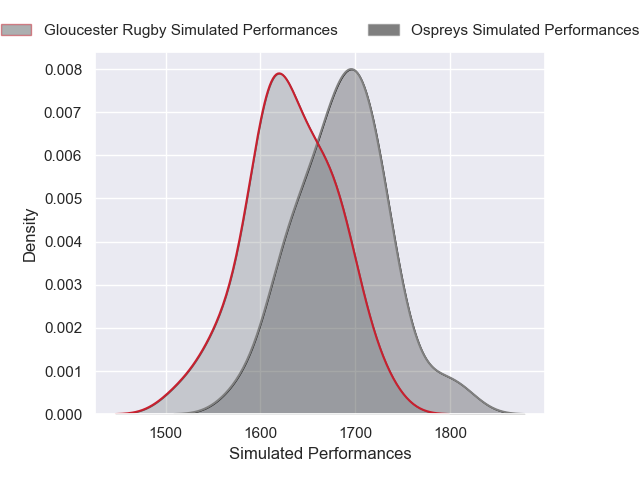
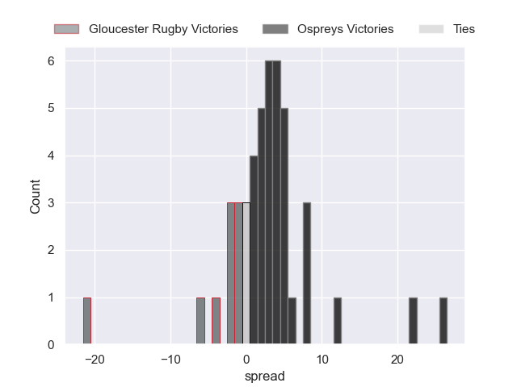

---  
title: "European Rugby Challenge Cup 24/25 Status"  
date: 2025-04-11 6:00:00 -0500  
categories: model review projection  
layout: article  
aside:  
    toc: true  
---
# Current Team Rankings

# Pool Results

## Pool A

## Current Standings

| Club          |   Played |   Wins |   Point Differential |   Losing Bonus Points |   Try Bonus Points |
|:--------------|---------:|-------:|---------------------:|----------------------:|-------------------:|
| Connacht      |        6 |      6 |                   98 |                     0 |                nan |
| Lyon          |        6 |      5 |                  110 |                     0 |                nan |
| Perpignan     |        5 |      3 |                   34 |                     0 |                  1 |
| Cardiff Blues |        5 |      1 |                  -22 |                     1 |                  2 |
| Cheetahs      |        4 |      1 |                  -59 |                     0 |                  0 |
| Zebre         |        4 |      0 |                  -55 |                     2 |                  0 |

### Projected Total Table

| Club          |   Played |   Wins |   Point Differential |   Losing Bonus Points |   Try Bonus Points |   Competition Points | Pool   |
|:--------------|---------:|-------:|---------------------:|----------------------:|-------------------:|---------------------:|:-------|
| Connacht      |        6 |      6 |                   98 |                     0 |                nan |                   29 | PoolA  |
| Lyon          |        6 |      5 |                  110 |                     0 |                nan |                   23 | PoolA  |
| Perpignan     |        5 |      3 |                   34 |                     0 |                  1 |                   15 | PoolA  |
| Cardiff Blues |        5 |      1 |                  -22 |                     1 |                  2 |                    7 | PoolA  |
| Cheetahs      |        4 |      1 |                  -59 |                     0 |                  0 |                    6 | PoolA  |
| Zebre         |        4 |      0 |                  -55 |                     2 |                  0 |                    2 | PoolA  |

## Pool B

## Current Standings

| Club                |   Played |   Wins |   Point Differential |   Losing Bonus Points |   Try Bonus Points |
|:--------------------|---------:|-------:|---------------------:|----------------------:|-------------------:|
| Montpellier Herault |        5 |      4 |                   83 |                     1 |                  3 |
| Ospreys             |        6 |      4 |                  -63 |                     0 |                nan |
| Lions               |        5 |      3 |                   64 |                     0 |                  2 |
| Pau                 |        5 |      2 |                  -34 |                     1 |                  3 |
| Dragons             |        4 |      1 |                  -55 |                     1 |                  0 |
| Newcastle Falcons   |        4 |      0 |                  -60 |                     0 |                  0 |

### Projected Total Table

| Club                |   Played |   Wins |   Point Differential |   Losing Bonus Points |   Try Bonus Points |   Competition Points | Pool   |
|:--------------------|---------:|-------:|---------------------:|----------------------:|-------------------:|---------------------:|:-------|
| Montpellier Herault |        5 |      4 |                   83 |                     1 |                  3 |                   20 | PoolB  |
| Ospreys             |        6 |      4 |                  -63 |                     0 |                nan |                   20 | PoolB  |
| Lions               |        5 |      3 |                   64 |                     0 |                  2 |                   14 | PoolB  |
| Pau                 |        5 |      2 |                  -34 |                     1 |                  3 |                   12 | PoolB  |
| Dragons             |        4 |      1 |                  -55 |                     1 |                  0 |                    5 | PoolB  |
| Newcastle Falcons   |        4 |      0 |                  -60 |                     0 |                  0 |                    0 | PoolB  |

## Pool C

## Current Standings

| Club             |   Played |   Wins |   Point Differential |   Losing Bonus Points |   Try Bonus Points |
|:-----------------|---------:|-------:|---------------------:|----------------------:|-------------------:|
| Edinburgh        |        6 |      4 |                   26 |                     1 |                nan |
| Bayonne          |        5 |      3 |                   22 |                     1 |                  2 |
| Gloucester Rugby |        6 |      3 |                  -51 |                     0 |                nan |
| Scarlets         |        5 |      2 |                    2 |                     2 |                  2 |
| Vannes           |        4 |      1 |                    7 |                     2 |                  2 |
| Black Lion       |        4 |      1 |                  -61 |                     0 |                  0 |

### Projected Total Table

| Club             |   Played |   Wins |   Point Differential |   Losing Bonus Points |   Try Bonus Points |   Competition Points | Pool   |
|:-----------------|---------:|-------:|---------------------:|----------------------:|-------------------:|---------------------:|:-------|
| Edinburgh        |        6 |      4 |                   26 |                     1 |                nan |                   21 | PoolC  |
| Bayonne          |        5 |      3 |                   22 |                     1 |                  2 |                   15 | PoolC  |
| Gloucester Rugby |        6 |      3 |                  -51 |                     0 |                nan |                   13 | PoolC  |
| Scarlets         |        5 |      2 |                    2 |                     2 |                  2 |                   12 | PoolC  |
| Vannes           |        4 |      1 |                    7 |                     2 |                  2 |                    8 | PoolC  |
| Black Lion       |        4 |      1 |                  -61 |                     0 |                  0 |                    4 | PoolC  |

# Projected Playoff Results

|                  | Reach Quarterfinals   | Reach Semifinals   | Reach Final   | Win Final   |
|:-----------------|:----------------------|:-------------------|:--------------|:------------|
| Bath Rugby       | 100.0 %               | 91.8 %             | 66.3 %        | 54.9 %      |
| Connacht         | 100.0 %               | 77.4 %             | 25.1 %        | 12.7 %      |
| Edinburgh        | 100.0 %               | 60.2 %             | 41.6 %        | 12.4 %      |
| Bulls            | 100.0 %               | 39.8 %             | 26.3 %        | 11.5 %      |
| Lyon             | 100.0 %               | 45.1 %             | 18.0 %        | 4.0 %       |
| Ospreys          | 100.0 %               | 54.9 %             | 13.5 %        | 2.2 %       |
| Racing 92        | 100.0 %               | 22.6 %             | 7.2 %         | 1.2 %       |
| Gloucester Rugby | 100.0 %               | 8.2 %              | 2.0 %         | 1.1 %       |

# Knockout Match Predictions

## Quarterfinals

### Ospreys V Lyon on 2025/04/12

Average Margin: Ospreys by 0.6

### Edinburgh V Bulls on 2025/04/12

Average Margin: Edinburgh by 1.5

### Connacht V Racing 92 on 2025/04/12

Average Margin: Connacht by 5.0

### Bath Rugby V Gloucester Rugby on 2025/04/13

Average Margin: Bath Rugby by 12.0

## Semifinals

### Gloucester Rugby V Bulls on 2025/05/02

Average Margin: Bulls by 2.0

### Edinburgh V Ospreys on 2025/05/02

Average Margin: Edinburgh by 7.1

### Connacht V Bulls on 2025/05/02

Average Margin: Bulls by 4.1

### Lyon V Racing 92 on 2025/05/02

Average Margin: Lyon by 3.9

### Ospreys V Gloucester Rugby on 2025/05/02

Average Margin: Ospreys by 2.8

### Edinburgh V Lyon on 2025/05/02

Average Margin: Edinburgh by 4.0

### Ospreys V Racing 92 on 2025/05/02

Average Margin: Ospreys by 1.8

### Edinburgh V Bath Rugby on 2025/05/02

Average Margin: Bath Rugby by 6.5

### Lyon V Gloucester Rugby on 2025/05/02

Average Margin: Lyon by 7.2

### Ospreys V Bath Rugby on 2025/05/02

Average Margin: Bath Rugby by 12.1

### Lyon V Bulls on 2025/05/02

Average Margin: Bulls by 0.2

### Edinburgh V Racing 92 on 2025/05/02

Average Margin: Edinburgh by 7.8

### Bulls V Racing 92 on 2025/05/02

Average Margin: Bulls by 5.7

### Lyon V Bath Rugby on 2025/05/02

Average Margin: Bath Rugby by 7.1

### Ospreys V Bulls on 2025/05/02

Average Margin: Bulls by 3.2

### Connacht V Bath Rugby on 2025/05/02

Average Margin: Bath Rugby by 3.4

### Connacht V Gloucester Rugby on 2025/05/02

Average Margin: Connacht by 4.4

## Finals

### Lyon V Racing 92 on 2025/05/24

Average Margin: Lyon by 3.9

### Edinburgh V Racing 92 on 2025/05/24

Average Margin: Edinburgh by 7.8

### Ospreys V Bulls on 2025/05/24

Average Margin: Bulls by 3.2

### Ospreys V Gloucester Rugby on 2025/05/24

Average Margin: Ospreys by 2.8

### Lyon V Gloucester Rugby on 2025/05/24

Average Margin: Lyon by 7.2

### Edinburgh V Ospreys on 2025/05/24

Average Margin: Edinburgh by 7.1

### Edinburgh V Lyon on 2025/05/24

Average Margin: Edinburgh by 4.0

### Lyon V Bulls on 2025/05/24

Average Margin: Bulls by 0.2

### Racing 92 V Bath Rugby on 2025/05/24

Average Margin: Bath Rugby by 7.0

### Connacht V Edinburgh on 2025/05/24

Average Margin: Edinburgh by 0.1

### Edinburgh V Bath Rugby on 2025/05/24

Average Margin: Bath Rugby by 6.5

### Connacht V Lyon on 2025/05/24

Average Margin: Connacht by 1.5

### Lyon V Bath Rugby on 2025/05/24

Average Margin: Bath Rugby by 7.1

### Connacht V Ospreys on 2025/05/24

Average Margin: Connacht by 5.9

### Bath Rugby V Bulls on 2025/05/24

Average Margin: Bath Rugby by 3.1

### Connacht V Bulls on 2025/05/24

Average Margin: Bulls by 4.1

### Ospreys V Bath Rugby on 2025/05/24

Average Margin: Bath Rugby by 12.1

### Gloucester Rugby V Bulls on 2025/05/24

Average Margin: Bulls by 2.0

# Completed Match Review

| Match                                                 |   Result |   Lineup Prediction |   Minutes Prediction |   Club Prediction |
|:------------------------------------------------------|---------:|--------------------:|---------------------:|------------------:|
| Black Lion V Vannes on 2024/12/07                     |        3 |                 8.3 |                  7.8 |               8.9 |
| Lyon V Cardiff Blues on 2024/12/07                    |       11 |                 1.9 |                  4.7 |               9   |
| Connacht V Zebre on 2024/12/07                        |       31 |                16   |                 11.1 |              14.2 |
| Cheetahs V Perpignan on 2024/12/08                    |        0 |                 6.1 |                  7.5 |               4   |
| Pau V Newcastle Falcons on 2024/12/08                 |       13 |                -0.4 |                 -1.6 |              11.6 |
| Ospreys V Lions on 2024/12/08                         |       16 |                 3.6 |                 -1.5 |               0   |
| Edinburgh V Bayonne on 2024/12/13                     |       40 |                 9.9 |                  2.3 |               6.4 |
| Lions V Pau on 2024/12/14                             |        8 |                23.3 |                 26.1 |               8.4 |
| Montpellier Herault V Ospreys on 2024/12/14           |       44 |                 5   |                  8.6 |               6.9 |
| Cardiff Blues V Cheetahs on 2024/12/14                |       16 |                 0.4 |                 -6.3 |               2.7 |
| Scarlets V Black Lion on 2024/12/15                   |       18 |                -1   |                 -2.5 |               0.3 |
| Newcastle Falcons V Dragons on 2024/12/15             |       -8 |                -3.3 |                  2.6 |               6.2 |
| Gloucester Rugby V Scarlets on 2025/01/10             |       24 |                -2.3 |                 -0.5 |               6.8 |
| Black Lion V Bayonne on 2025/01/11                    |      -25 |                -7.7 |                 -8.1 |               1   |
| Montpellier Herault V Lions on 2025/01/11             |       23 |                 0.5 |                 -3.8 |               4.3 |
| Dragons V Pau on 2025/01/12                           |       -9 |                -5.2 |                 -3.3 |              -3.6 |
| Cheetahs V Zebre on 2025/01/12                        |        4 |                 6   |                 10.4 |               8.3 |
| Newcastle Falcons V Montpellier Herault on 2025/01/17 |      -19 |               -16.5 |                -39.6 |              -6.6 |
| Lyon V Cheetahs on 2025/01/18                         |       47 |                 8.4 |                 10.3 |              10.4 |
| Edinburgh V Black Lion on 2025/01/19                  |       21 |                 9.1 |                  5.5 |              10.1 |
| Zebre V Perpignan on 2025/01/19                       |      -18 |                -4.2 |                 -3.5 |              -2.5 |
| Bayonne V Gloucester Rugby on 2025/01/19              |       38 |                 3.9 |                  1.6 |               5.4 |
| Bath Rugby V Gloucester Rugby on 2025/04/13           |       25 |                12.7 |                 12.6 |              12.1 |

# Model Accuracies

| Model | Percent Correct Predictions | Spread Error |
| ------ | ------ | ------ |
| Club Level | 79.2% | 15.3 |
| Player Level: Lineup | 82.6% | 16.1 |
| Player Level: Minutes | 65.2% | 18.8 |

