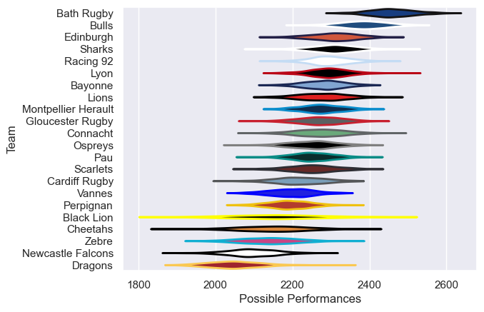

---  
title: "European Rugby Challenge Cup 24/25 Status"  
date: 2025-07-28 6:00:00 -0500  
categories: model review projection  
layout: article  
aside:  
    toc: true  
---
# Current Team Rankings

# Standings

## Current Standings

| Club                |   Played |   Wins |   Point Differential |   Losing Bonus Points |   Try Bonus Points |   Competition Points |
|:--------------------|---------:|-------:|---------------------:|----------------------:|-------------------:|---------------------:|
| Connacht            |        4 |      4 |                   81 |                     0 |                  4 |                   20 |
| Montpellier Herault |        4 |      4 |                   90 |                     0 |                  3 |                   19 |
| Edinburgh           |        4 |      3 |                   60 |                     1 |                  3 |                   16 |
| Ospreys             |        4 |      3 |                   -5 |                     0 |                  3 |                   15 |
| Lyon                |        4 |      3 |                   32 |                     0 |                  2 |                   14 |
| Bayonne             |        4 |      3 |                   24 |                     0 |                  2 |                   14 |
| Pau                 |        4 |      2 |                   11 |                     1 |                  3 |                   12 |
| Perpignan           |        4 |      2 |                    8 |                     0 |                  1 |                   11 |
| Scarlets            |        4 |      2 |                    3 |                     1 |                  2 |                   11 |
| Lions               |        4 |      2 |                   19 |                     0 |                  2 |                   10 |
| Gloucester Rugby    |        4 |      2 |                  -33 |                     0 |                  1 |                    9 |
| Vannes              |        4 |      1 |                    7 |                     2 |                  2 |                    8 |
| Cardiff Rugby       |        4 |      1 |                   -7 |                     1 |                  2 |                    7 |
| Cheetahs            |        4 |      1 |                  -59 |                     0 |                    |                    6 |
| Dragons             |        4 |      1 |                  -55 |                     1 |                    |                    5 |
| Black Lion          |        4 |      1 |                  -61 |                     0 |                    |                    4 |
| Zebre               |        4 |      0 |                  -55 |                     2 |                    |                    2 |
| Newcastle Falcons   |        4 |      0 |                  -60 |                     0 |                    |                    0 |

## Projected Playoff Results

|                     | Reach Round of 16   | Win Round of 16   | Reach Quarterfinal   | Win Quarterfinal   | Reach Semifinal   | Win Semifinal   | Reach Final   | Win Final   |
|:--------------------|:--------------------|:------------------|:---------------------|:-------------------|:------------------|:----------------|:--------------|:------------|
| Bath Rugby          | 100.0 %             | 100.0 %           | 100.0 %              | 100.0 %            | 100.0 %           | 100.0 %         | 100.0 %       | 100.0 %     |
| Lyon                | 100.0 %             | 100.0 %           | 100.0 %              | 100.0 %            | 100.0 %           | 100.0 %         | 100.0 %       | 0.0 %       |
| Edinburgh           | 100.0 %             | 100.0 %           | 100.0 %              | 100.0 %            | 100.0 %           | 0.0 %           | 0.0 %         | 0.0 %       |
| Racing 92           | 100.0 %             | 100.0 %           | 100.0 %              | 100.0 %            | 100.0 %           | 0.0 %           | 0.0 %         | 0.0 %       |
| Connacht            | 100.0 %             | 100.0 %           | 100.0 %              | 0.0 %              | 0.0 %             | 0.0 %           | 0.0 %         | 0.0 %       |
| Ospreys             | 100.0 %             | 100.0 %           | 100.0 %              | 0.0 %              | 0.0 %             | 0.0 %           | 0.0 %         | 0.0 %       |
| Bulls               | 100.0 %             | 100.0 %           | 100.0 %              | 0.0 %              | 0.0 %             | 0.0 %           | 0.0 %         | 0.0 %       |
| Gloucester Rugby    | 100.0 %             | 100.0 %           | 100.0 %              | 0.0 %              | 0.0 %             | 0.0 %           | 0.0 %         | 0.0 %       |
| Pau                 | 100.0 %             | 0.0 %             | 0.0 %                | 0.0 %              | 0.0 %             | 0.0 %           | 0.0 %         | 0.0 %       |
| Perpignan           | 100.0 %             | 0.0 %             | 0.0 %                | 0.0 %              | 0.0 %             | 0.0 %           | 0.0 %         | 0.0 %       |
| Bayonne             | 100.0 %             | 0.0 %             | 0.0 %                | 0.0 %              | 0.0 %             | 0.0 %           | 0.0 %         | 0.0 %       |
| Montpellier Herault | 100.0 %             | 0.0 %             | 0.0 %                | 0.0 %              | 0.0 %             | 0.0 %           | 0.0 %         | 0.0 %       |
| Lions               | 100.0 %             | 0.0 %             | 0.0 %                | 0.0 %              | 0.0 %             | 0.0 %           | 0.0 %         | 0.0 %       |
| Cardiff Rugby       | 100.0 %             | 0.0 %             | 0.0 %                | 0.0 %              | 0.0 %             | 0.0 %           | 0.0 %         | 0.0 %       |
| Sharks              | 100.0 %             | 0.0 %             | 0.0 %                | 0.0 %              | 0.0 %             | 0.0 %           | 0.0 %         | 0.0 %       |
| Scarlets            | 100.0 %             | 0.0 %             | 0.0 %                | 0.0 %              | 0.0 %             | 0.0 %           | 0.0 %         | 0.0 %       |

# Completed Match Review

| Model | Percent Correct Predictions | Spread Error |
| ------ | ------ | ------ |
| Club Level | 78.4% | 12.5 |
| Player Level: Lineup | nan% | nan |
| Player Level: Minutes | nan% | nan |

