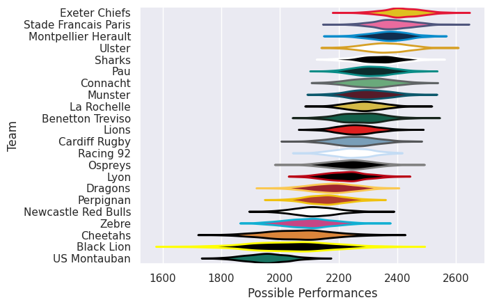

---  
title: "European Rugby Challenge Cup 25/26"  
date: 2025-11-27 6:00:00 -0500  
categories: model review projection  
layout: article  
aside:  
    toc: true  
---
# Team Rankings

# Standings

## Current Standings

### Pool A

| Club   | Played   | Wins   | Point Differential   | Losing Bonus Points   | Try Bonus Points   | Competition Points   |
|--------|----------|--------|----------------------|-----------------------|--------------------|----------------------|

### Pool B

| Club   | Played   | Wins   | Point Differential   | Losing Bonus Points   | Try Bonus Points   | Competition Points   |
|--------|----------|--------|----------------------|-----------------------|--------------------|----------------------|

### Pool C

| Club   | Played   | Wins   | Point Differential   | Losing Bonus Points   | Try Bonus Points   | Competition Points   |
|--------|----------|--------|----------------------|-----------------------|--------------------|----------------------|

## Projected Remaining Table

### Pool A

| Club                |   To Play |   Projected Wins |   Projected Differential |   Projected Losing Bonus Points | Projected Try Bonus Points   |   Projected Competition Points |
|:--------------------|----------:|-----------------:|-------------------------:|--------------------------------:|:-----------------------------|-------------------------------:|
| Montpellier Herault |         4 |            2.424 |                   14.78  |                           0.753 |                              |                         10.755 |
| Ospreys             |         4 |            2.152 |                    4.605 |                           0.989 |                              |                         10.073 |
| Connacht            |         4 |            2.07  |                    8.231 |                           0.865 |                              |                          9.439 |
| Zebre               |         4 |            1.732 |                   -6.998 |                           0.833 |                              |                          8.123 |
| Black Lion          |         4 |            1.572 |                  -10.327 |                           0.874 |                              |                          7.526 |
| US Montauban        |         4 |            1.51  |                  -10.291 |                           1.01  |                              |                          7.408 |

### Pool B

| Club              |   To Play |   Projected Wins |   Projected Differential |   Projected Losing Bonus Points | Projected Try Bonus Points   |   Projected Competition Points |
|:------------------|----------:|-----------------:|-------------------------:|--------------------------------:|:-----------------------------|-------------------------------:|
| Lyon              |         4 |            2.404 |                   12.196 |                           0.765 |                              |                         10.707 |
| Lions             |         4 |            2.302 |                    7.469 |                           0.952 |                              |                         10.586 |
| Benetton Treviso  |         4 |            2.041 |                    6.221 |                           0.868 |                              |                          9.332 |
| Perpignan         |         4 |            1.775 |                   -3.648 |                           0.983 |                              |                          8.397 |
| Newcastle Falcons |         4 |            1.625 |                   -7.807 |                           0.991 |                              |                          7.883 |
| Dragons           |         4 |            1.323 |                  -14.431 |                           1.005 |                              |                          6.659 |

### Pool C

| Club                 |   To Play |   Projected Wins |   Projected Differential |   Projected Losing Bonus Points | Projected Try Bonus Points   |   Projected Competition Points |
|:---------------------|----------:|-----------------:|-------------------------:|--------------------------------:|:-----------------------------|-------------------------------:|
| Stade Francais Paris |         4 |            2.29  |                    7.986 |                           0.832 |                              |                         10.41  |
| Racing 92            |         4 |            2.22  |                    8.465 |                           0.917 |                              |                         10.165 |
| Ulster               |         4 |            2.133 |                    4.159 |                           0.971 |                              |                          9.887 |
| Exeter Chiefs        |         4 |            1.979 |                    5.393 |                           0.989 |                              |                          9.237 |
| Cardiff Rugby        |         4 |            1.576 |                   -6.771 |                           1.06  |                              |                          7.764 |
| Cheetahs             |         4 |            1.248 |                  -19.232 |                           0.953 |                              |                          6.259 |

## Projected Total Table

### Pool A

| Club                |   Played |   Wins |   Point Differential |   Losing Bonus Points | Try Bonus Points   |   Competition Points |
|:--------------------|---------:|-------:|---------------------:|----------------------:|:-------------------|---------------------:|
| Montpellier Herault |        4 |  2.424 |               14.78  |                 0.753 |                    |               10.755 |
| Ospreys             |        4 |  2.152 |                4.605 |                 0.989 |                    |               10.073 |
| Connacht            |        4 |  2.07  |                8.231 |                 0.865 |                    |                9.439 |
| Zebre               |        4 |  1.732 |               -6.998 |                 0.833 |                    |                8.123 |
| Black Lion          |        4 |  1.572 |              -10.327 |                 0.874 |                    |                7.526 |
| US Montauban        |        4 |  1.51  |              -10.291 |                 1.01  |                    |                7.408 |

### Pool B

| Club              |   Played |   Wins |   Point Differential |   Losing Bonus Points | Try Bonus Points   |   Competition Points |
|:------------------|---------:|-------:|---------------------:|----------------------:|:-------------------|---------------------:|
| Lyon              |        4 |  2.404 |               12.196 |                 0.765 |                    |               10.707 |
| Lions             |        4 |  2.302 |                7.469 |                 0.952 |                    |               10.586 |
| Benetton Treviso  |        4 |  2.041 |                6.221 |                 0.868 |                    |                9.332 |
| Perpignan         |        4 |  1.775 |               -3.648 |                 0.983 |                    |                8.397 |
| Newcastle Falcons |        4 |  1.625 |               -7.807 |                 0.991 |                    |                7.883 |
| Dragons           |        4 |  1.323 |              -14.431 |                 1.005 |                    |                6.659 |

### Pool C

| Club                 |   Played |   Wins |   Point Differential |   Losing Bonus Points | Try Bonus Points   |   Competition Points |
|:---------------------|---------:|-------:|---------------------:|----------------------:|:-------------------|---------------------:|
| Stade Francais Paris |        4 |  2.29  |                7.986 |                 0.832 |                    |               10.41  |
| Racing 92            |        4 |  2.22  |                8.465 |                 0.917 |                    |               10.165 |
| Ulster               |        4 |  2.133 |                4.159 |                 0.971 |                    |                9.887 |
| Exeter Chiefs        |        4 |  1.979 |                5.393 |                 0.989 |                    |                9.237 |
| Cardiff Rugby        |        4 |  1.576 |               -6.771 |                 1.06  |                    |                7.764 |
| Cheetahs             |        4 |  1.248 |              -19.232 |                 0.953 |                    |                6.259 |

## Projected Playoff Results

|                      | Reach Round of 16   | Win Round of 16   | Reach Quarterfinal   | Win Quarterfinal   | Reach Semifinal   | Win Semifinal   | Reach Final   | Win Final   |
|:---------------------|:--------------------|:------------------|:---------------------|:-------------------|:------------------|:----------------|:--------------|:------------|
| Montpellier Herault  | 85.0 %              | 52.1 %            | 52.1 %               | 30.7 %             | 30.7 %            | 17.1 %          | 17.1 %        | 9.6 %       |
| Racing 92            | 79.6 %              | 50.9 %            | 50.9 %               | 29.8 %             | 29.8 %            | 14.7 %          | 14.7 %        | 7.9 %       |
| Lyon                 | 84.4 %              | 50.6 %            | 50.6 %               | 29.8 %             | 29.8 %            | 14.7 %          | 14.7 %        | 7.0 %       |
| Lions                | 81.7 %              | 45.5 %            | 45.5 %               | 24.8 %             | 24.8 %            | 14.6 %          | 14.6 %        | 6.9 %       |
| Exeter Chiefs        | 72.2 %              | 42.9 %            | 42.9 %               | 23.3 %             | 23.3 %            | 12.0 %          | 12.0 %        | 5.8 %       |
| Ulster               | 76.1 %              | 41.0 %            | 41.0 %               | 21.5 %             | 21.5 %            | 10.7 %          | 10.7 %        | 5.8 %       |
| Stade Francais Paris | 82.0 %              | 49.2 %            | 49.2 %               | 28.9 %             | 28.9 %            | 14.3 %          | 14.3 %        | 5.2 %       |
| Connacht             | 76.7 %              | 43.8 %            | 43.8 %               | 24.1 %             | 24.1 %            | 12.0 %          | 12.0 %        | 5.1 %       |
| Ospreys              | 77.0 %              | 40.5 %            | 40.5 %               | 19.8 %             | 19.8 %            | 9.8 %           | 9.8 %         | 4.8 %       |
| Benetton Treviso     | 74.3 %              | 41.0 %            | 41.0 %               | 22.3 %             | 22.3 %            | 9.0 %           | 9.0 %         | 4.7 %       |
| Cardiff Rugby        | 54.1 %              | 25.9 %            | 25.9 %               | 12.3 %             | 12.3 %            | 6.9 %           | 6.9 %         | 3.2 %       |
| Zebre                | 59.6 %              | 23.6 %            | 23.6 %               | 10.3 %             | 10.3 %            | 4.6 %           | 4.6 %         | 2.3 %       |
| Black Lion           | 50.8 %              | 22.3 %            | 22.3 %               | 9.8 %              | 9.8 %             | 4.0 %           | 4.0 %         | 2.1 %       |
| Bath Rugby           | 10.1 %              | 6.5 %             | 6.5 %                | 4.4 %              | 4.4 %             | 2.7 %           | 2.7 %         | 2.1 %       |
| Perpignan            | 63.3 %              | 27.5 %            | 27.5 %               | 11.1 %             | 11.1 %            | 4.5 %           | 4.5 %         | 1.9 %       |
| Sale Sharks          | 22.6 %              | 9.0 %             | 9.0 %                | 3.8 %              | 3.8 %             | 2.6 %           | 2.6 %         | 1.6 %       |
| Stade Toulousain     | 9.5 %               | 5.7 %             | 5.7 %                | 3.6 %              | 3.6 %             | 2.5 %           | 2.5 %         | 1.6 %       |
| US Montauban         | 50.9 %              | 15.1 %            | 15.1 %               | 6.6 %              | 6.6 %             | 2.9 %           | 2.9 %         | 1.5 %       |
| Leicester Tigers     | 22.2 %              | 10.6 %            | 10.6 %               | 4.2 %              | 4.2 %             | 2.1 %           | 2.1 %         | 1.4 %       |
| Cheetahs             | 36.0 %              | 14.6 %            | 14.6 %               | 6.9 %              | 6.9 %             | 2.5 %           | 2.5 %         | 1.3 %       |
| Sharks               | 19.5 %              | 8.5 %             | 8.5 %                | 3.6 %              | 3.6 %             | 2.1 %           | 2.1 %         | 1.3 %       |
| Munster              | 16.8 %              | 8.8 %             | 8.8 %                | 4.2 %              | 4.2 %             | 2.4 %           | 2.4 %         | 1.2 %       |
| Glasgow Warriors     | 14.9 %              | 7.8 %             | 7.8 %                | 3.2 %              | 3.2 %             | 1.8 %           | 1.8 %         | 1.2 %       |
| Newcastle Falcons    | 56.1 %              | 21.1 %            | 21.1 %               | 9.6 %              | 9.6 %             | 3.2 %           | 3.2 %         | 1.1 %       |
| Harlequins           | 23.8 %              | 10.4 %            | 10.4 %               | 3.1 %              | 3.1 %             | 2.0 %           | 2.0 %         | 1.0 %       |
| Saracens             | 15.9 %              | 7.2 %             | 7.2 %                | 2.9 %              | 2.9 %             | 1.6 %           | 1.6 %         | 1.0 %       |
| La Rochelle          | 15.5 %              | 6.7 %             | 6.7 %                | 2.5 %              | 2.5 %             | 1.4 %           | 1.4 %         | 1.0 %       |
| Gloucester Rugby     | 19.6 %              | 7.3 %             | 7.3 %                | 2.3 %              | 2.3 %             | 1.1 %           | 1.1 %         | 1.0 %       |
| Edinburgh            | 16.9 %              | 8.0 %             | 8.0 %                | 4.2 %              | 4.2 %             | 2.2 %           | 2.2 %         | 0.9 %       |
| Pau                  | 15.0 %              | 6.4 %             | 6.4 %                | 2.8 %              | 2.8 %             | 1.7 %           | 1.7 %         | 0.9 %       |
| Bayonne              | 19.9 %              | 8.0 %             | 8.0 %                | 2.9 %              | 2.9 %             | 1.5 %           | 1.5 %         | 0.9 %       |
| Leinster             | 10.5 %              | 4.9 %             | 4.9 %                | 2.4 %              | 2.4 %             | 1.4 %           | 1.4 %         | 0.9 %       |
| Bristol Rugby        | 18.3 %              | 8.3 %             | 8.3 %                | 2.9 %              | 2.9 %             | 1.6 %           | 1.6 %         | 0.8 %       |
| Northampton Saints   | 19.3 %              | 8.4 %             | 8.4 %                | 3.1 %              | 3.1 %             | 1.0 %           | 1.0 %         | 0.8 %       |
| Toulon               | 17.0 %              | 7.1 %             | 7.1 %                | 2.6 %              | 2.6 %             | 1.4 %           | 1.4 %         | 0.7 %       |
| Castres Olympique    | 19.6 %              | 6.8 %             | 6.8 %                | 2.6 %              | 2.6 %             | 1.4 %           | 1.4 %         | 0.7 %       |
| Clermont Auvergne    | 17.6 %              | 7.1 %             | 7.1 %                | 2.3 %              | 2.3 %             | 1.3 %           | 1.3 %         | 0.6 %       |
| Stormers             | 8.1 %               | 4.3 %             | 4.3 %                | 1.9 %              | 1.9 %             | 1.3 %           | 1.3 %         | 0.6 %       |
| Bordeaux Begles      | 14.1 %              | 6.8 %             | 6.8 %                | 2.8 %              | 2.8 %             | 1.5 %           | 1.5 %         | 0.5 %       |
| Bulls                | 13.7 %              | 6.6 %             | 6.6 %                | 2.8 %              | 2.8 %             | 1.2 %           | 1.2 %         | 0.5 %       |
| Dragons              | 40.2 %              | 13.9 %            | 13.9 %               | 5.3 %              | 5.3 %             | 2.1 %           | 2.1 %         | 0.4 %       |
| Scarlets             | 19.6 %              | 7.3 %             | 7.3 %                | 2.0 %              | 2.0 %             | 0.6 %           | 0.6 %         | 0.2 %       |

# Future Predictions

## Week 1

### Ulster V Racing 92 on 2025/12/05

Average Margin: Ulster by 1.9

### Lions V Benetton Treviso on 2025/12/06

Average Margin: Lions by 3.1

### Zebre V US Montauban on 2025/12/06

Average Margin: Zebre by 4.1

### Stade Francais Paris V Cardiff Rugby on 2025/12/06

Average Margin: Stade Francais Paris by 4.9

### Black Lion V Montpellier Herault on 2025/12/06

Average Margin: Montpellier Herault by 3.0

### Lyon V Newcastle Falcons on 2025/12/06

Average Margin: Lyon by 7.3

### Perpignan V Dragons on 2025/12/07

Average Margin: Perpignan by 5.7

### Ospreys V Connacht on 2025/12/07

Average Margin: Ospreys by 2.2

### Exeter Chiefs V Cheetahs on 2025/12/07

Average Margin: Exeter Chiefs by 7.9

## Week 2

### Montpellier Herault V Zebre on 2025/12/12

Average Margin: Montpellier Herault by 8.9

### Cheetahs V Stade Francais Paris on 2025/12/13

Average Margin: Stade Francais Paris by 2.5

### Newcastle Falcons V Lions on 2025/12/13

Average Margin: Lions by 1.9

### Connacht V Black Lion on 2025/12/13

Average Margin: Connacht by 6.9

### Cardiff Rugby V Ulster on 2025/12/13

Average Margin: Cardiff Rugby by 2.0

### US Montauban V Ospreys on 2025/12/13

Average Margin: Ospreys by 0.9

### Benetton Treviso V Perpignan on 2025/12/13

Average Margin: Benetton Treviso by 6.9

### Dragons V Lyon on 2025/12/14

Average Margin: Lyon by 3.3

### Racing 92 V Exeter Chiefs on 2025/12/14

Average Margin: Racing 92 by 3.5

## Week 3

### Stade Francais Paris V Exeter Chiefs on 2026/01/10

Average Margin: Stade Francais Paris by 3.6

### Benetton Treviso V Dragons on 2026/01/10

Average Margin: Benetton Treviso by 6.9

### Lions V Lyon on 2026/01/10

Average Margin: Lions by 2.9

### Cardiff Rugby V Racing 92 on 2026/01/10

Average Margin: Cardiff Rugby by 0.6

### US Montauban V Black Lion on 2026/01/10

Average Margin: US Montauban by 2.6

### Newcastle Falcons V Perpignan on 2026/01/10

Average Margin: Newcastle Falcons by 2.9

### Zebre V Ospreys on 2026/01/11

Average Margin: Ospreys by 0.0

### Montpellier Herault V Connacht on 2026/01/11

Average Margin: Montpellier Herault by 4.4

### Cheetahs V Ulster on 2026/01/11

Average Margin: Ulster by 1.3

## Week 4

### Dragons V Newcastle Falcons on 2026/01/16

Average Margin: Dragons by 1.5

### Ospreys V Montpellier Herault on 2026/01/17

Average Margin: Ospreys by 1.4

### Perpignan V Lions on 2026/01/17

Average Margin: Perpignan by 0.4

### Connacht V US Montauban on 2026/01/17

Average Margin: Connacht by 7.9

### Black Lion V Zebre on 2026/01/17

Average Margin: Black Lion by 2.2

### Ulster V Stade Francais Paris on 2026/01/17

Average Margin: Ulster by 3.0

### Racing 92 V Cheetahs on 2026/01/18

Average Margin: Racing 92 by 7.5

### Exeter Chiefs V Cardiff Rugby on 2026/01/18

Average Margin: Exeter Chiefs by 4.5

### Lyon V Benetton Treviso on 2026/01/18

Average Margin: Lyon by 4.5

## Week 5

### Lyon V Ospreys on 2026-04-02

Average Margin: Ospreys by 0.1

### Black Lion V Castres Olympique on 2026-04-02

Average Margin: Castres Olympique by 10.7

### Ospreys V Bordeaux Begles on 2026-04-02

Average Margin: Ospreys by 4.3

### Lions V Sharks on 2026-04-02

Average Margin: Lions by 20.0

### Cardiff Rugby V Saracens on 2026-04-02

Average Margin: Cardiff Rugby by 4.8

### Dragons V Leicester Tigers on 2026-04-02

Average Margin: Leicester Tigers by 20.0

### Lyon V Bulls on 2026-04-02

Average Margin: Bulls by 2.7

### Montpellier Herault V Scarlets on 2026-04-02

Average Margin: Montpellier Herault by 5.2

### Perpignan V Bath Rugby on 2026-04-02

Average Margin: Bath Rugby by 7.7

### Connacht V Leicester Tigers on 2026-04-02

Average Margin: Connacht by 1.0

### Racing 92 V Bath Rugby on 2026-04-02

Average Margin: Bath Rugby by 2.5

### US Montauban V Clermont Auvergne on 2026-04-02

Average Margin: Clermont Auvergne by 3.0

### Cardiff Rugby V Toulon on 2026-04-02

Average Margin: Cardiff Rugby by 6.7

### Stade Francais Paris V Clermont Auvergne on 2026-04-02

Average Margin: Stade Francais Paris by 5.0

### Dragons V Stade Toulousain on 2026-04-02

Average Margin: Dragons by 9.0

### Stade Francais Paris V Saracens on 2026-04-02

Average Margin: Stade Francais Paris by 1.0

### Perpignan V Clermont Auvergne on 2026-04-02

Average Margin: Perpignan by 3.3

### Perpignan V Saracens on 2026-04-02

Average Margin: Saracens by 7.3

### Exeter Chiefs V Leinster on 2026-04-02

Average Margin: Exeter Chiefs by 5.0

### Connacht V Leinster on 2026-04-02

Average Margin: Leinster by 10.7

### Cardiff Rugby V Leicester Tigers on 2026-04-02

Average Margin: Cardiff Rugby by 2.6

### Zebre V Northampton Saints on 2026-04-02

Average Margin: Northampton Saints by 0.7

### Ospreys V Harlequins on 2026-04-02

Average Margin: Ospreys by 3.0

### Black Lion V Leicester Tigers on 2026-04-02

Average Margin: Leicester Tigers by 3.6

### Montpellier Herault V Harlequins on 2026-04-02

Average Margin: Harlequins by 0.2

### Ulster V Bristol Rugby on 2026-04-02

Average Margin: Bristol Rugby by 4.7

### Black Lion V Scarlets on 2026-04-02

Average Margin: Black Lion by 13.0

### Lyon V Toulon on 2026-04-02

Average Margin: Toulon by 5.0

### Racing 92 V Leicester Tigers on 2026-04-02

Average Margin: Leicester Tigers by 2.7

### Lions V Clermont Auvergne on 2026-04-02

Average Margin: Clermont Auvergne by 0.7

### Benetton Treviso V Munster on 2026-04-02

Average Margin: Munster by 4.0

### Montpellier Herault V Leicester Tigers on 2026-04-02

Average Margin: Montpellier Herault by 6.1

### Exeter Chiefs V Castres Olympique on 2026-04-02

Average Margin: Exeter Chiefs by 10.0

### Exeter Chiefs V Bulls on 2026-04-02

Average Margin: Bulls by 7.5

### Connacht V Sale Sharks on 2026-04-02

Average Margin: Sale Sharks by 5.0

### Connacht V Pau on 2026-04-02

Average Margin: Connacht by 7.0

### Lyon V Bath Rugby on 2026-04-02

Average Margin: Bath Rugby by 1.0

### Connacht V Bristol Rugby on 2026-04-02

Average Margin: Connacht by 9.0

### Racing 92 V Bristol Rugby on 2026-04-02

Average Margin: Racing 92 by 8.0

### Lyon V Pau on 2026-04-02

Average Margin: Lyon by 1.2

### Ospreys V Sale Sharks on 2026-04-02

Average Margin: Ospreys by 2.9

### Lyon V Munster on 2026-04-02

Average Margin: Munster by 7.7

### Ulster V Munster on 2026-04-02

Average Margin: Ulster by 0.3

### Zebre V La Rochelle on 2026-04-02

Average Margin: La Rochelle by 4.0

### Cardiff Rugby V Bath Rugby on 2026-04-02

Average Margin: Bath Rugby by 12.0

### Connacht V Edinburgh on 2026-04-02

Average Margin: Connacht by 7.0

### Connacht V Toulon on 2026-04-02

Average Margin: Toulon by 1.7

### Ulster V Toulon on 2026-04-02

Average Margin: Ulster by 4.2

### Stade Francais Paris V Leicester Tigers on 2026-04-02

Average Margin: Leicester Tigers by 0.6

### Ulster V Leinster on 2026-04-02

Average Margin: Leinster by 4.0

### Dragons V Clermont Auvergne on 2026-04-02

Average Margin: Dragons by 1.0

### Ulster V Saracens on 2026-04-02

Average Margin: Ulster by 11.7

### Exeter Chiefs V Toulon on 2026-04-02

Average Margin: Exeter Chiefs by 9.0

### Zebre V Glasgow Warriors on 2026-04-02

Average Margin: Glasgow Warriors by 4.7

### Racing 92 V Sale Sharks on 2026-04-02

Average Margin: Racing 92 by 5.2

### Lions V Leicester Tigers on 2026-04-02

Average Margin: Lions by 3.9

### Exeter Chiefs V Sharks on 2026-04-02

Average Margin: Exeter Chiefs by 4.0

### Lions V Bristol Rugby on 2026-04-02

Average Margin: Lions by 2.5

### Exeter Chiefs V Leicester Tigers on 2026-04-02

Average Margin: Leicester Tigers by 0.0

### Lyon V Stade Toulousain on 2026-04-02

Average Margin: Stade Toulousain by 8.2

### Racing 92 V Northampton Saints on 2026-04-02

Average Margin: Racing 92 by 2.8

### Ulster V Glasgow Warriors on 2026-04-02

Average Margin: Glasgow Warriors by 0.0

### Lions V Castres Olympique on 2026-04-02

Average Margin: Lions by 11.5

### Stade Francais Paris V Bristol Rugby on 2026-04-02

Average Margin: Stade Francais Paris by 8.8

### Zebre V Scarlets on 2026-04-02

Average Margin: Scarlets by 16.0

### Perpignan V Scarlets on 2026-04-02

Average Margin: Perpignan by 3.0

### Racing 92 V Sharks on 2026-04-02

Average Margin: Racing 92 by 7.5

### Lyon V Sale Sharks on 2026-04-02

Average Margin: Lyon by 2.2

### Stade Francais Paris V Bath Rugby on 2026-04-02

Average Margin: Bath Rugby by 24.0

### Black Lion V Clermont Auvergne on 2026-04-02

Average Margin: Black Lion by 5.0

### Ospreys V Glasgow Warriors on 2026-04-02

Average Margin: Ospreys by 7.0

### Lions V Harlequins on 2026-04-02

Average Margin: Lions by 0.8

### Exeter Chiefs V Bristol Rugby on 2026-04-02

Average Margin: Exeter Chiefs by 6.0

### Lions V Saracens on 2026-04-02

Average Margin: Saracens by 3.0

### Montpellier Herault V La Rochelle on 2026-04-02

Average Margin: Montpellier Herault by 10.2

### Racing 92 V Stormers on 2026-04-02

Average Margin: Racing 92 by 1.7

### Benetton Treviso V Scarlets on 2026-04-02

Average Margin: Benetton Treviso by 8.2

### Lyon V Bristol Rugby on 2026-04-02

Average Margin: Lyon by 4.5

### Lions V Glasgow Warriors on 2026-04-02

Average Margin: Glasgow Warriors by 8.7

### Perpignan V Sale Sharks on 2026-04-02

Average Margin: Perpignan by 3.2

### Lyon V Castres Olympique on 2026-04-02

Average Margin: Lyon by 8.3

### Zebre V Harlequins on 2026-04-02

Average Margin: Harlequins by 4.6

### Lyon V Sharks on 2026-04-02

Average Margin: Lyon by 11.0

### Benetton Treviso V Leinster on 2026-04-02

Average Margin: Benetton Treviso by 5.0

### Lyon V Gloucester Rugby on 2026-04-02

Average Margin: Lyon by 5.2

### Ospreys V Castres Olympique on 2026-04-02

Average Margin: Ospreys by 1.8

### Ospreys V Northampton Saints on 2026-04-02

Average Margin: Northampton Saints by 6.5

### Exeter Chiefs V Harlequins on 2026-04-02

Average Margin: Exeter Chiefs by 16.0

### Newcastle Falcons V Bayonne on 2026-04-02

Average Margin: Bayonne by 3.0

### Dragons V Sharks on 2026-04-02

Average Margin: Sharks by 11.5

### Black Lion V Gloucester Rugby on 2026-04-02

Average Margin: Black Lion by 2.0

### Ospreys V Gloucester Rugby on 2026-04-02

Average Margin: Gloucester Rugby by 8.6

### Cheetahs V Leicester Tigers on 2026-04-02

Average Margin: Leicester Tigers by 6.8

### Benetton Treviso V Sale Sharks on 2026-04-02

Average Margin: Benetton Treviso by 7.0

### Exeter Chiefs V Glasgow Warriors on 2026-04-02

Average Margin: Exeter Chiefs by 7.3

### Cheetahs V Sale Sharks on 2026-04-02

Average Margin: Sale Sharks by 1.5

### Connacht V Castres Olympique on 2026-04-02

Average Margin: Connacht by 5.0

### Ulster V Bayonne on 2026-04-02

Average Margin: Ulster by 7.2

### Lyon V Bayonne on 2026-04-02

Average Margin: Lyon by 9.0

### Stade Francais Paris V Bayonne on 2026-04-02

Average Margin: Stade Francais Paris by 8.7

### Dragons V Castres Olympique on 2026-04-02

Average Margin: Dragons by 6.0

### Connacht V Sharks on 2026-04-02

Average Margin: Sharks by 5.0

### Lions V Scarlets on 2026-04-02

Average Margin: Lions by 2.2

### Zebre V Munster on 2026-04-02

Average Margin: Zebre by 4.7

### Black Lion V La Rochelle on 2026-04-02

Average Margin: Black Lion by 1.0

### Montpellier Herault V Stormers on 2026-04-02

Average Margin: Stormers by 2.0

### Cardiff Rugby V Bayonne on 2026-04-02

Average Margin: Cardiff Rugby by 9.5

### Newcastle Falcons V Leicester Tigers on 2026-04-02

Average Margin: Leicester Tigers by 11.0

### Black Lion V Northampton Saints on 2026-04-02

Average Margin: Black Lion by 4.0

### Lyon V Harlequins on 2026-04-02

Average Margin: Lyon by 11.5

### Zebre V Leinster on 2026-04-02

Average Margin: Leinster by 8.0

### Racing 92 V Bordeaux Begles on 2026-04-02

Average Margin: Bordeaux Begles by 4.3

### Newcastle Falcons V La Rochelle on 2026-04-02

Average Margin: Newcastle Falcons by 14.0

### Zebre V Bayonne on 2026-04-02

Average Margin: Bayonne by 3.0

### Stade Francais Paris V Sale Sharks on 2026-04-02

Average Margin: Stade Francais Paris by 9.4

### Racing 92 V Glasgow Warriors on 2026-04-02

Average Margin: Racing 92 by 1.2

### Black Lion V Saracens on 2026-04-02

Average Margin: Black Lion by 10.5

### Montpellier Herault V Saracens on 2026-04-02

Average Margin: Montpellier Herault by 8.5

### Ulster V Bath Rugby on 2026-04-02

Average Margin: Ulster by 8.0

### Ospreys V Sharks on 2026-04-02

Average Margin: Ospreys by 1.7

### Connacht V Stade Toulousain on 2026-04-02

Average Margin: Stade Toulousain by 0.5

### Montpellier Herault V Northampton Saints on 2026-04-02

Average Margin: Northampton Saints by 4.0

### Perpignan V Bordeaux Begles on 2026-04-02

Average Margin: Perpignan by 4.0

### Stade Francais Paris V Leinster on 2026-04-02

Average Margin: Stade Francais Paris by 2.3

### Ospreys V Bayonne on 2026-04-02

Average Margin: Ospreys by 3.7

### Ulster V Sale Sharks on 2026-04-02

Average Margin: Ulster by 0.2

### Benetton Treviso V Leicester Tigers on 2026-04-02

Average Margin: Benetton Treviso by 1.0

### Newcastle Falcons V Gloucester Rugby on 2026-04-02

Average Margin: Newcastle Falcons by 12.0

### Ulster V Sharks on 2026-04-02

Average Margin: Ulster by 3.0

### Zebre V Sharks on 2026-04-02

Average Margin: Zebre by 2.0

### Racing 92 V Castres Olympique on 2026-04-02

Average Margin: Racing 92 by 2.0

### Cardiff Rugby V Clermont Auvergne on 2026-04-02

Average Margin: Cardiff Rugby by 12.5

### Cheetahs V Pau on 2026-04-02

Average Margin: Cheetahs by 8.5

### Lyon V Bordeaux Begles on 2026-04-02

Average Margin: Lyon by 3.0

### Newcastle Falcons V Harlequins on 2026-04-02

Average Margin: Newcastle Falcons by 1.5

### Lions V Gloucester Rugby on 2026-04-02

Average Margin: Lions by 0.2

### US Montauban V Sale Sharks on 2026-04-02

Average Margin: US Montauban by 17.0

### Dragons V Gloucester Rugby on 2026-04-02

Average Margin: Gloucester Rugby by 12.5

### Stade Francais Paris V Northampton Saints on 2026-04-02

Average Margin: Stade Francais Paris by 10.0

### Ospreys V Leicester Tigers on 2026-04-02

Average Margin: Ospreys by 5.7

### Stade Francais Paris V Stormers on 2026-04-02

Average Margin: Stade Francais Paris by 13.0

### Ospreys V Leinster on 2026-04-02

Average Margin: Ospreys by 11.0

### Benetton Treviso V Glasgow Warriors on 2026-04-02

Average Margin: Benetton Treviso by 0.7

### US Montauban V Glasgow Warriors on 2026-04-02

Average Margin: Glasgow Warriors by 7.0

### Black Lion V Bayonne on 2026-04-02

Average Margin: Black Lion by 1.0

### Black Lion V Sale Sharks on 2026-04-02

Average Margin: Sale Sharks by 1.0

### Ospreys V Toulon on 2026-04-02

Average Margin: Toulon by 0.0

### Ulster V Leicester Tigers on 2026-04-02

Average Margin: Ulster by 7.0

### Montpellier Herault V Edinburgh on 2026-04-02

Average Margin: Edinburgh by 8.0

### Racing 92 V Clermont Auvergne on 2026-04-02

Average Margin: Racing 92 by 5.7

### Lyon V Northampton Saints on 2026-04-02

Average Margin: Lyon by 3.0

### Stade Francais Paris V Gloucester Rugby on 2026-04-02

Average Margin: Gloucester Rugby by 0.0

### Benetton Treviso V Edinburgh on 2026-04-02

Average Margin: Benetton Treviso by 16.0

### Newcastle Falcons V Sharks on 2026-04-02

Average Margin: Newcastle Falcons by 4.5

### Montpellier Herault V Castres Olympique on 2026-04-02

Average Margin: Castres Olympique by 2.2

### US Montauban V Munster on 2026-04-02

Average Margin: US Montauban by 27.0

### Montpellier Herault V Leinster on 2026-04-02

Average Margin: Montpellier Herault by 3.7

### Newcastle Falcons V Glasgow Warriors on 2026-04-02

Average Margin: Glasgow Warriors by 6.0

### Montpellier Herault V Munster on 2026-04-02

Average Margin: Munster by 1.1

### Lions V Stormers on 2026-04-02

Average Margin: Lions by 1.0

### Exeter Chiefs V Clermont Auvergne on 2026-04-02

Average Margin: Clermont Auvergne by 2.6

### Lions V Edinburgh on 2026-04-02

Average Margin: Lions by 2.0

### Perpignan V Harlequins on 2026-04-02

Average Margin: Perpignan by 1.7

### Montpellier Herault V Stade Toulousain on 2026-04-02

Average Margin: Montpellier Herault by 8.0

### Lyon V Scarlets on 2026-04-02

Average Margin: Lyon by 2.5

### Stade Francais Paris V Glasgow Warriors on 2026-04-02

Average Margin: Glasgow Warriors by 0.0

### Lions V Northampton Saints on 2026-04-02

Average Margin: Lions by 2.0

### Benetton Treviso V Harlequins on 2026-04-02

Average Margin: Benetton Treviso by 8.4

### Ulster V Clermont Auvergne on 2026-04-02

Average Margin: Ulster by 3.2

### Ulster V Stormers on 2026-04-02

Average Margin: Ulster by 4.0

### Montpellier Herault V Pau on 2026-04-02

Average Margin: Pau by 0.5

### Lions V La Rochelle on 2026-04-02

Average Margin: La Rochelle by 6.8

### Racing 92 V Munster on 2026-04-02

Average Margin: Racing 92 by 11.0

### Racing 92 V Gloucester Rugby on 2026-04-02

Average Margin: Racing 92 by 5.8

### Perpignan V Leicester Tigers on 2026-04-02

Average Margin: Perpignan by 21.0

### Exeter Chiefs V Bordeaux Begles on 2026-04-02

Average Margin: Exeter Chiefs by 4.0

### US Montauban V Bristol Rugby on 2026-04-02

Average Margin: US Montauban by 23.0

### Stade Francais Paris V Sharks on 2026-04-02

Average Margin: Sharks by 0.0

### Cardiff Rugby V Sharks on 2026-04-02

Average Margin: Cardiff Rugby by 2.0

### Newcastle Falcons V Bordeaux Begles on 2026-04-02

Average Margin: Newcastle Falcons by 2.0

### US Montauban V Sharks on 2026-04-02

Average Margin: US Montauban by 3.8

### Perpignan V Gloucester Rugby on 2026-04-02

Average Margin: Perpignan by 3.5

### Lions V Pau on 2026-04-02

Average Margin: Pau by 14.0

### Perpignan V Castres Olympique on 2026-04-02

Average Margin: Perpignan by 2.0

### Black Lion V Sharks on 2026-04-02

Average Margin: Sharks by 5.0

### US Montauban V Scarlets on 2026-04-02

Average Margin: US Montauban by 4.0

### Montpellier Herault V Sale Sharks on 2026-04-02

Average Margin: Montpellier Herault by 5.8

### Montpellier Herault V Bristol Rugby on 2026-04-02

Average Margin: Montpellier Herault by 6.5

### Racing 92 V Bulls on 2026-04-02

Average Margin: Racing 92 by 10.0

### Ospreys V La Rochelle on 2026-04-02

Average Margin: Ospreys by 8.2

### Montpellier Herault V Bayonne on 2026-04-02

Average Margin: Montpellier Herault by 2.1

### Connacht V Northampton Saints on 2026-04-02

Average Margin: Northampton Saints by 0.0

### Racing 92 V La Rochelle on 2026-04-02

Average Margin: La Rochelle by 11.5

### US Montauban V Pau on 2026-04-02

Average Margin: US Montauban by 12.0

### Montpellier Herault V Bordeaux Begles on 2026-04-02

Average Margin: Montpellier Herault by 13.0

### Connacht V Bayonne on 2026-04-02

Average Margin: Bayonne by 4.0

### Ulster V Gloucester Rugby on 2026-04-02

Average Margin: Gloucester Rugby by 0.5

### Ulster V Castres Olympique on 2026-04-02

Average Margin: Castres Olympique by 7.0

### Cardiff Rugby V Sale Sharks on 2026-04-02

Average Margin: Cardiff Rugby by 11.0

### Exeter Chiefs V Edinburgh on 2026-04-02

Average Margin: Exeter Chiefs by 0.7

### Lions V Bordeaux Begles on 2026-04-02

Average Margin: Bordeaux Begles by 2.3

### Lions V Toulon on 2026-04-02

Average Margin: Lions by 2.3

### Lyon V Clermont Auvergne on 2026-04-02

Average Margin: Clermont Auvergne by 2.7

### Benetton Treviso V Bristol Rugby on 2026-04-02

Average Margin: Bristol Rugby by 8.5

### Cardiff Rugby V Harlequins on 2026-04-02

Average Margin: Cardiff Rugby by 7.2

### Exeter Chiefs V Bath Rugby on 2026-04-02

Average Margin: Exeter Chiefs by 3.0

### Connacht V Harlequins on 2026-04-02

Average Margin: Connacht by 3.9

### Ospreys V Scarlets on 2026-04-02

Average Margin: Ospreys by 7.3

### Perpignan V Pau on 2026-04-02

Average Margin: Perpignan by 5.7

### Connacht V Glasgow Warriors on 2026-04-02

Average Margin: Connacht by 4.7

### Racing 92 V Toulon on 2026-04-02

Average Margin: Racing 92 by 12.3

### Ospreys V Edinburgh on 2026-04-02

Average Margin: Edinburgh by 2.0

### Lions V Bulls on 2026-04-02

Average Margin: Lions by 19.0

### Lyon V Saracens on 2026-04-02

Average Margin: Lyon by 9.0

### Exeter Chiefs V Gloucester Rugby on 2026-04-02

Average Margin: Exeter Chiefs by 2.8

### Perpignan V Leinster on 2026-04-02

Average Margin: Perpignan by 1.5

### Racing 92 V Harlequins on 2026-04-02

Average Margin: Racing 92 by 8.5

### Connacht V Saracens on 2026-04-02

Average Margin: Saracens by 13.0

### Ulster V Bulls on 2026-04-02

Average Margin: Bulls by 0.0

### Dragons V Bulls on 2026-04-02

Average Margin: Bulls by 4.0

### US Montauban V Stade Toulousain on 2026-04-02

Average Margin: US Montauban by 3.0

### US Montauban V Harlequins on 2026-04-02

Average Margin: Harlequins by 7.4

### Newcastle Falcons V Northampton Saints on 2026-04-02

Average Margin: Newcastle Falcons by 1.0

### Stade Francais Paris V Scarlets on 2026-04-02

Average Margin: Scarlets by 17.0

### Perpignan V Stormers on 2026-04-02

Average Margin: Perpignan by 11.0

### Black Lion V Munster on 2026-04-02

Average Margin: Munster by 4.0

### Ulster V Bordeaux Begles on 2026-04-02

Average Margin: Bordeaux Begles by 3.7

### Stade Francais Paris V Munster on 2026-04-02

Average Margin: Stade Francais Paris by 3.7

### Ulster V Scarlets on 2026-04-02

Average Margin: Ulster by 3.4

### Exeter Chiefs V Saracens on 2026-04-02

Average Margin: Exeter Chiefs by 1.3

### Exeter Chiefs V Bayonne on 2026-04-02

Average Margin: Exeter Chiefs by 4.0

### Lions V Bayonne on 2026-04-02

Average Margin: Lions by 1.0

### Newcastle Falcons V Clermont Auvergne on 2026-04-02

Average Margin: Clermont Auvergne by 2.0

### Cardiff Rugby V Munster on 2026-04-02

Average Margin: Cardiff Rugby by 9.0

### Ospreys V Munster on 2026-04-02

Average Margin: Munster by 3.8

### Montpellier Herault V Gloucester Rugby on 2026-04-02

Average Margin: Montpellier Herault by 12.0

### Dragons V Edinburgh on 2026-04-02

Average Margin: Dragons by 14.0

### US Montauban V Gloucester Rugby on 2026-04-02

Average Margin: Gloucester Rugby by 10.0

### Dragons V Munster on 2026-04-02

Average Margin: Munster by 6.5

### Zebre V Edinburgh on 2026-04-02

Average Margin: Edinburgh by 2.0

### Benetton Treviso V La Rochelle on 2026-04-02

Average Margin: La Rochelle by 8.5

### Perpignan V La Rochelle on 2026-04-02

Average Margin: Perpignan by 6.0

### Exeter Chiefs V La Rochelle on 2026-04-02

Average Margin: Exeter Chiefs by 1.0

### Perpignan V Munster on 2026-04-02

Average Margin: Munster by 3.0

### Newcastle Falcons V Scarlets on 2026-04-02

Average Margin: Newcastle Falcons by 5.5

### Ulster V Harlequins on 2026-04-02

Average Margin: Ulster by 3.2

### Ospreys V Bristol Rugby on 2026-04-02

Average Margin: Ospreys by 5.0

### Benetton Treviso V Saracens on 2026-04-02

Average Margin: Benetton Treviso by 1.0

### Zebre V Leicester Tigers on 2026-04-02

Average Margin: Zebre by 2.0

### Stade Francais Paris V Harlequins on 2026-04-02

Average Margin: Stade Francais Paris by 3.0

### Racing 92 V Pau on 2026-04-02

Average Margin: Racing 92 by 7.5

### Benetton Treviso V Sharks on 2026-04-02

Average Margin: Benetton Treviso by 10.3

### Benetton Treviso V Stade Toulousain on 2026-04-02

Average Margin: Benetton Treviso by 5.0

### Lions V Leinster on 2026-04-02

Average Margin: Lions by 2.0

### Ospreys V Saracens on 2026-04-02

Average Margin: Saracens by 8.5

### Stade Francais Paris V Bordeaux Begles on 2026-04-02

Average Margin: Stade Francais Paris by 3.7

### Newcastle Falcons V Munster on 2026-04-02

Average Margin: Munster by 0.3

### Montpellier Herault V Toulon on 2026-04-02

Average Margin: Montpellier Herault by 9.0

### Cardiff Rugby V Glasgow Warriors on 2026-04-02

Average Margin: Glasgow Warriors by 14.0

### Ospreys V Stade Toulousain on 2026-04-02

Average Margin: Stade Toulousain by 3.0

### Zebre V Stormers on 2026-04-02

Average Margin: Stormers by 0.0

### Benetton Treviso V Gloucester Rugby on 2026-04-02

Average Margin: Benetton Treviso by 1.3

### Benetton Treviso V Bulls on 2026-04-02

Average Margin: Benetton Treviso by 8.0

### Benetton Treviso V Castres Olympique on 2026-04-02

Average Margin: Benetton Treviso by 3.7

### Zebre V Saracens on 2026-04-02

Average Margin: Saracens by 9.0

### US Montauban V Leicester Tigers on 2026-04-02

Average Margin: US Montauban by 1.0

### Cardiff Rugby V Castres Olympique on 2026-04-02

Average Margin: Castres Olympique by 8.0

### Zebre V Bristol Rugby on 2026-04-02

Average Margin: Bristol Rugby by 9.0

### Stade Francais Paris V Bulls on 2026-04-02

Average Margin: Stade Francais Paris by 8.5

### Montpellier Herault V Sharks on 2026-04-02

Average Margin: Sharks by 0.0

### Lions V Sale Sharks on 2026-04-02

Average Margin: Lions by 12.6

### Stade Francais Paris V Castres Olympique on 2026-04-02

Average Margin: Stade Francais Paris by 5.5

### Cardiff Rugby V Scarlets on 2026-04-02

Average Margin: Cardiff Rugby by 1.7

### Perpignan V Bristol Rugby on 2026-04-02

Average Margin: Perpignan by 1.0

### Cardiff Rugby V La Rochelle on 2026-04-02

Average Margin: La Rochelle by 1.0

### Zebre V Sale Sharks on 2026-04-02

Average Margin: Zebre by 7.7

### Montpellier Herault V Bath Rugby on 2026-04-02

Average Margin: Montpellier Herault by 24.0

### US Montauban V Castres Olympique on 2026-04-02

Average Margin: US Montauban by 1.0

### Perpignan V Toulon on 2026-04-02

Average Margin: Toulon by 2.0

### Stade Francais Paris V La Rochelle on 2026-04-02

Average Margin: Stade Francais Paris by 19.5

### Cheetahs V Castres Olympique on 2026-04-02

Average Margin: Cheetahs by 20.0

### Dragons V Sale Sharks on 2026-04-02

Average Margin: Sale Sharks by 0.0

### US Montauban V Northampton Saints on 2026-04-02

Average Margin: US Montauban by 6.5

### Zebre V Castres Olympique on 2026-04-02

Average Margin: Castres Olympique by 8.0

### Dragons V Leinster on 2026-04-02

Average Margin: Dragons by 2.0

### Zebre V Bulls on 2026-04-02

Average Margin: Bulls by 15.0

### Cardiff Rugby V Bristol Rugby on 2026-04-02

Average Margin: Bristol Rugby by 2.0

### Zebre V Gloucester Rugby on 2026-04-02

Average Margin: Zebre by 1.0

### Ospreys V Bath Rugby on 2026-04-02

Average Margin: Bath Rugby by 1.0

### Connacht V La Rochelle on 2026-04-02

Average Margin: Connacht by 11.0

### Cheetahs V Harlequins on 2026-04-02

Average Margin: Cheetahs by 4.0

### Racing 92 V Edinburgh on 2026-04-02

Average Margin: Racing 92 by 11.0

### Perpignan V Sharks on 2026-04-02

Average Margin: Sharks by 8.0

### Black Lion V Pau on 2026-04-02

Average Margin: Black Lion by 12.0

### Dragons V Toulon on 2026-04-02

Average Margin: Toulon by 1.5

### Stade Francais Paris V Edinburgh on 2026-04-02

Average Margin: Stade Francais Paris by 6.0

### Montpellier Herault V Clermont Auvergne on 2026-04-02

Average Margin: Clermont Auvergne by 2.0

### Racing 92 V Stade Toulousain on 2026-04-02

Average Margin: Stade Toulousain by 9.0

### Black Lion V Harlequins on 2026-04-02

Average Margin: Black Lion by 1.7

### Racing 92 V Leinster on 2026-04-02

Average Margin: Racing 92 by 21.0

### US Montauban V Bordeaux Begles on 2026-04-02

Average Margin: Bordeaux Begles by 5.0

### Connacht V Stormers on 2026-04-02

Average Margin: Connacht by 3.0

### US Montauban V Edinburgh on 2026-04-02

Average Margin: US Montauban by 14.0

### Racing 92 V Bayonne on 2026-04-02

Average Margin: Bayonne by 0.2

### Dragons V Bristol Rugby on 2026-04-02

Average Margin: Dragons by 10.7

### Zebre V Pau on 2026-04-02

Average Margin: Zebre by 1.0

### Connacht V Scarlets on 2026-04-02

Average Margin: Scarlets by 24.0

### US Montauban V Stormers on 2026-04-02

Average Margin: Stormers by 10.0

### Perpignan V Bayonne on 2026-04-02

Average Margin: Perpignan by 3.5

### Dragons V La Rochelle on 2026-04-02

Average Margin: La Rochelle by 9.5

### Dragons V Northampton Saints on 2026-04-02

Average Margin: Dragons by 18.0

### Stade Francais Paris V Pau on 2026-04-02

Average Margin: Stade Francais Paris by 5.0

### Benetton Treviso V Bayonne on 2026-04-02

Average Margin: Bayonne by 3.5

### Connacht V Bulls on 2026-04-02

Average Margin: Bulls by 3.7

### Perpignan V Northampton Saints on 2026-04-02

Average Margin: Perpignan by 5.0

### Lions V Bath Rugby on 2026-04-02

Average Margin: Bath Rugby by 6.0

### Zebre V Clermont Auvergne on 2026-04-02

Average Margin: Zebre by 6.0

### Zebre V Stade Toulousain on 2026-04-02

Average Margin: Stade Toulousain by 6.0

### Ospreys V Clermont Auvergne on 2026-04-02

Average Margin: Clermont Auvergne by 5.0

### Dragons V Bordeaux Begles on 2026-04-02

Average Margin: Dragons by 2.0

### Perpignan V Stade Toulousain on 2026-04-02

Average Margin: Perpignan by 6.0

### Lyon V La Rochelle on 2026-04-02

Average Margin: La Rochelle by 7.0

### Racing 92 V Saracens on 2026-04-02

Average Margin: Racing 92 by 1.7

### Black Lion V Toulon on 2026-04-02

Average Margin: Black Lion by 4.0

### Black Lion V Glasgow Warriors on 2026-04-02

Average Margin: Glasgow Warriors by 17.0

### Ospreys V Bulls on 2026-04-02

Average Margin: Ospreys by 8.0

### Cardiff Rugby V Edinburgh on 2026-04-02

Average Margin: Edinburgh by 4.5

### Benetton Treviso V Northampton Saints on 2026-04-02

Average Margin: Northampton Saints by 3.7

### Newcastle Falcons V Bristol Rugby on 2026-04-02

Average Margin: Bristol Rugby by 10.0

### Cardiff Rugby V Bulls on 2026-04-02

Average Margin: Cardiff Rugby by 18.0

### Benetton Treviso V Pau on 2026-04-02

Average Margin: Pau by 3.0

### Exeter Chiefs V Pau on 2026-04-02

Average Margin: Pau by 0.0

### Ulster V Northampton Saints on 2026-04-02

Average Margin: Northampton Saints by 10.0

### Ulster V Edinburgh on 2026-04-02

Average Margin: Edinburgh by 7.0

### Connacht V Gloucester Rugby on 2026-04-02

Average Margin: Connacht by 2.0

### Exeter Chiefs V Sale Sharks on 2026-04-02

Average Margin: Exeter Chiefs by 20.0

### Exeter Chiefs V Stade Toulousain on 2026-04-02

Average Margin: Exeter Chiefs by 1.0

### Racing 92 V Scarlets on 2026-04-02

Average Margin: Scarlets by 1.0

### Lyon V Glasgow Warriors on 2026-04-02

Average Margin: Lyon by 2.5

### Black Lion V Bulls on 2026-04-02

Average Margin: Black Lion by 5.0

### Zebre V Bath Rugby on 2026-04-02

Average Margin: Bath Rugby by 5.0

### Ospreys V Stormers on 2026-04-02

Average Margin: Ospreys by 8.0

### US Montauban V Bulls on 2026-04-02

Average Margin: US Montauban by 8.0

### Newcastle Falcons V Toulon on 2026-04-02

Average Margin: Newcastle Falcons by 6.0

### Benetton Treviso V Toulon on 2026-04-02

Average Margin: Toulon by 26.0

### Connacht V Clermont Auvergne on 2026-04-02

Average Margin: Connacht by 13.0

### Dragons V Bath Rugby on 2026-04-02

Average Margin: Bath Rugby by 19.0

### Dragons V Saracens on 2026-04-02

Average Margin: Dragons by 12.0

### Connacht V Bordeaux Begles on 2026-04-02

Average Margin: Bordeaux Begles by 0.0

### Zebre V Ulster on 2026-04-02

Average Margin: Ulster by 3.7

### Newcastle Falcons V Sale Sharks on 2026-04-02

Average Margin: Sale Sharks by 17.0

### Cardiff Rugby V Northampton Saints on 2026-04-02

Average Margin: Northampton Saints by 1.0

### Cheetahs V Bristol Rugby on 2026-04-02

Average Margin: Cheetahs by 7.0

### Dragons V Scarlets on 2026-04-02

Average Margin: Dragons by 2.0

### Dragons V Bayonne on 2026-04-02

Average Margin: Bayonne by 4.0

### Cheetahs V Glasgow Warriors on 2026-04-02

Average Margin: Glasgow Warriors by 17.0

### Perpignan V Bulls on 2026-04-02

Average Margin: Bulls by 9.0

### US Montauban V La Rochelle on 2026-04-02

Average Margin: La Rochelle by 2.0

### Stade Francais Paris V Toulon on 2026-04-02

Average Margin: Toulon by 7.0

### Connacht V Bath Rugby on 2026-04-02

Average Margin: Connacht by 4.5

### Exeter Chiefs V Scarlets on 2026-04-02

Average Margin: Exeter Chiefs by 5.6

### Cheetahs V Bordeaux Begles on 2026-04-02

Average Margin: Cheetahs by 2.5

### Perpignan V Edinburgh on 2026-04-02

Average Margin: Perpignan by 5.0

### US Montauban V Saracens on 2026-04-02

Average Margin: Saracens by 7.7

### Lyon V Edinburgh on 2026-04-02

Average Margin: Lyon by 2.6

### Black Lion V Bath Rugby on 2026-04-02

Average Margin: Bath Rugby by 5.0

### Cheetahs V La Rochelle on 2026-04-02

Average Margin: Cheetahs by 3.5

### Exeter Chiefs V Northampton Saints on 2026-04-02

Average Margin: Exeter Chiefs by 7.0

### Black Lion V Leinster on 2026-04-02

Average Margin: Leinster by 31.0

### Perpignan V Glasgow Warriors on 2026-04-02

Average Margin: Glasgow Warriors by 13.0

### Newcastle Falcons V Stormers on 2026-04-02

Average Margin: Newcastle Falcons by 4.0

### Benetton Treviso V Stormers on 2026-04-02

Average Margin: Stormers by 27.0

### US Montauban V Bayonne on 2026-04-02

Average Margin: Bayonne by 12.0

### Benetton Treviso V Bath Rugby on 2026-04-02

Average Margin: Bath Rugby by 8.0

### Ulster V Pau on 2026-04-02

Average Margin: Ulster by 3.3

### Newcastle Falcons V Bath Rugby on 2026-04-02

Average Margin: Bath Rugby by 4.0

### Ulster V Stade Toulousain on 2026-04-02

Average Margin: Ulster by 11.0

### Black Lion V Bristol Rugby on 2026-04-02

Average Margin: Bristol Rugby by 2.0

### Cheetahs V Saracens on 2026-04-02

Average Margin: Cheetahs by 4.5

### Lyon V Leicester Tigers on 2026-04-02

Average Margin: Lyon by 5.5

### Newcastle Falcons V Perpignan on 2026-04-02

Average Margin: Newcastle Falcons by 4.1

### Lions V Munster on 2026-04-02

Average Margin: Munster by 4.5

### Cardiff Rugby V Bordeaux Begles on 2026-04-02

Average Margin: Cardiff Rugby by 11.5

### Lyon V Stormers on 2026-04-02

Average Margin: Lyon by 23.0

### Newcastle Falcons V Bulls on 2026-04-02

Average Margin: Newcastle Falcons by 9.5

### Newcastle Falcons V Edinburgh on 2026-04-02

Average Margin: Edinburgh by 1.8

### Benetton Treviso V Bordeaux Begles on 2026-04-02

Average Margin: Benetton Treviso by 10.0

### Ospreys V Pau on 2026-04-02

Average Margin: Pau by 2.0

### US Montauban V Toulon on 2026-04-02

Average Margin: US Montauban by 18.0

### Cardiff Rugby V Stade Toulousain on 2026-04-02

Average Margin: Cardiff Rugby by 0.5

### Montpellier Herault V Bulls on 2026-04-02

Average Margin: Bulls by 6.0

### Benetton Treviso V Clermont Auvergne on 2026-04-02

Average Margin: Clermont Auvergne by 11.0

### Stade Francais Paris V Stade Toulousain on 2026-04-02

Average Margin: Stade Francais Paris by 5.0

### Benetton Treviso V Newcastle Falcons on 2026-04-02

Average Margin: Benetton Treviso by 9.6

### Cheetahs V Northampton Saints on 2026-04-02

Average Margin: Northampton Saints by 6.5

### Montpellier Herault V Glasgow Warriors on 2026-04-02

Average Margin: Montpellier Herault by 0.5

### Cardiff Rugby V Stormers on 2026-04-02

Average Margin: Cardiff Rugby by 1.0

### Connacht V Munster on 2026-04-02

Average Margin: Connacht by 25.0

### Black Lion V Edinburgh on 2026-04-02

Average Margin: Edinburgh by 0.5

### Lions V Stade Toulousain on 2026-04-02

Average Margin: Stade Toulousain by 2.0

### Cardiff Rugby V Gloucester Rugby on 2026-04-02

Average Margin: Cardiff Rugby by 8.0

### Lyon V Newcastle Falcons on 2026-04-02

Average Margin: Lyon by 8.9

### Lyon V Leinster on 2026-04-02

Average Margin: Lyon by 1.0

### Newcastle Falcons V Pau on 2026-04-02

Average Margin: Pau by 2.2

### Zebre V Bordeaux Begles on 2026-04-02

Average Margin: Zebre by 3.2

### Dragons V Harlequins on 2026-04-02

Average Margin: Harlequins by 5.0

### Exeter Chiefs V Munster on 2026-04-02

Average Margin: Munster by 8.0

### Black Lion V Stormers on 2026-04-02

Average Margin: Stormers by 9.0

### Dragons V Pau on 2026-04-02

Average Margin: Dragons by 13.0

### Cardiff Rugby V Leinster on 2026-04-02

Average Margin: Leinster by 5.0

### Zebre V Toulon on 2026-04-02

Average Margin: Toulon by 22.0

### Ulster V La Rochelle on 2026-04-02

Average Margin: Ulster by 3.2

### Cheetahs V Stormers on 2026-04-02

Average Margin: Stormers by 4.0

### Newcastle Falcons V Castres Olympique on 2026-04-02

Average Margin: Castres Olympique by 1.8

### Black Lion V Ulster on 2026-04-02

Average Margin: Black Lion by 1.4

### Cheetahs V Clermont Auvergne on 2026-04-02

Average Margin: Clermont Auvergne by 5.7

### Connacht V Black Lion on 2026-04-02

Average Margin: Connacht by 9.1

### Lions V Montpellier Herault on 2026-04-02

Average Margin: Lions by 3.4

### Ospreys V Zebre on 2026-04-02

Average Margin: Ospreys by 3.5

### Benetton Treviso V Dragons on 2026-04-02

Average Margin: Benetton Treviso by 12.1

### Newcastle Falcons V Dragons on 2026-04-02

Average Margin: Newcastle Falcons by 5.0

### Stade Francais Paris V Racing 92 on 2026-04-02

Average Margin: Stade Francais Paris by 4.8

### Cardiff Rugby V Montpellier Herault on 2026-04-02

Average Margin: Montpellier Herault by 0.3

### Lyon V Lions on 2026-04-02

Average Margin: Lyon by 2.5

### Zebre V Montpellier Herault on 2026-04-02

Average Margin: Montpellier Herault by 3.8

### Cardiff Rugby V Exeter Chiefs on 2026-04-02

Average Margin: Exeter Chiefs by 0.8

### Ulster V Stade Francais Paris on 2026-04-02

Average Margin: Ulster by 4.1

### Cardiff Rugby V Cheetahs on 2026-04-02

Average Margin: Cardiff Rugby by 11.2

### Lyon V Ulster on 2026-04-02

Average Margin: Lyon by 4.3

### Exeter Chiefs V Montpellier Herault on 2026-04-02

Average Margin: Exeter Chiefs by 0.3

### Racing 92 V Benetton Treviso on 2026-04-02

Average Margin: Racing 92 by 2.2

### Connacht V Benetton Treviso on 2026-04-02

Average Margin: Connacht by 10.5

### Stade Francais Paris V Benetton Treviso on 2026-04-02

Average Margin: Stade Francais Paris by 7.8

### Ulster V Lions on 2026-04-02

Average Margin: Ulster by 2.5

### Montpellier Herault V Connacht on 2026-04-02

Average Margin: Montpellier Herault by 2.6

### Cheetahs V Bath Rugby on 2026-04-02

Average Margin: Bath Rugby by 4.0

### Dragons V Lyon on 2026-04-02

Average Margin: Lyon by 1.2

### Ospreys V Newcastle Falcons on 2026-04-02

Average Margin: Newcastle Falcons by 5.0

### Ulster V US Montauban on 2026-04-02

Average Margin: Ulster by 11.7

### Exeter Chiefs V Racing 92 on 2026-04-02

Average Margin: Exeter Chiefs by 4.5

### Lions V Dragons on 2026-04-02

Average Margin: Dragons by 0.0

### Stade Francais Paris V Black Lion on 2026-04-02

Average Margin: Stade Francais Paris by 14.8

### Zebre V Black Lion on 2026-04-02

Average Margin: Zebre by 0.5

### Lions V Exeter Chiefs on 2026-04-02

Average Margin: Lions by 1.2

### Ospreys V Benetton Treviso on 2026-04-02

Average Margin: Ospreys by 9.8

### Cardiff Rugby V Stade Francais Paris on 2026-04-02

Average Margin: Cardiff Rugby by 0.8

### Zebre V Perpignan on 2026-04-02

Average Margin: Zebre by 5.0

### Racing 92 V Perpignan on 2026-04-02

Average Margin: Racing 92 by 8.7

### Montpellier Herault V Racing 92 on 2026-04-02

Average Margin: Montpellier Herault by 5.8

### Lions V US Montauban on 2026-04-02

Average Margin: Lions by 7.5

### Lyon V Benetton Treviso on 2026-04-02

Average Margin: Lyon by 5.9

### Montpellier Herault V Lyon on 2026-04-02

Average Margin: Montpellier Herault by 2.5

### Cheetahs V Racing 92 on 2026-04-02

Average Margin: Cheetahs by 1.8

### Connacht V Ospreys on 2026-04-02

Average Margin: Connacht by 6.1

### Montpellier Herault V Ospreys on 2026-04-02

Average Margin: Montpellier Herault by 5.5

### Montpellier Herault V US Montauban on 2026-04-02

Average Margin: Montpellier Herault by 12.3

### Zebre V Lions on 2026-04-02

Average Margin: Zebre by 3.2

### Stade Francais Paris V Lyon on 2026-04-02

Average Margin: Stade Francais Paris by 4.5

### Montpellier Herault V Ulster on 2026-04-02

Average Margin: Montpellier Herault by 5.5

### Perpignan V Black Lion on 2026-04-02

Average Margin: Perpignan by 2.2

### Exeter Chiefs V Lyon on 2026-04-02

Average Margin: Exeter Chiefs by 2.2

### Ulster V Benetton Treviso on 2026-04-02

Average Margin: Benetton Treviso by 5.0

### Racing 92 V US Montauban on 2026-04-02

Average Margin: Racing 92 by 7.3

### Lions V Black Lion on 2026-04-02

Average Margin: Lions by 6.9

### Lyon V Cheetahs on 2026-04-02

Average Margin: Lyon by 12.3

### Cheetahs V Connacht on 2026-04-02

Average Margin: Cheetahs by 16.0

### Ospreys V Black Lion on 2026-04-02

Average Margin: Ospreys by 1.6

### Ospreys V Stade Francais Paris on 2026-04-02

Average Margin: Ospreys by 1.4

### Montpellier Herault V Perpignan on 2026-04-02

Average Margin: Montpellier Herault by 10.0

### Montpellier Herault V Dragons on 2026-04-02

Average Margin: Montpellier Herault by 6.3

### Lions V Benetton Treviso on 2026-04-02

Average Margin: Lions by 0.6

### Connacht V Exeter Chiefs on 2026-04-02

Average Margin: Connacht by 4.5

### Stade Francais Paris V Newcastle Falcons on 2026-04-02

Average Margin: Stade Francais Paris by 3.3

### Ospreys V Dragons on 2026-04-02

Average Margin: Ospreys by 12.3

### Lions V Newcastle Falcons on 2026-04-02

Average Margin: Lions by 9.4

### Perpignan V Lyon on 2026-04-02

Average Margin: Perpignan by 1.1

### Lions V Cardiff Rugby on 2026-04-02

Average Margin: Lions by 4.2

### Black Lion V Montpellier Herault on 2026-04-02

Average Margin: Black Lion by 3.5

### Connacht V Dragons on 2026-04-02

Average Margin: Connacht by 12.0

### Perpignan V Connacht on 2026-04-02

Average Margin: Perpignan by 5.5

### Montpellier Herault V Cheetahs on 2026-04-02

Average Margin: Montpellier Herault by 2.8

### Connacht V Newcastle Falcons on 2026-04-02

Average Margin: Connacht by 3.2

### Racing 92 V Ulster on 2026-04-02

Average Margin: Racing 92 by 6.0

### Benetton Treviso V Zebre on 2026-04-02

Average Margin: Benetton Treviso by 2.2

### Perpignan V Lions on 2026-04-02

Average Margin: Perpignan by 1.9

### Connacht V US Montauban on 2026-04-02

Average Margin: Connacht by 12.6

### Racing 92 V Connacht on 2026-04-02

Average Margin: Racing 92 by 15.5

### Benetton Treviso V Montpellier Herault on 2026-04-02

Average Margin: Montpellier Herault by 0.4

### Racing 92 V Zebre on 2026-04-02

Average Margin: Racing 92 by 8.0

### Connacht V Stade Francais Paris on 2026-04-02

Average Margin: Stade Francais Paris by 1.2

### Connacht V Ulster on 2026-04-02

Average Margin: Connacht by 2.5

### US Montauban V Black Lion on 2026-04-02

Average Margin: US Montauban by 3.0

### Exeter Chiefs V Zebre on 2026-04-02

Average Margin: Exeter Chiefs by 10.2

### Ospreys V US Montauban on 2026-04-02

Average Margin: Ospreys by 3.7

### Stade Francais Paris V Dragons on 2026-04-02

Average Margin: Stade Francais Paris by 4.8

### Perpignan V Cardiff Rugby on 2026-04-02

Average Margin: Perpignan by 4.4

### Cardiff Rugby V Zebre on 2026-04-02

Average Margin: Cardiff Rugby by 5.2

### Lyon V Zebre on 2026-04-02

Average Margin: Lyon by 7.5

### Racing 92 V Dragons on 2026-04-02

Average Margin: Racing 92 by 11.0

### Cheetahs V US Montauban on 2026-04-02

Average Margin: Cheetahs by 6.0

### Exeter Chiefs V Cheetahs on 2026-04-02

Average Margin: Exeter Chiefs by 11.9

### Lyon V US Montauban on 2026-04-02

Average Margin: Lyon by 16.9

### Ulster V Cardiff Rugby on 2026-04-02

Average Margin: Ulster by 3.7

### Montpellier Herault V Stade Francais Paris on 2026-04-02

Average Margin: Montpellier Herault by 6.9

### Ulster V Dragons on 2026-04-02

Average Margin: Ulster by 10.0

### Montpellier Herault V Newcastle Falcons on 2026-04-02

Average Margin: Montpellier Herault by 7.2

### Ulster V Newcastle Falcons on 2026-04-02

Average Margin: Ulster by 11.3

### Racing 92 V Cardiff Rugby on 2026-04-02

Average Margin: Racing 92 by 7.4

### Zebre V Cheetahs on 2026-04-02

Average Margin: Cheetahs by 10.5

### Stade Francais Paris V Zebre on 2026-04-02

Average Margin: Stade Francais Paris by 14.5

### Ospreys V Cheetahs on 2026-04-02

Average Margin: Ospreys by 9.2

### Connacht V Zebre on 2026-04-02

Average Margin: Connacht by 0.8

### Exeter Chiefs V Ospreys on 2026-04-02

Average Margin: Exeter Chiefs by 10.2

### Exeter Chiefs V Stade Francais Paris on 2026-04-02

Average Margin: Exeter Chiefs by 4.0

### Ulster V Cheetahs on 2026-04-02

Average Margin: Ulster by 2.2

### Zebre V Newcastle Falcons on 2026-04-02

Average Margin: Zebre by 10.4

### Ulster V Perpignan on 2026-04-02

Average Margin: Ulster by 8.4

### Benetton Treviso V US Montauban on 2026-04-02

Average Margin: US Montauban by 3.8

### Lyon V Black Lion on 2026-04-02

Average Margin: Lyon by 0.9

### Ospreys V Cardiff Rugby on 2026-04-02

Average Margin: Ospreys by 8.3

### Lions V Stade Francais Paris on 2026-04-02

Average Margin: Lions by 4.8

### Stade Francais Paris V Perpignan on 2026-04-02

Average Margin: Stade Francais Paris by 6.5

### Newcastle Falcons V US Montauban on 2026-04-02

Average Margin: Newcastle Falcons by 6.0

### Ospreys V Perpignan on 2026-04-02

Average Margin: Ospreys by 4.7

### Lyon V Cardiff Rugby on 2026-04-02

Average Margin: Lyon by 1.4

### Newcastle Falcons V Stade Toulousain on 2026-04-02

Average Margin: Stade Toulousain by 7.0

### Exeter Chiefs V Dragons on 2026-04-02

Average Margin: Exeter Chiefs by 12.0

### Zebre V US Montauban on 2026-04-02

Average Margin: Zebre by 3.0

### Dragons V Cardiff Rugby on 2026-04-02

Average Margin: Cardiff Rugby by 13.0

### Perpignan V Dragons on 2026-04-02

Average Margin: Perpignan by 4.8

### Ospreys V Lions on 2026-04-02

Average Margin: Ospreys by 0.8

### Lyon V Connacht on 2026-04-02

Average Margin: Lyon by 3.4

### Benetton Treviso V Cardiff Rugby on 2026-04-02

Average Margin: Benetton Treviso by 13.8

### Exeter Chiefs V US Montauban on 2026-04-02

Average Margin: Exeter Chiefs by 12.0

### Exeter Chiefs V Ulster on 2026-04-02

Average Margin: Ulster by 5.0

### Cardiff Rugby V Connacht on 2026-04-02

Average Margin: Connacht by 2.4

### Stade Francais Paris V Cheetahs on 2026-04-02

Average Margin: Stade Francais Paris by 3.0

### Racing 92 V Lions on 2026-04-02

Average Margin: Racing 92 by 4.0

### Ospreys V Ulster on 2026-04-02

Average Margin: Ospreys by 6.5

### Newcastle Falcons V Exeter Chiefs on 2026-04-02

Average Margin: Newcastle Falcons by 1.5

### Cheetahs V Bayonne on 2026-04-02

Average Margin: Cheetahs by 18.0

### Lions V Cheetahs on 2026-04-02

Average Margin: Cheetahs by 1.0

### Benetton Treviso V Black Lion on 2026-04-02

Average Margin: Benetton Treviso by 7.0

### Black Lion V Exeter Chiefs on 2026-04-02

Average Margin: Black Lion by 7.3

### Perpignan V Cheetahs on 2026-04-02

Average Margin: Perpignan by 1.5

### Lions V Zebre on 2026-04-02

Average Margin: Lions by 6.7

### Perpignan V Exeter Chiefs on 2026-04-02

Average Margin: Perpignan by 8.0

### Cheetahs V Stade Toulousain on 2026-04-02

Average Margin: Stade Toulousain by 6.5

### Racing 92 V Lyon on 2026-04-02

Average Margin: Lyon by 10.0

### Cardiff Rugby V Black Lion on 2026-04-02

Average Margin: Cardiff Rugby by 1.3

### Black Lion V Racing 92 on 2026-04-02

Average Margin: Racing 92 by 0.5

### Racing 92 V Newcastle Falcons on 2026-04-02

Average Margin: Racing 92 by 3.0

### Exeter Chiefs V Benetton Treviso on 2026-04-02

Average Margin: Exeter Chiefs by 6.8

### Perpignan V US Montauban on 2026-04-02

Average Margin: Perpignan by 10.0

### Black Lion V Newcastle Falcons on 2026-04-02

Average Margin: Newcastle Falcons by 3.0

### Ospreys V Racing 92 on 2026-04-02

Average Margin: Racing 92 by 0.5

### Stade Francais Paris V US Montauban on 2026-04-02

Average Margin: Stade Francais Paris by 15.0

### Cardiff Rugby V US Montauban on 2026-04-02

Average Margin: Cardiff Rugby by 8.0

### Cardiff Rugby V Pau on 2026-04-02

Average Margin: Pau by 7.3

### Cheetahs V Edinburgh on 2026-04-02

Average Margin: Edinburgh by 6.0

### Black Lion V Stade Toulousain on 2026-04-02

Average Margin: Stade Toulousain by 8.0

### Cheetahs V Sharks on 2026-04-02

Average Margin: Cheetahs by 18.0

### Cheetahs V Bulls on 2026-04-02

Average Margin: Bulls by 2.0

### Newcastle Falcons V Leinster on 2026-04-02

Average Margin: Leinster by 6.0

### Dragons V Glasgow Warriors on 2026-04-02

Average Margin: Glasgow Warriors by 0.0

### Newcastle Falcons V Cardiff Rugby on 2026-04-02

Average Margin: Newcastle Falcons by 3.0

### Cheetahs V Benetton Treviso on 2026-04-02

Average Margin: Cheetahs by 6.0

### Perpignan V Benetton Treviso on 2026-04-02

Average Margin: Perpignan by 5.0

### Cheetahs V Munster on 2026-04-02

Average Margin: Cheetahs by 6.0

### Lyon V Exeter Chiefs on 2026-04-02

Average Margin: Lyon by 5.8

### Stade Francais Paris V Exeter Chiefs on 2026-04-02

Average Margin: Exeter Chiefs by 2.6

### Zebre V Ospreys on 2026-04-02

Average Margin: Ospreys by 8.1

### Newcastle Falcons V Montpellier Herault on 2026-04-02

Average Margin: Montpellier Herault by 1.5

### Benetton Treviso V Perpignan on 2026-04-02

Average Margin: Benetton Treviso by 6.2

### Montpellier Herault V Zebre on 2026-04-02

Average Margin: Montpellier Herault by 8.0

### Newcastle Falcons V Zebre on 2026-04-02

Average Margin: Newcastle Falcons by 1.0

### Ulster V Exeter Chiefs on 2026-04-02

Average Margin: Ulster by 5.0

### Ulster V Zebre on 2026-04-02

Average Margin: Ulster by 4.7

### Cheetahs V Gloucester Rugby on 2026-04-02

Average Margin: Cheetahs by 8.0

### Lions V Racing 92 on 2026-04-02

Average Margin: Lions by 6.8

### Ospreys V Connacht on 2026-04-02

Average Margin: Ospreys by 6.1

### Cardiff Rugby V Lyon on 2026-04-02

Average Margin: Lyon by 7.0

### Cardiff Rugby V Dragons on 2026-04-02

Average Margin: Cardiff Rugby by 8.0

### Montpellier Herault V Exeter Chiefs on 2026-04-02

Average Margin: Montpellier Herault by 7.9

### Racing 92 V Exeter Chiefs on 2026-04-02

Average Margin: Racing 92 by 6.4

### Exeter Chiefs V Black Lion on 2026-04-02

Average Margin: Exeter Chiefs by 5.0

### Lyon V Dragons on 2026-04-02

Average Margin: Lyon by 5.2

### US Montauban V Cardiff Rugby on 2026-04-02

Average Margin: Cardiff Rugby by 0.3

### Racing 92 V Cheetahs on 2026-04-02

Average Margin: Racing 92 by 5.7

### Cheetahs V Scarlets on 2026-04-02

Average Margin: Cheetahs by 5.0

### Black Lion V Cardiff Rugby on 2026-04-02

Average Margin: Black Lion by 10.5

### Black Lion V Bordeaux Begles on 2026-04-02

Average Margin: Black Lion by 7.3

### Montpellier Herault V Lions on 2026-04-02

Average Margin: Montpellier Herault by 5.7

### Newcastle Falcons V Stade Francais Paris on 2026-04-02

Average Margin: Newcastle Falcons by 4.9

### US Montauban V Benetton Treviso on 2026-04-02

Average Margin: US Montauban by 3.4

### Lyon V Perpignan on 2026-04-02

Average Margin: Lyon by 6.2

### Connacht V Lions on 2026-04-02

Average Margin: Connacht by 2.6

### Stade Francais Paris V Ulster on 2026-04-02

Average Margin: Stade Francais Paris by 5.0

### Lions V Lyon on 2026-04-02

Average Margin: Lions by 0.9

### Black Lion V Zebre on 2026-04-02

Average Margin: Black Lion by 2.5

### Montpellier Herault V Black Lion on 2026-04-02

Average Margin: Montpellier Herault by 6.1

### Lions V Ulster on 2026-04-02

Average Margin: Lions by 4.4

### Dragons V Montpellier Herault on 2026-04-02

Average Margin: Montpellier Herault by 2.8

### Benetton Treviso V Ospreys on 2026-04-02

Average Margin: Benetton Treviso by 7.4

### Cardiff Rugby V Ospreys on 2026-04-02

Average Margin: Cardiff Rugby by 6.6

### Black Lion V Benetton Treviso on 2026-04-02

Average Margin: Black Lion by 2.6

### Dragons V Cheetahs on 2026-04-02

Average Margin: Dragons by 19.0

### Perpignan V Newcastle Falcons on 2026-04-02

Average Margin: Perpignan by 5.6

### US Montauban V Dragons on 2026-04-02

Average Margin: US Montauban by 7.7

### Stade Francais Paris V Cardiff Rugby on 2026-04-02

Average Margin: Stade Francais Paris by 4.8

### Stade Francais Paris V Lions on 2026-04-02

Average Margin: Stade Francais Paris by 0.9

### US Montauban V Bath Rugby on 2026-04-02

Average Margin: Bath Rugby by 5.0

### Lyon V Montpellier Herault on 2026-04-02

Average Margin: Lyon by 1.4

### Lions V Connacht on 2026-04-02

Average Margin: Lions by 8.6

### Cheetahs V Newcastle Falcons on 2026-04-02

Average Margin: Cheetahs by 4.2

### US Montauban V Perpignan on 2026-04-02

Average Margin: Perpignan by 19.5

### Connacht V Cardiff Rugby on 2026-04-02

Average Margin: Connacht by 6.1

### Benetton Treviso V Connacht on 2026-04-02

Average Margin: Benetton Treviso by 2.2

### Dragons V Benetton Treviso on 2026-04-02

Average Margin: Dragons by 5.0

### Benetton Treviso V Cheetahs on 2026-04-02

Average Margin: Cheetahs by 0.5

### Benetton Treviso V Ulster on 2026-04-02

Average Margin: Benetton Treviso by 5.4

### US Montauban V Connacht on 2026-04-02

Average Margin: Connacht by 1.0

### Benetton Treviso V Lyon on 2026-04-02

Average Margin: Benetton Treviso by 1.2

### Exeter Chiefs V Perpignan on 2026-04-02

Average Margin: Exeter Chiefs by 11.6

### Montpellier Herault V Cardiff Rugby on 2026-04-02

Average Margin: Cardiff Rugby by 3.4

### Cheetahs V Ulster on 2026-04-02

Average Margin: Cheetahs by 2.3

### Ospreys V Exeter Chiefs on 2026-04-02

Average Margin: Exeter Chiefs by 1.5

### Black Lion V US Montauban on 2026-04-02

Average Margin: Black Lion by 3.0

### Black Lion V Cheetahs on 2026-04-02

Average Margin: Cheetahs by 0.0

### Exeter Chiefs V Cardiff Rugby on 2026-04-02

Average Margin: Exeter Chiefs by 5.0

### Dragons V Newcastle Falcons on 2026-04-02

Average Margin: Dragons by 1.0

### Ulster V Connacht on 2026-04-02

Average Margin: Connacht by 0.3

### Zebre V Racing 92 on 2026-04-02

Average Margin: Zebre by 1.6

### Cardiff Rugby V Perpignan on 2026-04-02

Average Margin: Cardiff Rugby by 1.0

### Dragons V Black Lion on 2026-04-02

Average Margin: Black Lion by 5.0

### Benetton Treviso V Exeter Chiefs on 2026-04-02

Average Margin: Exeter Chiefs by 1.5

### Cheetahs V Leinster on 2026-04-02

Average Margin: Cheetahs by 19.0

### Dragons V Stormers on 2026-04-02

Average Margin: Stormers by 10.0

### Cheetahs V Toulon on 2026-04-02

Average Margin: Toulon by 11.5

### Dragons V Perpignan on 2026-04-02

Average Margin: Dragons by 1.5

### Racing 92 V Stade Francais Paris on 2026-04-02

Average Margin: Racing 92 by 4.1

### Black Lion V Lyon on 2026-04-02

Average Margin: Black Lion by 2.5

### Lyon V Stade Francais Paris on 2026-04-02

Average Margin: Lyon by 6.7

### US Montauban V Leinster on 2026-04-02

Average Margin: Leinster by 0.0

### Exeter Chiefs V Stormers on 2026-04-02

Average Margin: Exeter Chiefs by 0.5

### Lyon V Racing 92 on 2026-04-02

Average Margin: Lyon by 9.5

### Racing 92 V Montpellier Herault on 2026-04-02

Average Margin: Racing 92 by 6.2

### Cheetahs V Montpellier Herault on 2026-04-02

Average Margin: Cheetahs by 11.7

### Benetton Treviso V Racing 92 on 2026-04-02

Average Margin: Benetton Treviso by 3.4

### Ulster V Montpellier Herault on 2026-04-02

Average Margin: Montpellier Herault by 6.2

### Connacht V Montpellier Herault on 2026-04-02

Average Margin: Connacht by 11.5

### Black Lion V Perpignan on 2026-04-02

Average Margin: Black Lion by 10.6

### Cardiff Rugby V Racing 92 on 2026-04-02

Average Margin: Racing 92 by 0.4

### Benetton Treviso V Stade Francais Paris on 2026-04-02

Average Margin: Stade Francais Paris by 3.4

### Connacht V Cheetahs on 2026-04-02

Average Margin: Connacht by 5.0

### Racing 92 V Ospreys on 2026-04-02

Average Margin: Racing 92 by 5.1

### US Montauban V Lyon on 2026-04-02

Average Margin: Lyon by 4.8

### Cheetahs V Cardiff Rugby on 2026-04-02

Average Margin: Cardiff Rugby by 8.5

### Exeter Chiefs V Connacht on 2026-04-02

Average Margin: Exeter Chiefs by 3.1

### Zebre V Benetton Treviso on 2026-04-02

Average Margin: Zebre by 6.5

### Cheetahs V Lions on 2026-04-02

Average Margin: Lions by 3.0

### Ulster V Racing 92 on 2026-04-02

Average Margin: Ulster by 4.4

### US Montauban V Cheetahs on 2026-04-02

Average Margin: Cheetahs by 3.5

### Zebre V Connacht on 2026-04-02

Average Margin: Connacht by 0.0

### Dragons V Zebre on 2026-04-02

Average Margin: Dragons by 1.7

### Stade Francais Paris V Ospreys on 2026-04-02

Average Margin: Stade Francais Paris by 0.4

### Benetton Treviso V Lions on 2026-04-02

Average Margin: Lions by 0.2

### Perpignan V Racing 92 on 2026-04-02

Average Margin: Racing 92 by 2.4

### Lions V Perpignan on 2026-04-02

Average Margin: Lions by 6.6

### Zebre V Exeter Chiefs on 2026-04-02

Average Margin: Zebre by 0.6

### US Montauban V Racing 92 on 2026-04-02

Average Margin: Racing 92 by 4.0

### Dragons V Ospreys on 2026-04-02

Average Margin: Dragons by 0.3

### Perpignan V Montpellier Herault on 2026-04-02

Average Margin: Perpignan by 2.6

### Perpignan V Ulster on 2026-04-02

Average Margin: Ulster by 5.3

### Newcastle Falcons V Connacht on 2026-04-02

Average Margin: Newcastle Falcons by 5.1

### Zebre V Lyon on 2026-04-02

Average Margin: Lyon by 4.0

### Newcastle Falcons V Black Lion on 2026-04-02

Average Margin: Black Lion by 3.5

### Cardiff Rugby V Newcastle Falcons on 2026-04-02

Average Margin: Cardiff Rugby by 19.5

### Cardiff Rugby V Lions on 2026-04-02

Average Margin: Cardiff Rugby by 0.2

### Black Lion V Dragons on 2026-04-02

Average Margin: Black Lion by 24.0

### Cardiff Rugby V Ulster on 2026-04-02

Average Margin: Cardiff Rugby by 1.2

### Cheetahs V Perpignan on 2026-04-02

Average Margin: Cheetahs by 7.9

### Perpignan V Ospreys on 2026-04-02

Average Margin: Ospreys by 3.3

### Cardiff Rugby V Benetton Treviso on 2026-04-02

Average Margin: Benetton Treviso by 7.0

### Cheetahs V Stade Francais Paris on 2026-04-02

Average Margin: Cheetahs by 7.2

### Montpellier Herault V Benetton Treviso on 2026-04-02

Average Margin: Benetton Treviso by 4.2

### Cheetahs V Lyon on 2026-04-02

Average Margin: Lyon by 2.8

### Exeter Chiefs V Newcastle Falcons on 2026-04-02

Average Margin: Exeter Chiefs by 9.5

### Exeter Chiefs V Lions on 2026-04-02

Average Margin: Exeter Chiefs by 1.1

### US Montauban V Newcastle Falcons on 2026-04-02

Average Margin: US Montauban by 4.8

### Ulster V Black Lion on 2026-04-02

Average Margin: Ulster by 1.6

### Stade Francais Paris V Montpellier Herault on 2026-04-02

Average Margin: Stade Francais Paris by 3.0

### Dragons V US Montauban on 2026-04-02

Average Margin: US Montauban by 1.5

### Zebre V Dragons on 2026-04-02

Average Margin: Zebre by 7.0

### Perpignan V Zebre on 2026-04-02

Average Margin: Zebre by 9.0

### Cheetahs V Exeter Chiefs on 2026-04-02

Average Margin: Exeter Chiefs by 2.0

### Newcastle Falcons V Cheetahs on 2026-04-02

Average Margin: Newcastle Falcons by 0.2

### Zebre V Stade Francais Paris on 2026-04-02

Average Margin: Zebre by 5.0

### Dragons V Stade Francais Paris on 2026-04-02

Average Margin: Dragons by 0.3

### Newcastle Falcons V Saracens on 2026-04-02

Average Margin: Saracens by 9.0

## Week 6

### Newcastle Falcons V Cardiff Rugby on 2026-04-09

Average Margin: Newcastle Falcons by 7.8

### Racing 92 V Pau on 2026-04-09

Average Margin: Racing 92 by 8.3

### Exeter Chiefs V Harlequins on 2026-04-09

Average Margin: Exeter Chiefs by 7.0

### Cardiff Rugby V Exeter Chiefs on 2026-04-09

Average Margin: Cardiff Rugby by 3.2

### Ospreys V Exeter Chiefs on 2026-04-09

Average Margin: Exeter Chiefs by 0.8

### Zebre V Bath Rugby on 2026-04-09

Average Margin: Zebre by 0.8

### Lyon V Lions on 2026-04-09

Average Margin: Lyon by 2.5

### Racing 92 V Connacht on 2026-04-09

Average Margin: Racing 92 by 3.5

### Ospreys V Leinster on 2026-04-09

Average Margin: Ospreys by 7.0

### Lions V Bath Rugby on 2026-04-09

Average Margin: Bath Rugby by 13.5

### Montpellier Herault V Bordeaux Begles on 2026-04-09

Average Margin: Montpellier Herault by 3.0

### Montpellier Herault V Connacht on 2026-04-09

Average Margin: Montpellier Herault by 5.6

### Perpignan V Newcastle Falcons on 2026-04-09

Average Margin: Perpignan by 5.0

### Connacht V Ospreys on 2026-04-09

Average Margin: Connacht by 4.0

### Connacht V Black Lion on 2026-04-09

Average Margin: Connacht by 9.4

### Lyon V Ulster on 2026-04-09

Average Margin: Ulster by 4.0

### Lions V Cheetahs on 2026-04-09

Average Margin: Lions by 1.0

### Benetton Treviso V Newcastle Falcons on 2026-04-09

Average Margin: Benetton Treviso by 4.8

### Black Lion V Bath Rugby on 2026-04-09

Average Margin: Black Lion by 8.0

### Stade Francais Paris V Black Lion on 2026-04-09

Average Margin: Stade Francais Paris by 8.0

### Zebre V Ulster on 2026-04-09

Average Margin: Zebre by 5.2

### Lyon V La Rochelle on 2026-04-09

Average Margin: Lyon by 3.5

### Montpellier Herault V Castres Olympique on 2026-04-09

Average Margin: Montpellier Herault by 0.5

### Exeter Chiefs V Leinster on 2026-04-09

Average Margin: Exeter Chiefs by 6.5

### Zebre V Lions on 2026-04-09

Average Margin: Zebre by 4.4

### Lions V Ospreys on 2026-04-09

Average Margin: Lions by 3.4

### Ospreys V Harlequins on 2026-04-09

Average Margin: Ospreys by 11.0

### Lions V Toulon on 2026-04-09

Average Margin: Toulon by 0.3

### Dragons V Leicester Tigers on 2026-04-09

Average Margin: Leicester Tigers by 13.0

### Cardiff Rugby V Sharks on 2026-04-09

Average Margin: Cardiff Rugby by 4.0

### Ospreys V Cardiff Rugby on 2026-04-09

Average Margin: Ospreys by 7.0

### Connacht V La Rochelle on 2026-04-09

Average Margin: Connacht by 1.0

### Lyon V Glasgow Warriors on 2026-04-09

Average Margin: Glasgow Warriors by 4.5

### Racing 92 V Bordeaux Begles on 2026-04-09

Average Margin: Racing 92 by 11.0

### Stade Francais Paris V Sale Sharks on 2026-04-09

Average Margin: Stade Francais Paris by 8.5

### Montpellier Herault V Stade Toulousain on 2026-04-09

Average Margin: Stade Toulousain by 0.0

### Benetton Treviso V Munster on 2026-04-09

Average Margin: Benetton Treviso by 9.0

### Zebre V Clermont Auvergne on 2026-04-09

Average Margin: Clermont Auvergne by 2.0

### Exeter Chiefs V Stormers on 2026-04-09

Average Margin: Stormers by 3.0

### Newcastle Falcons V Sale Sharks on 2026-04-09

Average Margin: Newcastle Falcons by 0.5

### Racing 92 V Sale Sharks on 2026-04-09

Average Margin: Racing 92 by 4.5

### Montpellier Herault V Saracens on 2026-04-09

Average Margin: Saracens by 1.0

### Connacht V Sale Sharks on 2026-04-09

Average Margin: Connacht by 12.0

### Perpignan V Lions on 2026-04-09

Average Margin: Perpignan by 0.3

### Ulster V Stade Francais Paris on 2026-04-09

Average Margin: Ulster by 0.2

### Stade Francais Paris V Racing 92 on 2026-04-09

Average Margin: Stade Francais Paris by 5.1

### Lions V Harlequins on 2026-04-09

Average Margin: Lions by 7.0

### Montpellier Herault V Bristol Rugby on 2026-04-09

Average Margin: Montpellier Herault by 8.5

### Lyon V Stade Francais Paris on 2026-04-09

Average Margin: Lyon by 6.5

### Zebre V Saracens on 2026-04-09

Average Margin: Zebre by 24.0

### Cardiff Rugby V Pau on 2026-04-09

Average Margin: Cardiff Rugby by 9.0

### Montpellier Herault V Bayonne on 2026-04-09

Average Margin: Montpellier Herault by 4.0

### Stade Francais Paris V Ospreys on 2026-04-09

Average Margin: Stade Francais Paris by 6.2

### Ulster V Black Lion on 2026-04-09

Average Margin: Ulster by 11.5

### Newcastle Falcons V Lyon on 2026-04-09

Average Margin: Newcastle Falcons by 2.5

### Montpellier Herault V Stade Francais Paris on 2026-04-09

Average Margin: Montpellier Herault by 2.8

### Exeter Chiefs V Glasgow Warriors on 2026-04-09

Average Margin: Exeter Chiefs by 8.0

### Dragons V Sale Sharks on 2026-04-09

Average Margin: Dragons by 3.0

### Racing 92 V Edinburgh on 2026-04-09

Average Margin: Racing 92 by 18.0

### Zebre V Connacht on 2026-04-09

Average Margin: Connacht by 1.0

### Black Lion V Zebre on 2026-04-09

Average Margin: Black Lion by 15.7

### Montpellier Herault V Racing 92 on 2026-04-09

Average Margin: Montpellier Herault by 5.7

### Black Lion V Castres Olympique on 2026-04-09

Average Margin: Castres Olympique by 3.0

### Lyon V Northampton Saints on 2026-04-09

Average Margin: Lyon by 1.0

### Black Lion V Montpellier Herault on 2026-04-09

Average Margin: Black Lion by 6.5

### Lions V Ulster on 2026-04-09

Average Margin: Lions by 5.7

### Montpellier Herault V Scarlets on 2026-04-09

Average Margin: Montpellier Herault by 5.0

### Zebre V Perpignan on 2026-04-09

Average Margin: Zebre by 9.0

### Montpellier Herault V Toulon on 2026-04-09

Average Margin: Montpellier Herault by 13.5

### Exeter Chiefs V Perpignan on 2026-04-09

Average Margin: Exeter Chiefs by 26.0

### Ospreys V Racing 92 on 2026-04-09

Average Margin: Ospreys by 4.5

### Ulster V Munster on 2026-04-09

Average Margin: Ulster by 3.5

### Racing 92 V Clermont Auvergne on 2026-04-09

Average Margin: Clermont Auvergne by 5.0

### Lyon V Cardiff Rugby on 2026-04-09

Average Margin: Lyon by 5.4

### Lions V Bulls on 2026-04-09

Average Margin: Bulls by 3.6

### Lyon V Connacht on 2026-04-09

Average Margin: Lyon by 5.8

### Lions V Exeter Chiefs on 2026-04-09

Average Margin: Lions by 2.5

### Lyon V Leicester Tigers on 2026-04-09

Average Margin: Leicester Tigers by 2.3

### Montpellier Herault V Cheetahs on 2026-04-09

Average Margin: Montpellier Herault by 12.2

### Exeter Chiefs V Leicester Tigers on 2026-04-09

Average Margin: Exeter Chiefs by 3.0

### Ulster V Exeter Chiefs on 2026-04-09

Average Margin: Exeter Chiefs by 1.4

### Newcastle Falcons V Bordeaux Begles on 2026-04-09

Average Margin: Bordeaux Begles by 12.0

### Stade Francais Paris V Bordeaux Begles on 2026-04-09

Average Margin: Stade Francais Paris by 3.0

### Cardiff Rugby V Lions on 2026-04-09

Average Margin: Cardiff Rugby by 1.3

### Exeter Chiefs V Stade Francais Paris on 2026-04-09

Average Margin: Exeter Chiefs by 3.8

### US Montauban V Bordeaux Begles on 2026-04-09

Average Margin: Bordeaux Begles by 6.0

### Black Lion V Lyon on 2026-04-09

Average Margin: Black Lion by 3.6

### Benetton Treviso V Montpellier Herault on 2026-04-09

Average Margin: Benetton Treviso by 6.2

### Stade Francais Paris V Benetton Treviso on 2026-04-09

Average Margin: Stade Francais Paris by 4.3

### Perpignan V Ulster on 2026-04-09

Average Margin: Ulster by 6.2

### Benetton Treviso V Stade Toulousain on 2026-04-09

Average Margin: Stade Toulousain by 8.5

### Newcastle Falcons V Racing 92 on 2026-04-09

Average Margin: Racing 92 by 3.8

### Ulster V Bayonne on 2026-04-09

Average Margin: Ulster by 8.0

### Ulster V Connacht on 2026-04-09

Average Margin: Ulster by 7.0

### US Montauban V Scarlets on 2026-04-09

Average Margin: Scarlets by 0.5

### Stade Francais Paris V Newcastle Falcons on 2026-04-09

Average Margin: Newcastle Falcons by 8.0

### Lions V Black Lion on 2026-04-09

Average Margin: Lions by 13.0

### Montpellier Herault V Exeter Chiefs on 2026-04-09

Average Margin: Montpellier Herault by 6.0

### Cardiff Rugby V Benetton Treviso on 2026-04-09

Average Margin: Cardiff Rugby by 9.5

### Lions V Stade Francais Paris on 2026-04-09

Average Margin: Lions by 2.2

### Stade Francais Paris V Pau on 2026-04-09

Average Margin: Pau by 5.5

### Lyon V Benetton Treviso on 2026-04-09

Average Margin: Lyon by 4.4

### Lyon V Munster on 2026-04-09

Average Margin: Munster by 0.3

### Montpellier Herault V Lyon on 2026-04-09

Average Margin: Montpellier Herault by 5.4

### Lyon V Saracens on 2026-04-09

Average Margin: Saracens by 0.2

### Racing 92 V Glasgow Warriors on 2026-04-09

Average Margin: Glasgow Warriors by 3.0

### US Montauban V La Rochelle on 2026-04-09

Average Margin: La Rochelle by 2.0

### Perpignan V Sale Sharks on 2026-04-09

Average Margin: Sale Sharks by 0.0

### Lions V Sale Sharks on 2026-04-09

Average Margin: Lions by 4.2

### US Montauban V Toulon on 2026-04-09

Average Margin: US Montauban by 6.0

### Stade Francais Paris V Bristol Rugby on 2026-04-09

Average Margin: Stade Francais Paris by 3.4

### Ospreys V Bristol Rugby on 2026-04-09

Average Margin: Ospreys by 8.0

### Racing 92 V Northampton Saints on 2026-04-09

Average Margin: Racing 92 by 8.5

### Ospreys V Newcastle Falcons on 2026-04-09

Average Margin: Ospreys by 9.5

### Racing 92 V Cardiff Rugby on 2026-04-09

Average Margin: Racing 92 by 4.7

### Stade Francais Paris V Perpignan on 2026-04-09

Average Margin: Stade Francais Paris by 12.2

### Ulster V Northampton Saints on 2026-04-09

Average Margin: Ulster by 10.0

### Ulster V Toulon on 2026-04-09

Average Margin: Ulster by 2.7

### Benetton Treviso V Toulon on 2026-04-09

Average Margin: Benetton Treviso by 0.3

### Benetton Treviso V Bulls on 2026-04-09

Average Margin: Benetton Treviso by 10.0

### Cardiff Rugby V Bayonne on 2026-04-09

Average Margin: Bayonne by 1.5

### Benetton Treviso V Lions on 2026-04-09

Average Margin: Benetton Treviso by 0.3

### Connacht V Edinburgh on 2026-04-09

Average Margin: Edinburgh by 2.6

### Dragons V Pau on 2026-04-09

Average Margin: Pau by 10.0

### Perpignan V Glasgow Warriors on 2026-04-09

Average Margin: Glasgow Warriors by 12.0

### Racing 92 V Exeter Chiefs on 2026-04-09

Average Margin: Racing 92 by 4.2

### Dragons V Lions on 2026-04-09

Average Margin: Dragons by 5.5

### Black Lion V Bristol Rugby on 2026-04-09

Average Margin: Bristol Rugby by 1.0

### Perpignan V Leicester Tigers on 2026-04-09

Average Margin: Perpignan by 3.0

### Stade Francais Paris V Bulls on 2026-04-09

Average Margin: Stade Francais Paris by 8.0

### Connacht V Bayonne on 2026-04-09

Average Margin: Connacht by 5.8

### US Montauban V Racing 92 on 2026-04-09

Average Margin: Racing 92 by 7.0

### Racing 92 V Bristol Rugby on 2026-04-09

Average Margin: Racing 92 by 6.5

### Ospreys V Perpignan on 2026-04-09

Average Margin: Ospreys by 1.2

### Lyon V Exeter Chiefs on 2026-04-09

Average Margin: Lyon by 1.6

### Black Lion V Edinburgh on 2026-04-09

Average Margin: Edinburgh by 12.0

### Lions V Montpellier Herault on 2026-04-09

Average Margin: Lions by 2.0

### Lyon V Castres Olympique on 2026-04-09

Average Margin: Lyon by 10.0

### Benetton Treviso V Ospreys on 2026-04-09

Average Margin: Benetton Treviso by 10.5

### Perpignan V Bristol Rugby on 2026-04-09

Average Margin: Perpignan by 6.0

### Lions V Newcastle Falcons on 2026-04-09

Average Margin: Newcastle Falcons by 3.0

### Racing 92 V Toulon on 2026-04-09

Average Margin: Racing 92 by 18.0

### Ospreys V Lyon on 2026-04-09

Average Margin: Lyon by 2.3

### Perpignan V Castres Olympique on 2026-04-09

Average Margin: Castres Olympique by 3.5

### Benetton Treviso V Zebre on 2026-04-09

Average Margin: Benetton Treviso by 3.5

### Perpignan V Black Lion on 2026-04-09

Average Margin: Black Lion by 0.5

### Black Lion V Pau on 2026-04-09

Average Margin: Black Lion by 15.0

### Montpellier Herault V Harlequins on 2026-04-09

Average Margin: Montpellier Herault by 5.8

### Dragons V Bristol Rugby on 2026-04-09

Average Margin: Dragons by 1.5

### Lyon V Bulls on 2026-04-09

Average Margin: Lyon by 9.0

### Zebre V Scarlets on 2026-04-09

Average Margin: Scarlets by 5.0

### Ulster V Ospreys on 2026-04-09

Average Margin: Ulster by 8.4

### Lions V Pau on 2026-04-09

Average Margin: Lions by 3.0

### Racing 92 V Lions on 2026-04-09

Average Margin: Racing 92 by 1.2

### Stade Francais Paris V Connacht on 2026-04-09

Average Margin: Connacht by 0.2

### Newcastle Falcons V Edinburgh on 2026-04-09

Average Margin: Newcastle Falcons by 7.0

### Cheetahs V Stade Toulousain on 2026-04-09

Average Margin: Stade Toulousain by 3.0

### Perpignan V Racing 92 on 2026-04-09

Average Margin: Racing 92 by 1.6

### Stade Francais Paris V Castres Olympique on 2026-04-09

Average Margin: Castres Olympique by 1.0

### Lions V US Montauban on 2026-04-09

Average Margin: Lions by 17.0

### Lyon V Edinburgh on 2026-04-09

Average Margin: Lyon by 1.8

### Cardiff Rugby V Edinburgh on 2026-04-09

Average Margin: Edinburgh by 5.0

### Exeter Chiefs V Zebre on 2026-04-09

Average Margin: Exeter Chiefs by 1.5

### Stade Francais Paris V Harlequins on 2026-04-09

Average Margin: Stade Francais Paris by 15.5

### Lions V Connacht on 2026-04-09

Average Margin: Lions by 2.2

### Zebre V Sharks on 2026-04-09

Average Margin: Sharks by 9.0

### Lyon V Harlequins on 2026-04-09

Average Margin: Lyon by 14.5

### Cheetahs V Scarlets on 2026-04-09

Average Margin: Scarlets by 10.0

### Montpellier Herault V Perpignan on 2026-04-09

Average Margin: Montpellier Herault by 7.0

### Ospreys V Castres Olympique on 2026-04-09

Average Margin: Ospreys by 5.0

### Cardiff Rugby V Dragons on 2026-04-09

Average Margin: Cardiff Rugby by 19.5

### Ospreys V Bulls on 2026-04-09

Average Margin: Ospreys by 26.0

### Racing 92 V Benetton Treviso on 2026-04-09

Average Margin: Racing 92 by 7.0

### Connacht V Saracens on 2026-04-09

Average Margin: Saracens by 0.0

### Newcastle Falcons V Ulster on 2026-04-09

Average Margin: Ulster by 3.0

### Lyon V Racing 92 on 2026-04-09

Average Margin: Lyon by 1.6

### Lyon V Leinster on 2026-04-09

Average Margin: Lyon by 11.0

### Dragons V Saracens on 2026-04-09

Average Margin: Saracens by 4.0

### Stade Francais Paris V Scarlets on 2026-04-09

Average Margin: Stade Francais Paris by 11.5

### Ulster V Benetton Treviso on 2026-04-09

Average Margin: Ulster by 3.8

### Ospreys V Pau on 2026-04-09

Average Margin: Pau by 10.0

### Zebre V Bristol Rugby on 2026-04-09

Average Margin: Bristol Rugby by 0.0

### Exeter Chiefs V Clermont Auvergne on 2026-04-09

Average Margin: Exeter Chiefs by 9.0

### US Montauban V Stade Francais Paris on 2026-04-09

Average Margin: Stade Francais Paris by 5.0

### Benetton Treviso V Saracens on 2026-04-09

Average Margin: Benetton Treviso by 5.0

### Newcastle Falcons V Castres Olympique on 2026-04-09

Average Margin: Castres Olympique by 8.0

### Racing 92 V Castres Olympique on 2026-04-09

Average Margin: Racing 92 by 6.5

### Newcastle Falcons V Northampton Saints on 2026-04-09

Average Margin: Northampton Saints by 7.0

### Cheetahs V Glasgow Warriors on 2026-04-09

Average Margin: Cheetahs by 12.5

### Racing 92 V Leinster on 2026-04-09

Average Margin: Racing 92 by 1.0

### Racing 92 V Bayonne on 2026-04-09

Average Margin: Bayonne by 25.0

### Connacht V Munster on 2026-04-09

Average Margin: Connacht by 4.5

### Ospreys V Stormers on 2026-04-09

Average Margin: Stormers by 2.0

### Lions V Bristol Rugby on 2026-04-09

Average Margin: Lions by 0.5

### Cardiff Rugby V Stade Francais Paris on 2026-04-09

Average Margin: Stade Francais Paris by 10.0

### Zebre V La Rochelle on 2026-04-09

Average Margin: Zebre by 6.0

### Cheetahs V Pau on 2026-04-09

Average Margin: Pau by 7.0

### Newcastle Falcons V Connacht on 2026-04-09

Average Margin: Newcastle Falcons by 2.7

### Perpignan V Connacht on 2026-04-09

Average Margin: Connacht by 5.2

### Benetton Treviso V Exeter Chiefs on 2026-04-09

Average Margin: Exeter Chiefs by 0.0

### Benetton Treviso V Sale Sharks on 2026-04-09

Average Margin: Sale Sharks by 11.7

### Ospreys V Stade Toulousain on 2026-04-09

Average Margin: Stade Toulousain by 4.0

### US Montauban V Northampton Saints on 2026-04-09

Average Margin: Northampton Saints by 4.0

### Benetton Treviso V Gloucester Rugby on 2026-04-09

Average Margin: Benetton Treviso by 7.0

### Montpellier Herault V Ulster on 2026-04-09

Average Margin: Montpellier Herault by 4.4

### Lions V Northampton Saints on 2026-04-09

Average Margin: Lions by 7.0

### Lions V Glasgow Warriors on 2026-04-09

Average Margin: Lions by 6.5

### Cardiff Rugby V Zebre on 2026-04-09

Average Margin: Zebre by 16.5

### Exeter Chiefs V Edinburgh on 2026-04-09

Average Margin: Exeter Chiefs by 12.3

### Cheetahs V Toulon on 2026-04-09

Average Margin: Cheetahs by 2.0

### US Montauban V Bath Rugby on 2026-04-09

Average Margin: Bath Rugby by 3.0

### Benetton Treviso V Harlequins on 2026-04-09

Average Margin: Benetton Treviso by 8.0

### US Montauban V Ulster on 2026-04-09

Average Margin: Ulster by 6.0

### Benetton Treviso V Leicester Tigers on 2026-04-09

Average Margin: Benetton Treviso by 7.0

### Stade Francais Paris V Stormers on 2026-04-09

Average Margin: Stade Francais Paris by 5.5

### Racing 92 V Bulls on 2026-04-09

Average Margin: Bulls by 7.8

### Lyon V Bayonne on 2026-04-09

Average Margin: Lyon by 1.0

### Ospreys V Black Lion on 2026-04-09

Average Margin: Ospreys by 1.7

### Lions V Stade Toulousain on 2026-04-09

Average Margin: Lions by 7.0

### Montpellier Herault V Dragons on 2026-04-09

Average Margin: Montpellier Herault by 16.0

### Connacht V Cardiff Rugby on 2026-04-09

Average Margin: Connacht by 10.0

### Zebre V Harlequins on 2026-04-09

Average Margin: Harlequins by 0.0

### Zebre V Toulon on 2026-04-09

Average Margin: Toulon by 1.0

### Connacht V Clermont Auvergne on 2026-04-09

Average Margin: Clermont Auvergne by 7.0

### Montpellier Herault V Ospreys on 2026-04-09

Average Margin: Ospreys by 4.6

### Connacht V Leicester Tigers on 2026-04-09

Average Margin: Leicester Tigers by 2.0

### Stade Francais Paris V Stade Toulousain on 2026-04-09

Average Margin: Stade Francais Paris by 2.0

### Racing 92 V Gloucester Rugby on 2026-04-09

Average Margin: Gloucester Rugby by 0.0

### Perpignan V Bordeaux Begles on 2026-04-09

Average Margin: Bordeaux Begles by 8.0

### Racing 92 V Saracens on 2026-04-09

Average Margin: Racing 92 by 9.0

### Racing 92 V Black Lion on 2026-04-09

Average Margin: Black Lion by 7.0

### Racing 92 V Dragons on 2026-04-09

Average Margin: Dragons by 5.0

### Stade Francais Paris V Sharks on 2026-04-09

Average Margin: Stade Francais Paris by 9.0

### Newcastle Falcons V Exeter Chiefs on 2026-04-09

Average Margin: Exeter Chiefs by 1.2

### Perpignan V Leinster on 2026-04-09

Average Margin: Leinster by 7.7

### Dragons V Black Lion on 2026-04-09

Average Margin: Black Lion by 5.0

### Lyon V Sharks on 2026-04-09

Average Margin: Sharks by 7.0

### Black Lion V Bordeaux Begles on 2026-04-09

Average Margin: Bordeaux Begles by 20.0

### Ulster V Gloucester Rugby on 2026-04-09

Average Margin: Ulster by 9.0

### Ospreys V US Montauban on 2026-04-09

Average Margin: US Montauban by 0.0

### Lyon V Gloucester Rugby on 2026-04-09

Average Margin: Lyon by 6.0

### Montpellier Herault V Pau on 2026-04-09

Average Margin: Montpellier Herault by 3.2

### Dragons V Ospreys on 2026-04-09

Average Margin: Ospreys by 6.5

### Cardiff Rugby V Saracens on 2026-04-09

Average Margin: Cardiff Rugby by 5.0

### Benetton Treviso V Bordeaux Begles on 2026-04-09

Average Margin: Benetton Treviso by 9.0

### Montpellier Herault V Leicester Tigers on 2026-04-09

Average Margin: Leicester Tigers by 0.5

### Lions V Gloucester Rugby on 2026-04-09

Average Margin: Lions by 1.0

### Black Lion V Stormers on 2026-04-09

Average Margin: Stormers by 1.0

### Lions V Scarlets on 2026-04-09

Average Margin: Lions by 3.5

### Lions V La Rochelle on 2026-04-09

Average Margin: La Rochelle by 4.8

### US Montauban V Benetton Treviso on 2026-04-09

Average Margin: Benetton Treviso by 6.0

### Connacht V Bulls on 2026-04-09

Average Margin: Connacht by 6.0

### Exeter Chiefs V Connacht on 2026-04-09

Average Margin: Exeter Chiefs by 5.0

### Cheetahs V Bulls on 2026-04-09

Average Margin: Bulls by 8.0

### Newcastle Falcons V Leinster on 2026-04-09

Average Margin: Leinster by 2.5

### Ulster V Edinburgh on 2026-04-09

Average Margin: Edinburgh by 5.5

### Ulster V Castres Olympique on 2026-04-09

Average Margin: Castres Olympique by 4.0

### Cheetahs V Zebre on 2026-04-09

Average Margin: Cheetahs by 8.0

### Ospreys V Toulon on 2026-04-09

Average Margin: Toulon by 18.0

### US Montauban V Clermont Auvergne on 2026-04-09

Average Margin: US Montauban by 3.0

### Lions V Saracens on 2026-04-09

Average Margin: Lions by 2.0

### Stade Francais Paris V La Rochelle on 2026-04-09

Average Margin: Stade Francais Paris by 1.0

### Lions V Clermont Auvergne on 2026-04-09

Average Margin: Lions by 9.0

### Ospreys V Saracens on 2026-04-09

Average Margin: Ospreys by 19.0

### Lyon V Perpignan on 2026-04-09

Average Margin: Lyon by 10.0

### Exeter Chiefs V Stade Toulousain on 2026-04-09

Average Margin: Exeter Chiefs by 12.0

### Racing 92 V Sharks on 2026-04-09

Average Margin: Sharks by 2.5

### Racing 92 V La Rochelle on 2026-04-09

Average Margin: La Rochelle by 8.0

### Lyon V Zebre on 2026-04-09

Average Margin: Lyon by 8.8

### Connacht V US Montauban on 2026-04-09

Average Margin: Connacht by 14.0

### Cardiff Rugby V Newcastle Falcons on 2026-04-09

Average Margin: Newcastle Falcons by 25.0

### US Montauban V Bristol Rugby on 2026-04-09

Average Margin: Bristol Rugby by 2.0

### Lions V Bordeaux Begles on 2026-04-09

Average Margin: Lions by 7.3

### US Montauban V Montpellier Herault on 2026-04-09

Average Margin: Montpellier Herault by 5.5

### Lyon V Bordeaux Begles on 2026-04-09

Average Margin: Lyon by 4.0

### Cardiff Rugby V Black Lion on 2026-04-09

Average Margin: Cardiff Rugby by 1.0

### Newcastle Falcons V Glasgow Warriors on 2026-04-09

Average Margin: Glasgow Warriors by 8.0

### Benetton Treviso V Pau on 2026-04-09

Average Margin: Pau by 1.0

### Zebre V US Montauban on 2026-04-09

Average Margin: Zebre by 0.5

### Cheetahs V US Montauban on 2026-04-09

Average Margin: Cheetahs by 3.5

### Lyon V Sale Sharks on 2026-04-09

Average Margin: Lyon by 1.0

### Benetton Treviso V Dragons on 2026-04-09

Average Margin: Benetton Treviso by 15.5

### Ulster V Stade Toulousain on 2026-04-09

Average Margin: Stade Toulousain by 4.0

### Black Lion V Exeter Chiefs on 2026-04-09

Average Margin: Black Lion by 1.0

### Zebre V Bulls on 2026-04-09

Average Margin: Zebre by 6.0

### Ulster V Leicester Tigers on 2026-04-09

Average Margin: Leicester Tigers by 2.0

### Racing 92 V Harlequins on 2026-04-09

Average Margin: Racing 92 by 1.0

### Cardiff Rugby V Munster on 2026-04-09

Average Margin: Cardiff Rugby by 9.0

### Lyon V Pau on 2026-04-09

Average Margin: Pau by 5.0

### Exeter Chiefs V US Montauban on 2026-04-09

Average Margin: Exeter Chiefs by 11.0

### Black Lion V Harlequins on 2026-04-09

Average Margin: Black Lion by 3.0

### Racing 92 V Stade Toulousain on 2026-04-09

Average Margin: Stade Toulousain by 1.0

### Racing 92 V Bath Rugby on 2026-04-09

Average Margin: Bath Rugby by 2.0

### Cardiff Rugby V Ulster on 2026-04-09

Average Margin: Ulster by 3.3

### Ospreys V Glasgow Warriors on 2026-04-09

Average Margin: Ospreys by 13.0

### Perpignan V Stade Toulousain on 2026-04-09

Average Margin: Stade Toulousain by 8.0

### Cheetahs V Benetton Treviso on 2026-04-09

Average Margin: Cheetahs by 3.3

### Stade Francais Paris V Gloucester Rugby on 2026-04-09

Average Margin: Stade Francais Paris by 9.0

### Stade Francais Paris V Zebre on 2026-04-09

Average Margin: Zebre by 9.5

### Ulster V Bordeaux Begles on 2026-04-09

Average Margin: Bordeaux Begles by 9.0

### Montpellier Herault V Sale Sharks on 2026-04-09

Average Margin: Sale Sharks by 3.0

### Ulster V Stormers on 2026-04-09

Average Margin: Ulster by 1.0

### Connacht V Glasgow Warriors on 2026-04-09

Average Margin: Connacht by 10.5

### Zebre V Bayonne on 2026-04-09

Average Margin: Zebre by 1.0

### Zebre V Pau on 2026-04-09

Average Margin: Zebre by 1.0

### Perpignan V Pau on 2026-04-09

Average Margin: Perpignan by 9.0

### Perpignan V Cardiff Rugby on 2026-04-09

Average Margin: Perpignan by 2.7

### Montpellier Herault V Cardiff Rugby on 2026-04-09

Average Margin: Montpellier Herault by 13.0

### Ospreys V Scarlets on 2026-04-09

Average Margin: Ospreys by 3.2

### Connacht V Benetton Treviso on 2026-04-09

Average Margin: Connacht by 13.5

### Racing 92 V Leicester Tigers on 2026-04-09

Average Margin: Racing 92 by 12.0

### US Montauban V Munster on 2026-04-09

Average Margin: Munster by 0.0

### Montpellier Herault V Glasgow Warriors on 2026-04-09

Average Margin: Montpellier Herault by 9.3

### Connacht V Gloucester Rugby on 2026-04-09

Average Margin: Connacht by 3.0

### Montpellier Herault V Newcastle Falcons on 2026-04-09

Average Margin: Newcastle Falcons by 0.0

### Exeter Chiefs V Bath Rugby on 2026-04-09

Average Margin: Exeter Chiefs by 4.0

### Perpignan V Clermont Auvergne on 2026-04-09

Average Margin: Perpignan by 3.0

### Newcastle Falcons V Toulon on 2026-04-09

Average Margin: Toulon by 2.0

### Connacht V Dragons on 2026-04-09

Average Margin: Connacht by 17.0

### Racing 92 V Ulster on 2026-04-09

Average Margin: Racing 92 by 11.7

### US Montauban V Stade Toulousain on 2026-04-09

Average Margin: Stade Toulousain by 3.0

### Racing 92 V Munster on 2026-04-09

Average Margin: Munster by 0.0

### Perpignan V Munster on 2026-04-09

Average Margin: Munster by 2.0

### Exeter Chiefs V Sale Sharks on 2026-04-09

Average Margin: Exeter Chiefs by 3.5

### Montpellier Herault V Clermont Auvergne on 2026-04-09

Average Margin: Montpellier Herault by 8.5

### Newcastle Falcons V Black Lion on 2026-04-09

Average Margin: Newcastle Falcons by 8.0

### Zebre V Ospreys on 2026-04-09

Average Margin: Zebre by 1.0

### Racing 92 V Stormers on 2026-04-09

Average Margin: Racing 92 by 13.0

### Dragons V Harlequins on 2026-04-09

Average Margin: Harlequins by 12.0

### Lions V Leicester Tigers on 2026-04-09

Average Margin: Lions by 2.7

### Perpignan V Harlequins on 2026-04-09

Average Margin: Perpignan by 17.0

### Ulster V Leinster on 2026-04-09

Average Margin: Ulster by 3.0

### Ulster V Cheetahs on 2026-04-09

Average Margin: Cheetahs by 0.0

### Montpellier Herault V Stormers on 2026-04-09

Average Margin: Stormers by 2.5

### Cheetahs V Bordeaux Begles on 2026-04-09

Average Margin: Cheetahs by 6.0

### Cardiff Rugby V Sale Sharks on 2026-04-09

Average Margin: Sale Sharks by 28.0

### Lions V Bayonne on 2026-04-09

Average Margin: Bayonne by 0.0

### Stade Francais Paris V Bayonne on 2026-04-09

Average Margin: Stade Francais Paris by 3.0

### Connacht V Toulon on 2026-04-09

Average Margin: Connacht by 5.0

### Montpellier Herault V Sharks on 2026-04-09

Average Margin: Montpellier Herault by 22.0

### Stade Francais Paris V Toulon on 2026-04-09

Average Margin: Stade Francais Paris by 7.0

### Ospreys V Clermont Auvergne on 2026-04-09

Average Margin: Ospreys by 6.0

### Ospreys V Munster on 2026-04-09

Average Margin: Munster by 6.0

### Ulster V Sale Sharks on 2026-04-09

Average Margin: Ulster by 2.0

### Stade Francais Paris V Clermont Auvergne on 2026-04-09

Average Margin: Stade Francais Paris by 4.5

### Black Lion V Sale Sharks on 2026-04-09

Average Margin: Black Lion by 15.0

### Black Lion V Cheetahs on 2026-04-09

Average Margin: Black Lion by 7.0

### Perpignan V Edinburgh on 2026-04-09

Average Margin: Perpignan by 5.0

### Stade Francais Paris V Leicester Tigers on 2026-04-09

Average Margin: Stade Francais Paris by 2.5

### Black Lion V Sharks on 2026-04-09

Average Margin: Sharks by 24.0

### Lions V Sharks on 2026-04-09

Average Margin: Lions by 2.0

### Dragons V Gloucester Rugby on 2026-04-09

Average Margin: Dragons by 4.0

### Exeter Chiefs V Saracens on 2026-04-09

Average Margin: Exeter Chiefs by 24.0

### Lyon V Bath Rugby on 2026-04-09

Average Margin: Bath Rugby by 4.0

### Newcastle Falcons V Dragons on 2026-04-09

Average Margin: Newcastle Falcons by 6.0

### Ulster V Scarlets on 2026-04-09

Average Margin: Ulster by 7.0

### Exeter Chiefs V Bayonne on 2026-04-09

Average Margin: Exeter Chiefs by 11.0

### Dragons V Toulon on 2026-04-09

Average Margin: Toulon by 8.0

### US Montauban V Black Lion on 2026-04-09

Average Margin: US Montauban by 7.0

### Newcastle Falcons V Stade Toulousain on 2026-04-09

Average Margin: Stade Toulousain by 6.0

### Ospreys V Gloucester Rugby on 2026-04-09

Average Margin: Gloucester Rugby by 2.0

### Stade Francais Paris V Munster on 2026-04-09

Average Margin: Stade Francais Paris by 4.0

### Cardiff Rugby V Leicester Tigers on 2026-04-09

Average Margin: Leicester Tigers by 3.5

### Zebre V Cardiff Rugby on 2026-04-09

Average Margin: Zebre by 3.3

### Stade Francais Paris V Glasgow Warriors on 2026-04-09

Average Margin: Glasgow Warriors by 11.0

### Cheetahs V Bath Rugby on 2026-04-09

Average Margin: Bath Rugby by 7.0

### Exeter Chiefs V Castres Olympique on 2026-04-09

Average Margin: Exeter Chiefs by 21.0

### Benetton Treviso V Black Lion on 2026-04-09

Average Margin: Benetton Treviso by 6.0

### Lyon V Clermont Auvergne on 2026-04-09

Average Margin: Lyon by 6.0

### Benetton Treviso V Perpignan on 2026-04-09

Average Margin: Benetton Treviso by 11.0

### Connacht V Bristol Rugby on 2026-04-09

Average Margin: Connacht by 2.0

### Lions V Munster on 2026-04-09

Average Margin: Munster by 0.0

### Cheetahs V Connacht on 2026-04-09

Average Margin: Connacht by 9.0

### Dragons V Perpignan on 2026-04-09

Average Margin: Perpignan by 1.0

### Connacht V Sharks on 2026-04-09

Average Margin: Connacht by 11.0

### Cardiff Rugby V Stormers on 2026-04-09

Average Margin: Cardiff Rugby by 11.0

### Cheetahs V Munster on 2026-04-09

Average Margin: Munster by 6.0

### Newcastle Falcons V Sharks on 2026-04-09

Average Margin: Sharks by 5.0

### Ulster V Bristol Rugby on 2026-04-09

Average Margin: Bristol Rugby by 10.0

### Black Lion V Gloucester Rugby on 2026-04-09

Average Margin: Gloucester Rugby by 12.0

### Benetton Treviso V Clermont Auvergne on 2026-04-09

Average Margin: Clermont Auvergne by 0.0

### Dragons V Edinburgh on 2026-04-09

Average Margin: Edinburgh by 7.0

### Cheetahs V Edinburgh on 2026-04-09

Average Margin: Cheetahs by 8.0

### Lyon V Stade Toulousain on 2026-04-09

Average Margin: Stade Toulousain by 0.0

### Dragons V Clermont Auvergne on 2026-04-09

Average Margin: Dragons by 13.0

### Benetton Treviso V Bristol Rugby on 2026-04-09

Average Margin: Benetton Treviso by 3.0

### Lyon V Bristol Rugby on 2026-04-09

Average Margin: Lyon by 2.0

### Cheetahs V Sale Sharks on 2026-04-09

Average Margin: Cheetahs by 4.0

### US Montauban V Dragons on 2026-04-09

Average Margin: US Montauban by 6.0

### Zebre V Northampton Saints on 2026-04-09

Average Margin: Zebre by 15.0

### Lyon V Scarlets on 2026-04-09

Average Margin: Lyon by 8.7

### Ospreys V La Rochelle on 2026-04-09

Average Margin: Ospreys by 1.0

### Newcastle Falcons V Stade Francais Paris on 2026-04-09

Average Margin: Newcastle Falcons by 10.0

### Exeter Chiefs V Lions on 2026-04-09

Average Margin: Lions by 0.0

### Racing 92 V Montpellier Herault on 2026-04-09

Average Margin: Racing 92 by 8.9

### Ulster V Dragons on 2026-04-09

Average Margin: Ulster by 12.0

### Cardiff Rugby V Perpignan on 2026-04-09

Average Margin: Cardiff Rugby by 4.0

### Benetton Treviso V Lyon on 2026-04-09

Average Margin: Benetton Treviso by 7.1

### Benetton Treviso V Ulster on 2026-04-09

Average Margin: Ulster by 10.3

### Benetton Treviso V Bath Rugby on 2026-04-09

Average Margin: Benetton Treviso by 28.0

### Dragons V Bath Rugby on 2026-04-09

Average Margin: Bath Rugby by 0.0

### Dragons V Stade Francais Paris on 2026-04-09

Average Margin: Dragons by 7.5

### Cheetahs V Saracens on 2026-04-09

Average Margin: Cheetahs by 1.0

### Perpignan V Sharks on 2026-04-09

Average Margin: Sharks by 0.5

### Montpellier Herault V Northampton Saints on 2026-04-09

Average Margin: Northampton Saints by 5.8

### Ulster V Glasgow Warriors on 2026-04-09

Average Margin: Ulster by 5.0

### Cardiff Rugby V Scarlets on 2026-04-09

Average Margin: Scarlets by 2.0

### Ulster V Montpellier Herault on 2026-04-09

Average Margin: Ulster by 12.0

### Zebre V Black Lion on 2026-04-09

Average Margin: Zebre by 2.0

### Montpellier Herault V Leinster on 2026-04-09

Average Margin: Leinster by 1.5

### Perpignan V Bulls on 2026-04-09

Average Margin: Perpignan by 6.0

### Ospreys V Stade Francais Paris on 2026-04-09

Average Margin: Ospreys by 3.8

### Benetton Treviso V US Montauban on 2026-04-09

Average Margin: Benetton Treviso by 13.5

### US Montauban V Lyon on 2026-04-09

Average Margin: US Montauban by 9.0

### Benetton Treviso V Scarlets on 2026-04-09

Average Margin: Benetton Treviso by 1.7

### Montpellier Herault V La Rochelle on 2026-04-09

Average Margin: Montpellier Herault by 13.0

### Lyon V Ospreys on 2026-04-09

Average Margin: Lyon by 4.2

### Lions V Lyon on 2026-04-09

Average Margin: Lyon by 0.6

### Ospreys V Leicester Tigers on 2026-04-09

Average Margin: Ospreys by 8.0

### Cardiff Rugby V Racing 92 on 2026-04-09

Average Margin: Cardiff Rugby by 1.0

### Montpellier Herault V Zebre on 2026-04-09

Average Margin: Montpellier Herault by 4.5

### Dragons V Zebre on 2026-04-09

Average Margin: Zebre by 10.0

### Cardiff Rugby V Harlequins on 2026-04-09

Average Margin: Harlequins by 0.5

### Stade Francais Paris V Ulster on 2026-04-09

Average Margin: Stade Francais Paris by 3.5

### Ospreys V Montpellier Herault on 2026-04-09

Average Margin: Ospreys by 3.2

### Cheetahs V Sharks on 2026-04-09

Average Margin: Cheetahs by 1.0

### Newcastle Falcons V Bayonne on 2026-04-09

Average Margin: Newcastle Falcons by 6.0

### Montpellier Herault V Bath Rugby on 2026-04-09

Average Margin: Bath Rugby by 5.0

### Racing 92 V Zebre on 2026-04-09

Average Margin: Racing 92 by 3.0

### Cardiff Rugby V Glasgow Warriors on 2026-04-09

Average Margin: Cardiff Rugby by 10.0

### Connacht V Leinster on 2026-04-09

Average Margin: Leinster by 2.0

### Cheetahs V Racing 92 on 2026-04-09

Average Margin: Cheetahs by 10.0

### Exeter Chiefs V Benetton Treviso on 2026-04-09

Average Margin: Benetton Treviso by 1.7

### Dragons V Stade Toulousain on 2026-04-09

Average Margin: Stade Toulousain by 20.5

### Exeter Chiefs V Toulon on 2026-04-09

Average Margin: Exeter Chiefs by 4.7

### Perpignan V Gloucester Rugby on 2026-04-09

Average Margin: Gloucester Rugby by 2.0

### Connacht V Stormers on 2026-04-09

Average Margin: Stormers by 5.0

### Benetton Treviso V Bayonne on 2026-04-09

Average Margin: Benetton Treviso by 12.0

### Zebre V Edinburgh on 2026-04-09

Average Margin: Zebre by 3.0

### Stade Francais Paris V Bath Rugby on 2026-04-09

Average Margin: Bath Rugby by 18.0

### Cheetahs V La Rochelle on 2026-04-09

Average Margin: Cheetahs by 19.0

### Exeter Chiefs V Bristol Rugby on 2026-04-09

Average Margin: Exeter Chiefs by 8.0

### Newcastle Falcons V Munster on 2026-04-09

Average Margin: Munster by 30.0

### Stade Francais Paris V Northampton Saints on 2026-04-09

Average Margin: Northampton Saints by 1.0

### Cheetahs V Ospreys on 2026-04-09

Average Margin: Ospreys by 10.0

### Stade Francais Paris V Saracens on 2026-04-09

Average Margin: Saracens by 11.0

### Exeter Chiefs V Lyon on 2026-04-09

Average Margin: Exeter Chiefs by 7.9

### Ulster V Newcastle Falcons on 2026-04-09

Average Margin: Ulster by 10.8

### Benetton Treviso V Castres Olympique on 2026-04-09

Average Margin: Benetton Treviso by 13.5

### Connacht V Castres Olympique on 2026-04-09

Average Margin: Castres Olympique by 1.0

### Dragons V Sharks on 2026-04-09

Average Margin: Sharks by 1.5

### Connacht V Cheetahs on 2026-04-09

Average Margin: Connacht by 7.0

### Ulster V Racing 92 on 2026-04-09

Average Margin: Ulster by 0.5

### Ulster V Bulls on 2026-04-09

Average Margin: Bulls by 1.0

### Cardiff Rugby V US Montauban on 2026-04-09

Average Margin: US Montauban by 4.0

### Exeter Chiefs V Black Lion on 2026-04-09

Average Margin: Exeter Chiefs by 5.5

### Ulster V Pau on 2026-04-09

Average Margin: Ulster by 0.5

### Black Lion V Perpignan on 2026-04-09

Average Margin: Black Lion by 3.3

### Stade Francais Paris V Lions on 2026-04-09

Average Margin: Stade Francais Paris by 0.2

### Dragons V Benetton Treviso on 2026-04-09

Average Margin: Benetton Treviso by 6.3

### Black Lion V Stade Francais Paris on 2026-04-09

Average Margin: Black Lion by 8.8

### US Montauban V Exeter Chiefs on 2026-04-09

Average Margin: Exeter Chiefs by 0.5

### Stade Francais Paris V Exeter Chiefs on 2026-04-09

Average Margin: Exeter Chiefs by 0.0

### Cheetahs V Dragons on 2026-04-09

Average Margin: Cheetahs by 7.0

### Benetton Treviso V Connacht on 2026-04-09

Average Margin: Benetton Treviso by 13.2

### Newcastle Falcons V Bath Rugby on 2026-04-09

Average Margin: Newcastle Falcons by 10.0

### Lions V Racing 92 on 2026-04-09

Average Margin: Lions by 8.8

### Zebre V Benetton Treviso on 2026-04-09

Average Margin: Benetton Treviso by 9.0

### Connacht V Exeter Chiefs on 2026-04-09

Average Margin: Connacht by 5.3

### Exeter Chiefs V Dragons on 2026-04-09

Average Margin: Exeter Chiefs by 3.0

### Exeter Chiefs V Gloucester Rugby on 2026-04-09

Average Margin: Exeter Chiefs by 3.5

### Newcastle Falcons V Montpellier Herault on 2026-04-09

Average Margin: Newcastle Falcons by 0.2

### Cardiff Rugby V Gloucester Rugby on 2026-04-09

Average Margin: Cardiff Rugby by 4.5

### Exeter Chiefs V Racing 92 on 2026-04-09

Average Margin: Racing 92 by 7.4

### Lions V Perpignan on 2026-04-09

Average Margin: Lions by 11.0

### Exeter Chiefs V Bordeaux Begles on 2026-04-09

Average Margin: Bordeaux Begles by 1.3

### Ulster V Sharks on 2026-04-09

Average Margin: Ulster by 3.5

### Zebre V Exeter Chiefs on 2026-04-09

Average Margin: Exeter Chiefs by 6.5

### Exeter Chiefs V Montpellier Herault on 2026-04-09

Average Margin: Exeter Chiefs by 8.8

### Lions V Leinster on 2026-04-09

Average Margin: Leinster by 12.0

### Connacht V Ulster on 2026-04-09

Average Margin: Connacht by 5.0

### Ospreys V Dragons on 2026-04-09

Average Margin: Ospreys by 10.0

### Cardiff Rugby V Lyon on 2026-04-09

Average Margin: Cardiff Rugby by 6.1

### Montpellier Herault V Edinburgh on 2026-04-09

Average Margin: Montpellier Herault by 7.0

### Ulster V Saracens on 2026-04-09

Average Margin: Ulster by 3.5

### Black Lion V Bayonne on 2026-04-09

Average Margin: Black Lion by 1.0

### Black Lion V La Rochelle on 2026-04-09

Average Margin: La Rochelle by 3.0

### Benetton Treviso V Glasgow Warriors on 2026-04-09

Average Margin: Benetton Treviso by 9.0

### Black Lion V Clermont Auvergne on 2026-04-09

Average Margin: Clermont Auvergne by 1.0

### US Montauban V Connacht on 2026-04-09

Average Margin: Connacht by 1.8

### Lyon V Newcastle Falcons on 2026-04-09

Average Margin: Lyon by 4.5

### Perpignan V Lyon on 2026-04-09

Average Margin: Lyon by 4.2

### Ulster V Lyon on 2026-04-09

Average Margin: Lyon by 1.0

### Ospreys V Bordeaux Begles on 2026-04-09

Average Margin: Ospreys by 4.0

### Exeter Chiefs V La Rochelle on 2026-04-09

Average Margin: La Rochelle by 5.0

### Cheetahs V Northampton Saints on 2026-04-09

Average Margin: Cheetahs by 2.0

### Perpignan V Saracens on 2026-04-09

Average Margin: Saracens by 5.0

### Black Lion V Leinster on 2026-04-09

Average Margin: Black Lion by 5.7

### Benetton Treviso V Cheetahs on 2026-04-09

Average Margin: Cheetahs by 4.0

### Montpellier Herault V Munster on 2026-04-09

Average Margin: Munster by 3.5

### Montpellier Herault V Gloucester Rugby on 2026-04-09

Average Margin: Montpellier Herault by 1.0

### Montpellier Herault V US Montauban on 2026-04-09

Average Margin: US Montauban by 1.7

### US Montauban V Edinburgh on 2026-04-09

Average Margin: US Montauban by 1.0

### Connacht V Stade Toulousain on 2026-04-09

Average Margin: Connacht by 6.0

### Newcastle Falcons V Benetton Treviso on 2026-04-09

Average Margin: Benetton Treviso by 3.3

### Dragons V Cardiff Rugby on 2026-04-09

Average Margin: Cardiff Rugby by 6.0

### US Montauban V Lions on 2026-04-09

Average Margin: Lions by 20.0

### Ospreys V Lions on 2026-04-09

Average Margin: Ospreys by 12.8

### Black Lion V Ulster on 2026-04-09

Average Margin: Black Lion by 10.5

### Benetton Treviso V Racing 92 on 2026-04-09

Average Margin: Benetton Treviso by 3.3

### Cheetahs V Cardiff Rugby on 2026-04-09

Average Margin: Cardiff Rugby by 19.0

### Exeter Chiefs V Sharks on 2026-04-09

Average Margin: Exeter Chiefs by 6.0

### Perpignan V Cheetahs on 2026-04-09

Average Margin: Cheetahs by 1.0

### Zebre V Stade Toulousain on 2026-04-09

Average Margin: Stade Toulousain by 6.0

### Lions V Castres Olympique on 2026-04-09

Average Margin: Lions by 1.5

### Connacht V Stade Francais Paris on 2026-04-09

Average Margin: Connacht by 6.2

### Lyon V Toulon on 2026-04-09

Average Margin: Lyon by 9.0

### Ospreys V Benetton Treviso on 2026-04-09

Average Margin: Ospreys by 9.0

### Montpellier Herault V Bulls on 2026-04-09

Average Margin: Montpellier Herault by 10.0

### Ulster V US Montauban on 2026-04-09

Average Margin: Ulster by 2.3

### Connacht V Bordeaux Begles on 2026-04-09

Average Margin: Connacht by 3.5

### Ospreys V Bayonne on 2026-04-09

Average Margin: Bayonne by 3.7

### US Montauban V Sharks on 2026-04-09

Average Margin: Sharks by 3.0

### US Montauban V Newcastle Falcons on 2026-04-09

Average Margin: US Montauban by 1.0

### US Montauban V Gloucester Rugby on 2026-04-09

Average Margin: US Montauban by 7.0

### Benetton Treviso V Sharks on 2026-04-09

Average Margin: Sharks by 4.0

### Zebre V Munster on 2026-04-09

Average Margin: Zebre by 6.0

### Black Lion V Glasgow Warriors on 2026-04-09

Average Margin: Glasgow Warriors by 7.0

### Lions V Cardiff Rugby on 2026-04-09

Average Margin: Cardiff Rugby by 11.5

### Cheetahs V Newcastle Falcons on 2026-04-09

Average Margin: Newcastle Falcons by 0.0

### Connacht V Bath Rugby on 2026-04-09

Average Margin: Bath Rugby by 0.0

### Newcastle Falcons V Stormers on 2026-04-09

Average Margin: Stormers by 12.0

### Black Lion V Stade Toulousain on 2026-04-09

Average Margin: Stade Toulousain by 2.0

### Montpellier Herault V Lions on 2026-04-09

Average Margin: Lions by 3.0

### Connacht V Racing 92 on 2026-04-09

Average Margin: Connacht by 5.8

### Stade Francais Paris V Leinster on 2026-04-09

Average Margin: Stade Francais Paris by 1.5

### Cheetahs V Montpellier Herault on 2026-04-09

Average Margin: Cheetahs by 13.0

### Cheetahs V Stade Francais Paris on 2026-04-09

Average Margin: Stade Francais Paris by 9.0

### Lyon V Dragons on 2026-04-09

Average Margin: Lyon by 5.0

### Perpignan V La Rochelle on 2026-04-09

Average Margin: Perpignan by 2.0

### Perpignan V Stormers on 2026-04-09

Average Margin: Stormers by 3.0

### Perpignan V Scarlets on 2026-04-09

Average Margin: Perpignan by 1.0

### Newcastle Falcons V La Rochelle on 2026-04-09

Average Margin: La Rochelle by 6.0

### Zebre V Bordeaux Begles on 2026-04-09

Average Margin: Bordeaux Begles by 5.0

### Lyon V Stormers on 2026-04-09

Average Margin: Stormers by 5.0

### Perpignan V Toulon on 2026-04-09

Average Margin: Toulon by 0.0

### Lions V Stormers on 2026-04-09

Average Margin: Lions by 11.0

### Zebre V Stormers on 2026-04-09

Average Margin: Stormers by 1.0

### Black Lion V Newcastle Falcons on 2026-04-09

Average Margin: Black Lion by 17.0

### Cheetahs V Bristol Rugby on 2026-04-09

Average Margin: Cheetahs by 9.0

### Black Lion V Ospreys on 2026-04-09

Average Margin: Ospreys by 3.0

### US Montauban V Saracens on 2026-04-09

Average Margin: US Montauban by 2.0

### Dragons V Glasgow Warriors on 2026-04-09

Average Margin: Glasgow Warriors by 10.0

### Ospreys V Sale Sharks on 2026-04-09

Average Margin: Sale Sharks by 19.0

### Dragons V Scarlets on 2026-04-09

Average Margin: Scarlets by 6.0

### Ospreys V Northampton Saints on 2026-04-09

Average Margin: Northampton Saints by 7.3

### Black Lion V Racing 92 on 2026-04-09

Average Margin: Black Lion by 11.0

### US Montauban V Glasgow Warriors on 2026-04-09

Average Margin: Glasgow Warriors by 1.0

### Exeter Chiefs V Cheetahs on 2026-04-09

Average Margin: Cheetahs by 5.0

### Racing 92 V US Montauban on 2026-04-09

Average Margin: Racing 92 by 6.4

### Perpignan V Northampton Saints on 2026-04-09

Average Margin: Northampton Saints by 5.0

### Perpignan V Bayonne on 2026-04-09

Average Margin: Perpignan by 0.5

### Benetton Treviso V Edinburgh on 2026-04-09

Average Margin: Edinburgh by 0.0

### Lions V Benetton Treviso on 2026-04-09

Average Margin: Lions by 3.0

### Zebre V Leicester Tigers on 2026-04-09

Average Margin: Leicester Tigers by 7.0

### Cardiff Rugby V Bath Rugby on 2026-04-09

Average Margin: Bath Rugby by 2.0

### Cardiff Rugby V Bordeaux Begles on 2026-04-09

Average Margin: Cardiff Rugby by 7.0

### Black Lion V Munster on 2026-04-09

Average Margin: Munster by 2.5

### Zebre V Cheetahs on 2026-04-09

Average Margin: Zebre by 12.0

### Lyon V Montpellier Herault on 2026-04-09

Average Margin: Lyon by 0.7

### Ulster V Perpignan on 2026-04-09

Average Margin: Ulster by 5.2

### Perpignan V Stade Francais Paris on 2026-04-09

Average Margin: Perpignan by 9.9

### Cardiff Rugby V Ospreys on 2026-04-09

Average Margin: Cardiff Rugby by 2.7

### Perpignan V Exeter Chiefs on 2026-04-09

Average Margin: Perpignan by 1.0

### Ospreys V Bath Rugby on 2026-04-09

Average Margin: Bath Rugby by 6.3

### Newcastle Falcons V Harlequins on 2026-04-09

Average Margin: Harlequins by 2.0

### Ospreys V Ulster on 2026-04-09

Average Margin: Ospreys by 1.2

### Exeter Chiefs V Bulls on 2026-04-09

Average Margin: Bulls by 1.0

### Dragons V Montpellier Herault on 2026-04-09

Average Margin: Montpellier Herault by 3.3

### Cardiff Rugby V Connacht on 2026-04-09

Average Margin: Connacht by 6.0

### Lyon V Black Lion on 2026-04-09

Average Margin: Lyon by 1.2

### Exeter Chiefs V Scarlets on 2026-04-09

Average Margin: Scarlets by 1.0

### Ulster V Cardiff Rugby on 2026-04-09

Average Margin: Cardiff Rugby by 1.0

### Cheetahs V Harlequins on 2026-04-09

Average Margin: Cheetahs by 2.0

### US Montauban V Sale Sharks on 2026-04-09

Average Margin: US Montauban by 1.0

### Dragons V Stormers on 2026-04-09

Average Margin: Stormers by 13.0

### Benetton Treviso V Cardiff Rugby on 2026-04-09

Average Margin: Benetton Treviso by 1.6

### Cardiff Rugby V Montpellier Herault on 2026-04-09

Average Margin: Montpellier Herault by 5.0

### Lions V Zebre on 2026-04-09

Average Margin: Lions by 8.2

### Ulster V Harlequins on 2026-04-09

Average Margin: Ulster by 5.0

### Ulster V Lions on 2026-04-09

Average Margin: Ulster by 6.6

### Stade Francais Paris V Montpellier Herault on 2026-04-09

Average Margin: Stade Francais Paris by 1.3

### US Montauban V Ospreys on 2026-04-09

Average Margin: Ospreys by 0.5

### Connacht V Newcastle Falcons on 2026-04-09

Average Margin: Connacht by 5.8

### Benetton Treviso V Northampton Saints on 2026-04-09

Average Margin: Benetton Treviso by 6.0

### Racing 92 V Perpignan on 2026-04-09

Average Margin: Perpignan by 1.8

### Cheetahs V Gloucester Rugby on 2026-04-09

Average Margin: Cheetahs by 12.5

### Cardiff Rugby V Northampton Saints on 2026-04-09

Average Margin: Cardiff Rugby by 12.0

### Ulster V Zebre on 2026-04-09

Average Margin: Zebre by 9.0

### Cheetahs V Black Lion on 2026-04-09

Average Margin: Cheetahs by 3.7

### Lyon V Cheetahs on 2026-04-09

Average Margin: Lyon by 6.8

### Lyon V US Montauban on 2026-04-09

Average Margin: US Montauban by 0.0

### Connacht V Pau on 2026-04-09

Average Margin: Connacht by 4.0

### Zebre V Montpellier Herault on 2026-04-09

Average Margin: Montpellier Herault by 9.0

### Newcastle Falcons V Bristol Rugby on 2026-04-09

Average Margin: Newcastle Falcons by 5.0

### Zebre V Lyon on 2026-04-09

Average Margin: Lyon by 2.3

### Benetton Treviso V Stade Francais Paris on 2026-04-09

Average Margin: Stade Francais Paris by 1.5

### Exeter Chiefs V Northampton Saints on 2026-04-09

Average Margin: Exeter Chiefs by 2.5

### Connacht V Northampton Saints on 2026-04-09

Average Margin: Connacht by 11.5

### Exeter Chiefs V Ulster on 2026-04-09

Average Margin: Exeter Chiefs by 9.8

### Black Lion V Leicester Tigers on 2026-04-09

Average Margin: Leicester Tigers by 9.5

### Perpignan V Benetton Treviso on 2026-04-09

Average Margin: Perpignan by 1.0

### Cheetahs V Leinster on 2026-04-09

Average Margin: Leinster by 5.0

### Newcastle Falcons V Saracens on 2026-04-09

Average Margin: Saracens by 4.0

### Dragons V Castres Olympique on 2026-04-09

Average Margin: Castres Olympique by 10.0

### Cardiff Rugby V Toulon on 2026-04-09

Average Margin: Cardiff Rugby by 2.0

### US Montauban V Bulls on 2026-04-09

Average Margin: US Montauban by 9.0

### Racing 92 V Cheetahs on 2026-04-09

Average Margin: Cheetahs by 2.0

### Newcastle Falcons V Zebre on 2026-04-09

Average Margin: Newcastle Falcons by 12.0

### Zebre V Sale Sharks on 2026-04-09

Average Margin: Zebre by 0.5

### Dragons V Exeter Chiefs on 2026-04-09

Average Margin: Dragons by 7.5

### Dragons V US Montauban on 2026-04-09

Average Margin: Dragons by 2.0

### Black Lion V Scarlets on 2026-04-09

Average Margin: Black Lion by 3.0

### Racing 92 V Scarlets on 2026-04-09

Average Margin: Racing 92 by 7.0

### US Montauban V Harlequins on 2026-04-09

Average Margin: Harlequins by 0.0

### Dragons V Connacht on 2026-04-09

Average Margin: Connacht by 2.0

### Stade Francais Paris V Cardiff Rugby on 2026-04-09

Average Margin: Stade Francais Paris by 9.0

### Ulster V Bath Rugby on 2026-04-09

Average Margin: Bath Rugby by 23.0

### Black Lion V Bulls on 2026-04-09

Average Margin: Bulls by 6.0

### Newcastle Falcons V Leicester Tigers on 2026-04-09

Average Margin: Newcastle Falcons by 4.0

### Exeter Chiefs V Pau on 2026-04-09

Average Margin: Exeter Chiefs by 4.0

### Ulster V La Rochelle on 2026-04-09

Average Margin: Ulster by 4.0

### Cheetahs V Lions on 2026-04-09

Average Margin: Lions by 2.0

### Newcastle Falcons V Perpignan on 2026-04-09

Average Margin: Perpignan by 4.0

### Ospreys V Cheetahs on 2026-04-09

Average Margin: Ospreys by 8.0

### US Montauban V Pau on 2026-04-09

Average Margin: Pau by 3.0

### Cheetahs V Castres Olympique on 2026-04-09

Average Margin: Cheetahs by 1.0

### Newcastle Falcons V Clermont Auvergne on 2026-04-09

Average Margin: Newcastle Falcons by 3.0

### Perpignan V US Montauban on 2026-04-09

Average Margin: US Montauban by 0.0

### Connacht V Harlequins on 2026-04-09

Average Margin: Connacht by 10.0

### Black Lion V Cardiff Rugby on 2026-04-09

Average Margin: Black Lion by 16.0

### Cardiff Rugby V La Rochelle on 2026-04-09

Average Margin: Cardiff Rugby by 2.0

### Black Lion V Northampton Saints on 2026-04-09

Average Margin: Black Lion by 10.0

### Connacht V Scarlets on 2026-04-09

Average Margin: Connacht by 6.8

### Exeter Chiefs V Ospreys on 2026-04-09

Average Margin: Exeter Chiefs by 8.4

### Zebre V Gloucester Rugby on 2026-04-09

Average Margin: Gloucester Rugby by 1.5

### Perpignan V Montpellier Herault on 2026-04-09

Average Margin: Montpellier Herault by 13.5

### Cheetahs V Perpignan on 2026-04-09

Average Margin: Cheetahs by 5.0

### Perpignan V Zebre on 2026-04-09

Average Margin: Perpignan by 0.5

### Racing 92 V Ospreys on 2026-04-09

Average Margin: Ospreys by 1.2

### Benetton Treviso V Stormers on 2026-04-09

Average Margin: Stormers by 5.0

### Cheetahs V Bayonne on 2026-04-09

Average Margin: Bayonne by 3.0

### Black Lion V Lions on 2026-04-09

Average Margin: Lions by 6.7

### Ulster V Clermont Auvergne on 2026-04-09

Average Margin: Ulster by 12.5

### Black Lion V US Montauban on 2026-04-09

Average Margin: US Montauban by 4.0

### US Montauban V Stormers on 2026-04-09

Average Margin: US Montauban by 9.0

### Black Lion V Saracens on 2026-04-09

Average Margin: Black Lion by 5.0

### Black Lion V Connacht on 2026-04-09

Average Margin: Black Lion by 1.6

### Cheetahs V Ulster on 2026-04-09

Average Margin: Cheetahs by 7.0

### US Montauban V Zebre on 2026-04-09

Average Margin: Zebre by 5.3

### Dragons V Lyon on 2026-04-09

Average Margin: Dragons by 7.8

### Benetton Treviso V La Rochelle on 2026-04-09

Average Margin: Benetton Treviso by 3.0

### Zebre V Racing 92 on 2026-04-09

Average Margin: Racing 92 by 1.5

### Montpellier Herault V Benetton Treviso on 2026-04-09

Average Margin: Benetton Treviso by 1.3

### Cardiff Rugby V Stade Toulousain on 2026-04-09

Average Margin: Stade Toulousain by 7.0

### Stade Francais Paris V Edinburgh on 2026-04-09

Average Margin: Stade Francais Paris by 9.5

### Stade Francais Paris V Dragons on 2026-04-09

Average Margin: Stade Francais Paris by 19.0

### Dragons V Newcastle Falcons on 2026-04-09

Average Margin: Dragons by 5.0

### Cheetahs V Exeter Chiefs on 2026-04-09

Average Margin: Exeter Chiefs by 5.3

### Benetton Treviso V Leinster on 2026-04-09

Average Margin: Leinster by 5.0

### Dragons V Munster on 2026-04-09

Average Margin: Dragons by 23.0

### Cardiff Rugby V Leinster on 2026-04-09

Average Margin: Leinster by 1.0

### Cardiff Rugby V Castres Olympique on 2026-04-09

Average Margin: Castres Olympique by 8.0

### Black Lion V Toulon on 2026-04-09

Average Margin: Black Lion by 5.0

### Zebre V Castres Olympique on 2026-04-09

Average Margin: Castres Olympique by 7.0

### Ospreys V Sharks on 2026-04-09

Average Margin: Sharks by 4.0

### Exeter Chiefs V Munster on 2026-04-09

Average Margin: Exeter Chiefs by 12.0

### Dragons V Racing 92 on 2026-04-09

Average Margin: Dragons by 4.0

### Newcastle Falcons V Ospreys on 2026-04-09

Average Margin: Ospreys by 5.0

### Cardiff Rugby V Clermont Auvergne on 2026-04-09

Average Margin: Cardiff Rugby by 3.0

### Dragons V La Rochelle on 2026-04-09

Average Margin: Dragons by 5.0

### Dragons V Northampton Saints on 2026-04-09

Average Margin: Northampton Saints by 6.0

### Lions V Edinburgh on 2026-04-09

Average Margin: Lions by 5.5

### US Montauban V Leicester Tigers on 2026-04-09

Average Margin: US Montauban by 4.0

### US Montauban V Castres Olympique on 2026-04-09

Average Margin: US Montauban by 4.0

### Dragons V Leinster on 2026-04-09

Average Margin: Leinster by 14.0

### Cardiff Rugby V Cheetahs on 2026-04-09

Average Margin: Cardiff Rugby by 2.0

## Week 7

### Cardiff Rugby V Stade Francais Paris on 2026-04-30

Average Margin: Stade Francais Paris by 1.0

### Ospreys V Sale Sharks on 2026-04-30

Average Margin: Sale Sharks by 2.0

### Racing 92 V Dragons on 2026-04-30

Average Margin: Dragons by 7.0

### Exeter Chiefs V Montpellier Herault on 2026-04-30

Average Margin: Exeter Chiefs by 3.1

### Exeter Chiefs V Perpignan on 2026-04-30

Average Margin: Exeter Chiefs by 9.8

### Exeter Chiefs V Stade Francais Paris on 2026-04-30

Average Margin: Exeter Chiefs by 2.7

### Bath Rugby V Racing 92 on 2026-04-30

Average Margin: Bath Rugby by 2.0

### Ulster V Racing 92 on 2026-04-30

Average Margin: Ulster by 6.1

### Lions V Exeter Chiefs on 2026-04-30

Average Margin: Lions by 4.6

### Bath Rugby V Stade Francais Paris on 2026-04-30

Average Margin: Stade Francais Paris by 2.3

### Ospreys V Racing 92 on 2026-04-30

Average Margin: Ospreys by 3.5

### Bordeaux Begles V Exeter Chiefs on 2026-04-30

Average Margin: Bordeaux Begles by 9.0

### Montpellier Herault V Lyon on 2026-04-30

Average Margin: Montpellier Herault by 2.4

### Newcastle Falcons V US Montauban on 2026-04-30

Average Margin: US Montauban by 2.0

### Connacht V Montpellier Herault on 2026-04-30

Average Margin: Montpellier Herault by 2.0

### Connacht V Lions on 2026-04-30

Average Margin: Connacht by 1.4

### Connacht V Sale Sharks on 2026-04-30

Average Margin: Sale Sharks by 1.0

### Lions V Montpellier Herault on 2026-04-30

Average Margin: Lions by 3.6

### Cardiff Rugby V Newcastle Falcons on 2026-04-30

Average Margin: Cardiff Rugby by 13.0

### Ulster V Cardiff Rugby on 2026-04-30

Average Margin: Cardiff Rugby by 4.0

### Lyon V Black Lion on 2026-04-30

Average Margin: Lyon by 5.5

### Newcastle Falcons V Racing 92 on 2026-04-30

Average Margin: Racing 92 by 1.5

### Zebre V Stade Francais Paris on 2026-04-30

Average Margin: Stade Francais Paris by 1.5

### Benetton Treviso V Sharks on 2026-04-30

Average Margin: Sharks by 0.0

### Ospreys V Newcastle Falcons on 2026-04-30

Average Margin: Ospreys by 5.6

### Benetton Treviso V Cardiff Rugby on 2026-04-30

Average Margin: Cardiff Rugby by 3.0

### Stade Francais Paris V Ospreys on 2026-04-30

Average Margin: Stade Francais Paris by 10.3

### Cardiff Rugby V Cheetahs on 2026-04-30

Average Margin: Cheetahs by 8.0

### Toulon V Connacht on 2026-04-30

Average Margin: Connacht by 12.0

### Racing 92 V Montpellier Herault on 2026-04-30

Average Margin: Racing 92 by 3.7

### Glasgow Warriors V Ospreys on 2026-04-30

Average Margin: Glasgow Warriors by 3.0

### Racing 92 V Leicester Tigers on 2026-04-30

Average Margin: Racing 92 by 5.0

### Stade Francais Paris V Toulon on 2026-04-30

Average Margin: Stade Francais Paris by 5.7

### Leicester Tigers V Benetton Treviso on 2026-04-30

Average Margin: Leicester Tigers by 16.0

### Montpellier Herault V Cardiff Rugby on 2026-04-30

Average Margin: Montpellier Herault by 10.0

### Ulster V Lyon on 2026-04-30

Average Margin: Ulster by 4.2

### Benetton Treviso V Stade Toulousain on 2026-04-30

Average Margin: Stade Toulousain by 5.0

### Ospreys V Edinburgh on 2026-04-30

Average Margin: Edinburgh by 4.5

### Connacht V Benetton Treviso on 2026-04-30

Average Margin: Connacht by 5.0

### Lyon V Racing 92 on 2026-04-30

Average Margin: Lyon by 3.6

### Perpignan V Dragons on 2026-04-30

Average Margin: Dragons by 3.0

### Stade Francais Paris V Montpellier Herault on 2026-04-30

Average Margin: Stade Francais Paris by 1.3

### Stade Francais Paris V US Montauban on 2026-04-30

Average Margin: US Montauban by 21.0

### Stade Francais Paris V Cheetahs on 2026-04-30

Average Margin: Cheetahs by 0.0

### Lions V Stade Francais Paris on 2026-04-30

Average Margin: Lions by 3.3

### Zebre V Racing 92 on 2026-04-30

Average Margin: Racing 92 by 6.0

### Zebre V Bath Rugby on 2026-04-30

Average Margin: Bath Rugby by 3.0

### Bayonne V Black Lion on 2026-04-30

Average Margin: Bayonne by 17.0

### Stade Francais Paris V Newcastle Falcons on 2026-04-30

Average Margin: Stade Francais Paris by 11.7

### Ulster V Montpellier Herault on 2026-04-30

Average Margin: Ulster by 3.2

### Ospreys V Perpignan on 2026-04-30

Average Margin: Ospreys by 10.0

### Lyon V Exeter Chiefs on 2026-04-30

Average Margin: Lyon by 4.2

### Dragons V Montpellier Herault on 2026-04-30

Average Margin: Dragons by 0.3

### Racing 92 V Bulls on 2026-04-30

Average Margin: Racing 92 by 5.0

### Exeter Chiefs V Bristol Rugby on 2026-04-30

Average Margin: Bristol Rugby by 2.5

### Stormers V Dragons on 2026-04-30

Average Margin: Stormers by 6.0

### Zebre V Northampton Saints on 2026-04-30

Average Margin: Zebre by 7.8

### Ospreys V Stormers on 2026-04-30

Average Margin: Ospreys by 3.0

### Bulls V Stade Francais Paris on 2026-04-30

Average Margin: Bulls by 4.0

### Ulster V Exeter Chiefs on 2026-04-30

Average Margin: Ulster by 5.6

### Zebre V La Rochelle on 2026-04-30

Average Margin: La Rochelle by 17.0

### Lions V Racing 92 on 2026-04-30

Average Margin: Racing 92 by 1.6

### Ospreys V Benetton Treviso on 2026-04-30

Average Margin: Ospreys by 6.7

### Lions V Bayonne on 2026-04-30

Average Margin: Bayonne by 3.5

### Ospreys V Ulster on 2026-04-30

Average Margin: Ulster by 1.3

### Munster V Montpellier Herault on 2026-04-30

Average Margin: Montpellier Herault by 2.5

### Cardiff Rugby V Munster on 2026-04-30

Average Margin: Munster by 3.0

### Black Lion V Lions on 2026-04-30

Average Margin: Lions by 6.0

### Connacht V Zebre on 2026-04-30

Average Margin: Zebre by 3.0

### Lions V Ulster on 2026-04-30

Average Margin: Lions by 7.0

### Exeter Chiefs V Edinburgh on 2026-04-30

Average Margin: Exeter Chiefs by 10.0

### Bordeaux Begles V Montpellier Herault on 2026-04-30

Average Margin: Bordeaux Begles by 5.0

### Ulster V Zebre on 2026-04-30

Average Margin: Ulster by 12.7

### Ulster V Newcastle Falcons on 2026-04-30

Average Margin: Ulster by 8.8

### Exeter Chiefs V Benetton Treviso on 2026-04-30

Average Margin: Exeter Chiefs by 6.9

### Bordeaux Begles V Lions on 2026-04-30

Average Margin: Bordeaux Begles by 4.0

### Black Lion V Benetton Treviso on 2026-04-30

Average Margin: Black Lion by 6.0

### Perpignan V Lions on 2026-04-30

Average Margin: Perpignan by 2.0

### Montpellier Herault V Bath Rugby on 2026-04-30

Average Margin: Bath Rugby by 7.5

### Lions V Lyon on 2026-04-30

Average Margin: Lions by 4.7

### Saracens V Exeter Chiefs on 2026-04-30

Average Margin: Exeter Chiefs by 1.5

### Benetton Treviso V Stade Francais Paris on 2026-04-30

Average Margin: Benetton Treviso by 4.8

### Stade Toulousain V Black Lion on 2026-04-30

Average Margin: Black Lion by 0.0

### Montpellier Herault V Ospreys on 2026-04-30

Average Margin: Montpellier Herault by 6.0

### Racing 92 V Connacht on 2026-04-30

Average Margin: Racing 92 by 5.3

### Lions V Saracens on 2026-04-30

Average Margin: Lions by 11.0

### Ulster V Bath Rugby on 2026-04-30

Average Margin: Bath Rugby by 1.0

### Ulster V Castres Olympique on 2026-04-30

Average Margin: Castres Olympique by 0.0

### Stade Francais Paris V Connacht on 2026-04-30

Average Margin: Connacht by 4.4

### Ulster V Benetton Treviso on 2026-04-30

Average Margin: Benetton Treviso by 0.1

### Ulster V Clermont Auvergne on 2026-04-30

Average Margin: Ulster by 5.0

### Exeter Chiefs V Racing 92 on 2026-04-30

Average Margin: Racing 92 by 0.9

### Racing 92 V Stade Francais Paris on 2026-04-30

Average Margin: Racing 92 by 9.4

### Exeter Chiefs V Cheetahs on 2026-04-30

Average Margin: Exeter Chiefs by 2.5

### Stade Francais Paris V Bayonne on 2026-04-30

Average Margin: Stade Francais Paris by 3.7

### Pau V Racing 92 on 2026-04-30

Average Margin: Pau by 6.5

### Lyon V Stade Francais Paris on 2026-04-30

Average Margin: Lyon by 3.9

### La Rochelle V Montpellier Herault on 2026-04-30

Average Margin: La Rochelle by 9.5

### Montpellier Herault V Sale Sharks on 2026-04-30

Average Margin: Sale Sharks by 4.5

### Bulls V Perpignan on 2026-04-30

Average Margin: Bulls by 29.0

### Lions V US Montauban on 2026-04-30

Average Margin: Lions by 9.4

### US Montauban V Cheetahs on 2026-04-30

Average Margin: US Montauban by 15.0

### Cardiff Rugby V Racing 92 on 2026-04-30

Average Margin: Racing 92 by 0.9

### Racing 92 V Toulon on 2026-04-30

Average Margin: Toulon by 8.5

### Ospreys V Bristol Rugby on 2026-04-30

Average Margin: Ospreys by 9.0

### Toulon V Lyon on 2026-04-30

Average Margin: Toulon by 10.0

### Ulster V US Montauban on 2026-04-30

Average Margin: Ulster by 23.0

### Lions V Bath Rugby on 2026-04-30

Average Margin: Bath Rugby by 1.3

### Newcastle Falcons V Montpellier Herault on 2026-04-30

Average Margin: Newcastle Falcons by 1.2

### Lyon V Ospreys on 2026-04-30

Average Margin: Lyon by 4.0

### Dragons V Benetton Treviso on 2026-04-30

Average Margin: Benetton Treviso by 7.0

### Benetton Treviso V Pau on 2026-04-30

Average Margin: Benetton Treviso by 24.0

### Benetton Treviso V Racing 92 on 2026-04-30

Average Margin: Benetton Treviso by 3.8

### Toulon V Montpellier Herault on 2026-04-30

Average Margin: Toulon by 4.7

### Cardiff Rugby V Lyon on 2026-04-30

Average Margin: Cardiff Rugby by 6.4

### Lions V Ospreys on 2026-04-30

Average Margin: Lions by 9.5

### Edinburgh V Lyon on 2026-04-30

Average Margin: Edinburgh by 7.5

### Connacht V Bristol Rugby on 2026-04-30

Average Margin: Bristol Rugby by 20.0

### Glasgow Warriors V Connacht on 2026-04-30

Average Margin: Glasgow Warriors by 5.0

### Saracens V Black Lion on 2026-04-30

Average Margin: Saracens by 29.0

### Stade Francais Paris V Ulster on 2026-04-30

Average Margin: Stade Francais Paris by 24.5

### Lyon V Munster on 2026-04-30

Average Margin: Munster by 14.0

### Montpellier Herault V Edinburgh on 2026-04-30

Average Margin: Montpellier Herault by 8.5

### Benetton Treviso V Castres Olympique on 2026-04-30

Average Margin: Castres Olympique by 8.0

### Connacht V Ulster on 2026-04-30

Average Margin: Connacht by 6.0

### Scarlets V Cheetahs on 2026-04-30

Average Margin: Cheetahs by 0.0

### Racing 92 V Bristol Rugby on 2026-04-30

Average Margin: Racing 92 by 13.5

### Montpellier Herault V Northampton Saints on 2026-04-30

Average Margin: Montpellier Herault by 6.0

### Ospreys V Cheetahs on 2026-04-30

Average Margin: Ospreys by 10.0

### Leicester Tigers V Connacht on 2026-04-30

Average Margin: Leicester Tigers by 8.7

### Perpignan V Ulster on 2026-04-30

Average Margin: Ulster by 5.0

### Castres Olympique V Cardiff Rugby on 2026-04-30

Average Margin: Cardiff Rugby by 0.0

### Perpignan V Lyon on 2026-04-30

Average Margin: Lyon by 5.0

### Black Lion V Ospreys on 2026-04-30

Average Margin: Black Lion by 2.0

### Bristol Rugby V Lyon on 2026-04-30

Average Margin: Lyon by 0.0

### Ospreys V US Montauban on 2026-04-30

Average Margin: US Montauban by 2.5

### Bristol Rugby V Benetton Treviso on 2026-04-30

Average Margin: Bristol Rugby by 5.3

### Pau V Exeter Chiefs on 2026-04-30

Average Margin: Pau by 8.0

### Connacht V Lyon on 2026-04-30

Average Margin: Connacht by 1.2

### Stade Toulousain V Lyon on 2026-04-30

Average Margin: Stade Toulousain by 16.7

### Perpignan V Stade Francais Paris on 2026-04-30

Average Margin: Stade Francais Paris by 4.7

### Lions V Cheetahs on 2026-04-30

Average Margin: Cheetahs by 0.6

### Montpellier Herault V Bulls on 2026-04-30

Average Margin: Montpellier Herault by 7.0

### Scarlets V Exeter Chiefs on 2026-04-30

Average Margin: Exeter Chiefs by 0.0

### Stade Francais Paris V Leicester Tigers on 2026-04-30

Average Margin: Stade Francais Paris by 1.4

### Clermont Auvergne V Benetton Treviso on 2026-04-30

Average Margin: Clermont Auvergne by 7.0

### Edinburgh V Ulster on 2026-04-30

Average Margin: Edinburgh by 9.0

### Black Lion V Newcastle Falcons on 2026-04-30

Average Margin: Black Lion by 6.5

### Lyon V Cheetahs on 2026-04-30

Average Margin: Lyon by 6.7

### Northampton Saints V Benetton Treviso on 2026-04-30

Average Margin: Northampton Saints by 5.5

### Benetton Treviso V Perpignan on 2026-04-30

Average Margin: Perpignan by 17.0

### Montpellier Herault V Benetton Treviso on 2026-04-30

Average Margin: Montpellier Herault by 7.5

### Castres Olympique V Lions on 2026-04-30

Average Margin: Castres Olympique by 5.0

### Stade Francais Paris V Harlequins on 2026-04-30

Average Margin: Harlequins by 5.0

### Castres Olympique V Dragons on 2026-04-30

Average Margin: Castres Olympique by 1.5

### Pau V Dragons on 2026-04-30

Average Margin: Dragons by 0.0

### Saracens V Montpellier Herault on 2026-04-30

Average Margin: Saracens by 7.0

### Saracens V Ulster on 2026-04-30

Average Margin: Saracens by 10.5

### Exeter Chiefs V Black Lion on 2026-04-30

Average Margin: Exeter Chiefs by 1.5

### Benetton Treviso V Zebre on 2026-04-30

Average Margin: Zebre by 9.0

### Connacht V Perpignan on 2026-04-30

Average Margin: Connacht by 4.5

### Exeter Chiefs V Toulon on 2026-04-30

Average Margin: Toulon by 1.0

### Stade Francais Paris V Bordeaux Begles on 2026-04-30

Average Margin: Stade Francais Paris by 7.0

### Racing 92 V Glasgow Warriors on 2026-04-30

Average Margin: Racing 92 by 4.0

### Racing 92 V Perpignan on 2026-04-30

Average Margin: Racing 92 by 9.8

### Lyon V Newcastle Falcons on 2026-04-30

Average Margin: Lyon by 12.7

### Stade Toulousain V Connacht on 2026-04-30

Average Margin: Stade Toulousain by 8.0

### Racing 92 V Sharks on 2026-04-30

Average Margin: Racing 92 by 3.5

### Northampton Saints V Perpignan on 2026-04-30

Average Margin: Perpignan by 14.0

### Stormers V Racing 92 on 2026-04-30

Average Margin: Stormers by 17.0

### Bristol Rugby V Castres Olympique on 2026-04-30

Average Margin: Castres Olympique by 8.0

### Pau V Connacht on 2026-04-30

Average Margin: Pau by 3.7

### Connacht V Clermont Auvergne on 2026-04-30

Average Margin: Connacht by 11.0

### Cheetahs V Ulster on 2026-04-30

Average Margin: Cheetahs by 26.0

### Connacht V Edinburgh on 2026-04-30

Average Margin: Connacht by 5.0

### Sale Sharks V Cardiff Rugby on 2026-04-30

Average Margin: Sale Sharks by 6.5

### Stade Toulousain V Zebre on 2026-04-30

Average Margin: Stade Toulousain by 17.0

### Stade Francais Paris V Sale Sharks on 2026-04-30

Average Margin: Sale Sharks by 9.0

### Exeter Chiefs V Connacht on 2026-04-30

Average Margin: Exeter Chiefs by 0.1

### Exeter Chiefs V Dragons on 2026-04-30

Average Margin: Exeter Chiefs by 13.0

### Lions V Sale Sharks on 2026-04-30

Average Margin: Lions by 8.5

### Bulls V Bath Rugby on 2026-04-30

Average Margin: Bulls by 6.0

### Toulon V Newcastle Falcons on 2026-04-30

Average Margin: Toulon by 19.0

### Bayonne V Ospreys on 2026-04-30

Average Margin: Bayonne by 8.0

### Perpignan V Cheetahs on 2026-04-30

Average Margin: Perpignan by 13.0

### Exeter Chiefs V Harlequins on 2026-04-30

Average Margin: Exeter Chiefs by 15.0

### Newcastle Falcons V Lions on 2026-04-30

Average Margin: Lions by 1.0

### Zebre V Lions on 2026-04-30

Average Margin: Zebre by 2.0

### Toulon V Dragons on 2026-04-30

Average Margin: Toulon by 20.0

### Stade Francais Paris V Cardiff Rugby on 2026-04-30

Average Margin: Stade Francais Paris by 1.7

### Munster V Stade Francais Paris on 2026-04-30

Average Margin: Munster by 6.0

### Leicester Tigers V Cheetahs on 2026-04-30

Average Margin: Cheetahs by 0.0

### Dragons V Newcastle Falcons on 2026-04-30

Average Margin: Dragons by 4.5

### Newcastle Falcons V Exeter Chiefs on 2026-04-30

Average Margin: Exeter Chiefs by 4.5

### Castres Olympique V Lyon on 2026-04-30

Average Margin: Castres Olympique by 6.0

### Montpellier Herault V Zebre on 2026-04-30

Average Margin: Montpellier Herault by 14.0

### Harlequins V Ulster on 2026-04-30

Average Margin: Harlequins by 8.0

### Lyon V Bulls on 2026-04-30

Average Margin: Lyon by 5.0

### Connacht V Northampton Saints on 2026-04-30

Average Margin: Connacht by 5.0

### Cardiff Rugby V Exeter Chiefs on 2026-04-30

Average Margin: Exeter Chiefs by 1.3

### Montpellier Herault V US Montauban on 2026-04-30

Average Margin: US Montauban by 1.0

### Montpellier Herault V Sharks on 2026-04-30

Average Margin: Montpellier Herault by 17.0

### Black Lion V Sale Sharks on 2026-04-30

Average Margin: Black Lion by 14.0

### Edinburgh V Lions on 2026-04-30

Average Margin: Lions by 23.5

### Cardiff Rugby V Edinburgh on 2026-04-30

Average Margin: Cardiff Rugby by 8.5

### Connacht V Cardiff Rugby on 2026-04-30

Average Margin: Connacht by 0.5

### Black Lion V Zebre on 2026-04-30

Average Margin: Black Lion by 1.0

### Ospreys V Zebre on 2026-04-30

Average Margin: Zebre by 0.5

### Gloucester Rugby V Connacht on 2026-04-30

Average Margin: Gloucester Rugby by 5.0

### Leinster V Connacht on 2026-04-30

Average Margin: Leinster by 11.5

### Edinburgh V Glasgow Warriors on 2026-04-30

Average Margin: Edinburgh by 3.0

### Racing 92 V US Montauban on 2026-04-30

Average Margin: Racing 92 by 2.0

### Montpellier Herault V Gloucester Rugby on 2026-04-30

Average Margin: Montpellier Herault by 4.5

### Lyon V Leicester Tigers on 2026-04-30

Average Margin: Leicester Tigers by 1.0

### Cardiff Rugby V Zebre on 2026-04-30

Average Margin: Cardiff Rugby by 8.0

### Newcastle Falcons V Bath Rugby on 2026-04-30

Average Margin: Newcastle Falcons by 2.0

### Exeter Chiefs V Bulls on 2026-04-30

Average Margin: Exeter Chiefs by 9.0

### Glasgow Warriors V Bristol Rugby on 2026-04-30

Average Margin: Glasgow Warriors by 2.0

### Black Lion V Stade Francais Paris on 2026-04-30

Average Margin: Stade Francais Paris by 4.8

### Exeter Chiefs V Zebre on 2026-04-30

Average Margin: Zebre by 12.5

### Ulster V Scarlets on 2026-04-30

Average Margin: Ulster by 14.0

### Bulls V Ulster on 2026-04-30

Average Margin: Ulster by 5.0

### Sharks V Connacht on 2026-04-30

Average Margin: Sharks by 3.3

### Northampton Saints V Racing 92 on 2026-04-30

Average Margin: Northampton Saints by 10.0

### Cheetahs V Connacht on 2026-04-30

Average Margin: Cheetahs by 0.3

### US Montauban V Bordeaux Begles on 2026-04-30

Average Margin: Bordeaux Begles by 12.0

### Stade Francais Paris V Stade Toulousain on 2026-04-30

Average Margin: Stade Toulousain by 3.0

### Lions V Harlequins on 2026-04-30

Average Margin: Lions by 2.0

### Lyon V Leinster on 2026-04-30

Average Margin: Lyon by 3.0

### Ospreys V Munster on 2026-04-30

Average Margin: Ospreys by 5.3

### Sharks V Perpignan on 2026-04-30

Average Margin: Sharks by 8.0

### Lyon V Dragons on 2026-04-30

Average Margin: Lyon by 23.0

### Racing 92 V Clermont Auvergne on 2026-04-30

Average Margin: Clermont Auvergne by 4.0

### Newcastle Falcons V Cheetahs on 2026-04-30

Average Margin: Newcastle Falcons by 9.5

### Connacht V Ospreys on 2026-04-30

Average Margin: Connacht by 5.0

### Ospreys V Exeter Chiefs on 2026-04-30

Average Margin: Ospreys by 4.6

### Exeter Chiefs V Munster on 2026-04-30

Average Margin: Exeter Chiefs by 5.5

### Lions V Stormers on 2026-04-30

Average Margin: Lions by 9.0

### Cardiff Rugby V Bayonne on 2026-04-30

Average Margin: Cardiff Rugby by 2.0

### Lions V Cardiff Rugby on 2026-04-30

Average Margin: Lions by 7.0

### Zebre V Newcastle Falcons on 2026-04-30

Average Margin: Zebre by 4.0

### Pau V Stade Francais Paris on 2026-04-30

Average Margin: Stade Francais Paris by 11.0

### Ospreys V Leinster on 2026-04-30

Average Margin: Leinster by 7.0

### Glasgow Warriors V Lions on 2026-04-30

Average Margin: Lions by 0.0

### Stade Francais Paris V Edinburgh on 2026-04-30

Average Margin: Stade Francais Paris by 7.0

### US Montauban V Munster on 2026-04-30

Average Margin: Munster by 1.0

### Stade Toulousain V Ospreys on 2026-04-30

Average Margin: Stade Toulousain by 12.0

### Scarlets V Cardiff Rugby on 2026-04-30

Average Margin: Cardiff Rugby by 2.0

### Black Lion V Pau on 2026-04-30

Average Margin: Black Lion by 23.0

### Black Lion V Harlequins on 2026-04-30

Average Margin: Harlequins by 5.0

### Black Lion V Dragons on 2026-04-30

Average Margin: Black Lion by 8.3

### Zebre V Lyon on 2026-04-30

Average Margin: Zebre by 2.5

### Benetton Treviso V Leinster on 2026-04-30

Average Margin: Benetton Treviso by 20.0

### Bath Rugby V Black Lion on 2026-04-30

Average Margin: Bath Rugby by 29.0

### La Rochelle V Exeter Chiefs on 2026-04-30

Average Margin: La Rochelle by 3.0

### Montpellier Herault V Cheetahs on 2026-04-30

Average Margin: Montpellier Herault by 12.7

### Cardiff Rugby V Ospreys on 2026-04-30

Average Margin: Cardiff Rugby by 10.2

### US Montauban V Cardiff Rugby on 2026-04-30

Average Margin: US Montauban by 23.0

### Connacht V Dragons on 2026-04-30

Average Margin: Connacht by 2.5

### Sharks V Lions on 2026-04-30

Average Margin: Sharks by 8.0

### La Rochelle V Ulster on 2026-04-30

Average Margin: La Rochelle by 25.0

### US Montauban V Lyon on 2026-04-30

Average Margin: US Montauban by 2.0

### Lyon V Sale Sharks on 2026-04-30

Average Margin: Sale Sharks by 0.0

### Cheetahs V Glasgow Warriors on 2026-04-30

Average Margin: Glasgow Warriors by 8.0

### Bordeaux Begles V Perpignan on 2026-04-30

Average Margin: Bordeaux Begles by 14.0

### Stade Francais Paris V Castres Olympique on 2026-04-30

Average Margin: Stade Francais Paris by 2.0

### Stade Francais Paris V Stormers on 2026-04-30

Average Margin: Stade Francais Paris by 3.0

### Cardiff Rugby V Perpignan on 2026-04-30

Average Margin: Cardiff Rugby by 6.0

### Perpignan V Montpellier Herault on 2026-04-30

Average Margin: Perpignan by 3.2

### Toulon V Black Lion on 2026-04-30

Average Margin: Toulon by 1.0

### Connacht V Harlequins on 2026-04-30

Average Margin: Connacht by 5.5

### Lions V Leinster on 2026-04-30

Average Margin: Lions by 13.5

### Stade Francais Paris V Saracens on 2026-04-30

Average Margin: Stade Francais Paris by 29.0

### Ulster V Glasgow Warriors on 2026-04-30

Average Margin: Glasgow Warriors by 16.0

### Stade Toulousain V Cardiff Rugby on 2026-04-30

Average Margin: Stade Toulousain by 28.0

### Benetton Treviso V Lions on 2026-04-30

Average Margin: Benetton Treviso by 10.7

### Benetton Treviso V Lyon on 2026-04-30

Average Margin: Benetton Treviso by 3.6

### Cardiff Rugby V Leinster on 2026-04-30

Average Margin: Leinster by 1.0

### Black Lion V Racing 92 on 2026-04-30

Average Margin: Racing 92 by 1.0

### Stade Toulousain V Newcastle Falcons on 2026-04-30

Average Margin: Stade Toulousain by 12.0

### Montpellier Herault V Leicester Tigers on 2026-04-30

Average Margin: Leicester Tigers by 2.0

### Leinster V Racing 92 on 2026-04-30

Average Margin: Leinster by 6.0

### Sharks V Dragons on 2026-04-30

Average Margin: Sharks by 4.0

### Bath Rugby V Benetton Treviso on 2026-04-30

Average Margin: Benetton Treviso by 5.3

### Leinster V Zebre on 2026-04-30

Average Margin: Leinster by 24.0

### Newcastle Falcons V Clermont Auvergne on 2026-04-30

Average Margin: Newcastle Falcons by 5.0

### Lions V Munster on 2026-04-30

Average Margin: Munster by 25.0

### Harlequins V Benetton Treviso on 2026-04-30

Average Margin: Harlequins by 2.0

### Bristol Rugby V Zebre on 2026-04-30

Average Margin: Bristol Rugby by 1.0

### Ulster V Leicester Tigers on 2026-04-30

Average Margin: Ulster by 12.0

### Lions V Bulls on 2026-04-30

Average Margin: Lions by 5.7

### Montpellier Herault V Black Lion on 2026-04-30

Average Margin: Montpellier Herault by 15.0

### Bulls V Benetton Treviso on 2026-04-30

Average Margin: Benetton Treviso by 11.0

### Connacht V Castres Olympique on 2026-04-30

Average Margin: Connacht by 12.0

### Ulster V Leinster on 2026-04-30

Average Margin: Ulster by 6.0

### Dragons V Exeter Chiefs on 2026-04-30

Average Margin: Exeter Chiefs by 0.0

### Perpignan V Connacht on 2026-04-30

Average Margin: Perpignan by 0.2

### Racing 92 V Cheetahs on 2026-04-30

Average Margin: Cheetahs by 4.0

### Glasgow Warriors V Lyon on 2026-04-30

Average Margin: Glasgow Warriors by 5.0

### Lyon V Clermont Auvergne on 2026-04-30

Average Margin: Clermont Auvergne by 15.0

### Cheetahs V Zebre on 2026-04-30

Average Margin: Zebre by 1.0

### Bath Rugby V Connacht on 2026-04-30

Average Margin: Connacht by 10.0

### Cardiff Rugby V Black Lion on 2026-04-30

Average Margin: Cardiff Rugby by 2.5

### Ulster V Stade Toulousain on 2026-04-30

Average Margin: Stade Toulousain by 3.0

### Leicester Tigers V Pau on 2026-04-30

Average Margin: Pau by 17.0

### Stade Francais Paris V Clermont Auvergne on 2026-04-30

Average Margin: Stade Francais Paris by 6.0

### Newcastle Falcons V Benetton Treviso on 2026-04-30

Average Margin: Benetton Treviso by 10.0

### Stade Toulousain V Exeter Chiefs on 2026-04-30

Average Margin: Exeter Chiefs by 18.0

### Black Lion V Connacht on 2026-04-30

Average Margin: Black Lion by 6.0

### Montpellier Herault V Glasgow Warriors on 2026-04-30

Average Margin: Glasgow Warriors by 1.0

### Lions V Bristol Rugby on 2026-04-30

Average Margin: Bristol Rugby by 19.0

### Cheetahs V Bristol Rugby on 2026-04-30

Average Margin: Bristol Rugby by 3.0

### Newcastle Falcons V Perpignan on 2026-04-30

Average Margin: Newcastle Falcons by 13.0

### Dragons V Ospreys on 2026-04-30

Average Margin: Dragons by 7.0

### Benetton Treviso V Saracens on 2026-04-30

Average Margin: Benetton Treviso by 2.0

### Montpellier Herault V Bayonne on 2026-04-30

Average Margin: Montpellier Herault by 12.0

### Sale Sharks V Benetton Treviso on 2026-04-30

Average Margin: Sale Sharks by 13.0

### US Montauban V Benetton Treviso on 2026-04-30

Average Margin: US Montauban by 2.0

### Connacht V Bordeaux Begles on 2026-04-30

Average Margin: Connacht by 1.0

### Racing 92 V Gloucester Rugby on 2026-04-30

Average Margin: Gloucester Rugby by 0.0

### Castres Olympique V Racing 92 on 2026-04-30

Average Margin: Castres Olympique by 3.0

### Stade Toulousain V Montpellier Herault on 2026-04-30

Average Margin: Stade Toulousain by 20.0

### La Rochelle V Cardiff Rugby on 2026-04-30

Average Margin: La Rochelle by 11.0

### Benetton Treviso V Glasgow Warriors on 2026-04-30

Average Margin: Glasgow Warriors by 3.0

### Cheetahs V Dragons on 2026-04-30

Average Margin: Cheetahs by 8.0

### Zebre V Dragons on 2026-04-30

Average Margin: Zebre by 16.0

### Toulon V Lions on 2026-04-30

Average Margin: Toulon by 1.0

### Gloucester Rugby V Benetton Treviso on 2026-04-30

Average Margin: Gloucester Rugby by 5.5

### Black Lion V Ulster on 2026-04-30

Average Margin: Black Lion by 0.5

### Benetton Treviso V Munster on 2026-04-30

Average Margin: Munster by 17.0

### Munster V Racing 92 on 2026-04-30

Average Margin: Munster by 9.0

### Scarlets V Benetton Treviso on 2026-04-30

Average Margin: Benetton Treviso by 4.0

### Munster V Bristol Rugby on 2026-04-30

Average Margin: Bristol Rugby by 7.0

### Bordeaux Begles V Benetton Treviso on 2026-04-30

Average Margin: Bordeaux Begles by 14.0

### Stormers V Ulster on 2026-04-30

Average Margin: Stormers by 10.0

### Leicester Tigers V Newcastle Falcons on 2026-04-30

Average Margin: Leicester Tigers by 3.0

### Stade Francais Paris V Bristol Rugby on 2026-04-30

Average Margin: Stade Francais Paris by 3.0

### Exeter Chiefs V Sharks on 2026-04-30

Average Margin: Exeter Chiefs by 17.0

### Perpignan V Castres Olympique on 2026-04-30

Average Margin: Perpignan by 4.0

### Ulster V Northampton Saints on 2026-04-30

Average Margin: Ulster by 2.0

### Pau V Lyon on 2026-04-30

Average Margin: Pau by 4.0

### Connacht V Bulls on 2026-04-30

Average Margin: Connacht by 15.0

### Leicester Tigers V Munster on 2026-04-30

Average Margin: Leicester Tigers by 2.0

### Cardiff Rugby V Sharks on 2026-04-30

Average Margin: Cardiff Rugby by 10.0

### Montpellier Herault V Clermont Auvergne on 2026-04-30

Average Margin: Montpellier Herault by 14.0

### Clermont Auvergne V Ospreys on 2026-04-30

Average Margin: Clermont Auvergne by 22.0

### Perpignan V Bayonne on 2026-04-30

Average Margin: Bayonne by 22.0

### Cardiff Rugby V Bulls on 2026-04-30

Average Margin: Bulls by 6.0

### Toulon V Scarlets on 2026-04-30

Average Margin: Toulon by 6.0

### Sharks V Northampton Saints on 2026-04-30

Average Margin: Sharks by 2.0

### Edinburgh V Racing 92 on 2026-04-30

Average Margin: Edinburgh by 3.0

### Gloucester Rugby V Ospreys on 2026-04-30

Average Margin: Ospreys by 7.0

### Lyon V Perpignan on 2026-04-30

Average Margin: Lyon by 7.2

### Lyon V Ulster on 2026-04-30

Average Margin: Lyon by 1.4

### Stade Toulousain V Bulls on 2026-04-30

Average Margin: Bulls by 7.0

### Benetton Treviso V Edinburgh on 2026-04-30

Average Margin: Edinburgh by 6.0

### Ospreys V Montpellier Herault on 2026-04-30

Average Margin: Ospreys by 3.4

### Perpignan V Racing 92 on 2026-04-30

Average Margin: Perpignan by 1.3

### Benetton Treviso V Bath Rugby on 2026-04-30

Average Margin: Bath Rugby by 4.0

### Benetton Treviso V Dragons on 2026-04-30

Average Margin: Benetton Treviso by 2.7

### Bath Rugby V Perpignan on 2026-04-30

Average Margin: Bath Rugby by 12.0

### Newcastle Falcons V Black Lion on 2026-04-30

Average Margin: Newcastle Falcons by 6.0

### Dragons V Black Lion on 2026-04-30

Average Margin: Black Lion by 5.0

### Bordeaux Begles V Cardiff Rugby on 2026-04-30

Average Margin: Cardiff Rugby by 2.0

### Exeter Chiefs V Northampton Saints on 2026-04-30

Average Margin: Exeter Chiefs by 6.0

### Edinburgh V Leicester Tigers on 2026-04-30

Average Margin: Edinburgh by 8.0

### Montpellier Herault V Scarlets on 2026-04-30

Average Margin: Montpellier Herault by 14.0

### Lyon V Benetton Treviso on 2026-04-30

Average Margin: Lyon by 8.8

### Ulster V Dragons on 2026-04-30

Average Margin: Dragons by 1.0

### Montpellier Herault V Perpignan on 2026-04-30

Average Margin: Montpellier Herault by 3.3

### Leicester Tigers V Bath Rugby on 2026-04-30

Average Margin: Leicester Tigers by 14.0

### Bordeaux Begles V Newcastle Falcons on 2026-04-30

Average Margin: Bordeaux Begles by 10.0

### Racing 92 V Lyon on 2026-04-30

Average Margin: Racing 92 by 1.7

### Montpellier Herault V Racing 92 on 2026-04-30

Average Margin: Montpellier Herault by 5.5

### Montpellier Herault V Munster on 2026-04-30

Average Margin: Munster by 2.8

### Black Lion V Montpellier Herault on 2026-04-30

Average Margin: Montpellier Herault by 8.6

### Lions V Perpignan on 2026-04-30

Average Margin: Lions by 11.5

### Racing 92 V Zebre on 2026-04-30

Average Margin: Racing 92 by 8.6

### Cheetahs V Cardiff Rugby on 2026-04-30

Average Margin: Cheetahs by 1.5

### Leinster V Lyon on 2026-04-30

Average Margin: Leinster by 3.0

### Ospreys V Lions on 2026-04-30

Average Margin: Ospreys by 8.7

### Benetton Treviso V Exeter Chiefs on 2026-04-30

Average Margin: Benetton Treviso by 7.7

### Zebre V Munster on 2026-04-30

Average Margin: Zebre by 3.0

### Lyon V Bath Rugby on 2026-04-30

Average Margin: Bath Rugby by 21.0

### Stade Francais Paris V Racing 92 on 2026-04-30

Average Margin: Stade Francais Paris by 6.8

### Zebre V Montpellier Herault on 2026-04-30

Average Margin: Zebre by 8.3

### Stade Francais Paris V Exeter Chiefs on 2026-04-30

Average Margin: Stade Francais Paris by 2.6

### Edinburgh V US Montauban on 2026-04-30

Average Margin: Edinburgh by 2.0

### US Montauban V Glasgow Warriors on 2026-04-30

Average Margin: US Montauban by 3.5

### Black Lion V Glasgow Warriors on 2026-04-30

Average Margin: Black Lion by 9.0

### Ospreys V Scarlets on 2026-04-30

Average Margin: Ospreys by 3.0

### Racing 92 V Cardiff Rugby on 2026-04-30

Average Margin: Racing 92 by 5.2

### Cheetahs V Exeter Chiefs on 2026-04-30

Average Margin: Cheetahs by 4.5

### Cardiff Rugby V Bath Rugby on 2026-04-30

Average Margin: Cardiff Rugby by 16.0

### Connacht V Cheetahs on 2026-04-30

Average Margin: Connacht by 13.0

### Ulster V Sale Sharks on 2026-04-30

Average Margin: Ulster by 1.0

### Ospreys V Cardiff Rugby on 2026-04-30

Average Margin: Cardiff Rugby by 0.2

### Benetton Treviso V US Montauban on 2026-04-30

Average Margin: Benetton Treviso by 11.0

### Montpellier Herault V Lions on 2026-04-30

Average Margin: Montpellier Herault by 10.8

### Newcastle Falcons V Lyon on 2026-04-30

Average Margin: Lyon by 1.7

### Benetton Treviso V Montpellier Herault on 2026-04-30

Average Margin: Benetton Treviso by 8.6

### Lions V Zebre on 2026-04-30

Average Margin: Lions by 9.0

### Zebre V Perpignan on 2026-04-30

Average Margin: Zebre by 23.0

### Lyon V Harlequins on 2026-04-30

Average Margin: Lyon by 1.0

### Perpignan V Black Lion on 2026-04-30

Average Margin: Perpignan by 4.0

### Saracens V Racing 92 on 2026-04-30

Average Margin: Saracens by 4.0

### Ospreys V Stade Francais Paris on 2026-04-30

Average Margin: Ospreys by 1.8

### Castres Olympique V Stade Francais Paris on 2026-04-30

Average Margin: Castres Olympique by 2.0

### Leicester Tigers V Ulster on 2026-04-30

Average Margin: Ulster by 12.0

### US Montauban V Ospreys on 2026-04-30

Average Margin: Ospreys by 4.3

### Cheetahs V Lions on 2026-04-30

Average Margin: Lions by 0.5

### Stade Toulousain V Racing 92 on 2026-04-30

Average Margin: Racing 92 by 1.7

### Connacht V Stormers on 2026-04-30

Average Margin: Connacht by 13.0

### Gloucester Rugby V Lyon on 2026-04-30

Average Margin: Gloucester Rugby by 4.0

### Black Lion V Lyon on 2026-04-30

Average Margin: Black Lion by 8.0

### Montpellier Herault V Connacht on 2026-04-30

Average Margin: Montpellier Herault by 2.3

### Benetton Treviso V Clermont Auvergne on 2026-04-30

Average Margin: Clermont Auvergne by 3.0

### Gloucester Rugby V Montpellier Herault on 2026-04-30

Average Margin: Montpellier Herault by 10.0

### Newcastle Falcons V Northampton Saints on 2026-04-30

Average Margin: Northampton Saints by 7.0

### Sharks V Lyon on 2026-04-30

Average Margin: Lyon by 2.7

### Harlequins V Connacht on 2026-04-30

Average Margin: Harlequins by 6.0

### Dragons V Ulster on 2026-04-30

Average Margin: Dragons by 4.0

### Black Lion V Sharks on 2026-04-30

Average Margin: Sharks by 23.0

### Stade Francais Paris V Lyon on 2026-04-30

Average Margin: Lyon by 0.1

### Stormers V Benetton Treviso on 2026-04-30

Average Margin: Stormers by 8.0

### Connacht V Black Lion on 2026-04-30

Average Margin: Connacht by 1.0

### Ulster V Stade Francais Paris on 2026-04-30

Average Margin: Stade Francais Paris by 2.6

### Bulls V Connacht on 2026-04-30

Average Margin: Bulls by 8.0

### Northampton Saints V Harlequins on 2026-04-30

Average Margin: Harlequins by 7.0

### Ospreys V La Rochelle on 2026-04-30

Average Margin: La Rochelle by 3.0

### Black Lion V Cardiff Rugby on 2026-04-30

Average Margin: Cardiff Rugby by 1.0

### Lions V Glasgow Warriors on 2026-04-30

Average Margin: Glasgow Warriors by 1.0

### Montpellier Herault V Exeter Chiefs on 2026-04-30

Average Margin: Exeter Chiefs by 2.5

### Stade Francais Paris V Munster on 2026-04-30

Average Margin: Munster by 9.0

### Exeter Chiefs V Clermont Auvergne on 2026-04-30

Average Margin: Clermont Auvergne by 2.0

### Connacht V Stade Francais Paris on 2026-04-30

Average Margin: Connacht by 1.7

### Racing 92 V Harlequins on 2026-04-30

Average Margin: Harlequins by 0.5

### Munster V Cheetahs on 2026-04-30

Average Margin: Munster by 17.0

### Exeter Chiefs V Ulster on 2026-04-30

Average Margin: Exeter Chiefs by 2.7

### Bordeaux Begles V Gloucester Rugby on 2026-04-30

Average Margin: Bordeaux Begles by 8.0

### Harlequins V Montpellier Herault on 2026-04-30

Average Margin: Harlequins by 4.0

### Connacht V Sharks on 2026-04-30

Average Margin: Sharks by 18.0

### Cheetahs V Ospreys on 2026-04-30

Average Margin: Cheetahs by 0.5

### Ulster V Perpignan on 2026-04-30

Average Margin: Perpignan by 5.0

### Pau V Lions on 2026-04-30

Average Margin: Pau by 17.0

### US Montauban V Zebre on 2026-04-30

Average Margin: US Montauban by 7.5

### Lions V Edinburgh on 2026-04-30

Average Margin: Lions by 6.8

### Sharks V Racing 92 on 2026-04-30

Average Margin: Sharks by 6.5

### Glasgow Warriors V Perpignan on 2026-04-30

Average Margin: Perpignan by 5.0

### Cardiff Rugby V Pau on 2026-04-30

Average Margin: Cardiff Rugby by 2.5

### Sale Sharks V Cheetahs on 2026-04-30

Average Margin: Sale Sharks by 17.0

### Edinburgh V Perpignan on 2026-04-30

Average Margin: Edinburgh by 14.0

### Leicester Tigers V Black Lion on 2026-04-30

Average Margin: Leicester Tigers by 11.0

### Northampton Saints V Ospreys on 2026-04-30

Average Margin: Ospreys by 5.0

### Ulster V Connacht on 2026-04-30

Average Margin: Ulster by 6.8

### Pau V Ospreys on 2026-04-30

Average Margin: Pau by 12.0

### Benetton Treviso V Connacht on 2026-04-30

Average Margin: Connacht by 10.3

### Exeter Chiefs V La Rochelle on 2026-04-30

Average Margin: Exeter Chiefs by 2.5

### Leinster V Sharks on 2026-04-30

Average Margin: Sharks by 5.0

### Newcastle Falcons V Leicester Tigers on 2026-04-30

Average Margin: Leicester Tigers by 12.0

### Zebre V Exeter Chiefs on 2026-04-30

Average Margin: Zebre by 5.0

### La Rochelle V Newcastle Falcons on 2026-04-30

Average Margin: La Rochelle by 16.0

### Cheetahs V Black Lion on 2026-04-30

Average Margin: Black Lion by 14.5

### La Rochelle V Lyon on 2026-04-30

Average Margin: La Rochelle by 5.0

### Scarlets V Lyon on 2026-04-30

Average Margin: Lyon by 17.0

### Edinburgh V Zebre on 2026-04-30

Average Margin: Edinburgh by 20.0

### Bristol Rugby V Racing 92 on 2026-04-30

Average Margin: Bristol Rugby by 15.0

### Exeter Chiefs V Glasgow Warriors on 2026-04-30

Average Margin: Exeter Chiefs by 5.0

### Sharks V Ospreys on 2026-04-30

Average Margin: Sharks by 10.0

### Saracens V Harlequins on 2026-04-30

Average Margin: Saracens by 7.0

### Lyon V Northampton Saints on 2026-04-30

Average Margin: Lyon by 7.5

### Zebre V Glasgow Warriors on 2026-04-30

Average Margin: Glasgow Warriors by 11.0

### Ospreys V Connacht on 2026-04-30

Average Margin: Ospreys by 4.0

### Stade Toulousain V Benetton Treviso on 2026-04-30

Average Margin: Stade Toulousain by 12.3

### Clermont Auvergne V Racing 92 on 2026-04-30

Average Margin: Clermont Auvergne by 8.0

### Sale Sharks V Zebre on 2026-04-30

Average Margin: Sale Sharks by 12.0

### Cheetahs V Lyon on 2026-04-30

Average Margin: Cheetahs by 12.0

### Montpellier Herault V Newcastle Falcons on 2026-04-30

Average Margin: Montpellier Herault by 14.3

### Saracens V Lyon on 2026-04-30

Average Margin: Lyon by 12.0

### Harlequins V Newcastle Falcons on 2026-04-30

Average Margin: Harlequins by 19.0

### Lyon V Castres Olympique on 2026-04-30

Average Margin: Castres Olympique by 13.0

### Perpignan V Leicester Tigers on 2026-04-30

Average Margin: Leicester Tigers by 1.0

### Cardiff Rugby V Gloucester Rugby on 2026-04-30

Average Margin: Cardiff Rugby by 9.0

### Ulster V Harlequins on 2026-04-30

Average Margin: Harlequins by 4.0

### Connacht V Bath Rugby on 2026-04-30

Average Margin: Bath Rugby by 1.0

### Cheetahs V Montpellier Herault on 2026-04-30

Average Margin: Montpellier Herault by 1.5

### Benetton Treviso V Black Lion on 2026-04-30

Average Margin: Benetton Treviso by 10.0

### Cardiff Rugby V Saracens on 2026-04-30

Average Margin: Cardiff Rugby by 4.0

### Bayonne V Racing 92 on 2026-04-30

Average Margin: Bayonne by 7.0

### Gloucester Rugby V Exeter Chiefs on 2026-04-30

Average Margin: Gloucester Rugby by 4.0

### Perpignan V Cardiff Rugby on 2026-04-30

Average Margin: Cardiff Rugby by 2.0

### Benetton Treviso V Scarlets on 2026-04-30

Average Margin: Benetton Treviso by 14.0

### US Montauban V Connacht on 2026-04-30

Average Margin: Connacht by 2.5

### Ulster V Bristol Rugby on 2026-04-30

Average Margin: Bristol Rugby by 24.0

### Leinster V Exeter Chiefs on 2026-04-30

Average Margin: Leinster by 6.0

### Northampton Saints V Montpellier Herault on 2026-04-30

Average Margin: Northampton Saints by 2.0

### Bayonne V Benetton Treviso on 2026-04-30

Average Margin: Bayonne by 7.0

### Cheetahs V Harlequins on 2026-04-30

Average Margin: Harlequins by 14.0

### Lyon V Bayonne on 2026-04-30

Average Margin: Lyon by 1.0

### Ulster V Edinburgh on 2026-04-30

Average Margin: Edinburgh by 4.0

### Black Lion V Exeter Chiefs on 2026-04-30

Average Margin: Exeter Chiefs by 10.0

### Ulster V Saracens on 2026-04-30

Average Margin: Saracens by 3.0

### Exeter Chiefs V Sale Sharks on 2026-04-30

Average Margin: Exeter Chiefs by 2.0

### Pau V Castres Olympique on 2026-04-30

Average Margin: Pau by 6.0

### Lyon V Bristol Rugby on 2026-04-30

Average Margin: Lyon by 2.0

### Bulls V Sharks on 2026-04-30

Average Margin: Bulls by 11.0

### Lions V Toulon on 2026-04-30

Average Margin: Toulon by 4.5

### Cheetahs V Perpignan on 2026-04-30

Average Margin: Cheetahs by 10.0

### Cardiff Rugby V Benetton Treviso on 2026-04-30

Average Margin: Cardiff Rugby by 9.7

### Benetton Treviso V Cheetahs on 2026-04-30

Average Margin: Cheetahs by 4.5

### Munster V Cardiff Rugby on 2026-04-30

Average Margin: Munster by 5.0

### Connacht V Munster on 2026-04-30

Average Margin: Connacht by 29.0

### Racing 92 V Leinster on 2026-04-30

Average Margin: Leinster by 2.0

### Exeter Chiefs V Lyon on 2026-04-30

Average Margin: Exeter Chiefs by 4.6

### Stormers V Perpignan on 2026-04-30

Average Margin: Stormers by 15.0

### Lyon V Toulon on 2026-04-30

Average Margin: Lyon by 10.0

### Bayonne V Toulon on 2026-04-30

Average Margin: Bayonne by 26.0

### Lyon V Stade Toulousain on 2026-04-30

Average Margin: Lyon by 3.0

### Lions V Bordeaux Begles on 2026-04-30

Average Margin: Lions by 7.4

### Sharks V Newcastle Falcons on 2026-04-30

Average Margin: Sharks by 2.5

### Ospreys V Black Lion on 2026-04-30

Average Margin: Black Lion by 2.2

### Pau V Benetton Treviso on 2026-04-30

Average Margin: Pau by 17.0

### Exeter Chiefs V Leicester Tigers on 2026-04-30

Average Margin: Exeter Chiefs by 7.0

### Sharks V Stade Francais Paris on 2026-04-30

Average Margin: Sharks by 18.5

### Leicester Tigers V Dragons on 2026-04-30

Average Margin: Dragons by 2.0

### Castres Olympique V Ospreys on 2026-04-30

Average Margin: Ospreys by 2.0

### Newcastle Falcons V Stade Francais Paris on 2026-04-30

Average Margin: Stade Francais Paris by 4.0

### Edinburgh V Harlequins on 2026-04-30

Average Margin: Harlequins by 4.0

### Cheetahs V Bath Rugby on 2026-04-30

Average Margin: Bath Rugby by 3.0

### Connacht V La Rochelle on 2026-04-30

Average Margin: Connacht by 5.5

### Stormers V Montpellier Herault on 2026-04-30

Average Margin: Stormers by 1.5

### Scarlets V Connacht on 2026-04-30

Average Margin: Scarlets by 15.0

### Ulster V Cheetahs on 2026-04-30

Average Margin: Ulster by 3.5

### Exeter Chiefs V Scarlets on 2026-04-30

Average Margin: Exeter Chiefs by 18.0

### Benetton Treviso V Northampton Saints on 2026-04-30

Average Margin: Northampton Saints by 6.5

### Ospreys V Dragons on 2026-04-30

Average Margin: Ospreys by 10.0

### Montpellier Herault V Dragons on 2026-04-30

Average Margin: Montpellier Herault by 11.5

### US Montauban V Stade Toulousain on 2026-04-30

Average Margin: Stade Toulousain by 16.0

### Stade Francais Paris V Perpignan on 2026-04-30

Average Margin: Stade Francais Paris by 4.0

### Newcastle Falcons V Gloucester Rugby on 2026-04-30

Average Margin: Gloucester Rugby by 1.0

### Racing 92 V Bordeaux Begles on 2026-04-30

Average Margin: Bordeaux Begles by 0.5

### Scarlets V Stade Francais Paris on 2026-04-30

Average Margin: Stade Francais Paris by 19.0

### Zebre V Benetton Treviso on 2026-04-30

Average Margin: Benetton Treviso by 4.5

### Newcastle Falcons V Connacht on 2026-04-30

Average Margin: Connacht by 2.0

### Lyon V Cardiff Rugby on 2026-04-30

Average Margin: Lyon by 12.5

### Ulster V Black Lion on 2026-04-30

Average Margin: Black Lion by 7.0

### Stormers V Lyon on 2026-04-30

Average Margin: Stormers by 10.0

### La Rochelle V Racing 92 on 2026-04-30

Average Margin: La Rochelle by 10.0

### Dragons V Racing 92 on 2026-04-30

Average Margin: Dragons by 3.0

### Black Lion V US Montauban on 2026-04-30

Average Margin: Black Lion by 0.5

### Bayonne V Newcastle Falcons on 2026-04-30

Average Margin: Newcastle Falcons by 7.0

### Edinburgh V Cheetahs on 2026-04-30

Average Margin: Cheetahs by 1.5

### Sharks V Stormers on 2026-04-30

Average Margin: Stormers by 11.0

### Clermont Auvergne V Newcastle Falcons on 2026-04-30

Average Margin: Clermont Auvergne by 4.0

### Lyon V Zebre on 2026-04-30

Average Margin: Zebre by 10.0

### La Rochelle V Glasgow Warriors on 2026-04-30

Average Margin: Glasgow Warriors by 3.0

### Black Lion V Saracens on 2026-04-30

Average Margin: Black Lion by 24.0

### Montpellier Herault V Bristol Rugby on 2026-04-30

Average Margin: Montpellier Herault by 5.5

### Sale Sharks V Ospreys on 2026-04-30

Average Margin: Sale Sharks by 11.0

### Lions V Northampton Saints on 2026-04-30

Average Margin: Lions by 9.0

### Ospreys V Saracens on 2026-04-30

Average Margin: Ospreys by 5.0

### Ospreys V Bayonne on 2026-04-30

Average Margin: Ospreys by 2.0

### Connacht V Gloucester Rugby on 2026-04-30

Average Margin: Connacht by 13.0

### Glasgow Warriors V Benetton Treviso on 2026-04-30

Average Margin: Glasgow Warriors by 12.0

### La Rochelle V Saracens on 2026-04-30

Average Margin: La Rochelle by 9.0

### Saracens V Benetton Treviso on 2026-04-30

Average Margin: Saracens by 5.0

### Scarlets V Racing 92 on 2026-04-30

Average Margin: Racing 92 by 3.0

### Dragons V Pau on 2026-04-30

Average Margin: Dragons by 15.0

### Lions V Castres Olympique on 2026-04-30

Average Margin: Lions by 14.0

### Cheetahs V Scarlets on 2026-04-30

Average Margin: Cheetahs by 13.0

### Bath Rugby V US Montauban on 2026-04-30

Average Margin: US Montauban by 10.0

### Leinster V Stade Francais Paris on 2026-04-30

Average Margin: Stade Francais Paris by 0.0

### Bulls V Racing 92 on 2026-04-30

Average Margin: Racing 92 by 25.0

### Northampton Saints V Exeter Chiefs on 2026-04-30

Average Margin: Exeter Chiefs by 14.0

### Edinburgh V Stade Francais Paris on 2026-04-30

Average Margin: Stade Francais Paris by 3.0

### Ospreys V Bordeaux Begles on 2026-04-30

Average Margin: Bordeaux Begles by 21.0

### Newcastle Falcons V Sale Sharks on 2026-04-30

Average Margin: Newcastle Falcons by 4.0

### Gloucester Rugby V US Montauban on 2026-04-30

Average Margin: Gloucester Rugby by 20.0

### Racing 92 V Sale Sharks on 2026-04-30

Average Margin: Racing 92 by 5.0

### Cardiff Rugby V Glasgow Warriors on 2026-04-30

Average Margin: Cardiff Rugby by 2.0

### Lyon V Glasgow Warriors on 2026-04-30

Average Margin: Lyon by 1.0

### Munster V Perpignan on 2026-04-30

Average Margin: Munster by 15.0

### Northampton Saints V Zebre on 2026-04-30

Average Margin: Zebre by 4.0

### Bayonne V Connacht on 2026-04-30

Average Margin: Bayonne by 10.0

### Glasgow Warriors V Ulster on 2026-04-30

Average Margin: Ulster by 4.0

### Leicester Tigers V US Montauban on 2026-04-30

Average Margin: Leicester Tigers by 9.0

### Munster V US Montauban on 2026-04-30

Average Margin: Munster by 5.0

### Glasgow Warriors V Stade Francais Paris on 2026-04-30

Average Margin: Glasgow Warriors by 12.0

### US Montauban V Exeter Chiefs on 2026-04-30

Average Margin: US Montauban by 6.0

## Final

### Cardiff Rugby V Stormers on 2026-05-21

Average Margin: Stormers by 3.0

### Bath Rugby V Lyon on 2026-05-21

Average Margin: Lyon by 0.0

### Bayonne V Perpignan on 2026-05-21

Average Margin: Bayonne by 1.0

### Ospreys V Dragons on 2026-05-21

Average Margin: Ospreys by 9.0

### Perpignan V Montpellier Herault on 2026-05-21

Average Margin: Montpellier Herault by 2.8

### Connacht V Exeter Chiefs on 2026-05-21

Average Margin: Exeter Chiefs by 0.2

### Ulster V Stade Francais Paris on 2026-05-21

Average Margin: Ulster by 1.8

### Lions V Bath Rugby on 2026-05-21

Average Margin: Bath Rugby by 0.7

### Bulls V Lions on 2026-05-21

Average Margin: Bulls by 1.0

### Ulster V Perpignan on 2026-05-21

Average Margin: Ulster by 9.0

### Montpellier Herault V Stade Francais Paris on 2026-05-21

Average Margin: Montpellier Herault by 7.7

### Racing 92 V Bordeaux Begles on 2026-05-21

Average Margin: Racing 92 by 2.0

### Leinster V Montpellier Herault on 2026-05-21

Average Margin: Leinster by 7.0

### Bath Rugby V US Montauban on 2026-05-21

Average Margin: Bath Rugby by 15.5

### Racing 92 V Connacht on 2026-05-21

Average Margin: Racing 92 by 3.3

### Racing 92 V Sale Sharks on 2026-05-21

Average Margin: Racing 92 by 2.2

### Northampton Saints V Ulster on 2026-05-21

Average Margin: Northampton Saints by 11.5

### Bordeaux Begles V Lions on 2026-05-21

Average Margin: Bordeaux Begles by 7.0

### Ulster V Cardiff Rugby on 2026-05-21

Average Margin: Ulster by 4.3

### Benetton Treviso V Racing 92 on 2026-05-21

Average Margin: Benetton Treviso by 3.7

### Dragons V Racing 92 on 2026-05-21

Average Margin: Racing 92 by 9.0

### Bath Rugby V Montpellier Herault on 2026-05-21

Average Margin: Bath Rugby by 3.0

### Munster V Dragons on 2026-05-21

Average Margin: Munster by 12.0

### Bayonne V Lyon on 2026-05-21

Average Margin: Bayonne by 5.0

### Newcastle Falcons V Zebre on 2026-05-21

Average Margin: Newcastle Falcons by 5.5

### Dragons V Benetton Treviso on 2026-05-21

Average Margin: Dragons by 1.0

### Lyon V Lions on 2026-05-21

Average Margin: Lyon by 4.1

### Bristol Rugby V Ospreys on 2026-05-21

Average Margin: Bristol Rugby by 4.5

### Exeter Chiefs V Leicester Tigers on 2026-05-21

Average Margin: Exeter Chiefs by 6.0

### Montpellier Herault V Cardiff Rugby on 2026-05-21

Average Margin: Cardiff Rugby by 1.4

### Lyon V Cheetahs on 2026-05-21

Average Margin: Cheetahs by 13.0

### Stade Toulousain V Connacht on 2026-05-21

Average Margin: Stade Toulousain by 5.0

### Ospreys V Montpellier Herault on 2026-05-21

Average Margin: Ospreys by 6.6

### Lions V Racing 92 on 2026-05-21

Average Margin: Lions by 1.5

### Stade Francais Paris V Glasgow Warriors on 2026-05-21

Average Margin: Stade Francais Paris by 6.0

### Montpellier Herault V Racing 92 on 2026-05-21

Average Margin: Montpellier Herault by 1.5

### Leicester Tigers V Montpellier Herault on 2026-05-21

Average Margin: Leicester Tigers by 4.5

### Bordeaux Begles V Stade Toulousain on 2026-05-21

Average Margin: Bordeaux Begles by 2.0

### Racing 92 V Clermont Auvergne on 2026-05-21

Average Margin: Racing 92 by 7.0

### Montpellier Herault V Stormers on 2026-05-21

Average Margin: Stormers by 7.3

### Ulster V Edinburgh on 2026-05-21

Average Margin: Ulster by 1.0

### Ulster V Benetton Treviso on 2026-05-21

Average Margin: Ulster by 8.2

### Lyon V Ospreys on 2026-05-21

Average Margin: Lyon by 5.5

### Leinster V Cardiff Rugby on 2026-05-21

Average Margin: Leinster by 2.0

### Lions V Montpellier Herault on 2026-05-21

Average Margin: Lions by 2.1

### Cheetahs V Montpellier Herault on 2026-05-21

Average Margin: Cheetahs by 6.0

### Cardiff Rugby V La Rochelle on 2026-05-21

Average Margin: Cardiff Rugby by 6.0

### Montpellier Herault V Connacht on 2026-05-21

Average Margin: Connacht by 0.0

### Racing 92 V Bayonne on 2026-05-21

Average Margin: Racing 92 by 2.5

### Leinster V Stade Francais Paris on 2026-05-21

Average Margin: Leinster by 20.0

### Perpignan V Ospreys on 2026-05-21

Average Margin: Perpignan by 6.5

### Zebre V Ospreys on 2026-05-21

Average Margin: Zebre by 5.0

### Exeter Chiefs V Newcastle Falcons on 2026-05-21

Average Margin: Exeter Chiefs by 1.0

### Benetton Treviso V Stade Francais Paris on 2026-05-21

Average Margin: Stade Francais Paris by 1.3

### Cardiff Rugby V Perpignan on 2026-05-21

Average Margin: Cardiff Rugby by 29.0

### Ulster V Dragons on 2026-05-21

Average Margin: Ulster by 10.0

### Leinster V Racing 92 on 2026-05-21

Average Margin: Leinster by 16.0

### Montpellier Herault V Ulster on 2026-05-21

Average Margin: Ulster by 0.0

### Ulster V Ospreys on 2026-05-21

Average Margin: Ulster by 0.3

### Edinburgh V Zebre on 2026-05-21

Average Margin: Zebre by 2.0

### Glasgow Warriors V Black Lion on 2026-05-21

Average Margin: Glasgow Warriors by 17.0

### Black Lion V Exeter Chiefs on 2026-05-21

Average Margin: Black Lion by 2.3

### Ospreys V Leicester Tigers on 2026-05-21

Average Margin: Ospreys by 4.0

### Racing 92 V Stormers on 2026-05-21

Average Margin: Racing 92 by 7.0

### Cheetahs V Black Lion on 2026-05-21

Average Margin: Black Lion by 5.0

### Zebre V Bayonne on 2026-05-21

Average Margin: Bayonne by 3.0

### Sharks V Bath Rugby on 2026-05-21

Average Margin: Bath Rugby by 4.0

### Newcastle Falcons V Stade Francais Paris on 2026-05-21

Average Margin: Stade Francais Paris by 3.0

### Exeter Chiefs V Bordeaux Begles on 2026-05-21

Average Margin: Exeter Chiefs by 7.5

### Ospreys V Racing 92 on 2026-05-21

Average Margin: Ospreys by 1.2

### Stade Francais Paris V Bath Rugby on 2026-05-21

Average Margin: Bath Rugby by 1.3

### Connacht V Bristol Rugby on 2026-05-21

Average Margin: Connacht by 3.5

### Racing 92 V Munster on 2026-05-21

Average Margin: Racing 92 by 3.5

### Cardiff Rugby V Newcastle Falcons on 2026-05-21

Average Margin: Cardiff Rugby by 7.0

### Zebre V Munster on 2026-05-21

Average Margin: Zebre by 20.0

### Harlequins V Lions on 2026-05-21

Average Margin: Harlequins by 10.5

### Benetton Treviso V Zebre on 2026-05-21

Average Margin: Benetton Treviso by 6.3

### Benetton Treviso V Lions on 2026-05-21

Average Margin: Benetton Treviso by 7.7

### Cardiff Rugby V Lyon on 2026-05-21

Average Margin: Cardiff Rugby by 4.9

### Benetton Treviso V Exeter Chiefs on 2026-05-21

Average Margin: Exeter Chiefs by 0.0

### Lyon V Racing 92 on 2026-05-21

Average Margin: Racing 92 by 0.9

### Sale Sharks V Edinburgh on 2026-05-21

Average Margin: Sale Sharks by 11.0

### Lions V Ulster on 2026-05-21

Average Margin: Lions by 7.6

### Lyon V Bordeaux Begles on 2026-05-21

Average Margin: Lyon by 1.0

### Castres Olympique V Lyon on 2026-05-21

Average Margin: Castres Olympique by 4.5

### Cardiff Rugby V Stade Francais Paris on 2026-05-21

Average Margin: Stade Francais Paris by 0.0

### Zebre V Saracens on 2026-05-21

Average Margin: Zebre by 11.5

### Northampton Saints V Exeter Chiefs on 2026-05-21

Average Margin: Northampton Saints by 3.0

### Newcastle Falcons V Benetton Treviso on 2026-05-21

Average Margin: Newcastle Falcons by 1.5

### Racing 92 V Bulls on 2026-05-21

Average Margin: Racing 92 by 7.0

### Perpignan V Lyon on 2026-05-21

Average Margin: Perpignan by 4.0

### Benetton Treviso V Bristol Rugby on 2026-05-21

Average Margin: Bristol Rugby by 1.0

### Sharks V Benetton Treviso on 2026-05-21

Average Margin: Benetton Treviso by 15.0

### Dragons V Stade Francais Paris on 2026-05-21

Average Margin: Dragons by 2.5

### Lions V Exeter Chiefs on 2026-05-21

Average Margin: Lions by 2.7

### Racing 92 V Stade Francais Paris on 2026-05-21

Average Margin: Racing 92 by 5.8

### Connacht V Black Lion on 2026-05-21

Average Margin: Black Lion by 0.7

### Perpignan V Connacht on 2026-05-21

Average Margin: Perpignan by 3.0

### Connacht V Lions on 2026-05-21

Average Margin: Connacht by 4.7

### Newcastle Falcons V Bath Rugby on 2026-05-21

Average Margin: Bath Rugby by 4.5

### Racing 92 V La Rochelle on 2026-05-21

Average Margin: La Rochelle by 3.0

### Ospreys V Castres Olympique on 2026-05-21

Average Margin: Ospreys by 3.0

### Lyon V Exeter Chiefs on 2026-05-21

Average Margin: Lyon by 3.7

### Ulster V Sale Sharks on 2026-05-21

Average Margin: Sale Sharks by 4.0

### Zebre V Stade Francais Paris on 2026-05-21

Average Margin: Zebre by 1.8

### Montpellier Herault V Exeter Chiefs on 2026-05-21

Average Margin: Montpellier Herault by 0.8

### Ospreys V Stade Francais Paris on 2026-05-21

Average Margin: Ospreys by 2.7

### Sale Sharks V Pau on 2026-05-21

Average Margin: Sale Sharks by 5.0

### Montpellier Herault V Lyon on 2026-05-21

Average Margin: Montpellier Herault by 4.0

### Perpignan V Lions on 2026-05-21

Average Margin: Perpignan by 6.8

### Castres Olympique V Ulster on 2026-05-21

Average Margin: Ulster by 6.0

### Cardiff Rugby V Saracens on 2026-05-21

Average Margin: Saracens by 1.5

### Exeter Chiefs V Bulls on 2026-05-21

Average Margin: Bulls by 9.0

### US Montauban V Lyon on 2026-05-21

Average Margin: US Montauban by 5.0

### Gloucester Rugby V Ulster on 2026-05-21

Average Margin: Gloucester Rugby by 10.0

### Ospreys V US Montauban on 2026-05-21

Average Margin: US Montauban by 0.0

### Harlequins V Ospreys on 2026-05-21

Average Margin: Ospreys by 12.0

### Lyon V Toulon on 2026-05-21

Average Margin: Toulon by 2.0

### Connacht V Bulls on 2026-05-21

Average Margin: Connacht by 2.0

### Clermont Auvergne V Ospreys on 2026-05-21

Average Margin: Ospreys by 2.0

### Connacht V Toulon on 2026-05-21

Average Margin: Connacht by 2.5

### Stade Francais Paris V Connacht on 2026-05-21

Average Margin: Stade Francais Paris by 2.8

### Gloucester Rugby V Leicester Tigers on 2026-05-21

Average Margin: Gloucester Rugby by 5.0

### Racing 92 V Bristol Rugby on 2026-05-21

Average Margin: Bristol Rugby by 2.0

### Zebre V Lyon on 2026-05-21

Average Margin: Zebre by 1.0

### Montpellier Herault V Scarlets on 2026-05-21

Average Margin: Montpellier Herault by 17.0

### Lyon V Black Lion on 2026-05-21

Average Margin: Black Lion by 9.0

### Munster V Lyon on 2026-05-21

Average Margin: Lyon by 4.0

### Harlequins V Lyon on 2026-05-21

Average Margin: Harlequins by 3.0

### Gloucester Rugby V Lyon on 2026-05-21

Average Margin: Gloucester Rugby by 10.3

### Cardiff Rugby V Bath Rugby on 2026-05-21

Average Margin: Bath Rugby by 6.0

### Racing 92 V Glasgow Warriors on 2026-05-21

Average Margin: Racing 92 by 5.0

### Lyon V Connacht on 2026-05-21

Average Margin: Connacht by 2.2

### Stade Toulousain V Montpellier Herault on 2026-05-21

Average Margin: Stade Toulousain by 15.3

### Racing 92 V Exeter Chiefs on 2026-05-21

Average Margin: Exeter Chiefs by 1.0

### Stormers V Stade Francais Paris on 2026-05-21

Average Margin: Stade Francais Paris by 9.0

### Black Lion V Toulon on 2026-05-21

Average Margin: Black Lion by 3.0

### Racing 92 V Pau on 2026-05-21

Average Margin: Racing 92 by 6.0

### Ulster V Munster on 2026-05-21

Average Margin: Ulster by 1.7

### Sharks V Racing 92 on 2026-05-21

Average Margin: Sharks by 4.0

### Lions V Castres Olympique on 2026-05-21

Average Margin: Castres Olympique by 16.0

### Ulster V Racing 92 on 2026-05-21

Average Margin: Ulster by 8.4

### Montpellier Herault V Benetton Treviso on 2026-05-21

Average Margin: Montpellier Herault by 1.5

### Newcastle Falcons V Ospreys on 2026-05-21

Average Margin: Newcastle Falcons by 0.5

### Ospreys V Lions on 2026-05-21

Average Margin: Ospreys by 5.7

### Harlequins V Connacht on 2026-05-21

Average Margin: Connacht by 0.0

### Sale Sharks V Connacht on 2026-05-21

Average Margin: Sale Sharks by 4.5

### Black Lion V US Montauban on 2026-05-21

Average Margin: US Montauban by 18.0

### Ulster V Lyon on 2026-05-21

Average Margin: Ulster by 6.8

### US Montauban V Montpellier Herault on 2026-05-21

Average Margin: US Montauban by 6.5

### Glasgow Warriors V Lions on 2026-05-21

Average Margin: Glasgow Warriors by 12.0

### Pau V Cardiff Rugby on 2026-05-21

Average Margin: Pau by 18.0

### Munster V Ospreys on 2026-05-21

Average Margin: Munster by 10.0

### Sale Sharks V Lions on 2026-05-21

Average Margin: Sale Sharks by 3.0

### Benetton Treviso V Lyon on 2026-05-21

Average Margin: Lyon by 2.3

### Clermont Auvergne V Black Lion on 2026-05-21

Average Margin: Clermont Auvergne by 12.0

### Cardiff Rugby V Lions on 2026-05-21

Average Margin: Lions by 2.3

### Bayonne V Lions on 2026-05-21

Average Margin: Lions by 15.0

### Clermont Auvergne V Connacht on 2026-05-21

Average Margin: Clermont Auvergne by 14.0

### Sharks V Connacht on 2026-05-21

Average Margin: Sharks by 5.5

### Ulster V Black Lion on 2026-05-21

Average Margin: Ulster by 3.7

### Benetton Treviso V Bulls on 2026-05-21

Average Margin: Benetton Treviso by 4.0

### Stade Francais Paris V Sale Sharks on 2026-05-21

Average Margin: Sale Sharks by 5.0

### Exeter Chiefs V Ospreys on 2026-05-21

Average Margin: Exeter Chiefs by 7.9

### Lions V Edinburgh on 2026-05-21

Average Margin: Edinburgh by 3.7

### Harlequins V Bulls on 2026-05-21

Average Margin: Bulls by 0.0

### Montpellier Herault V Zebre on 2026-05-21

Average Margin: Zebre by 4.0

### Benetton Treviso V US Montauban on 2026-05-21

Average Margin: Benetton Treviso by 12.2

### Stade Toulousain V Lyon on 2026-05-21

Average Margin: Stade Toulousain by 13.0

### Lyon V Scarlets on 2026-05-21

Average Margin: Lyon by 11.0

### Saracens V Ospreys on 2026-05-21

Average Margin: Saracens by 4.0

### Black Lion V Stade Francais Paris on 2026-05-21

Average Margin: Black Lion by 8.6

### Sharks V Castres Olympique on 2026-05-21

Average Margin: Castres Olympique by 1.0

### Racing 92 V Harlequins on 2026-05-21

Average Margin: Racing 92 by 6.0

### Montpellier Herault V Dragons on 2026-05-21

Average Margin: Dragons by 3.0

### Sharks V Stade Francais Paris on 2026-05-21

Average Margin: Sharks by 5.0

### Perpignan V Racing 92 on 2026-05-21

Average Margin: Racing 92 by 10.0

### Edinburgh V Exeter Chiefs on 2026-05-21

Average Margin: Exeter Chiefs by 10.0

### Connacht V Ulster on 2026-05-21

Average Margin: Connacht by 3.0

### Perpignan V Stade Toulousain on 2026-05-21

Average Margin: Stade Toulousain by 2.0

### Ospreys V Connacht on 2026-05-21

Average Margin: Ospreys by 14.0

### Perpignan V Edinburgh on 2026-05-21

Average Margin: Perpignan by 5.0

### Exeter Chiefs V Zebre on 2026-05-21

Average Margin: Exeter Chiefs by 3.5

### Perpignan V Benetton Treviso on 2026-05-21

Average Margin: Benetton Treviso by 7.0

### Leicester Tigers V Dragons on 2026-05-21

Average Margin: Leicester Tigers by 5.0

### Munster V Stade Francais Paris on 2026-05-21

Average Margin: Stade Francais Paris by 3.5

### Newcastle Falcons V Saracens on 2026-05-21

Average Margin: Newcastle Falcons by 13.0

### Connacht V Benetton Treviso on 2026-05-21

Average Margin: Benetton Treviso by 0.6

### Ulster V Zebre on 2026-05-21

Average Margin: Ulster by 10.0

### Ospreys V Cheetahs on 2026-05-21

Average Margin: Ospreys by 2.0

### Pau V Sharks on 2026-05-21

Average Margin: Sharks by 17.0

### Lions V Zebre on 2026-05-21

Average Margin: Lions by 0.8

### Exeter Chiefs V Stade Francais Paris on 2026-05-21

Average Margin: Exeter Chiefs by 12.8

### Ospreys V Benetton Treviso on 2026-05-21

Average Margin: Ospreys by 5.9

### Newcastle Falcons V Stormers on 2026-05-21

Average Margin: Newcastle Falcons by 2.0

### Benetton Treviso V La Rochelle on 2026-05-21

Average Margin: La Rochelle by 7.0

### Ospreys V Pau on 2026-05-21

Average Margin: Pau by 6.0

### Sale Sharks V Benetton Treviso on 2026-05-21

Average Margin: Sale Sharks by 11.5

### Zebre V Sale Sharks on 2026-05-21

Average Margin: Zebre by 9.7

### Lions V Stade Toulousain on 2026-05-21

Average Margin: Lions by 6.0

### Sale Sharks V Bath Rugby on 2026-05-21

Average Margin: Bath Rugby by 4.0

### Leicester Tigers V Racing 92 on 2026-05-21

Average Margin: Leicester Tigers by 10.0

### La Rochelle V Lions on 2026-05-21

Average Margin: La Rochelle by 1.0

### Edinburgh V Stade Francais Paris on 2026-05-21

Average Margin: Edinburgh by 15.0

### Ospreys V Cardiff Rugby on 2026-05-21

Average Margin: Cardiff Rugby by 1.5

### Ulster V Exeter Chiefs on 2026-05-21

Average Margin: Ulster by 7.2

### Perpignan V Exeter Chiefs on 2026-05-21

Average Margin: Perpignan by 2.5

### Exeter Chiefs V Bristol Rugby on 2026-05-21

Average Margin: Exeter Chiefs by 8.0

### Clermont Auvergne V Ulster on 2026-05-21

Average Margin: Ulster by 0.0

### Perpignan V Toulon on 2026-05-21

Average Margin: Toulon by 6.0

### Sharks V Newcastle Falcons on 2026-05-21

Average Margin: Sharks by 7.3

### Ulster V Newcastle Falcons on 2026-05-21

Average Margin: Ulster by 14.5

### Exeter Chiefs V Cardiff Rugby on 2026-05-21

Average Margin: Cardiff Rugby by 2.5

### Perpignan V Black Lion on 2026-05-21

Average Margin: Perpignan by 0.5

### Stade Toulousain V Ospreys on 2026-05-21

Average Margin: Stade Toulousain by 12.3

### Ulster V US Montauban on 2026-05-21

Average Margin: Ulster by 4.0

### La Rochelle V Montpellier Herault on 2026-05-21

Average Margin: Montpellier Herault by 2.0

### Benetton Treviso V Cardiff Rugby on 2026-05-21

Average Margin: Benetton Treviso by 6.8

### Cheetahs V Harlequins on 2026-05-21

Average Margin: Cheetahs by 13.0

### Castres Olympique V Exeter Chiefs on 2026-05-21

Average Margin: Exeter Chiefs by 8.0

### Lyon V Stade Francais Paris on 2026-05-21

Average Margin: Lyon by 1.0

### Leicester Tigers V Ulster on 2026-05-21

Average Margin: Leicester Tigers by 7.5

### Cardiff Rugby V US Montauban on 2026-05-21

Average Margin: Cardiff Rugby by 16.0

### Newcastle Falcons V Montpellier Herault on 2026-05-21

Average Margin: Montpellier Herault by 4.0

### La Rochelle V Zebre on 2026-05-21

Average Margin: La Rochelle by 11.5

### Cardiff Rugby V Bayonne on 2026-05-21

Average Margin: Cardiff Rugby by 1.0

### Lyon V Leicester Tigers on 2026-05-21

Average Margin: Leicester Tigers by 1.5

### Connacht V Castres Olympique on 2026-05-21

Average Margin: Connacht by 3.2

### Cardiff Rugby V Sharks on 2026-05-21

Average Margin: Sharks by 0.0

### Benetton Treviso V Glasgow Warriors on 2026-05-21

Average Margin: Benetton Treviso by 4.3

### Ospreys V Leinster on 2026-05-21

Average Margin: Ospreys by 5.0

### Exeter Chiefs V Bath Rugby on 2026-05-21

Average Margin: Bath Rugby by 3.0

### Harlequins V Ulster on 2026-05-21

Average Margin: Harlequins by 16.5

### Munster V Cheetahs on 2026-05-21

Average Margin: Munster by 7.0

### Saracens V Stade Francais Paris on 2026-05-21

Average Margin: Saracens by 8.5

### Leinster V Ulster on 2026-05-21

Average Margin: Leinster by 6.0

### Stade Francais Paris V Pau on 2026-05-21

Average Margin: Stade Francais Paris by 4.7

### Zebre V Leicester Tigers on 2026-05-21

Average Margin: Leicester Tigers by 3.0

### Munster V Bayonne on 2026-05-21

Average Margin: Bayonne by 5.5

### Saracens V Montpellier Herault on 2026-05-21

Average Margin: Saracens by 12.0

### Bristol Rugby V Perpignan on 2026-05-21

Average Margin: Bristol Rugby by 1.0

### Benetton Treviso V Toulon on 2026-05-21

Average Margin: Toulon by 7.0

### Montpellier Herault V Bordeaux Begles on 2026-05-21

Average Margin: Montpellier Herault by 4.0

### Northampton Saints V Racing 92 on 2026-05-21

Average Margin: Northampton Saints by 5.0

### Racing 92 V Newcastle Falcons on 2026-05-21

Average Margin: Racing 92 by 6.3

### US Montauban V Racing 92 on 2026-05-21

Average Margin: US Montauban by 11.0

### Racing 92 V Stade Toulousain on 2026-05-21

Average Margin: Racing 92 by 5.0

### Harlequins V Stade Toulousain on 2026-05-21

Average Margin: Harlequins by 5.5

### Racing 92 V Cardiff Rugby on 2026-05-21

Average Margin: Cardiff Rugby by 5.3

### Bayonne V Ulster on 2026-05-21

Average Margin: Bayonne by 13.0

### Montpellier Herault V Gloucester Rugby on 2026-05-21

Average Margin: Montpellier Herault by 16.0

### Cheetahs V Stade Francais Paris on 2026-05-21

Average Margin: Stade Francais Paris by 4.5

### Ospreys V Northampton Saints on 2026-05-21

Average Margin: Northampton Saints by 7.0

### Racing 92 V Cheetahs on 2026-05-21

Average Margin: Cheetahs by 1.5

### Exeter Chiefs V Sharks on 2026-05-21

Average Margin: Exeter Chiefs by 3.0

### Saracens V Connacht on 2026-05-21

Average Margin: Saracens by 20.0

### Pau V Lions on 2026-05-21

Average Margin: Pau by 9.5

### Edinburgh V Newcastle Falcons on 2026-05-21

Average Margin: Newcastle Falcons by 1.0

### Pau V Benetton Treviso on 2026-05-21

Average Margin: Pau by 8.0

### Saracens V Racing 92 on 2026-05-21

Average Margin: Saracens by 5.0

### Edinburgh V Lyon on 2026-05-21

Average Margin: Edinburgh by 18.5

### Sale Sharks V Lyon on 2026-05-21

Average Margin: Sale Sharks by 3.0

### Bulls V Leinster on 2026-05-21

Average Margin: Leinster by 7.0

### US Montauban V Stade Francais Paris on 2026-05-21

Average Margin: Stade Francais Paris by 4.0

### Toulon V Northampton Saints on 2026-05-21

Average Margin: Toulon by 9.0

### La Rochelle V Connacht on 2026-05-21

Average Margin: La Rochelle by 21.5

### Connacht V Newcastle Falcons on 2026-05-21

Average Margin: Newcastle Falcons by 17.0

### Cardiff Rugby V Black Lion on 2026-05-21

Average Margin: Black Lion by 1.5

### Cheetahs V Lions on 2026-05-21

Average Margin: Lions by 0.0

### Munster V Exeter Chiefs on 2026-05-21

Average Margin: Munster by 10.0

### Connacht V Leicester Tigers on 2026-05-21

Average Margin: Connacht by 1.0

### Lions V Stade Francais Paris on 2026-05-21

Average Margin: Lions by 3.7

### Northampton Saints V Lyon on 2026-05-21

Average Margin: Northampton Saints by 20.0

### Saracens V Lyon on 2026-05-21

Average Margin: Saracens by 9.0

### Exeter Chiefs V Glasgow Warriors on 2026-05-21

Average Margin: Glasgow Warriors by 2.0

### Racing 92 V Zebre on 2026-05-21

Average Margin: Racing 92 by 6.3

### Exeter Chiefs V Stade Toulousain on 2026-05-21

Average Margin: Stade Toulousain by 11.0

### Leinster V Exeter Chiefs on 2026-05-21

Average Margin: Leinster by 8.0

### Ulster V Stade Toulousain on 2026-05-21

Average Margin: Ulster by 8.0

### Exeter Chiefs V Dragons on 2026-05-21

Average Margin: Exeter Chiefs by 21.0

### Lyon V Leinster on 2026-05-21

Average Margin: Lyon by 7.0

### Ulster V Sharks on 2026-05-21

Average Margin: Sharks by 2.0

### Cheetahs V US Montauban on 2026-05-21

Average Margin: Cheetahs by 16.0

### Cheetahs V Perpignan on 2026-05-21

Average Margin: Cheetahs by 1.0

### Sharks V Montpellier Herault on 2026-05-21

Average Margin: Montpellier Herault by 7.5

### Pau V Connacht on 2026-05-21

Average Margin: Connacht by 8.0

### Stade Francais Paris V Perpignan on 2026-05-21

Average Margin: Stade Francais Paris by 6.0

### Black Lion V Racing 92 on 2026-05-21

Average Margin: Black Lion by 10.0

### Glasgow Warriors V Lyon on 2026-05-21

Average Margin: Glasgow Warriors by 13.0

### Ulster V La Rochelle on 2026-05-21

Average Margin: La Rochelle by 2.0

### Connacht V Bayonne on 2026-05-21

Average Margin: Bayonne by 2.0

### Newcastle Falcons V Lions on 2026-05-21

Average Margin: Newcastle Falcons by 2.5

### Pau V Exeter Chiefs on 2026-05-21

Average Margin: Pau by 5.0

### Stade Toulousain V Bristol Rugby on 2026-05-21

Average Margin: Stade Toulousain by 5.0

### Stade Francais Paris V Toulon on 2026-05-21

Average Margin: Stade Francais Paris by 1.5

### Bath Rugby V Stade Toulousain on 2026-05-21

Average Margin: Stade Toulousain by 8.0

### Harlequins V Benetton Treviso on 2026-05-21

Average Margin: Benetton Treviso by 3.0

### Bath Rugby V Connacht on 2026-05-21

Average Margin: Bath Rugby by 18.0

### US Montauban V Exeter Chiefs on 2026-05-21

Average Margin: Exeter Chiefs by 2.0

### Montpellier Herault V Toulon on 2026-05-21

Average Margin: Toulon by 1.0

### Northampton Saints V Stade Toulousain on 2026-05-21

Average Margin: Stade Toulousain by 1.0

### Edinburgh V Benetton Treviso on 2026-05-21

Average Margin: Benetton Treviso by 3.0

### Lions V Gloucester Rugby on 2026-05-21

Average Margin: Gloucester Rugby by 0.0

### Bordeaux Begles V Ulster on 2026-05-21

Average Margin: Bordeaux Begles by 1.5

### Perpignan V Leicester Tigers on 2026-05-21

Average Margin: Leicester Tigers by 6.0

### Lions V Munster on 2026-05-21

Average Margin: Lions by 1.5

### Newcastle Falcons V Bristol Rugby on 2026-05-21

Average Margin: Newcastle Falcons by 1.0

### Connacht V Leinster on 2026-05-21

Average Margin: Connacht by 7.0

### Stormers V Benetton Treviso on 2026-05-21

Average Margin: Stormers by 17.0

### Lyon V Newcastle Falcons on 2026-05-21

Average Margin: Newcastle Falcons by 4.0

### Stade Francais Paris V Bristol Rugby on 2026-05-21

Average Margin: Bristol Rugby by 8.0

### Gloucester Rugby V Exeter Chiefs on 2026-05-21

Average Margin: Gloucester Rugby by 1.0

### Ospreys V Black Lion on 2026-05-21

Average Margin: Ospreys by 6.0

### Cheetahs V Stormers on 2026-05-21

Average Margin: Cheetahs by 0.5

### Clermont Auvergne V Lyon on 2026-05-21

Average Margin: Clermont Auvergne by 13.0

### Scarlets V Exeter Chiefs on 2026-05-21

Average Margin: Exeter Chiefs by 2.0

### Black Lion V Lions on 2026-05-21

Average Margin: Lions by 3.3

### Cardiff Rugby V Castres Olympique on 2026-05-21

Average Margin: Castres Olympique by 0.0

### La Rochelle V Lyon on 2026-05-21

Average Margin: La Rochelle by 1.0

### Cardiff Rugby V Clermont Auvergne on 2026-05-21

Average Margin: Clermont Auvergne by 1.5

### Lyon V Dragons on 2026-05-21

Average Margin: Lyon by 8.0

### Dragons V Glasgow Warriors on 2026-05-21

Average Margin: Glasgow Warriors by 5.0

### Montpellier Herault V Clermont Auvergne on 2026-05-21

Average Margin: Montpellier Herault by 13.0

### Pau V Lyon on 2026-05-21

Average Margin: Pau by 4.0

### Lions V Dragons on 2026-05-21

Average Margin: Lions by 24.0

### Zebre V Cardiff Rugby on 2026-05-21

Average Margin: Cardiff Rugby by 0.0

### Edinburgh V Montpellier Herault on 2026-05-21

Average Margin: Edinburgh by 25.0

### Zebre V Pau on 2026-05-21

Average Margin: Zebre by 5.0

### Lyon V Sharks on 2026-05-21

Average Margin: Lyon by 25.0

### Racing 92 V Gloucester Rugby on 2026-05-21

Average Margin: Gloucester Rugby by 2.0

### Connacht V Cardiff Rugby on 2026-05-21

Average Margin: Connacht by 11.5

### Munster V Connacht on 2026-05-21

Average Margin: Munster by 23.0

### Black Lion V Edinburgh on 2026-05-21

Average Margin: Black Lion by 6.0

### Connacht V Dragons on 2026-05-21

Average Margin: Connacht by 7.7

### Lions V Leicester Tigers on 2026-05-21

Average Margin: Leicester Tigers by 9.0

### Bulls V Stade Francais Paris on 2026-05-21

Average Margin: Bulls by 16.0

### Zebre V Bath Rugby on 2026-05-21

Average Margin: Bath Rugby by 12.0

### Scarlets V Stade Toulousain on 2026-05-21

Average Margin: Scarlets by 5.0

### Bulls V Montpellier Herault on 2026-05-21

Average Margin: Montpellier Herault by 9.0

### Bayonne V Cheetahs on 2026-05-21

Average Margin: Cheetahs by 11.0

### Perpignan V Castres Olympique on 2026-05-21

Average Margin: Castres Olympique by 1.0

### Clermont Auvergne V Benetton Treviso on 2026-05-21

Average Margin: Benetton Treviso by 2.5

### Stormers V Lions on 2026-05-21

Average Margin: Lions by 12.0

### Cheetahs V Connacht on 2026-05-21

Average Margin: Cheetahs by 1.7

### Stormers V Stade Toulousain on 2026-05-21

Average Margin: Stormers by 22.0

### Newcastle Falcons V Leinster on 2026-05-21

Average Margin: Leinster by 11.0

### Ospreys V Bulls on 2026-05-21

Average Margin: Ospreys by 5.0

### Lions V US Montauban on 2026-05-21

Average Margin: Lions by 9.0

### Saracens V Ulster on 2026-05-21

Average Margin: Saracens by 12.0

### Benetton Treviso V Leicester Tigers on 2026-05-21

Average Margin: Leicester Tigers by 4.0

### Stade Toulousain V Benetton Treviso on 2026-05-21

Average Margin: Stade Toulousain by 2.0

### Montpellier Herault V Bristol Rugby on 2026-05-21

Average Margin: Montpellier Herault by 3.0

### Harlequins V Pau on 2026-05-21

Average Margin: Harlequins by 5.0

### US Montauban V Connacht on 2026-05-21

Average Margin: Connacht by 13.0

### Cardiff Rugby V Leicester Tigers on 2026-05-21

Average Margin: Leicester Tigers by 0.0

### Scarlets V Clermont Auvergne on 2026-05-21

Average Margin: Scarlets by 2.0

### Munster V Montpellier Herault on 2026-05-21

Average Margin: Munster by 9.0

### Sale Sharks V Ospreys on 2026-05-21

Average Margin: Sale Sharks by 11.0

### Racing 92 V Toulon on 2026-05-21

Average Margin: Racing 92 by 8.0

### Ospreys V Edinburgh on 2026-05-21

Average Margin: Ospreys by 7.0

### Northampton Saints V Leinster on 2026-05-21

Average Margin: Northampton Saints by 8.0

### Edinburgh V Racing 92 on 2026-05-21

Average Margin: Racing 92 by 9.5

### Montpellier Herault V Glasgow Warriors on 2026-05-21

Average Margin: Montpellier Herault by 3.0

