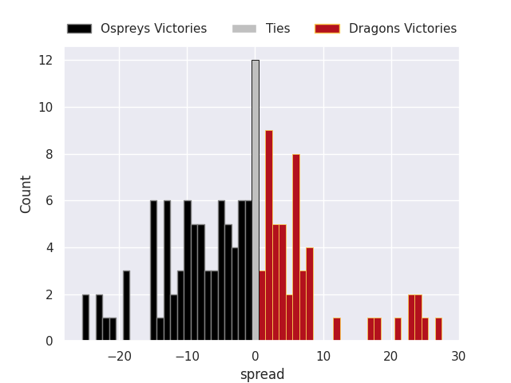
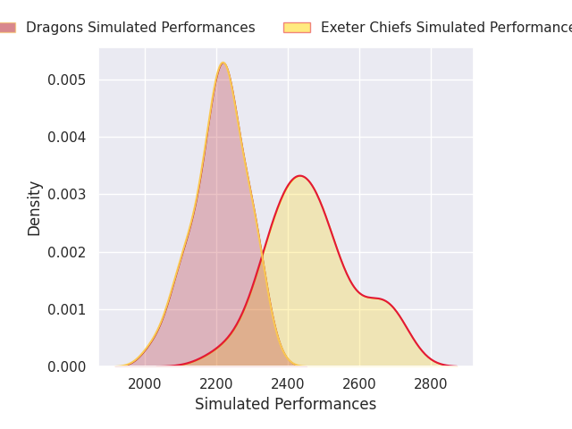
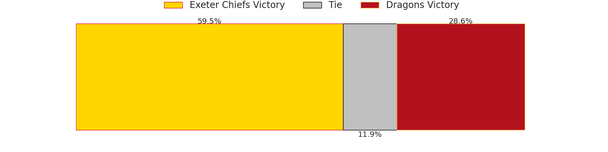
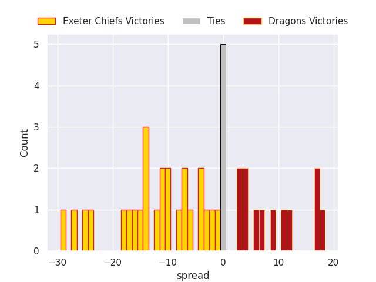
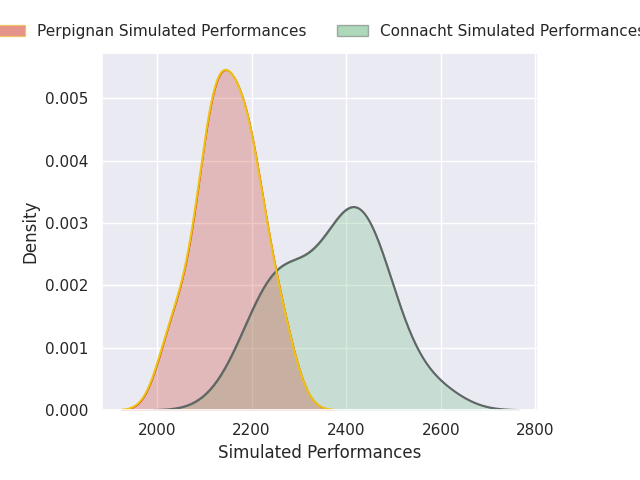
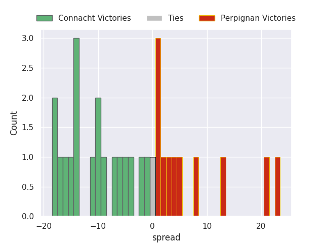
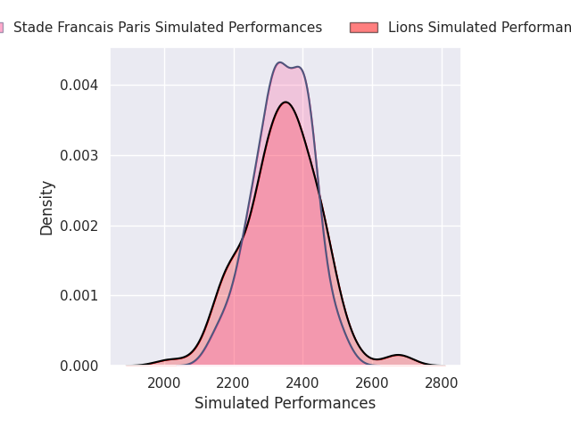
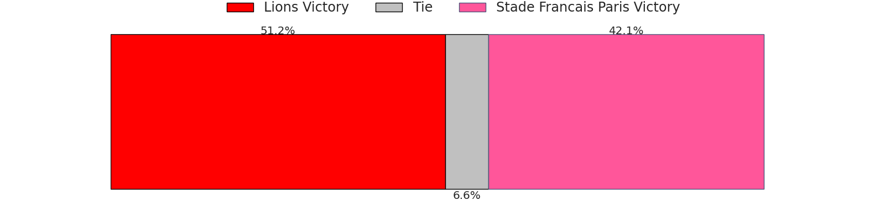
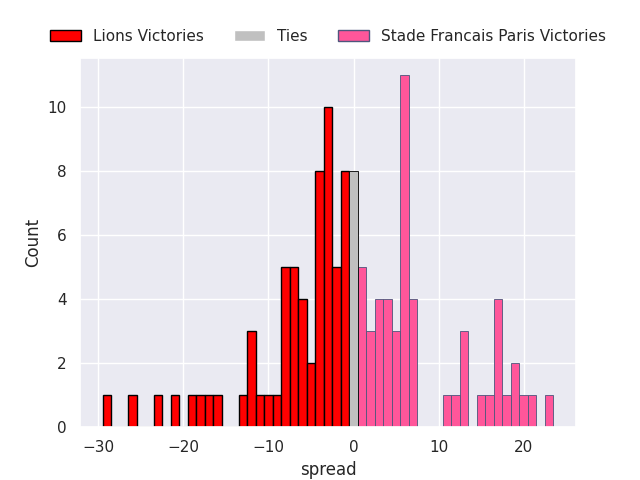

# Team Rankings

# Standings

## Current Standings

### Pool A

| Club                |   Played |   Wins |   Point Differential |   Losing Bonus Points |   Try Bonus Points |   Competition Points |
|:--------------------|---------:|-------:|---------------------:|----------------------:|-------------------:|---------------------:|
| Montpellier Herault |        4 |      4 |                   42 |                     0 |                  3 |                   19 |
| Zebre               |        4 |      3 |                   18 |                     0 |                  2 |                   14 |
| Connacht            |        4 |      2 |                  108 |                     2 |                  3 |                   13 |
| Ospreys             |        4 |      2 |                    5 |                     2 |                  3 |                   13 |
| Black Lion          |        4 |      1 |                  -74 |                     0 |                  1 |                    5 |
| US Montauban        |        4 |      0 |                  -99 |                     1 |                  1 |                    2 |

### Pool B

| Club             |   Played |   Wins |   Point Differential |   Losing Bonus Points |   Try Bonus Points |   Competition Points |
|:-----------------|---------:|-------:|---------------------:|----------------------:|-------------------:|---------------------:|
| Benetton Treviso |        4 |      4 |                   93 |                     0 |                  3 |                   19 |
| Dragons          |        4 |      2 |                  -52 |                     0 |                  1 |                    9 |
| Perpignan        |        4 |      1 |                    4 |                     1 |                  1 |                    8 |
| Lions            |        4 |      1 |                   -3 |                     1 |                  1 |                    8 |
| Lyon             |        4 |      0 |                  -39 |                     1 |                  1 |                    2 |

### Pool C

| Club                 |   Played |   Wins |   Point Differential |   Losing Bonus Points |   Try Bonus Points |   Competition Points |
|:---------------------|---------:|-------:|---------------------:|----------------------:|-------------------:|---------------------:|
| Ulster               |        4 |      3 |                   83 |                     1 |                  3 |                   16 |
| Stade Francais Paris |        4 |      3 |                   39 |                     1 |                  3 |                   16 |
| Exeter Chiefs        |        4 |      2 |                   59 |                     1 |                  3 |                   14 |
| Cardiff Rugby        |        4 |      2 |                  -30 |                     0 |                  1 |                    9 |
| Racing 92            |        4 |      1 |                  -70 |                     0 |                  2 |                    8 |
| Cheetahs             |        4 |      0 |                  -81 |                     1 |                  1 |                    2 |

## Projected Remaining Table

### Pool A

| Club   | To Play   | Projected Wins   | Projected Differential   | Projected Losing Bonus Points   | Projected Try Bonus Points   | Projected Competition Points   |
|--------|-----------|------------------|--------------------------|---------------------------------|------------------------------|--------------------------------|

### Pool B

| Club   | To Play   | Projected Wins   | Projected Differential   | Projected Losing Bonus Points   | Projected Try Bonus Points   | Projected Competition Points   |
|--------|-----------|------------------|--------------------------|---------------------------------|------------------------------|--------------------------------|

### Pool C

| Club   | To Play   | Projected Wins   | Projected Differential   | Projected Losing Bonus Points   | Projected Try Bonus Points   | Projected Competition Points   |
|--------|-----------|------------------|--------------------------|---------------------------------|------------------------------|--------------------------------|

## Projected Total Table

### Pool A

| Club                |   Played |   Wins |   Point Differential |   Losing Bonus Points |   Try Bonus Points |   Competition Points |
|:--------------------|---------:|-------:|---------------------:|----------------------:|-------------------:|---------------------:|
| Montpellier Herault |        4 |      4 |                   42 |                     0 |                  3 |                   19 |
| Zebre               |        4 |      3 |                   18 |                     0 |                  2 |                   14 |
| Connacht            |        4 |      2 |                  108 |                     2 |                  3 |                   13 |
| Ospreys             |        4 |      2 |                    5 |                     2 |                  3 |                   13 |
| Black Lion          |        4 |      1 |                  -74 |                     0 |                  1 |                    5 |
| US Montauban        |        4 |      0 |                  -99 |                     1 |                  1 |                    2 |

### Pool B

| Club             |   Played |   Wins |   Point Differential |   Losing Bonus Points |   Try Bonus Points |   Competition Points |
|:-----------------|---------:|-------:|---------------------:|----------------------:|-------------------:|---------------------:|
| Benetton Treviso |        4 |      4 |                   93 |                     0 |                  3 |                   19 |
| Dragons          |        4 |      2 |                  -52 |                     0 |                  1 |                    9 |
| Perpignan        |        4 |      1 |                    4 |                     1 |                  1 |                    8 |
| Lions            |        4 |      1 |                   -3 |                     1 |                  1 |                    8 |
| Lyon             |        4 |      0 |                  -39 |                     1 |                  1 |                    2 |

### Pool C

| Club                 |   Played |   Wins |   Point Differential |   Losing Bonus Points |   Try Bonus Points |   Competition Points |
|:---------------------|---------:|-------:|---------------------:|----------------------:|-------------------:|---------------------:|
| Ulster               |        4 |      3 |                   83 |                     1 |                  3 |                   16 |
| Stade Francais Paris |        4 |      3 |                   39 |                     1 |                  3 |                   16 |
| Exeter Chiefs        |        4 |      2 |                   59 |                     1 |                  3 |                   14 |
| Cardiff Rugby        |        4 |      2 |                  -30 |                     0 |                  1 |                    9 |
| Racing 92            |        4 |      1 |                  -70 |                     0 |                  2 |                    8 |
| Cheetahs             |        4 |      0 |                  -81 |                     1 |                  1 |                    2 |

## Projected Playoff Results

|                      | Reach Round of 16   | Win Round of 16   | Reach Quarterfinal   | Win Quarterfinal   | Reach Semifinal   | Win Semifinal   | Reach Final   | Win Final   |
|:---------------------|:--------------------|:------------------|:---------------------|:-------------------|:------------------|:----------------|:--------------|:------------|
| Stade Francais Paris | 100.0 %             | 74.3 %            | 74.3 %               | 53.6 %             | 53.6 %            | 24.6 %          | 24.6 %        | 15.8 %      |
| Benetton Treviso     | 100.0 %             | 67.2 %            | 67.2 %               | 40.3 %             | 40.3 %            | 23.6 %          | 23.6 %        | 14.9 %      |
| Montpellier Herault  | 100.0 %             | 71.8 %            | 71.8 %               | 48.2 %             | 48.2 %            | 31.7 %          | 31.7 %        | 13.0 %      |
| Ulster               | 100.0 %             | 73.2 %            | 73.2 %               | 53.1 %             | 53.1 %            | 19.6 %          | 19.6 %        | 8.4 %       |
| Sharks               | 100.0 %             | 46.1 %            | 46.1 %               | 22.2 %             | 22.2 %            | 13.5 %          | 13.5 %        | 8.3 %       |
| Connacht             | 100.0 %             | 53.9 %            | 53.9 %               | 21.5 %             | 21.5 %            | 12.9 %          | 12.9 %        | 7.8 %       |
| Exeter Chiefs        | 100.0 %             | 70.3 %            | 70.3 %               | 26.6 %             | 26.6 %            | 17.9 %          | 17.9 %        | 7.3 %       |
| Pau                  | 100.0 %             | 62.5 %            | 62.5 %               | 21.8 %             | 21.8 %            | 9.9 %           | 9.9 %         | 5.8 %       |
| Lions                | 100.0 %             | 32.8 %            | 32.8 %               | 16.0 %             | 16.0 %            | 8.6 %           | 8.6 %         | 3.8 %       |
| Cardiff Rugby        | 100.0 %             | 28.2 %            | 28.2 %               | 15.1 %             | 15.1 %            | 7.9 %           | 7.9 %         | 3.2 %       |
| Munster              | 100.0 %             | 29.7 %            | 29.7 %               | 10.1 %             | 10.1 %            | 6.1 %           | 6.1 %         | 2.9 %       |
| Perpignan            | 100.0 %             | 25.7 %            | 25.7 %               | 15.2 %             | 15.2 %            | 4.5 %           | 4.5 %         | 2.5 %       |
| La Rochelle          | 100.0 %             | 50.2 %            | 50.2 %               | 16.9 %             | 16.9 %            | 6.5 %           | 6.5 %         | 2.2 %       |
| Ospreys              | 100.0 %             | 26.8 %            | 26.8 %               | 15.4 %             | 15.4 %            | 4.7 %           | 4.7 %         | 1.9 %       |
| Dragons              | 100.0 %             | 49.8 %            | 49.8 %               | 14.6 %             | 14.6 %            | 5.6 %           | 5.6 %         | 1.4 %       |
| Zebre                | 100.0 %             | 37.5 %            | 37.5 %               | 9.4 %              | 9.4 %             | 2.4 %           | 2.4 %         | 0.8 %       |

# Completed Match Review

| Model | Percent Correct Predictions | Spread Error |
| ------ | ------ | ------ |
| Club Level | 68.6% | 9.0 |
| Player Level: Lineup | nan% | nan |
| Player Level: Minutes | nan% | nan |

# Future Predictions

## Week 5

### Benetton Treviso V Lions on 2026-04-02

Average Margin: Benetton Treviso by 4.4

### Exeter Chiefs V Munster on 2026-04-02

Average Margin: Exeter Chiefs by 4.6

### Stade Francais Paris V Perpignan on 2026-04-02

Average Margin: Stade Francais Paris by 7.5

### Ulster V Ospreys on 2026-04-02

Average Margin: Ulster by 7.0

### Dragons V La Rochelle on 2026-04-02

Average Margin: Dragons by 0.6

### Connacht V Sharks on 2026-04-02

Average Margin: Connacht by 1.5

### Zebre V Pau on 2026-04-02

Average Margin: Pau by 2.0

### Montpellier Herault V Cardiff Rugby on 2026-04-02

Average Margin: Montpellier Herault by 5.7

## Week 6

### Cardiff Rugby V Exeter Chiefs on 2026-04-09

Average Margin: Cardiff Rugby by 0.5

### Montpellier Herault V Exeter Chiefs on 2026-04-09

Average Margin: Montpellier Herault by 3.6

### Montpellier Herault V Munster on 2026-04-09

Average Margin: Montpellier Herault by 5.0

### Cardiff Rugby V Munster on 2026-04-09

Average Margin: Cardiff Rugby by 2.3

### Stade Francais Paris V Pau on 2026-04-09

Average Margin: Stade Francais Paris by 4.6

### Perpignan V Pau on 2026-04-09

Average Margin: Perpignan by 0.3

### Perpignan V Zebre on 2026-04-09

Average Margin: Perpignan by 5.3

### Stade Francais Paris V Zebre on 2026-04-09

Average Margin: Stade Francais Paris by 8.1

### Benetton Treviso V Connacht on 2026-04-09

Average Margin: Benetton Treviso by 4.1

### Lions V Sharks on 2026-04-09

Average Margin: Sharks by 0.4

### Benetton Treviso V Sharks on 2026-04-09

Average Margin: Benetton Treviso by 1.1

### Lions V Connacht on 2026-04-09

Average Margin: Lions by 0.2

### Ospreys V Dragons on 2026-04-09

Average Margin: Ospreys by 4.6

### Ulster V La Rochelle on 2026-04-09

Average Margin: Ulster by 6.0

### Ulster V Dragons on 2026-04-09

Average Margin: Ulster by 7.0

### Ospreys V La Rochelle on 2026-04-09

Average Margin: Ospreys by 0.7

## Week 7

### Connacht V Pau on 2026-04-30

Average Margin: Connacht by 1.1

### Cardiff Rugby V Ulster on 2026-04-30

Average Margin: Cardiff Rugby by 0.8

### Montpellier Herault V Ospreys on 2026-04-30

Average Margin: Montpellier Herault by 6.2

### Munster V La Rochelle on 2026-04-30

Average Margin: Munster by 1.6

### Munster V Ospreys on 2026-04-30

Average Margin: Munster by 3.4

### Montpellier Herault V Dragons on 2026-04-30

Average Margin: Montpellier Herault by 5.0

### Exeter Chiefs V Ospreys on 2026-04-30

Average Margin: Exeter Chiefs by 6.1

### Montpellier Herault V La Rochelle on 2026-04-30

Average Margin: Montpellier Herault by 4.7

### Cardiff Rugby V La Rochelle on 2026-04-30

Average Margin: La Rochelle by 1.9

### Munster V Ulster on 2026-04-30

Average Margin: Munster by 1.5

### Cardiff Rugby V Dragons on 2026-04-30

Average Margin: Cardiff Rugby by 5.8

### Exeter Chiefs V Ulster on 2026-04-30

Average Margin: Exeter Chiefs by 4.2

### Exeter Chiefs V La Rochelle on 2026-04-30

Average Margin: Exeter Chiefs by 5.8

### Montpellier Herault V Ulster on 2026-04-30

Average Margin: Montpellier Herault by 3.7

### Exeter Chiefs V Dragons on 2026-04-30

Average Margin: Exeter Chiefs by 5.2

### Connacht V Zebre on 2026-04-30

Average Margin: Connacht by 5.8

### Connacht V Perpignan on 2026-04-30

Average Margin: Connacht by 6.9

### Benetton Treviso V Zebre on 2026-04-30

Average Margin: Benetton Treviso by 5.7

### Lions V Pau on 2026-04-30

Average Margin: Lions by 0.8

### Sharks V Pau on 2026-04-30

Average Margin: Sharks by 1.0

### Benetton Treviso V Perpignan on 2026-04-30

Average Margin: Benetton Treviso by 4.2

### Lions V Perpignan on 2026-04-30

Average Margin: Lions by 3.6

### Sharks V Stade Francais Paris on 2026-04-30

Average Margin: Sharks by 2.3

### Lions V Zebre on 2026-04-30

Average Margin: Lions by 6.8

### Sharks V Zebre on 2026-04-30

Average Margin: Sharks by 12.0

### Connacht V Stade Francais Paris on 2026-04-30

Average Margin: Connacht by 1.6

### Benetton Treviso V Stade Francais Paris on 2026-04-30

Average Margin: Benetton Treviso by 1.0

### Sharks V Perpignan on 2026-04-30

Average Margin: Sharks by 6.9

### Benetton Treviso V Pau on 2026-04-30

Average Margin: Benetton Treviso by 2.4

### Lions V Stade Francais Paris on 2026-04-30

Average Margin: Lions by 0.7

### Cardiff Rugby V Ospreys on 2026-04-30

Average Margin: Cardiff Rugby by 1.8

### Munster V Dragons on 2026-04-30

Average Margin: Munster by 2.4

## Final

### Pau V Dragons on 2026-05-21

Average Margin: Dragons by 0.3

### Connacht V Dragons on 2026-05-21

Average Margin: Connacht by 8.3

### Sharks V Dragons on 2026-05-21

Average Margin: Sharks by 7.1

### Perpignan V Montpellier Herault on 2026-05-21

Average Margin: Montpellier Herault by 1.2

### Lions V Ospreys on 2026-05-21

Average Margin: Lions by 2.7

### Pau V Exeter Chiefs on 2026-05-21

Average Margin: Pau by 2.9

### Connacht V La Rochelle on 2026-05-21

Average Margin: Connacht by 0.6

### Connacht V Ospreys on 2026-05-21

Average Margin: Connacht by 9.5

### Perpignan V Exeter Chiefs on 2026-05-21

Average Margin: Perpignan by 0.8

### Benetton Treviso V Ospreys on 2026-05-21

Average Margin: Benetton Treviso by 3.8

### Sharks V La Rochelle on 2026-05-21

Average Margin: Sharks by 4.7

### Zebre V Munster on 2026-05-21

Average Margin: Munster by 7.5

### Sharks V Ospreys on 2026-05-21

Average Margin: Sharks by 9.2

### Lions V Exeter Chiefs on 2026-05-21

Average Margin: Exeter Chiefs by 2.5

### Pau V Montpellier Herault on 2026-05-21

Average Margin: Pau by 3.0

### Lions V La Rochelle on 2026-05-21

Average Margin: La Rochelle by 2.0

### Perpignan V Ulster on 2026-05-21

Average Margin: Ulster by 2.1

### Lions V Cardiff Rugby on 2026-05-21

Average Margin: Lions by 1.3

### Connacht V Exeter Chiefs on 2026-05-21

Average Margin: Exeter Chiefs by 0.9

### Zebre V Cardiff Rugby on 2026-05-21

Average Margin: Zebre by 3.7

### Zebre V Exeter Chiefs on 2026-05-21

Average Margin: Exeter Chiefs by 6.0

### Lions V Dragons on 2026-05-21

Average Margin: Lions by 8.7

### Stade Francais Paris V Ospreys on 2026-05-21

Average Margin: Stade Francais Paris by 4.2

### Perpignan V Cardiff Rugby on 2026-05-21

Average Margin: Cardiff Rugby by 7.5

### Zebre V Dragons on 2026-05-21

Average Margin: Dragons by 3.5

### Pau V Cardiff Rugby on 2026-05-21

Average Margin: Pau by 5.1

### Zebre V Ospreys on 2026-05-21

Average Margin: Ospreys by 10.0

### Zebre V Ulster on 2026-05-21

Average Margin: Ulster by 4.3

### Sharks V Cardiff Rugby on 2026-05-21

Average Margin: Sharks by 2.3

### Perpignan V Dragons on 2026-05-21

Average Margin: Perpignan by 7.0

### Benetton Treviso V Munster on 2026-05-21

Average Margin: Benetton Treviso by 0.2

### Sharks V Montpellier Herault on 2026-05-21

Average Margin: Sharks by 2.3

### Stade Francais Paris V Montpellier Herault on 2026-05-21

Average Margin: Stade Francais Paris by 0.9

### Benetton Treviso V La Rochelle on 2026-05-21

Average Margin: Benetton Treviso by 5.4

### Sharks V Ulster on 2026-05-21

Average Margin: Sharks by 1.9

### Stade Francais Paris V Ulster on 2026-05-21

Average Margin: Stade Francais Paris by 1.9

### Stade Francais Paris V Exeter Chiefs on 2026-05-21

Average Margin: Stade Francais Paris by 3.7

### Connacht V Ulster on 2026-05-21

Average Margin: Connacht by 1.8

### Connacht V Montpellier Herault on 2026-05-21

Average Margin: Connacht by 3.1

### Connacht V Cardiff Rugby on 2026-05-21

Average Margin: Connacht by 4.3

### Sharks V Munster on 2026-05-21

Average Margin: Sharks by 1.0

### Stade Francais Paris V La Rochelle on 2026-05-21

Average Margin: Stade Francais Paris by 2.5

### Sharks V Exeter Chiefs on 2026-05-21

Average Margin: Sharks by 1.6

### Benetton Treviso V Exeter Chiefs on 2026-05-21

Average Margin: Benetton Treviso by 2.3

### Lions V Montpellier Herault on 2026-05-21

Average Margin: Montpellier Herault by 1.1

### Benetton Treviso V Cardiff Rugby on 2026-05-21

Average Margin: Benetton Treviso by 4.8

### Stade Francais Paris V Cardiff Rugby on 2026-05-21

Average Margin: Stade Francais Paris by 2.6

### Benetton Treviso V Montpellier Herault on 2026-05-21

Average Margin: Benetton Treviso by 2.4

### Perpignan V La Rochelle on 2026-05-21

Average Margin: Perpignan by 3.8

### Lions V Munster on 2026-05-21

Average Margin: Munster by 10.3

### Pau V Ospreys on 2026-05-21

Average Margin: Pau by 0.5

### Benetton Treviso V Dragons on 2026-05-21

Average Margin: Benetton Treviso by 7.2

### Zebre V Montpellier Herault on 2026-05-21

Average Margin: Zebre by 5.0

### Pau V Munster on 2026-05-21

Average Margin: Pau by 0.3

### Connacht V Munster on 2026-05-21

Average Margin: Connacht by 2.2

### Pau V Ulster on 2026-05-21

Average Margin: Pau by 1.3

### Benetton Treviso V Ulster on 2026-05-21

Average Margin: Benetton Treviso by 2.2

### Lions V Ulster on 2026-05-21

Average Margin: Lions by 1.2

### Stade Francais Paris V Munster on 2026-05-21

Average Margin: Stade Francais Paris by 6.3

### Stade Francais Paris V Dragons on 2026-05-21

Average Margin: Stade Francais Paris by 5.4

### Perpignan V Munster on 2026-05-21

Average Margin: Perpignan by 14.5

