# Team Rankings

# Standings

## Current Standings

### Pool A

| Club                |   Played |   Wins |   Point Differential |   Losing Bonus Points |   Try Bonus Points |   Competition Points |
|:--------------------|---------:|-------:|---------------------:|----------------------:|-------------------:|---------------------:|
| Ospreys             |        2 |      2 |                   14 |                     0 |                  2 |                   10 |
| Montpellier Herault |        2 |      2 |                   35 |                     0 |                  1 |                    9 |
| Connacht            |        2 |      1 |                   49 |                     1 |                  1 |                    6 |
| Zebre               |        2 |      1 |                    0 |                     0 |                  1 |                    5 |
| US Montauban        |        2 |      0 |                  -35 |                     0 |                    |                    0 |
| Black Lion          |        2 |      0 |                  -63 |                     0 |                    |                    0 |

### Pool B

| Club              |   Played |   Wins |   Point Differential |   Losing Bonus Points |   Try Bonus Points |   Competition Points |
|:------------------|---------:|-------:|---------------------:|----------------------:|-------------------:|---------------------:|
| Benetton Treviso  |        2 |      2 |                   21 |                     0 |                  1 |                    9 |
| Newcastle Falcons |        2 |      2 |                   13 |                     0 |                    |                    8 |
| Perpignan         |        2 |      1 |                   11 |                     0 |                  1 |                    5 |
| Dragons           |        2 |      1 |                  -22 |                     0 |                    |                    4 |
| Lyon              |        2 |      0 |                  -11 |                     1 |                    |                    1 |
| Lions             |        2 |      0 |                  -12 |                     1 |                    |                    1 |

### Pool C

| Club                 |   Played |   Wins |   Point Differential |   Losing Bonus Points |   Try Bonus Points |   Competition Points |
|:---------------------|---------:|-------:|---------------------:|----------------------:|-------------------:|---------------------:|
| Stade Francais Paris |        2 |      2 |                   44 |                     0 |                  2 |                   10 |
| Exeter Chiefs        |        2 |      1 |                   30 |                     0 |                  2 |                    8 |
| Ulster               |        2 |      1 |                   51 |                     1 |                  2 |                    7 |
| Cardiff Rugby        |        2 |      1 |                  -18 |                     0 |                    |                    4 |
| Racing 92            |        2 |      0 |                  -54 |                     0 |                  1 |                    3 |
| Cheetahs             |        2 |      0 |                  -53 |                     0 |                    |                    0 |

## Projected Remaining Table

### Pool A

| Club                |   To Play |   Projected Wins |   Projected Differential |   Projected Losing Bonus Points | Projected Try Bonus Points   |   Projected Competition Points |
|:--------------------|----------:|-----------------:|-------------------------:|--------------------------------:|:-----------------------------|-------------------------------:|
| Montpellier Herault |         2 |            1.138 |                    4.984 |                           0.428 |                              |                          5.2   |
| Ospreys             |         2 |            1.075 |                    2.471 |                           0.512 |                              |                          5.072 |
| Connacht            |         2 |            0.956 |                    1.858 |                           0.349 |                              |                          4.331 |
| Zebre               |         2 |            0.865 |                   -1.551 |                           0.549 |                              |                          4.217 |
| US Montauban        |         2 |            0.882 |                   -4.084 |                           0.318 |                              |                          4.012 |
| Black Lion          |         2 |            0.787 |                   -3.678 |                           0.539 |                              |                          3.863 |

### Pool B

| Club              |   To Play |   Projected Wins |   Projected Differential |   Projected Losing Bonus Points | Projected Try Bonus Points   |   Projected Competition Points |
|:------------------|----------:|-----------------:|-------------------------:|--------------------------------:|:-----------------------------|-------------------------------:|
| Lions             |         2 |            1.083 |                    2.417 |                           0.495 |                              |                          5.053 |
| Benetton Treviso  |         2 |            1.017 |                    2.79  |                           0.48  |                              |                          4.71  |
| Newcastle Falcons |         2 |            0.942 |                   -0.205 |                           0.542 |                              |                          4.548 |
| Lyon              |         2 |            0.938 |                   -0.12  |                           0.536 |                              |                          4.49  |
| Perpignan         |         2 |            0.848 |                   -1.175 |                           0.633 |                              |                          4.285 |
| Dragons           |         2 |            0.859 |                   -3.707 |                           0.434 |                              |                          4.034 |

### Pool C

| Club                 |   To Play |   Projected Wins |   Projected Differential |   Projected Losing Bonus Points | Projected Try Bonus Points   |   Projected Competition Points |
|:---------------------|----------:|-----------------:|-------------------------:|--------------------------------:|:-----------------------------|-------------------------------:|
| Ulster               |         2 |            1.369 |                    9.88  |                           0.302 |                              |                          5.946 |
| Racing 92            |         2 |            1.222 |                    9.162 |                           0.395 |                              |                          5.447 |
| Exeter Chiefs        |         2 |            1.017 |                    2.874 |                           0.478 |                              |                          4.724 |
| Stade Francais Paris |         2 |            0.943 |                   -0.851 |                           0.478 |                              |                          4.44  |
| Cardiff Rugby        |         2 |            0.737 |                   -5.259 |                           0.526 |                              |                          3.674 |
| Cheetahs             |         2 |            0.457 |                  -15.806 |                           0.399 |                              |                          2.347 |

## Projected Total Table

### Pool A

| Club                |   Played |   Wins |   Point Differential |   Losing Bonus Points |   Try Bonus Points |   Competition Points |
|:--------------------|---------:|-------:|---------------------:|----------------------:|-------------------:|---------------------:|
| Ospreys             |        4 |  3.075 |               16.471 |                 0.512 |                  2 |               15.072 |
| Montpellier Herault |        4 |  3.138 |               39.984 |                 0.428 |                  1 |               14.2   |
| Connacht            |        4 |  1.956 |               50.858 |                 1.349 |                  1 |               10.331 |
| Zebre               |        4 |  1.865 |               -1.551 |                 0.549 |                  1 |                9.217 |
| US Montauban        |        4 |  0.882 |              -39.084 |                 0.318 |                    |                4.012 |
| Black Lion          |        4 |  0.787 |              -66.678 |                 0.539 |                    |                3.863 |

### Pool B

| Club              |   Played |   Wins |   Point Differential |   Losing Bonus Points |   Try Bonus Points |   Competition Points |
|:------------------|---------:|-------:|---------------------:|----------------------:|-------------------:|---------------------:|
| Benetton Treviso  |        4 |  3.017 |               23.79  |                 0.48  |                  1 |               13.71  |
| Newcastle Falcons |        4 |  2.942 |               12.795 |                 0.542 |                    |               12.548 |
| Perpignan         |        4 |  1.848 |                9.825 |                 0.633 |                  1 |                9.285 |
| Dragons           |        4 |  1.859 |              -25.707 |                 0.434 |                    |                8.034 |
| Lions             |        4 |  1.083 |               -9.583 |                 1.495 |                    |                6.053 |
| Lyon              |        4 |  0.938 |              -11.12  |                 1.536 |                    |                5.49  |

### Pool C

| Club                 |   Played |   Wins |   Point Differential |   Losing Bonus Points |   Try Bonus Points |   Competition Points |
|:---------------------|---------:|-------:|---------------------:|----------------------:|-------------------:|---------------------:|
| Stade Francais Paris |        4 |  2.943 |               43.149 |                 0.478 |                  2 |               14.44  |
| Ulster               |        4 |  2.369 |               60.88  |                 1.302 |                  2 |               12.946 |
| Exeter Chiefs        |        4 |  2.017 |               32.874 |                 0.478 |                  2 |               12.724 |
| Racing 92            |        4 |  1.222 |              -44.838 |                 0.395 |                  1 |                8.447 |
| Cardiff Rugby        |        4 |  1.737 |              -23.259 |                 0.526 |                    |                7.674 |
| Cheetahs             |        4 |  0.457 |              -68.806 |                 0.399 |                    |                2.347 |

## Projected Playoff Results

|                      | Reach Round of 16   | Win Round of 16   | Reach Quarterfinal   | Win Quarterfinal   | Reach Semifinal   | Win Semifinal   | Reach Final   | Win Final   |
|:---------------------|:--------------------|:------------------|:---------------------|:-------------------|:------------------|:----------------|:--------------|:------------|
| Stade Francais Paris | 100.0 %             | 74.1 %            | 74.1 %               | 46.8 %             | 46.8 %            | 25.4 %          | 25.4 %        | 14.2 %      |
| Ulster               | 99.4 %              | 67.2 %            | 67.2 %               | 40.1 %             | 40.1 %            | 25.3 %          | 25.3 %        | 13.0 %      |
| Exeter Chiefs        | 98.8 %              | 67.0 %            | 67.0 %               | 37.0 %             | 37.0 %            | 23.7 %          | 23.7 %        | 11.8 %      |
| Montpellier Herault  | 100.0 %             | 69.3 %            | 69.3 %               | 41.6 %             | 41.6 %            | 21.6 %          | 21.6 %        | 11.7 %      |
| Ospreys              | 100.0 %             | 62.8 %            | 62.8 %               | 30.2 %             | 30.2 %            | 14.9 %          | 14.9 %        | 7.3 %       |
| Benetton Treviso     | 99.4 %              | 59.7 %            | 59.7 %               | 32.2 %             | 32.2 %            | 11.9 %          | 11.9 %        | 5.3 %       |
| Connacht             | 92.5 %              | 46.5 %            | 46.5 %               | 20.2 %             | 20.2 %            | 8.0 %           | 8.0 %         | 4.9 %       |
| Leicester Tigers     | 57.5 %              | 28.1 %            | 28.1 %               | 13.0 %             | 13.0 %            | 5.1 %           | 5.1 %         | 2.9 %       |
| Racing 92            | 43.7 %              | 19.6 %            | 19.6 %               | 10.9 %             | 10.9 %            | 5.8 %           | 5.8 %         | 2.3 %       |
| Cardiff Rugby        | 55.6 %              | 19.3 %            | 19.3 %               | 9.7 %              | 9.7 %             | 4.5 %           | 4.5 %         | 2.1 %       |
| Bulls                | 37.3 %              | 15.9 %            | 15.9 %               | 7.9 %              | 7.9 %             | 3.7 %           | 3.7 %         | 2.1 %       |
| Saracens             | 25.9 %              | 11.9 %            | 11.9 %               | 5.2 %              | 5.2 %             | 3.5 %           | 3.5 %         | 2.1 %       |
| Perpignan            | 79.9 %              | 28.6 %            | 28.6 %               | 11.1 %             | 11.1 %            | 3.5 %           | 3.5 %         | 1.7 %       |
| Edinburgh            | 28.9 %              | 11.6 %            | 11.6 %               | 4.8 %              | 4.8 %             | 2.6 %           | 2.6 %         | 1.6 %       |
| Pau                  | 29.8 %              | 12.2 %            | 12.2 %               | 5.4 %              | 5.4 %             | 2.5 %           | 2.5 %         | 1.4 %       |
| Stade Toulousain     | 9.6 %               | 6.3 %             | 6.3 %                | 3.5 %              | 3.5 %             | 2.3 %           | 2.3 %         | 1.4 %       |
| Newcastle Falcons    | 98.0 %              | 44.1 %            | 44.1 %               | 16.6 %             | 16.6 %            | 5.1 %           | 5.1 %         | 1.3 %       |
| Zebre                | 86.7 %              | 25.6 %            | 25.6 %               | 9.3 %              | 9.3 %             | 4.0 %           | 4.0 %         | 1.3 %       |
| Lions                | 35.6 %              | 10.7 %            | 10.7 %               | 6.0 %              | 6.0 %             | 2.4 %           | 2.4 %         | 1.3 %       |
| Dragons              | 62.1 %              | 19.0 %            | 19.0 %               | 7.8 %              | 7.8 %             | 3.2 %           | 3.2 %         | 1.2 %       |
| Sharks               | 31.5 %              | 13.1 %            | 13.1 %               | 4.6 %              | 4.6 %             | 2.5 %           | 2.5 %         | 1.2 %       |
| Castres Olympique    | 23.7 %              | 10.9 %            | 10.9 %               | 4.6 %              | 4.6 %             | 2.1 %           | 2.1 %         | 1.2 %       |
| Lyon                 | 25.0 %              | 8.4 %             | 8.4 %                | 5.5 %              | 5.5 %             | 2.6 %           | 2.6 %         | 1.1 %       |
| Sale Sharks          | 19.0 %              | 7.6 %             | 7.6 %                | 3.4 %              | 3.4 %             | 2.0 %           | 2.0 %         | 1.0 %       |
| Munster              | 13.4 %              | 6.1 %             | 6.1 %                | 2.3 %              | 2.3 %             | 1.5 %           | 1.5 %         | 0.8 %       |
| Bath Rugby           | 5.2 %               | 3.1 %             | 3.1 %                | 2.0 %              | 2.0 %             | 1.5 %           | 1.5 %         | 0.7 %       |
| Clermont Auvergne    | 13.9 %              | 5.4 %             | 5.4 %                | 1.8 %              | 1.8 %             | 1.4 %           | 1.4 %         | 0.7 %       |
| Scarlets             | 32.9 %              | 11.2 %            | 11.2 %               | 3.8 %              | 3.8 %             | 1.4 %           | 1.4 %         | 0.5 %       |
| Harlequins           | 15.2 %              | 5.6 %             | 5.6 %                | 1.8 %              | 1.8 %             | 0.9 %           | 0.9 %         | 0.5 %       |
| Black Lion           | 10.2 %              | 3.5 %             | 3.5 %                | 1.5 %              | 1.5 %             | 1.0 %           | 1.0 %         | 0.4 %       |
| Toulon               | 9.7 %               | 4.6 %             | 4.6 %                | 1.4 %              | 1.4 %             | 0.9 %           | 0.9 %         | 0.4 %       |
| Gloucester Rugby     | 19.1 %              | 6.5 %             | 6.5 %                | 2.5 %              | 2.5 %             | 1.1 %           | 1.1 %         | 0.2 %       |
| Bayonne              | 20.0 %              | 7.6 %             | 7.6 %                | 3.1 %              | 3.1 %             | 1.0 %           | 1.0 %         | 0.2 %       |
| La Rochelle          | 7.3 %               | 3.1 %             | 3.1 %                | 1.1 %              | 1.1 %             | 0.7 %           | 0.7 %         | 0.2 %       |
| US Montauban         | 10.6 %              | 2.9 %             | 2.9 %                | 0.7 %              | 0.7 %             | 0.2 %           | 0.2 %         | 0.0 %       |
| Cheetahs             | 2.5 %               | 0.8 %             | 0.8 %                | 0.5 %              | 0.5 %             | 0.1 %           | 0.1 %         | 0.0 %       |
| Glasgow Warriors     | 0.1 %               | 0.1 %             | 0.1 %                | 0.1 %              | 0.1 %             | 0.1 %           | 0.1 %         | 0.0 %       |

# Completed Match Review

| Model | Percent Correct Predictions | Spread Error |
| ------ | ------ | ------ |
| Club Level | 63.1% | 7.7 |
| Player Level: Lineup | nan% | nan |
| Player Level: Minutes | nan% | nan |

# Future Predictions

## Week 3

### Newcastle Falcons V Perpignan on 2026/01/10

Average Margin: Newcastle Falcons by 2.2

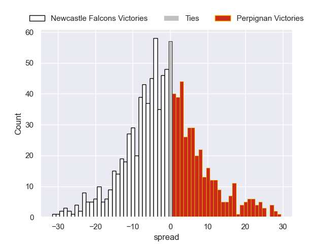

### US Montauban V Black Lion on 2026/01/10

Average Margin: US Montauban by 3.8

### Stade Francais Paris V Exeter Chiefs on 2026/01/10

Average Margin: Stade Francais Paris by 3.3

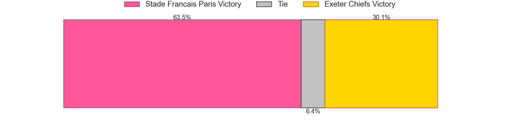

### Benetton Treviso V Dragons on 2026/01/10

Average Margin: Benetton Treviso by 6.1

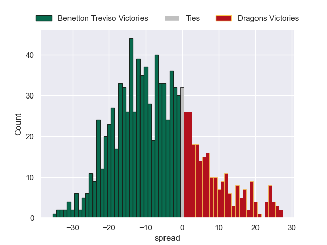

### Cardiff Rugby V Racing 92 on 2026/01/10

Average Margin: Cardiff Rugby by 0.9

### Lions V Lyon on 2026/01/10

Average Margin: Lions by 3.4

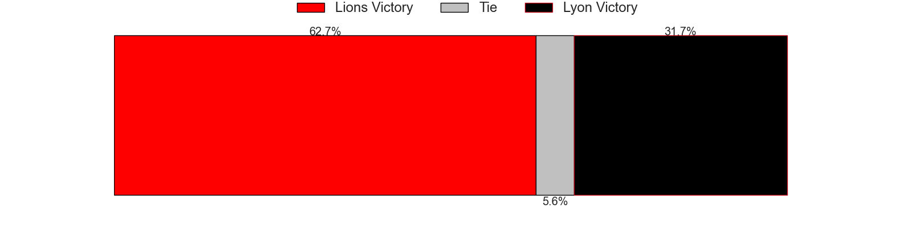

### Zebre V Ospreys on 2026/01/11

Average Margin: Ospreys by 1.4

### Montpellier Herault V Connacht on 2026/01/11

Average Margin: Montpellier Herault by 6.0

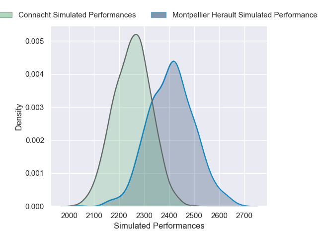

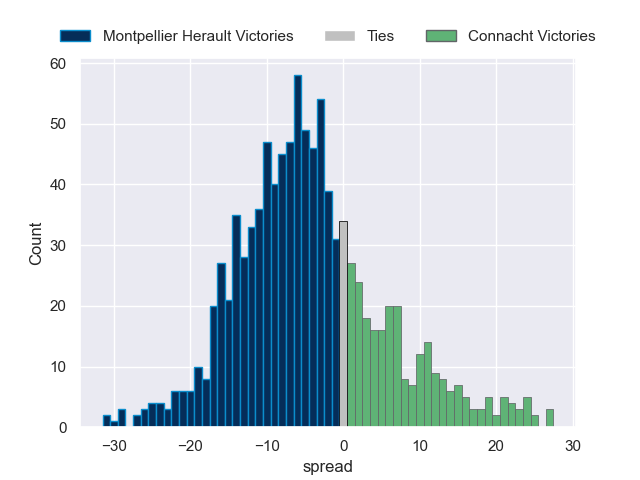

### Cheetahs V Ulster on 2026/01/11

Average Margin: Ulster by 5.7

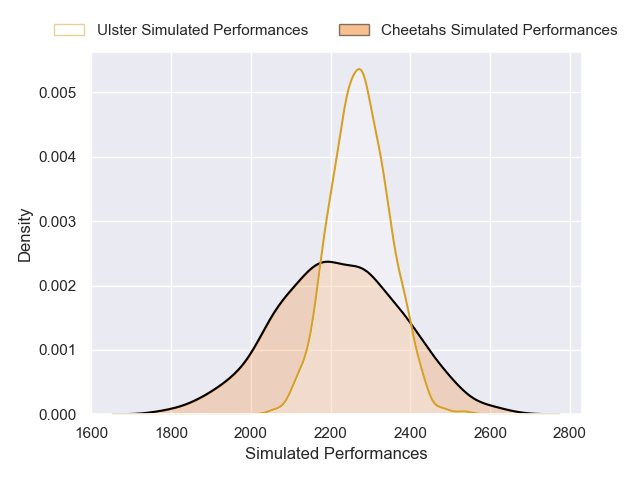

## Week 4

### Dragons V Newcastle Falcons on 2026/01/16

Average Margin: Dragons by 2.4

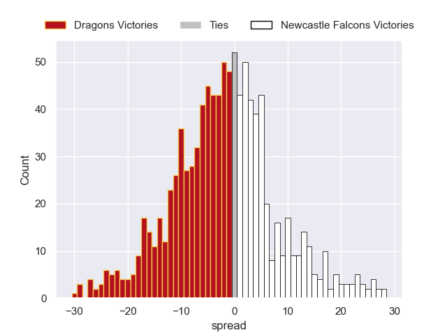

### Ulster V Stade Francais Paris on 2026/01/17

Average Margin: Ulster by 4.1

### Ospreys V Montpellier Herault on 2026/01/17

Average Margin: Ospreys by 1.0

### Connacht V US Montauban on 2026/01/17

Average Margin: Connacht by 7.9

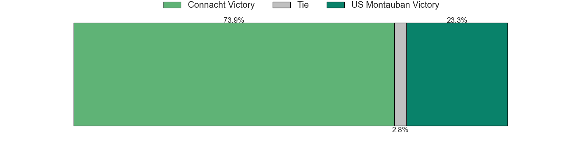
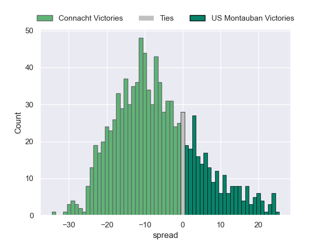

### Perpignan V Lions on 2026/01/17

Average Margin: Perpignan by 1.0

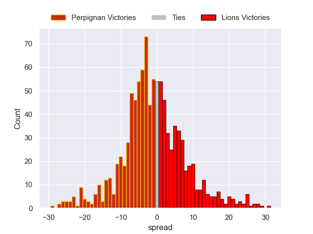

### Black Lion V Zebre on 2026/01/17

Average Margin: Black Lion by 0.1

### Racing 92 V Cheetahs on 2026/01/18

Average Margin: Racing 92 by 10.1

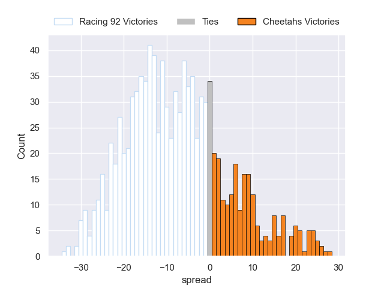

### Lyon V Benetton Treviso on 2026/01/18

Average Margin: Lyon by 3.3

### Exeter Chiefs V Cardiff Rugby on 2026/01/18

Average Margin: Exeter Chiefs by 6.2

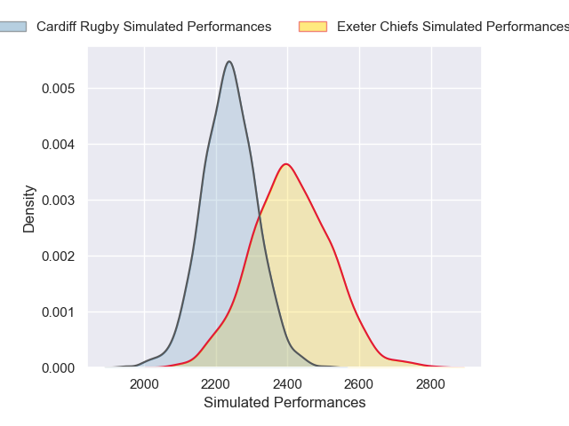

## Week 5

### Montpellier Herault V Bulls on 2026-04-02

Average Margin: Montpellier Herault by 8.3

### Connacht V Stade Toulousain on 2026-04-02

Average Margin: Connacht by 5.0

### Cardiff Rugby V Castres Olympique on 2026-04-02

Average Margin: Cardiff Rugby by 1.4

### Racing 92 V Clermont Auvergne on 2026-04-02

Average Margin: Racing 92 by 0.8

### Connacht V Clermont Auvergne on 2026-04-02

Average Margin: Clermont Auvergne by 6.8

### Racing 92 V Gloucester Rugby on 2026-04-02

Average Margin: Racing 92 by 7.2

### Zebre V Stade Toulousain on 2026-04-02

Average Margin: Stade Toulousain by 9.0

### Racing 92 V Castres Olympique on 2026-04-02

Average Margin: Racing 92 by 3.0

### Exeter Chiefs V Clermont Auvergne on 2026-04-02

Average Margin: Exeter Chiefs by 6.6

### Connacht V Sharks on 2026-04-02

Average Margin: Connacht by 5.0

### Montpellier Herault V Toulon on 2026-04-02

Average Margin: Montpellier Herault by 0.3

### Exeter Chiefs V Toulon on 2026-04-02

Average Margin: Exeter Chiefs by 7.4

### Exeter Chiefs V Munster on 2026-04-02

Average Margin: Exeter Chiefs by 0.8

### Connacht V Saracens on 2026-04-02

Average Margin: Saracens by 2.4

### Montpellier Herault V Edinburgh on 2026-04-02

Average Margin: Montpellier Herault by 6.7

### Stade Francais Paris V Castres Olympique on 2026-04-02

Average Margin: Stade Francais Paris by 5.3

### Cardiff Rugby V Toulon on 2026-04-02

Average Margin: Toulon by 0.0

### Stade Francais Paris V Stade Toulousain on 2026-04-02

Average Margin: Stade Francais Paris by 1.8

### Zebre V Clermont Auvergne on 2026-04-02

Average Margin: Clermont Auvergne by 1.6

### Stade Francais Paris V Gloucester Rugby on 2026-04-02

Average Margin: Stade Francais Paris by 2.7

### Racing 92 V Sale Sharks on 2026-04-02

Average Margin: Racing 92 by 11.0

### Ulster V Saracens on 2026-04-02

Average Margin: Saracens by 0.6

### Zebre V Gloucester Rugby on 2026-04-02

Average Margin: Gloucester Rugby by 4.8

### Ospreys V Stade Toulousain on 2026-04-02

Average Margin: Stade Toulousain by 0.0

### Cardiff Rugby V Edinburgh on 2026-04-02

Average Margin: Cardiff Rugby by 1.7

### Cardiff Rugby V Bath Rugby on 2026-04-02

Average Margin: Bath Rugby by 4.3

### Dragons V Clermont Auvergne on 2026-04-02

Average Margin: Clermont Auvergne by 1.7

### Stade Francais Paris V Sharks on 2026-04-02

Average Margin: Stade Francais Paris by 7.4

### Connacht V Edinburgh on 2026-04-02

Average Margin: Connacht by 2.8

### Racing 92 V Sharks on 2026-04-02

Average Margin: Racing 92 by 2.1

### Zebre V Sale Sharks on 2026-04-02

Average Margin: Zebre by 2.5

### Montpellier Herault V Clermont Auvergne on 2026-04-02

Average Margin: Montpellier Herault by 6.0

### Connacht V Munster on 2026-04-02

Average Margin: Munster by 0.2

### Stade Francais Paris V Clermont Auvergne on 2026-04-02

Average Margin: Stade Francais Paris by 3.2

### Racing 92 V Saracens on 2026-04-02

Average Margin: Racing 92 by 0.8

### Zebre V Bath Rugby on 2026-04-02

Average Margin: Bath Rugby by 4.5

### Stade Francais Paris V Edinburgh on 2026-04-02

Average Margin: Stade Francais Paris by 2.5

### Ulster V Bath Rugby on 2026-04-02

Average Margin: Bath Rugby by 0.7

### Connacht V Sale Sharks on 2026-04-02

Average Margin: Connacht by 7.0

### Ulster V Toulon on 2026-04-02

Average Margin: Ulster by 3.2

### Newcastle Falcons V Saracens on 2026-04-02

Average Margin: Saracens by 6.3

### Connacht V Gloucester Rugby on 2026-04-02

Average Margin: Connacht by 6.0

### Exeter Chiefs V La Rochelle on 2026-04-02

Average Margin: Exeter Chiefs by 0.6

### Exeter Chiefs V Bath Rugby on 2026-04-02

Average Margin: Bath Rugby by 2.8

### Ospreys V Saracens on 2026-04-02

Average Margin: Saracens by 1.5

### Montpellier Herault V Saracens on 2026-04-02

Average Margin: Saracens by 0.0

### Exeter Chiefs V Gloucester Rugby on 2026-04-02

Average Margin: Exeter Chiefs by 6.6

### Stade Francais Paris V Sale Sharks on 2026-04-02

Average Margin: Stade Francais Paris by 5.3

### Newcastle Falcons V Connacht on 2026-04-02

Average Margin: Newcastle Falcons by 4.0

### Exeter Chiefs V US Montauban on 2026-04-02

Average Margin: Exeter Chiefs by 7.5

### Stade Francais Paris V Exeter Chiefs on 2026-04-02

Average Margin: Stade Francais Paris by 12.0

### Newcastle Falcons V Dragons on 2026-04-02

Average Margin: Newcastle Falcons by 1.8

### Stade Francais Paris V Ulster on 2026-04-02

Average Margin: Stade Francais Paris by 5.5

### Newcastle Falcons V Exeter Chiefs on 2026-04-02

Average Margin: Newcastle Falcons by 11.0

### Newcastle Falcons V Cardiff Rugby on 2026-04-02

Average Margin: Newcastle Falcons by 4.3

### Montpellier Herault V Racing 92 on 2026-04-02

Average Margin: Montpellier Herault by 0.4

### Stade Francais Paris V Black Lion on 2026-04-02

Average Margin: Stade Francais Paris by 4.6

### Ulster V Zebre on 2026-04-02

Average Margin: Ulster by 5.6

### Stade Francais Paris V Lions on 2026-04-02

Average Margin: Stade Francais Paris by 8.8

### Ospreys V Racing 92 on 2026-04-02

Average Margin: Ospreys by 1.4

### Newcastle Falcons V Zebre on 2026-04-02

Average Margin: Newcastle Falcons by 2.6

### Stade Francais Paris V Cardiff Rugby on 2026-04-02

Average Margin: Stade Francais Paris by 4.7

### Stade Francais Paris V Connacht on 2026-04-02

Average Margin: Stade Francais Paris by 8.1

### Montpellier Herault V Ospreys on 2026-04-02

Average Margin: Montpellier Herault by 22.0

### Benetton Treviso V Perpignan on 2026-04-02

Average Margin: Benetton Treviso by 9.2

### Ospreys V Benetton Treviso on 2026-04-02

Average Margin: Ospreys by 6.0

### Ulster V Cardiff Rugby on 2026-04-02

Average Margin: Ulster by 5.5

### Ospreys V US Montauban on 2026-04-02

Average Margin: Ospreys by 4.9

### Exeter Chiefs V Lions on 2026-04-02

Average Margin: Exeter Chiefs by 4.0

### Exeter Chiefs V Dragons on 2026-04-02

Average Margin: Exeter Chiefs by 11.8

### Ospreys V Lions on 2026-04-02

Average Margin: Ospreys by 3.2

### Ospreys V Connacht on 2026-04-02

Average Margin: Ospreys by 2.3

### Stade Francais Paris V Bath Rugby on 2026-04-02

Average Margin: Stade Francais Paris by 3.7

### Benetton Treviso V Racing 92 on 2026-04-02

Average Margin: Benetton Treviso by 1.0

### Montpellier Herault V Black Lion on 2026-04-02

Average Margin: Montpellier Herault by 12.7

### Connacht V Dragons on 2026-04-02

Average Margin: Connacht by 12.0

### Benetton Treviso V Black Lion on 2026-04-02

Average Margin: Benetton Treviso by 15.3

### Exeter Chiefs V Racing 92 on 2026-04-02

Average Margin: Exeter Chiefs by 7.8

### Connacht V Benetton Treviso on 2026-04-02

Average Margin: Connacht by 17.0

### Montpellier Herault V US Montauban on 2026-04-02

Average Margin: Montpellier Herault by 12.2

### Stade Francais Paris V Newcastle Falcons on 2026-04-02

Average Margin: Stade Francais Paris by 4.2

### Ospreys V Cheetahs on 2026-04-02

Average Margin: Ospreys by 2.5

### Exeter Chiefs V Cheetahs on 2026-04-02

Average Margin: Exeter Chiefs by 17.5

### Newcastle Falcons V Black Lion on 2026-04-02

Average Margin: Newcastle Falcons by 10.0

### Stade Francais Paris V Benetton Treviso on 2026-04-02

Average Margin: Stade Francais Paris by 1.0

### Exeter Chiefs V Zebre on 2026-04-02

Average Margin: Exeter Chiefs by 11.6

### Newcastle Falcons V Racing 92 on 2026-04-02

Average Margin: Racing 92 by 1.0

### Montpellier Herault V Cheetahs on 2026-04-02

Average Margin: Montpellier Herault by 5.0

### Newcastle Falcons V Lions on 2026-04-02

Average Margin: Newcastle Falcons by 3.5

### Stade Francais Paris V Cheetahs on 2026-04-02

Average Margin: Stade Francais Paris by 14.0

### Exeter Chiefs V Perpignan on 2026-04-02

Average Margin: Exeter Chiefs by 7.3

### Benetton Treviso V Cardiff Rugby on 2026-04-02

Average Margin: Benetton Treviso by 4.3

### Connacht V Cheetahs on 2026-04-02

Average Margin: Cheetahs by 1.0

### Ulster V Perpignan on 2026-04-02

Average Margin: Ulster by 14.9

### Montpellier Herault V Benetton Treviso on 2026-04-02

Average Margin: Montpellier Herault by 4.0

### Ulster V Newcastle Falcons on 2026-04-02

Average Margin: Ulster by 10.5

### Exeter Chiefs V Connacht on 2026-04-02

Average Margin: Exeter Chiefs by 10.5

### Stade Francais Paris V Toulon on 2026-04-02

Average Margin: Stade Francais Paris by 1.7

### Cardiff Rugby V Sharks on 2026-04-02

Average Margin: Cardiff Rugby by 7.4

### Connacht V Bath Rugby on 2026-04-02

Average Margin: Bath Rugby by 7.2

### Perpignan V Ospreys on 2026-04-02

Average Margin: Perpignan by 7.5

### Dragons V Lyon on 2026-04-02

Average Margin: Dragons by 12.0

### Benetton Treviso V Montpellier Herault on 2026-04-02

Average Margin: Benetton Treviso by 2.0

### Benetton Treviso V Ulster on 2026-04-02

Average Margin: Benetton Treviso by 4.7

### Perpignan V Lyon on 2026-04-02

Average Margin: Perpignan by 9.5

### Dragons V Stade Francais Paris on 2026-04-02

Average Margin: Stade Francais Paris by 4.2

### Perpignan V Exeter Chiefs on 2026-04-02

Average Margin: Exeter Chiefs by 5.6

### Exeter Chiefs V Ospreys on 2026-04-02

Average Margin: Exeter Chiefs by 6.3

### Benetton Treviso V Stade Francais Paris on 2026-04-02

Average Margin: Stade Francais Paris by 0.4

### Perpignan V Zebre on 2026-04-02

Average Margin: Perpignan by 6.0

### Benetton Treviso V Ospreys on 2026-04-02

Average Margin: Benetton Treviso by 9.0

### Newcastle Falcons V Benetton Treviso on 2026-04-02

Average Margin: Newcastle Falcons by 3.5

### Perpignan V Racing 92 on 2026-04-02

Average Margin: Perpignan by 1.9

### Lyon V Stade Toulousain on 2026-04-02

Average Margin: Lyon by 7.0

### Perpignan V Bath Rugby on 2026-04-02

Average Margin: Bath Rugby by 5.0

### Lions V Clermont Auvergne on 2026-04-02

Average Margin: Lions by 18.0

### Dragons V Bath Rugby on 2026-04-02

Average Margin: Bath Rugby by 11.0

### Lyon V Castres Olympique on 2026-04-02

Average Margin: Lyon by 9.0

### Lions V Saracens on 2026-04-02

Average Margin: Lions by 0.3

### Ospreys V Bath Rugby on 2026-04-02

Average Margin: Ospreys by 1.0

### Lyon V Edinburgh on 2026-04-02

Average Margin: Edinburgh by 7.5

### Newcastle Falcons V Stade Francais Paris on 2026-04-02

Average Margin: Stade Francais Paris by 5.3

### Benetton Treviso V Toulon on 2026-04-02

Average Margin: Benetton Treviso by 4.0

### Dragons V Connacht on 2026-04-02

Average Margin: Connacht by 2.0

### Dragons V Lions on 2026-04-02

Average Margin: Dragons by 26.0

### Zebre V Lyon on 2026-04-02

Average Margin: Zebre by 2.0

### Exeter Chiefs V Montpellier Herault on 2026-04-02

Average Margin: Montpellier Herault by 1.0

### Exeter Chiefs V Benetton Treviso on 2026-04-02

Average Margin: Benetton Treviso by 3.7

### Zebre V Benetton Treviso on 2026-04-02

Average Margin: Benetton Treviso by 3.8

### Zebre V Newcastle Falcons on 2026-04-02

Average Margin: Zebre by 10.3

### Zebre V Perpignan on 2026-04-02

Average Margin: Zebre by 7.2

### Connacht V Newcastle Falcons on 2026-04-02

Average Margin: Connacht by 5.1

### Newcastle Falcons V Ulster on 2026-04-02

Average Margin: Ulster by 0.0

### Perpignan V Cheetahs on 2026-04-02

Average Margin: Cheetahs by 0.0

### Newcastle Falcons V Ospreys on 2026-04-02

Average Margin: Newcastle Falcons by 1.0

### Stade Francais Paris V Ospreys on 2026-04-02

Average Margin: Stade Francais Paris by 4.0

### Montpellier Herault V Ulster on 2026-04-02

Average Margin: Ulster by 0.0

### Perpignan V Cardiff Rugby on 2026-04-02

Average Margin: Perpignan by 0.7

### Dragons V Exeter Chiefs on 2026-04-02

Average Margin: Exeter Chiefs by 4.5

### Perpignan V Connacht on 2026-04-02

Average Margin: Perpignan by 1.8

### Connacht V Montpellier Herault on 2026-04-02

Average Margin: Connacht by 1.2

### Dragons V Perpignan on 2026-04-02

Average Margin: Dragons by 0.5

### Perpignan V Stade Francais Paris on 2026-04-02

Average Margin: Perpignan by 7.7

### Newcastle Falcons V Montpellier Herault on 2026-04-02

Average Margin: Newcastle Falcons by 0.2

### Connacht V Exeter Chiefs on 2026-04-02

Average Margin: Connacht by 1.3

### Dragons V Racing 92 on 2026-04-02

Average Margin: Dragons by 4.7

### Dragons V Zebre on 2026-04-02

Average Margin: Dragons by 1.0

### Ospreys V Perpignan on 2026-04-02

Average Margin: Ospreys by 6.6

### Connacht V Glasgow Warriors on 2026-04-02

Average Margin: Glasgow Warriors by 13.0

### Racing 92 V Bulls on 2026-04-02

Average Margin: Racing 92 by 1.0

### Ospreys V Ulster on 2026-04-02

Average Margin: Ulster by 3.0

### Benetton Treviso V US Montauban on 2026-04-02

Average Margin: Benetton Treviso by 12.7

### Connacht V Perpignan on 2026-04-02

Average Margin: Connacht by 7.2

### Ulster V Benetton Treviso on 2026-04-02

Average Margin: Ulster by 7.7

### Ulster V Montpellier Herault on 2026-04-02

Average Margin: Ulster by 2.6

### Ulster V Exeter Chiefs on 2026-04-02

Average Margin: Ulster by 6.3

### Ospreys V Montpellier Herault on 2026-04-02

Average Margin: Montpellier Herault by 4.2

### Cardiff Rugby V Gloucester Rugby on 2026-04-02

Average Margin: Cardiff Rugby by 1.0

### Racing 92 V Bath Rugby on 2026-04-02

Average Margin: Racing 92 by 13.0

### Racing 92 V Toulon on 2026-04-02

Average Margin: Toulon by 2.5

### Cardiff Rugby V Clermont Auvergne on 2026-04-02

Average Margin: Clermont Auvergne by 1.0

### Racing 92 V Leicester Tigers on 2026-04-02

Average Margin: Leicester Tigers by 13.0

### Cardiff Rugby V Munster on 2026-04-02

Average Margin: Munster by 1.8

### Racing 92 V Scarlets on 2026-04-02

Average Margin: Scarlets by 3.0

### Montpellier Herault V Stade Toulousain on 2026-04-02

Average Margin: Montpellier Herault by 2.5

### Racing 92 V Edinburgh on 2026-04-02

Average Margin: Edinburgh by 1.0

### Cardiff Rugby V Stade Toulousain on 2026-04-02

Average Margin: Cardiff Rugby by 0.4

### Ospreys V Edinburgh on 2026-04-02

Average Margin: Ospreys by 2.2

### Ospreys V Toulon on 2026-04-02

Average Margin: Ospreys by 28.0

### Benetton Treviso V Munster on 2026-04-02

Average Margin: Munster by 4.0

### Stade Francais Paris V La Rochelle on 2026-04-02

Average Margin: Stade Francais Paris by 6.0

### Benetton Treviso V Exeter Chiefs on 2026-04-02

Average Margin: Exeter Chiefs by 3.8

### Dragons V Edinburgh on 2026-04-02

Average Margin: Dragons by 0.7

### Benetton Treviso V Connacht on 2026-04-02

Average Margin: Benetton Treviso by 5.9

### Ulster V Stade Francais Paris on 2026-04-02

Average Margin: Ulster by 6.7

### Lyon V Saracens on 2026-04-02

Average Margin: Saracens by 2.0

### Lyon V Gloucester Rugby on 2026-04-02

Average Margin: Gloucester Rugby by 1.0

### Lions V Munster on 2026-04-02

Average Margin: Lions by 12.0

### Benetton Treviso V Bath Rugby on 2026-04-02

Average Margin: Bath Rugby by 10.5

### Lions V Stade Toulousain on 2026-04-02

Average Margin: Stade Toulousain by 1.5

### Lions V Edinburgh on 2026-04-02

Average Margin: Edinburgh by 1.0

### Perpignan V Edinburgh on 2026-04-02

Average Margin: Perpignan by 1.4

### Lions V Gloucester Rugby on 2026-04-02

Average Margin: Lions by 2.3

### Montpellier Herault V Munster on 2026-04-02

Average Margin: Munster by 2.6

### Lions V Sharks on 2026-04-02

Average Margin: Lions by 0.3

### Newcastle Falcons V Bath Rugby on 2026-04-02

Average Margin: Bath Rugby by 9.0

### Newcastle Falcons V Cheetahs on 2026-04-02

Average Margin: Cheetahs by 0.0

### Connacht V Lions on 2026-04-02

Average Margin: Connacht by 4.0

### Connacht V Racing 92 on 2026-04-02

Average Margin: Connacht by 8.0

### Newcastle Falcons V US Montauban on 2026-04-02

Average Margin: Newcastle Falcons by 3.0

### Ulster V Black Lion on 2026-04-02

Average Margin: Ulster by 2.0

### Ospreys V Stade Francais Paris on 2026-04-02

Average Margin: Ospreys by 1.0

### Stade Francais Paris V Montpellier Herault on 2026-04-02

Average Margin: Stade Francais Paris by 20.0

### Connacht V Lyon on 2026-04-02

Average Margin: Connacht by 15.7

### Ospreys V Newcastle Falcons on 2026-04-02

Average Margin: Ospreys by 7.3

### Connacht V Zebre on 2026-04-02

Average Margin: Connacht by 3.0

### Exeter Chiefs V Newcastle Falcons on 2026-04-02

Average Margin: Exeter Chiefs by 4.1

### Zebre V Lions on 2026-04-02

Average Margin: Lions by 5.5

### Montpellier Herault V Newcastle Falcons on 2026-04-02

Average Margin: Newcastle Falcons by 8.0

### Ulster V Lions on 2026-04-02

Average Margin: Ulster by 6.7

### Montpellier Herault V Leicester Tigers on 2026-04-02

Average Margin: Montpellier Herault by 6.9

### Dragons V Pau on 2026-04-02

Average Margin: Dragons by 6.1

### Lions V Leicester Tigers on 2026-04-02

Average Margin: Leicester Tigers by 9.0

### Newcastle Falcons V Gloucester Rugby on 2026-04-02

Average Margin: Gloucester Rugby by 3.2

### Ospreys V Sale Sharks on 2026-04-02

Average Margin: Sale Sharks by 3.0

### Ospreys V Pau on 2026-04-02

Average Margin: Ospreys by 2.1

### Zebre V La Rochelle on 2026-04-02

Average Margin: La Rochelle by 2.0

### Ospreys V Scarlets on 2026-04-02

Average Margin: Ospreys by 6.5

### Ulster V Harlequins on 2026-04-02

Average Margin: Ulster by 9.3

### Benetton Treviso V Bayonne on 2026-04-02

Average Margin: Benetton Treviso by 1.9

### Connacht V Bulls on 2026-04-02

Average Margin: Connacht by 2.1

### Stade Francais Paris V Scarlets on 2026-04-02

Average Margin: Scarlets by 6.7

### Benetton Treviso V Pau on 2026-04-02

Average Margin: Pau by 1.5

### Newcastle Falcons V Harlequins on 2026-04-02

Average Margin: Newcastle Falcons by 2.8

### Ospreys V Gloucester Rugby on 2026-04-02

Average Margin: Ospreys by 9.5

### Exeter Chiefs V Pau on 2026-04-02

Average Margin: Exeter Chiefs by 9.6

### Ospreys V Castres Olympique on 2026-04-02

Average Margin: Castres Olympique by 3.0

### Ospreys V Bulls on 2026-04-02

Average Margin: Bulls by 0.6

### Ulster V Bayonne on 2026-04-02

Average Margin: Ulster by 2.8

### Stade Francais Paris V Leicester Tigers on 2026-04-02

Average Margin: Stade Francais Paris by 4.0

### Newcastle Falcons V Bayonne on 2026-04-02

Average Margin: Bayonne by 1.1

### Lions V Harlequins on 2026-04-02

Average Margin: Harlequins by 0.0

### Montpellier Herault V La Rochelle on 2026-04-02

Average Margin: Montpellier Herault by 5.5

### Stade Francais Paris V Bayonne on 2026-04-02

Average Margin: Stade Francais Paris by 4.0

### Stade Francais Paris V Harlequins on 2026-04-02

Average Margin: Stade Francais Paris by 2.0

### Perpignan V Clermont Auvergne on 2026-04-02

Average Margin: Clermont Auvergne by 4.6

### Newcastle Falcons V Stade Toulousain on 2026-04-02

Average Margin: Newcastle Falcons by 5.0

### Exeter Chiefs V Sale Sharks on 2026-04-02

Average Margin: Sale Sharks by 1.0

### Stade Francais Paris V Bulls on 2026-04-02

Average Margin: Stade Francais Paris by 3.3

### Exeter Chiefs V Castres Olympique on 2026-04-02

Average Margin: Exeter Chiefs by 9.5

### Perpignan V Sale Sharks on 2026-04-02

Average Margin: Sale Sharks by 14.0

### Dragons V Castres Olympique on 2026-04-02

Average Margin: Castres Olympique by 1.7

### Cardiff Rugby V Scarlets on 2026-04-02

Average Margin: Scarlets by 2.0

### Ospreys V Clermont Auvergne on 2026-04-02

Average Margin: Ospreys by 0.5

### Benetton Treviso V Sale Sharks on 2026-04-02

Average Margin: Sale Sharks by 11.0

### Racing 92 V Bayonne on 2026-04-02

Average Margin: Racing 92 by 4.0

### Ospreys V Harlequins on 2026-04-02

Average Margin: Ospreys by 10.4

### Exeter Chiefs V Saracens on 2026-04-02

Average Margin: Exeter Chiefs by 8.5

### Montpellier Herault V Bayonne on 2026-04-02

Average Margin: Montpellier Herault by 26.0

### Cardiff Rugby V Pau on 2026-04-02

Average Margin: Cardiff Rugby by 9.0

### Montpellier Herault V Bath Rugby on 2026-04-02

Average Margin: Montpellier Herault by 2.0

### Benetton Treviso V Sharks on 2026-04-02

Average Margin: Sharks by 1.7

### Cardiff Rugby V Harlequins on 2026-04-02

Average Margin: Cardiff Rugby by 3.0

### Ulster V Pau on 2026-04-02

Average Margin: Ulster by 3.3

### Montpellier Herault V Pau on 2026-04-02

Average Margin: Montpellier Herault by 5.0

### Perpignan V Bayonne on 2026-04-02

Average Margin: Perpignan by 3.6

### Ulster V Leicester Tigers on 2026-04-02

Average Margin: Ulster by 3.2

### Connacht V Scarlets on 2026-04-02

Average Margin: Scarlets by 0.3

### Benetton Treviso V Clermont Auvergne on 2026-04-02

Average Margin: Clermont Auvergne by 2.5

### Newcastle Falcons V Leicester Tigers on 2026-04-02

Average Margin: Leicester Tigers by 1.4

### Perpignan V Stade Toulousain on 2026-04-02

Average Margin: Stade Toulousain by 2.7

### Perpignan V Harlequins on 2026-04-02

Average Margin: Perpignan by 0.3

### Newcastle Falcons V Pau on 2026-04-02

Average Margin: Pau by 0.0

### Ospreys V Leicester Tigers on 2026-04-02

Average Margin: Leicester Tigers by 0.9

### Perpignan V Castres Olympique on 2026-04-02

Average Margin: Castres Olympique by 3.0

### Newcastle Falcons V Munster on 2026-04-02

Average Margin: Munster by 2.0

### Newcastle Falcons V La Rochelle on 2026-04-02

Average Margin: Newcastle Falcons by 0.8

### Exeter Chiefs V Bulls on 2026-04-02

Average Margin: Exeter Chiefs by 3.8

### Benetton Treviso V Harlequins on 2026-04-02

Average Margin: Benetton Treviso by 3.5

### Dragons V Bulls on 2026-04-02

Average Margin: Bulls by 3.8

### Ulster V La Rochelle on 2026-04-02

Average Margin: Ulster by 9.0

### Perpignan V Bulls on 2026-04-02

Average Margin: Bulls by 1.6

### Zebre V Harlequins on 2026-04-02

Average Margin: Harlequins by 7.0

### Perpignan V Leicester Tigers on 2026-04-02

Average Margin: Leicester Tigers by 0.8

### Newcastle Falcons V Bulls on 2026-04-02

Average Margin: Newcastle Falcons by 1.8

### Dragons V Harlequins on 2026-04-02

Average Margin: Dragons by 2.1

### Perpignan V Scarlets on 2026-04-02

Average Margin: Perpignan by 1.5

### Benetton Treviso V Scarlets on 2026-04-02

Average Margin: Benetton Treviso by 4.1

### Benetton Treviso V Leicester Tigers on 2026-04-02

Average Margin: Leicester Tigers by 0.1

### Dragons V Bayonne on 2026-04-02

Average Margin: Dragons by 3.5

### Perpignan V La Rochelle on 2026-04-02

Average Margin: Perpignan by 1.6

### Benetton Treviso V La Rochelle on 2026-04-02

Average Margin: Benetton Treviso by 3.3

### Dragons V Leicester Tigers on 2026-04-02

Average Margin: Leicester Tigers by 3.9

### Exeter Chiefs V Leicester Tigers on 2026-04-02

Average Margin: Leicester Tigers by 1.5

### Benetton Treviso V Bulls on 2026-04-02

Average Margin: Bulls by 1.3

### Connacht V Leicester Tigers on 2026-04-02

Average Margin: Connacht by 2.3

### Exeter Chiefs V Scarlets on 2026-04-02

Average Margin: Exeter Chiefs by 6.1

### Dragons V Scarlets on 2026-04-02

Average Margin: Dragons by 1.6

### Dragons V Sale Sharks on 2026-04-02

Average Margin: Sale Sharks by 3.4

### Perpignan V Pau on 2026-04-02

Average Margin: Pau by 3.6

### Newcastle Falcons V Castres Olympique on 2026-04-02

Average Margin: Castres Olympique by 5.8

### Ulster V Castres Olympique on 2026-04-02

Average Margin: Castres Olympique by 1.0

### Cardiff Rugby V Saracens on 2026-04-02

Average Margin: Cardiff Rugby by 5.0

### Exeter Chiefs V Bayonne on 2026-04-02

Average Margin: Exeter Chiefs by 2.0

### Ospreys V Bayonne on 2026-04-02

Average Margin: Ospreys by 1.6

### Ulster V Scarlets on 2026-04-02

Average Margin: Ulster by 7.3

### Ulster V Bulls on 2026-04-02

Average Margin: Ulster by 3.9

### Dragons V La Rochelle on 2026-04-02

Average Margin: La Rochelle by 2.0

### Perpignan V Sharks on 2026-04-02

Average Margin: Sharks by 0.7

### Ulster V Sharks on 2026-04-02

Average Margin: Ulster by 0.3

### Newcastle Falcons V Scarlets on 2026-04-02

Average Margin: Newcastle Falcons by 2.1

### Newcastle Falcons V Sharks on 2026-04-02

Average Margin: Sharks by 3.4

### Ospreys V La Rochelle on 2026-04-02

Average Margin: Ospreys by 11.0

### Zebre V Leicester Tigers on 2026-04-02

Average Margin: Leicester Tigers by 4.6

### Perpignan V Gloucester Rugby on 2026-04-02

Average Margin: Perpignan by 8.0

### Exeter Chiefs V Edinburgh on 2026-04-02

Average Margin: Exeter Chiefs by 6.0

### Benetton Treviso V Edinburgh on 2026-04-02

Average Margin: Benetton Treviso by 10.5

### Montpellier Herault V Scarlets on 2026-04-02

Average Margin: Montpellier Herault by 11.5

### Stade Francais Paris V Saracens on 2026-04-02

Average Margin: Stade Francais Paris by 4.0

### Ospreys V Exeter Chiefs on 2026-04-02

Average Margin: Exeter Chiefs by 7.7

### Ulster V Dragons on 2026-04-02

Average Margin: Ulster by 8.7

### Montpellier Herault V Lions on 2026-04-02

Average Margin: Montpellier Herault by 8.4

### Benetton Treviso V Dragons on 2026-04-02

Average Margin: Benetton Treviso by 4.9

### Ulster V Racing 92 on 2026-04-02

Average Margin: Ulster by 10.8

### Ospreys V Cardiff Rugby on 2026-04-02

Average Margin: Ospreys by 5.2

### Exeter Chiefs V Ulster on 2026-04-02

Average Margin: Exeter Chiefs by 0.5

### Ospreys V Zebre on 2026-04-02

Average Margin: Ospreys by 5.8

### Montpellier Herault V Lyon on 2026-04-02

Average Margin: Montpellier Herault by 6.4

### Exeter Chiefs V Cardiff Rugby on 2026-04-02

Average Margin: Exeter Chiefs by 5.3

### Ulster V Lyon on 2026-04-02

Average Margin: Ulster by 1.0

### Zebre V Munster on 2026-04-02

Average Margin: Zebre by 5.0

### Benetton Treviso V Saracens on 2026-04-02

Average Margin: Benetton Treviso by 2.0

### Benetton Treviso V Castres Olympique on 2026-04-02

Average Margin: Benetton Treviso by 8.0

### Dragons V Stade Toulousain on 2026-04-02

Average Margin: Stade Toulousain by 6.0

### Ulster V Stade Toulousain on 2026-04-02

Average Margin: Stade Toulousain by 1.0

### Zebre V Edinburgh on 2026-04-02

Average Margin: Zebre by 6.0

### Ulster V Sale Sharks on 2026-04-02

Average Margin: Ulster by 3.0

### Lyon V Bayonne on 2026-04-02

Average Margin: Lyon by 7.0

### Newcastle Falcons V Sale Sharks on 2026-04-02

Average Margin: Sale Sharks by 19.5

### Lions V Sale Sharks on 2026-04-02

Average Margin: Lions by 11.0

### Montpellier Herault V Zebre on 2026-04-02

Average Margin: Montpellier Herault by 9.2

### Dragons V Gloucester Rugby on 2026-04-02

Average Margin: Dragons by 16.0

### Stade Francais Paris V Dragons on 2026-04-02

Average Margin: Stade Francais Paris by 8.1

### Newcastle Falcons V Lyon on 2026-04-02

Average Margin: Newcastle Falcons by 0.1

### Ospreys V Lyon on 2026-04-02

Average Margin: Ospreys by 3.2

### Benetton Treviso V Zebre on 2026-04-02

Average Margin: Benetton Treviso by 11.1

### Montpellier Herault V Perpignan on 2026-04-02

Average Margin: Montpellier Herault by 5.6

### Montpellier Herault V Exeter Chiefs on 2026-04-02

Average Margin: Exeter Chiefs by 6.0

### Exeter Chiefs V Black Lion on 2026-04-02

Average Margin: Exeter Chiefs by 7.4

### Newcastle Falcons V Perpignan on 2026-04-02

Average Margin: Perpignan by 0.8

### Stade Francais Paris V US Montauban on 2026-04-02

Average Margin: Stade Francais Paris by 19.9

### Ospreys V Dragons on 2026-04-02

Average Margin: Ospreys by 7.6

### Montpellier Herault V Dragons on 2026-04-02

Average Margin: Montpellier Herault by 9.7

### Exeter Chiefs V Lyon on 2026-04-02

Average Margin: Exeter Chiefs by 10.5

### Stade Francais Paris V Lyon on 2026-04-02

Average Margin: Stade Francais Paris by 7.2

### Benetton Treviso V Newcastle Falcons on 2026-04-02

Average Margin: Benetton Treviso by 8.0

### Stade Francais Paris V Perpignan on 2026-04-02

Average Margin: Stade Francais Paris by 7.6

### Ulster V Connacht on 2026-04-02

Average Margin: Ulster by 17.7

### Stade Francais Paris V Zebre on 2026-04-02

Average Margin: Stade Francais Paris by 8.8

### Montpellier Herault V Connacht on 2026-04-02

Average Margin: Montpellier Herault by 4.0

### Ulster V US Montauban on 2026-04-02

Average Margin: Ulster by 12.1

### Benetton Treviso V Lyon on 2026-04-02

Average Margin: Lyon by 0.0

### Ospreys V Black Lion on 2026-04-02

Average Margin: Ospreys by 7.9

### Montpellier Herault V Cardiff Rugby on 2026-04-02

Average Margin: Montpellier Herault by 2.3

### Benetton Treviso V Lions on 2026-04-02

Average Margin: Benetton Treviso by 3.8

### Connacht V Cardiff Rugby on 2026-04-02

Average Margin: Connacht by 4.3

### Stade Francais Paris V Racing 92 on 2026-04-02

Average Margin: Stade Francais Paris by 4.4

### Connacht V Bayonne on 2026-04-02

Average Margin: Connacht by 6.0

### Montpellier Herault V Sharks on 2026-04-02

Average Margin: Montpellier Herault by 6.0

### Zebre V Scarlets on 2026-04-02

Average Margin: Scarlets by 3.8

### Ulster V Munster on 2026-04-02

Average Margin: Ulster by 12.0

### Connacht V Castres Olympique on 2026-04-02

Average Margin: Castres Olympique by 25.0

### Connacht V Harlequins on 2026-04-02

Average Margin: Connacht by 2.0

### Lions V La Rochelle on 2026-04-02

Average Margin: Lions by 8.0

### Lions V Bulls on 2026-04-02

Average Margin: Lions by 4.0

### Connacht V Toulon on 2026-04-02

Average Margin: Toulon by 19.0

### Connacht V La Rochelle on 2026-04-02

Average Margin: La Rochelle by 11.0

### Ulster V Gloucester Rugby on 2026-04-02

Average Margin: Ulster by 14.0

### Ulster V Clermont Auvergne on 2026-04-02

Average Margin: Ulster by 5.5

### Cardiff Rugby V Sale Sharks on 2026-04-02

Average Margin: Cardiff Rugby by 12.0

### Zebre V Pau on 2026-04-02

Average Margin: Pau by 2.0

### Racing 92 V Munster on 2026-04-02

Average Margin: Racing 92 by 19.0

### Ulster V Edinburgh on 2026-04-02

Average Margin: Ulster by 2.0

### Dragons V Munster on 2026-04-02

Average Margin: Munster by 2.0

### Ospreys V Sharks on 2026-04-02

Average Margin: Ospreys by 1.2

### Exeter Chiefs V Stade Toulousain on 2026-04-02

Average Margin: Stade Toulousain by 6.0

### Perpignan V Munster on 2026-04-02

Average Margin: Perpignan by 6.0

### Cardiff Rugby V Leicester Tigers on 2026-04-02

Average Margin: Cardiff Rugby by 3.0

### Zebre V Sharks on 2026-04-02

Average Margin: Zebre by 4.0

### Dragons V Sharks on 2026-04-02

Average Margin: Dragons by 2.0

### Exeter Chiefs V Harlequins on 2026-04-02

Average Margin: Harlequins by 3.5

### Newcastle Falcons V Clermont Auvergne on 2026-04-02

Average Margin: Newcastle Falcons by 13.0

### Newcastle Falcons V Edinburgh on 2026-04-02

Average Margin: Newcastle Falcons by 1.0

### Stade Francais Paris V Pau on 2026-04-02

Average Margin: Pau by 5.0

### Zebre V Bulls on 2026-04-02

Average Margin: Bulls by 5.0

### Cardiff Rugby V La Rochelle on 2026-04-02

Average Margin: La Rochelle by 4.0

### Ospreys V Munster on 2026-04-02

Average Margin: Ospreys by 2.0

### Zebre V Bayonne on 2026-04-02

Average Margin: Bayonne by 2.5

### Montpellier Herault V Sale Sharks on 2026-04-02

Average Margin: Montpellier Herault by 9.0

### Newcastle Falcons V Toulon on 2026-04-02

Average Margin: Toulon by 3.0

### Zebre V Saracens on 2026-04-02

Average Margin: Saracens by 13.0

### Racing 92 V Harlequins on 2026-04-02

Average Margin: Racing 92 by 5.5

### Montpellier Herault V Castres Olympique on 2026-04-02

Average Margin: Castres Olympique by 1.0

### Montpellier Herault V Harlequins on 2026-04-02

Average Margin: Montpellier Herault by 3.2

### Lyon V Harlequins on 2026-04-02

Average Margin: Lyon by 2.5

### Dragons V Saracens on 2026-04-02

Average Margin: Dragons by 2.3

### Montpellier Herault V Gloucester Rugby on 2026-04-02

Average Margin: Gloucester Rugby by 8.0

### Benetton Treviso V Gloucester Rugby on 2026-04-02

Average Margin: Benetton Treviso by 8.5

### Zebre V Castres Olympique on 2026-04-02

Average Margin: Castres Olympique by 5.0

### Exeter Chiefs V Sharks on 2026-04-02

Average Margin: Exeter Chiefs by 28.0

### Perpignan V Toulon on 2026-04-02

Average Margin: Toulon by 21.0

### Lyon V Bulls on 2026-04-02

Average Margin: Lyon by 3.3

### Perpignan V Saracens on 2026-04-02

Average Margin: Perpignan by 3.0

### Zebre V Toulon on 2026-04-02

Average Margin: Toulon by 10.0

### Connacht V Pau on 2026-04-02

Average Margin: Connacht by 3.7

### Stade Francais Paris V Munster on 2026-04-02

Average Margin: Stade Francais Paris by 8.0

### Cardiff Rugby V Bulls on 2026-04-02

Average Margin: Cardiff Rugby by 14.0

## Week 6

### Benetton Treviso V Zebre on 2026-04-09

Average Margin: Benetton Treviso by 9.0

### Montpellier Herault V Glasgow Warriors on 2026-04-09

Average Margin: Glasgow Warriors by 0.0

### Dragons V Benetton Treviso on 2026-04-09

Average Margin: Benetton Treviso by 0.0

### Lyon V Zebre on 2026-04-09

Average Margin: Lyon by 13.0

### Lions V Toulon on 2026-04-09

Average Margin: Lions by 2.0

### Perpignan V Sharks on 2026-04-09

Average Margin: Perpignan by 2.5

### Cheetahs V Ulster on 2026-04-09

Average Margin: Cheetahs by 5.0

### Montpellier Herault V Exeter Chiefs on 2026-04-09

Average Margin: Montpellier Herault by 8.4

### Lions V Edinburgh on 2026-04-09

Average Margin: Lions by 0.5

### Lyon V Edinburgh on 2026-04-09

Average Margin: Lyon by 2.0

### Lions V Gloucester Rugby on 2026-04-09

Average Margin: Gloucester Rugby by 0.0

### Benetton Treviso V Bayonne on 2026-04-09

Average Margin: Bayonne by 10.0

### Lyon V Castres Olympique on 2026-04-09

Average Margin: Lyon by 1.0

### Dragons V Ulster on 2026-04-09

Average Margin: Ulster by 2.2

### Cheetahs V Exeter Chiefs on 2026-04-09

Average Margin: Exeter Chiefs by 6.0

### Black Lion V Toulon on 2026-04-09

Average Margin: Toulon by 16.0

### Lions V Connacht on 2026-04-09

Average Margin: Lions by 1.6

### Lyon V Munster on 2026-04-09

Average Margin: Lyon by 7.0

### Black Lion V Bath Rugby on 2026-04-09

Average Margin: Bath Rugby by 11.0

### Zebre V Bulls on 2026-04-09

Average Margin: Bulls by 5.0

### Zebre V Stade Toulousain on 2026-04-09

Average Margin: Zebre by 4.0

### Exeter Chiefs V Bulls on 2026-04-09

Average Margin: Exeter Chiefs by 4.0

### Montpellier Herault V Harlequins on 2026-04-09

Average Margin: Harlequins by 1.0

### Zebre V Toulon on 2026-04-09

Average Margin: Zebre by 3.5

### Black Lion V Racing 92 on 2026-04-09

Average Margin: Racing 92 by 12.0

### Lyon V Saracens on 2026-04-09

Average Margin: Saracens by 2.0

### Zebre V Benetton Treviso on 2026-04-09

Average Margin: Benetton Treviso by 1.8

### Zebre V Montpellier Herault on 2026-04-09

Average Margin: Montpellier Herault by 3.2

### Black Lion V Montpellier Herault on 2026-04-09

Average Margin: Montpellier Herault by 10.0

### Cardiff Rugby V Perpignan on 2026-04-09

Average Margin: Cardiff Rugby by 5.2

### Stade Francais Paris V Bulls on 2026-04-09

Average Margin: Bulls by 3.6

### Perpignan V Montpellier Herault on 2026-04-09

Average Margin: Montpellier Herault by 1.1

### Connacht V Stade Francais Paris on 2026-04-09

Average Margin: Connacht by 3.2

### Ulster V Montpellier Herault on 2026-04-09

Average Margin: Ulster by 5.0

### Stade Francais Paris V Perpignan on 2026-04-09

Average Margin: Stade Francais Paris by 7.0

### Perpignan V Edinburgh on 2026-04-09

Average Margin: Edinburgh by 2.0

### Racing 92 V Gloucester Rugby on 2026-04-09

Average Margin: Racing 92 by 11.0

### Newcastle Falcons V Perpignan on 2026-04-09

Average Margin: Perpignan by 12.0

### Lions V Munster on 2026-04-09

Average Margin: Lions by 9.0

### Newcastle Falcons V Clermont Auvergne on 2026-04-09

Average Margin: Clermont Auvergne by 9.0

### Cardiff Rugby V Toulon on 2026-04-09

Average Margin: Toulon by 3.0

### Dragons V Racing 92 on 2026-04-09

Average Margin: Racing 92 by 3.0

### US Montauban V Stade Toulousain on 2026-04-09

Average Margin: Stade Toulousain by 8.0

### Lyon V Bath Rugby on 2026-04-09

Average Margin: Bath Rugby by 2.5

### Ospreys V Scarlets on 2026-04-09

Average Margin: Ospreys by 10.0

### Montpellier Herault V Perpignan on 2026-04-09

Average Margin: Montpellier Herault by 12.8

### Black Lion V Castres Olympique on 2026-04-09

Average Margin: Black Lion by 2.0

### Perpignan V Gloucester Rugby on 2026-04-09

Average Margin: Gloucester Rugby by 2.0

### Exeter Chiefs V Sale Sharks on 2026-04-09

Average Margin: Exeter Chiefs by 4.5

### Lions V Perpignan on 2026-04-09

Average Margin: Lions by 6.5

### Racing 92 V Toulon on 2026-04-09

Average Margin: Racing 92 by 5.0

### Racing 92 V Connacht on 2026-04-09

Average Margin: Racing 92 by 5.0

### Cheetahs V Saracens on 2026-04-09

Average Margin: Saracens by 11.0

### Stade Francais Paris V Lyon on 2026-04-09

Average Margin: Stade Francais Paris by 2.0

### Lyon V Cardiff Rugby on 2026-04-09

Average Margin: Lyon by 14.0

### US Montauban V Toulon on 2026-04-09

Average Margin: Toulon by 8.0

### Zebre V Stade Francais Paris on 2026-04-09

Average Margin: Stade Francais Paris by 6.8

### Lions V Ulster on 2026-04-09

Average Margin: Lions by 7.2

### Perpignan V Stade Francais Paris on 2026-04-09

Average Margin: Stade Francais Paris by 2.7

### Zebre V Bayonne on 2026-04-09

Average Margin: Zebre by 3.5

### Ospreys V Connacht on 2026-04-09

Average Margin: Ospreys by 2.5

### Dragons V Exeter Chiefs on 2026-04-09

Average Margin: Exeter Chiefs by 1.7

### Montpellier Herault V Connacht on 2026-04-09

Average Margin: Montpellier Herault by 6.5

### Perpignan V Stade Toulousain on 2026-04-09

Average Margin: Stade Toulousain by 1.0

### Stade Francais Paris V Leicester Tigers on 2026-04-09

Average Margin: Stade Francais Paris by 4.0

### Lyon V Toulon on 2026-04-09

Average Margin: Lyon by 2.0

### Black Lion V Edinburgh on 2026-04-09

Average Margin: Black Lion by 1.0

### US Montauban V Edinburgh on 2026-04-09

Average Margin: US Montauban by 13.0

### Montpellier Herault V Sharks on 2026-04-09

Average Margin: Montpellier Herault by 9.0

### Exeter Chiefs V La Rochelle on 2026-04-09

Average Margin: La Rochelle by 6.0

### Connacht V Sharks on 2026-04-09

Average Margin: Connacht by 2.0

### Stade Francais Paris V La Rochelle on 2026-04-09

Average Margin: Stade Francais Paris by 5.0

### Cardiff Rugby V Edinburgh on 2026-04-09

Average Margin: Cardiff Rugby by 5.5

### Lyon V Stade Toulousain on 2026-04-09

Average Margin: Lyon by 12.0

### Black Lion V Saracens on 2026-04-09

Average Margin: Saracens by 7.0

### Montpellier Herault V Bulls on 2026-04-09

Average Margin: Montpellier Herault by 10.0

### Lyon V Racing 92 on 2026-04-09

Average Margin: Lyon by 12.0

### Stade Francais Paris V Bath Rugby on 2026-04-09

Average Margin: Bath Rugby by 19.0

### Newcastle Falcons V Scarlets on 2026-04-09

Average Margin: Newcastle Falcons by 6.0

### Ospreys V Bath Rugby on 2026-04-09

Average Margin: Bath Rugby by 8.5

### US Montauban V Sharks on 2026-04-09

Average Margin: Sharks by 11.0

### Zebre V Sharks on 2026-04-09

Average Margin: Sharks by 1.0

### Ulster V Munster on 2026-04-09

Average Margin: Ulster by 15.0

### Lyon V Sharks on 2026-04-09

Average Margin: Lyon by 20.0

### Ospreys V Lions on 2026-04-09

Average Margin: Ospreys by 8.0

### Ulster V Newcastle Falcons on 2026-04-09

Average Margin: Ulster by 17.0

### Lions V Racing 92 on 2026-04-09

Average Margin: Lions by 9.0

### Montpellier Herault V Newcastle Falcons on 2026-04-09

Average Margin: Montpellier Herault by 9.4

### Lions V Sharks on 2026-04-09

Average Margin: Lions by 7.0

### Zebre V Perpignan on 2026-04-09

Average Margin: Zebre by 1.5

### Stade Francais Paris V Cardiff Rugby on 2026-04-09

Average Margin: Stade Francais Paris by 11.2

### Zebre V Lions on 2026-04-09

Average Margin: Zebre by 3.0

### Montpellier Herault V Cardiff Rugby on 2026-04-09

Average Margin: Montpellier Herault by 7.8

### Black Lion V Connacht on 2026-04-09

Average Margin: Black Lion by 8.5

### Stade Francais Paris V Racing 92 on 2026-04-09

Average Margin: Stade Francais Paris by 1.6

### Perpignan V Leicester Tigers on 2026-04-09

Average Margin: Perpignan by 3.0

### Lions V Saracens on 2026-04-09

Average Margin: Lions by 5.0

### Stade Francais Paris V Lions on 2026-04-09

Average Margin: Lions by 2.5

### Ospreys V Ulster on 2026-04-09

Average Margin: Ulster by 0.1

### Lyon V Harlequins on 2026-04-09

Average Margin: Lyon by 13.0

### Newcastle Falcons V Leicester Tigers on 2026-04-09

Average Margin: Leicester Tigers by 1.9

### Stade Francais Paris V Ulster on 2026-04-09

Average Margin: Stade Francais Paris by 1.5

### Dragons V Perpignan on 2026-04-09

Average Margin: Dragons by 3.0

### Stade Francais Paris V Ospreys on 2026-04-09

Average Margin: Stade Francais Paris by 3.2

### Perpignan V Racing 92 on 2026-04-09

Average Margin: Racing 92 by 3.5

### Dragons V Leicester Tigers on 2026-04-09

Average Margin: Leicester Tigers by 6.5

### Ospreys V Leicester Tigers on 2026-04-09

Average Margin: Leicester Tigers by 8.0

### Montpellier Herault V Clermont Auvergne on 2026-04-09

Average Margin: Montpellier Herault by 3.4

### Montpellier Herault V Benetton Treviso on 2026-04-09

Average Margin: Montpellier Herault by 10.4

### Lions V Stade Toulousain on 2026-04-09

Average Margin: Stade Toulousain by 5.0

### Cardiff Rugby V Benetton Treviso on 2026-04-09

Average Margin: Benetton Treviso by 3.8

### Cardiff Rugby V Ulster on 2026-04-09

Average Margin: Cardiff Rugby by 0.9

### Stade Francais Paris V Benetton Treviso on 2026-04-09

Average Margin: Stade Francais Paris by 10.7

### Connacht V Edinburgh on 2026-04-09

Average Margin: Connacht by 0.5

### Lyon V Perpignan on 2026-04-09

Average Margin: Lyon by 7.7

### Stade Francais Paris V Toulon on 2026-04-09

Average Margin: Stade Francais Paris by 11.0

### Connacht V Ulster on 2026-04-09

Average Margin: Ulster by 1.9

### Dragons V Bulls on 2026-04-09

Average Margin: Dragons by 11.5

### Connacht V Newcastle Falcons on 2026-04-09

Average Margin: Connacht by 7.2

### Racing 92 V Perpignan on 2026-04-09

Average Margin: Racing 92 by 10.2

### Exeter Chiefs V Newcastle Falcons on 2026-04-09

Average Margin: Exeter Chiefs by 6.4

### Exeter Chiefs V Perpignan on 2026-04-09

Average Margin: Exeter Chiefs by 0.7

### Connacht V Cardiff Rugby on 2026-04-09

Average Margin: Connacht by 7.0

### Racing 92 V Ospreys on 2026-04-09

Average Margin: Racing 92 by 1.7

### Racing 92 V Bayonne on 2026-04-09

Average Margin: Racing 92 by 4.0

### Exeter Chiefs V Ospreys on 2026-04-09

Average Margin: Exeter Chiefs by 3.6

### Ulster V Perpignan on 2026-04-09

Average Margin: Ulster by 5.7

### Connacht V Perpignan on 2026-04-09

Average Margin: Connacht by 0.8

### Benetton Treviso V Harlequins on 2026-04-09

Average Margin: Benetton Treviso by 7.0

### Cardiff Rugby V Newcastle Falcons on 2026-04-09

Average Margin: Cardiff Rugby by 0.6

### Perpignan V La Rochelle on 2026-04-09

Average Margin: La Rochelle by 3.0

### Stade Francais Paris V Exeter Chiefs on 2026-04-09

Average Margin: Stade Francais Paris by 6.3

### Racing 92 V Benetton Treviso on 2026-04-09

Average Margin: Benetton Treviso by 1.2

### Newcastle Falcons V Benetton Treviso on 2026-04-09

Average Margin: Benetton Treviso by 0.6

### Lyon V Dragons on 2026-04-09

Average Margin: Dragons by 1.0

### Ospreys V La Rochelle on 2026-04-09

Average Margin: Ospreys by 12.0

### Black Lion V Stade Francais Paris on 2026-04-09

Average Margin: Stade Francais Paris by 5.0

### Racing 92 V Pau on 2026-04-09

Average Margin: Racing 92 by 22.0

### Exeter Chiefs V Bayonne on 2026-04-09

Average Margin: Bayonne by 2.0

### Lyon V Bayonne on 2026-04-09

Average Margin: Lyon by 6.0

### Zebre V Ospreys on 2026-04-09

Average Margin: Zebre by 5.5

### US Montauban V Ospreys on 2026-04-09

Average Margin: US Montauban by 0.5

### Dragons V Bayonne on 2026-04-09

Average Margin: Bayonne by 3.0

### Ospreys V Newcastle Falcons on 2026-04-09

Average Margin: Ospreys by 7.7

### Dragons V Newcastle Falcons on 2026-04-09

Average Margin: Dragons by 1.0

### Stade Francais Paris V Dragons on 2026-04-09

Average Margin: Stade Francais Paris by 5.8

### Exeter Chiefs V Cardiff Rugby on 2026-04-09

Average Margin: Exeter Chiefs by 2.4

### Benetton Treviso V Stade Toulousain on 2026-04-09

Average Margin: Stade Toulousain by 1.0

### Montpellier Herault V Stade Francais Paris on 2026-04-09

Average Margin: Montpellier Herault by 8.0

### Stade Francais Paris V Newcastle Falcons on 2026-04-09

Average Margin: Newcastle Falcons by 3.0

### Cardiff Rugby V La Rochelle on 2026-04-09

Average Margin: La Rochelle by 0.0

### Montpellier Herault V Dragons on 2026-04-09

Average Margin: Dragons by 8.0

### US Montauban V Benetton Treviso on 2026-04-09

Average Margin: US Montauban by 13.0

### Racing 92 V Lyon on 2026-04-09

Average Margin: Racing 92 by 1.5

### Zebre V Scarlets on 2026-04-09

Average Margin: Zebre by 5.0

### Racing 92 V Harlequins on 2026-04-09

Average Margin: Racing 92 by 6.3

### Racing 92 V La Rochelle on 2026-04-09

Average Margin: Racing 92 by 6.0

### Exeter Chiefs V Lions on 2026-04-09

Average Margin: Exeter Chiefs by 20.0

### Benetton Treviso V Lions on 2026-04-09

Average Margin: Benetton Treviso by 13.5

### Dragons V Harlequins on 2026-04-09

Average Margin: Dragons by 16.0

### Cardiff Rugby V Pau on 2026-04-09

Average Margin: Cardiff Rugby by 2.5

### Cardiff Rugby V Bulls on 2026-04-09

Average Margin: Cardiff Rugby by 3.7

### Perpignan V Bayonne on 2026-04-09

Average Margin: Bayonne by 2.7

### Connacht V Zebre on 2026-04-09

Average Margin: Connacht by 5.2

### Zebre V La Rochelle on 2026-04-09

Average Margin: Zebre by 7.0

### Racing 92 V Montpellier Herault on 2026-04-09

Average Margin: Montpellier Herault by 1.2

### Racing 92 V Dragons on 2026-04-09

Average Margin: Racing 92 by 0.7

### Exeter Chiefs V Ulster on 2026-04-09

Average Margin: Exeter Chiefs by 3.5

### Ulster V Harlequins on 2026-04-09

Average Margin: Ulster by 1.7

### Racing 92 V Ulster on 2026-04-09

Average Margin: Ulster by 3.7

### Perpignan V Dragons on 2026-04-09

Average Margin: Perpignan by 1.2

### Lions V Dragons on 2026-04-09

Average Margin: Lions by 10.0

### Racing 92 V Newcastle Falcons on 2026-04-09

Average Margin: Racing 92 by 7.8

### Racing 92 V Scarlets on 2026-04-09

Average Margin: Scarlets by 6.0

### Ulster V La Rochelle on 2026-04-09

Average Margin: Ulster by 4.0

### Lions V Ospreys on 2026-04-09

Average Margin: Lions by 4.8

### Lions V Bulls on 2026-04-09

Average Margin: Lions by 8.5

### Exeter Chiefs V Benetton Treviso on 2026-04-09

Average Margin: Exeter Chiefs by 6.3

### Connacht V Leicester Tigers on 2026-04-09

Average Margin: Connacht by 7.6

### Stade Francais Paris V Scarlets on 2026-04-09

Average Margin: Stade Francais Paris by 3.2

### Perpignan V Pau on 2026-04-09

Average Margin: Perpignan by 2.0

### Ulster V Pau on 2026-04-09

Average Margin: Pau by 0.6

### Lions V Newcastle Falcons on 2026-04-09

Average Margin: Lions by 8.0

### Racing 92 V Exeter Chiefs on 2026-04-09

Average Margin: Racing 92 by 8.0

### Connacht V Scarlets on 2026-04-09

Average Margin: Connacht by 1.0

### Connacht V Bayonne on 2026-04-09

Average Margin: Connacht by 8.0

### Lions V Scarlets on 2026-04-09

Average Margin: Scarlets by 6.0

### Benetton Treviso V Pau on 2026-04-09

Average Margin: Pau by 4.8

### Ulster V Benetton Treviso on 2026-04-09

Average Margin: Ulster by 8.0

### Connacht V Dragons on 2026-04-09

Average Margin: Connacht by 6.0

### Ospreys V Benetton Treviso on 2026-04-09

Average Margin: Ospreys by 12.3

### Cardiff Rugby V Bayonne on 2026-04-09

Average Margin: Cardiff Rugby by 7.0

### Perpignan V Zebre on 2026-04-09

Average Margin: Perpignan by 3.0

### Perpignan V Benetton Treviso on 2026-04-09

Average Margin: Perpignan by 0.6

### Perpignan V Ospreys on 2026-04-09

Average Margin: Perpignan by 3.1

### Zebre V Pau on 2026-04-09

Average Margin: Zebre by 8.0

### Dragons V Pau on 2026-04-09

Average Margin: Pau by 7.0

### Connacht V Pau on 2026-04-09

Average Margin: Pau by 19.0

### Ospreys V Bulls on 2026-04-09

Average Margin: Ospreys by 4.2

### Perpignan V Scarlets on 2026-04-09

Average Margin: Scarlets by 5.5

### Newcastle Falcons V Bulls on 2026-04-09

Average Margin: Newcastle Falcons by 3.3

### Benetton Treviso V Scarlets on 2026-04-09

Average Margin: Scarlets by 5.2

### Perpignan V Bulls on 2026-04-09

Average Margin: Perpignan by 0.5

### Black Lion V Pau on 2026-04-09

Average Margin: Black Lion by 3.0

### Montpellier Herault V La Rochelle on 2026-04-09

Average Margin: Montpellier Herault by 11.0

### Lions V Bayonne on 2026-04-09

Average Margin: Lions by 4.5

### US Montauban V Newcastle Falcons on 2026-04-09

Average Margin: Newcastle Falcons by 16.0

### Connacht V Benetton Treviso on 2026-04-09

Average Margin: Connacht by 9.6

### Benetton Treviso V Dragons on 2026-04-09

Average Margin: Dragons by 3.0

### Exeter Chiefs V Pau on 2026-04-09

Average Margin: Exeter Chiefs by 3.2

### Lyon V Scarlets on 2026-04-09

Average Margin: Scarlets by 4.0

### Lyon V Benetton Treviso on 2026-04-09

Average Margin: Lyon by 2.0

### Dragons V Cardiff Rugby on 2026-04-09

Average Margin: Dragons by 1.0

### Lyon V Exeter Chiefs on 2026-04-09

Average Margin: Lyon by 14.0

### Newcastle Falcons V Harlequins on 2026-04-09

Average Margin: Newcastle Falcons by 1.0

### Connacht V Harlequins on 2026-04-09

Average Margin: Harlequins by 1.0

### Benetton Treviso V Newcastle Falcons on 2026-04-09

Average Margin: Newcastle Falcons by 3.0

### Lyon V Bulls on 2026-04-09

Average Margin: Bulls by 1.0

### Ospreys V Montpellier Herault on 2026-04-09

Average Margin: Ospreys by 0.5

### Stade Francais Paris V Bayonne on 2026-04-09

Average Margin: Stade Francais Paris by 3.7

### Lions V Benetton Treviso on 2026-04-09

Average Margin: Lions by 12.7

### US Montauban V Pau on 2026-04-09

Average Margin: Pau by 0.5

### Lions V Pau on 2026-04-09

Average Margin: Lions by 5.0

### Lyon V Newcastle Falcons on 2026-04-09

Average Margin: Lyon by 8.0

### Montpellier Herault V Bayonne on 2026-04-09

Average Margin: Montpellier Herault by 9.5

### Montpellier Herault V Pau on 2026-04-09

Average Margin: Montpellier Herault by 3.6

### Ulster V Bayonne on 2026-04-09

Average Margin: Ulster by 4.4

### Connacht V Exeter Chiefs on 2026-04-09

Average Margin: Connacht by 2.0

### Ospreys V Pau on 2026-04-09

Average Margin: Ospreys by 2.6

### Newcastle Falcons V Pau on 2026-04-09

Average Margin: Pau by 6.2

### Zebre V Newcastle Falcons on 2026-04-09

Average Margin: Newcastle Falcons by 6.0

### Lions V Leicester Tigers on 2026-04-09

Average Margin: Lions by 2.0

### Black Lion V Sale Sharks on 2026-04-09

Average Margin: Sale Sharks by 23.0

### Ulster V Leicester Tigers on 2026-04-09

Average Margin: Leicester Tigers by 7.0

### Zebre V Castres Olympique on 2026-04-09

Average Margin: Castres Olympique by 8.5

### Black Lion V Gloucester Rugby on 2026-04-09

Average Margin: Black Lion by 9.0

### Montpellier Herault V Racing 92 on 2026-04-09

Average Margin: Racing 92 by 5.7

### Connacht V Ospreys on 2026-04-09

Average Margin: Connacht by 5.3

### Ulster V Ospreys on 2026-04-09

Average Margin: Ulster by 4.5

### Lyon V Sale Sharks on 2026-04-09

Average Margin: Lyon by 0.5

### Cardiff Rugby V Castres Olympique on 2026-04-09

Average Margin: Cardiff Rugby by 2.7

### Stade Francais Paris V Munster on 2026-04-09

Average Margin: Munster by 6.0

### Stade Francais Paris V Castres Olympique on 2026-04-09

Average Margin: Stade Francais Paris by 12.3

### Lyon V Connacht on 2026-04-09

Average Margin: Lyon by 2.5

### Ospreys V Racing 92 on 2026-04-09

Average Margin: Ospreys by 1.0

### Ospreys V Zebre on 2026-04-09

Average Margin: Ospreys by 6.7

### Exeter Chiefs V Harlequins on 2026-04-09

Average Margin: Exeter Chiefs by 4.5

### Montpellier Herault V Ulster on 2026-04-09

Average Margin: Montpellier Herault by 1.5

### Exeter Chiefs V Racing 92 on 2026-04-09

Average Margin: Racing 92 by 0.8

### Perpignan V Exeter Chiefs on 2026-04-09

Average Margin: Exeter Chiefs by 0.0

### Dragons V Toulon on 2026-04-09

Average Margin: Dragons by 3.0

### Dragons V Edinburgh on 2026-04-09

Average Margin: Dragons by 24.0

### Cardiff Rugby V Clermont Auvergne on 2026-04-09

Average Margin: Cardiff Rugby by 9.0

### Newcastle Falcons V Saracens on 2026-04-09

Average Margin: Newcastle Falcons by 1.0

### Ulster V Connacht on 2026-04-09

Average Margin: Ulster by 6.8

### Connacht V Stade Toulousain on 2026-04-09

Average Margin: Stade Toulousain by 0.5

### Zebre V Exeter Chiefs on 2026-04-09

Average Margin: Exeter Chiefs by 6.6

### US Montauban V Ulster on 2026-04-09

Average Margin: Ulster by 6.0

### Zebre V Racing 92 on 2026-04-09

Average Margin: Racing 92 by 2.5

### Perpignan V Connacht on 2026-04-09

Average Margin: Perpignan by 5.0

### Exeter Chiefs V Munster on 2026-04-09

Average Margin: Exeter Chiefs by 7.7

### Ospreys V Exeter Chiefs on 2026-04-09

Average Margin: Ospreys by 1.3

### Ulster V Bath Rugby on 2026-04-09

Average Margin: Ulster by 0.5

### Ospreys V Toulon on 2026-04-09

Average Margin: Ospreys by 8.3

### Benetton Treviso V Castres Olympique on 2026-04-09

Average Margin: Benetton Treviso by 7.0

### Lions V Cardiff Rugby on 2026-04-09

Average Margin: Lions by 3.0

### Ospreys V Perpignan on 2026-04-09

Average Margin: Ospreys by 11.0

### Ospreys V Sale Sharks on 2026-04-09

Average Margin: Ospreys by 2.0

### Ulster V Sharks on 2026-04-09

Average Margin: Ulster by 5.2

### Ospreys V Cardiff Rugby on 2026-04-09

Average Margin: Ospreys by 3.2

### Black Lion V Sharks on 2026-04-09

Average Margin: Sharks by 6.0

### Black Lion V Newcastle Falcons on 2026-04-09

Average Margin: Newcastle Falcons by 4.0

### Ulster V Clermont Auvergne on 2026-04-09

Average Margin: Clermont Auvergne by 7.0

### Dragons V Clermont Auvergne on 2026-04-09

Average Margin: Clermont Auvergne by 1.5

### Ulster V Edinburgh on 2026-04-09

Average Margin: Ulster by 8.0

### Exeter Chiefs V Clermont Auvergne on 2026-04-09

Average Margin: Exeter Chiefs by 6.5

### Benetton Treviso V Clermont Auvergne on 2026-04-09

Average Margin: Benetton Treviso by 11.2

### Benetton Treviso V Stade Francais Paris on 2026-04-09

Average Margin: Benetton Treviso by 0.1

### Ulster V Castres Olympique on 2026-04-09

Average Margin: Ulster by 5.4

### Cardiff Rugby V Munster on 2026-04-09

Average Margin: Cardiff Rugby by 23.0

### Dragons V Castres Olympique on 2026-04-09

Average Margin: Dragons by 5.0

### Exeter Chiefs V Sharks on 2026-04-09

Average Margin: Sharks by 0.7

### Benetton Treviso V Cardiff Rugby on 2026-04-09

Average Margin: Benetton Treviso by 7.7

### Ospreys V Saracens on 2026-04-09

Average Margin: Saracens by 3.1

### Lyon V Stade Francais Paris on 2026-04-09

Average Margin: Stade Francais Paris by 1.0

### Benetton Treviso V Saracens on 2026-04-09

Average Margin: Benetton Treviso by 2.6

### Cardiff Rugby V Connacht on 2026-04-09

Average Margin: Cardiff Rugby by 5.7

### Montpellier Herault V Castres Olympique on 2026-04-09

Average Margin: Montpellier Herault by 4.8

### US Montauban V Gloucester Rugby on 2026-04-09

Average Margin: Gloucester Rugby by 10.0

### Dragons V Sharks on 2026-04-09

Average Margin: Dragons by 4.0

### Exeter Chiefs V Castres Olympique on 2026-04-09

Average Margin: Exeter Chiefs by 7.7

### Montpellier Herault V Ospreys on 2026-04-09

Average Margin: Montpellier Herault by 4.8

### Zebre V Leicester Tigers on 2026-04-09

Average Margin: Leicester Tigers by 6.0

### Zebre V Ulster on 2026-04-09

Average Margin: Zebre by 4.2

### Benetton Treviso V Leicester Tigers on 2026-04-09

Average Margin: Leicester Tigers by 0.0

### Montpellier Herault V Munster on 2026-04-09

Average Margin: Munster by 5.0

### Lions V Castres Olympique on 2026-04-09

Average Margin: Castres Olympique by 0.8

### Ulster V Toulon on 2026-04-09

Average Margin: Ulster by 9.0

### Newcastle Falcons V Bayonne on 2026-04-09

Average Margin: Bayonne by 14.0

### Ospreys V Gloucester Rugby on 2026-04-09

Average Margin: Ospreys by 1.5

### Ospreys V Munster on 2026-04-09

Average Margin: Ospreys by 3.6

### Stade Francais Paris V Saracens on 2026-04-09

Average Margin: Stade Francais Paris by 3.8

### Benetton Treviso V Exeter Chiefs on 2026-04-09

Average Margin: Exeter Chiefs by 1.4

### Stade Francais Paris V Gloucester Rugby on 2026-04-09

Average Margin: Stade Francais Paris by 14.7

### Exeter Chiefs V Gloucester Rugby on 2026-04-09

Average Margin: Exeter Chiefs by 6.7

### Zebre V Edinburgh on 2026-04-09

Average Margin: Edinburgh by 0.0

### Exeter Chiefs V Montpellier Herault on 2026-04-09

Average Margin: Exeter Chiefs by 4.7

### Dragons V Stade Francais Paris on 2026-04-09

Average Margin: Stade Francais Paris by 4.9

### Stade Francais Paris V Pau on 2026-04-09

Average Margin: Pau by 1.0

### Cardiff Rugby V Montpellier Herault on 2026-04-09

Average Margin: Cardiff Rugby by 5.0

### Ulster V Sale Sharks on 2026-04-09

Average Margin: Ulster by 7.6

### Stade Francais Paris V Zebre on 2026-04-09

Average Margin: Stade Francais Paris by 8.1

### Dragons V Montpellier Herault on 2026-04-09

Average Margin: Montpellier Herault by 9.0

### Exeter Chiefs V Stade Francais Paris on 2026-04-09

Average Margin: Exeter Chiefs by 2.1

### Newcastle Falcons V Racing 92 on 2026-04-09

Average Margin: Newcastle Falcons by 4.8

### Ulster V Exeter Chiefs on 2026-04-09

Average Margin: Ulster by 4.0

### Ulster V Stade Francais Paris on 2026-04-09

Average Margin: Ulster by 7.6

### Ospreys V Stade Francais Paris on 2026-04-09

Average Margin: Ospreys by 4.0

### Racing 92 V Sharks on 2026-04-09

Average Margin: Racing 92 by 1.0

### Ospreys V Harlequins on 2026-04-09

Average Margin: Ospreys by 1.2

### Stade Francais Paris V Clermont Auvergne on 2026-04-09

Average Margin: Stade Francais Paris by 7.8

### Ulster V Stade Toulousain on 2026-04-09

Average Margin: Stade Toulousain by 5.7

### Connacht V Montpellier Herault on 2026-04-09

Average Margin: Connacht by 2.3

### Montpellier Herault V Saracens on 2026-04-09

Average Margin: Montpellier Herault by 10.3

### US Montauban V Bath Rugby on 2026-04-09

Average Margin: Bath Rugby by 9.5

### Newcastle Falcons V Ospreys on 2026-04-09

Average Margin: Ospreys by 1.0

### Cardiff Rugby V Exeter Chiefs on 2026-04-09

Average Margin: Cardiff Rugby by 1.8

### Ulster V Cardiff Rugby on 2026-04-09

Average Margin: Ulster by 7.2

### Benetton Treviso V Ulster on 2026-04-09

Average Margin: Benetton Treviso by 4.1

### Ospreys V Sharks on 2026-04-09

Average Margin: Ospreys by 2.8

### Ulster V Saracens on 2026-04-09

Average Margin: Ulster by 3.5

### Benetton Treviso V Perpignan on 2026-04-09

Average Margin: Benetton Treviso by 23.0

### Montpellier Herault V Leicester Tigers on 2026-04-09

Average Margin: Montpellier Herault by 11.0

### Stade Francais Paris V Stade Toulousain on 2026-04-09

Average Margin: Stade Francais Paris by 2.0

### Exeter Chiefs V Bath Rugby on 2026-04-09

Average Margin: Bath Rugby by 0.0

### Newcastle Falcons V Ulster on 2026-04-09

Average Margin: Ulster by 7.0

### Benetton Treviso V Racing 92 on 2026-04-09

Average Margin: Benetton Treviso by 5.3

### Newcastle Falcons V Exeter Chiefs on 2026-04-09

Average Margin: Newcastle Falcons by 0.7

### Montpellier Herault V Zebre on 2026-04-09

Average Margin: Montpellier Herault by 9.3

### Stade Francais Paris V Montpellier Herault on 2026-04-09

Average Margin: Stade Francais Paris by 7.0

### Exeter Chiefs V Connacht on 2026-04-09

Average Margin: Exeter Chiefs by 5.5

### Lions V Clermont Auvergne on 2026-04-09

Average Margin: Clermont Auvergne by 4.0

### Stade Francais Paris V Connacht on 2026-04-09

Average Margin: Stade Francais Paris by 6.6

### Cardiff Rugby V Stade Francais Paris on 2026-04-09

Average Margin: Cardiff Rugby by 4.9

### Newcastle Falcons V Stade Francais Paris on 2026-04-09

Average Margin: Stade Francais Paris by 2.7

### Racing 92 V Stade Francais Paris on 2026-04-09

Average Margin: Racing 92 by 4.2

### Ulster V Racing 92 on 2026-04-09

Average Margin: Racing 92 by 1.0

### Montpellier Herault V Edinburgh on 2026-04-09

Average Margin: Montpellier Herault by 3.5

### Exeter Chiefs V Saracens on 2026-04-09

Average Margin: Exeter Chiefs by 6.3

### Exeter Chiefs V Dragons on 2026-04-09

Average Margin: Exeter Chiefs by 7.2

### Dragons V Connacht on 2026-04-09

Average Margin: Dragons by 5.0

### Perpignan V Saracens on 2026-04-09

Average Margin: Saracens by 2.0

### Perpignan V Ulster on 2026-04-09

Average Margin: Perpignan by 6.0

### Zebre V Sale Sharks on 2026-04-09

Average Margin: Zebre by 4.0

### Connacht V Sale Sharks on 2026-04-09

Average Margin: Connacht by 7.0

### Connacht V Castres Olympique on 2026-04-09

Average Margin: Castres Olympique by 2.0

### US Montauban V Racing 92 on 2026-04-09

Average Margin: Racing 92 by 9.0

### Benetton Treviso V Toulon on 2026-04-09

Average Margin: Benetton Treviso by 27.0

### Dragons V Sale Sharks on 2026-04-09

Average Margin: Sale Sharks by 2.5

### Exeter Chiefs V Leicester Tigers on 2026-04-09

Average Margin: Exeter Chiefs by 10.5

### Perpignan V Sale Sharks on 2026-04-09

Average Margin: Sale Sharks by 2.0

### Ulster V Scarlets on 2026-04-09

Average Margin: Ulster by 9.0

### Racing 92 V Leicester Tigers on 2026-04-09

Average Margin: Leicester Tigers by 19.0

### Dragons V Stade Toulousain on 2026-04-09

Average Margin: Stade Toulousain by 2.0

### Newcastle Falcons V Zebre on 2026-04-09

Average Margin: Zebre by 1.5

### Racing 92 V Edinburgh on 2026-04-09

Average Margin: Racing 92 by 6.0

### Lions V Zebre on 2026-04-09

Average Margin: Lions by 23.0

### Benetton Treviso V La Rochelle on 2026-04-09

Average Margin: Benetton Treviso by 2.0

### Exeter Chiefs V Edinburgh on 2026-04-09

Average Margin: Exeter Chiefs by 2.2

### Black Lion V Scarlets on 2026-04-09

Average Margin: Scarlets by 4.0

### Benetton Treviso V Ospreys on 2026-04-09

Average Margin: Benetton Treviso by 8.0

### Montpellier Herault V Gloucester Rugby on 2026-04-09

Average Margin: Montpellier Herault by 18.0

### Racing 92 V Saracens on 2026-04-09

Average Margin: Racing 92 by 12.5

### Cardiff Rugby V Scarlets on 2026-04-09

Average Margin: Cardiff Rugby by 7.0

### Dragons V Ospreys on 2026-04-09

Average Margin: Ospreys by 0.7

### Benetton Treviso V Sharks on 2026-04-09

Average Margin: Benetton Treviso by 2.0

### US Montauban V Exeter Chiefs on 2026-04-09

Average Margin: Exeter Chiefs by 0.5

### Newcastle Falcons V La Rochelle on 2026-04-09

Average Margin: La Rochelle by 10.0

### Racing 92 V Bulls on 2026-04-09

Average Margin: Racing 92 by 9.0

### Exeter Chiefs V Scarlets on 2026-04-09

Average Margin: Scarlets by 4.0

### Cheetahs V Gloucester Rugby on 2026-04-09

Average Margin: Cheetahs by 13.0

### Zebre V Gloucester Rugby on 2026-04-09

Average Margin: Zebre by 2.0

### Cheetahs V Stade Francais Paris on 2026-04-09

Average Margin: Cheetahs by 16.0

### Lyon V Ulster on 2026-04-09

Average Margin: Lyon by 7.5

### Exeter Chiefs V Stade Toulousain on 2026-04-09

Average Margin: Stade Toulousain by 15.0

### Cardiff Rugby V Racing 92 on 2026-04-09

Average Margin: Cardiff Rugby by 9.0

### Montpellier Herault V Scarlets on 2026-04-09

Average Margin: Montpellier Herault by 2.0

### Black Lion V Benetton Treviso on 2026-04-09

Average Margin: Black Lion by 7.0

### Lions V Montpellier Herault on 2026-04-09

Average Margin: Lions by 5.0

### Zebre V Saracens on 2026-04-09

Average Margin: Saracens by 11.0

### Connacht V Bulls on 2026-04-09

Average Margin: Connacht by 23.0

### Lyon V Ospreys on 2026-04-09

Average Margin: Ospreys by 25.0

### Lions V Exeter Chiefs on 2026-04-09

Average Margin: Lions by 2.0

### Ospreys V Stade Toulousain on 2026-04-09

Average Margin: Ospreys by 8.5

### Newcastle Falcons V Toulon on 2026-04-09

Average Margin: Toulon by 4.0

### Black Lion V Stade Toulousain on 2026-04-09

Average Margin: Stade Toulousain by 6.0

### Ulster V Gloucester Rugby on 2026-04-09

Average Margin: Gloucester Rugby by 2.0

### Newcastle Falcons V Sale Sharks on 2026-04-09

Average Margin: Sale Sharks by 9.0

### Newcastle Falcons V Sharks on 2026-04-09

Average Margin: Newcastle Falcons by 1.0

### Cardiff Rugby V Stade Toulousain on 2026-04-09

Average Margin: Cardiff Rugby by 5.0

### Cardiff Rugby V Dragons on 2026-04-09

Average Margin: Cardiff Rugby by 9.5

### Racing 92 V Castres Olympique on 2026-04-09

Average Margin: Castres Olympique by 1.0

### Benetton Treviso V Bath Rugby on 2026-04-09

Average Margin: Bath Rugby by 12.5

### Connacht V Gloucester Rugby on 2026-04-09

Average Margin: Gloucester Rugby by 6.0

### US Montauban V Cardiff Rugby on 2026-04-09

Average Margin: US Montauban by 2.0

### Montpellier Herault V Stade Toulousain on 2026-04-09

Average Margin: Montpellier Herault by 3.5

### Newcastle Falcons V Munster on 2026-04-09

Average Margin: Munster by 0.0

### Connacht V Clermont Auvergne on 2026-04-09

Average Margin: Clermont Auvergne by 4.0

### Connacht V Munster on 2026-04-09

Average Margin: Connacht by 4.0

### Dragons V La Rochelle on 2026-04-09

Average Margin: Dragons by 16.0

### Newcastle Falcons V Castres Olympique on 2026-04-09

Average Margin: Castres Olympique by 2.0

### Lyon V Montpellier Herault on 2026-04-09

Average Margin: Montpellier Herault by 7.5

### Newcastle Falcons V Stade Toulousain on 2026-04-09

Average Margin: Stade Toulousain by 0.0

### Montpellier Herault V Toulon on 2026-04-09

Average Margin: Toulon by 1.0

### Newcastle Falcons V Cardiff Rugby on 2026-04-09

Average Margin: Cardiff Rugby by 7.0

### Benetton Treviso V Gloucester Rugby on 2026-04-09

Average Margin: Benetton Treviso by 10.0

### Ospreys V Edinburgh on 2026-04-09

Average Margin: Ospreys by 2.9

### Perpignan V Clermont Auvergne on 2026-04-09

Average Margin: Perpignan by 1.0

### Benetton Treviso V Edinburgh on 2026-04-09

Average Margin: Benetton Treviso by 4.0

### Zebre V Connacht on 2026-04-09

Average Margin: Zebre by 4.3

### Lyon V Leicester Tigers on 2026-04-09

Average Margin: Leicester Tigers by 9.0

### Cardiff Rugby V Sale Sharks on 2026-04-09

Average Margin: Sale Sharks by 2.6

### Benetton Treviso V Connacht on 2026-04-09

Average Margin: Benetton Treviso by 7.5

### Connacht V Saracens on 2026-04-09

Average Margin: Connacht by 2.0

### Lions V Stade Francais Paris on 2026-04-09

Average Margin: Stade Francais Paris by 0.0

### Cheetahs V Edinburgh on 2026-04-09

Average Margin: Edinburgh by 17.0

### Perpignan V Castres Olympique on 2026-04-09

Average Margin: Castres Olympique by 7.0

### Ospreys V Clermont Auvergne on 2026-04-09

Average Margin: Ospreys by 1.7

### Benetton Treviso V Sale Sharks on 2026-04-09

Average Margin: Sale Sharks by 5.2

### Ulster V Dragons on 2026-04-09

Average Margin: Ulster by 18.5

### Cardiff Rugby V Zebre on 2026-04-09

Average Margin: Cardiff Rugby by 8.5

### Benetton Treviso V Munster on 2026-04-09

Average Margin: Munster by 4.0

### Racing 92 V Munster on 2026-04-09

Average Margin: Munster by 10.0

### Lyon V Pau on 2026-04-09

Average Margin: Pau by 3.0

### Exeter Chiefs V Toulon on 2026-04-09

Average Margin: Exeter Chiefs by 22.0

### Dragons V Saracens on 2026-04-09

Average Margin: Saracens by 1.7

### Black Lion V Exeter Chiefs on 2026-04-09

Average Margin: Exeter Chiefs by 17.5

### Ulster V Bulls on 2026-04-09

Average Margin: Ulster by 3.5

### Newcastle Falcons V Connacht on 2026-04-09

Average Margin: Connacht by 1.0

### Dragons V Bath Rugby on 2026-04-09

Average Margin: Bath Rugby by 14.5

### Newcastle Falcons V Bath Rugby on 2026-04-09

Average Margin: Bath Rugby by 9.0

### Cardiff Rugby V Gloucester Rugby on 2026-04-09

Average Margin: Gloucester Rugby by 4.0

### Cardiff Rugby V Harlequins on 2026-04-09

Average Margin: Cardiff Rugby by 5.0

### Newcastle Falcons V Montpellier Herault on 2026-04-09

Average Margin: Montpellier Herault by 4.0

### Newcastle Falcons V Edinburgh on 2026-04-09

Average Margin: Newcastle Falcons by 9.0

### Stade Francais Paris V Edinburgh on 2026-04-09

Average Margin: Stade Francais Paris by 4.0

### US Montauban V Zebre on 2026-04-09

Average Margin: US Montauban by 3.0

### Stade Francais Paris V Sale Sharks on 2026-04-09

Average Margin: Stade Francais Paris by 10.0

### Montpellier Herault V Sale Sharks on 2026-04-09

Average Margin: Montpellier Herault by 1.0

### Stade Francais Paris V Harlequins on 2026-04-09

Average Margin: Stade Francais Paris by 2.5

### Benetton Treviso V Montpellier Herault on 2026-04-09

Average Margin: Montpellier Herault by 5.5

### Cardiff Rugby V Sharks on 2026-04-09

Average Margin: Cardiff Rugby by 3.0

### Dragons V Gloucester Rugby on 2026-04-09

Average Margin: Dragons by 3.0

### Zebre V Harlequins on 2026-04-09

Average Margin: Zebre by 7.0

### Stade Francais Paris V Sharks on 2026-04-09

Average Margin: Stade Francais Paris by 3.5

### Cardiff Rugby V Saracens on 2026-04-09

Average Margin: Saracens by 4.0

### Montpellier Herault V Bath Rugby on 2026-04-09

Average Margin: Montpellier Herault by 9.0

### Cardiff Rugby V Leicester Tigers on 2026-04-09

Average Margin: Cardiff Rugby by 12.0

### Ospreys V Bayonne on 2026-04-09

Average Margin: Ospreys by 6.0

### US Montauban V Stade Francais Paris on 2026-04-09

Average Margin: Stade Francais Paris by 26.5

### Connacht V Toulon on 2026-04-09

Average Margin: Connacht by 9.0

### Perpignan V Cardiff Rugby on 2026-04-09

Average Margin: Cardiff Rugby by 1.0

### Zebre V Munster on 2026-04-09

Average Margin: Zebre by 6.5

### Racing 92 V Sale Sharks on 2026-04-09

Average Margin: Sale Sharks by 0.0

### Ospreys V Castres Olympique on 2026-04-09

Average Margin: Ospreys by 4.8

### Lyon V La Rochelle on 2026-04-09

Average Margin: Lyon by 2.0

### Benetton Treviso V Bulls on 2026-04-09

Average Margin: Bulls by 0.0

### Racing 92 V Stade Toulousain on 2026-04-09

Average Margin: Stade Toulousain by 4.0

## Week 7

### Ulster V Stade Francais Paris on 2026-04-30

Average Margin: Ulster by 5.7

### Stade Francais Paris V Racing 92 on 2026-04-30

Average Margin: Stade Francais Paris by 2.3

### Pau V Lyon on 2026-04-30

Average Margin: Lyon by 7.0

### Ulster V Ospreys on 2026-04-30

Average Margin: Ulster by 2.7

### Stade Francais Paris V Ospreys on 2026-04-30

Average Margin: Stade Francais Paris by 1.1

### Stade Francais Paris V Newcastle Falcons on 2026-04-30

Average Margin: Stade Francais Paris by 7.6

### Newcastle Falcons V Zebre on 2026-04-30

Average Margin: Newcastle Falcons by 1.8

### Ulster V Benetton Treviso on 2026-04-30

Average Margin: Ulster by 8.2

### Stade Francais Paris V Benetton Treviso on 2026-04-30

Average Margin: Stade Francais Paris by 3.1

### Ospreys V Dragons on 2026-04-30

Average Margin: Ospreys by 7.2

### Bath Rugby V Pau on 2026-04-30

Average Margin: Bath Rugby by 13.0

### Lyon V Leicester Tigers on 2026-04-30

Average Margin: Lyon by 1.0

### Racing 92 V Exeter Chiefs on 2026-04-30

Average Margin: Exeter Chiefs by 6.0

### Munster V Dragons on 2026-04-30

Average Margin: Munster by 20.0

### Bath Rugby V Perpignan on 2026-04-30

Average Margin: Perpignan by 18.0

### Gloucester Rugby V Racing 92 on 2026-04-30

Average Margin: Gloucester Rugby by 6.0

### Cardiff Rugby V Bayonne on 2026-04-30

Average Margin: Cardiff Rugby by 4.0

### Exeter Chiefs V Scarlets on 2026-04-30

Average Margin: Exeter Chiefs by 3.0

### Edinburgh V US Montauban on 2026-04-30

Average Margin: US Montauban by 9.0

### Edinburgh V Bayonne on 2026-04-30

Average Margin: Edinburgh by 13.0

### Exeter Chiefs V Benetton Treviso on 2026-04-30

Average Margin: Exeter Chiefs by 5.4

### Gloucester Rugby V Scarlets on 2026-04-30

Average Margin: Gloucester Rugby by 1.0

### Stade Francais Paris V La Rochelle on 2026-04-30

Average Margin: La Rochelle by 4.6

### Benetton Treviso V Racing 92 on 2026-04-30

Average Margin: Racing 92 by 1.1

### Sale Sharks V Connacht on 2026-04-30

Average Margin: Sale Sharks by 15.0

### Racing 92 V Scarlets on 2026-04-30

Average Margin: Scarlets by 9.0

### Connacht V Benetton Treviso on 2026-04-30

Average Margin: Connacht by 12.0

### Bath Rugby V Connacht on 2026-04-30

Average Margin: Connacht by 24.0

### Dragons V Benetton Treviso on 2026-04-30

Average Margin: Benetton Treviso by 0.4

### Perpignan V Stade Francais Paris on 2026-04-30

Average Margin: Stade Francais Paris by 3.8

### Montpellier Herault V Ospreys on 2026-04-30

Average Margin: Montpellier Herault by 0.8

### Exeter Chiefs V Ospreys on 2026-04-30

Average Margin: Exeter Chiefs by 2.3

### Bath Rugby V Ulster on 2026-04-30

Average Margin: Bath Rugby by 8.5

### Edinburgh V Benetton Treviso on 2026-04-30

Average Margin: Edinburgh by 7.0

### Montpellier Herault V Connacht on 2026-04-30

Average Margin: Montpellier Herault by 5.8

### Saracens V Racing 92 on 2026-04-30

Average Margin: Saracens by 5.3

### Clermont Auvergne V Dragons on 2026-04-30

Average Margin: Dragons by 4.0

### Stade Francais Paris V Exeter Chiefs on 2026-04-30

Average Margin: Stade Francais Paris by 3.6

### Cardiff Rugby V Sharks on 2026-04-30

Average Margin: Sharks by 2.0

### Newcastle Falcons V Ospreys on 2026-04-30

Average Margin: Newcastle Falcons by 2.3

### Exeter Chiefs V Castres Olympique on 2026-04-30

Average Margin: Exeter Chiefs by 4.0

### Bayonne V Stade Francais Paris on 2026-04-30

Average Margin: Bayonne by 5.5

### Ospreys V Cardiff Rugby on 2026-04-30

Average Margin: Ospreys by 2.3

### Ulster V Castres Olympique on 2026-04-30

Average Margin: Ulster by 7.3

### Ulster V Racing 92 on 2026-04-30

Average Margin: Ulster by 2.1

### Stade Toulousain V Benetton Treviso on 2026-04-30

Average Margin: Stade Toulousain by 15.0

### Exeter Chiefs V Bulls on 2026-04-30

Average Margin: Exeter Chiefs by 3.0

### Stade Toulousain V Zebre on 2026-04-30

Average Margin: Zebre by 8.5

### Exeter Chiefs V Newcastle Falcons on 2026-04-30

Average Margin: Exeter Chiefs by 19.5

### Stade Francais Paris V Bayonne on 2026-04-30

Average Margin: Stade Francais Paris by 3.5

### Sharks V Ospreys on 2026-04-30

Average Margin: Sharks by 11.0

### Newcastle Falcons V Bulls on 2026-04-30

Average Margin: Bulls by 1.0

### Stade Toulousain V Montpellier Herault on 2026-04-30

Average Margin: Stade Toulousain by 2.0

### Edinburgh V Ulster on 2026-04-30

Average Margin: Edinburgh by 14.0

### Harlequins V Ospreys on 2026-04-30

Average Margin: Harlequins by 3.0

### Edinburgh V Newcastle Falcons on 2026-04-30

Average Margin: Edinburgh by 11.5

### Dragons V Exeter Chiefs on 2026-04-30

Average Margin: Exeter Chiefs by 7.0

### Racing 92 V Bulls on 2026-04-30

Average Margin: Racing 92 by 5.0

### Toulon V Lions on 2026-04-30

Average Margin: Toulon by 7.0

### Bath Rugby V Stade Francais Paris on 2026-04-30

Average Margin: Bath Rugby by 1.0

### Castres Olympique V Lions on 2026-04-30

Average Margin: Lions by 14.0

### Stade Toulousain V Ulster on 2026-04-30

Average Margin: Ulster by 4.0

### Saracens V Black Lion on 2026-04-30

Average Margin: Black Lion by 8.0

### Benetton Treviso V Bayonne on 2026-04-30

Average Margin: Benetton Treviso by 8.0

### Munster V Newcastle Falcons on 2026-04-30

Average Margin: Munster by 10.0

### Sharks V Perpignan on 2026-04-30

Average Margin: Sharks by 5.0

### Cheetahs V Exeter Chiefs on 2026-04-30

Average Margin: Exeter Chiefs by 22.0

### Zebre V Exeter Chiefs on 2026-04-30

Average Margin: Zebre by 8.0

### Toulon V Montpellier Herault on 2026-04-30

Average Margin: Toulon by 1.0

### Munster V Connacht on 2026-04-30

Average Margin: Munster by 1.5

### Stade Francais Paris V Scarlets on 2026-04-30

Average Margin: Stade Francais Paris by 10.0

### Perpignan V Bulls on 2026-04-30

Average Margin: Bulls by 1.0

### Castres Olympique V Cardiff Rugby on 2026-04-30

Average Margin: Castres Olympique by 10.0

### Lyon V Bulls on 2026-04-30

Average Margin: Bulls by 6.0

### Benetton Treviso V Bulls on 2026-04-30

Average Margin: Benetton Treviso by 6.0

### Gloucester Rugby V Lions on 2026-04-30

Average Margin: Lions by 15.0

### Racing 92 V Ulster on 2026-04-30

Average Margin: Racing 92 by 0.8

### Toulon V Stade Francais Paris on 2026-04-30

Average Margin: Toulon by 18.0

### Montpellier Herault V Bayonne on 2026-04-30

Average Margin: Montpellier Herault by 7.5

### Ospreys V Leicester Tigers on 2026-04-30

Average Margin: Leicester Tigers by 4.0

### Black Lion V Perpignan on 2026-04-30

Average Margin: Black Lion by 1.0

### Ospreys V Pau on 2026-04-30

Average Margin: Pau by 4.0

### Sharks V Leicester Tigers on 2026-04-30

Average Margin: Sharks by 8.0

### Stade Toulousain V Bulls on 2026-04-30

Average Margin: Stade Toulousain by 16.0

### Cardiff Rugby V Zebre on 2026-04-30

Average Margin: Cardiff Rugby by 22.5

### Castres Olympique V Exeter Chiefs on 2026-04-30

Average Margin: Exeter Chiefs by 8.0

### Edinburgh V Pau on 2026-04-30

Average Margin: Edinburgh by 27.0

### Racing 92 V Leicester Tigers on 2026-04-30

Average Margin: Leicester Tigers by 6.5

### Cardiff Rugby V Ulster on 2026-04-30

Average Margin: Ulster by 3.0

### Connacht V Bulls on 2026-04-30

Average Margin: Bulls by 7.0

### Munster V Montpellier Herault on 2026-04-30

Average Margin: Montpellier Herault by 2.0

### Stade Toulousain V Connacht on 2026-04-30

Average Margin: Stade Toulousain by 10.5

### Leicester Tigers V Perpignan on 2026-04-30

Average Margin: Perpignan by 1.0

### Black Lion V Montpellier Herault on 2026-04-30

Average Margin: Black Lion by 2.0

### Ulster V Lions on 2026-04-30

Average Margin: Ulster by 5.0

### Racing 92 V Lyon on 2026-04-30

Average Margin: Lyon by 0.0

### Sale Sharks V Leicester Tigers on 2026-04-30

Average Margin: Sale Sharks by 1.0

### Bath Rugby V Leicester Tigers on 2026-04-30

Average Margin: Bath Rugby by 11.5

### Cardiff Rugby V Dragons on 2026-04-30

Average Margin: Cardiff Rugby by 9.7

### US Montauban V Exeter Chiefs on 2026-04-30

Average Margin: Exeter Chiefs by 9.0

### Montpellier Herault V Racing 92 on 2026-04-30

Average Margin: Montpellier Herault by 16.5

### Harlequins V Dragons on 2026-04-30

Average Margin: Harlequins by 6.5

### Stade Toulousain V Cardiff Rugby on 2026-04-30

Average Margin: Stade Toulousain by 1.0

### Cheetahs V Stade Francais Paris on 2026-04-30

Average Margin: Stade Francais Paris by 0.0

### Scarlets V Newcastle Falcons on 2026-04-30

Average Margin: Scarlets by 13.0

### Ospreys V Harlequins on 2026-04-30

Average Margin: Ospreys by 6.0

### La Rochelle V Toulon on 2026-04-30

Average Margin: La Rochelle by 5.0

### Zebre V Bayonne on 2026-04-30

Average Margin: Bayonne by 12.0

### Castres Olympique V Harlequins on 2026-04-30

Average Margin: Harlequins by 7.0

### Exeter Chiefs V Clermont Auvergne on 2026-04-30

Average Margin: Clermont Auvergne by 6.0

### Sale Sharks V Montpellier Herault on 2026-04-30

Average Margin: Sale Sharks by 13.0

### Ulster V Sharks on 2026-04-30

Average Margin: Ulster by 7.0

### Zebre V Pau on 2026-04-30

Average Margin: Pau by 0.0

### Bath Rugby V Benetton Treviso on 2026-04-30

Average Margin: Bath Rugby by 0.2

### Scarlets V Ulster on 2026-04-30

Average Margin: Scarlets by 8.5

### Stade Toulousain V Newcastle Falcons on 2026-04-30

Average Margin: Newcastle Falcons by 6.0

### Dragons V Toulon on 2026-04-30

Average Margin: Dragons by 3.0

### Sale Sharks V Bayonne on 2026-04-30

Average Margin: Sale Sharks by 5.5

### Newcastle Falcons V US Montauban on 2026-04-30

Average Margin: Newcastle Falcons by 10.0

### Connacht V Harlequins on 2026-04-30

Average Margin: Harlequins by 5.0

### Zebre V Racing 92 on 2026-04-30

Average Margin: Zebre by 2.0

### Connacht V Bayonne on 2026-04-30

Average Margin: Connacht by 1.0

### Zebre V Dragons on 2026-04-30

Average Margin: Zebre by 21.0

### Clermont Auvergne V Perpignan on 2026-04-30

Average Margin: Perpignan by 10.0

### Munster V Bulls on 2026-04-30

Average Margin: Munster by 17.0

### Sharks V Bayonne on 2026-04-30

Average Margin: Bayonne by 2.0

### Connacht V Pau on 2026-04-30

Average Margin: Connacht by 8.0

### Castres Olympique V Pau on 2026-04-30

Average Margin: Pau by 2.0

### Edinburgh V Cardiff Rugby on 2026-04-30

Average Margin: Cardiff Rugby by 0.0

### Castres Olympique V Bulls on 2026-04-30

Average Margin: Castres Olympique by 3.5

### Sharks V Bulls on 2026-04-30

Average Margin: Sharks by 5.0

### Saracens V Scarlets on 2026-04-30

Average Margin: Saracens by 9.0

### Castres Olympique V Newcastle Falcons on 2026-04-30

Average Margin: Castres Olympique by 12.5

### Stade Toulousain V Racing 92 on 2026-04-30

Average Margin: Stade Toulousain by 9.0

### Ospreys V Racing 92 on 2026-04-30

Average Margin: Ospreys by 3.2

### Lions V Leicester Tigers on 2026-04-30

Average Margin: Lions by 14.0

### Ulster V La Rochelle on 2026-04-30

Average Margin: La Rochelle by 4.0

### Ulster V Cheetahs on 2026-04-30

Average Margin: Cheetahs by 5.0

### Castres Olympique V Perpignan on 2026-04-30

Average Margin: Perpignan by 17.0

### Clermont Auvergne V Ospreys on 2026-04-30

Average Margin: Ospreys by 0.0

### Saracens V Dragons on 2026-04-30

Average Margin: Saracens by 15.3

### Castres Olympique V La Rochelle on 2026-04-30

Average Margin: La Rochelle by 7.0

### Exeter Chiefs V Harlequins on 2026-04-30

Average Margin: Harlequins by 4.0

### Exeter Chiefs V Sale Sharks on 2026-04-30

Average Margin: Exeter Chiefs by 7.6

### Stade Francais Paris V Harlequins on 2026-04-30

Average Margin: Harlequins by 0.0

### Clermont Auvergne V Connacht on 2026-04-30

Average Margin: Clermont Auvergne by 19.0

### Sale Sharks V Ulster on 2026-04-30

Average Margin: Ulster by 6.3

### Sale Sharks V Racing 92 on 2026-04-30

Average Margin: Racing 92 by 9.0

### Exeter Chiefs V Gloucester Rugby on 2026-04-30

Average Margin: Exeter Chiefs by 5.0

### Munster V Ulster on 2026-04-30

Average Margin: Munster by 20.0

### Saracens V Zebre on 2026-04-30

Average Margin: Saracens by 4.5

### Sale Sharks V Dragons on 2026-04-30

Average Margin: Sale Sharks by 2.0

### Exeter Chiefs V Perpignan on 2026-04-30

Average Margin: Exeter Chiefs by 7.3

### Bath Rugby V Newcastle Falcons on 2026-04-30

Average Margin: Bath Rugby by 12.0

### Sale Sharks V Perpignan on 2026-04-30

Average Margin: Sale Sharks by 15.0

### Cardiff Rugby V La Rochelle on 2026-04-30

Average Margin: Cardiff Rugby by 14.0

### Sharks V Stade Francais Paris on 2026-04-30

Average Margin: Stade Francais Paris by 3.0

### Benetton Treviso V Scarlets on 2026-04-30

Average Margin: Benetton Treviso by 15.0

### Clermont Auvergne V Newcastle Falcons on 2026-04-30

Average Margin: Clermont Auvergne by 11.0

### Castres Olympique V Bayonne on 2026-04-30

Average Margin: Castres Olympique by 9.0

### Cardiff Rugby V Montpellier Herault on 2026-04-30

Average Margin: Cardiff Rugby by 3.0

### Sharks V Racing 92 on 2026-04-30

Average Margin: Racing 92 by 2.7

### Black Lion V Stade Francais Paris on 2026-04-30

Average Margin: Stade Francais Paris by 0.0

### Ospreys V Gloucester Rugby on 2026-04-30

Average Margin: Ospreys by 8.0

### Connacht V Racing 92 on 2026-04-30

Average Margin: Connacht by 2.0

### Edinburgh V Leicester Tigers on 2026-04-30

Average Margin: Edinburgh by 5.7

### Edinburgh V Sale Sharks on 2026-04-30

Average Margin: Edinburgh by 2.0

### US Montauban V Montpellier Herault on 2026-04-30

Average Margin: Montpellier Herault by 2.0

### Exeter Chiefs V Bayonne on 2026-04-30

Average Margin: Exeter Chiefs by 6.0

### Montpellier Herault V Ulster on 2026-04-30

Average Margin: Montpellier Herault by 2.8

### Castres Olympique V Connacht on 2026-04-30

Average Margin: Castres Olympique by 6.0

### Edinburgh V Exeter Chiefs on 2026-04-30

Average Margin: Edinburgh by 2.5

### US Montauban V Benetton Treviso on 2026-04-30

Average Margin: US Montauban by 1.0

### Castres Olympique V Scarlets on 2026-04-30

Average Margin: Castres Olympique by 10.0

### Connacht V Sharks on 2026-04-30

Average Margin: Sharks by 3.5

### Ulster V Cardiff Rugby on 2026-04-30

Average Margin: Ulster by 1.0

### Clermont Auvergne V Benetton Treviso on 2026-04-30

Average Margin: Clermont Auvergne by 8.3

### Munster V Pau on 2026-04-30

Average Margin: Pau by 1.0

### Stade Francais Paris V Munster on 2026-04-30

Average Margin: Stade Francais Paris by 13.0

### Stade Francais Paris V Stade Toulousain on 2026-04-30

Average Margin: Stade Francais Paris by 9.0

### Stade Francais Paris V Connacht on 2026-04-30

Average Margin: Stade Francais Paris by 6.8

### Munster V Benetton Treviso on 2026-04-30

Average Margin: Munster by 0.7

### Munster V Racing 92 on 2026-04-30

Average Margin: Munster by 3.0

### Ulster V Harlequins on 2026-04-30

Average Margin: Ulster by 21.0

### Lyon V Sharks on 2026-04-30

Average Margin: Lyon by 3.0

### Toulon V Benetton Treviso on 2026-04-30

Average Margin: Toulon by 15.0

### Benetton Treviso V Harlequins on 2026-04-30

Average Margin: Benetton Treviso by 1.3

### Munster V Scarlets on 2026-04-30

Average Margin: Munster by 18.0

### Perpignan V Lions on 2026-04-30

Average Margin: Perpignan by 4.0

### Munster V Ospreys on 2026-04-30

Average Margin: Munster by 12.0

### Exeter Chiefs V Lions on 2026-04-30

Average Margin: Exeter Chiefs by 11.3

### Connacht V Leicester Tigers on 2026-04-30

Average Margin: Connacht by 7.5

### Lyon V Benetton Treviso on 2026-04-30

Average Margin: Lyon by 4.0

### Ulster V Bayonne on 2026-04-30

Average Margin: Bayonne by 1.0

### Montpellier Herault V Harlequins on 2026-04-30

Average Margin: Montpellier Herault by 5.0

### Ospreys V Lions on 2026-04-30

Average Margin: Ospreys by 2.3

### Lyon V Newcastle Falcons on 2026-04-30

Average Margin: Newcastle Falcons by 6.5

### Munster V Exeter Chiefs on 2026-04-30

Average Margin: Munster by 16.5

### Zebre V Connacht on 2026-04-30

Average Margin: Zebre by 4.7

### Dragons V Connacht on 2026-04-30

Average Margin: Dragons by 2.0

### Newcastle Falcons V Stade Francais Paris on 2026-04-30

Average Margin: Newcastle Falcons by 1.0

### Racing 92 V Lions on 2026-04-30

Average Margin: Racing 92 by 10.0

### Edinburgh V Ospreys on 2026-04-30

Average Margin: Edinburgh by 4.0

### Edinburgh V Connacht on 2026-04-30

Average Margin: Connacht by 3.2

### Leicester Tigers V Stade Francais Paris on 2026-04-30

Average Margin: Leicester Tigers by 3.8

### Stade Francais Paris V Perpignan on 2026-04-30

Average Margin: Stade Francais Paris by 4.8

### Leicester Tigers V Newcastle Falcons on 2026-04-30

Average Margin: Leicester Tigers by 20.0

### Clermont Auvergne V Ulster on 2026-04-30

Average Margin: Clermont Auvergne by 9.0

### Benetton Treviso V Stade Francais Paris on 2026-04-30

Average Margin: Stade Francais Paris by 0.3

### Perpignan V Scarlets on 2026-04-30

Average Margin: Perpignan by 8.0

### Stade Francais Paris V Lions on 2026-04-30

Average Margin: Stade Francais Paris by 5.8

### Montpellier Herault V Pau on 2026-04-30

Average Margin: Montpellier Herault by 6.6

### Montpellier Herault V Newcastle Falcons on 2026-04-30

Average Margin: Montpellier Herault by 6.4

### Saracens V Perpignan on 2026-04-30

Average Margin: Saracens by 21.0

### Clermont Auvergne V Montpellier Herault on 2026-04-30

Average Margin: Clermont Auvergne by 2.5

### Zebre V Leicester Tigers on 2026-04-30

Average Margin: Zebre by 7.0

### Sharks V Ulster on 2026-04-30

Average Margin: Sharks by 13.0

### Black Lion V Leicester Tigers on 2026-04-30

Average Margin: Black Lion by 3.0

### Zebre V Ospreys on 2026-04-30

Average Margin: Ospreys by 2.5

### Cardiff Rugby V Scarlets on 2026-04-30

Average Margin: Scarlets by 13.0

### Racing 92 V Zebre on 2026-04-30

Average Margin: Racing 92 by 8.0

### Sale Sharks V Exeter Chiefs on 2026-04-30

Average Margin: Sale Sharks by 5.0

### Cardiff Rugby V Pau on 2026-04-30

Average Margin: Pau by 9.0

### Benetton Treviso V Ospreys on 2026-04-30

Average Margin: Benetton Treviso by 9.2

### Munster V Perpignan on 2026-04-30

Average Margin: Perpignan by 0.0

### Perpignan V Exeter Chiefs on 2026-04-30

Average Margin: Perpignan by 3.7

### Ulster V Leicester Tigers on 2026-04-30

Average Margin: Ulster by 6.1

### Cardiff Rugby V Exeter Chiefs on 2026-04-30

Average Margin: Exeter Chiefs by 0.0

### Stade Toulousain V Bayonne on 2026-04-30

Average Margin: Stade Toulousain by 16.0

### Lions V Benetton Treviso on 2026-04-30

Average Margin: Benetton Treviso by 1.0

### Benetton Treviso V Leicester Tigers on 2026-04-30

Average Margin: Leicester Tigers by 8.3

### Lions V Montpellier Herault on 2026-04-30

Average Margin: Lions by 4.2

### Stade Francais Paris V Zebre on 2026-04-30

Average Margin: Stade Francais Paris by 7.5

### Zebre V Perpignan on 2026-04-30

Average Margin: Zebre by 10.3

### Black Lion V Ospreys on 2026-04-30

Average Margin: Ospreys by 2.0

### Gloucester Rugby V Benetton Treviso on 2026-04-30

Average Margin: Gloucester Rugby by 10.5

### Stade Toulousain V Ospreys on 2026-04-30

Average Margin: Stade Toulousain by 13.0

### Benetton Treviso V Exeter Chiefs on 2026-04-30

Average Margin: Exeter Chiefs by 5.0

### Edinburgh V Dragons on 2026-04-30

Average Margin: Dragons by 9.5

### Sharks V Montpellier Herault on 2026-04-30

Average Margin: Sharks by 2.5

### Gloucester Rugby V Bulls on 2026-04-30

Average Margin: Gloucester Rugby by 10.0

### Black Lion V Bulls on 2026-04-30

Average Margin: Bulls by 2.0

### Connacht V Montpellier Herault on 2026-04-30

Average Margin: Connacht by 2.2

### Benetton Treviso V Newcastle Falcons on 2026-04-30

Average Margin: Benetton Treviso by 4.0

### Newcastle Falcons V Perpignan on 2026-04-30

Average Margin: Perpignan by 5.8

### Saracens V Ospreys on 2026-04-30

Average Margin: Saracens by 10.2

### Dragons V Bulls on 2026-04-30

Average Margin: Dragons by 3.0

### Bath Rugby V Ospreys on 2026-04-30

Average Margin: Bath Rugby by 6.0

### Gloucester Rugby V Ulster on 2026-04-30

Average Margin: Gloucester Rugby by 6.3

### Dragons V Leicester Tigers on 2026-04-30

Average Margin: Leicester Tigers by 6.5

### Connacht V Stade Francais Paris on 2026-04-30

Average Margin: Stade Francais Paris by 0.5

### Benetton Treviso V Ulster on 2026-04-30

Average Margin: Ulster by 5.0

### Ulster V Connacht on 2026-04-30

Average Margin: Ulster by 8.4

### Ospreys V Montpellier Herault on 2026-04-30

Average Margin: Montpellier Herault by 0.2

### Castres Olympique V Benetton Treviso on 2026-04-30

Average Margin: Benetton Treviso by 3.0

### Ospreys V Connacht on 2026-04-30

Average Margin: Ospreys by 1.5

### Montpellier Herault V Exeter Chiefs on 2026-04-30

Average Margin: Montpellier Herault by 0.6

### Exeter Chiefs V Ulster on 2026-04-30

Average Margin: Exeter Chiefs by 0.9

### Exeter Chiefs V Connacht on 2026-04-30

Average Margin: Exeter Chiefs by 10.6

### Montpellier Herault V Perpignan on 2026-04-30

Average Margin: Montpellier Herault by 8.2

### Bayonne V Bulls on 2026-04-30

Average Margin: Bulls by 9.0

### Ulster V Montpellier Herault on 2026-04-30

Average Margin: Ulster by 2.5

### Edinburgh V Montpellier Herault on 2026-04-30

Average Margin: Montpellier Herault by 2.1

### Sale Sharks V Benetton Treviso on 2026-04-30

Average Margin: Sale Sharks by 5.0

### Cardiff Rugby V Stade Francais Paris on 2026-04-30

Average Margin: Cardiff Rugby by 5.2

### Montpellier Herault V Cardiff Rugby on 2026-04-30

Average Margin: Montpellier Herault by 4.1

### Benetton Treviso V Zebre on 2026-04-30

Average Margin: Zebre by 0.7

### Ospreys V Ulster on 2026-04-30

Average Margin: Ulster by 2.4

### Lyon V Perpignan on 2026-04-30

Average Margin: Lyon by 14.0

### Connacht V Newcastle Falcons on 2026-04-30

Average Margin: Connacht by 6.3

### Stade Toulousain V Perpignan on 2026-04-30

Average Margin: Stade Toulousain by 21.5

### Ospreys V Stade Francais Paris on 2026-04-30

Average Margin: Stade Francais Paris by 0.8

### Cardiff Rugby V Bulls on 2026-04-30

Average Margin: Bulls by 16.0

### Stade Francais Paris V Montpellier Herault on 2026-04-30

Average Margin: Stade Francais Paris by 4.4

### Ulster V Zebre on 2026-04-30

Average Margin: Ulster by 12.2

### Lions V Ulster on 2026-04-30

Average Margin: Lions by 4.2

### Dragons V Stade Francais Paris on 2026-04-30

Average Margin: Stade Francais Paris by 1.0

### Benetton Treviso V Pau on 2026-04-30

Average Margin: Pau by 2.0

### Zebre V Montpellier Herault on 2026-04-30

Average Margin: Montpellier Herault by 3.4

### Stade Francais Paris V Pau on 2026-04-30

Average Margin: Stade Francais Paris by 1.2

### Cardiff Rugby V Ospreys on 2026-04-30

Average Margin: Cardiff Rugby by 1.2

### Ulster V Perpignan on 2026-04-30

Average Margin: Ulster by 4.0

### Exeter Chiefs V Stade Francais Paris on 2026-04-30

Average Margin: Exeter Chiefs by 4.5

### Newcastle Falcons V Scarlets on 2026-04-30

Average Margin: Newcastle Falcons by 3.0

### Ospreys V Lyon on 2026-04-30

Average Margin: Lyon by 0.0

### Castres Olympique V Ulster on 2026-04-30

Average Margin: Castres Olympique by 8.0

### Perpignan V Pau on 2026-04-30

Average Margin: Perpignan by 0.5

### Stade Toulousain V Exeter Chiefs on 2026-04-30

Average Margin: Exeter Chiefs by 3.5

### Castres Olympique V Montpellier Herault on 2026-04-30

Average Margin: Montpellier Herault by 3.0

### Dragons V Ospreys on 2026-04-30

Average Margin: Dragons by 6.0

### Cheetahs V Pau on 2026-04-30

Average Margin: Pau by 0.0

### Gloucester Rugby V Newcastle Falcons on 2026-04-30

Average Margin: Newcastle Falcons by 3.0

### Bath Rugby V Montpellier Herault on 2026-04-30

Average Margin: Bath Rugby by 8.0

### Perpignan V Connacht on 2026-04-30

Average Margin: Connacht by 0.5

### Connacht V Scarlets on 2026-04-30

Average Margin: Scarlets by 1.0

### Sharks V Pau on 2026-04-30

Average Margin: Pau by 13.5

### Castres Olympique V Ospreys on 2026-04-30

Average Margin: Castres Olympique by 1.0

### Saracens V Newcastle Falcons on 2026-04-30

Average Margin: Saracens by 13.0

### Saracens V Stade Francais Paris on 2026-04-30

Average Margin: Saracens by 5.5

### Edinburgh V Stade Francais Paris on 2026-04-30

Average Margin: Edinburgh by 1.8

### Cardiff Rugby V Leicester Tigers on 2026-04-30

Average Margin: Cardiff Rugby by 2.0

### Montpellier Herault V Dragons on 2026-04-30

Average Margin: Montpellier Herault by 1.0

### Dragons V Newcastle Falcons on 2026-04-30

Average Margin: Dragons by 2.0

### Sharks V Zebre on 2026-04-30

Average Margin: Zebre by 17.0

### Ospreys V Bulls on 2026-04-30

Average Margin: Ospreys by 3.0

### Bayonne V Newcastle Falcons on 2026-04-30

Average Margin: Newcastle Falcons by 11.0

### Benetton Treviso V Perpignan on 2026-04-30

Average Margin: Benetton Treviso by 12.3

### Exeter Chiefs V Leicester Tigers on 2026-04-30

Average Margin: Leicester Tigers by 2.8

### Racing 92 V Newcastle Falcons on 2026-04-30

Average Margin: Racing 92 by 10.0

### Ospreys V Perpignan on 2026-04-30

Average Margin: Ospreys by 6.0

### Saracens V Benetton Treviso on 2026-04-30

Average Margin: Benetton Treviso by 0.0

### Exeter Chiefs V Lyon on 2026-04-30

Average Margin: Exeter Chiefs by 6.0

### Clermont Auvergne V Scarlets on 2026-04-30

Average Margin: Clermont Auvergne by 17.0

### Toulon V Bulls on 2026-04-30

Average Margin: Bulls by 14.0

### Glasgow Warriors V Lions on 2026-04-30

Average Margin: Glasgow Warriors by 10.0

### Saracens V Leicester Tigers on 2026-04-30

Average Margin: Saracens by 4.0

### Montpellier Herault V Scarlets on 2026-04-30

Average Margin: Scarlets by 6.0

### Ospreys V Scarlets on 2026-04-30

Average Margin: Ospreys by 2.8

### Cardiff Rugby V Connacht on 2026-04-30

Average Margin: Cardiff Rugby by 5.0

### Lions V Pau on 2026-04-30

Average Margin: Lions by 5.0

### Castres Olympique V Leicester Tigers on 2026-04-30

Average Margin: Castres Olympique by 4.0

### Saracens V Exeter Chiefs on 2026-04-30

Average Margin: Saracens by 5.0

### Montpellier Herault V Lyon on 2026-04-30

Average Margin: Montpellier Herault by 7.5

### Bulls V Leicester Tigers on 2026-04-30

Average Margin: Leicester Tigers by 0.0

### Racing 92 V Perpignan on 2026-04-30

Average Margin: Racing 92 by 13.5

### Sharks V Newcastle Falcons on 2026-04-30

Average Margin: Sharks by 13.0

### Ospreys V Newcastle Falcons on 2026-04-30

Average Margin: Ospreys by 11.5

### Montpellier Herault V Leicester Tigers on 2026-04-30

Average Margin: Montpellier Herault by 6.2

### Racing 92 V Connacht on 2026-04-30

Average Margin: Connacht by 1.0

### Clermont Auvergne V Stade Francais Paris on 2026-04-30

Average Margin: Clermont Auvergne by 0.3

### Sharks V Connacht on 2026-04-30

Average Margin: Connacht by 9.0

### Cardiff Rugby V Harlequins on 2026-04-30

Average Margin: Cardiff Rugby by 4.0

### Lyon V Connacht on 2026-04-30

Average Margin: Connacht by 3.0

### Sharks V Dragons on 2026-04-30

Average Margin: Sharks by 10.0

### Munster V Lions on 2026-04-30

Average Margin: Munster by 11.0

### Black Lion V Ulster on 2026-04-30

Average Margin: Ulster by 2.5

### Ulster V Dragons on 2026-04-30

Average Margin: Dragons by 6.0

### Ospreys V Exeter Chiefs on 2026-04-30

Average Margin: Ospreys by 6.7

### Stade Francais Paris V Lyon on 2026-04-30

Average Margin: Stade Francais Paris by 5.3

### Toulon V Perpignan on 2026-04-30

Average Margin: Toulon by 0.5

### Racing 92 V Pau on 2026-04-30

Average Margin: Racing 92 by 10.0

### Lions V Connacht on 2026-04-30

Average Margin: Lions by 2.5

### Ospreys V Bayonne on 2026-04-30

Average Margin: Ospreys by 5.0

### Stade Francais Paris V Bulls on 2026-04-30

Average Margin: Stade Francais Paris by 12.5

### Saracens V Montpellier Herault on 2026-04-30

Average Margin: Saracens by 2.0

### Ulster V Pau on 2026-04-30

Average Margin: Ulster by 5.0

### Cardiff Rugby V Newcastle Falcons on 2026-04-30

Average Margin: Newcastle Falcons by 2.0

### Montpellier Herault V Bulls on 2026-04-30

Average Margin: Bulls by 0.5

### Castres Olympique V Stade Francais Paris on 2026-04-30

Average Margin: Castres Olympique by 4.8

### Gloucester Rugby V Leicester Tigers on 2026-04-30

Average Margin: Leicester Tigers by 1.0

### Edinburgh V Perpignan on 2026-04-30

Average Margin: Edinburgh by 2.5

### Cardiff Rugby V Benetton Treviso on 2026-04-30

Average Margin: Benetton Treviso by 25.0

### Gloucester Rugby V Stade Francais Paris on 2026-04-30

Average Margin: Gloucester Rugby by 9.5

### Sharks V Scarlets on 2026-04-30

Average Margin: Sharks by 16.5

### Sale Sharks V Stade Francais Paris on 2026-04-30

Average Margin: Sale Sharks by 5.7

### Ulster V Lyon on 2026-04-30

Average Margin: Ulster by 4.8

### Zebre V Lyon on 2026-04-30

Average Margin: Zebre by 1.5

### Saracens V Ulster on 2026-04-30

Average Margin: Ulster by 15.0

### Montpellier Herault V Benetton Treviso on 2026-04-30

Average Margin: Montpellier Herault by 7.6

### Racing 92 V Montpellier Herault on 2026-04-30

Average Margin: Racing 92 by 10.5

### Toulon V Leicester Tigers on 2026-04-30

Average Margin: Toulon by 15.0

### Ulster V Newcastle Falcons on 2026-04-30

Average Margin: Ulster by 9.2

### Edinburgh V Scarlets on 2026-04-30

Average Margin: Edinburgh by 15.0

### Gloucester Rugby V Montpellier Herault on 2026-04-30

Average Margin: Gloucester Rugby by 5.0

### Cardiff Rugby V Perpignan on 2026-04-30

Average Margin: Perpignan by 16.0

### Lyon V Lions on 2026-04-30

Average Margin: Lions by 0.5

### Bath Rugby V Exeter Chiefs on 2026-04-30

Average Margin: Bath Rugby by 15.0

### Benetton Treviso V Connacht on 2026-04-30

Average Margin: Connacht by 1.0

### Sharks V Benetton Treviso on 2026-04-30

Average Margin: Benetton Treviso by 8.0

### Stade Toulousain V Stade Francais Paris on 2026-04-30

Average Margin: Stade Toulousain by 11.3

### Harlequins V Exeter Chiefs on 2026-04-30

Average Margin: Exeter Chiefs by 8.0

### Munster V Stade Francais Paris on 2026-04-30

Average Margin: Stade Francais Paris by 10.0

### Newcastle Falcons V Lions on 2026-04-30

Average Margin: Newcastle Falcons by 1.7

### Ulster V Bulls on 2026-04-30

Average Margin: Bulls by 4.0

### Exeter Chiefs V Pau on 2026-04-30

Average Margin: Exeter Chiefs by 4.8

### Zebre V Bulls on 2026-04-30

Average Margin: Bulls by 14.0

### Racing 92 V Stade Francais Paris on 2026-04-30

Average Margin: Stade Francais Paris by 1.5

### Stade Francais Paris V Sharks on 2026-04-30

Average Margin: Stade Francais Paris by 6.2

### Bulls V US Montauban on 2026-04-30

Average Margin: Bulls by 22.0

### Saracens V Connacht on 2026-04-30

Average Margin: Connacht by 0.0

## Final

### Ulster V Benetton Treviso on 2026-05-21

Average Margin: Ulster by 3.8

### Ulster V Clermont Auvergne on 2026-05-21

Average Margin: Ulster by 5.2

### Dragons V Pau on 2026-05-21

Average Margin: Pau by 2.0

### Racing 92 V Sharks on 2026-05-21

Average Margin: Racing 92 by 3.0

### Racing 92 V Pau on 2026-05-21

Average Margin: Racing 92 by 2.0

### Lions V Ulster on 2026-05-21

Average Margin: Ulster by 6.2

### Ospreys V Dragons on 2026-05-21

Average Margin: Ospreys by 1.8

### Clermont Auvergne V Exeter Chiefs on 2026-05-21

Average Margin: Exeter Chiefs by 5.0

### Connacht V Leicester Tigers on 2026-05-21

Average Margin: Leicester Tigers by 9.0

### Stade Francais Paris V US Montauban on 2026-05-21

Average Margin: Stade Francais Paris by 3.0

### Sharks V Edinburgh on 2026-05-21

Average Margin: Edinburgh by 5.0

### Lions V Montpellier Herault on 2026-05-21

Average Margin: Montpellier Herault by 3.0

### Exeter Chiefs V Castres Olympique on 2026-05-21

Average Margin: Castres Olympique by 10.0

### Racing 92 V Exeter Chiefs on 2026-05-21

Average Margin: Racing 92 by 4.5

### Lyon V Munster on 2026-05-21

Average Margin: Lyon by 4.0

### Stade Francais Paris V Bath Rugby on 2026-05-21

Average Margin: Bath Rugby by 6.0

### Pau V Benetton Treviso on 2026-05-21

Average Margin: Pau by 15.0

### Ospreys V Bayonne on 2026-05-21

Average Margin: Ospreys by 4.5

### Saracens V Benetton Treviso on 2026-05-21

Average Margin: Saracens by 1.0

### Connacht V Newcastle Falcons on 2026-05-21

Average Margin: Connacht by 10.0

### Bayonne V Exeter Chiefs on 2026-05-21

Average Margin: Exeter Chiefs by 12.0

### Castres Olympique V Bulls on 2026-05-21

Average Margin: Castres Olympique by 6.0

### Black Lion V Ospreys on 2026-05-21

Average Margin: Black Lion by 1.5

### Scarlets V Ulster on 2026-05-21

Average Margin: Scarlets by 0.5

### Gloucester Rugby V Harlequins on 2026-05-21

Average Margin: Harlequins by 0.0

### Scarlets V Exeter Chiefs on 2026-05-21

Average Margin: Exeter Chiefs by 1.5

### Saracens V Exeter Chiefs on 2026-05-21

Average Margin: Exeter Chiefs by 2.4

### Lyon V Perpignan on 2026-05-21

Average Margin: Lyon by 13.0

### Montpellier Herault V Scarlets on 2026-05-21

Average Margin: Montpellier Herault by 16.0

### Leicester Tigers V Stade Toulousain on 2026-05-21

Average Margin: Stade Toulousain by 19.0

### Perpignan V Exeter Chiefs on 2026-05-21

Average Margin: Exeter Chiefs by 16.5

### Ospreys V Bulls on 2026-05-21

Average Margin: Bulls by 3.0

### Castres Olympique V Perpignan on 2026-05-21

Average Margin: Perpignan by 25.0

### Newcastle Falcons V Cardiff Rugby on 2026-05-21

Average Margin: Cardiff Rugby by 1.5

### Pau V Zebre on 2026-05-21

Average Margin: Pau by 6.0

### Leicester Tigers V Exeter Chiefs on 2026-05-21

Average Margin: Leicester Tigers by 4.0

### Stade Toulousain V Benetton Treviso on 2026-05-21

Average Margin: Benetton Treviso by 12.0

### Lyon V Toulon on 2026-05-21

Average Margin: Toulon by 8.0

### Benetton Treviso V Dragons on 2026-05-21

Average Margin: Benetton Treviso by 29.0

### Ospreys V Toulon on 2026-05-21

Average Margin: Ospreys by 7.0

### Stade Francais Paris V Newcastle Falcons on 2026-05-21

Average Margin: Stade Francais Paris by 10.3

### Lions V Leicester Tigers on 2026-05-21

Average Margin: Lions by 3.0

### Lyon V Ulster on 2026-05-21

Average Margin: Lyon by 1.5

### Stade Francais Paris V Racing 92 on 2026-05-21

Average Margin: Stade Francais Paris by 3.9

### Lyon V Zebre on 2026-05-21

Average Margin: Lyon by 6.0

### Leicester Tigers V Sale Sharks on 2026-05-21

Average Margin: Leicester Tigers by 8.0

### Sharks V Castres Olympique on 2026-05-21

Average Margin: Sharks by 14.0

### Connacht V Bath Rugby on 2026-05-21

Average Margin: Bath Rugby by 5.5

### Edinburgh V Exeter Chiefs on 2026-05-21

Average Margin: Edinburgh by 2.8

### Toulon V Montpellier Herault on 2026-05-21

Average Margin: Toulon by 10.0

### Montpellier Herault V Lyon on 2026-05-21

Average Margin: Montpellier Herault by 4.5

### Lyon V Saracens on 2026-05-21

Average Margin: Saracens by 3.0

### Harlequins V Stade Francais Paris on 2026-05-21

Average Margin: Harlequins by 3.0

### Zebre V Stade Francais Paris on 2026-05-21

Average Margin: Stade Francais Paris by 5.5

### Newcastle Falcons V Saracens on 2026-05-21

Average Margin: Saracens by 2.7

### Cardiff Rugby V Scarlets on 2026-05-21

Average Margin: Cardiff Rugby by 9.0

### Edinburgh V Newcastle Falcons on 2026-05-21

Average Margin: Edinburgh by 7.0

### Connacht V Racing 92 on 2026-05-21

Average Margin: Connacht by 8.0

### Clermont Auvergne V Ospreys on 2026-05-21

Average Margin: Clermont Auvergne by 18.0

### Saracens V Pau on 2026-05-21

Average Margin: Saracens by 7.0

### Stade Francais Paris V Sharks on 2026-05-21

Average Margin: Stade Francais Paris by 5.2

### Gloucester Rugby V Exeter Chiefs on 2026-05-21

Average Margin: Exeter Chiefs by 15.0

### Zebre V Benetton Treviso on 2026-05-21

Average Margin: Benetton Treviso by 0.7

### Montpellier Herault V Munster on 2026-05-21

Average Margin: Montpellier Herault by 4.0

### Leicester Tigers V Pau on 2026-05-21

Average Margin: Leicester Tigers by 5.0

### Cardiff Rugby V Bayonne on 2026-05-21

Average Margin: Cardiff Rugby by 10.0

### Zebre V Cardiff Rugby on 2026-05-21

Average Margin: Zebre by 4.0

### Ospreys V Stade Toulousain on 2026-05-21

Average Margin: Stade Toulousain by 4.5

### Perpignan V Cardiff Rugby on 2026-05-21

Average Margin: Perpignan by 4.0

### Connacht V Zebre on 2026-05-21

Average Margin: Connacht by 0.5

### Montpellier Herault V Bayonne on 2026-05-21

Average Margin: Montpellier Herault by 4.5

### Black Lion V Benetton Treviso on 2026-05-21

Average Margin: Benetton Treviso by 17.0

### Dragons V Leicester Tigers on 2026-05-21

Average Margin: Dragons by 8.0

### Bayonne V Scarlets on 2026-05-21

Average Margin: Scarlets by 24.0

### Montpellier Herault V Sharks on 2026-05-21

Average Margin: Montpellier Herault by 13.0

### Montpellier Herault V Castres Olympique on 2026-05-21

Average Margin: Montpellier Herault by 10.0

### Black Lion V Leicester Tigers on 2026-05-21

Average Margin: Leicester Tigers by 18.0

### Lions V Zebre on 2026-05-21

Average Margin: Lions by 17.0

### Harlequins V Edinburgh on 2026-05-21

Average Margin: Harlequins by 3.0

### Ospreys V Sale Sharks on 2026-05-21

Average Margin: Sale Sharks by 4.5

### Stade Toulousain V Cardiff Rugby on 2026-05-21

Average Margin: Stade Toulousain by 16.0

### Exeter Chiefs V Bath Rugby on 2026-05-21

Average Margin: Exeter Chiefs by 16.0

### Ospreys V Castres Olympique on 2026-05-21

Average Margin: Castres Olympique by 4.0

### Scarlets V Racing 92 on 2026-05-21

Average Margin: Racing 92 by 1.0

### US Montauban V Connacht on 2026-05-21

Average Margin: Connacht by 3.0

### Edinburgh V Zebre on 2026-05-21

Average Margin: Edinburgh by 7.0

### Perpignan V Saracens on 2026-05-21

Average Margin: Saracens by 10.0

### Stade Francais Paris V Black Lion on 2026-05-21

Average Margin: Stade Francais Paris by 12.0

### Benetton Treviso V Cardiff Rugby on 2026-05-21

Average Margin: Benetton Treviso by 8.0

### Exeter Chiefs V Harlequins on 2026-05-21

Average Margin: Exeter Chiefs by 4.0

### Lions V Cardiff Rugby on 2026-05-21

Average Margin: Cardiff Rugby by 2.0

### Perpignan V Sharks on 2026-05-21

Average Margin: Sharks by 2.0

### Racing 92 V Clermont Auvergne on 2026-05-21

Average Margin: Clermont Auvergne by 3.0

### Gloucester Rugby V Ospreys on 2026-05-21

Average Margin: Gloucester Rugby by 4.0

### Ospreys V Lions on 2026-05-21

Average Margin: Lions by 3.0

### Scarlets V Munster on 2026-05-21

Average Margin: Scarlets by 7.0

### Bath Rugby V Dragons on 2026-05-21

Average Margin: Bath Rugby by 22.0

### Munster V Benetton Treviso on 2026-05-21

Average Margin: Munster by 8.0

### Stade Francais Paris V Bayonne on 2026-05-21

Average Margin: Stade Francais Paris by 17.0

### Scarlets V Sale Sharks on 2026-05-21

Average Margin: Scarlets by 10.0

### Montpellier Herault V Perpignan on 2026-05-21

Average Margin: Montpellier Herault by 7.7

### Black Lion V Edinburgh on 2026-05-21

Average Margin: Black Lion by 13.0

### Lions V Benetton Treviso on 2026-05-21

Average Margin: Lions by 7.3

### Bath Rugby V Newcastle Falcons on 2026-05-21

Average Margin: Bath Rugby by 3.0

### Connacht V Castres Olympique on 2026-05-21

Average Margin: Connacht by 5.0

### Montpellier Herault V Stade Toulousain on 2026-05-21

Average Margin: Montpellier Herault by 4.7

### Toulon V Bulls on 2026-05-21

Average Margin: Bulls by 2.0

### Benetton Treviso V Racing 92 on 2026-05-21

Average Margin: Benetton Treviso by 2.0

### Toulon V Exeter Chiefs on 2026-05-21

Average Margin: Exeter Chiefs by 19.0

### Toulon V Ulster on 2026-05-21

Average Margin: Toulon by 2.5

### Zebre V Sale Sharks on 2026-05-21

Average Margin: Sale Sharks by 1.0

### Connacht V Saracens on 2026-05-21

Average Margin: Connacht by 3.0

### Dragons V Perpignan on 2026-05-21

Average Margin: Perpignan by 5.0

### Perpignan V Gloucester Rugby on 2026-05-21

Average Margin: Perpignan by 4.0

### Perpignan V Racing 92 on 2026-05-21

Average Margin: Perpignan by 5.0

### Zebre V Harlequins on 2026-05-21

Average Margin: Zebre by 5.0

### Black Lion V Cardiff Rugby on 2026-05-21

Average Margin: Black Lion by 14.0

### Lions V Dragons on 2026-05-21

Average Margin: Lions by 11.0

### Stade Francais Paris V Sale Sharks on 2026-05-21

Average Margin: Stade Francais Paris by 3.7

### Lyon V Newcastle Falcons on 2026-05-21

Average Margin: Lyon by 4.0

### Sale Sharks V Toulon on 2026-05-21

Average Margin: Toulon by 0.0

### Stade Toulousain V Racing 92 on 2026-05-21

Average Margin: Racing 92 by 6.0

### Bulls V Perpignan on 2026-05-21

Average Margin: Bulls by 0.5

### Perpignan V Lions on 2026-05-21

Average Margin: Lions by 24.0

### Ospreys V Cheetahs on 2026-05-21

Average Margin: Ospreys by 3.0

### Lions V Edinburgh on 2026-05-21

Average Margin: Lions by 9.0

### Bulls V Edinburgh on 2026-05-21

Average Margin: Bulls by 15.0

### Bath Rugby V Benetton Treviso on 2026-05-21

Average Margin: Bath Rugby by 11.0

### Bulls V Benetton Treviso on 2026-05-21

Average Margin: Bulls by 10.3

### Lions V Saracens on 2026-05-21

Average Margin: Saracens by 19.0

### Exeter Chiefs V Benetton Treviso on 2026-05-21

Average Margin: Benetton Treviso by 1.6

### Stade Toulousain V Newcastle Falcons on 2026-05-21

Average Margin: Stade Toulousain by 22.0

### Connacht V Exeter Chiefs on 2026-05-21

Average Margin: Connacht by 4.4

### Lyon V Ospreys on 2026-05-21

Average Margin: Ospreys by 5.0

### Ospreys V Cardiff Rugby on 2026-05-21

Average Margin: Cardiff Rugby by 8.3

### Cardiff Rugby V Exeter Chiefs on 2026-05-21

Average Margin: Exeter Chiefs by 3.4

### Stade Francais Paris V Cardiff Rugby on 2026-05-21

Average Margin: Cardiff Rugby by 0.6

### Cardiff Rugby V Connacht on 2026-05-21

Average Margin: Cardiff Rugby by 3.2

### Sale Sharks V Ulster on 2026-05-21

Average Margin: Sale Sharks by 6.2

### Montpellier Herault V Stade Francais Paris on 2026-05-21

Average Margin: Montpellier Herault by 4.7

### Exeter Chiefs V La Rochelle on 2026-05-21

Average Margin: Exeter Chiefs by 2.5

### Stade Toulousain V Exeter Chiefs on 2026-05-21

Average Margin: Exeter Chiefs by 0.3

### Ulster V Saracens on 2026-05-21

Average Margin: Ulster by 5.0

### Stade Francais Paris V Stade Toulousain on 2026-05-21

Average Margin: Stade Toulousain by 6.5

### Perpignan V Connacht on 2026-05-21

Average Margin: Perpignan by 4.0

### Clermont Auvergne V Newcastle Falcons on 2026-05-21

Average Margin: Clermont Auvergne by 6.0

### Leicester Tigers V Ulster on 2026-05-21

Average Margin: Leicester Tigers by 0.9

### Stade Francais Paris V Exeter Chiefs on 2026-05-21

Average Margin: Stade Francais Paris by 3.9

### Edinburgh V Ulster on 2026-05-21

Average Margin: Ulster by 0.3

### Racing 92 V Leicester Tigers on 2026-05-21

Average Margin: Racing 92 by 3.0

### Montpellier Herault V Bath Rugby on 2026-05-21

Average Margin: Montpellier Herault by 7.5

### Leicester Tigers V Montpellier Herault on 2026-05-21

Average Margin: Leicester Tigers by 6.4

### Dragons V Montpellier Herault on 2026-05-21

Average Margin: Montpellier Herault by 3.5

### Ulster V Exeter Chiefs on 2026-05-21

Average Margin: Ulster by 2.1

### Zebre V Ulster on 2026-05-21

Average Margin: Ulster by 2.2

### Munster V Cardiff Rugby on 2026-05-21

Average Margin: Munster by 20.0

### Exeter Chiefs V Montpellier Herault on 2026-05-21

Average Margin: Exeter Chiefs by 2.0

### Newcastle Falcons V Racing 92 on 2026-05-21

Average Margin: Racing 92 by 7.0

### Exeter Chiefs V Sharks on 2026-05-21

Average Margin: Exeter Chiefs by 0.5

### Ospreys V Benetton Treviso on 2026-05-21

Average Margin: Benetton Treviso by 0.1

### Lions V Stade Francais Paris on 2026-05-21

Average Margin: Lions by 1.7

### Pau V Ospreys on 2026-05-21

Average Margin: Pau by 2.5

### Exeter Chiefs V Ospreys on 2026-05-21

Average Margin: Exeter Chiefs by 2.8

### Montpellier Herault V Benetton Treviso on 2026-05-21

Average Margin: Montpellier Herault by 6.8

### Ospreys V Ulster on 2026-05-21

Average Margin: Ulster by 0.5

### Benetton Treviso V Newcastle Falcons on 2026-05-21

Average Margin: Benetton Treviso by 11.0

### Ospreys V Stade Francais Paris on 2026-05-21

Average Margin: Ospreys by 1.8

### Ulster V Montpellier Herault on 2026-05-21

Average Margin: Ulster by 1.1

### Benetton Treviso V Stade Francais Paris on 2026-05-21

Average Margin: Benetton Treviso by 1.1

### Stade Francais Paris V Ulster on 2026-05-21

Average Margin: Stade Francais Paris by 2.8

### Leicester Tigers V Bulls on 2026-05-21

Average Margin: Leicester Tigers by 5.0

### Exeter Chiefs V Lyon on 2026-05-21

Average Margin: Exeter Chiefs by 6.3

### Ulster V Racing 92 on 2026-05-21

Average Margin: Ulster by 6.6

### Bulls V Montpellier Herault on 2026-05-21

Average Margin: Bulls by 7.2

### Saracens V Bulls on 2026-05-21

Average Margin: Saracens by 2.0

### Dragons V Ulster on 2026-05-21

Average Margin: Ulster by 8.0

### Newcastle Falcons V Exeter Chiefs on 2026-05-21

Average Margin: Newcastle Falcons by 0.3

### Montpellier Herault V Gloucester Rugby on 2026-05-21

Average Margin: Gloucester Rugby by 1.3

### Connacht V Stade Francais Paris on 2026-05-21

Average Margin: Connacht by 1.2

### Montpellier Herault V Racing 92 on 2026-05-21

Average Margin: Montpellier Herault by 5.8

### Bulls V Ulster on 2026-05-21

Average Margin: Ulster by 3.8

### Gloucester Rugby V Stade Francais Paris on 2026-05-21

Average Margin: Stade Francais Paris by 5.3

### Ulster V Pau on 2026-05-21

Average Margin: Ulster by 7.0

### Sharks V Ospreys on 2026-05-21

Average Margin: Ospreys by 2.0

### Dragons V Bayonne on 2026-05-21

Average Margin: Dragons by 14.0

### Bath Rugby V Ulster on 2026-05-21

Average Margin: Ulster by 3.3

### Bulls V Exeter Chiefs on 2026-05-21

Average Margin: Bulls by 5.0

### Montpellier Herault V Connacht on 2026-05-21

Average Margin: Connacht by 3.9

### Cardiff Rugby V Leicester Tigers on 2026-05-21

Average Margin: Cardiff Rugby by 4.0

### Stade Francais Paris V Leicester Tigers on 2026-05-21

Average Margin: Stade Francais Paris by 7.9

### Benetton Treviso V Edinburgh on 2026-05-21

Average Margin: Edinburgh by 2.0

### Ulster V Stade Toulousain on 2026-05-21

Average Margin: Ulster by 4.0

### Connacht V Dragons on 2026-05-21

Average Margin: Connacht by 12.2

### Ulster V Connacht on 2026-05-21

Average Margin: Ulster by 3.2

### Castres Olympique V Stade Francais Paris on 2026-05-21

Average Margin: Castres Olympique by 8.5

### Montpellier Herault V Newcastle Falcons on 2026-05-21

Average Margin: Montpellier Herault by 2.8

### Sharks V Ulster on 2026-05-21

Average Margin: Sharks by 4.6

### Gloucester Rugby V Benetton Treviso on 2026-05-21

Average Margin: Benetton Treviso by 2.0

### Sharks V Zebre on 2026-05-21

Average Margin: Zebre by 4.0

### Edinburgh V Stade Francais Paris on 2026-05-21

Average Margin: Stade Francais Paris by 1.5

### Leicester Tigers V Benetton Treviso on 2026-05-21

Average Margin: Leicester Tigers by 16.0

### Castres Olympique V Ulster on 2026-05-21

Average Margin: Ulster by 3.8

### Ospreys V Newcastle Falcons on 2026-05-21

Average Margin: Ospreys by 6.2

### Connacht V Benetton Treviso on 2026-05-21

Average Margin: Benetton Treviso by 0.0

### Edinburgh V Dragons on 2026-05-21

Average Margin: Edinburgh by 8.0

### Cardiff Rugby V Saracens on 2026-05-21

Average Margin: Saracens by 2.0

### Exeter Chiefs V Lions on 2026-05-21

Average Margin: Exeter Chiefs by 6.2

### Lyon V Castres Olympique on 2026-05-21

Average Margin: Lyon by 3.0

### Saracens V Leicester Tigers on 2026-05-21

Average Margin: Saracens by 14.0

### Racing 92 V Zebre on 2026-05-21

Average Margin: Zebre by 3.0

### Sale Sharks V Racing 92 on 2026-05-21

Average Margin: Racing 92 by 7.0

### Stade Francais Paris V Pau on 2026-05-21

Average Margin: Pau by 4.8

### Stade Francais Paris V Saracens on 2026-05-21

Average Margin: Saracens by 4.2

### Cardiff Rugby V Lyon on 2026-05-21

Average Margin: Lyon by 6.0

### Connacht V Ospreys on 2026-05-21

Average Margin: Connacht by 7.3

### Montpellier Herault V Pau on 2026-05-21

Average Margin: Pau by 1.0

### Montpellier Herault V Zebre on 2026-05-21

Average Margin: Montpellier Herault by 4.5

### Stade Francais Paris V Munster on 2026-05-21

Average Margin: Stade Francais Paris by 4.3

### Munster V Exeter Chiefs on 2026-05-21

Average Margin: Munster by 3.0

### Montpellier Herault V Clermont Auvergne on 2026-05-21

Average Margin: Montpellier Herault by 3.3

### Zebre V Perpignan on 2026-05-21

Average Margin: Zebre by 1.0

### Ulster V Harlequins on 2026-05-21

Average Margin: Ulster by 1.0

### Ospreys V Bath Rugby on 2026-05-21

Average Margin: Ospreys by 23.0

### Perpignan V Benetton Treviso on 2026-05-21

Average Margin: Benetton Treviso by 4.3

### Clermont Auvergne V Scarlets on 2026-05-21

Average Margin: Clermont Auvergne by 6.0

### Sharks V Lyon on 2026-05-21

Average Margin: Sharks by 29.0

### Dragons V Exeter Chiefs on 2026-05-21

Average Margin: Dragons by 3.2

### Pau V Exeter Chiefs on 2026-05-21

Average Margin: Pau by 5.2

### Ospreys V Montpellier Herault on 2026-05-21

Average Margin: Montpellier Herault by 1.2

### Montpellier Herault V Cardiff Rugby on 2026-05-21

Average Margin: Montpellier Herault by 9.0

### Saracens V Ospreys on 2026-05-21

Average Margin: Saracens by 6.2

### Stade Francais Paris V Dragons on 2026-05-21

Average Margin: Dragons by 3.7

### Zebre V Exeter Chiefs on 2026-05-21

Average Margin: Exeter Chiefs by 0.7

### Ospreys V Leicester Tigers on 2026-05-21

Average Margin: Leicester Tigers by 0.2

### Clermont Auvergne V Stade Francais Paris on 2026-05-21

Average Margin: Stade Francais Paris by 3.5

### Montpellier Herault V Saracens on 2026-05-21

Average Margin: Montpellier Herault by 2.6

### Benetton Treviso V Castres Olympique on 2026-05-21

Average Margin: Benetton Treviso by 3.0

### Stade Toulousain V Scarlets on 2026-05-21

Average Margin: Stade Toulousain by 12.0

### Ulster V La Rochelle on 2026-05-21

Average Margin: Ulster by 10.7

### Newcastle Falcons V Ulster on 2026-05-21

Average Margin: Ulster by 1.8

### Perpignan V Ospreys on 2026-05-21

Average Margin: Perpignan by 8.5

### Exeter Chiefs V Sale Sharks on 2026-05-21

Average Margin: Exeter Chiefs by 3.0

### Ospreys V Racing 92 on 2026-05-21

Average Margin: Ospreys by 6.3

### Newcastle Falcons V Munster on 2026-05-21

Average Margin: Newcastle Falcons by 7.0

### Black Lion V Racing 92 on 2026-05-21

Average Margin: Black Lion by 3.0

### Lyon V Stade Francais Paris on 2026-05-21

Average Margin: Lyon by 1.0

### Perpignan V Ulster on 2026-05-21

Average Margin: Perpignan by 12.5

### Stade Francais Paris V Bulls on 2026-05-21

Average Margin: Stade Francais Paris by 2.6

### Edinburgh V Racing 92 on 2026-05-21

Average Margin: Edinburgh by 8.0

### Perpignan V Stade Francais Paris on 2026-05-21

Average Margin: Stade Francais Paris by 1.4

### Sale Sharks V Benetton Treviso on 2026-05-21

Average Margin: Sale Sharks by 13.0

### Racing 92 V Dragons on 2026-05-21

Average Margin: Racing 92 by 2.5

### Scarlets V Saracens on 2026-05-21

Average Margin: Scarlets by 1.0

### Ulster V Cardiff Rugby on 2026-05-21

Average Margin: Cardiff Rugby by 0.0

### Black Lion V Ulster on 2026-05-21

Average Margin: Ulster by 6.0

### Lions V Bulls on 2026-05-21

Average Margin: Lions by 13.0

### Edinburgh V Connacht on 2026-05-21

Average Margin: Connacht by 9.0

