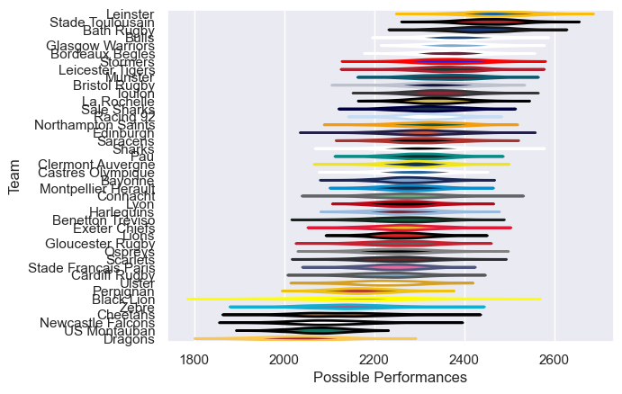

# Team Rankings

# Standings

## Current Standings

### Pool A

| Club                |   Played |   Wins |   Point Differential |   Losing Bonus Points |   Try Bonus Points |   Competition Points |
|:--------------------|---------:|-------:|---------------------:|----------------------:|-------------------:|---------------------:|
| Montpellier Herault |        4 |      4 |                   42 |                     0 |                    |                   16 |
| Zebre               |        4 |      3 |                   18 |                     0 |                  1 |                   13 |
| Ospreys             |        4 |      2 |                    5 |                     2 |                  1 |                   11 |
| Connacht            |        4 |      2 |                  108 |                     2 |                    |                   10 |
| Black Lion          |        4 |      1 |                  -74 |                     0 |                    |                    4 |
| US Montauban        |        4 |      0 |                  -99 |                     1 |                    |                    1 |

### Pool B

| Club              |   Played |   Wins |   Point Differential |   Losing Bonus Points |   Try Bonus Points |   Competition Points |
|:------------------|---------:|-------:|---------------------:|----------------------:|-------------------:|---------------------:|
| Benetton Treviso  |        4 |      4 |                   93 |                     0 |                    |                   16 |
| Newcastle Falcons |        4 |      3 |                   -3 |                     0 |                    |                   12 |
| Perpignan         |        4 |      1 |                    4 |                     1 |                  1 |                    8 |
| Dragons           |        4 |      2 |                  -52 |                     0 |                    |                    8 |
| Lions             |        4 |      1 |                   -3 |                     1 |                    |                    7 |
| Lyon              |        4 |      0 |                  -39 |                     1 |                    |                    1 |

### Pool C

| Club                 |   Played |   Wins |   Point Differential |   Losing Bonus Points |   Try Bonus Points |   Competition Points |
|:---------------------|---------:|-------:|---------------------:|----------------------:|-------------------:|---------------------:|
| Stade Francais Paris |        4 |      3 |                   39 |                     1 |                  1 |                   14 |
| Exeter Chiefs        |        4 |      2 |                   59 |                     1 |                  1 |                   12 |
| Ulster               |        3 |      2 |                   58 |                     1 |                  1 |                   10 |
| Cardiff Rugby        |        4 |      2 |                  -30 |                     0 |                    |                    8 |
| Racing 92            |        4 |      1 |                  -70 |                     0 |                    |                    6 |
| Cheetahs             |        3 |      0 |                  -56 |                     1 |                    |                    1 |

## Projected Remaining Table

### Pool A

| Club   | To Play   | Projected Wins   | Projected Differential   | Projected Losing Bonus Points   | Projected Try Bonus Points   | Projected Competition Points   |
|--------|-----------|------------------|--------------------------|---------------------------------|------------------------------|--------------------------------|

### Pool B

| Club   | To Play   | Projected Wins   | Projected Differential   | Projected Losing Bonus Points   | Projected Try Bonus Points   | Projected Competition Points   |
|--------|-----------|------------------|--------------------------|---------------------------------|------------------------------|--------------------------------|

### Pool C

| Club     |   To Play |   Projected Wins |   Projected Differential |   Projected Losing Bonus Points | Projected Try Bonus Points   |   Projected Competition Points |
|:---------|----------:|-----------------:|-------------------------:|--------------------------------:|:-----------------------------|-------------------------------:|
| Ulster   |         1 |             0.72 |                     7.06 |                            0.15 |                              |                           3.15 |
| Cheetahs |         1 |             0.22 |                    -7.06 |                            0.25 |                              |                           1.25 |

## Projected Total Table

### Pool A

| Club                |   Played |   Wins |   Point Differential |   Losing Bonus Points |   Try Bonus Points |   Competition Points |
|:--------------------|---------:|-------:|---------------------:|----------------------:|-------------------:|---------------------:|
| Montpellier Herault |        4 |      4 |                   42 |                     0 |                    |                   16 |
| Zebre               |        4 |      3 |                   18 |                     0 |                  1 |                   13 |
| Ospreys             |        4 |      2 |                    5 |                     2 |                  1 |                   11 |
| Connacht            |        4 |      2 |                  108 |                     2 |                    |                   10 |
| Black Lion          |        4 |      1 |                  -74 |                     0 |                    |                    4 |
| US Montauban        |        4 |      0 |                  -99 |                     1 |                    |                    1 |

### Pool B

| Club              |   Played |   Wins |   Point Differential |   Losing Bonus Points |   Try Bonus Points |   Competition Points |
|:------------------|---------:|-------:|---------------------:|----------------------:|-------------------:|---------------------:|
| Benetton Treviso  |        4 |      4 |                   93 |                     0 |                    |                   16 |
| Newcastle Falcons |        4 |      3 |                   -3 |                     0 |                    |                   12 |
| Perpignan         |        4 |      1 |                    4 |                     1 |                  1 |                    8 |
| Dragons           |        4 |      2 |                  -52 |                     0 |                    |                    8 |
| Lions             |        4 |      1 |                   -3 |                     1 |                    |                    7 |
| Lyon              |        4 |      0 |                  -39 |                     1 |                    |                    1 |

### Pool C

| Club                 |   Played |   Wins |   Point Differential |   Losing Bonus Points |   Try Bonus Points |   Competition Points |
|:---------------------|---------:|-------:|---------------------:|----------------------:|-------------------:|---------------------:|
| Stade Francais Paris |        4 |   3    |                39    |                  1    |                  1 |                14    |
| Ulster               |        4 |   2.72 |                65.06 |                  1.15 |                  1 |                13.15 |
| Exeter Chiefs        |        4 |   2    |                59    |                  1    |                  1 |                12    |
| Cardiff Rugby        |        4 |   2    |               -30    |                  0    |                    |                 8    |
| Racing 92            |        4 |   1    |               -70    |                  0    |                    |                 6    |
| Cheetahs             |        4 |   0.22 |               -63.06 |                  1.25 |                    |                 2.25 |

## Projected Playoff Results

|                      | Reach Round of 16   | Win Round of 16   | Reach Quarterfinal   | Win Quarterfinal   | Reach Semifinal   | Win Semifinal   | Reach Final   | Win Final   |
|:---------------------|:--------------------|:------------------|:---------------------|:-------------------|:------------------|:----------------|:--------------|:------------|
| Montpellier Herault  | 100.0 %             | 80.0 %            | 80.0 %               | 47.0 %             | 47.0 %            | 35.0 %          | 35.0 %        | 20.0 %      |
| Stade Francais Paris | 100.0 %             | 81.0 %            | 81.0 %               | 57.0 %             | 57.0 %            | 24.0 %          | 24.0 %        | 13.0 %      |
| Ulster               | 100.0 %             | 75.0 %            | 75.0 %               | 60.0 %             | 60.0 %            | 22.0 %          | 22.0 %        | 12.0 %      |
| Exeter Chiefs        | 100.0 %             | 67.0 %            | 67.0 %               | 31.0 %             | 31.0 %            | 20.0 %          | 20.0 %        | 12.0 %      |
| Benetton Treviso     | 100.0 %             | 73.0 %            | 73.0 %               | 45.0 %             | 45.0 %            | 28.0 %          | 28.0 %        | 11.0 %      |
| Sharks               | 100.0 %             | 42.0 %            | 42.0 %               | 19.0 %             | 19.0 %            | 15.0 %          | 15.0 %        | 8.0 %       |
| Ospreys              | 100.0 %             | 58.0 %            | 58.0 %               | 20.0 %             | 20.0 %            | 11.0 %          | 11.0 %        | 7.0 %       |
| Munster              | 100.0 %             | 33.0 %            | 33.0 %               | 12.0 %             | 12.0 %            | 9.0 %           | 9.0 %         | 7.0 %       |
| Leicester Tigers     | 100.0 %             | 57.0 %            | 57.0 %               | 22.0 %             | 22.0 %            | 13.0 %          | 13.0 %        | 5.0 %       |
| Dragons              | 100.0 %             | 27.0 %            | 27.0 %               | 16.0 %             | 16.0 %            | 8.0 %           | 8.0 %         | 2.0 %       |
| Cardiff Rugby        | 100.0 %             | 20.0 %            | 20.0 %               | 10.0 %             | 10.0 %            | 6.0 %           | 6.0 %         | 2.0 %       |
| Newcastle Falcons    | 100.0 %             | 51.0 %            | 51.0 %               | 10.0 %             | 10.0 %            | 2.0 %           | 2.0 %         | 1.0 %       |
| Bulls                | 100.0 %             | 49.0 %            | 49.0 %               | 14.0 %             | 14.0 %            | 4.0 %           | 4.0 %         | 0.0 %       |
| Connacht             | 100.0 %             | 25.0 %            | 25.0 %               | 16.0 %             | 16.0 %            | 2.0 %           | 2.0 %         | 0.0 %       |
| Perpignan            | 100.0 %             | 19.0 %            | 19.0 %               | 9.0 %              | 9.0 %             | 1.0 %           | 1.0 %         | 0.0 %       |
| Zebre                | 100.0 %             | 43.0 %            | 43.0 %               | 12.0 %             | 12.0 %            | 0.0 %           | 0.0 %         | 0.0 %       |

# Completed Match Review

| Model | Percent Correct Predictions | Spread Error |
| ------ | ------ | ------ |
| Club Level | 69.6% | 9.2 |
| Player Level: Lineup | nan% | nan |
| Player Level: Minutes | nan% | nan |

# Future Predictions

## Week 5

### Cheetahs V Ulster on 2026/01/11

Average Margin: Ulster by 7.1

## Week 6

### Ulster V Connacht on 2026-04-02

Average Margin: Ulster by 7.7

### Benetton Treviso V Dragons on 2026-04-02

Average Margin: Benetton Treviso by 5.2

### Newcastle Falcons V Bulls on 2026-04-02

Average Margin: Newcastle Falcons by 2.3

### Zebre V Leicester Tigers on 2026-04-02

Average Margin: Leicester Tigers by 1.5

### Ospreys V Sharks on 2026-04-02

Average Margin: Ospreys by 3.5

### Montpellier Herault V Cardiff Rugby on 2026-04-02

Average Margin: Montpellier Herault by 6.7

### Exeter Chiefs V Munster on 2026-04-02

Average Margin: Exeter Chiefs by 3.4

### Stade Francais Paris V Perpignan on 2026-04-02

Average Margin: Stade Francais Paris by 9.1

## Week 7

### Ulster V Newcastle Falcons on 2026-04-09

Average Margin: Ulster by 8.9

### Ulster V Bulls on 2026-04-09

Average Margin: Ulster by 8.2

### Connacht V Bulls on 2026-04-09

Average Margin: Connacht by 4.8

### Connacht V Newcastle Falcons on 2026-04-09

Average Margin: Connacht by 3.2

### Benetton Treviso V Ospreys on 2026-04-09

Average Margin: Benetton Treviso by 5.5

### Dragons V Sharks on 2026-04-09

Average Margin: Dragons by 1.5

### Benetton Treviso V Sharks on 2026-04-09

Average Margin: Benetton Treviso by 2.4

### Dragons V Ospreys on 2026-04-09

Average Margin: Dragons by 4.0

### Stade Francais Paris V Leicester Tigers on 2026-04-09

Average Margin: Stade Francais Paris by 4.1

### Perpignan V Leicester Tigers on 2026-04-09

Average Margin: Leicester Tigers by 5.0

### Perpignan V Zebre on 2026-04-09

Average Margin: Perpignan by 3.3

### Stade Francais Paris V Zebre on 2026-04-09

Average Margin: Stade Francais Paris by 7.5

### Cardiff Rugby V Exeter Chiefs on 2026-04-09

Average Margin: Exeter Chiefs by 2.4

### Montpellier Herault V Exeter Chiefs on 2026-04-09

Average Margin: Montpellier Herault by 1.4

### Montpellier Herault V Munster on 2026-04-09

Average Margin: Montpellier Herault by 4.0

### Cardiff Rugby V Munster on 2026-04-09

Average Margin: Munster by 0.5

## Week 8

### Benetton Treviso V Stade Francais Paris on 2026-04-30

Average Margin: Stade Francais Paris by 0.2

### Cardiff Rugby V Connacht on 2026-04-30

Average Margin: Cardiff Rugby by 12.0

### Montpellier Herault V Bulls on 2026-04-30

Average Margin: Montpellier Herault by 10.1

### Munster V Newcastle Falcons on 2026-04-30

Average Margin: Munster by 9.0

### Cardiff Rugby V Newcastle Falcons on 2026-04-30

Average Margin: Cardiff Rugby by 10.5

### Exeter Chiefs V Newcastle Falcons on 2026-04-30

Average Margin: Exeter Chiefs by 6.7

### Munster V Ulster on 2026-04-30

Average Margin: Munster by 6.6

### Montpellier Herault V Newcastle Falcons on 2026-04-30

Average Margin: Montpellier Herault by 8.2

### Exeter Chiefs V Bulls on 2026-04-30

Average Margin: Exeter Chiefs by 7.2

### Montpellier Herault V Connacht on 2026-04-30

Average Margin: Montpellier Herault by 9.1

### Munster V Connacht on 2026-04-30

Average Margin: Munster by 8.5

### Montpellier Herault V Ulster on 2026-04-30

Average Margin: Montpellier Herault by 1.9

### Exeter Chiefs V Ulster on 2026-04-30

Average Margin: Exeter Chiefs by 1.0

### Sharks V Leicester Tigers on 2026-04-30

Average Margin: Leicester Tigers by 0.7

### Ospreys V Perpignan on 2026-04-30

Average Margin: Perpignan by 5.0

### Benetton Treviso V Perpignan on 2026-04-30

Average Margin: Benetton Treviso by 7.3

### Dragons V Zebre on 2026-04-30

Average Margin: Dragons by 29.0

### Sharks V Zebre on 2026-04-30

Average Margin: Sharks by 1.0

### Dragons V Stade Francais Paris on 2026-04-30

Average Margin: Dragons by 3.8

### Sharks V Stade Francais Paris on 2026-04-30

Average Margin: Sharks by 5.6

### Benetton Treviso V Leicester Tigers on 2026-04-30

Average Margin: Benetton Treviso by 5.5

### Ospreys V Stade Francais Paris on 2026-04-30

Average Margin: Ospreys by 2.6

### Ospreys V Zebre on 2026-04-30

Average Margin: Ospreys by 9.2

### Dragons V Perpignan on 2026-04-30

Average Margin: Dragons by 6.5

### Benetton Treviso V Zebre on 2026-04-30

Average Margin: Benetton Treviso by 11.0

### Sharks V Perpignan on 2026-04-30

Average Margin: Sharks by 14.3

### Dragons V Leicester Tigers on 2026-04-30

Average Margin: Leicester Tigers by 1.0

### Ospreys V Leicester Tigers on 2026-04-30

Average Margin: Leicester Tigers by 0.5

### Cardiff Rugby V Ulster on 2026-04-30

Average Margin: Ulster by 1.8

### Cardiff Rugby V Bulls on 2026-04-30

Average Margin: Cardiff Rugby by 2.5

## Final

### Benetton Treviso V Ulster on 2026-05-21

Average Margin: Ulster by 0.2

### Stade Francais Paris V Munster on 2026-05-21

Average Margin: Munster by 0.0

### Perpignan V Ulster on 2026-05-21

Average Margin: Ulster by 1.0

### Dragons V Ulster on 2026-05-21

Average Margin: Dragons by 2.5

### Benetton Treviso V Newcastle Falcons on 2026-05-21

Average Margin: Benetton Treviso by 3.5

### Sharks V Munster on 2026-05-21

Average Margin: Munster by 4.3

### Ospreys V Cardiff Rugby on 2026-05-21

Average Margin: Ospreys by 9.0

### Stade Francais Paris V Exeter Chiefs on 2026-05-21

Average Margin: Stade Francais Paris by 5.8

### Stade Francais Paris V Ulster on 2026-05-21

Average Margin: Stade Francais Paris by 2.4

### Stade Francais Paris V Cardiff Rugby on 2026-05-21

Average Margin: Stade Francais Paris by 7.0

### Ospreys V Connacht on 2026-05-21

Average Margin: Ospreys by 7.0

### Benetton Treviso V Munster on 2026-05-21

Average Margin: Munster by 3.0

### Benetton Treviso V Connacht on 2026-05-21

Average Margin: Benetton Treviso by 2.0

### Stade Francais Paris V Bulls on 2026-05-21

Average Margin: Stade Francais Paris by 4.0

### Leicester Tigers V Munster on 2026-05-21

Average Margin: Munster by 1.0

### Leicester Tigers V Cardiff Rugby on 2026-05-21

Average Margin: Cardiff Rugby by 8.5

### Benetton Treviso V Cardiff Rugby on 2026-05-21

Average Margin: Benetton Treviso by 14.0

### Sharks V Montpellier Herault on 2026-05-21

Average Margin: Sharks by 1.2

### Dragons V Montpellier Herault on 2026-05-21

Average Margin: Montpellier Herault by 1.0

### Ospreys V Montpellier Herault on 2026-05-21

Average Margin: Montpellier Herault by 2.7

### Leicester Tigers V Exeter Chiefs on 2026-05-21

Average Margin: Exeter Chiefs by 2.0

### Sharks V Exeter Chiefs on 2026-05-21

Average Margin: Sharks by 4.3

### Benetton Treviso V Montpellier Herault on 2026-05-21

Average Margin: Montpellier Herault by 1.4

### Benetton Treviso V Exeter Chiefs on 2026-05-21

Average Margin: Exeter Chiefs by 0.8

### Dragons V Munster on 2026-05-21

Average Margin: Munster by 4.5

### Ospreys V Bulls on 2026-05-21

Average Margin: Ospreys by 4.5

### Ospreys V Ulster on 2026-05-21

Average Margin: Ospreys by 4.7

### Stade Francais Paris V Montpellier Herault on 2026-05-21

Average Margin: Stade Francais Paris by 1.8

### Leicester Tigers V Ulster on 2026-05-21

Average Margin: Leicester Tigers by 4.5

### Ospreys V Exeter Chiefs on 2026-05-21

Average Margin: Exeter Chiefs by 13.0

### Sharks V Ulster on 2026-05-21

Average Margin: Ulster by 2.0

### Dragons V Exeter Chiefs on 2026-05-21

Average Margin: Exeter Chiefs by 13.0

### Sharks V Bulls on 2026-05-21

Average Margin: Sharks by 1.0

### Leicester Tigers V Montpellier Herault on 2026-05-21

Average Margin: Montpellier Herault by 1.6

### Sharks V Cardiff Rugby on 2026-05-21

Average Margin: Sharks by 27.0

