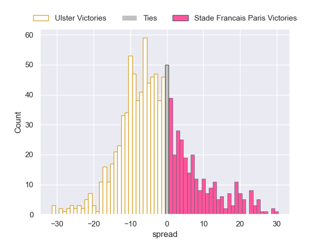
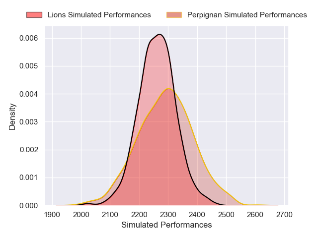
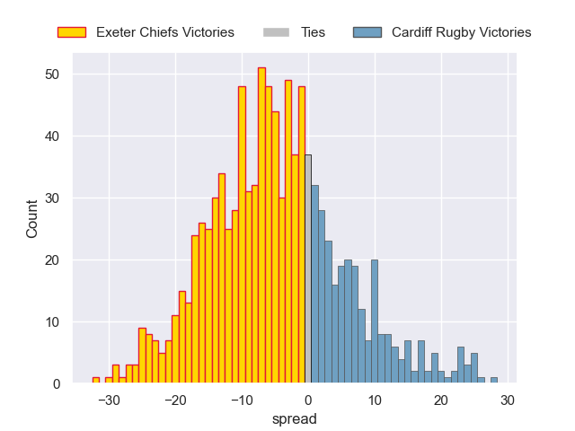
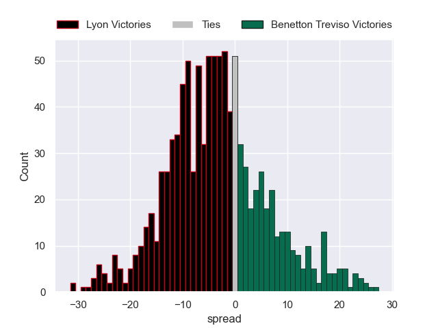

# Team Rankings

# Standings

## Current Standings

### Pool A

| Club                |   Played |   Wins |   Point Differential |   Losing Bonus Points |   Try Bonus Points |   Competition Points |
|:--------------------|---------:|-------:|---------------------:|----------------------:|-------------------:|---------------------:|
| Montpellier Herault |        3 |      3 |                   37 |                     0 |                  2 |                   14 |
| Ospreys             |        3 |      2 |                   10 |                     1 |                  2 |                   11 |
| Zebre               |        3 |      2 |                    4 |                     0 |                  1 |                    9 |
| Connacht            |        3 |      1 |                   47 |                     2 |                  2 |                    8 |
| Black Lion          |        3 |      1 |                  -60 |                     0 |                  1 |                    5 |
| US Montauban        |        3 |      0 |                  -38 |                     1 |                  1 |                    2 |

### Pool B

| Club              |   Played |   Wins |   Point Differential |   Losing Bonus Points |   Try Bonus Points |   Competition Points |
|:------------------|---------:|-------:|---------------------:|----------------------:|-------------------:|---------------------:|
| Benetton Treviso  |        3 |      3 |                   74 |                     0 |                  2 |                   14 |
| Newcastle Falcons |        3 |      3 |                   20 |                     0 |                  1 |                   13 |
| Perpignan         |        3 |      1 |                    4 |                     1 |                  1 |                    6 |
| Lions             |        3 |      1 |                   -3 |                     1 |                  1 |                    6 |
| Dragons           |        3 |      1 |                  -75 |                     0 |                    |                    4 |
| Lyon              |        3 |      0 |                  -20 |                     1 |                  1 |                    2 |

### Pool C

| Club                 |   Played |   Wins |   Point Differential |   Losing Bonus Points |   Try Bonus Points |   Competition Points |
|:---------------------|---------:|-------:|---------------------:|----------------------:|-------------------:|---------------------:|
| Stade Francais Paris |        3 |      3 |                   46 |                     0 |                  3 |                   15 |
| Ulster               |        3 |      1 |                   51 |                     1 |                  2 |                    9 |
| Exeter Chiefs        |        3 |      1 |                   28 |                     1 |                  2 |                    9 |
| Cardiff Rugby        |        3 |      2 |                    1 |                     0 |                  1 |                    9 |
| Racing 92            |        3 |      0 |                  -73 |                     0 |                  1 |                    3 |
| Cheetahs             |        3 |      0 |                  -53 |                     0 |                    |                    2 |

## Projected Remaining Table

### Pool A

| Club                |   To Play |   Projected Wins |   Projected Differential |   Projected Losing Bonus Points | Projected Try Bonus Points   |   Projected Competition Points |
|:--------------------|----------:|-----------------:|-------------------------:|--------------------------------:|:-----------------------------|-------------------------------:|
| Connacht            |         1 |            0.764 |                    9.664 |                           0.114 |                              |                          3.21  |
| Ospreys             |         1 |            0.55  |                    1.13  |                           0.233 |                              |                          2.563 |
| Black Lion          |         1 |            0.558 |                    1.98  |                           0.201 |                              |                          2.501 |
| Montpellier Herault |         1 |            0.385 |                   -1.13  |                           0.327 |                              |                          1.997 |
| Zebre               |         1 |            0.408 |                   -1.98  |                           0.249 |                              |                          1.949 |
| US Montauban        |         1 |            0.216 |                   -9.664 |                           0.14  |                              |                          1.044 |

### Pool B

| Club              |   To Play |   Projected Wins |   Projected Differential |   Projected Losing Bonus Points | Projected Try Bonus Points   |   Projected Competition Points |
|:------------------|----------:|-----------------:|-------------------------:|--------------------------------:|:-----------------------------|-------------------------------:|
| Lyon              |         1 |            0.633 |                    2.648 |                           0.194 |                              |                          2.838 |
| Dragons           |         1 |            0.592 |                    2.259 |                           0.232 |                              |                          2.69  |
| Perpignan         |         1 |            0.515 |                    0.865 |                           0.284 |                              |                          2.498 |
| Lions             |         1 |            0.408 |                   -0.865 |                           0.335 |                              |                          2.121 |
| Newcastle Falcons |         1 |            0.363 |                   -2.259 |                           0.321 |                              |                          1.863 |
| Benetton Treviso  |         1 |            0.311 |                   -2.648 |                           0.361 |                              |                          1.717 |

### Pool C

| Club                 |   To Play |   Projected Wins |   Projected Differential |   Projected Losing Bonus Points | Projected Try Bonus Points   |   Projected Competition Points |
|:---------------------|----------:|-----------------:|-------------------------:|--------------------------------:|:-----------------------------|-------------------------------:|
| Racing 92            |         1 |            0.755 |                    8.215 |                           0.112 |                              |                          3.194 |
| Exeter Chiefs        |         1 |            0.735 |                    5.8   |                           0.125 |                              |                          3.137 |
| Ulster               |         1 |            0.668 |                    3.712 |                           0.159 |                              |                          2.939 |
| Stade Francais Paris |         1 |            0.278 |                   -3.712 |                           0.295 |                              |                          1.515 |
| Cardiff Rugby        |         1 |            0.229 |                   -5.8   |                           0.261 |                              |                          1.249 |
| Cheetahs             |         1 |            0.214 |                   -8.215 |                           0.168 |                              |                          1.086 |

## Projected Total Table

### Pool A

| Club                |   Played |   Wins |   Point Differential |   Losing Bonus Points |   Try Bonus Points |   Competition Points |
|:--------------------|---------:|-------:|---------------------:|----------------------:|-------------------:|---------------------:|
| Montpellier Herault |        4 |  3.385 |               35.87  |                 0.327 |                  2 |               15.997 |
| Ospreys             |        4 |  2.55  |               11.13  |                 1.233 |                  2 |               13.563 |
| Connacht            |        4 |  1.764 |               56.664 |                 2.114 |                  2 |               11.21  |
| Zebre               |        4 |  2.408 |                2.02  |                 0.249 |                  1 |               10.949 |
| Black Lion          |        4 |  1.558 |              -58.02  |                 0.201 |                  1 |                7.501 |
| US Montauban        |        4 |  0.216 |              -47.664 |                 1.14  |                  1 |                3.044 |

### Pool B

| Club              |   Played |   Wins |   Point Differential |   Losing Bonus Points |   Try Bonus Points |   Competition Points |
|:------------------|---------:|-------:|---------------------:|----------------------:|-------------------:|---------------------:|
| Benetton Treviso  |        4 |  3.311 |               71.352 |                 0.361 |                  2 |               15.717 |
| Newcastle Falcons |        4 |  3.363 |               17.741 |                 0.321 |                  1 |               14.863 |
| Perpignan         |        4 |  1.515 |                4.865 |                 1.284 |                  1 |                8.498 |
| Lions             |        4 |  1.408 |               -3.865 |                 1.335 |                  1 |                8.121 |
| Dragons           |        4 |  1.592 |              -72.741 |                 0.232 |                    |                6.69  |
| Lyon              |        4 |  0.633 |              -17.352 |                 1.194 |                  1 |                4.838 |

### Pool C

| Club                 |   Played |   Wins |   Point Differential |   Losing Bonus Points |   Try Bonus Points |   Competition Points |
|:---------------------|---------:|-------:|---------------------:|----------------------:|-------------------:|---------------------:|
| Stade Francais Paris |        4 |  3.278 |               42.288 |                 0.295 |                  3 |               16.515 |
| Exeter Chiefs        |        4 |  1.735 |               33.8   |                 1.125 |                  2 |               12.137 |
| Ulster               |        4 |  1.668 |               54.712 |                 1.159 |                  2 |               11.939 |
| Cardiff Rugby        |        4 |  2.229 |               -4.8   |                 0.261 |                  1 |               10.249 |
| Racing 92            |        4 |  0.755 |              -64.785 |                 0.112 |                  1 |                6.194 |
| Cheetahs             |        4 |  0.214 |              -61.215 |                 0.168 |                    |                3.086 |

## Projected Playoff Results

|                      | Reach Round of 16   | Win Round of 16   | Reach Quarterfinal   | Win Quarterfinal   | Reach Semifinal   | Win Semifinal   | Reach Final   | Win Final   |
|:---------------------|:--------------------|:------------------|:---------------------|:-------------------|:------------------|:----------------|:--------------|:------------|
| Stade Francais Paris | 100.0 %             | 72.2 %            | 72.2 %               | 51.2 %             | 51.2 %            | 36.3 %          | 36.3 %        | 22.1 %      |
| Montpellier Herault  | 100.0 %             | 72.2 %            | 72.2 %               | 53.2 %             | 53.2 %            | 26.3 %          | 26.3 %        | 11.6 %      |
| Ulster               | 100.0 %             | 64.9 %            | 64.9 %               | 32.4 %             | 32.4 %            | 14.3 %          | 14.3 %        | 10.1 %      |
| Benetton Treviso     | 100.0 %             | 66.2 %            | 66.2 %               | 41.1 %             | 41.1 %            | 20.2 %          | 20.2 %        | 8.2 %       |
| Exeter Chiefs        | 100.0 %             | 64.3 %            | 64.3 %               | 27.8 %             | 27.8 %            | 13.7 %          | 13.7 %        | 6.5 %       |
| Leicester Tigers     | 80.1 %              | 39.3 %            | 39.3 %               | 18.1 %             | 18.1 %            | 10.2 %          | 10.2 %        | 5.6 %       |
| Ospreys              | 100.0 %             | 56.9 %            | 56.9 %               | 24.9 %             | 24.9 %            | 10.3 %          | 10.3 %        | 3.9 %       |
| Cardiff Rugby        | 100.0 %             | 38.8 %            | 38.8 %               | 18.6 %             | 18.6 %            | 9.6 %           | 9.6 %         | 3.8 %       |
| Lions                | 66.5 %              | 24.7 %            | 24.7 %               | 14.0 %             | 14.0 %            | 7.4 %           | 7.4 %         | 3.7 %       |
| Connacht             | 94.5 %              | 45.9 %            | 45.9 %               | 19.0 %             | 19.0 %            | 9.3 %           | 9.3 %         | 3.1 %       |
| Newcastle Falcons    | 100.0 %             | 52.9 %            | 52.9 %               | 21.5 %             | 21.5 %            | 6.8 %           | 6.8 %         | 3.0 %       |
| Sharks               | 86.4 %              | 33.1 %            | 33.1 %               | 11.3 %             | 11.3 %            | 5.5 %           | 5.5 %         | 2.6 %       |
| Stade Toulousain     | 13.6 %              | 8.7 %             | 8.7 %                | 5.1 %              | 5.1 %             | 3.8 %           | 3.8 %         | 2.4 %       |
| Perpignan            | 75.5 %              | 23.5 %            | 23.5 %               | 11.3 %             | 11.3 %            | 4.0 %           | 4.0 %         | 2.1 %       |
| Bulls                | 35.3 %              | 15.1 %            | 15.1 %               | 6.2 %              | 6.2 %             | 2.6 %           | 2.6 %         | 1.8 %       |
| Edinburgh            | 30.1 %              | 12.4 %            | 12.4 %               | 4.7 %              | 4.7 %             | 3.3 %           | 3.3 %         | 1.7 %       |
| Dragons              | 54.9 %              | 15.1 %            | 15.1 %               | 6.7 %              | 6.7 %             | 3.5 %           | 3.5 %         | 1.4 %       |
| Scarlets             | 54.0 %              | 18.5 %            | 18.5 %               | 5.5 %              | 5.5 %             | 1.7 %           | 1.7 %         | 1.0 %       |
| Zebre                | 100.0 %             | 33.9 %            | 33.9 %               | 11.5 %             | 11.5 %            | 2.9 %           | 2.9 %         | 0.9 %       |
| Toulon               | 10.1 %              | 4.6 %             | 4.6 %                | 1.7 %              | 1.7 %             | 1.2 %           | 1.2 %         | 0.9 %       |
| Gloucester Rugby     | 38.8 %              | 12.6 %            | 12.6 %               | 4.4 %              | 4.4 %             | 2.1 %           | 2.1 %         | 0.8 %       |
| Munster              | 11.7 %              | 4.6 %             | 4.6 %                | 2.3 %              | 2.3 %             | 1.6 %           | 1.6 %         | 0.7 %       |
| Stormers             | 7.2 %               | 3.7 %             | 3.7 %                | 1.5 %              | 1.5 %             | 1.0 %           | 1.0 %         | 0.6 %       |
| Pau                  | 10.7 %              | 4.2 %             | 4.2 %                | 1.9 %              | 1.9 %             | 0.7 %           | 0.7 %         | 0.6 %       |
| La Rochelle          | 12.7 %              | 5.8 %             | 5.8 %                | 2.3 %              | 2.3 %             | 0.7 %           | 0.7 %         | 0.4 %       |
| Castres Olympique    | 9.3 %               | 3.7 %             | 3.7 %                | 1.0 %              | 1.0 %             | 0.6 %           | 0.6 %         | 0.4 %       |
| Lyon                 | 3.1 %               | 1.0 %             | 1.0 %                | 0.6 %              | 0.6 %             | 0.3 %           | 0.3 %         | 0.1 %       |
| Black Lion           | 5.5 %               | 1.2 %             | 1.2 %                | 0.2 %              | 0.2 %             | 0.1 %           | 0.1 %         | 0.0 %       |

# Completed Match Review

| Model | Percent Correct Predictions | Spread Error |
| ------ | ------ | ------ |
| Club Level | 65.1% | 7.5 |
| Player Level: Lineup | nan% | nan |
| Player Level: Minutes | nan% | nan |

# Future Predictions

## Week 4

### Dragons V Newcastle Falcons on 2026/01/16

Average Margin: Dragons by 2.3

### Connacht V US Montauban on 2026/01/17

Average Margin: Connacht by 9.7

### Ospreys V Montpellier Herault on 2026/01/17

Average Margin: Ospreys by 1.1

### Ulster V Stade Francais Paris on 2026/01/17

Average Margin: Ulster by 3.7

### Black Lion V Zebre on 2026/01/17

Average Margin: Black Lion by 2.0

### Perpignan V Lions on 2026/01/17

Average Margin: Perpignan by 0.9

### Racing 92 V Cheetahs on 2026/01/18

Average Margin: Racing 92 by 8.2

### Exeter Chiefs V Cardiff Rugby on 2026/01/18

Average Margin: Exeter Chiefs by 5.8

### Lyon V Benetton Treviso on 2026/01/18

Average Margin: Lyon by 2.6

## Week 5

### Newcastle Falcons V Scarlets on 2026-04-02

Average Margin: Newcastle Falcons by 3.0

### Benetton Treviso V Cardiff Rugby on 2026-04-02

Average Margin: Benetton Treviso by 4.0

### Newcastle Falcons V Ulster on 2026-04-02

Average Margin: Newcastle Falcons by 1.7

### Montpellier Herault V Black Lion on 2026-04-02

Average Margin: Montpellier Herault by 9.7

### Newcastle Falcons V Zebre on 2026-04-02

Average Margin: Newcastle Falcons by 6.1

### Stade Francais Paris V Connacht on 2026-04-02

Average Margin: Stade Francais Paris by 4.4

### Newcastle Falcons V Exeter Chiefs on 2026-04-02

Average Margin: Exeter Chiefs by 3.2

### Benetton Treviso V Black Lion on 2026-04-02

Average Margin: Benetton Treviso by 6.6

### Benetton Treviso V Exeter Chiefs on 2026-04-02

Average Margin: Exeter Chiefs by 0.1

### Ospreys V Cardiff Rugby on 2026-04-02

Average Margin: Ospreys by 3.4

### Newcastle Falcons V Black Lion on 2026-04-02

Average Margin: Newcastle Falcons by 1.2

### Ospreys V Ulster on 2026-04-02

Average Margin: Ospreys by 3.0

### Ospreys V Connacht on 2026-04-02

Average Margin: Ospreys by 5.3

### Exeter Chiefs V Castres Olympique on 2026-04-02

Average Margin: Exeter Chiefs by 4.0

### Exeter Chiefs V Edinburgh on 2026-04-02

Average Margin: Exeter Chiefs by 3.5

### Exeter Chiefs V Stormers on 2026-04-02

Average Margin: Exeter Chiefs by 2.9

### Perpignan V Sharks on 2026-04-02

Average Margin: Perpignan by 1.5

### Cardiff Rugby V Munster on 2026-04-02

Average Margin: Cardiff Rugby by 0.9

### Exeter Chiefs V Toulon on 2026-04-02

Average Margin: Exeter Chiefs by 10.0

### Montpellier Herault V Ospreys on 2026-04-02

Average Margin: Montpellier Herault by 15.0

### Benetton Treviso V Connacht on 2026-04-02

Average Margin: Benetton Treviso by 4.0

### Montpellier Herault V Connacht on 2026-04-02

Average Margin: Montpellier Herault by 6.0

### Newcastle Falcons V Connacht on 2026-04-02

Average Margin: Connacht by 0.0

### Zebre V Stade Toulousain on 2026-04-02

Average Margin: Stade Toulousain by 4.0

### Ospreys V Castres Olympique on 2026-04-02

Average Margin: Ospreys by 5.0

### Connacht V Edinburgh on 2026-04-02

Average Margin: Connacht by 10.0

### Connacht V Stormers on 2026-04-02

Average Margin: Stormers by 5.0

### Exeter Chiefs V Stade Toulousain on 2026-04-02

Average Margin: Stade Toulousain by 1.5

### Zebre V Stormers on 2026-04-02

Average Margin: Stormers by 4.0

### Ospreys V Zebre on 2026-04-02

Average Margin: Ospreys by 6.0

### Benetton Treviso V Zebre on 2026-04-02

Average Margin: Benetton Treviso by 5.6

### Stade Francais Paris V Zebre on 2026-04-02

Average Margin: Stade Francais Paris by 9.1

### Montpellier Herault V Zebre on 2026-04-02

Average Margin: Montpellier Herault by 8.1

### Montpellier Herault V Cardiff Rugby on 2026-04-02

Average Margin: Montpellier Herault by 4.4

### Montpellier Herault V Ulster on 2026-04-02

Average Margin: Montpellier Herault by 0.8

### Stade Francais Paris V Black Lion on 2026-04-02

Average Margin: Stade Francais Paris by 11.6

### Stade Francais Paris V Exeter Chiefs on 2026-04-02

Average Margin: Stade Francais Paris by 0.2

### Ospreys V Exeter Chiefs on 2026-04-02

Average Margin: Exeter Chiefs by 1.4

### Stade Francais Paris V Cardiff Rugby on 2026-04-02

Average Margin: Stade Francais Paris by 3.8

### Newcastle Falcons V Cardiff Rugby on 2026-04-02

Average Margin: Newcastle Falcons by 2.0

### Benetton Treviso V Ulster on 2026-04-02

Average Margin: Benetton Treviso by 0.1

### Montpellier Herault V Exeter Chiefs on 2026-04-02

Average Margin: Montpellier Herault by 2.9

### Zebre V Munster on 2026-04-02

Average Margin: Munster by 1.1

### Connacht V Stade Toulousain on 2026-04-02

Average Margin: Connacht by 1.0

### Zebre V Edinburgh on 2026-04-02

Average Margin: Edinburgh by 3.4

### Cardiff Rugby V Edinburgh on 2026-04-02

Average Margin: Cardiff Rugby by 8.2

### Lions V Sharks on 2026-04-02

Average Margin: Sharks by 0.8

### Perpignan V Castres Olympique on 2026-04-02

Average Margin: Castres Olympique by 2.3

### Ulster V Stormers on 2026-04-02

Average Margin: Ulster by 4.1

### Perpignan V Stormers on 2026-04-02

Average Margin: Perpignan by 3.3

### Lions V Munster on 2026-04-02

Average Margin: Lions by 1.3

### Lions V La Rochelle on 2026-04-02

Average Margin: La Rochelle by 0.0

### Perpignan V Munster on 2026-04-02

Average Margin: Munster by 5.0

### Exeter Chiefs V Zebre on 2026-04-02

Average Margin: Exeter Chiefs by 18.0

### Perpignan V Gloucester Rugby on 2026-04-02

Average Margin: Perpignan by 0.8

### Ulster V Zebre on 2026-04-02

Average Margin: Ulster by 7.9

### Ulster V Lions on 2026-04-02

Average Margin: Ulster by 1.6

### Ospreys V Lions on 2026-04-02

Average Margin: Ospreys by 4.4

### Ulster V Connacht on 2026-04-02

Average Margin: Connacht by 2.7

### Exeter Chiefs V Perpignan on 2026-04-02

Average Margin: Exeter Chiefs by 6.2

### Exeter Chiefs V Lions on 2026-04-02

Average Margin: Exeter Chiefs by 11.0

### Exeter Chiefs V Connacht on 2026-04-02

Average Margin: Exeter Chiefs by 9.0

### Exeter Chiefs V Cardiff Rugby on 2026-04-02

Average Margin: Exeter Chiefs by 14.0

### Exeter Chiefs V Ulster on 2026-04-02

Average Margin: Ulster by 9.0

### Ulster V Perpignan on 2026-04-02

Average Margin: Ulster by 7.4

### Perpignan V Toulon on 2026-04-02

Average Margin: Perpignan by 1.6

### Perpignan V La Rochelle on 2026-04-02

Average Margin: La Rochelle by 28.0

### Perpignan V Stade Toulousain on 2026-04-02

Average Margin: Stade Toulousain by 6.1

### Ulster V Toulon on 2026-04-02

Average Margin: Toulon by 3.0

### Ospreys V Edinburgh on 2026-04-02

Average Margin: Edinburgh by 0.8

### Cardiff Rugby V Stormers on 2026-04-02

Average Margin: Stormers by 2.2

### Zebre V Toulon on 2026-04-02

Average Margin: Toulon by 6.0

### Lions V Leicester Tigers on 2026-04-02

Average Margin: Lions by 1.0

### Connacht V Toulon on 2026-04-02

Average Margin: Connacht by 2.0

### Perpignan V Leicester Tigers on 2026-04-02

Average Margin: Leicester Tigers by 10.0

### Cardiff Rugby V Toulon on 2026-04-02

Average Margin: Cardiff Rugby by 0.5

### Benetton Treviso V Ospreys on 2026-04-02

Average Margin: Benetton Treviso by 2.6

### Stade Francais Paris V Ospreys on 2026-04-02

Average Margin: Stade Francais Paris by 4.6

### Newcastle Falcons V Ospreys on 2026-04-02

Average Margin: Newcastle Falcons by 2.1

### Ulster V Edinburgh on 2026-04-02

Average Margin: Ulster by 5.6

### Perpignan V Edinburgh on 2026-04-02

Average Margin: Edinburgh by 4.3

### Lions V Gloucester Rugby on 2026-04-02

Average Margin: Gloucester Rugby by 1.1

### Lions V Castres Olympique on 2026-04-02

Average Margin: Lions by 7.0

### Lions V Toulon on 2026-04-02

Average Margin: Lions by 2.0

### Ospreys V Toulon on 2026-04-02

Average Margin: Ospreys by 0.5

### Lions V Stade Toulousain on 2026-04-02

Average Margin: Stade Toulousain by 6.7

### Lions V Edinburgh on 2026-04-02

Average Margin: Lions by 2.1

### Lions V Stormers on 2026-04-02

Average Margin: Stormers by 0.0

### Zebre V Lions on 2026-04-02

Average Margin: Zebre by 8.0

### Cardiff Rugby V Gloucester Rugby on 2026-04-02

Average Margin: Cardiff Rugby by 9.5

### Ospreys V Stormers on 2026-04-02

Average Margin: Stormers by 1.0

### Zebre V Pau on 2026-04-02

Average Margin: Pau by 9.5

### Montpellier Herault V Bulls on 2026-04-02

Average Margin: Montpellier Herault by 5.1

### Benetton Treviso V Leicester Tigers on 2026-04-02

Average Margin: Leicester Tigers by 1.7

### Montpellier Herault V Leicester Tigers on 2026-04-02

Average Margin: Montpellier Herault by 2.1

### Exeter Chiefs V Pau on 2026-04-02

Average Margin: Exeter Chiefs by 7.2

### Benetton Treviso V Bulls on 2026-04-02

Average Margin: Benetton Treviso by 3.9

### Ospreys V Sharks on 2026-04-02

Average Margin: Ospreys by 3.8

### Ospreys V Leicester Tigers on 2026-04-02

Average Margin: Leicester Tigers by 0.9

### Ospreys V Pau on 2026-04-02

Average Margin: Pau by 0.2

### Cardiff Rugby V Leicester Tigers on 2026-04-02

Average Margin: Cardiff Rugby by 1.3

### Benetton Treviso V Sharks on 2026-04-02

Average Margin: Sharks by 2.0

### Montpellier Herault V Pau on 2026-04-02

Average Margin: Montpellier Herault by 8.2

### Zebre V Leicester Tigers on 2026-04-02

Average Margin: Leicester Tigers by 5.2

### Benetton Treviso V Pau on 2026-04-02

Average Margin: Benetton Treviso by 6.8

### Cardiff Rugby V Pau on 2026-04-02

Average Margin: Cardiff Rugby by 0.3

### Zebre V Sharks on 2026-04-02

Average Margin: Zebre by 3.0

### Cardiff Rugby V Sharks on 2026-04-02

Average Margin: Cardiff Rugby by 3.0

### Stade Francais Paris V Dragons on 2026-04-02

Average Margin: Stade Francais Paris by 7.2

### Cardiff Rugby V Bulls on 2026-04-02

Average Margin: Cardiff Rugby by 0.7

### Exeter Chiefs V Bulls on 2026-04-02

Average Margin: Exeter Chiefs by 3.9

### Newcastle Falcons V Leicester Tigers on 2026-04-02

Average Margin: Leicester Tigers by 2.5

### Zebre V Scarlets on 2026-04-02

Average Margin: Zebre by 0.9

### Exeter Chiefs V Sharks on 2026-04-02

Average Margin: Exeter Chiefs by 4.6

### Ulster V Bulls on 2026-04-02

Average Margin: Ulster by 3.9

### Cardiff Rugby V Scarlets on 2026-04-02

Average Margin: Cardiff Rugby by 2.9

### Ulster V Scarlets on 2026-04-02

Average Margin: Ulster by 4.6

### Exeter Chiefs V Leicester Tigers on 2026-04-02

Average Margin: Exeter Chiefs by 7.1

### Ospreys V Bulls on 2026-04-02

Average Margin: Bulls by 0.4

### Newcastle Falcons V Bulls on 2026-04-02

Average Margin: Bulls by 1.6

### Ospreys V Scarlets on 2026-04-02

Average Margin: Ospreys by 2.6

### Montpellier Herault V Sharks on 2026-04-02

Average Margin: Montpellier Herault by 7.6

### Exeter Chiefs V Scarlets on 2026-04-02

Average Margin: Exeter Chiefs by 4.6

### Ulster V Sharks on 2026-04-02

Average Margin: Ulster by 3.6

### Zebre V Bulls on 2026-04-02

Average Margin: Bulls by 1.1

### Newcastle Falcons V Sharks on 2026-04-02

Average Margin: Sharks by 3.5

### Benetton Treviso V Scarlets on 2026-04-02

Average Margin: Benetton Treviso by 1.8

### Connacht V Scarlets on 2026-04-02

Average Margin: Connacht by 2.0

### Montpellier Herault V Scarlets on 2026-04-02

Average Margin: Montpellier Herault by 2.9

### Ulster V Pau on 2026-04-02

Average Margin: Ulster by 4.0

### Ulster V Leicester Tigers on 2026-04-02

Average Margin: Ulster by 2.5

### Newcastle Falcons V Pau on 2026-04-02

Average Margin: Newcastle Falcons by 2.2

### Benetton Treviso V Dragons on 2026-04-02

Average Margin: Benetton Treviso by 6.2

### Ulster V Castres Olympique on 2026-04-02

Average Margin: Ulster by 12.6

### Benetton Treviso V Lions on 2026-04-02

Average Margin: Benetton Treviso by 4.9

### Benetton Treviso V Perpignan on 2026-04-02

Average Margin: Benetton Treviso by 9.2

### Exeter Chiefs V Gloucester Rugby on 2026-04-02

Average Margin: Exeter Chiefs by 2.7

### Connacht V Pau on 2026-04-02

Average Margin: Pau by 0.3

### Ospreys V La Rochelle on 2026-04-02

Average Margin: La Rochelle by 2.2

### Newcastle Falcons V Stade Toulousain on 2026-04-02

Average Margin: Stade Toulousain by 0.8

### Newcastle Falcons V La Rochelle on 2026-04-02

Average Margin: La Rochelle by 11.5

### Cardiff Rugby V La Rochelle on 2026-04-02

Average Margin: La Rochelle by 2.2

### Connacht V Bulls on 2026-04-02

Average Margin: Connacht by 2.7

### Cardiff Rugby V Castres Olympique on 2026-04-02

Average Margin: Castres Olympique by 4.0

### Ospreys V Gloucester Rugby on 2026-04-02

Average Margin: Ospreys by 2.6

### Newcastle Falcons V Castres Olympique on 2026-04-02

Average Margin: Newcastle Falcons by 4.0

### Connacht V Munster on 2026-04-02

Average Margin: Connacht by 2.8

### Ulster V Stade Toulousain on 2026-04-02

Average Margin: Stade Toulousain by 5.0

### Cardiff Rugby V Stade Toulousain on 2026-04-02

Average Margin: Stade Toulousain by 4.3

### Zebre V Castres Olympique on 2026-04-02

Average Margin: Castres Olympique by 18.0

### Ospreys V Stade Toulousain on 2026-04-02

Average Margin: Ospreys by 8.5

### Connacht V Gloucester Rugby on 2026-04-02

Average Margin: Connacht by 4.1

### Ospreys V Munster on 2026-04-02

Average Margin: Ospreys by 18.0

### Ulster V Munster on 2026-04-02

Average Margin: Munster by 0.7

### Connacht V Castres Olympique on 2026-04-02

Average Margin: Connacht by 9.3

### Connacht V La Rochelle on 2026-04-02

Average Margin: Connacht by 3.6

### Exeter Chiefs V Munster on 2026-04-02

Average Margin: Munster by 0.5

### Newcastle Falcons V Munster on 2026-04-02

Average Margin: Newcastle Falcons by 8.3

### Montpellier Herault V Lions on 2026-04-02

Average Margin: Montpellier Herault by 6.4

### Montpellier Herault V Lyon on 2026-04-02

Average Margin: Montpellier Herault by 0.1

### Newcastle Falcons V Perpignan on 2026-04-02

Average Margin: Newcastle Falcons by 4.2

### Montpellier Herault V Perpignan on 2026-04-02

Average Margin: Montpellier Herault by 7.3

### Stade Francais Paris V Perpignan on 2026-04-02

Average Margin: Stade Francais Paris by 7.9

### Newcastle Falcons V Lions on 2026-04-02

Average Margin: Newcastle Falcons by 1.2

### Stade Francais Paris V Lions on 2026-04-02

Average Margin: Stade Francais Paris by 7.2

### Newcastle Falcons V Lyon on 2026-04-02

Average Margin: Lyon by 0.7

### Stade Francais Paris V Lyon on 2026-04-02

Average Margin: Stade Francais Paris by 8.0

### Ospreys V Dragons on 2026-04-02

Average Margin: Ospreys by 21.0

### Ospreys V Perpignan on 2026-04-02

Average Margin: Perpignan by 2.0

### Newcastle Falcons V Gloucester Rugby on 2026-04-02

Average Margin: Gloucester Rugby by 0.5

### Connacht V Leicester Tigers on 2026-04-02

Average Margin: Connacht by 0.6

### Ulster V Gloucester Rugby on 2026-04-02

Average Margin: Ulster by 4.8

### Ulster V La Rochelle on 2026-04-02

Average Margin: La Rochelle by 1.1

### Zebre V La Rochelle on 2026-04-02

Average Margin: Zebre by 1.2

### Zebre V Gloucester Rugby on 2026-04-02

Average Margin: Zebre by 5.7

### Connacht V Sharks on 2026-04-02

Average Margin: Connacht by 3.5

### Exeter Chiefs V La Rochelle on 2026-04-02

Average Margin: Exeter Chiefs by 4.5

### Montpellier Herault V Dragons on 2026-04-02

Average Margin: Montpellier Herault by 8.4

### Cardiff Rugby V Ulster on 2026-04-02

Average Margin: Cardiff Rugby by 16.0

## Week 6

### Stade Francais Paris V Gloucester Rugby on 2026-04-09

Average Margin: Stade Francais Paris by 9.7

### Ulster V Cardiff Rugby on 2026-04-09

Average Margin: Ulster by 3.0

### Ulster V Pau on 2026-04-09

Average Margin: Ulster by 5.8

### Connacht V Bulls on 2026-04-09

Average Margin: Bulls by 6.5

### Perpignan V Benetton Treviso on 2026-04-09

Average Margin: Perpignan by 7.0

### Ospreys V Leicester Tigers on 2026-04-09

Average Margin: Ospreys by 1.5

### Zebre V Bulls on 2026-04-09

Average Margin: Bulls by 1.0

### Connacht V Benetton Treviso on 2026-04-09

Average Margin: Connacht by 6.0

### Perpignan V Pau on 2026-04-09

Average Margin: Perpignan by 0.2

### Ospreys V Sharks on 2026-04-09

Average Margin: Ospreys by 10.6

### Ulster V Leicester Tigers on 2026-04-09

Average Margin: Leicester Tigers by 1.5

### Benetton Treviso V Pau on 2026-04-09

Average Margin: Pau by 2.5

### Montpellier Herault V Pau on 2026-04-09

Average Margin: Montpellier Herault by 7.4

### Cardiff Rugby V Pau on 2026-04-09

Average Margin: Pau by 4.0

### Newcastle Falcons V Pau on 2026-04-09

Average Margin: Pau by 11.0

### Zebre V Benetton Treviso on 2026-04-09

Average Margin: Zebre by 4.5

### Exeter Chiefs V Zebre on 2026-04-09

Average Margin: Exeter Chiefs by 23.5

### Zebre V Pau on 2026-04-09

Average Margin: Pau by 8.0

### Cardiff Rugby V Sharks on 2026-04-09

Average Margin: Cardiff Rugby by 9.0

### Cardiff Rugby V Scarlets on 2026-04-09

Average Margin: Scarlets by 1.7

### Connacht V Scarlets on 2026-04-09

Average Margin: Scarlets by 4.0

### Ulster V Sharks on 2026-04-09

Average Margin: Sharks by 12.0

### Zebre V Exeter Chiefs on 2026-04-09

Average Margin: Exeter Chiefs by 3.2

### Zebre V Connacht on 2026-04-09

Average Margin: Zebre by 0.7

### Exeter Chiefs V Gloucester Rugby on 2026-04-09

Average Margin: Exeter Chiefs by 3.2

### Ospreys V Stade Toulousain on 2026-04-09

Average Margin: Ospreys by 0.5

### Cardiff Rugby V Gloucester Rugby on 2026-04-09

Average Margin: Cardiff Rugby by 6.8

### Cardiff Rugby V Leicester Tigers on 2026-04-09

Average Margin: Cardiff Rugby by 2.7

### Lions V Benetton Treviso on 2026-04-09

Average Margin: Benetton Treviso by 1.0

### Connacht V Exeter Chiefs on 2026-04-09

Average Margin: Connacht by 1.7

### Exeter Chiefs V Leicester Tigers on 2026-04-09

Average Margin: Exeter Chiefs by 4.5

### Exeter Chiefs V Scarlets on 2026-04-09

Average Margin: Exeter Chiefs by 10.2

### Benetton Treviso V Montpellier Herault on 2026-04-09

Average Margin: Montpellier Herault by 1.6

### Lions V Newcastle Falcons on 2026-04-09

Average Margin: Lions by 3.6

### Perpignan V Newcastle Falcons on 2026-04-09

Average Margin: Perpignan by 4.3

### Ulster V Newcastle Falcons on 2026-04-09

Average Margin: Ulster by 6.8

### Newcastle Falcons V Scarlets on 2026-04-09

Average Margin: Newcastle Falcons by 3.1

### Benetton Treviso V Scarlets on 2026-04-09

Average Margin: Benetton Treviso by 4.5

### Ospreys V Ulster on 2026-04-09

Average Margin: Ospreys by 3.8

### Montpellier Herault V Cardiff Rugby on 2026-04-09

Average Margin: Montpellier Herault by 10.8

### Ulster V Exeter Chiefs on 2026-04-09

Average Margin: Ulster by 8.9

### Perpignan V Montpellier Herault on 2026-04-09

Average Margin: Montpellier Herault by 1.1

### Ospreys V Scarlets on 2026-04-09

Average Margin: Ospreys by 6.7

### Lions V Bulls on 2026-04-09

Average Margin: Lions by 1.4

### Lions V Pau on 2026-04-09

Average Margin: Lions by 0.2

### Ospreys V Bulls on 2026-04-09

Average Margin: Ospreys by 4.0

### Ulster V Bulls on 2026-04-09

Average Margin: Ulster by 1.5

### Ulster V Zebre on 2026-04-09

Average Margin: Ulster by 13.5

### Newcastle Falcons V Bulls on 2026-04-09

Average Margin: Newcastle Falcons by 0.7

### Montpellier Herault V Scarlets on 2026-04-09

Average Margin: Montpellier Herault by 1.8

### Zebre V Scarlets on 2026-04-09

Average Margin: Zebre by 0.8

### Connacht V Newcastle Falcons on 2026-04-09

Average Margin: Newcastle Falcons by 7.0

### Cardiff Rugby V Exeter Chiefs on 2026-04-09

Average Margin: Cardiff Rugby by 6.0

### Cardiff Rugby V Ospreys on 2026-04-09

Average Margin: Ospreys by 3.5

### Ospreys V Pau on 2026-04-09

Average Margin: Pau by 1.8

### Ulster V Scarlets on 2026-04-09

Average Margin: Ulster by 5.6

### Exeter Chiefs V Pau on 2026-04-09

Average Margin: Exeter Chiefs by 18.5

### Zebre V Montpellier Herault on 2026-04-09

Average Margin: Zebre by 5.5

### Lions V Montpellier Herault on 2026-04-09

Average Margin: Lions by 1.9

### Connacht V Ulster on 2026-04-09

Average Margin: Connacht by 3.0

### Connacht V Stade Toulousain on 2026-04-09

Average Margin: Stade Toulousain by 2.5

### Exeter Chiefs V Stade Toulousain on 2026-04-09

Average Margin: Exeter Chiefs by 3.8

### Montpellier Herault V Castres Olympique on 2026-04-09

Average Margin: Montpellier Herault by 15.0

### Ospreys V La Rochelle on 2026-04-09

Average Margin: Ospreys by 5.0

### Ospreys V Edinburgh on 2026-04-09

Average Margin: Edinburgh by 0.5

### Connacht V Edinburgh on 2026-04-09

Average Margin: Connacht by 24.0

### Connacht V Sharks on 2026-04-09

Average Margin: Connacht by 25.0

### Cardiff Rugby V Lions on 2026-04-09

Average Margin: Cardiff Rugby by 6.0

### Ulster V Ospreys on 2026-04-09

Average Margin: Ulster by 7.0

### Cardiff Rugby V Ulster on 2026-04-09

Average Margin: Cardiff Rugby by 4.0

### Connacht V Leicester Tigers on 2026-04-09

Average Margin: Connacht by 2.0

### Black Lion V Gloucester Rugby on 2026-04-09

Average Margin: Gloucester Rugby by 1.0

### Newcastle Falcons V La Rochelle on 2026-04-09

Average Margin: La Rochelle by 3.5

### Ospreys V Munster on 2026-04-09

Average Margin: Munster by 5.0

### Exeter Chiefs V Toulon on 2026-04-09

Average Margin: Toulon by 19.0

### Zebre V Edinburgh on 2026-04-09

Average Margin: Edinburgh by 5.0

### Exeter Chiefs V Ospreys on 2026-04-09

Average Margin: Exeter Chiefs by 7.2

### Ospreys V Newcastle Falcons on 2026-04-09

Average Margin: Newcastle Falcons by 0.1

### Stade Francais Paris V Pau on 2026-04-09

Average Margin: Stade Francais Paris by 9.0

### Connacht V Ospreys on 2026-04-09

Average Margin: Connacht by 9.0

### Zebre V Newcastle Falcons on 2026-04-09

Average Margin: Zebre by 3.5

### Stade Francais Paris V Newcastle Falcons on 2026-04-09

Average Margin: Stade Francais Paris by 8.1

### Ospreys V Castres Olympique on 2026-04-09

Average Margin: Ospreys by 8.0

### Benetton Treviso V Newcastle Falcons on 2026-04-09

Average Margin: Benetton Treviso by 2.6

### Connacht V La Rochelle on 2026-04-09

Average Margin: Connacht by 7.0

### Zebre V Castres Olympique on 2026-04-09

Average Margin: Castres Olympique by 13.0

### Ospreys V Gloucester Rugby on 2026-04-09

Average Margin: Gloucester Rugby by 12.0

### Cardiff Rugby V Bulls on 2026-04-09

Average Margin: Cardiff Rugby by 4.5

### Connacht V Pau on 2026-04-09

Average Margin: Pau by 0.0

### Exeter Chiefs V Newcastle Falcons on 2026-04-09

Average Margin: Newcastle Falcons by 4.0

### Exeter Chiefs V Castres Olympique on 2026-04-09

Average Margin: Exeter Chiefs by 5.0

### Exeter Chiefs V Stormers on 2026-04-09

Average Margin: Stormers by 11.0

### Exeter Chiefs V Munster on 2026-04-09

Average Margin: Exeter Chiefs by 7.0

### Ulster V Gloucester Rugby on 2026-04-09

Average Margin: Gloucester Rugby by 6.0

### Zebre V Sharks on 2026-04-09

Average Margin: Sharks by 0.2

### Black Lion V Exeter Chiefs on 2026-04-09

Average Margin: Exeter Chiefs by 8.6

### Zebre V Ulster on 2026-04-09

Average Margin: Ulster by 0.8

### Ulster V Stormers on 2026-04-09

Average Margin: Ulster by 5.0

### Ulster V Connacht on 2026-04-09

Average Margin: Ulster by 4.0

### Newcastle Falcons V Ulster on 2026-04-09

Average Margin: Newcastle Falcons by 2.3

### Cardiff Rugby V Connacht on 2026-04-09

Average Margin: Connacht by 1.2

### Stade Francais Paris V Scarlets on 2026-04-09

Average Margin: Scarlets by 2.0

### Black Lion V Sharks on 2026-04-09

Average Margin: Sharks by 12.0

### Cardiff Rugby V La Rochelle on 2026-04-09

Average Margin: Cardiff Rugby by 4.0

### Zebre V Cardiff Rugby on 2026-04-09

Average Margin: Cardiff Rugby by 3.9

### Cardiff Rugby V Stade Toulousain on 2026-04-09

Average Margin: Stade Toulousain by 1.9

### Black Lion V Ulster on 2026-04-09

Average Margin: Ulster by 6.0

### Benetton Treviso V Bulls on 2026-04-09

Average Margin: Benetton Treviso by 1.8

### Connacht V Castres Olympique on 2026-04-09

Average Margin: Connacht by 6.0

### Cardiff Rugby V Munster on 2026-04-09

Average Margin: Munster by 4.8

### Zebre V Gloucester Rugby on 2026-04-09

Average Margin: Gloucester Rugby by 1.3

### Zebre V Leicester Tigers on 2026-04-09

Average Margin: Leicester Tigers by 7.5

### Exeter Chiefs V La Rochelle on 2026-04-09

Average Margin: Exeter Chiefs by 10.0

### Zebre V Stade Toulousain on 2026-04-09

Average Margin: Stade Toulousain by 5.0

### Ospreys V Connacht on 2026-04-09

Average Margin: Ospreys by 10.0

### Cardiff Rugby V Edinburgh on 2026-04-09

Average Margin: Edinburgh by 1.0

### Connacht V Gloucester Rugby on 2026-04-09

Average Margin: Gloucester Rugby by 3.0

### Zebre V Ospreys on 2026-04-09

Average Margin: Zebre by 4.3

### Exeter Chiefs V Sharks on 2026-04-09

Average Margin: Sharks by 1.0

### Zebre V La Rochelle on 2026-04-09

Average Margin: La Rochelle by 1.0

### Zebre V Munster on 2026-04-09

Average Margin: Munster by 3.5

### Cardiff Rugby V Stormers on 2026-04-09

Average Margin: Cardiff Rugby by 8.3

### Stade Francais Paris V Bulls on 2026-04-09

Average Margin: Bulls by 3.0

### Perpignan V Scarlets on 2026-04-09

Average Margin: Perpignan by 3.7

### Lions V Scarlets on 2026-04-09

Average Margin: Lions by 3.1

### Perpignan V Bulls on 2026-04-09

Average Margin: Perpignan by 2.1

### Benetton Treviso V Exeter Chiefs on 2026-04-09

Average Margin: Benetton Treviso by 0.5

### Dragons V Stade Toulousain on 2026-04-09

Average Margin: Stade Toulousain by 6.6

### Montpellier Herault V Edinburgh on 2026-04-09

Average Margin: Montpellier Herault by 4.3

### Benetton Treviso V Perpignan on 2026-04-09

Average Margin: Benetton Treviso by 2.9

### Lions V Sharks on 2026-04-09

Average Margin: Lions by 7.1

### Perpignan V Sharks on 2026-04-09

Average Margin: Perpignan by 3.0

### Montpellier Herault V Zebre on 2026-04-09

Average Margin: Montpellier Herault by 6.5

### Montpellier Herault V Sharks on 2026-04-09

Average Margin: Montpellier Herault by 5.5

### Benetton Treviso V Castres Olympique on 2026-04-09

Average Margin: Benetton Treviso by 1.3

### Dragons V Connacht on 2026-04-09

Average Margin: Dragons by 1.6

### Newcastle Falcons V Exeter Chiefs on 2026-04-09

Average Margin: Exeter Chiefs by 6.0

### Benetton Treviso V Stade Toulousain on 2026-04-09

Average Margin: Benetton Treviso by 0.4

### Benetton Treviso V Ospreys on 2026-04-09

Average Margin: Benetton Treviso by 7.8

### Benetton Treviso V Lions on 2026-04-09

Average Margin: Lions by 3.3

### Dragons V Sharks on 2026-04-09

Average Margin: Sharks by 3.6

### Dragons V Edinburgh on 2026-04-09

Average Margin: Edinburgh by 2.9

### Dragons V Gloucester Rugby on 2026-04-09

Average Margin: Gloucester Rugby by 0.5

### Newcastle Falcons V Gloucester Rugby on 2026-04-09

Average Margin: Newcastle Falcons by 5.3

### Montpellier Herault V La Rochelle on 2026-04-09

Average Margin: Montpellier Herault by 7.0

### Stade Francais Paris V Lions on 2026-04-09

Average Margin: Stade Francais Paris by 4.4

### Stade Francais Paris V Sharks on 2026-04-09

Average Margin: Stade Francais Paris by 5.2

### Stade Francais Paris V Munster on 2026-04-09

Average Margin: Stade Francais Paris by 5.0

### Lions V Ulster on 2026-04-09

Average Margin: Lions by 0.2

### Perpignan V Lions on 2026-04-09

Average Margin: Perpignan by 2.7

### Stade Francais Paris V Leicester Tigers on 2026-04-09

Average Margin: Stade Francais Paris by 3.0

### Benetton Treviso V Ulster on 2026-04-09

Average Margin: Benetton Treviso by 4.3

### Dragons V Zebre on 2026-04-09

Average Margin: Dragons by 11.4

### Newcastle Falcons V Zebre on 2026-04-09

Average Margin: Newcastle Falcons by 1.4

### Benetton Treviso V Edinburgh on 2026-04-09

Average Margin: Benetton Treviso by 3.1

### Stade Francais Paris V Ulster on 2026-04-09

Average Margin: Stade Francais Paris by 5.1

### Stade Francais Paris V Stade Toulousain on 2026-04-09

Average Margin: Stade Francais Paris by 2.5

### Dragons V Ulster on 2026-04-09

Average Margin: Ulster by 0.6

### Benetton Treviso V Sharks on 2026-04-09

Average Margin: Benetton Treviso by 4.2

### Stade Francais Paris V Perpignan on 2026-04-09

Average Margin: Stade Francais Paris by 7.8

### Lions V Ospreys on 2026-04-09

Average Margin: Lions by 5.9

### Stade Francais Paris V Edinburgh on 2026-04-09

Average Margin: Stade Francais Paris by 4.3

### Benetton Treviso V Zebre on 2026-04-09

Average Margin: Benetton Treviso by 6.5

### Montpellier Herault V Gloucester Rugby on 2026-04-09

Average Margin: Montpellier Herault by 0.8

### Benetton Treviso V Connacht on 2026-04-09

Average Margin: Benetton Treviso by 1.2

### Montpellier Herault V Connacht on 2026-04-09

Average Margin: Montpellier Herault by 6.8

### Lions V Connacht on 2026-04-09

Average Margin: Lions by 1.1

### Montpellier Herault V Leicester Tigers on 2026-04-09

Average Margin: Montpellier Herault by 2.4

### Newcastle Falcons V Leicester Tigers on 2026-04-09

Average Margin: Leicester Tigers by 5.3

### Stade Francais Paris V Cardiff Rugby on 2026-04-09

Average Margin: Stade Francais Paris by 8.8

### Dragons V Perpignan on 2026-04-09

Average Margin: Dragons by 6.2

### Dragons V Cardiff Rugby on 2026-04-09

Average Margin: Dragons by 4.4

### Montpellier Herault V Lions on 2026-04-09

Average Margin: Montpellier Herault by 5.0

### Benetton Treviso V Leicester Tigers on 2026-04-09

Average Margin: Benetton Treviso by 3.3

### Stade Francais Paris V Toulon on 2026-04-09

Average Margin: Stade Francais Paris by 9.2

### Montpellier Herault V Toulon on 2026-04-09

Average Margin: Montpellier Herault by 2.3

### Montpellier Herault V Perpignan on 2026-04-09

Average Margin: Montpellier Herault by 10.1

### Perpignan V Edinburgh on 2026-04-09

Average Margin: Perpignan by 1.0

### Dragons V Toulon on 2026-04-09

Average Margin: Toulon by 6.3

### Dragons V Munster on 2026-04-09

Average Margin: Munster by 10.0

### Newcastle Falcons V Sharks on 2026-04-09

Average Margin: Sharks by 0.8

### Perpignan V Exeter Chiefs on 2026-04-09

Average Margin: Exeter Chiefs by 15.0

### Dragons V Leicester Tigers on 2026-04-09

Average Margin: Leicester Tigers by 2.6

### Montpellier Herault V Ospreys on 2026-04-09

Average Margin: Montpellier Herault by 6.2

### Perpignan V Connacht on 2026-04-09

Average Margin: Connacht by 3.8

### Stade Francais Paris V Exeter Chiefs on 2026-04-09

Average Margin: Stade Francais Paris by 5.6

### Ulster V Stade Toulousain on 2026-04-09

Average Margin: Ulster by 7.0

### Stade Francais Paris V Connacht on 2026-04-09

Average Margin: Stade Francais Paris by 2.9

### Stade Francais Paris V Castres Olympique on 2026-04-09

Average Margin: Stade Francais Paris by 0.6

### Lions V Exeter Chiefs on 2026-04-09

Average Margin: Exeter Chiefs by 11.0

### Dragons V Castres Olympique on 2026-04-09

Average Margin: Dragons by 7.3

### Lyon V Lions on 2026-04-09

Average Margin: Lyon by 18.0

### Lyon V Connacht on 2026-04-09

Average Margin: Connacht by 1.0

### Ospreys V Zebre on 2026-04-09

Average Margin: Ospreys by 2.0

### Newcastle Falcons V Toulon on 2026-04-09

Average Margin: Newcastle Falcons by 10.0

### Newcastle Falcons V Stade Toulousain on 2026-04-09

Average Margin: Stade Toulousain by 4.0

### Stade Francais Paris V Ospreys on 2026-04-09

Average Margin: Stade Francais Paris by 13.0

### Lyon V Leicester Tigers on 2026-04-09

Average Margin: Lyon by 25.0

### Dragons V Stormers on 2026-04-09

Average Margin: Stormers by 6.7

### Newcastle Falcons V Stormers on 2026-04-09

Average Margin: Newcastle Falcons by 4.0

### Lyon V Zebre on 2026-04-09

Average Margin: Lyon by 21.0

### Lions V Stade Toulousain on 2026-04-09

Average Margin: Stade Toulousain by 0.0

### Benetton Treviso V Munster on 2026-04-09

Average Margin: Munster by 4.0

### Montpellier Herault V Ulster on 2026-04-09

Average Margin: Montpellier Herault by 17.0

### Newcastle Falcons V Ospreys on 2026-04-09

Average Margin: Ospreys by 6.0

### Stade Francais Paris V La Rochelle on 2026-04-09

Average Margin: La Rochelle by 8.0

### Newcastle Falcons V Lions on 2026-04-09

Average Margin: Newcastle Falcons by 8.0

### Lions V Castres Olympique on 2026-04-09

Average Margin: Lions by 7.0

### Lyon V Sharks on 2026-04-09

Average Margin: Sharks by 6.0

### Perpignan V Cardiff Rugby on 2026-04-09

Average Margin: Perpignan by 3.0

### Montpellier Herault V Munster on 2026-04-09

Average Margin: Montpellier Herault by 15.0

### Perpignan V Toulon on 2026-04-09

Average Margin: Perpignan by 2.0

### Montpellier Herault V Newcastle Falcons on 2026-04-09

Average Margin: Montpellier Herault by 8.3

### Ospreys V Exeter Chiefs on 2026-04-09

Average Margin: Ospreys by 3.1

### Montpellier Herault V Bulls on 2026-04-09

Average Margin: Montpellier Herault by 6.5

### Exeter Chiefs V Bulls on 2026-04-09

Average Margin: Bulls by 1.6

### Lions V Zebre on 2026-04-09

Average Margin: Lions by 9.0

### Lions V Munster on 2026-04-09

Average Margin: Munster by 4.5

### Perpignan V Stormers on 2026-04-09

Average Margin: Stormers by 0.5

### Perpignan V Zebre on 2026-04-09

Average Margin: Perpignan by 12.0

### Newcastle Falcons V Perpignan on 2026-04-09

Average Margin: Perpignan by 5.0

### Perpignan V Ulster on 2026-04-09

Average Margin: Perpignan by 0.5

### Benetton Treviso V La Rochelle on 2026-04-09

Average Margin: Benetton Treviso by 3.7

### Newcastle Falcons V Connacht on 2026-04-09

Average Margin: Connacht by 2.4

### Lions V Edinburgh on 2026-04-09

Average Margin: Lions by 4.0

### Perpignan V Ospreys on 2026-04-09

Average Margin: Perpignan by 4.0

### Newcastle Falcons V Edinburgh on 2026-04-09

Average Margin: Edinburgh by 4.8

### Stade Francais Paris V Zebre on 2026-04-09

Average Margin: Stade Francais Paris by 7.8

### Montpellier Herault V Exeter Chiefs on 2026-04-09

Average Margin: Montpellier Herault by 8.3

### Montpellier Herault V Stormers on 2026-04-09

Average Margin: Montpellier Herault by 1.7

### Lions V Toulon on 2026-04-09

Average Margin: Toulon by 3.0

### Perpignan V Leicester Tigers on 2026-04-09

Average Margin: Leicester Tigers by 1.5

### Benetton Treviso V Gloucester Rugby on 2026-04-09

Average Margin: Benetton Treviso by 1.8

### Lions V Cardiff Rugby on 2026-04-09

Average Margin: Lions by 3.0

### Dragons V Exeter Chiefs on 2026-04-09

Average Margin: Exeter Chiefs by 12.3

### Montpellier Herault V Stade Toulousain on 2026-04-09

Average Margin: Stade Toulousain by 5.5

### Benetton Treviso V Cardiff Rugby on 2026-04-09

Average Margin: Benetton Treviso by 6.8

### Dragons V Lions on 2026-04-09

Average Margin: Lions by 1.0

### Lions V Leicester Tigers on 2026-04-09

Average Margin: Lions by 4.3

### Lions V Gloucester Rugby on 2026-04-09

Average Margin: Lions by 6.3

### Dragons V Ospreys on 2026-04-09

Average Margin: Dragons by 2.1

### Lyon V Toulon on 2026-04-09

Average Margin: Lyon by 2.0

### Benetton Treviso V Toulon on 2026-04-09

Average Margin: Benetton Treviso by 1.6

### Lyon V Cardiff Rugby on 2026-04-09

Average Margin: Lyon by 4.0

### Newcastle Falcons V Cardiff Rugby on 2026-04-09

Average Margin: Cardiff Rugby by 24.0

### Benetton Treviso V Stormers on 2026-04-09

Average Margin: Benetton Treviso by 2.3

### Lions V Stormers on 2026-04-09

Average Margin: Stormers by 2.7

### Newcastle Falcons V Munster on 2026-04-09

Average Margin: Newcastle Falcons by 9.0

### Stade Francais Paris V Stormers on 2026-04-09

Average Margin: Stormers by 5.0

### Cardiff Rugby V Zebre on 2026-04-09

Average Margin: Cardiff Rugby by 22.0

## Week 7

### Stade Francais Paris V Montpellier Herault on 2026-04-30

Average Margin: Montpellier Herault by 0.1

### Stade Francais Paris V Connacht on 2026-04-30

Average Margin: Stade Francais Paris by 8.0

### Stade Toulousain V Perpignan on 2026-04-30

Average Margin: Stade Toulousain by 19.0

### Newcastle Falcons V Scarlets on 2026-04-30

Average Margin: Scarlets by 17.0

### Lyon V Ulster on 2026-04-30

Average Margin: Lyon by 6.0

### Lions V Scarlets on 2026-04-30

Average Margin: Lions by 4.5

### Edinburgh V Scarlets on 2026-04-30

Average Margin: Edinburgh by 7.0

### Munster V Ospreys on 2026-04-30

Average Margin: Munster by 9.0

### Exeter Chiefs V Ulster on 2026-04-30

Average Margin: Exeter Chiefs by 5.0

### Connacht V Montpellier Herault on 2026-04-30

Average Margin: Connacht by 0.8

### Ulster V Leicester Tigers on 2026-04-30

Average Margin: Ulster by 1.8

### Exeter Chiefs V La Rochelle on 2026-04-30

Average Margin: La Rochelle by 2.5

### Cardiff Rugby V Stade Francais Paris on 2026-04-30

Average Margin: Stade Francais Paris by 1.3

### Newcastle Falcons V Stade Francais Paris on 2026-04-30

Average Margin: Stade Francais Paris by 3.7

### Sharks V Leicester Tigers on 2026-04-30

Average Margin: Leicester Tigers by 1.0

### Benetton Treviso V Exeter Chiefs on 2026-04-30

Average Margin: Benetton Treviso by 1.2

### Exeter Chiefs V Zebre on 2026-04-30

Average Margin: Exeter Chiefs by 8.0

### Exeter Chiefs V Scarlets on 2026-04-30

Average Margin: Exeter Chiefs by 1.0

### Gloucester Rugby V Sharks on 2026-04-30

Average Margin: Gloucester Rugby by 5.5

### Exeter Chiefs V Sharks on 2026-04-30

Average Margin: Exeter Chiefs by 3.7

### Montpellier Herault V Leicester Tigers on 2026-04-30

Average Margin: Montpellier Herault by 2.0

### Benetton Treviso V Munster on 2026-04-30

Average Margin: Munster by 1.5

### Benetton Treviso V Stade Francais Paris on 2026-04-30

Average Margin: Benetton Treviso by 0.5

### Cardiff Rugby V La Rochelle on 2026-04-30

Average Margin: Cardiff Rugby by 2.0

### Exeter Chiefs V Connacht on 2026-04-30

Average Margin: Exeter Chiefs by 8.9

### Sharks V Stade Francais Paris on 2026-04-30

Average Margin: Sharks by 0.5

### Leicester Tigers V Exeter Chiefs on 2026-04-30

Average Margin: Leicester Tigers by 4.2

### Exeter Chiefs V Gloucester Rugby on 2026-04-30

Average Margin: Exeter Chiefs by 6.3

### Benetton Treviso V Connacht on 2026-04-30

Average Margin: Benetton Treviso by 2.3

### Ospreys V Benetton Treviso on 2026-04-30

Average Margin: Ospreys by 4.5

### Benetton Treviso V Montpellier Herault on 2026-04-30

Average Margin: Montpellier Herault by 0.0

### Toulon V Scarlets on 2026-04-30

Average Margin: Scarlets by 1.0

### Perpignan V Bulls on 2026-04-30

Average Margin: Bulls by 3.0

### Edinburgh V Sharks on 2026-04-30

Average Margin: Edinburgh by 7.0

### Zebre V Ospreys on 2026-04-30

Average Margin: Ospreys by 24.0

### Stormers V Montpellier Herault on 2026-04-30

Average Margin: Stormers by 3.5

### Toulon V Ospreys on 2026-04-30

Average Margin: Toulon by 8.0

### Stormers V Bulls on 2026-04-30

Average Margin: Bulls by 14.0

### Montpellier Herault V Pau on 2026-04-30

Average Margin: Montpellier Herault by 4.0

### Gloucester Rugby V Perpignan on 2026-04-30

Average Margin: Gloucester Rugby by 15.0

### Stade Toulousain V Montpellier Herault on 2026-04-30

Average Margin: Stade Toulousain by 19.0

### Edinburgh V Lions on 2026-04-30

Average Margin: Edinburgh by 3.5

### Gloucester Rugby V Lions on 2026-04-30

Average Margin: Gloucester Rugby by 3.0

### Lyon V Newcastle Falcons on 2026-04-30

Average Margin: Lyon by 5.0

### Exeter Chiefs V Ospreys on 2026-04-30

Average Margin: Ospreys by 16.0

### Connacht V Zebre on 2026-04-30

Average Margin: Connacht by 10.0

### Stormers V Benetton Treviso on 2026-04-30

Average Margin: Stormers by 7.0

### Munster V Leicester Tigers on 2026-04-30

Average Margin: Munster by 12.0

### Toulon V Exeter Chiefs on 2026-04-30

Average Margin: Toulon by 11.0

### Toulon V Lions on 2026-04-30

Average Margin: Toulon by 5.0

### Benetton Treviso V Pau on 2026-04-30

Average Margin: Benetton Treviso by 4.5

### Dragons V Pau on 2026-04-30

Average Margin: Pau by 6.0

### Munster V Benetton Treviso on 2026-04-30

Average Margin: Munster by 1.0

### Castres Olympique V Ulster on 2026-04-30

Average Margin: Castres Olympique by 9.0

### La Rochelle V Connacht on 2026-04-30

Average Margin: La Rochelle by 1.0

### Castres Olympique V Perpignan on 2026-04-30

Average Margin: Castres Olympique by 17.5

### Dragons V Cardiff Rugby on 2026-04-30

Average Margin: Cardiff Rugby by 2.0

### Lions V Cardiff Rugby on 2026-04-30

Average Margin: Cardiff Rugby by 8.0

### Gloucester Rugby V Bulls on 2026-04-30

Average Margin: Bulls by 8.0

### Dragons V Scarlets on 2026-04-30

Average Margin: Dragons by 1.0

### Gloucester Rugby V Benetton Treviso on 2026-04-30

Average Margin: Benetton Treviso by 1.0

### Cardiff Rugby V Zebre on 2026-04-30

Average Margin: Cardiff Rugby by 8.0

### Benetton Treviso V Zebre on 2026-04-30

Average Margin: Benetton Treviso by 3.5

### Munster V Cardiff Rugby on 2026-04-30

Average Margin: Munster by 15.0

### Cardiff Rugby V Ulster on 2026-04-30

Average Margin: Cardiff Rugby by 2.2

### Exeter Chiefs V Cardiff Rugby on 2026-04-30

Average Margin: Exeter Chiefs by 8.2

### Montpellier Herault V La Rochelle on 2026-04-30

Average Margin: Montpellier Herault by 10.7

### Leicester Tigers V Scarlets on 2026-04-30

Average Margin: Leicester Tigers by 5.0

### Ospreys V Newcastle Falcons on 2026-04-30

Average Margin: Ospreys by 7.0

### Newcastle Falcons V Connacht on 2026-04-30

Average Margin: Newcastle Falcons by 2.4

### Exeter Chiefs V Stade Toulousain on 2026-04-30

Average Margin: Exeter Chiefs by 7.2

### Stormers V Newcastle Falcons on 2026-04-30

Average Margin: Stormers by 20.0

### Munster V Ulster on 2026-04-30

Average Margin: Munster by 14.0

### Ulster V Connacht on 2026-04-30

Average Margin: Connacht by 4.0

### Benetton Treviso V La Rochelle on 2026-04-30

Average Margin: Benetton Treviso by 4.0

### Gloucester Rugby V Scarlets on 2026-04-30

Average Margin: Gloucester Rugby by 1.0

### Black Lion V Montpellier Herault on 2026-04-30

Average Margin: Montpellier Herault by 6.0

### Black Lion V Cardiff Rugby on 2026-04-30

Average Margin: Black Lion by 1.0

### Gloucester Rugby V Newcastle Falcons on 2026-04-30

Average Margin: Gloucester Rugby by 13.0

### Benetton Treviso V Newcastle Falcons on 2026-04-30

Average Margin: Benetton Treviso by 7.5

### Stade Francais Paris V Munster on 2026-04-30

Average Margin: Munster by 4.0

### Castres Olympique V Leicester Tigers on 2026-04-30

Average Margin: Leicester Tigers by 1.0

### Newcastle Falcons V Stade Toulousain on 2026-04-30

Average Margin: Stade Toulousain by 5.0

### Cardiff Rugby V Pau on 2026-04-30

Average Margin: Cardiff Rugby by 17.0

### Edinburgh V Cardiff Rugby on 2026-04-30

Average Margin: Edinburgh by 7.0

### Gloucester Rugby V Stade Francais Paris on 2026-04-30

Average Margin: Stade Francais Paris by 0.0

### Cardiff Rugby V Gloucester Rugby on 2026-04-30

Average Margin: Cardiff Rugby by 5.0

### Munster V Exeter Chiefs on 2026-04-30

Average Margin: Exeter Chiefs by 16.0

### Gloucester Rugby V Connacht on 2026-04-30

Average Margin: Gloucester Rugby by 8.0

### Munster V Newcastle Falcons on 2026-04-30

Average Margin: Munster by 19.0

### Zebre V Stade Toulousain on 2026-04-30

Average Margin: Stade Toulousain by 4.0

### Gloucester Rugby V Zebre on 2026-04-30

Average Margin: Zebre by 12.0

### Toulon V Connacht on 2026-04-30

Average Margin: Toulon by 4.0

### Stormers V Stade Francais Paris on 2026-04-30

Average Margin: Stormers by 10.0

### Cardiff Rugby V Bulls on 2026-04-30

Average Margin: Bulls by 0.8

### Sharks V Zebre on 2026-04-30

Average Margin: Zebre by 4.5

### Benetton Treviso V Gloucester Rugby on 2026-04-30

Average Margin: Benetton Treviso by 12.0

### Benetton Treviso V Leicester Tigers on 2026-04-30

Average Margin: Benetton Treviso by 1.9

### Newcastle Falcons V Zebre on 2026-04-30

Average Margin: Newcastle Falcons by 1.0

### Cardiff Rugby V Connacht on 2026-04-30

Average Margin: Cardiff Rugby by 3.4

### Edinburgh V Stade Francais Paris on 2026-04-30

Average Margin: Stade Francais Paris by 0.0

### Ulster V Zebre on 2026-04-30

Average Margin: Ulster by 4.0

### Munster V Connacht on 2026-04-30

Average Margin: Munster by 2.0

### Cardiff Rugby V Ospreys on 2026-04-30

Average Margin: Cardiff Rugby by 2.6

### Newcastle Falcons V Cardiff Rugby on 2026-04-30

Average Margin: Cardiff Rugby by 4.0

### Montpellier Herault V Sharks on 2026-04-30

Average Margin: Montpellier Herault by 1.0

### Stade Toulousain V Connacht on 2026-04-30

Average Margin: Connacht by 1.3

### Leicester Tigers V Zebre on 2026-04-30

Average Margin: Leicester Tigers by 12.8

### Scarlets V Connacht on 2026-04-30

Average Margin: Connacht by 23.0

### Scarlets V Montpellier Herault on 2026-04-30

Average Margin: Scarlets by 6.0

### Newcastle Falcons V Leicester Tigers on 2026-04-30

Average Margin: Leicester Tigers by 2.5

### Munster V Zebre on 2026-04-30

Average Margin: Munster by 1.0

### Gloucester Rugby V Pau on 2026-04-30

Average Margin: Pau by 5.0

### Castres Olympique V Montpellier Herault on 2026-04-30

Average Margin: Castres Olympique by 9.7

### Stade Francais Paris V La Rochelle on 2026-04-30

Average Margin: Stade Francais Paris by 6.1

### Bulls V Montpellier Herault on 2026-04-30

Average Margin: Bulls by 5.0

### Newcastle Falcons V Exeter Chiefs on 2026-04-30

Average Margin: Exeter Chiefs by 4.0

### Gloucester Rugby V Leicester Tigers on 2026-04-30

Average Margin: Leicester Tigers by 6.0

### Stade Francais Paris V Stade Toulousain on 2026-04-30

Average Margin: Stade Francais Paris by 1.0

### Cardiff Rugby V Scarlets on 2026-04-30

Average Margin: Cardiff Rugby by 9.3

### Leicester Tigers V Sharks on 2026-04-30

Average Margin: Leicester Tigers by 7.2

### Scarlets V Ulster on 2026-04-30

Average Margin: Ulster by 5.0

### Cardiff Rugby V Sharks on 2026-04-30

Average Margin: Cardiff Rugby by 3.4

### Newcastle Falcons V Montpellier Herault on 2026-04-30

Average Margin: Newcastle Falcons by 1.7

### Zebre V La Rochelle on 2026-04-30

Average Margin: La Rochelle by 4.0

### Sharks V Connacht on 2026-04-30

Average Margin: Connacht by 2.8

### Cardiff Rugby V Montpellier Herault on 2026-04-30

Average Margin: Cardiff Rugby by 2.0

### Edinburgh V Exeter Chiefs on 2026-04-30

Average Margin: Edinburgh by 11.0

### Castres Olympique V Newcastle Falcons on 2026-04-30

Average Margin: Newcastle Falcons by 3.0

### Stormers V Pau on 2026-04-30

Average Margin: Stormers by 2.0

### Stade Toulousain V Bulls on 2026-04-30

Average Margin: Stade Toulousain by 20.0

### Sharks V Newcastle Falcons on 2026-04-30

Average Margin: Sharks by 9.0

### Montpellier Herault V Bulls on 2026-04-30

Average Margin: Montpellier Herault by 6.7

### Perpignan V Newcastle Falcons on 2026-04-30

Average Margin: Perpignan by 2.3

### Montpellier Herault V Lions on 2026-04-30

Average Margin: Montpellier Herault by 6.3

### Dragons V Newcastle Falcons on 2026-04-30

Average Margin: Dragons by 4.5

### Lions V Newcastle Falcons on 2026-04-30

Average Margin: Newcastle Falcons by 1.8

### Perpignan V Benetton Treviso on 2026-04-30

Average Margin: Perpignan by 2.0

### Zebre V Benetton Treviso on 2026-04-30

Average Margin: Benetton Treviso by 5.8

### Leicester Tigers V Ulster on 2026-04-30

Average Margin: Leicester Tigers by 7.4

### Montpellier Herault V Perpignan on 2026-04-30

Average Margin: Montpellier Herault by 15.2

### Dragons V Bulls on 2026-04-30

Average Margin: Bulls by 0.4

### Exeter Chiefs V Bulls on 2026-04-30

Average Margin: Exeter Chiefs by 6.0

### Newcastle Falcons V Ospreys on 2026-04-30

Average Margin: Newcastle Falcons by 2.3

### Edinburgh V Newcastle Falcons on 2026-04-30

Average Margin: Newcastle Falcons by 1.1

### Connacht V Scarlets on 2026-04-30

Average Margin: Connacht by 8.3

### Lions V Leicester Tigers on 2026-04-30

Average Margin: Leicester Tigers by 2.8

### Toulon V Ulster on 2026-04-30

Average Margin: Toulon by 8.0

### Montpellier Herault V Newcastle Falcons on 2026-04-30

Average Margin: Montpellier Herault by 9.7

### Edinburgh V Benetton Treviso on 2026-04-30

Average Margin: Edinburgh by 23.5

### Dragons V Lions on 2026-04-30

Average Margin: Lions by 6.2

### Edinburgh V Ulster on 2026-04-30

Average Margin: Ulster by 0.3

### Gloucester Rugby V Ospreys on 2026-04-30

Average Margin: Gloucester Rugby by 8.0

### Ulster V Exeter Chiefs on 2026-04-30

Average Margin: Ulster by 1.5

### Newcastle Falcons V Benetton Treviso on 2026-04-30

Average Margin: Benetton Treviso by 0.6

### Connacht V Ospreys on 2026-04-30

Average Margin: Connacht by 4.6

### Stade Francais Paris V Exeter Chiefs on 2026-04-30

Average Margin: Stade Francais Paris by 3.3

### Benetton Treviso V Bulls on 2026-04-30

Average Margin: Benetton Treviso by 0.8

### Stade Toulousain V Newcastle Falcons on 2026-04-30

Average Margin: Stade Toulousain by 7.0

### Toulon V Newcastle Falcons on 2026-04-30

Average Margin: Toulon by 6.5

### Benetton Treviso V Ulster on 2026-04-30

Average Margin: Benetton Treviso by 3.4

### Stade Francais Paris V Perpignan on 2026-04-30

Average Margin: Stade Francais Paris by 7.7

### Dragons V Ospreys on 2026-04-30

Average Margin: Ospreys by 1.4

### Sharks V Montpellier Herault on 2026-04-30

Average Margin: Sharks by 4.7

### Stade Francais Paris V Cardiff Rugby on 2026-04-30

Average Margin: Stade Francais Paris by 6.6

### Lions V Perpignan on 2026-04-30

Average Margin: Lions by 8.6

### Stade Francais Paris V Newcastle Falcons on 2026-04-30

Average Margin: Stade Francais Paris by 4.7

### Zebre V Newcastle Falcons on 2026-04-30

Average Margin: Newcastle Falcons by 10.7

### Gloucester Rugby V Exeter Chiefs on 2026-04-30

Average Margin: Gloucester Rugby by 6.0

### Benetton Treviso V Ospreys on 2026-04-30

Average Margin: Benetton Treviso by 0.7

### Stade Francais Paris V Bulls on 2026-04-30

Average Margin: Stade Francais Paris by 6.0

### Montpellier Herault V Scarlets on 2026-04-30

Average Margin: Montpellier Herault by 9.6

### Montpellier Herault V Benetton Treviso on 2026-04-30

Average Margin: Montpellier Herault by 6.4

### Leicester Tigers V Benetton Treviso on 2026-04-30

Average Margin: Leicester Tigers by 5.8

### Dragons V Perpignan on 2026-04-30

Average Margin: Dragons by 8.6

### Ospreys V Ulster on 2026-04-30

Average Margin: Ospreys by 0.4

### Exeter Chiefs V Perpignan on 2026-04-30

Average Margin: Exeter Chiefs by 6.8

### Leicester Tigers V Perpignan on 2026-04-30

Average Margin: Leicester Tigers by 8.0

### Stade Francais Paris V Scarlets on 2026-04-30

Average Margin: Stade Francais Paris by 4.1

### Toulon V Montpellier Herault on 2026-04-30

Average Margin: Toulon by 4.3

### Benetton Treviso V Scarlets on 2026-04-30

Average Margin: Benetton Treviso by 5.8

### Munster V Montpellier Herault on 2026-04-30

Average Margin: Montpellier Herault by 2.0

### Sharks V Benetton Treviso on 2026-04-30

Average Margin: Sharks by 0.8

### Connacht V Ulster on 2026-04-30

Average Margin: Connacht by 0.3

### Ulster V Montpellier Herault on 2026-04-30

Average Margin: Ulster by 3.7

### Exeter Chiefs V Lions on 2026-04-30

Average Margin: Lions by 3.0

### Stade Francais Paris V Ulster on 2026-04-30

Average Margin: Stade Francais Paris by 3.9

### Dragons V Ulster on 2026-04-30

Average Margin: Dragons by 0.3

### Montpellier Herault V Zebre on 2026-04-30

Average Margin: Montpellier Herault by 11.3

### Stade Francais Paris V Benetton Treviso on 2026-04-30

Average Margin: Stade Francais Paris by 4.5

### Lions V Ulster on 2026-04-30

Average Margin: Lions by 5.6

### Gloucester Rugby V Ulster on 2026-04-30

Average Margin: Ulster by 3.0

### Stade Francais Paris V Ospreys on 2026-04-30

Average Margin: Stade Francais Paris by 6.4

### Lions V Pau on 2026-04-30

Average Margin: Lions by 5.0

### Gloucester Rugby V Montpellier Herault on 2026-04-30

Average Margin: Gloucester Rugby by 2.3

### Sharks V Perpignan on 2026-04-30

Average Margin: Sharks by 9.3

### Connacht V Bulls on 2026-04-30

Average Margin: Connacht by 1.0

### Edinburgh V Bulls on 2026-04-30

Average Margin: Edinburgh by 11.0

### Ulster V Scarlets on 2026-04-30

Average Margin: Ulster by 7.0

### Exeter Chiefs V Newcastle Falcons on 2026-04-30

Average Margin: Newcastle Falcons by 6.0

### Edinburgh V Perpignan on 2026-04-30

Average Margin: Edinburgh by 13.7

### Lyon V Lions on 2026-04-30

Average Margin: Lions by 0.0

### Stormers V Ospreys on 2026-04-30

Average Margin: Ospreys by 4.0

### Ulster V Newcastle Falcons on 2026-04-30

Average Margin: Ulster by 2.8

### Sharks V Ospreys on 2026-04-30

Average Margin: Ospreys by 1.9

### Toulon V Leicester Tigers on 2026-04-30

Average Margin: Toulon by 15.0

### Montpellier Herault V Exeter Chiefs on 2026-04-30

Average Margin: Montpellier Herault by 13.0

### Dragons V Leicester Tigers on 2026-04-30

Average Margin: Leicester Tigers by 7.0

### Toulon V Perpignan on 2026-04-30

Average Margin: Perpignan by 4.0

### Lyon V Benetton Treviso on 2026-04-30

Average Margin: Benetton Treviso by 0.3

### Stade Toulousain V Pau on 2026-04-30

Average Margin: Pau by 6.0

### Stade Toulousain V Leicester Tigers on 2026-04-30

Average Margin: Stade Toulousain by 4.0

### Sharks V Ulster on 2026-04-30

Average Margin: Sharks by 11.5

### Perpignan V Scarlets on 2026-04-30

Average Margin: Perpignan by 5.0

### Stade Toulousain V Benetton Treviso on 2026-04-30

Average Margin: Stade Toulousain by 5.0

### Cardiff Rugby V Benetton Treviso on 2026-04-30

Average Margin: Cardiff Rugby by 6.5

### Stade Toulousain V Scarlets on 2026-04-30

Average Margin: Scarlets by 1.0

### Connacht V Newcastle Falcons on 2026-04-30

Average Margin: Connacht by 6.4

### Stade Francais Paris V Pau on 2026-04-30

Average Margin: Stade Francais Paris by 4.3

### Zebre V Pau on 2026-04-30

Average Margin: Pau by 4.0

### Connacht V Benetton Treviso on 2026-04-30

Average Margin: Connacht by 5.1

### Perpignan V Cardiff Rugby on 2026-04-30

Average Margin: Perpignan by 1.0

### Stade Francais Paris V Lions on 2026-04-30

Average Margin: Stade Francais Paris by 1.6

### Zebre V Ulster on 2026-04-30

Average Margin: Zebre by 3.0

### Stade Toulousain V Ulster on 2026-04-30

Average Margin: Stade Toulousain by 12.0

### Sharks V Bulls on 2026-04-30

Average Margin: Sharks by 1.0

### Lions V Ospreys on 2026-04-30

Average Margin: Lions by 4.8

### Perpignan V Ospreys on 2026-04-30

Average Margin: Perpignan by 6.5

### Lions V Benetton Treviso on 2026-04-30

Average Margin: Lions by 5.6

### Ulster V Perpignan on 2026-04-30

Average Margin: Perpignan by 2.9

### Leicester Tigers V Montpellier Herault on 2026-04-30

Average Margin: Montpellier Herault by 4.0

### Sharks V Scarlets on 2026-04-30

Average Margin: Sharks by 4.3

### Dragons V Montpellier Herault on 2026-04-30

Average Margin: Montpellier Herault by 2.6

### Perpignan V Connacht on 2026-04-30

Average Margin: Perpignan by 6.0

### Stade Francais Paris V Leicester Tigers on 2026-04-30

Average Margin: Stade Francais Paris by 5.3

### Ulster V Bulls on 2026-04-30

Average Margin: Bulls by 0.7

### Lions V Zebre on 2026-04-30

Average Margin: Lions by 11.0

### Cardiff Rugby V Leicester Tigers on 2026-04-30

Average Margin: Leicester Tigers by 7.0

### Stade Francais Paris V Zebre on 2026-04-30

Average Margin: Stade Francais Paris by 16.3

### Connacht V Lions on 2026-04-30

Average Margin: Connacht by 2.8

### Leicester Tigers V Newcastle Falcons on 2026-04-30

Average Margin: Leicester Tigers by 4.0

### Stade Toulousain V Ospreys on 2026-04-30

Average Margin: Stade Toulousain by 9.0

### Leicester Tigers V Ospreys on 2026-04-30

Average Margin: Leicester Tigers by 3.0

### Castres Olympique V Exeter Chiefs on 2026-04-30

Average Margin: Castres Olympique by 2.0

### Stade Toulousain V Lions on 2026-04-30

Average Margin: Stade Toulousain by 4.0

### Stade Francais Paris V Sharks on 2026-04-30

Average Margin: Stade Francais Paris by 11.3

### Lions V Bulls on 2026-04-30

Average Margin: Bulls by 5.5

### Edinburgh V Montpellier Herault on 2026-04-30

Average Margin: Edinburgh by 5.0

### Zebre V Perpignan on 2026-04-30

Average Margin: Perpignan by 3.0

### Montpellier Herault V Connacht on 2026-04-30

Average Margin: Montpellier Herault by 9.7

### Connacht V Leicester Tigers on 2026-04-30

Average Margin: Connacht by 3.2

### Stormers V Ulster on 2026-04-30

Average Margin: Ulster by 7.0

### Dragons V Exeter Chiefs on 2026-04-30

Average Margin: Dragons by 2.5

### Montpellier Herault V Ospreys on 2026-04-30

Average Margin: Ospreys by 0.5

### Edinburgh V Ospreys on 2026-04-30

Average Margin: Edinburgh by 8.0

### Connacht V Sharks on 2026-04-30

Average Margin: Sharks by 17.0

### Edinburgh V Leicester Tigers on 2026-04-30

Average Margin: Edinburgh by 13.0

## Final

### Montpellier Herault V Exeter Chiefs on 2026-05-21

Average Margin: Montpellier Herault by 4.1

### Bulls V Ulster on 2026-05-21

Average Margin: Bulls by 2.0

### Pau V Ospreys on 2026-05-21

Average Margin: Pau by 9.0

### Ospreys V Sharks on 2026-05-21

Average Margin: Sharks by 1.5

### Newcastle Falcons V Leicester Tigers on 2026-05-21

Average Margin: Leicester Tigers by 5.7

### Benetton Treviso V Castres Olympique on 2026-05-21

Average Margin: Castres Olympique by 17.0

### Scarlets V Exeter Chiefs on 2026-05-21

Average Margin: Exeter Chiefs by 10.5

### Edinburgh V Sharks on 2026-05-21

Average Margin: Sharks by 2.5

### Bulls V Exeter Chiefs on 2026-05-21

Average Margin: Exeter Chiefs by 2.0

### Pau V Benetton Treviso on 2026-05-21

Average Margin: Pau by 15.0

### Pau V Exeter Chiefs on 2026-05-21

Average Margin: Pau by 11.0

### Perpignan V La Rochelle on 2026-05-21

Average Margin: Perpignan by 7.0

### Perpignan V Sharks on 2026-05-21

Average Margin: Perpignan by 4.0

### Dragons V Stade Toulousain on 2026-05-21

Average Margin: Stade Toulousain by 14.0

### Ulster V Stormers on 2026-05-21

Average Margin: Ulster by 4.0

### Cardiff Rugby V Gloucester Rugby on 2026-05-21

Average Margin: Cardiff Rugby by 11.7

### Edinburgh V Newcastle Falcons on 2026-05-21

Average Margin: Edinburgh by 9.0

### Lions V Gloucester Rugby on 2026-05-21

Average Margin: Gloucester Rugby by 4.0

### Montpellier Herault V Black Lion on 2026-05-21

Average Margin: Montpellier Herault by 3.0

### Exeter Chiefs V Cardiff Rugby on 2026-05-21

Average Margin: Exeter Chiefs by 10.3

### Dragons V Cardiff Rugby on 2026-05-21

Average Margin: Dragons by 1.3

### Stade Francais Paris V Gloucester Rugby on 2026-05-21

Average Margin: Stade Francais Paris by 5.7

### Scarlets V Stade Francais Paris on 2026-05-21

Average Margin: Scarlets by 6.0

### Sharks V Connacht on 2026-05-21

Average Margin: Sharks by 6.5

### Zebre V Exeter Chiefs on 2026-05-21

Average Margin: Exeter Chiefs by 10.0

### Leicester Tigers V Ospreys on 2026-05-21

Average Margin: Leicester Tigers by 1.5

### Cardiff Rugby V Stade Toulousain on 2026-05-21

Average Margin: Stade Toulousain by 14.0

### Connacht V Exeter Chiefs on 2026-05-21

Average Margin: Connacht by 1.1

### Dragons V Zebre on 2026-05-21

Average Margin: Zebre by 2.5

### Bulls V Ospreys on 2026-05-21

Average Margin: Bulls by 9.2

### Perpignan V Stade Francais Paris on 2026-05-21

Average Margin: Stade Francais Paris by 7.4

### Perpignan V Exeter Chiefs on 2026-05-21

Average Margin: Perpignan by 2.5

### Lions V Castres Olympique on 2026-05-21

Average Margin: Lions by 11.0

### Toulon V Leicester Tigers on 2026-05-21

Average Margin: Toulon by 6.0

### Ospreys V Stormers on 2026-05-21

Average Margin: Stormers by 15.0

### Benetton Treviso V La Rochelle on 2026-05-21

Average Margin: La Rochelle by 1.0

### Scarlets V Stade Toulousain on 2026-05-21

Average Margin: Scarlets by 24.0

### Exeter Chiefs V La Rochelle on 2026-05-21

Average Margin: Exeter Chiefs by 24.0

### Edinburgh V Connacht on 2026-05-21

Average Margin: Connacht by 1.0

### Scarlets V Cardiff Rugby on 2026-05-21

Average Margin: Scarlets by 2.0

### Lions V Ospreys on 2026-05-21

Average Margin: Lions by 6.7

### Stormers V Benetton Treviso on 2026-05-21

Average Margin: Stormers by 5.0

### Connacht V Newcastle Falcons on 2026-05-21

Average Margin: Connacht by 2.0

### Toulon V Ospreys on 2026-05-21

Average Margin: Toulon by 3.0

### Bulls V Munster on 2026-05-21

Average Margin: Munster by 1.0

### Stade Francais Paris V Stade Toulousain on 2026-05-21

Average Margin: Stade Francais Paris by 4.4

### Scarlets V Connacht on 2026-05-21

Average Margin: Scarlets by 13.0

### Lions V Ulster on 2026-05-21

Average Margin: Lions by 4.3

### Ospreys V Scarlets on 2026-05-21

Average Margin: Ospreys by 17.0

### Benetton Treviso V Munster on 2026-05-21

Average Margin: Benetton Treviso by 6.0

### Edinburgh V Ospreys on 2026-05-21

Average Margin: Edinburgh by 10.0

### Castres Olympique V Stade Francais Paris on 2026-05-21

Average Margin: Castres Olympique by 14.0

### Exeter Chiefs V Munster on 2026-05-21

Average Margin: Munster by 3.0

### Lions V Newcastle Falcons on 2026-05-21

Average Margin: Lions by 2.7

### Zebre V Ospreys on 2026-05-21

Average Margin: Ospreys by 6.0

### Bulls V Montpellier Herault on 2026-05-21

Average Margin: Bulls by 15.0

### Stormers V Newcastle Falcons on 2026-05-21

Average Margin: Stormers by 13.0

### Scarlets V Newcastle Falcons on 2026-05-21

Average Margin: Scarlets by 2.0

### Lions V Connacht on 2026-05-21

Average Margin: Connacht by 9.5

### Newcastle Falcons V La Rochelle on 2026-05-21

Average Margin: Newcastle Falcons by 2.0

### Ospreys V Gloucester Rugby on 2026-05-21

Average Margin: Ospreys by 1.5

### Connacht V Munster on 2026-05-21

Average Margin: Connacht by 1.0

### Benetton Treviso V Toulon on 2026-05-21

Average Margin: Toulon by 24.0

### Stade Toulousain V Zebre on 2026-05-21

Average Margin: Stade Toulousain by 7.5

### Lyon V Stade Francais Paris on 2026-05-21

Average Margin: Stade Francais Paris by 12.0

### Toulon V Ulster on 2026-05-21

Average Margin: Toulon by 11.0

### Perpignan V Ospreys on 2026-05-21

Average Margin: Ospreys by 19.0

### Stade Toulousain V Gloucester Rugby on 2026-05-21

Average Margin: Stade Toulousain by 1.0

### Connacht V Zebre on 2026-05-21

Average Margin: Connacht by 2.0

### Sharks V Stormers on 2026-05-21

Average Margin: Stormers by 15.0

### Dragons V Sharks on 2026-05-21

Average Margin: Dragons by 11.0

### Lyon V Leicester Tigers on 2026-05-21

Average Margin: Leicester Tigers by 11.0

### Montpellier Herault V Stade Toulousain on 2026-05-21

Average Margin: Montpellier Herault by 3.0

### Ospreys V Connacht on 2026-05-21

Average Margin: Ospreys by 9.3

### Dragons V Ulster on 2026-05-21

Average Margin: Dragons by 0.7

### Gloucester Rugby V Montpellier Herault on 2026-05-21

Average Margin: Gloucester Rugby by 4.5

### Toulon V Stade Francais Paris on 2026-05-21

Average Margin: Toulon by 1.7

### Dragons V Newcastle Falcons on 2026-05-21

Average Margin: Newcastle Falcons by 1.0

### Montpellier Herault V Stormers on 2026-05-21

Average Margin: Stormers by 8.0

### Lyon V Benetton Treviso on 2026-05-21

Average Margin: Lyon by 10.0

### Newcastle Falcons V Gloucester Rugby on 2026-05-21

Average Margin: Newcastle Falcons by 17.0

### Perpignan V Benetton Treviso on 2026-05-21

Average Margin: Benetton Treviso by 2.0

### Leicester Tigers V Cardiff Rugby on 2026-05-21

Average Margin: Leicester Tigers by 7.0

### Dragons V Leicester Tigers on 2026-05-21

Average Margin: Leicester Tigers by 5.0

### Toulon V Connacht on 2026-05-21

Average Margin: Connacht by 0.0

### Pau V Stade Francais Paris on 2026-05-21

Average Margin: Pau by 6.5

### Castres Olympique V Leicester Tigers on 2026-05-21

Average Margin: Castres Olympique by 3.0

### Leicester Tigers V Zebre on 2026-05-21

Average Margin: Leicester Tigers by 7.0

### Scarlets V Montpellier Herault on 2026-05-21

Average Margin: Scarlets by 3.2

### Sharks V Cardiff Rugby on 2026-05-21

Average Margin: Sharks by 14.0

### La Rochelle V Ulster on 2026-05-21

Average Margin: La Rochelle by 8.5

### Edinburgh V Ulster on 2026-05-21

Average Margin: Ulster by 0.2

### Newcastle Falcons V Ospreys on 2026-05-21

Average Margin: Newcastle Falcons by 10.0

### Connacht V Cardiff Rugby on 2026-05-21

Average Margin: Connacht by 6.8

### Sharks V Exeter Chiefs on 2026-05-21

Average Margin: Exeter Chiefs by 3.5

### Stade Francais Paris V Connacht on 2026-05-21

Average Margin: Stade Francais Paris by 5.1

### Dragons V Stade Francais Paris on 2026-05-21

Average Margin: Stade Francais Paris by 1.0

### Lions V Zebre on 2026-05-21

Average Margin: Lions by 4.2

### Benetton Treviso V Cardiff Rugby on 2026-05-21

Average Margin: Benetton Treviso by 0.7

### Ospreys V Cardiff Rugby on 2026-05-21

Average Margin: Ospreys by 5.3

### Benetton Treviso V Exeter Chiefs on 2026-05-21

Average Margin: Benetton Treviso by 3.1

### Newcastle Falcons V Sharks on 2026-05-21

Average Margin: Newcastle Falcons by 2.3

### Stade Toulousain V Leicester Tigers on 2026-05-21

Average Margin: Stade Toulousain by 7.0

### Dragons V Ospreys on 2026-05-21

Average Margin: Dragons by 2.5

### Perpignan V Montpellier Herault on 2026-05-21

Average Margin: Perpignan by 2.8

### Leicester Tigers V Montpellier Herault on 2026-05-21

Average Margin: Leicester Tigers by 5.0

### Bulls V Stade Francais Paris on 2026-05-21

Average Margin: Bulls by 6.4

### Newcastle Falcons V Cardiff Rugby on 2026-05-21

Average Margin: Newcastle Falcons by 5.6

### Ospreys V Exeter Chiefs on 2026-05-21

Average Margin: Exeter Chiefs by 0.0

### Stade Toulousain V Connacht on 2026-05-21

Average Margin: Stade Toulousain by 28.0

### Ulster V Montpellier Herault on 2026-05-21

Average Margin: Ulster by 4.8

### Ulster V Stade Francais Paris on 2026-05-21

Average Margin: Ulster by 4.9

### Leicester Tigers V Connacht on 2026-05-21

Average Margin: Leicester Tigers by 7.0

### Ulster V Zebre on 2026-05-21

Average Margin: Ulster by 7.0

### Lions V Montpellier Herault on 2026-05-21

Average Margin: Lions by 3.4

### Ulster V Munster on 2026-05-21

Average Margin: Munster by 4.0

### Ulster V Ospreys on 2026-05-21

Average Margin: Ulster by 7.8

### Sharks V Leicester Tigers on 2026-05-21

Average Margin: Sharks by 3.0

### Dragons V Montpellier Herault on 2026-05-21

Average Margin: Dragons by 3.7

### Sharks V Stade Francais Paris on 2026-05-21

Average Margin: Sharks by 0.6

### Stade Francais Paris V Montpellier Herault on 2026-05-21

Average Margin: Stade Francais Paris by 2.4

### Lions V Stade Francais Paris on 2026-05-21

Average Margin: Stade Francais Paris by 0.0

### Stade Francais Paris V Ospreys on 2026-05-21

Average Margin: Stade Francais Paris by 5.0

### Newcastle Falcons V Stade Francais Paris on 2026-05-21

Average Margin: Stade Francais Paris by 2.2

### Gloucester Rugby V Leicester Tigers on 2026-05-21

Average Margin: Gloucester Rugby by 4.7

### Ospreys V La Rochelle on 2026-05-21

Average Margin: La Rochelle by 4.0

### Montpellier Herault V Cardiff Rugby on 2026-05-21

Average Margin: Montpellier Herault by 0.7

### Newcastle Falcons V Benetton Treviso on 2026-05-21

Average Margin: Newcastle Falcons by 1.2

### Leicester Tigers V Exeter Chiefs on 2026-05-21

Average Margin: Leicester Tigers by 1.7

### Dragons V Benetton Treviso on 2026-05-21

Average Margin: Benetton Treviso by 0.1

### Exeter Chiefs V Stade Toulousain on 2026-05-21

Average Margin: Exeter Chiefs by 0.3

### Lions V Benetton Treviso on 2026-05-21

Average Margin: Lions by 0.3

### Benetton Treviso V Leicester Tigers on 2026-05-21

Average Margin: Leicester Tigers by 3.7

### Benetton Treviso V Montpellier Herault on 2026-05-21

Average Margin: Benetton Treviso by 2.7

### Perpignan V Stade Toulousain on 2026-05-21

Average Margin: Stade Toulousain by 19.0

### Montpellier Herault V Ospreys on 2026-05-21

Average Margin: Montpellier Herault by 8.9

### Benetton Treviso V Gloucester Rugby on 2026-05-21

Average Margin: Gloucester Rugby by 6.5

### Montpellier Herault V Sharks on 2026-05-21

Average Margin: Montpellier Herault by 2.3

### Stade Francais Paris V Exeter Chiefs on 2026-05-21

Average Margin: Stade Francais Paris by 3.3

### Edinburgh V Montpellier Herault on 2026-05-21

Average Margin: Edinburgh by 4.9

### Edinburgh V Leicester Tigers on 2026-05-21

Average Margin: Leicester Tigers by 3.5

### Newcastle Falcons V Zebre on 2026-05-21

Average Margin: Newcastle Falcons by 2.0

### Lions V Exeter Chiefs on 2026-05-21

Average Margin: Lions by 2.7

### Leicester Tigers V Scarlets on 2026-05-21

Average Margin: Leicester Tigers by 10.7

### Newcastle Falcons V Pau on 2026-05-21

Average Margin: Pau by 1.0

### Ulster V Exeter Chiefs on 2026-05-21

Average Margin: Ulster by 7.9

### Stade Toulousain V Benetton Treviso on 2026-05-21

Average Margin: Stade Toulousain by 8.7

### Castres Olympique V Montpellier Herault on 2026-05-21

Average Margin: Castres Olympique by 7.0

### Stade Toulousain V Ulster on 2026-05-21

Average Margin: Stade Toulousain by 5.5

### Bulls V Cardiff Rugby on 2026-05-21

Average Margin: Bulls by 13.0

### Lions V Cardiff Rugby on 2026-05-21

Average Margin: Lions by 6.0

### Montpellier Herault V Zebre on 2026-05-21

Average Margin: Montpellier Herault by 11.0

### Perpignan V Connacht on 2026-05-21

Average Margin: Perpignan by 4.0

### Ulster V Sharks on 2026-05-21

Average Margin: Ulster by 6.5

### Ulster V Benetton Treviso on 2026-05-21

Average Margin: Ulster by 4.9

### Benetton Treviso V Bulls on 2026-05-21

Average Margin: Bulls by 3.5

### Newcastle Falcons V Stade Toulousain on 2026-05-21

Average Margin: Newcastle Falcons by 0.7

### Stade Francais Paris V Munster on 2026-05-21

Average Margin: Stade Francais Paris by 5.7

### Stade Francais Paris V Leicester Tigers on 2026-05-21

Average Margin: Stade Francais Paris by 2.1

### Toulon V Cardiff Rugby on 2026-05-21

Average Margin: Toulon by 8.7

### Stade Francais Paris V Cardiff Rugby on 2026-05-21

Average Margin: Stade Francais Paris by 3.5

### Connacht V Bulls on 2026-05-21

Average Margin: Connacht by 2.0

### Bulls V Leicester Tigers on 2026-05-21

Average Margin: Leicester Tigers by 18.0

### Benetton Treviso V Scarlets on 2026-05-21

Average Margin: Scarlets by 4.0

### Stade Francais Paris V Stormers on 2026-05-21

Average Margin: Stade Francais Paris by 9.7

### Perpignan V Leicester Tigers on 2026-05-21

Average Margin: Leicester Tigers by 3.0

### Edinburgh V Stade Francais Paris on 2026-05-21

Average Margin: Edinburgh by 1.7

### Stade Francais Paris V Zebre on 2026-05-21

Average Margin: Stade Francais Paris by 4.8

### Gloucester Rugby V Connacht on 2026-05-21

Average Margin: Connacht by 1.0

### Ulster V Cardiff Rugby on 2026-05-21

Average Margin: Ulster by 3.6

### Newcastle Falcons V Munster on 2026-05-21

Average Margin: Newcastle Falcons by 9.0

### Newcastle Falcons V Exeter Chiefs on 2026-05-21

Average Margin: Exeter Chiefs by 1.0

### Ulster V Leicester Tigers on 2026-05-21

Average Margin: Ulster by 3.5

### Benetton Treviso V Ospreys on 2026-05-21

Average Margin: Ospreys by 0.6

### Ulster V Connacht on 2026-05-21

Average Margin: Ulster by 6.4

### Newcastle Falcons V Ulster on 2026-05-21

Average Margin: Ulster by 3.1

### Cardiff Rugby V Edinburgh on 2026-05-21

Average Margin: Cardiff Rugby by 10.3

### Newcastle Falcons V Montpellier Herault on 2026-05-21

Average Margin: Newcastle Falcons by 0.5

### Stade Francais Paris V Benetton Treviso on 2026-05-21

Average Margin: Stade Francais Paris by 5.0

### Benetton Treviso V Connacht on 2026-05-21

Average Margin: Benetton Treviso by 8.7

### Lions V Leicester Tigers on 2026-05-21

Average Margin: Lions by 0.2

### Perpignan V Cardiff Rugby on 2026-05-21

Average Margin: Perpignan by 3.2

### Perpignan V Munster on 2026-05-21

Average Margin: Munster by 3.0

### Benetton Treviso V Sharks on 2026-05-21

Average Margin: Sharks by 3.5

### Montpellier Herault V Connacht on 2026-05-21

Average Margin: Montpellier Herault by 3.6

### Ulster V Pau on 2026-05-21

Average Margin: Ulster by 4.0

### Benetton Treviso V Zebre on 2026-05-21

Average Margin: Benetton Treviso by 1.0

### Lions V Edinburgh on 2026-05-21

Average Margin: Lions by 13.0

