# Team Rankings

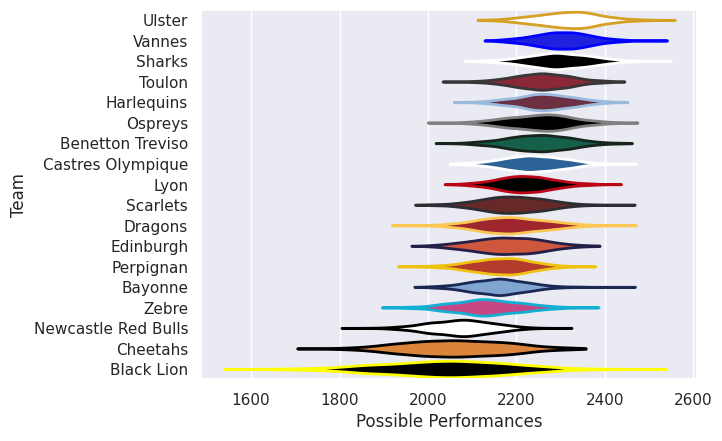
# Standings

## Projected Remaining Table

| Club                |   To Play |   Projected Wins |   Projected Differential |   Projected Losing Bonus Points | Projected Try Bonus Points   |   Projected Competition Points |
|:--------------------|----------:|-----------------:|-------------------------:|--------------------------------:|:-----------------------------|-------------------------------:|
| Scarlets            |         1 |            0.914 |                   10.537 |                           0.057 |                              |                          3.761 |
| Bayonne             |         1 |            0.889 |                   10.649 |                           0.072 |                              |                          3.676 |
| Castres Olympique   |         1 |            0.817 |                    7.596 |                           0.137 |                              |                          3.473 |
| Dragons             |         1 |            0.745 |                    5.65  |                           0.175 |                              |                          3.207 |
| Ulster              |         1 |            0.708 |                    4.773 |                           0.182 |                              |                          3.104 |
| Ospreys             |         1 |            0.723 |                    7.804 |                           0.155 |                              |                          3.099 |
| Harlequins          |         1 |            0.602 |                    2.397 |                           0.26  |                              |                          2.774 |
| Edinburgh           |         1 |            0.547 |                    1.741 |                           0.306 |                              |                          2.598 |
| Lyon                |         1 |            0.539 |                    1.264 |                           0.294 |                              |                          2.552 |
| Sharks              |         1 |            0.41  |                   -1.264 |                           0.333 |                              |                          2.075 |
| Toulon              |         1 |            0.401 |                   -1.741 |                           0.34  |                              |                          2.048 |
| Vannes              |         1 |            0.345 |                   -2.397 |                           0.37  |                              |                          1.856 |
| Zebre               |         1 |            0.247 |                   -4.773 |                           0.353 |                              |                          1.431 |
| Perpignan           |         1 |            0.229 |                   -5.65  |                           0.329 |                              |                          1.297 |
| Black Lion          |         1 |            0.251 |                   -7.804 |                           0.21  |                              |                          1.266 |
| Benetton Treviso    |         1 |            0.149 |                   -7.596 |                           0.311 |                              |                          0.975 |
| Cheetahs            |         1 |            0.087 |                  -10.649 |                           0.231 |                              |                          0.627 |
| Newcastle Red Bulls |         1 |            0.062 |                  -10.537 |                           0.255 |                              |                          0.551 |

## Projected Total Table

| Club                |   Played |   Wins |   Point Differential |   Losing Bonus Points | Try Bonus Points   |   Competition Points |
|:--------------------|---------:|-------:|---------------------:|----------------------:|:-------------------|---------------------:|
| Scarlets            |        1 |  0.914 |               10.537 |                 0.057 |                    |                3.761 |
| Bayonne             |        1 |  0.889 |               10.649 |                 0.072 |                    |                3.676 |
| Castres Olympique   |        1 |  0.817 |                7.596 |                 0.137 |                    |                3.473 |
| Dragons             |        1 |  0.745 |                5.65  |                 0.175 |                    |                3.207 |
| Ulster              |        1 |  0.708 |                4.773 |                 0.182 |                    |                3.104 |
| Ospreys             |        1 |  0.723 |                7.804 |                 0.155 |                    |                3.099 |
| Harlequins          |        1 |  0.602 |                2.397 |                 0.26  |                    |                2.774 |
| Edinburgh           |        1 |  0.547 |                1.741 |                 0.306 |                    |                2.598 |
| Lyon                |        1 |  0.539 |                1.264 |                 0.294 |                    |                2.552 |
| Sharks              |        1 |  0.41  |               -1.264 |                 0.333 |                    |                2.075 |
| Toulon              |        1 |  0.401 |               -1.741 |                 0.34  |                    |                2.048 |
| Vannes              |        1 |  0.345 |               -2.397 |                 0.37  |                    |                1.856 |
| Zebre               |        1 |  0.247 |               -4.773 |                 0.353 |                    |                1.431 |
| Perpignan           |        1 |  0.229 |               -5.65  |                 0.329 |                    |                1.297 |
| Black Lion          |        1 |  0.251 |               -7.804 |                 0.21  |                    |                1.266 |
| Benetton Treviso    |        1 |  0.149 |               -7.596 |                 0.311 |                    |                0.975 |
| Cheetahs            |        1 |  0.087 |              -10.649 |                 0.231 |                    |                0.627 |
| Newcastle Red Bulls |        1 |  0.062 |              -10.537 |                 0.255 |                    |                0.551 |

# Future Predictions

## Week 1

### Edinburgh V Toulon on 2026/10/16

Average Margin: Edinburgh by 1.7

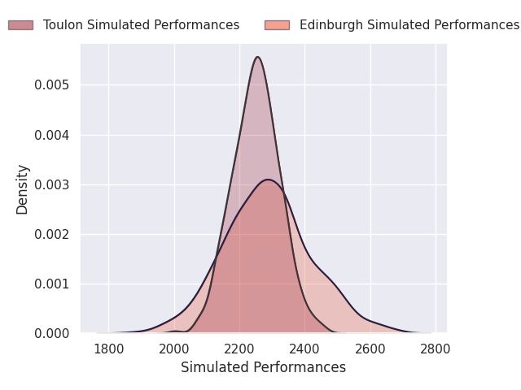

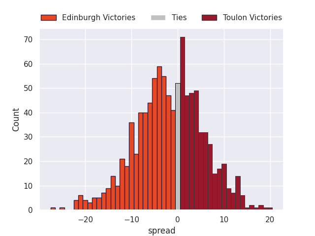

### Dragons V Perpignan on 2026/10/16

Average Margin: Dragons by 5.6

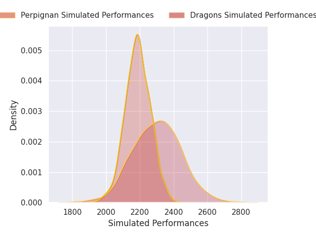

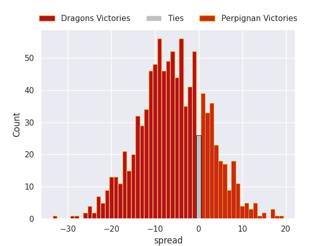

### Black Lion V Ospreys on 2026/10/17

Average Margin: Ospreys by 7.8

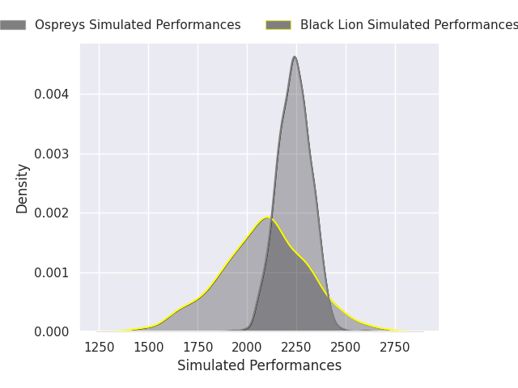

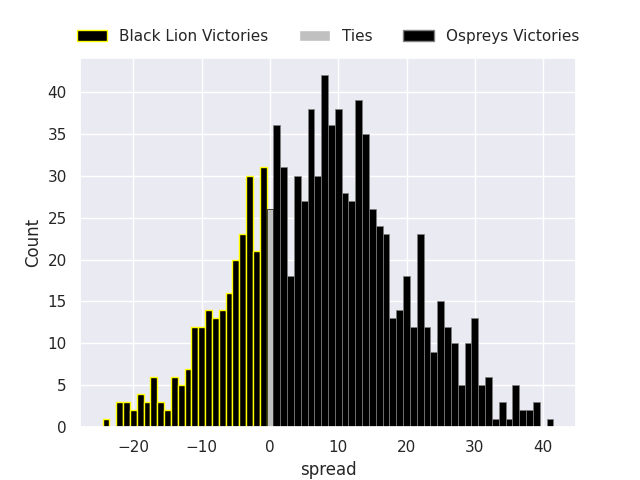

### Zebre V Ulster on 2026/10/17

Average Margin: Ulster by 4.8

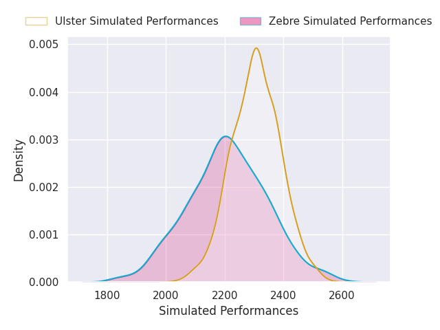
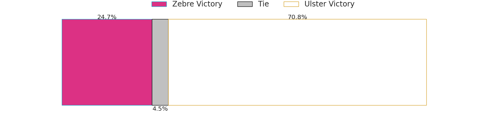
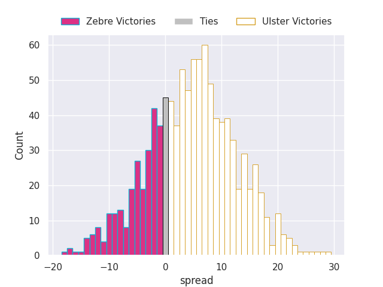

### Lyon V Sharks on 2026/10/17

Average Margin: Lyon by 1.3

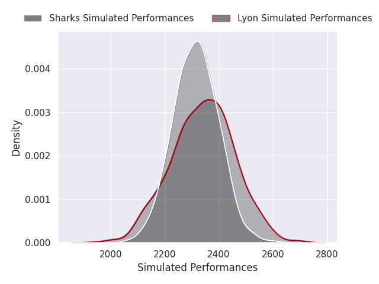

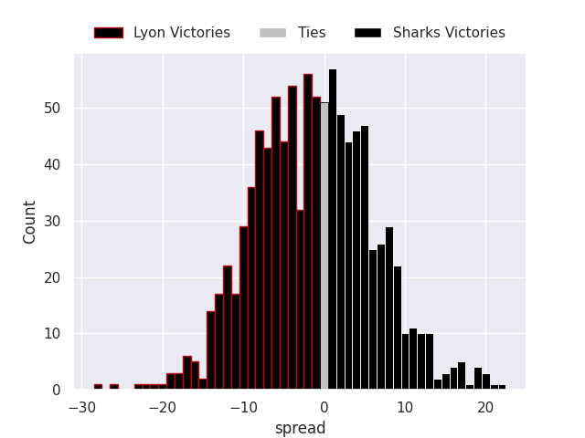

### Scarlets V Newcastle Red Bulls on 2026/10/17

Average Margin: Scarlets by 10.5

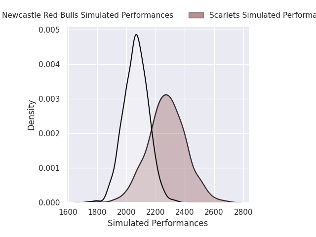
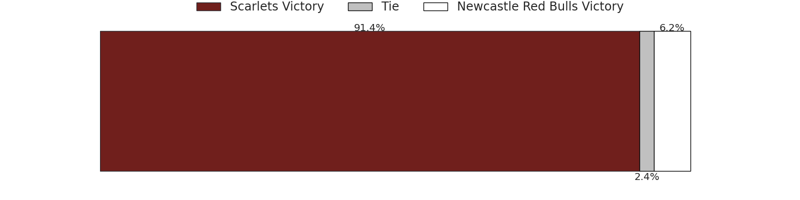
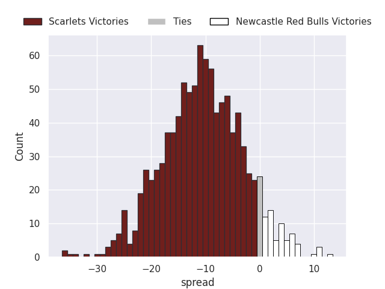

### Castres Olympique V Benetton Treviso on 2026/10/18

Average Margin: Castres Olympique by 7.6

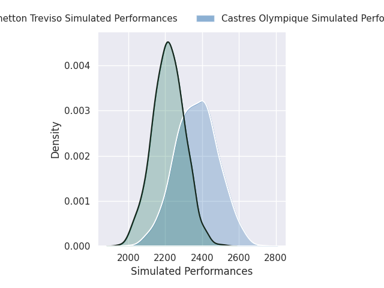
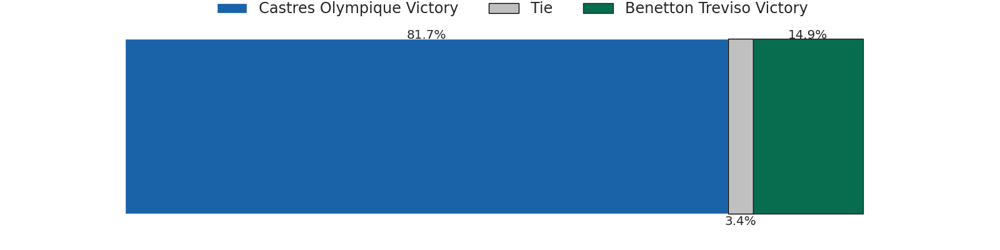
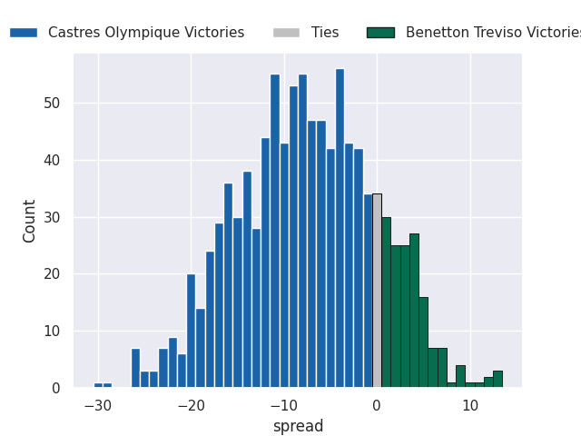

### Harlequins V Vannes on 2026/10/18

Average Margin: Harlequins by 2.4

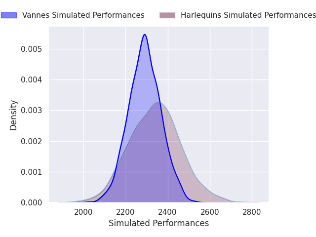
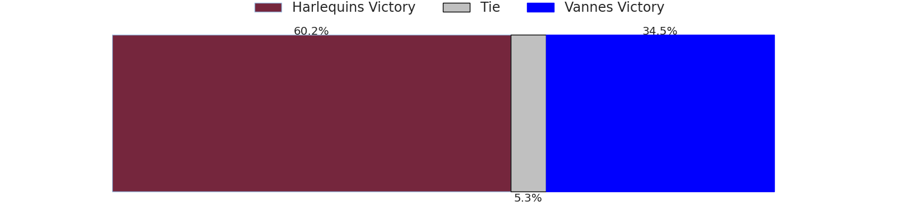
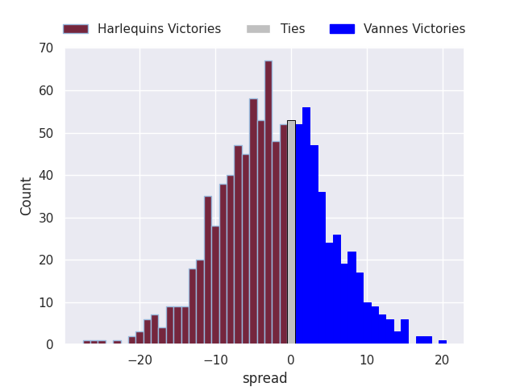

### Bayonne V Cheetahs on 2026/10/18

Average Margin: Bayonne by 10.6

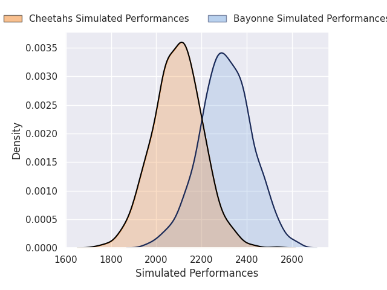
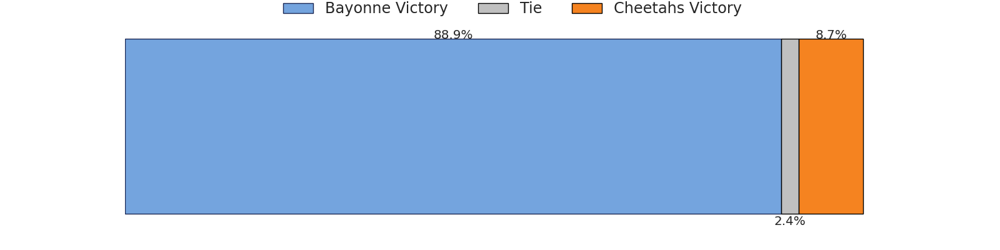
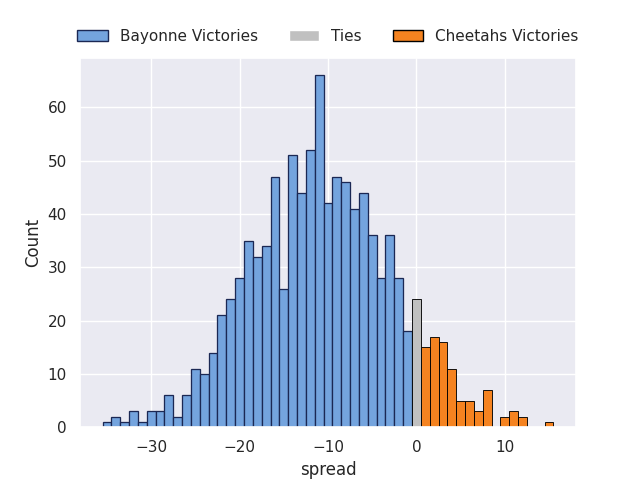

