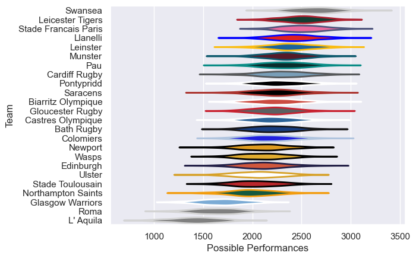

---  
title: "European Rugby Champions Cup 00/01 Status"  
date: 2025-07-28 6:00:00 -0500  
categories: model review projection  
layout: article  
aside:  
    toc: true  
---
# Current Team Rankings

# Standings

## Current Standings

| Club                 |   Played |   Wins |   Point Differential |   Losing Bonus Points | Try Bonus Points   |   Competition Points |
|:---------------------|---------:|-------:|---------------------:|----------------------:|:-------------------|---------------------:|
| Leicester Tigers     |        9 |      8 |                  112 |                     1 |                    |                   33 |
| Stade Francais Paris |        9 |      7 |                  226 |                     2 |                    |                   30 |
| Munster              |        8 |      6 |                   53 |                     1 |                    |                   25 |
| Gloucester Rugby     |        8 |      5 |                   48 |                     1 |                    |                   23 |
| Llanelli             |        6 |      4 |                   84 |                     2 |                    |                   18 |
| Cardiff Rugby        |        7 |      4 |                   28 |                     1 |                    |                   17 |
| Swansea              |        7 |      4 |                   90 |                     0 |                    |                   16 |
| Saracens             |        6 |      4 |                   36 |                     0 |                    |                   16 |
| Bath Rugby           |        6 |      4 |                   25 |                     0 |                    |                   16 |
| Biarritz Olympique   |        7 |      4 |                    3 |                     0 |                    |                   16 |
| Pau                  |        7 |      4 |                   -5 |                     0 |                    |                   16 |
| Colomiers            |        6 |      3 |                   28 |                     0 |                    |                   14 |
| Leinster             |        6 |      3 |                   13 |                     0 |                    |                   14 |
| Edinburgh            |        6 |      3 |                   -7 |                     0 |                    |                   14 |
| Wasps                |        6 |      3 |                   19 |                     1 |                    |                   13 |
| Pontypridd           |        6 |      2 |                    5 |                     3 |                    |                   11 |
| Stade Toulousain     |        6 |      2 |                  -11 |                     1 |                    |                   11 |
| Northampton Saints   |        6 |      1 |                  -18 |                     4 |                    |                    8 |
| Newport              |        6 |      2 |                  -53 |                     0 |                    |                    8 |
| Ulster               |        6 |      1 |                  -59 |                     1 |                    |                    7 |
| Castres Olympique    |        6 |      1 |                  -17 |                     2 |                    |                    6 |
| Glasgow Warriors     |        6 |      1 |                  -90 |                     0 |                    |                    4 |
| Roma                 |        6 |      0 |                 -158 |                     0 |                    |                    0 |
| L' Aquila            |        6 |      0 |                 -352 |                     0 |                    |                    0 |

# Completed Match Review

| Model | Percent Correct Predictions | Spread Error |
| ------ | ------ | ------ |
| Club Level | 63.3% | 15.4 |
| Player Level: Lineup | nan% | nan |
| Player Level: Minutes | nan% | nan |

