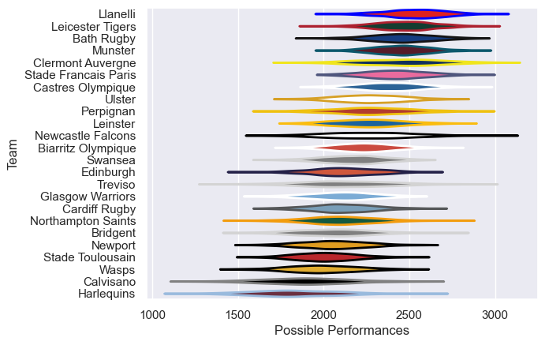

---  
title: "European Rugby Champions Cup 01/02 Status"  
date: 2025-07-28 6:00:00 -0500  
categories: model review projection  
layout: article  
aside:  
    toc: true  
---
# Current Team Rankings

# Standings

## Current Standings

| Club                 |   Played |   Wins |   Point Differential |   Losing Bonus Points | Try Bonus Points   |   Competition Points |
|:---------------------|---------:|-------:|---------------------:|----------------------:|:-------------------|---------------------:|
| Leicester Tigers     |        9 |      8 |                  105 |                     0 |                    |                   32 |
| Munster              |        9 |      7 |                   89 |                     1 |                    |                   29 |
| Castres Olympique    |        8 |      6 |                   47 |                     1 |                    |                   25 |
| Bath Rugby           |        7 |      6 |                   88 |                     0 |                    |                   24 |
| Stade Francais Paris |        7 |      5 |                  147 |                     2 |                    |                   22 |
| Llanelli             |        8 |      5 |                  104 |                     2 |                    |                   22 |
| Clermont Auvergne    |        7 |      4 |                   90 |                     2 |                    |                   20 |
| Leinster             |        7 |      5 |                   24 |                     0 |                    |                   20 |
| Ulster               |        6 |      4 |                   54 |                     1 |                    |                   17 |
| Perpignan            |        6 |      3 |                   46 |                     1 |                    |                   13 |
| Newport              |        6 |      3 |                   17 |                     1 |                    |                   13 |
| Stade Toulousain     |        6 |      3 |                    5 |                     1 |                    |                   13 |
| Cardiff Rugby        |        6 |      3 |                    0 |                     0 |                    |                   12 |
| Biarritz Olympique   |        6 |      2 |                    9 |                     1 |                    |                   11 |
| Northampton Saints   |        6 |      2 |                  -19 |                     2 |                    |                   10 |
| Glasgow Warriors     |        6 |      2 |                  -72 |                     0 |                    |                   10 |
| Wasps                |        6 |      2 |                  -66 |                     1 |                    |                    9 |
| Harlequins           |        6 |      2 |                  -68 |                     1 |                    |                    9 |
| Swansea              |        6 |      2 |                  -50 |                     0 |                    |                    8 |
| Edinburgh            |        6 |      1 |                  -64 |                     2 |                    |                    8 |
| Treviso              |        6 |      1 |                 -137 |                     2 |                    |                    6 |
| Newcastle Falcons    |        6 |      1 |                  -57 |                     1 |                    |                    5 |
| Bridgent             |        6 |      0 |                  -71 |                     3 |                    |                    3 |
| Calvisano            |        6 |      0 |                 -221 |                     0 |                    |                    0 |

# Completed Match Review

| Model | Percent Correct Predictions | Spread Error |
| ------ | ------ | ------ |
| Club Level | 64.6% | 14.8 |
| Player Level: Lineup | nan% | nan |
| Player Level: Minutes | nan% | nan |

