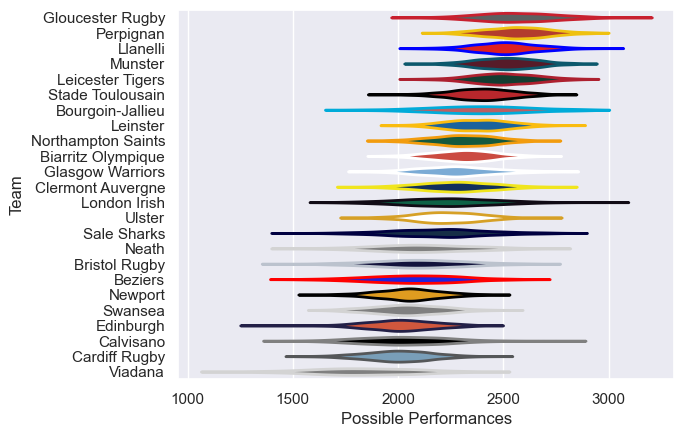

---  
title: "European Rugby Champions Cup 02/03"  
date: 2025-07-29 6:00:00 -0500  
categories: model review projection  
layout: article  
aside:  
    toc: true  
---
# Current Team Rankings

# Standings

## Current Standings

| Club               |   Played |   Wins |   Point Differential |   Losing Bonus Points | Try Bonus Points   |   Competition Points |
|:-------------------|---------:|-------:|---------------------:|----------------------:|:-------------------|---------------------:|
| Stade Toulousain   |        9 |      8 |                  145 |                     1 |                    |                   33 |
| Leinster           |        8 |      7 |                   93 |                     1 |                    |                   29 |
| Perpignan          |        9 |      6 |                   29 |                     1 |                    |                   25 |
| Leicester Tigers   |        7 |      5 |                  148 |                     0 |                    |                   22 |
| Munster            |        8 |      5 |                  111 |                     1 |                    |                   21 |
| Llanelli           |        7 |      5 |                   64 |                     1 |                    |                   21 |
| Biarritz Olympique |        7 |      4 |                   57 |                     3 |                    |                   19 |
| Northampton Saints |        7 |      4 |                   49 |                     2 |                    |                   18 |
| Bourgoin-Jallieu   |        6 |      4 |                   48 |                     1 |                    |                   17 |
| Ulster             |        6 |      4 |                   10 |                     1 |                    |                   17 |
| Gloucester Rugby   |        6 |      4 |                  101 |                     0 |                    |                   16 |
| London Irish       |        6 |      3 |                   40 |                     3 |                    |                   15 |
| Bristol Rugby      |        6 |      3 |                    5 |                     2 |                    |                   14 |
| Clermont Auvergne  |        6 |      2 |                   21 |                     3 |                    |                   11 |
| Neath              |        6 |      2 |                   12 |                     1 |                    |                   11 |
| Beziers            |        6 |      2 |                  -42 |                     2 |                    |                   10 |
| Edinburgh          |        6 |      2 |                  -63 |                     0 |                    |                    8 |
| Glasgow Warriors   |        6 |      2 |                  -99 |                     0 |                    |                    8 |
| Newport            |        6 |      2 |                 -100 |                     0 |                    |                    8 |
| Calvisano          |        6 |      2 |                 -131 |                     0 |                    |                    8 |
| Sale Sharks        |        6 |      1 |                  -20 |                     2 |                    |                    6 |
| Swansea            |        6 |      1 |                 -121 |                     1 |                    |                    5 |
| Viadana            |        6 |      0 |                 -220 |                     1 |                    |                    1 |
| Cardiff Rugby      |        6 |      0 |                 -137 |                     0 |                    |                    0 |

# Completed Match Review

| Model | Percent Correct Predictions | Spread Error |
| ------ | ------ | ------ |
| Club Level | 72.2% | 13.3 |
| Player Level: Lineup | nan% | nan |
| Player Level: Minutes | nan% | nan |

