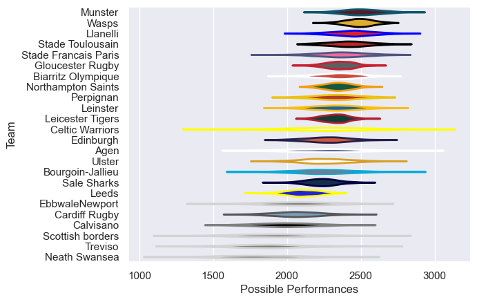

---  
title: "European Rugby Champions Cup 03/04"  
date: 2025-07-29 6:00:00 -0500  
categories: model review projection  
layout: article  
aside:  
    toc: true  
---
# Current Team Rankings

# Standings

## Current Standings

| Club                 |   Played |   Wins |   Point Differential |   Losing Bonus Points | Try Bonus Points   |   Competition Points |
|:---------------------|---------:|-------:|---------------------:|----------------------:|:-------------------|---------------------:|
| Wasps                |        9 |      8 |                  144 |                     1 |                    |                   33 |
| Stade Toulousain     |        9 |      7 |                  119 |                     2 |                    |                   30 |
| Munster              |        8 |      6 |                   96 |                     1 |                    |                   25 |
| Llanelli             |        7 |      5 |                   71 |                     1 |                    |                   21 |
| Biarritz Olympique   |        8 |      5 |                   51 |                     1 |                    |                   21 |
| Gloucester Rugby     |        7 |      5 |                   56 |                     0 |                    |                   20 |
| Edinburgh            |        7 |      5 |                   15 |                     0 |                    |                   20 |
| Stade Francais Paris |        7 |      4 |                   49 |                     2 |                    |                   18 |
| Celtic Warriors      |        6 |      4 |                    5 |                     2 |                    |                   18 |
| Northampton Saints   |        6 |      4 |                   67 |                     1 |                    |                   17 |
| Leinster             |        6 |      4 |                   29 |                     1 |                    |                   17 |
| Perpignan            |        6 |      3 |                    4 |                     1 |                    |                   13 |
| Ulster               |        6 |      3 |                    3 |                     1 |                    |                   13 |
| Leicester Tigers     |        6 |      3 |                   22 |                     0 |                    |                   12 |
| Cardiff Rugby        |        6 |      2 |                   -9 |                     3 |                    |                   11 |
| Agen                 |        6 |      2 |                  -11 |                     2 |                    |                   10 |
| Sale Sharks          |        6 |      2 |                  -62 |                     1 |                    |                    9 |
| EbbwaleNewport       |        6 |      2 |                  -79 |                     1 |                    |                    9 |
| Leeds                |        6 |      1 |                  -52 |                     1 |                    |                    5 |
| Bourgoin-Jallieu     |        6 |      1 |                  -72 |                     1 |                    |                    5 |
| Neath Swansea        |        6 |      1 |                  -81 |                     0 |                    |                    4 |
| Treviso              |        6 |      1 |                 -111 |                     0 |                    |                    4 |
| Scottish borders     |        6 |      1 |                 -144 |                     0 |                    |                    4 |
| Calvisano            |        6 |      0 |                 -110 |                     2 |                    |                    2 |

# Completed Match Review

| Model | Percent Correct Predictions | Spread Error |
| ------ | ------ | ------ |
| Club Level | 74.7% | 13.1 |
| Player Level: Lineup | nan% | nan |
| Player Level: Minutes | nan% | nan |

