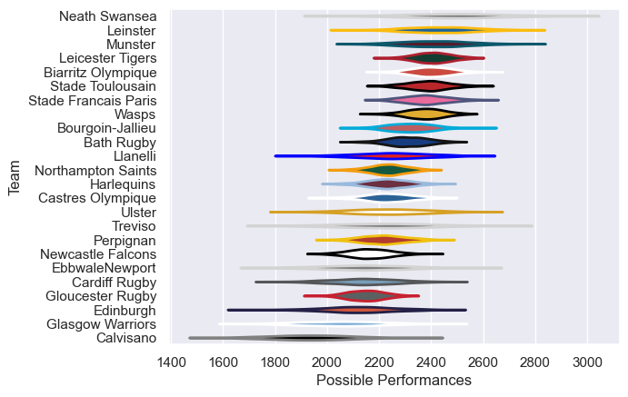

---  
title: "European Rugby Champions Cup 04/05 Status"  
date: 2025-07-28 6:00:00 -0500  
categories: model review projection  
layout: article  
aside:  
    toc: true  
---
# Current Team Rankings

# Standings

## Current Standings

| Club                 |   Played |   Wins |   Point Differential |   Losing Bonus Points | Try Bonus Points   |   Competition Points |
|:---------------------|---------:|-------:|---------------------:|----------------------:|:-------------------|---------------------:|
| Stade Toulousain     |        9 |      8 |                  119 |                     1 |                    |                   33 |
| Stade Francais Paris |        9 |      7 |                  126 |                     1 |                    |                   29 |
| Biarritz Olympique   |        8 |      6 |                   77 |                     1 |                    |                   25 |
| Leinster             |        7 |      6 |                  141 |                     0 |                    |                   24 |
| Leicester Tigers     |        8 |      5 |                   86 |                     1 |                    |                   21 |
| Munster              |        7 |      5 |                   38 |                     1 |                    |                   21 |
| Northampton Saints   |        7 |      5 |                   -1 |                     0 |                    |                   20 |
| Newcastle Falcons    |        7 |      5 |                  -31 |                     0 |                    |                   20 |
| Castres Olympique    |        6 |      3 |                   36 |                     0 |                    |                   14 |
| Wasps                |        6 |      3 |                   36 |                     2 |                    |                   14 |
| Bath Rugby           |        6 |      3 |                   27 |                     2 |                    |                   14 |
| Perpignan            |        6 |      3 |                   26 |                     1 |                    |                   13 |
| EbbwaleNewport       |        6 |      3 |                   25 |                     1 |                    |                   13 |
| Neath Swansea        |        6 |      3 |                   20 |                     1 |                    |                   13 |
| Gloucester Rugby     |        6 |      3 |                   16 |                     1 |                    |                   13 |
| Ulster               |        6 |      3 |                  -51 |                     1 |                    |                   13 |
| Treviso              |        6 |      3 |                  -45 |                     0 |                    |                   12 |
| Llanelli             |        6 |      2 |                  -25 |                     2 |                    |                   10 |
| Cardiff Rugby        |        6 |      1 |                  -54 |                     3 |                    |                    7 |
| Edinburgh            |        6 |      1 |                  -60 |                     2 |                    |                    6 |
| Harlequins           |        6 |      0 |                 -103 |                     1 |                    |                    3 |
| Glasgow Warriors     |        6 |      0 |                  -79 |                     2 |                    |                    2 |
| Bourgoin-Jallieu     |        6 |      0 |                 -139 |                     2 |                    |                    2 |
| Calvisano            |        6 |      0 |                 -185 |                     0 |                    |                    0 |

# Completed Match Review

| Model | Percent Correct Predictions | Spread Error |
| ------ | ------ | ------ |
| Club Level | 74.7% | 11.8 |
| Player Level: Lineup | nan% | nan |
| Player Level: Minutes | nan% | nan |

