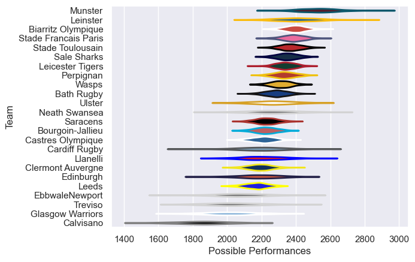

---  
title: "European Rugby Champions Cup 05/06 Status"  
date: 2025-07-28 6:00:00 -0500  
categories: model review projection  
layout: article  
aside:  
    toc: true  
---
# Current Team Rankings

# Standings

## Current Standings

| Club                 |   Played |   Wins |   Point Differential |   Losing Bonus Points | Try Bonus Points   |   Competition Points |
|:---------------------|---------:|-------:|---------------------:|----------------------:|:-------------------|---------------------:|
| Munster              |        9 |      8 |                  136 |                     0 |                    |                   32 |
| Biarritz Olympique   |        9 |      7 |                   99 |                     1 |                    |                   29 |
| Bath Rugby           |        8 |      6 |                   49 |                     0 |                    |                   24 |
| Stade Toulousain     |        7 |      5 |                   58 |                     1 |                    |                   23 |
| Leinster             |        8 |      5 |                   72 |                     2 |                    |                   22 |
| Leicester Tigers     |        7 |      5 |                   65 |                     2 |                    |                   22 |
| Perpignan            |        7 |      5 |                   99 |                     1 |                    |                   21 |
| Sale Sharks          |        7 |      5 |                   70 |                     1 |                    |                   21 |
| Stade Francais Paris |        6 |      4 |                   50 |                     2 |                    |                   18 |
| Saracens             |        6 |      4 |                   -1 |                     0 |                    |                   16 |
| Leeds                |        5 |      3 |                   32 |                     1 |                    |                   13 |
| Wasps                |        6 |      2 |                   55 |                     2 |                    |                   12 |
| Ulster               |        6 |      3 |                   15 |                     0 |                    |                   12 |
| Cardiff Rugby        |        6 |      3 |                  -17 |                     0 |                    |                   12 |
| Llanelli             |        6 |      2 |                  -54 |                     2 |                    |                   10 |
| Edinburgh            |        6 |      2 |                  -65 |                     2 |                    |                   10 |
| Neath Swansea        |        6 |      2 |                  -54 |                     1 |                    |                    9 |
| Bourgoin-Jallieu     |        6 |      2 |                  -86 |                     0 |                    |                    8 |
| Glasgow Warriors     |        6 |      1 |                  -59 |                     1 |                    |                    5 |
| Clermont Auvergne    |        6 |      1 |                  -64 |                     1 |                    |                    5 |
| EbbwaleNewport       |        6 |      1 |                  -69 |                     1 |                    |                    5 |
| Castres Olympique    |        6 |      1 |                 -105 |                     1 |                    |                    5 |
| Treviso              |        6 |      0 |                 -103 |                     1 |                    |                    1 |
| Calvisano            |        5 |      0 |                 -123 |                     0 |                    |                    0 |

# Completed Match Review

| Model | Percent Correct Predictions | Spread Error |
| ------ | ------ | ------ |
| Club Level | 69.2% | 11.5 |
| Player Level: Lineup | nan% | nan |
| Player Level: Minutes | nan% | nan |

