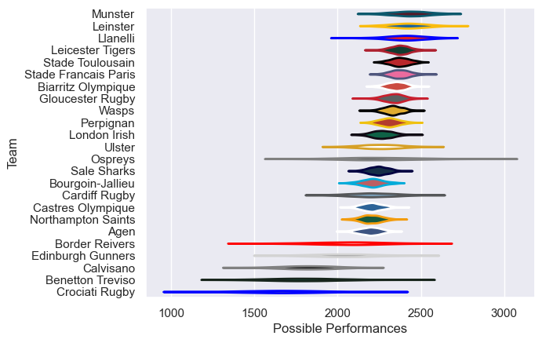

---  
title: "European Rugby Champions Cup 06/07"  
date: 2025-07-29 6:00:00 -0500  
categories: model review projection  
layout: article  
aside:  
    toc: true  
---
# Current Team Rankings

# Standings

## Current Standings

| Club                 |   Played |   Wins |   Point Differential |   Losing Bonus Points | Try Bonus Points   |   Competition Points |
|:---------------------|---------:|-------:|---------------------:|----------------------:|:-------------------|---------------------:|
| Wasps                |        9 |      8 |                  186 |                     1 |                    |                   33 |
| Leicester Tigers     |        9 |      7 |                  113 |                     1 |                    |                   29 |
| Llanelli             |        8 |      7 |                   42 |                     0 |                    |                   28 |
| Biarritz Olympique   |        7 |      6 |                  140 |                     1 |                    |                   25 |
| Munster              |        7 |      5 |                   31 |                     1 |                    |                   21 |
| Stade Francais Paris |        7 |      4 |                   93 |                     2 |                    |                   20 |
| Northampton Saints   |        8 |      5 |                   80 |                     0 |                    |                   20 |
| Leinster             |        7 |      4 |                   55 |                     2 |                    |                   18 |
| Ospreys              |        6 |      4 |                   39 |                     0 |                    |                   18 |
| Perpignan            |        6 |      4 |                   53 |                     0 |                    |                   16 |
| Agen                 |        6 |      4 |                    0 |                     0 |                    |                   16 |
| Castres Olympique    |        6 |      3 |                   10 |                     2 |                    |                   14 |
| Stade Toulousain     |        6 |      3 |                    2 |                     2 |                    |                   14 |
| Sale Sharks          |        6 |      3 |                   57 |                     1 |                    |                   13 |
| Gloucester Rugby     |        6 |      3 |                    8 |                     1 |                    |                   13 |
| Ulster               |        6 |      2 |                  -18 |                     1 |                    |                    9 |
| Cardiff Rugby        |        6 |      2 |                  -51 |                     1 |                    |                    9 |
| London Irish         |        6 |      1 |                  -33 |                     3 |                    |                    7 |
| Edinburgh Gunners    |        6 |      1 |                  -85 |                     1 |                    |                    5 |
| Border Reivers       |        6 |      1 |                  -45 |                     0 |                    |                    4 |
| Crociati Rugby       |        6 |      1 |                 -192 |                     0 |                    |                    4 |
| Bourgoin-Jallieu     |        6 |      0 |                 -101 |                     2 |                    |                    2 |
| Calvisano            |        6 |      0 |                 -190 |                     0 |                    |                    0 |
| Benetton Treviso     |        6 |      0 |                 -194 |                     0 |                    |                    0 |

# Completed Match Review

| Model | Percent Correct Predictions | Spread Error |
| ------ | ------ | ------ |
| Club Level | 77.2% | 11.7 |
| Player Level: Lineup | nan% | nan |
| Player Level: Minutes | nan% | nan |

