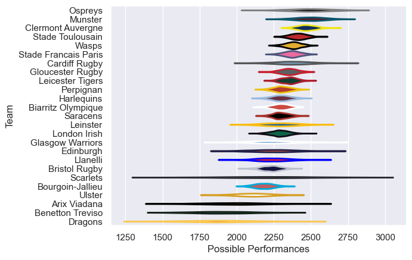

---  
title: "European Rugby Champions Cup 07/08"  
date: 2025-07-29 6:00:00 -0500  
categories: model review projection  
layout: article  
aside:  
    toc: true  
---
# Current Team Rankings

# Standings

## Current Standings

| Club                 |   Played |   Wins |   Point Differential |   Losing Bonus Points | Try Bonus Points   |   Competition Points |
|:---------------------|---------:|-------:|---------------------:|----------------------:|:-------------------|---------------------:|
| Munster              |        9 |      7 |                   71 |                     2 |                    |                   30 |
| Stade Toulousain     |        9 |      6 |                   81 |                     3 |                    |                   27 |
| Saracens             |        8 |      6 |                  113 |                     2 |                    |                   26 |
| London Irish         |        8 |      6 |                   87 |                     1 |                    |                   25 |
| Clermont Auvergne    |        7 |      5 |                  102 |                     1 |                    |                   21 |
| Perpignan            |        7 |      5 |                   81 |                     0 |                    |                   20 |
| Wasps                |        7 |      5 |                   58 |                     0 |                    |                   20 |
| Ospreys              |        7 |      5 |                   53 |                     0 |                    |                   20 |
| Gloucester Rugby     |        7 |      5 |                   52 |                     0 |                    |                   20 |
| Cardiff Rugby        |        7 |      4 |                   24 |                     1 |                    |                   19 |
| Biarritz Olympique   |        6 |      4 |                   -7 |                     1 |                    |                   17 |
| Stade Francais Paris |        6 |      4 |                   28 |                     0 |                    |                   16 |
| Glasgow Warriors     |        6 |      3 |                    3 |                     3 |                    |                   15 |
| Leicester Tigers     |        6 |      3 |                   31 |                     1 |                    |                   13 |
| Bristol Rugby        |        6 |      3 |                    3 |                     0 |                    |                   12 |
| Leinster             |        6 |      3 |                  -28 |                     0 |                    |                   12 |
| Edinburgh            |        6 |      2 |                  -57 |                     1 |                    |                    9 |
| Bourgoin-Jallieu     |        6 |      1 |                  -56 |                     3 |                    |                    7 |
| Dragons              |        6 |      1 |                  -74 |                     2 |                    |                    6 |
| Ulster               |        6 |      1 |                  -71 |                     1 |                    |                    5 |
| Benetton Treviso     |        6 |      1 |                 -100 |                     1 |                    |                    5 |
| Harlequins           |        6 |      0 |                  -79 |                     0 |                    |                    2 |
| Arix Viadana         |        6 |      0 |                 -102 |                     1 |                    |                    1 |
| Scarlets             |        2 |      0 |                  -74 |                     0 |                    |                    0 |
| Llanelli             |        6 |      0 |                 -139 |                     0 |                    |                    0 |

# Completed Match Review

| Model | Percent Correct Predictions | Spread Error |
| ------ | ------ | ------ |
| Club Level | 82.7% | 10.7 |
| Player Level: Lineup | nan% | nan |
| Player Level: Minutes | nan% | nan |

