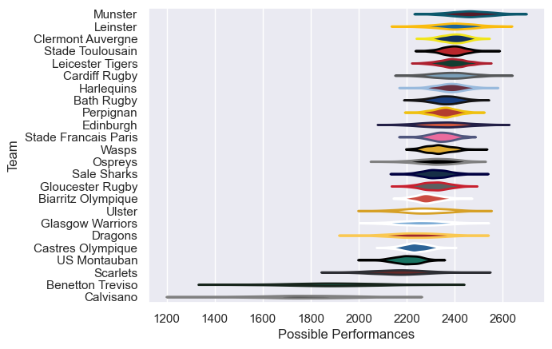

---  
title: "European Rugby Champions Cup 08/09 Status"  
date: 2025-07-28 6:00:00 -0500  
categories: model review projection  
layout: article  
aside:  
    toc: true  
---
# Current Team Rankings

# Standings

## Current Standings

| Club                 |   Played |   Wins |   Point Differential |   Losing Bonus Points |   Try Bonus Points |   Competition Points |
|:---------------------|---------:|-------:|---------------------:|----------------------:|-------------------:|---------------------:|
| Cardiff Rugby        |        9 |      7 |                  106 |                     0 |                  3 |                   35 |
| Leinster             |        9 |      7 |                   93 |                     2 |                  2 |                   32 |
| Munster              |        8 |      6 |                   78 |                     1 |                  3 |                   28 |
| Leicester Tigers     |        8 |      5 |                  103 |                     3 |                  3 |                   26 |
| Harlequins           |        7 |      5 |                   28 |                     1 |                  2 |                   23 |
| Bath Rugby           |        7 |      4 |                   10 |                     2 |                  2 |                   22 |
| Stade Toulousain     |        7 |      4 |                   30 |                     2 |                  1 |                   21 |
| Ospreys              |        7 |      4 |                   50 |                     2 |                  2 |                   20 |
| Perpignan            |        6 |      4 |                   34 |                     1 |                  1 |                   18 |
| Wasps                |        6 |      4 |                    2 |                     1 |                    |                   17 |
| Gloucester Rugby     |        6 |      3 |                   47 |                     1 |                  2 |                   15 |
| Biarritz Olympique   |        6 |      3 |                   33 |                     2 |                  1 |                   15 |
| Stade Francais Paris |        6 |      3 |                   22 |                     2 |                  1 |                   15 |
| Sale Sharks          |        6 |      3 |                   21 |                     1 |                  2 |                   15 |
| Clermont Auvergne    |        6 |      3 |                    8 |                     0 |                  1 |                   13 |
| Glasgow Warriors     |        6 |      2 |                  -16 |                     3 |                  1 |                   12 |
| Ulster               |        6 |      2 |                  -21 |                     1 |                    |                   11 |
| Edinburgh            |        6 |      2 |                  -12 |                     0 |                  1 |                    9 |
| Castres Olympique    |        6 |      2 |                  -60 |                     1 |                    |                    9 |
| Scarlets             |        6 |      1 |                  -30 |                     2 |                    |                    8 |
| Dragons              |        6 |      1 |                  -32 |                     3 |                    |                    7 |
| US Montauban         |        6 |      1 |                  -92 |                     2 |                    |                    6 |
| Calvisano            |        6 |      0 |                 -183 |                     0 |                    |                    0 |
| Benetton Treviso     |        6 |      0 |                 -219 |                     0 |                    |                    0 |

# Completed Match Review

| Model | Percent Correct Predictions | Spread Error |
| ------ | ------ | ------ |
| Club Level | 75.9% | 9.7 |
| Player Level: Lineup | nan% | nan |
| Player Level: Minutes | nan% | nan |

