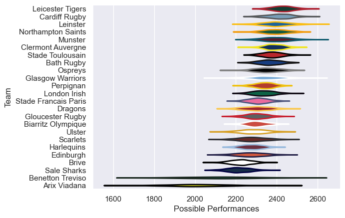

---  
title: "European Rugby Champions Cup 09/10"  
date: 2025-07-29 6:00:00 -0500  
categories: model review projection  
layout: article  
aside:  
    toc: true  
---
# Current Team Rankings

# Standings

## Current Standings

| Club                 |   Played |   Wins |   Point Differential |   Losing Bonus Points |   Try Bonus Points |   Competition Points |
|:---------------------|---------:|-------:|---------------------:|----------------------:|-------------------:|---------------------:|
| Biarritz Olympique   |       10 |      7 |                  103 |                     0 |                  2 |                   34 |
| Stade Toulousain     |        8 |      7 |                   87 |                     1 |                  2 |                   31 |
| Munster              |        8 |      6 |                   94 |                     1 |                  4 |                   29 |
| Leinster             |        8 |      5 |                   85 |                     1 |                  2 |                   25 |
| Clermont Auvergne    |        7 |      4 |                   80 |                     3 |                  3 |                   22 |
| Ospreys              |        7 |      4 |                   66 |                     1 |                  2 |                   21 |
| Northampton Saints   |        7 |      4 |                   20 |                     1 |                  2 |                   19 |
| Leicester Tigers     |        6 |      3 |                   64 |                     1 |                  3 |                   18 |
| Cardiff Rugby        |        6 |      4 |                   45 |                     1 |                  1 |                   18 |
| Stade Francais Paris |        7 |      4 |                    3 |                     1 |                  1 |                   18 |
| London Irish         |        6 |      3 |                   46 |                     1 |                  2 |                   17 |
| Ulster               |        6 |      4 |                   33 |                     1 |                    |                   17 |
| Scarlets             |        6 |      4 |                  -31 |                     0 |                  1 |                   17 |
| Gloucester Rugby     |        6 |      4 |                  -10 |                     0 |                    |                   16 |
| Sale Sharks          |        6 |      3 |                  -27 |                     1 |                  1 |                   14 |
| Edinburgh            |        6 |      3 |                  -30 |                     1 |                    |                   13 |
| Perpignan            |        6 |      2 |                  -15 |                     2 |                  1 |                   11 |
| Glasgow Warriors     |        6 |      2 |                  -20 |                     1 |                    |                    9 |
| Bath Rugby           |        6 |      1 |                  -32 |                     3 |                    |                    7 |
| Dragons              |        6 |      1 |                  -61 |                     2 |                    |                    6 |
| Benetton Treviso     |        6 |      1 |                 -110 |                     1 |                    |                    5 |
| Harlequins           |        6 |      0 |                  -69 |                     2 |                    |                    2 |
| Brive                |        6 |      0 |                 -109 |                     1 |                    |                    1 |
| Arix Viadana         |        6 |      0 |                 -212 |                     0 |                    |                    0 |

# Completed Match Review

| Model | Percent Correct Predictions | Spread Error |
| ------ | ------ | ------ |
| Club Level | 77.2% | 11.3 |
| Player Level: Lineup | nan% | nan |
| Player Level: Minutes | nan% | nan |

