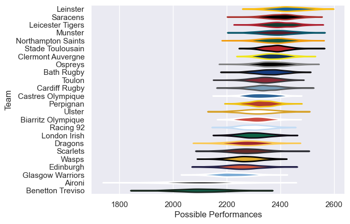

---  
title: "European Rugby Champions Cup 10/11"  
date: 2025-07-29 6:00:00 -0500  
categories: model review projection  
layout: article  
aside:  
    toc: true  
---
# Current Team Rankings

# Standings

## Current Standings

| Club               |   Played |   Wins |   Point Differential |   Losing Bonus Points |   Try Bonus Points |   Competition Points |
|:-------------------|---------:|-------:|---------------------:|----------------------:|-------------------:|---------------------:|
| Leinster           |        9 |      8 |                  102 |                     1 |                  3 |                   36 |
| Northampton Saints |        9 |      8 |                   83 |                     0 |                  1 |                   33 |
| Perpignan          |        8 |      5 |                   72 |                     0 |                  4 |                   26 |
| Stade Toulousain   |        8 |      6 |                   68 |                     1 |                  1 |                   26 |
| Leicester Tigers   |        7 |      4 |                   90 |                     2 |                  3 |                   23 |
| Biarritz Olympique |        7 |      4 |                   48 |                     3 |                  3 |                   22 |
| Ulster             |        7 |      5 |                   42 |                     0 |                  2 |                   22 |
| Wasps              |        6 |      4 |                   39 |                     1 |                  2 |                   19 |
| Clermont Auvergne  |        6 |      4 |                   20 |                     1 |                  2 |                   19 |
| Toulon             |        7 |      4 |                    5 |                     1 |                  1 |                   18 |
| Munster            |        6 |      3 |                   21 |                     2 |                  2 |                   16 |
| Scarlets           |        6 |      3 |                  -42 |                     0 |                  3 |                   15 |
| Bath Rugby         |        6 |      2 |                   39 |                     4 |                  2 |                   14 |
| Ospreys            |        6 |      3 |                    4 |                     2 |                    |                   14 |
| Cardiff Rugby      |        6 |      3 |                   -6 |                     2 |                    |                   14 |
| Glasgow Warriors   |        6 |      3 |                  -25 |                     0 |                    |                   12 |
| Castres Olympique  |        6 |      2 |                  -10 |                     3 |                    |                   11 |
| London Irish       |        6 |      2 |                  -34 |                     1 |                    |                    9 |
| Racing 92          |        6 |      2 |                  -47 |                     1 |                    |                    9 |
| Edinburgh          |        6 |      1 |                  -52 |                     4 |                    |                    8 |
| Saracens           |        6 |      1 |                  -48 |                     2 |                    |                    6 |
| Aironi             |        6 |      1 |                 -146 |                     0 |                    |                    4 |
| Dragons            |        6 |      0 |                  -84 |                     2 |                    |                    2 |
| Benetton Treviso   |        6 |      0 |                 -139 |                     1 |                    |                    1 |

# Completed Match Review

| Model | Percent Correct Predictions | Spread Error |
| ------ | ------ | ------ |
| Club Level | 78.5% | 9.1 |
| Player Level: Lineup | nan% | nan |
| Player Level: Minutes | nan% | nan |

