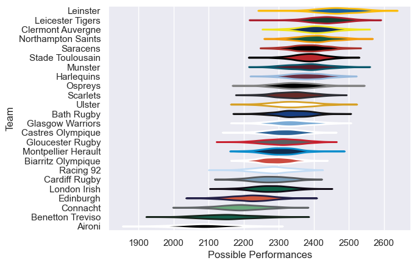

---  
title: "European Rugby Champions Cup 11/12 Status"  
date: 2025-07-28 6:00:00 -0500  
categories: model review projection  
layout: article  
aside:  
    toc: true  
---
# Current Team Rankings

# Standings

## Current Standings

| Club                |   Played |   Wins |   Point Differential |   Losing Bonus Points |   Try Bonus Points |   Competition Points |
|:--------------------|---------:|-------:|---------------------:|----------------------:|-------------------:|---------------------:|
| Leinster            |        9 |      8 |                  147 |                     0 |                  4 |                   38 |
| Ulster              |        9 |      6 |                   52 |                     1 |                  3 |                   28 |
| Edinburgh           |        8 |      6 |                   20 |                     1 |                  2 |                   27 |
| Munster             |        7 |      6 |                   39 |                     1 |                  1 |                   26 |
| Clermont Auvergne   |        8 |      5 |                  161 |                     3 |                  2 |                   25 |
| Saracens            |        7 |      5 |                   19 |                     1 |                  1 |                   22 |
| Cardiff Rugby       |        7 |      5 |                    4 |                     1 |                    |                   21 |
| Stade Toulousain    |        7 |      4 |                   40 |                     2 |                  1 |                   19 |
| Biarritz Olympique  |        6 |      3 |                   38 |                     3 |                  3 |                   18 |
| Harlequins          |        6 |      4 |                   28 |                     1 |                    |                   17 |
| Leicester Tigers    |        6 |      4 |                    6 |                     0 |                  1 |                   17 |
| Scarlets            |        6 |      3 |                   -5 |                     2 |                  1 |                   15 |
| Gloucester Rugby    |        6 |      3 |                  -11 |                     2 |                  1 |                   15 |
| Ospreys             |        6 |      2 |                   -5 |                     2 |                  1 |                   13 |
| Northampton Saints  |        6 |      2 |                   16 |                     2 |                  2 |                   12 |
| Glasgow Warriors    |        6 |      2 |                  -27 |                     2 |                    |                   12 |
| Bath Rugby          |        6 |      2 |                  -29 |                     3 |                    |                   11 |
| Montpellier Herault |        6 |      1 |                  -28 |                     2 |                    |                   10 |
| London Irish        |        6 |      1 |                  -23 |                     4 |                  1 |                    9 |
| Racing 92           |        6 |      1 |                  -30 |                     4 |                  1 |                    9 |
| Castres Olympique   |        6 |      1 |                  -56 |                     2 |                  1 |                    7 |
| Benetton Treviso    |        6 |      1 |                  -71 |                     1 |                    |                    7 |
| Connacht            |        6 |      1 |                  -62 |                     2 |                    |                    6 |
| Aironi              |        6 |      0 |                 -223 |                     0 |                    |                    0 |

# Completed Match Review

| Model | Percent Correct Predictions | Spread Error |
| ------ | ------ | ------ |
| Club Level | 67.1% | 10.8 |
| Player Level: Lineup | nan% | nan |
| Player Level: Minutes | nan% | nan |

