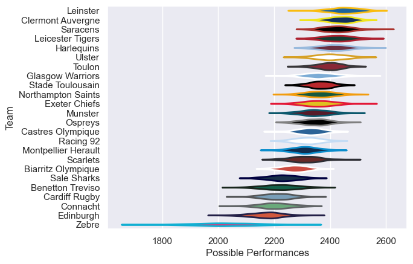

---  
title: "European Rugby Champions Cup 12/13 Status"  
date: 2025-07-28 6:00:00 -0500  
categories: model review projection  
layout: article  
aside:  
    toc: true  
---
# Current Team Rankings

# Standings

## Current Standings

| Club                |   Played |   Wins |   Point Differential |   Losing Bonus Points |   Try Bonus Points |   Competition Points |
|:--------------------|---------:|-------:|---------------------:|----------------------:|-------------------:|---------------------:|
| Clermont Auvergne   |        9 |      8 |                  176 |                     1 |                  5 |                   38 |
| Toulon              |        9 |      8 |                  121 |                     0 |                  3 |                   35 |
| Harlequins          |        7 |      6 |                  166 |                     1 |                  4 |                   29 |
| Saracens            |        8 |      6 |                  103 |                     1 |                  2 |                   27 |
| Munster             |        8 |      5 |                   60 |                     3 |                  2 |                   25 |
| Ulster              |        7 |      5 |                   60 |                     1 |                  2 |                   23 |
| Montpellier Herault |        7 |      5 |                   37 |                     0 |                  1 |                   21 |
| Leicester Tigers    |        7 |      4 |                   10 |                     1 |                  2 |                   21 |
| Leinster            |        6 |      4 |                   28 |                     2 |                  2 |                   20 |
| Stade Toulousain    |        6 |      4 |                   48 |                     1 |                  2 |                   19 |
| Biarritz Olympique  |        6 |      3 |                   22 |                     1 |                  2 |                   15 |
| Northampton Saints  |        6 |      3 |                  -15 |                     2 |                  1 |                   15 |
| Castres Olympique   |        6 |      3 |                  -21 |                     2 |                    |                   14 |
| Ospreys             |        6 |      2 |                   -4 |                     1 |                  1 |                   12 |
| Racing 92           |        6 |      3 |                  -22 |                     0 |                    |                   12 |
| Connacht            |        6 |      3 |                  -42 |                     0 |                    |                   12 |
| Exeter Chiefs       |        6 |      2 |                  -73 |                     1 |                    |                    9 |
| Glasgow Warriors    |        6 |      1 |                  -35 |                     2 |                    |                    6 |
| Cardiff Rugby       |        6 |      1 |                  -41 |                     1 |                  1 |                    6 |
| Benetton Treviso    |        6 |      1 |                  -60 |                     1 |                    |                    5 |
| Sale Sharks         |        6 |      1 |                 -120 |                     0 |                    |                    4 |
| Scarlets            |        6 |      0 |                 -104 |                     2 |                    |                    2 |
| Zebre               |        6 |      0 |                 -152 |                     1 |                    |                    1 |
| Edinburgh           |        6 |      0 |                 -142 |                     0 |                    |                    0 |

# Completed Match Review

| Model | Percent Correct Predictions | Spread Error |
| ------ | ------ | ------ |
| Club Level | 74.7% | 10.8 |
| Player Level: Lineup | nan% | nan |
| Player Level: Minutes | nan% | nan |

