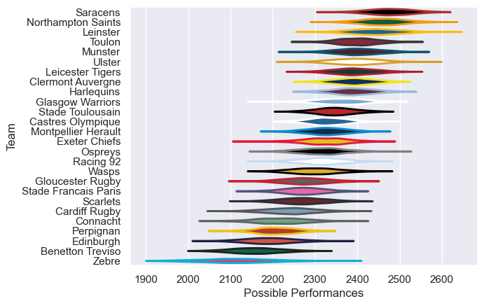

---  
title: "European Rugby Champions Cup 13/14 Status"  
date: 2025-07-28 6:00:00 -0500  
categories: model review projection  
layout: article  
aside:  
    toc: true  
---
# Current Team Rankings

# Standings

## Current Standings

| Club                 |   Played |   Wins |   Point Differential |   Losing Bonus Points |   Try Bonus Points |   Competition Points |
|:---------------------|---------:|-------:|---------------------:|----------------------:|-------------------:|---------------------:|
| Saracens             |       10 |      6 |                  185 |                     1 |                  4 |                   33 |
| Toulon               |        8 |      7 |                   89 |                     1 |                  2 |                   31 |
| Munster              |        8 |      6 |                  100 |                     1 |                  3 |                   28 |
| Ulster               |        7 |      6 |                  115 |                     1 |                  2 |                   27 |
| Clermont Auvergne    |        8 |      6 |                   36 |                     1 |                  2 |                   27 |
| Stade Toulousain     |        7 |      5 |                   56 |                     1 |                  2 |                   23 |
| Leinster             |        7 |      5 |                   71 |                     0 |                  1 |                   21 |
| Leicester Tigers     |        7 |      4 |                   41 |                     3 |                  2 |                   21 |
| Northampton Saints   |        6 |      4 |                    3 |                     1 |                    |                   17 |
| Harlequins           |        6 |      3 |                   23 |                     3 |                  1 |                   16 |
| Gloucester Rugby     |        6 |      3 |                   -1 |                     1 |                  1 |                   14 |
| Cardiff Rugby        |        6 |      3 |                  -29 |                     1 |                  1 |                   14 |
| Connacht             |        6 |      3 |                  -46 |                     1 |                    |                   13 |
| Exeter Chiefs        |        6 |      2 |                   -5 |                     3 |                  1 |                   12 |
| Edinburgh            |        6 |      3 |                  -37 |                     0 |                    |                   12 |
| Montpellier Herault  |        6 |      2 |                   -3 |                     1 |                  2 |                   11 |
| Scarlets             |        6 |      2 |                  -28 |                     1 |                    |                   11 |
| Glasgow Warriors     |        6 |      2 |                  -32 |                     2 |                  1 |                   11 |
| Castres Olympique    |        6 |      2 |                  -26 |                     1 |                    |                    9 |
| Wasps                |        2 |      2 |                   15 |                     0 |                    |                    8 |
| Perpignan            |        6 |      1 |                  -46 |                     2 |                  1 |                    7 |
| Racing 92            |        6 |      1 |                  -65 |                     1 |                    |                    7 |
| Ospreys              |        6 |      1 |                  -63 |                     1 |                    |                    5 |
| Stade Francais Paris |        2 |      0 |                  -15 |                     1 |                  1 |                    2 |
| Benetton Treviso     |        6 |      0 |                 -161 |                     0 |                    |                    0 |
| Zebre                |        6 |      0 |                 -177 |                     0 |                    |                    0 |

# Completed Match Review

| Model | Percent Correct Predictions | Spread Error |
| ------ | ------ | ------ |
| Club Level | 61.7% | 11.5 |
| Player Level: Lineup | nan% | nan |
| Player Level: Minutes | nan% | nan |

