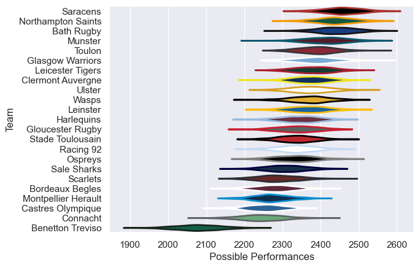

---  
title: "European Rugby Champions Cup 14/15 Status"  
date: 2025-07-28 6:00:00 -0500  
categories: model review projection  
layout: article  
aside:  
    toc: true  
---
# Current Team Rankings

# Standings

## Current Standings

| Club                |   Played |   Wins |   Point Differential |   Losing Bonus Points |   Try Bonus Points |   Competition Points |
|:--------------------|---------:|-------:|---------------------:|----------------------:|-------------------:|---------------------:|
| Clermont Auvergne   |       10 |      7 |                   96 |                     1 |                  2 |                   35 |
| Toulon              |        8 |      7 |                  111 |                     1 |                  1 |                   30 |
| Racing 92           |        7 |      5 |                   98 |                     1 |                  2 |                   25 |
| Leinster            |        8 |      5 |                   45 |                     2 |                  1 |                   25 |
| Saracens            |        8 |      5 |                   21 |                     1 |                  1 |                   22 |
| Bath Rugby          |        7 |      4 |                   35 |                     2 |                  2 |                   20 |
| Northampton Saints  |        7 |      4 |                   64 |                     0 |                  3 |                   19 |
| Harlequins          |        6 |      4 |                   36 |                     1 |                  1 |                   18 |
| Wasps               |        7 |      3 |                   36 |                     2 |                  1 |                   17 |
| Stade Toulousain    |        6 |      4 |                    2 |                     1 |                    |                   17 |
| Munster             |        6 |      3 |                   30 |                     2 |                  1 |                   15 |
| Glasgow Warriors    |        6 |      3 |                   24 |                     2 |                  1 |                   15 |
| Leicester Tigers    |        6 |      3 |                  -18 |                     0 |                  1 |                   13 |
| Ulster              |        6 |      2 |                  -30 |                     1 |                  3 |                   12 |
| Ospreys             |        6 |      1 |                  -11 |                     2 |                  1 |                    9 |
| Scarlets            |        6 |      2 |                  -44 |                     0 |                    |                    8 |
| Montpellier Herault |        6 |      1 |                  -64 |                     2 |                    |                    6 |
| Gloucester Rugby    |        2 |      1 |                    7 |                     1 |                    |                    5 |
| Bordeaux Begles     |        1 |      1 |                    1 |                     0 |                    |                    4 |
| Benetton Treviso    |        6 |      1 |                 -184 |                     0 |                    |                    4 |
| Sale Sharks         |        6 |      0 |                 -114 |                     2 |                    |                    2 |
| Castres Olympique   |        6 |      0 |                 -133 |                     1 |                    |                    1 |
| Connacht            |        1 |      0 |                   -8 |                     0 |                    |                    0 |

# Completed Match Review

| Model | Percent Correct Predictions | Spread Error |
| ------ | ------ | ------ |
| Club Level | 68.1% | 11.6 |
| Player Level: Lineup | nan% | nan |
| Player Level: Minutes | nan% | nan |

