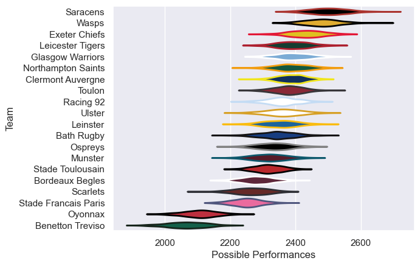

---  
title: "European Rugby Champions Cup 15/16 Status"  
date: 2025-07-28 6:00:00 -0500  
categories: model review projection  
layout: article  
aside:  
    toc: true  
---
# Current Team Rankings

# Standings

## Current Standings

| Club                 |   Played |   Wins |   Point Differential |   Losing Bonus Points |   Try Bonus Points |   Competition Points |
|:---------------------|---------:|-------:|---------------------:|----------------------:|-------------------:|---------------------:|
| Saracens             |        8 |      8 |                  163 |                     0 |                  4 |                   36 |
| Racing 92            |       10 |      6 |                  110 |                     0 |                  4 |                   34 |
| Leicester Tigers     |        8 |      6 |                  119 |                     1 |                  4 |                   29 |
| Wasps                |        8 |      5 |                  108 |                     3 |                  2 |                   25 |
| Toulon               |        7 |      5 |                    2 |                     1 |                    |                   21 |
| Stade Francais Paris |        7 |      4 |                   40 |                     0 |                  3 |                   19 |
| Northampton Saints   |        7 |      4 |                   -8 |                     0 |                  1 |                   19 |
| Ulster               |        6 |      4 |                   60 |                     0 |                  2 |                   18 |
| Exeter Chiefs        |        7 |      3 |                   -4 |                     2 |                  3 |                   17 |
| Ospreys              |        6 |      3 |                   -4 |                     2 |                  2 |                   16 |
| Bordeaux Begles      |        6 |      3 |                  -14 |                     1 |                  3 |                   16 |
| Clermont Auvergne    |        6 |      3 |                   21 |                     0 |                  3 |                   15 |
| Munster              |        6 |      3 |                   18 |                     0 |                  3 |                   15 |
| Glasgow Warriors     |        6 |      3 |                   18 |                     1 |                  1 |                   14 |
| Bath Rugby           |        6 |      2 |                  -43 |                     2 |                    |                   10 |
| Oyonnax              |        6 |      1 |                 -119 |                     2 |                  1 |                    7 |
| Leinster             |        6 |      1 |                  -76 |                     2 |                    |                    6 |
| Stade Toulousain     |        6 |      1 |                  -88 |                     1 |                    |                    5 |
| Scarlets             |        6 |      0 |                 -123 |                     2 |                    |                    2 |
| Benetton Treviso     |        6 |      0 |                 -180 |                     0 |                    |                    0 |

# Completed Match Review

| Model | Percent Correct Predictions | Spread Error |
| ------ | ------ | ------ |
| Club Level | 70.1% | 13.2 |
| Player Level: Lineup | nan% | nan |
| Player Level: Minutes | nan% | nan |

