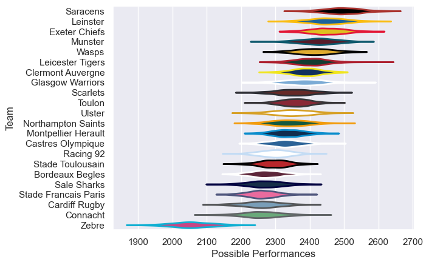

---  
title: "European Rugby Champions Cup 16/17 Status"  
date: 2025-07-28 6:00:00 -0500  
categories: model review projection  
layout: article  
aside:  
    toc: true  
---
# Current Team Rankings

# Standings

## Current Standings

| Club                 |   Played |   Wins |   Point Differential |   Losing Bonus Points |   Try Bonus Points |   Competition Points |
|:---------------------|---------:|-------:|---------------------:|----------------------:|-------------------:|---------------------:|
| Saracens             |        9 |      8 |                  146 |                     0 |                  3 |                   37 |
| Clermont Auvergne    |        9 |      7 |                   94 |                     1 |                  5 |                   34 |
| Leinster             |        8 |      5 |                  150 |                     2 |                  5 |                   29 |
| Munster              |        8 |      6 |                  105 |                     1 |                  3 |                   28 |
| Wasps                |        7 |      4 |                   83 |                     1 |                  3 |                   22 |
| Connacht             |        7 |      4 |                   64 |                     1 |                  2 |                   19 |
| Glasgow Warriors     |        7 |      4 |                   49 |                     1 |                  2 |                   19 |
| Stade Toulousain     |        7 |      3 |                   48 |                     2 |                  2 |                   18 |
| Northampton Saints   |        8 |      4 |                 -101 |                     0 |                  1 |                   17 |
| Toulon               |        7 |      3 |                    0 |                     2 |                  2 |                   16 |
| Montpellier Herault  |        6 |      3 |                  -29 |                     2 |                  2 |                   16 |
| Bordeaux Begles      |        6 |      3 |                   -2 |                     1 |                  1 |                   14 |
| Castres Olympique    |        6 |      2 |                   -3 |                     1 |                  1 |                   12 |
| Exeter Chiefs        |        6 |      2 |                  -36 |                     2 |                  2 |                   12 |
| Scarlets             |        6 |      2 |                  -13 |                     1 |                    |                   11 |
| Ulster               |        6 |      2 |                  -42 |                     1 |                  1 |                   10 |
| Leicester Tigers     |        6 |      2 |                 -129 |                     0 |                    |                    8 |
| Stade Francais Paris |        2 |      1 |                   24 |                     1 |                    |                    5 |
| Racing 92            |        6 |      1 |                  -41 |                     0 |                  1 |                    5 |
| Sale Sharks          |        6 |      1 |                 -101 |                     0 |                    |                    4 |
| Cardiff Rugby        |        1 |      0 |                  -25 |                     0 |                    |                    0 |
| Zebre                |        6 |      0 |                 -241 |                     0 |                    |                    0 |

# Completed Match Review

| Model | Percent Correct Predictions | Spread Error |
| ------ | ------ | ------ |
| Club Level | 75.7% | 12.8 |
| Player Level: Lineup | nan% | nan |
| Player Level: Minutes | nan% | nan |

