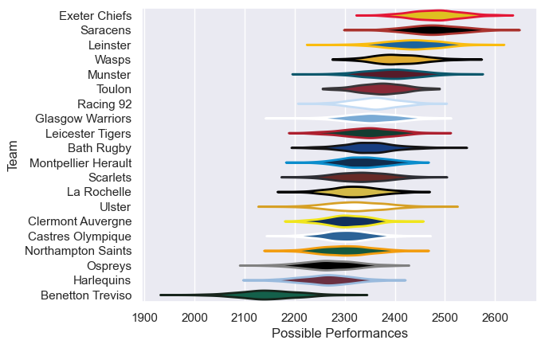

---  
title: "European Rugby Champions Cup 17/18 Status"  
date: 2025-07-28 6:00:00 -0500  
categories: model review projection  
layout: article  
aside:  
    toc: true  
---
# Current Team Rankings

# Standings

## Current Standings

| Club                |   Played |   Wins |   Point Differential |   Losing Bonus Points |   Try Bonus Points |   Competition Points |
|:--------------------|---------:|-------:|---------------------:|----------------------:|-------------------:|---------------------:|
| Leinster            |        9 |      9 |                  119 |                     0 |                  4 |                   40 |
| Racing 92           |        9 |      6 |                   36 |                     3 |                  1 |                   28 |
| Munster             |        8 |      5 |                   76 |                     2 |                  2 |                   26 |
| Scarlets            |        8 |      5 |                   29 |                     2 |                  3 |                   25 |
| Clermont Auvergne   |        7 |      5 |                   50 |                     0 |                  2 |                   22 |
| Ulster              |        7 |      5 |                   32 |                     0 |                  2 |                   22 |
| Toulon              |        7 |      4 |                   33 |                     3 |                  1 |                   20 |
| La Rochelle         |        7 |      4 |                   23 |                     1 |                  3 |                   20 |
| Saracens            |        7 |      3 |                   48 |                     1 |                  3 |                   18 |
| Bath Rugby          |        6 |      4 |                   32 |                     1 |                  1 |                   18 |
| Wasps               |        6 |      3 |                   33 |                     1 |                  4 |                   17 |
| Exeter Chiefs       |        6 |      3 |                   21 |                     2 |                  1 |                   15 |
| Ospreys             |        7 |      2 |                  -14 |                     2 |                  3 |                   15 |
| Montpellier Herault |        6 |      2 |                  -33 |                     2 |                  2 |                   12 |
| Castres Olympique   |        6 |      2 |                  -50 |                     0 |                  2 |                   12 |
| Leicester Tigers    |        6 |      1 |                  -53 |                     2 |                  1 |                    7 |
| Harlequins          |        6 |      1 |                  -82 |                     1 |                  2 |                    7 |
| Glasgow Warriors    |        6 |      1 |                  -71 |                     1 |                  1 |                    6 |
| Northampton Saints  |        6 |      1 |                 -124 |                     0 |                  2 |                    6 |
| Benetton Treviso    |        6 |      0 |                 -105 |                     2 |                  2 |                    4 |

# Completed Match Review

| Model | Percent Correct Predictions | Spread Error |
| ------ | ------ | ------ |
| Club Level | 70.1% | 11.9 |
| Player Level: Lineup | nan% | nan |
| Player Level: Minutes | nan% | nan |

