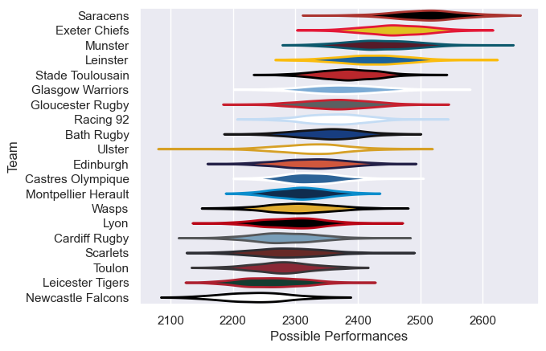

---  
title: "European Rugby Champions Cup 18/19 Status"  
date: 2025-07-28 6:00:00 -0500  
categories: model review projection  
layout: article  
aside:  
    toc: true  
---
# Current Team Rankings

# Standings

## Current Standings

| Club                |   Played |   Wins |   Point Differential |   Losing Bonus Points |   Try Bonus Points |   Competition Points |
|:--------------------|---------:|-------:|---------------------:|----------------------:|-------------------:|---------------------:|
| Saracens            |        8 |      8 |                  149 |                     0 |                  5 |                   37 |
| Leinster            |       10 |      7 |                  137 |                     1 |                  4 |                   37 |
| Racing 92           |        7 |      5 |                   74 |                     2 |                  5 |                   27 |
| Munster             |        8 |      5 |                   54 |                     1 |                  2 |                   25 |
| Stade Toulousain    |        8 |      6 |                   -4 |                     0 |                  1 |                   25 |
| Edinburgh           |        7 |      5 |                   67 |                     2 |                  1 |                   23 |
| Ulster              |        7 |      5 |                    0 |                     1 |                  2 |                   23 |
| Glasgow Warriors    |        7 |      4 |                   -1 |                     0 |                  3 |                   19 |
| Montpellier Herault |        6 |      3 |                   42 |                     1 |                  3 |                   16 |
| Exeter Chiefs       |        6 |      2 |                   20 |                     2 |                  2 |                   14 |
| Castres Olympique   |        6 |      3 |                  -45 |                     1 |                  1 |                   14 |
| Cardiff Rugby       |        6 |      2 |                  -36 |                     0 |                  2 |                   10 |
| Bath Rugby          |        6 |      1 |                  -37 |                     3 |                  1 |                   10 |
| Gloucester Rugby    |        6 |      2 |                  -41 |                     1 |                    |                    9 |
| Toulon              |        6 |      2 |                  -46 |                     1 |                    |                    9 |
| Newcastle Falcons   |        6 |      2 |                  -67 |                     1 |                    |                    9 |
| Scarlets            |        6 |      1 |                  -25 |                     2 |                  1 |                    7 |
| Leicester Tigers    |        6 |      1 |                  -53 |                     1 |                  2 |                    7 |
| Wasps               |        6 |      0 |                  -92 |                     1 |                  1 |                    4 |
| Lyon                |        6 |      0 |                  -96 |                     0 |                    |                    0 |

# Completed Match Review

| Model | Percent Correct Predictions | Spread Error |
| ------ | ------ | ------ |
| Club Level | 67.2% | 10.2 |
| Player Level: Lineup | nan% | nan |
| Player Level: Minutes | nan% | nan |

