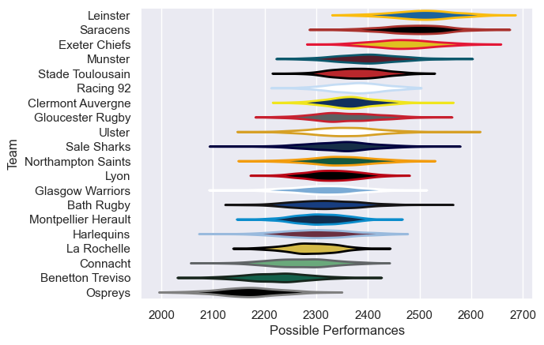

---  
title: "European Rugby Champions Cup 19/20 Status"  
date: 2025-07-28 6:00:00 -0500  
categories: model review projection  
layout: article  
aside:  
    toc: true  
---
# Current Team Rankings

# Standings

## Current Standings

| Club                |   Played |   Wins |   Point Differential |   Losing Bonus Points |   Try Bonus Points |   Competition Points |
|:--------------------|---------:|-------:|---------------------:|----------------------:|-------------------:|---------------------:|
| Leinster            |        6 |      6 |                  123 |                     0 |                  4 |                   28 |
| Exeter Chiefs       |        6 |      5 |                   81 |                     0 |                  5 |                   27 |
| Stade Toulousain    |        6 |      6 |                   77 |                     0 |                  3 |                   27 |
| Clermont Auvergne   |        6 |      5 |                   93 |                     1 |                  3 |                   24 |
| Racing 92           |        6 |      4 |                   68 |                     1 |                  4 |                   23 |
| Ulster              |        6 |      5 |                   22 |                     0 |                  1 |                   21 |
| Northampton Saints  |        6 |      4 |                  -17 |                     0 |                  3 |                   19 |
| Saracens            |        6 |      4 |                   33 |                     1 |                  1 |                   18 |
| Glasgow Warriors    |        6 |      3 |                   26 |                     1 |                  2 |                   17 |
| Munster             |        6 |      3 |                   27 |                     0 |                  2 |                   16 |
| Gloucester Rugby    |        6 |      2 |                    0 |                     3 |                  3 |                   14 |
| Connacht            |        6 |      2 |                  -38 |                     1 |                  1 |                   10 |
| La Rochelle         |        6 |      2 |                  -39 |                     1 |                  1 |                   10 |
| Montpellier Herault |        6 |      2 |                  -39 |                     1 |                  1 |                   10 |
| Harlequins          |        6 |      2 |                  -52 |                     2 |                    |                   10 |
| Lyon                |        6 |      1 |                  -33 |                     2 |                  1 |                    7 |
| Sale Sharks         |        6 |      1 |                  -68 |                     3 |                    |                    7 |
| Benetton Treviso    |        6 |      1 |                  -73 |                     1 |                  1 |                    6 |
| Bath Rugby          |        6 |      0 |                  -63 |                     4 |                  1 |                    5 |
| Ospreys             |        6 |      0 |                 -128 |                     1 |                  1 |                    2 |

# Completed Match Review

| Model | Percent Correct Predictions | Spread Error |
| ------ | ------ | ------ |
| Club Level | 68.3% | 10.0 |
| Player Level: Lineup | nan% | nan |
| Player Level: Minutes | nan% | nan |

