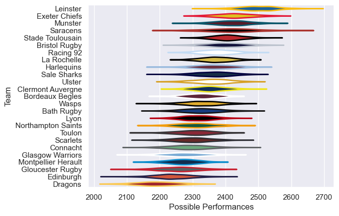

---  
title: "European Rugby Champions Cup 20/21 Status"  
date: 2025-07-28 6:00:00 -0500  
categories: model review projection  
layout: article  
aside:  
    toc: true  
---
# Current Team Rankings

# Standings

## Current Standings

| Club                |   Played |   Wins |   Point Differential |   Losing Bonus Points |   Try Bonus Points |   Competition Points |
|:--------------------|---------:|-------:|---------------------:|----------------------:|-------------------:|---------------------:|
| Stade Toulousain    |        7 |      6 |                   58 |                     0 |                  1 |                   25 |
| Racing 92           |        7 |      5 |                  105 |                     2 |                  1 |                   23 |
| Exeter Chiefs       |        6 |      5 |                   89 |                     0 |                  3 |                   23 |
| La Rochelle         |        5 |      4 |                   44 |                     1 |                    |                   17 |
| Bordeaux Begles     |        5 |      4 |                   53 |                     0 |                    |                   16 |
| Leinster            |        5 |      3 |                   32 |                     0 |                    |                   12 |
| Wasps               |        3 |      2 |                   33 |                     1 |                    |                    9 |
| Munster             |        3 |      2 |                   15 |                     1 |                    |                    9 |
| Clermont Auvergne   |        5 |      2 |                  -11 |                     0 |                  1 |                    9 |
| Sale Sharks         |        4 |      1 |                    6 |                     1 |                    |                    5 |
| Saracens            |        2 |      1 |                    4 |                     1 |                    |                    5 |
| Edinburgh           |        3 |      1 |                  -57 |                     1 |                    |                    5 |
| Lyon                |        2 |      1 |                   23 |                     0 |                    |                    4 |
| Toulon              |        1 |      1 |                   12 |                     0 |                    |                    4 |
| Bristol Rugby       |        3 |      1 |                  -23 |                     0 |                    |                    4 |
| Scarlets            |        2 |      1 |                  -39 |                     0 |                    |                    4 |
| Gloucester Rugby    |        3 |      1 |                  -52 |                     0 |                    |                    4 |
| Ulster              |        3 |      0 |                  -39 |                     2 |                    |                    2 |
| Bath Rugby          |        1 |      0 |                   -4 |                     1 |                    |                    1 |
| Connacht            |        2 |      0 |                  -13 |                     1 |                    |                    1 |
| Northampton Saints  |        3 |      0 |                  -43 |                     1 |                    |                    1 |
| Montpellier Herault |        2 |      0 |                  -40 |                     0 |                    |                    0 |
| Glasgow Warriors    |        1 |      0 |                  -42 |                     0 |                    |                    0 |
| Dragons             |        2 |      0 |                  -55 |                     0 |                    |                    0 |
| Harlequins          |        2 |      0 |                  -56 |                     0 |                    |                    0 |

# Completed Match Review

| Model | Percent Correct Predictions | Spread Error |
| ------ | ------ | ------ |
| Club Level | 58.5% | 13.5 |
| Player Level: Lineup | nan% | nan |
| Player Level: Minutes | nan% | nan |

