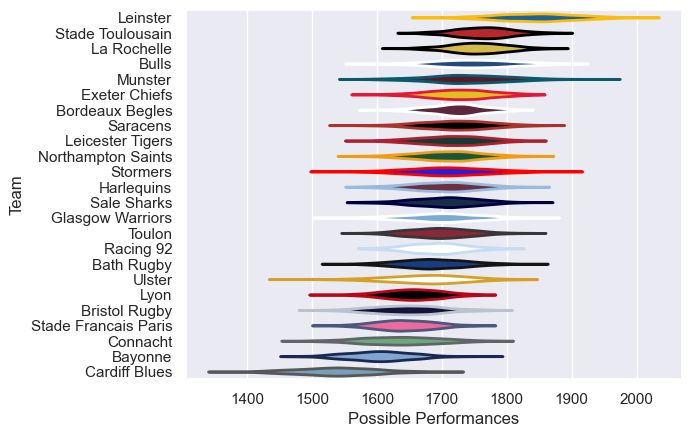
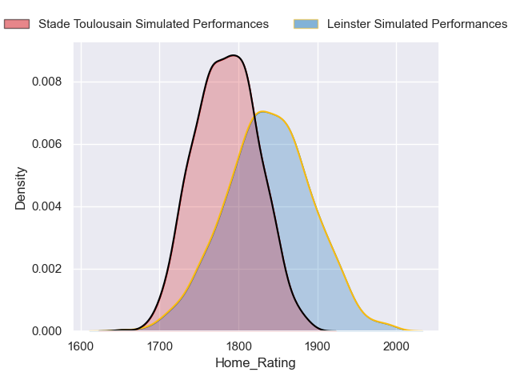
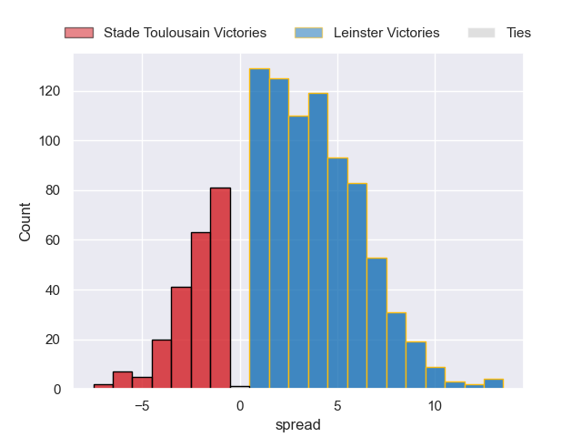

---  
title: "European Rugby Champions Cup 2023 Status"  
date: 2024-05-24 6:00:00 -0500  
categories: model review projection  
layout: article  
aside:  
    toc: true  
---
# Current Team Rankings

# Knockout Match Predictions

## finals

### Leinster V Stade Toulousain on 2024/05/25

Average Margin: Leinster by 2.7

# Completed Match Review

| Match                                                 |   Result |   Lineup Prediction |   Minutes Prediction |   Club Prediction |
|:------------------------------------------------------|---------:|--------------------:|---------------------:|------------------:|
| Connacht V Bordeaux Begles on 2023/12/08              |      -36 |                -2.4 |                 -0.7 |               3.1 |
| Glasgow Warriors V Northampton Saints on 2023/12/08   |       -9 |                 3.1 |                  4.7 |               7.7 |
| Toulon V Exeter Chiefs on 2023/12/09                  |       -1 |                 3.4 |                  2.7 |               3.5 |
| Bath Rugby V Ulster on 2023/12/09                     |       23 |                 5.9 |                  5.5 |               1.1 |
| Stade Toulousain V Cardiff Blues on 2023/12/09        |       45 |                20.4 |                 18.3 |              12.7 |
| Munster V Bayonne on 2023/12/09                       |        0 |                14.7 |                 13.2 |              12.6 |
| Bulls V Saracens on 2023/12/09                        |       11 |                -8.2 |                 -8   |               2.7 |
| Bristol Rugby V Lyon on 2023/12/09                    |        2 |                 9.9 |                  8.1 |               3.3 |
| Sale Sharks V Stade Francais Paris on 2023/12/10      |       23 |                 7.1 |                  5.8 |               8.5 |
| La Rochelle V Leinster on 2023/12/10                  |       -7 |                -5.8 |                 -4.8 |              -0.6 |
| Leicester Tigers V Stormers on 2023/12/10             |        9 |                 0.8 |                  2.8 |               4.3 |
| Racing 92 V Harlequins on 2023/12/10                  |       -3 |                 2.9 |                  3.2 |               5.4 |
| Bayonne V Glasgow Warriors on 2023/12/15              |       -1 |                -3.8 |                 -2.3 |              -1.6 |
| Northampton Saints V Toulon on 2023/12/15             |        3 |                -3.1 |                 -2.5 |               2   |
| Saracens V Connacht on 2023/12/16                     |       19 |                16.2 |                 13.3 |               9.2 |
| Stormers V La Rochelle on 2023/12/16                  |        1 |                -0   |                  0.1 |               3.2 |
| Bordeaux Begles V Bristol Rugby on 2023/12/16         |       19 |                11.7 |                 10   |               6.5 |
| Leinster V Sale Sharks on 2023/12/16                  |       10 |                15   |                 14.6 |              10.2 |
| Lyon V Bulls on 2023/12/16                            |        1 |                -8.9 |                 -8.3 |               2.3 |
| Cardiff Blues V Bath Rugby on 2023/12/16              |       -7 |               -10.2 |                 -8   |               1.1 |
| Ulster V Racing 92 on 2023/12/16                      |       16 |               -11.5 |                 -9.9 |               5.5 |
| Exeter Chiefs V Munster on 2023/12/17                 |        8 |                -9.5 |                 -9.5 |               2.8 |
| Harlequins V Stade Toulousain on 2023/12/17           |      -28 |                -9.2 |                 -8.8 |               1.3 |
| Stade Francais Paris V Leicester Tigers on 2023/12/17 |       -3 |                 0.9 |                  0.6 |               1.5 |
| Northampton Saints V Bayonne on 2024/01/12            |       47 |                11   |                  9.3 |               8.7 |
| Lyon V Connacht on 2024/01/13                         |       14 |                -1.6 |                 -0.9 |               5.4 |
| Leinster V Stade Francais Paris on 2024/01/13         |       36 |                26.5 |                 25   |              14.7 |
| Stormers V Sale Sharks on 2024/01/13                  |        7 |                 4.7 |                  4.7 |               3.5 |
| Exeter Chiefs V Glasgow Warriors on 2024/01/13        |        2 |                 1.6 |                 -0.6 |               6.7 |
| Cardiff Blues V Harlequins on 2024/01/13              |      -39 |                -6.1 |                 -4   |              -1.7 |
| Ulster V Stade Toulousain on 2024/01/13               |      -24 |               -29.8 |                -27.9 |               1.7 |
| Bristol Rugby V Bulls on 2024/01/13                   |      -14 |                -6.9 |                 -5.2 |              -0.1 |
| Toulon V Munster on 2024/01/13                        |      -11 |                 3.1 |                  2.4 |               3.1 |
| La Rochelle V Leicester Tigers on 2024/01/14          |       33 |                 9.3 |                  7.4 |               5.8 |
| Bordeaux Begles V Saracens on 2024/01/14              |       40 |                 8.8 |                  7.3 |               3.6 |
| Bath Rugby V Racing 92 on 2024/01/14                  |        4 |                 2   |                  1.6 |               4   |
| Connacht V Bristol Rugby on 2024/01/19                |       17 |                -0.9 |                 -0.7 |               4.2 |
| Glasgow Warriors V Toulon on 2024/01/19               |       24 |                11   |                  9.9 |               3.7 |
| Harlequins V Ulster on 2024/01/20                     |       28 |                15.4 |                 13.3 |               4   |
| Leicester Tigers V Leinster on 2024/01/20             |      -17 |               -16.8 |                -16.5 |              -2.3 |
| Racing 92 V Cardiff Blues on 2024/01/20               |       22 |                14.5 |                 12.7 |              11.2 |
| Munster V Northampton Saints on 2024/01/20            |       -3 |                -2.3 |                 -3   |               6.9 |
| Stade Francais Paris V Stormers on 2024/01/20         |       -4 |               -11.3 |                 -9.8 |               2.1 |
| Bulls V Bordeaux Begles on 2024/01/20                 |        6 |                -4.3 |                 -3.8 |               5.2 |
| Saracens V Lyon on 2024/01/20                         |       15 |                19.7 |                 20   |               8.7 |
| Sale Sharks V La Rochelle on 2024/01/21               |      -13 |                -8.9 |                 -5.1 |               3.2 |
| Stade Toulousain V Bath Rugby on 2024/01/21           |       12 |                 8.4 |                  6.3 |               7.9 |
| Bayonne V Exeter Chiefs on 2024/01/21                 |       23 |               -12   |                -10.1 |              -2.2 |
| Harlequins V Glasgow Warriors on 2024/04/05           |        4 |                -5.3 |                 -3.4 |               2.9 |
| Bulls V Lyon on 2024/04/06                            |       40 |                16.2 |                 13.4 |               9.8 |
| Exeter Chiefs V Bath Rugby on 2024/04/06              |        6 |                -9.1 |                 -5.9 |               4.8 |
| Stormers V La Rochelle on 2024/04/06                  |       -1 |                -8.2 |                 -8.1 |               2.5 |
| Bordeaux Begles V Saracens on 2024/04/06              |       33 |                -5.3 |                 -4.2 |               2.3 |
| Leinster V Leicester Tigers on 2024/04/06             |       14 |                26.1 |                 24.2 |              13.2 |
| Northampton Saints V Munster on 2024/04/07            |       10 |                -0.6 |                 -0.3 |               3   |
| Stade Toulousain V Racing 92 on 2024/04/07            |       24 |                18   |                 15.9 |               9.7 |
| Bordeaux Begles V Harlequins on 2024/04/13            |       -1 |                 7.4 |                  6.1 |               4.4 |
| Leinster V La Rochelle on 2024/04/13                  |       27 |                 4.3 |                  5.8 |              10.6 |
| Northampton Saints V Bulls on 2024/04/13              |       37 |                 7.7 |                  7.5 |               1.8 |
| Stade Toulousain V Exeter Chiefs on 2024/04/14        |       38 |                16.5 |                 15.2 |               8.4 |
| Leinster V Northampton Saints on 2024/05/04           |        3 |                10.7 |                  9.3 |              10   |
| Stade Toulousain V Harlequins on 2024/05/05           |       12 |                 9.4 |                  9.6 |               8.2 |

# Model Accuracies

| Model | Percent Correct Predictions | Spread Error |
| ------ | ------ | ------ |
| Club Level | 74.2% | 13.3 |
| Player Level: Lineup | 65.1% | 12.6 |
| Player Level: Minutes | 66.1% | 12.8 |

