---  
title: "European Rugby Champions Cup 2023 Status"  
date: 2023-08-03 6:00:00 -0500  
categories: model review projection  
layout: article  
aside:  
    toc: true  
---
# Current Team Rankings

# Standings

## Projected Total Table

| Club                 |   Total Matches |   Wins |   Point Differential |   Losing Bonus Points |   Try Bonus Points |   Competition Points |
|:---------------------|----------------:|-------:|---------------------:|----------------------:|-------------------:|---------------------:|
| Leinster             |               4 |    3.4 |                 29.1 |                   0.6 |                3.3 |                 17.4 |
| Saracens             |               4 |    3.3 |                 21.6 |                   0.6 |                3.1 |                 17.1 |
| Ulster               |               4 |    2.9 |                 12   |                   1   |                2.7 |                 15.5 |
| Munster              |               4 |    2.9 |                 19.8 |                   1   |                2.7 |                 15.3 |
| Stade Toulousain     |               4 |    2.8 |                 21.7 |                   1   |                2.7 |                 15.1 |
| Exeter Chiefs        |               4 |    2.5 |                  6.1 |                   1.3 |                2.3 |                 13.6 |
| Glasgow Warriors     |               4 |    2.4 |                  3.9 |                   1.2 |                2.2 |                 13.1 |
| Stormers             |               4 |    2.3 |                  3.2 |                   1.5 |                2.1 |                 12.9 |
| Racing 92            |               4 |    2.3 |                  4   |                   1.2 |                2.1 |                 12.5 |
| Lyon                 |               4 |    2.1 |                  0.1 |                   1.2 |                2   |                 11.5 |
| La Rochelle          |               4 |    1.9 |                  0.1 |                   1.8 |                1.7 |                 11.3 |
| Toulon               |               4 |    1.9 |                 -0.6 |                   1.8 |                1.6 |                 11.2 |
| Bristol Rugby        |               4 |    1.8 |                 -1.7 |                   1.8 |                1.7 |                 10.8 |
| Leicester Tigers     |               4 |    1.9 |                 -2.3 |                   1.6 |                1.7 |                 10.8 |
| Sale Sharks          |               4 |    1.9 |                 -0.9 |                   1.2 |                1.8 |                 10.7 |
| Harlequins           |               4 |    1.8 |                 -2   |                   1.9 |                1.5 |                 10.7 |
| Bordeaux Begles      |               4 |    1.7 |                 -2.6 |                   1.9 |                1.5 |                 10.3 |
| Northampton Saints   |               4 |    1.7 |                 -3.6 |                   1.3 |                1.6 |                  9.9 |
| Bulls                |               4 |    1.6 |                 -5.3 |                   1.9 |                1.3 |                  9.5 |
| Connacht             |               4 |    1.5 |                -11.6 |                   1.3 |                1.3 |                  8.6 |
| Bath Rugby           |               4 |    1   |                -16.6 |                   1.7 |                0.8 |                  6.7 |
| Cardiff Blues        |               4 |    1.1 |                -19.1 |                   1.3 |                1   |                  6.6 |
| Stade Francais Paris |               4 |    0.5 |                -29.3 |                   1.5 |                0.5 |                  4.2 |
| Bayonne              |               4 |    0.5 |                -25.8 |                   1.7 |                0.4 |                  4   |

# Future Predictions

## Week 3

### Connacht V Bordeaux Begles on 2023/12/08

Average Margin: Connacht by 1.6

### Glasgow Warriors V Northampton Saints on 2023/12/08

Average Margin: Glasgow Warriors by 4.4

### Toulon V Exeter Chiefs on 2023/12/09

Average Margin: Toulon by 2.7

### Munster V Bayonne on 2023/12/09

Average Margin: Munster by 12.6

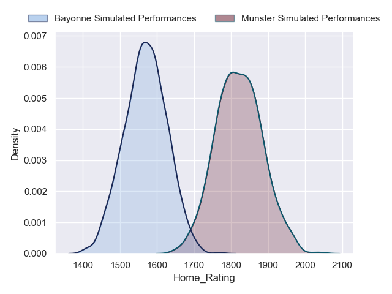

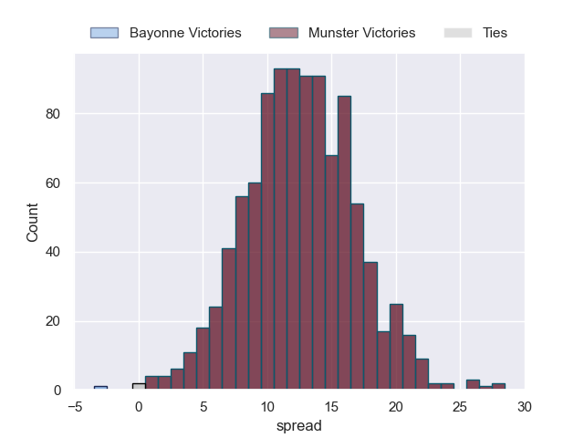

### Stade Toulousain V Cardiff Blues on 2023/12/09

Average Margin: Stade Toulousain by 12.4

### Bath Rugby V Ulster on 2023/12/09

Average Margin: Ulster by 3.4

### Bristol Rugby V Lyon on 2023/12/09

Average Margin: Bristol Rugby by 1.9

### Bulls V Saracens on 2023/12/09

Average Margin: Saracens by 1.8

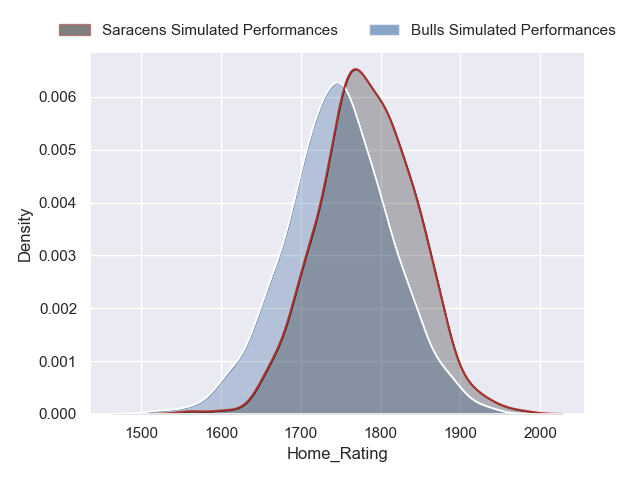

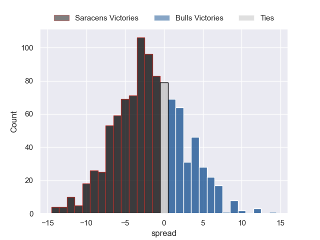

### Racing 92 V Harlequins on 2023/12/10

Average Margin: Racing 92 by 3.0

### La Rochelle V Leinster on 2023/12/10

Average Margin: Leinster by 1.5

### Leicester Tigers V Stormers on 2023/12/10

Average Margin: Leicester Tigers by 3.5

### Sale Sharks V Stade Francais Paris on 2023/12/10

Average Margin: Sale Sharks by 9.5

## Week 4

### Bayonne V Glasgow Warriors on 2023/12/15

Average Margin: Glasgow Warriors by 2.2

### Northampton Saints V Toulon on 2023/12/15

Average Margin: Northampton Saints by 1.3

### Lyon V Bulls on 2023/12/16

Average Margin: Lyon by 4.2

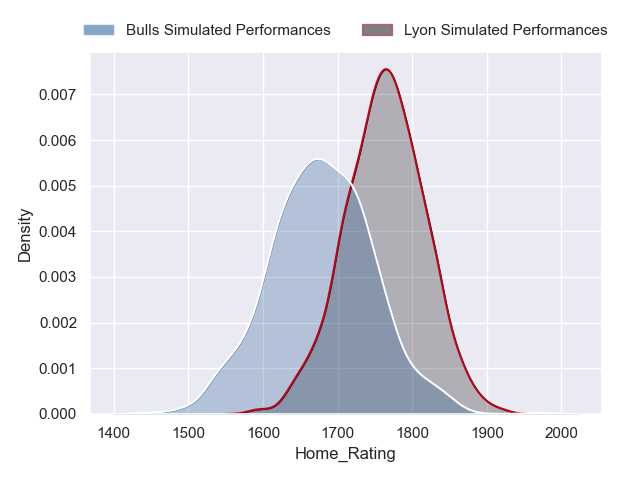

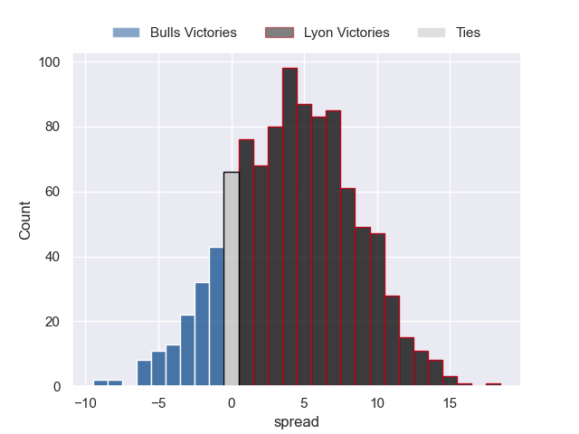

### Saracens V Connacht on 2023/12/16

Average Margin: Saracens by 10.3

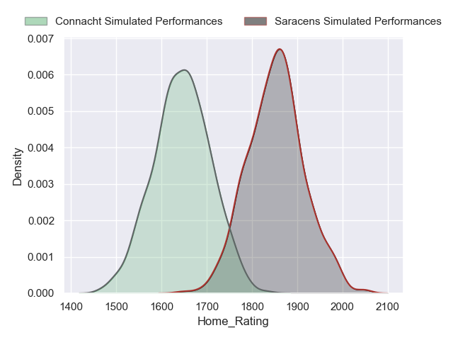

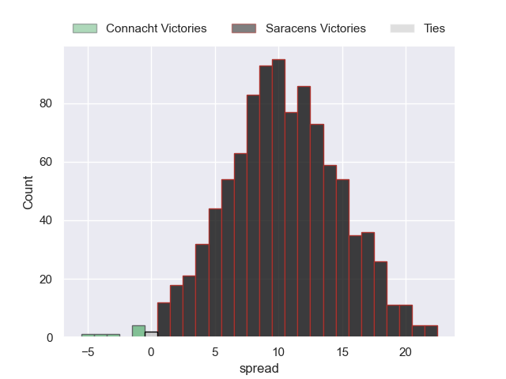

### Cardiff Blues V Bath Rugby on 2023/12/16

Average Margin: Cardiff Blues by 2.3

### Ulster V Racing 92 on 2023/12/16

Average Margin: Ulster by 6.9

### Leinster V Sale Sharks on 2023/12/16

Average Margin: Leinster by 9.5

### Stormers V La Rochelle on 2023/12/16

Average Margin: Stormers by 1.6

### Bordeaux Begles V Bristol Rugby on 2023/12/16

Average Margin: Bordeaux Begles by 4.0

### Exeter Chiefs V Munster on 2023/12/17

Average Margin: Exeter Chiefs by 0.6

### Stade Francais Paris V Leicester Tigers on 2023/12/17

Average Margin: Leicester Tigers by 2.3

### Harlequins V Stade Toulousain on 2023/12/17

Average Margin: Stade Toulousain by 0.8

## Week 1

### Northampton Saints V Bayonne on 2024/01/12

Average Margin: Northampton Saints by 7.8

### Toulon V Munster on 2024/01/13

Average Margin: Toulon by 0.3

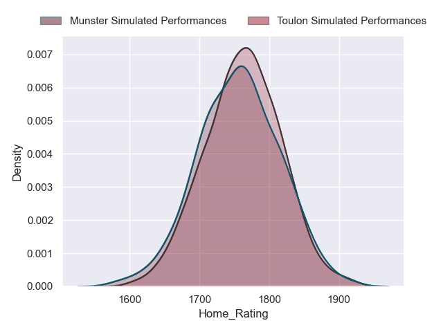

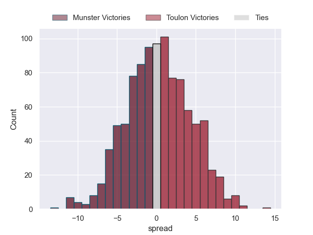

### Cardiff Blues V Harlequins on 2024/01/13

Average Margin: Harlequins by 1.4

### Ulster V Stade Toulousain on 2024/01/13

Average Margin: Ulster by 2.3

### Leinster V Stade Francais Paris on 2024/01/13

Average Margin: Leinster by 15.6

### Stormers V Sale Sharks on 2024/01/13

Average Margin: Stormers by 2.8

### Exeter Chiefs V Glasgow Warriors on 2024/01/13

Average Margin: Exeter Chiefs by 4.9

### Bristol Rugby V Bulls on 2024/01/13

Average Margin: Bristol Rugby by 2.7

### Lyon V Connacht on 2024/01/13

Average Margin: Lyon by 5.8

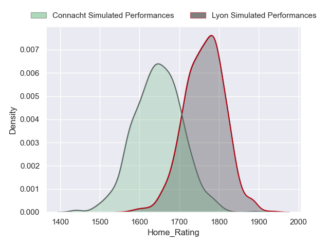

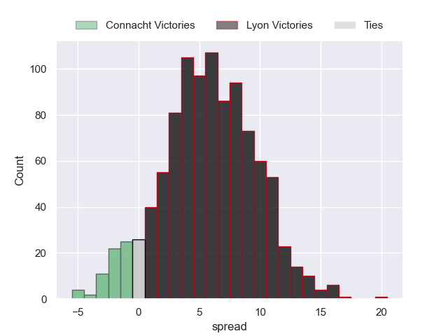

### Bath Rugby V Racing 92 on 2024/01/14

Average Margin: Racing 92 by 0.1

### Bordeaux Begles V Saracens on 2024/01/14

Average Margin: Saracens by 1.9

### La Rochelle V Leicester Tigers on 2024/01/14

Average Margin: La Rochelle by 5.2

## Week 2

### Glasgow Warriors V Toulon on 2024/01/19

Average Margin: Glasgow Warriors by 2.4

### Connacht V Bristol Rugby on 2024/01/19

Average Margin: Connacht by 2.5

### Munster V Northampton Saints on 2024/01/20

Average Margin: Munster by 8.5

### Saracens V Lyon on 2024/01/20

Average Margin: Saracens by 8.1

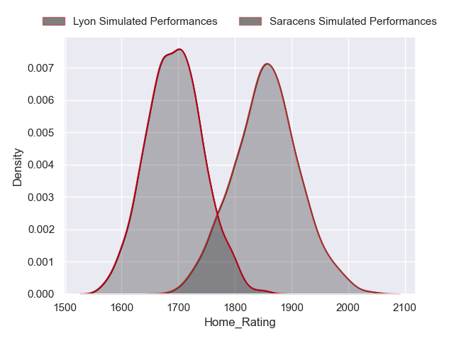

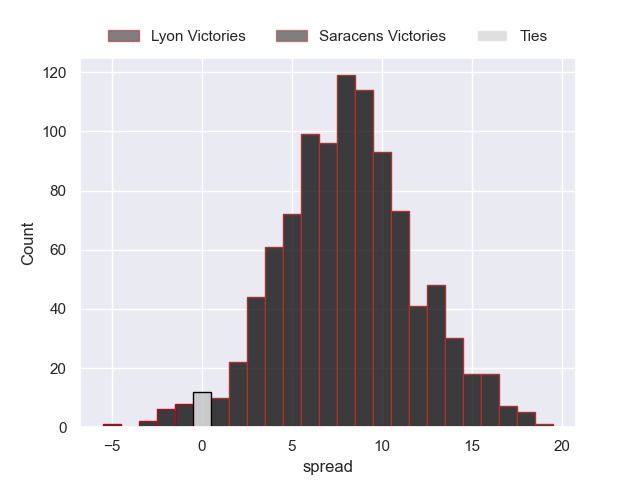

### Harlequins V Ulster on 2024/01/20

Average Margin: Harlequins by 0.2

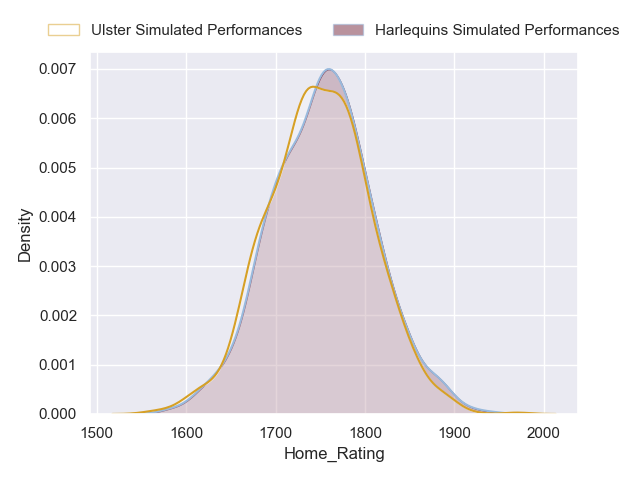

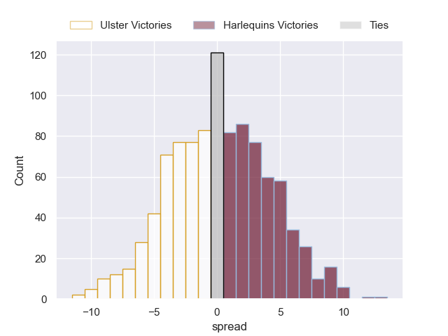

### Bulls V Bordeaux Begles on 2024/01/20

Average Margin: Bulls by 3.2

### Racing 92 V Cardiff Blues on 2024/01/20

Average Margin: Racing 92 by 8.0

### Stade Francais Paris V Stormers on 2024/01/20

Average Margin: Stormers by 2.4

### Leicester Tigers V Leinster on 2024/01/20

Average Margin: Leinster by 3.0

### Sale Sharks V La Rochelle on 2024/01/21

Average Margin: Sale Sharks by 2.0

### Bayonne V Exeter Chiefs on 2024/01/21

Average Margin: Exeter Chiefs by 3.6

### Stade Toulousain V Bath Rugby on 2024/01/21

Average Margin: Stade Toulousain by 11.4

