---  
title: "European Rugby Champions Cup 2024 Status"  
date: 2025-01-13 6:00:00 -0500  
categories: model review projection  
layout: article  
aside:  
    toc: true  
---
# Current Team Rankings

# Pool Results

## Pool A

## Current Standings

| Club             |   Played |   Wins |   Point Differential |   Losing Bonus Points |   Try Bonus Points |
|:-----------------|---------:|-------:|---------------------:|----------------------:|-------------------:|
| Bordeaux Begles  |        3 |      3 |                   87 |                     0 |                  3 |
| Stade Toulousain |        3 |      3 |                   95 |                     0 |                  2 |
| Leicester Tigers |        3 |      2 |                   53 |                     0 |                  3 |
| Sharks           |        3 |      1 |                  -33 |                     0 |                  1 |
| Ulster           |        3 |      0 |                  -89 |                     0 |                  0 |
| Exeter Chiefs    |        3 |      0 |                 -113 |                     0 |                  0 |

### Projected Total Table

| Club             |   Played |   Wins |   Point Differential |   Losing Bonus Points |   Try Bonus Points |   Competition Points |
|:-----------------|---------:|-------:|---------------------:|----------------------:|-------------------:|---------------------:|
| Bordeaux Begles  |        4 |    3.9 |              98.1623 |                   0.1 |                3.4 |                 19.1 |
| Stade Toulousain |        4 |    3.9 |             105.47   |                   0.1 |                2.3 |                 17.9 |
| Leicester Tigers |        4 |    2.1 |              42.5299 |                   0.2 |                3.1 |                 11.8 |
| Sharks           |        4 |    1.1 |             -44.1623 |                   0.2 |                1.3 |                  5.8 |
| Ulster           |        4 |    0.7 |             -84.6795 |                   0.2 |                0.3 |                  3.4 |
| Exeter Chiefs    |        4 |    0.3 |            -117.321  |                   0.4 |                0.2 |                  1.7 |

## Pool B

## Current Standings

| Club              |   Played |   Wins |   Point Differential |   Losing Bonus Points |   Try Bonus Points |
|:------------------|---------:|-------:|---------------------:|----------------------:|-------------------:|
| Leinster          |        3 |      3 |                   33 |                     0 |                  1 |
| La Rochelle       |        3 |      2 |                   30 |                     1 |                  1 |
| Bath Rugby        |        3 |      1 |                   14 |                     2 |                  1 |
| Benetton Treviso  |        3 |      1 |                  -33 |                     1 |                  2 |
| Clermont Auvergne |        3 |      1 |                    1 |                     0 |                  1 |
| Bristol Rugby     |        3 |      1 |                  -45 |                     0 |                  1 |

### Projected Total Table

| Club              |   Played |   Wins |   Point Differential |   Losing Bonus Points |   Try Bonus Points |   Competition Points |
|:------------------|---------:|-------:|---------------------:|----------------------:|-------------------:|---------------------:|
| Leinster          |        4 |    3.9 |             42.7179  |                   0.1 |                1.3 |                 16.9 |
| La Rochelle       |        4 |    2.7 |             32.8584  |                   1.2 |                1.4 |                 13.3 |
| Benetton Treviso  |        4 |    1.3 |            -35.8584  |                   1.4 |                2.2 |                  8.9 |
| Clermont Auvergne |        4 |    1.7 |              3.63412 |                   0.2 |                1.5 |                  8.4 |
| Bath Rugby        |        4 |    1.1 |              4.28209 |                   2.3 |                1.1 |                  7.9 |
| Bristol Rugby     |        4 |    1.3 |            -47.6341  |                   0.4 |                1.4 |                  7.2 |

## Pool C

## Current Standings

| Club                 |   Played |   Wins |   Point Differential |   Losing Bonus Points |   Try Bonus Points |
|:---------------------|---------:|-------:|---------------------:|----------------------:|-------------------:|
| Northampton Saints   |        3 |      2 |                   29 |                     0 |                  3 |
| Munster              |        3 |      2 |                   29 |                     1 |                  1 |
| Saracens             |        3 |      2 |                   28 |                     1 |                  1 |
| Castres Olympique    |        3 |      2 |                   11 |                     0 |                  1 |
| Stade Francais Paris |        3 |      1 |                  -27 |                     0 |                  1 |
| Bulls                |        3 |      0 |                  -70 |                     0 |                  0 |

### Projected Total Table

| Club                 |   Played |   Wins |   Point Differential |   Losing Bonus Points |   Try Bonus Points |   Competition Points |
|:---------------------|---------:|-------:|---------------------:|----------------------:|-------------------:|---------------------:|
| Northampton Saints   |        4 |    2.7 |             32.6328  |                   0.2 |                3.2 |                 14.3 |
| Saracens             |        4 |    2.9 |             37.0767  |                   1.1 |                1.2 |                 13.8 |
| Munster              |        4 |    2.3 |             25.3672  |                   1.4 |                1.3 |                 11.8 |
| Castres Olympique    |        4 |    2.1 |              1.92332 |                   0.3 |                1.2 |                 10   |
| Stade Francais Paris |        4 |    1.1 |            -37.2627  |                   0.3 |                1.2 |                  5.8 |
| Bulls                |        4 |    0.9 |            -59.7373  |                   0.1 |                0.4 |                  4.1 |

## Pool D

## Current Standings

| Club             |   Played |   Wins |   Point Differential |   Losing Bonus Points |   Try Bonus Points |
|:-----------------|---------:|-------:|---------------------:|----------------------:|-------------------:|
| Toulon           |        3 |      3 |                   23 |                     0 |                  1 |
| Glasgow Warriors |        3 |      2 |                   28 |                     1 |                  3 |
| Harlequins       |        3 |      1 |                   14 |                     0 |                  1 |
| Stormers         |        3 |      1 |                   -7 |                     0 |                  1 |
| Sale Sharks      |        3 |      1 |                  -37 |                     0 |                  1 |
| Racing 92        |        3 |      1 |                  -21 |                     0 |                  0 |

### Projected Total Table

| Club             |   Played |   Wins |   Point Differential |   Losing Bonus Points |   Try Bonus Points |   Competition Points |
|:-----------------|---------:|-------:|---------------------:|----------------------:|-------------------:|---------------------:|
| Toulon           |        4 |    3.4 |             21.7598  |                   0.4 |                1.2 |                 15.4 |
| Glasgow Warriors |        4 |    2.6 |             29.1366  |                   1.3 |                3.4 |                 15   |
| Sale Sharks      |        4 |    1.6 |            -35.7598  |                   0.3 |                1.1 |                  7.7 |
| Harlequins       |        4 |    1.4 |             12.8634  |                   0.4 |                1.2 |                  7.3 |
| Stormers         |        4 |    1.4 |             -9.57142 |                   0.4 |                1.2 |                  7.1 |
| Racing 92        |        4 |    1.6 |            -18.4286  |                   0.2 |                0.2 |                  7   |

# Projected Playoff Results

|                      | Reach Round of Sixteen   | Reach Quarterfinals   | Reach Semifinals   | Reach Final   | Win Final   |
|:---------------------|:-------------------------|:----------------------|:-------------------|:--------------|:------------|
| Leinster             | 88.8 %                   | 92.6 %                | 81.4 %             | 53.8 %        | 42.9 %      |
| Stade Toulousain     | 88.6 %                   | 89.2 %                | 77.8 %             | 55.9 %        | 31.1 %      |
| Bordeaux Begles      | 85.8 %                   | 89.7 %                | 75.5 %             | 53.6 %        | 15.4 %      |
| Glasgow Warriors     | 60.0 %                   | 84.8 %                | 44.8 %             | 12.6 %        | 4.4 %       |
| Toulon               | 53.1 %                   | 80.3 %                | 33.4 %             | 7.2 %         | 2.8 %       |
| Saracens             | 46.3 %                   | 76.5 %                | 22.8 %             | 4.8 %         | 0.9 %       |
| Northampton Saints   | 59.2 %                   | 65.3 %                | 24.5 %             | 4.6 %         | 0.9 %       |
| La Rochelle          | 39.2 %                   | 78.9 %                | 18.2 %             | 3.8 %         | 0.5 %       |
| Munster              | 72.1 %                   | 34.9 %                | 7.0 %              | 1.4 %         | 0.4 %       |
| Bath Rugby           | 37.0 %                   | 12.1 %                | 3.4 %              | 0.5 %         | 0.4 %       |
| Leicester Tigers     | 81.0 %                   | 23.1 %                | 4.1 %              | 1.1 %         | 0.2 %       |
| Castres Olympique    | 84.0 %                   | 16.6 %                | 1.6 %              | 0.3 %         | 0.1 %       |
| Clermont Auvergne    | 56.6 %                   | 9.1 %                 | 1.2 %              | 0.2 %         | 0.0 %       |
| Racing 92            | 45.9 %                   | 4.9 %                 | 0.5 %              | 0.1 %         | 0.0 %       |
| Bristol Rugby        | 25.8 %                   | 5.1 %                 | 0.4 %              | 0.1 %         | 0.0 %       |
| Sharks               | 90.7 %                   | 9.7 %                 | 1.0 %              | 0.0 %         | 0.0 %       |
| Harlequins           | 54.1 %                   | 6.6 %                 | 0.7 %              | 0.0 %         | 0.0 %       |
| Stormers             | 35.6 %                   | 5.9 %                 | 0.7 %              | 0.0 %         | 0.0 %       |
| Benetton Treviso     | 51.4 %                   | 8.5 %                 | 0.5 %              | 0.0 %         | 0.0 %       |
| Sale Sharks          | 43.8 %                   | 5.6 %                 | 0.5 %              | 0.0 %         | 0.0 %       |
| Stade Francais Paris | 0.5 %                    | 0.5 %                 | 0.0 %              | 0.0 %         | 0.0 %       |
| Ulster               | 0.5 %                    | 0.1 %                 | 0.0 %              | 0.0 %         | 0.0 %       |

# Pool Match Predictions

## Pool A

### Ulster V Exeter Chiefs on 2025/01/17

Average Margin: Ulster by 4.3

Average Scoreline: 27-23

### Bordeaux Begles V Sharks on 2025/01/19

Average Margin: Bordeaux Begles by 11.2

Average Scoreline: 31-20

### Stade Toulousain V Leicester Tigers on 2025/01/19

Average Margin: Stade Toulousain by 10.5

Average Scoreline: 29-19

## Pool B

### Benetton Treviso V La Rochelle on 2025/01/18

Average Margin: La Rochelle by 2.9

Average Scoreline: 30-27

### Clermont Auvergne V Bristol Rugby on 2025/01/18

Average Margin: Clermont Auvergne by 2.6

Average Scoreline: 34-31

### Leinster V Bath Rugby on 2025/01/18

Average Margin: Leinster by 9.7

Average Scoreline: 32-22

## Pool C

### Northampton Saints V Munster on 2025/01/18

Average Margin: Northampton Saints by 3.6

Average Scoreline: 28-24

### Bulls V Stade Francais Paris on 2025/01/18

Average Margin: Bulls by 10.3

Average Scoreline: 30-20

### Saracens V Castres Olympique on 2025/01/19

Average Margin: Saracens by 9.1

Average Scoreline: 30-21

## Pool D

### Harlequins V Glasgow Warriors on 2025/01/18

Average Margin: Glasgow Warriors by 1.1

Average Scoreline: 27-26

### Racing 92 V Stormers on 2025/01/18

Average Margin: Racing 92 by 2.6

Average Scoreline: 20-17

### Sale Sharks V Toulon on 2025/01/19

Average Margin: Sale Sharks by 1.2

Average Scoreline: 22-20

# Knockout Match Predictions

## Sixteens

### Toulon V Harlequins on 2025/04/04

Average Margin: Toulon by 7.2

### Stade Toulousain V Castres Olympique on 2025/04/04

Average Margin: Stade Toulousain by 13.8

### La Rochelle V Northampton Saints on 2025/04/04

Average Margin: La Rochelle by 5.7

### Toulon V Benetton Treviso on 2025/04/04

Average Margin: Toulon by 10.3

### Glasgow Warriors V Bristol Rugby on 2025/04/04

Average Margin: Glasgow Warriors by 8.8

### Saracens V Leicester Tigers on 2025/04/04

Average Margin: Saracens by 7.3

### Bordeaux Begles V Benetton Treviso on 2025/04/04

Average Margin: Bordeaux Begles by 9.7

### Castres Olympique V Saracens on 2025/04/04

Average Margin: Saracens by 2.6

### Bordeaux Begles V Bristol Rugby on 2025/04/04

Average Margin: Bordeaux Begles by 8.1

### Leinster V Harlequins on 2025/04/04

Average Margin: Leinster by 12.8

### Glasgow Warriors V Castres Olympique on 2025/04/04

Average Margin: Glasgow Warriors by 10.9

### Leinster V Northampton Saints on 2025/04/04

Average Margin: Leinster by 11.2

### Stade Toulousain V Benetton Treviso on 2025/04/04

Average Margin: Stade Toulousain by 15.4

### Saracens V Castres Olympique on 2025/04/04

Average Margin: Saracens by 9.4

### Benetton Treviso V Northampton Saints on 2025/04/04

Average Margin: Benetton Treviso by 4.8

### La Rochelle V Clermont Auvergne on 2025/04/04

Average Margin: La Rochelle by 7.8

### Toulon V Leicester Tigers on 2025/04/04

Average Margin: Toulon by 6.7

### Northampton Saints V Munster on 2025/04/04

Average Margin: Northampton Saints by 5.6

### Glasgow Warriors V Sharks on 2025/04/04

Average Margin: Glasgow Warriors by 7.5

### Glasgow Warriors V Saracens on 2025/04/04

Average Margin: Glasgow Warriors by 7.1

### Toulon V Bristol Rugby on 2025/04/04

Average Margin: Toulon by 0.4

### Bordeaux Begles V Harlequins on 2025/04/04

Average Margin: Bordeaux Begles by 8.0

### Stade Toulousain V Sharks on 2025/04/04

Average Margin: Stade Toulousain by 12.6

### Northampton Saints V Bath Rugby on 2025/04/04

Average Margin: Bath Rugby by 0.9

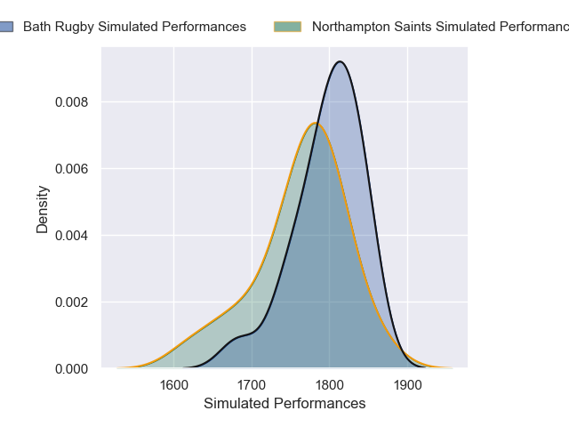

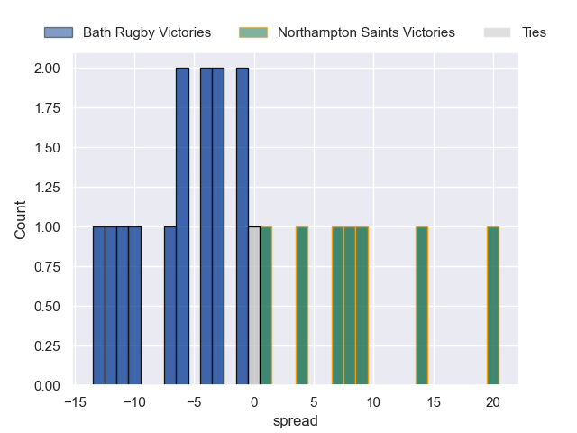

### Toulon V Stormers on 2025/04/04

Average Margin: Toulon by 5.7

### La Rochelle V Bristol Rugby on 2025/04/04

Average Margin: La Rochelle by 11.0

### Northampton Saints V Saracens on 2025/04/04

Average Margin: Northampton Saints by 2.6

### Leinster V Leicester Tigers on 2025/04/04

Average Margin: Leinster by 13.2

### Toulon V Bath Rugby on 2025/04/04

Average Margin: Toulon by 0.7

### Leinster V Stormers on 2025/04/04

Average Margin: Leinster by 13.5

### Stade Toulousain V Clermont Auvergne on 2025/04/04

Average Margin: Stade Toulousain by 12.1

### Glasgow Warriors V Racing 92 on 2025/04/04

Average Margin: Glasgow Warriors by 9.3

### Munster V Castres Olympique on 2025/04/04

Average Margin: Munster by 6.5

### Toulon V Northampton Saints on 2025/04/04

Average Margin: Toulon by 5.2

### Stade Toulousain V La Rochelle on 2025/04/04

Average Margin: Stade Toulousain by 8.5

### Leinster V Sale Sharks on 2025/04/04

Average Margin: Leinster by 14.1

### Saracens V Northampton Saints on 2025/04/04

Average Margin: Saracens by 8.5

### La Rochelle V Castres Olympique on 2025/04/04

Average Margin: La Rochelle by 10.6

### Bordeaux Begles V Clermont Auvergne on 2025/04/04

Average Margin: Bordeaux Begles by 9.4

### Toulon V La Rochelle on 2025/04/04

Average Margin: Toulon by 3.2

### Northampton Saints V Bristol Rugby on 2025/04/04

Average Margin: Northampton Saints by 4.6

### Northampton Saints V Leicester Tigers on 2025/04/04

Average Margin: Northampton Saints by 5.5

### Leinster V Bristol Rugby on 2025/04/04

Average Margin: Leinster by 12.9

### Bordeaux Begles V Stormers on 2025/04/04

Average Margin: Bordeaux Begles by 7.3

### Glasgow Warriors V Harlequins on 2025/04/04

Average Margin: Glasgow Warriors by 13.7

### Stade Toulousain V Munster on 2025/04/04

Average Margin: Stade Toulousain by 8.3

### Saracens V Bristol Rugby on 2025/04/04

Average Margin: Saracens by 4.6

### Leicester Tigers V La Rochelle on 2025/04/04

Average Margin: Leicester Tigers by 2.2

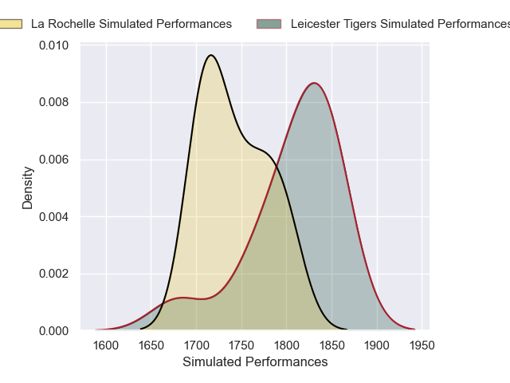

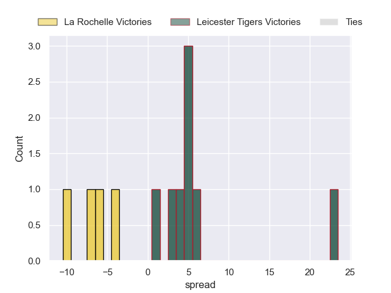

### Leinster V Saracens on 2025/04/04

Average Margin: Leinster by 10.1

### Toulon V Sharks on 2025/04/04

Average Margin: Toulon by 4.6

### Saracens V Stormers on 2025/04/04

Average Margin: Saracens by 3.3

### La Rochelle V Bath Rugby on 2025/04/04

Average Margin: La Rochelle by 7.1

### Northampton Saints V La Rochelle on 2025/04/04

Average Margin: Northampton Saints by 3.1

### Saracens V Sale Sharks on 2025/04/04

Average Margin: Saracens by 9.4

### Toulon V Sale Sharks on 2025/04/04

Average Margin: Toulon by 7.9

### Bordeaux Begles V Sale Sharks on 2025/04/04

Average Margin: Bordeaux Begles by 8.6

### Munster V Benetton Treviso on 2025/04/04

Average Margin: Munster by 8.9

### Glasgow Warriors V Benetton Treviso on 2025/04/04

Average Margin: Glasgow Warriors by 11.4

### Saracens V Harlequins on 2025/04/04

Average Margin: Saracens by 8.7

### Castres Olympique V Munster on 2025/04/04

Average Margin: Castres Olympique by 2.7

### Glasgow Warriors V La Rochelle on 2025/04/04

Average Margin: Glasgow Warriors by 5.2

### Northampton Saints V Benetton Treviso on 2025/04/04

Average Margin: Northampton Saints by 6.9

### Leicester Tigers V Sale Sharks on 2025/04/04

Average Margin: Leicester Tigers by 6.2

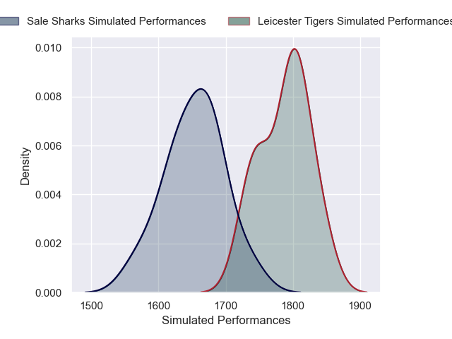

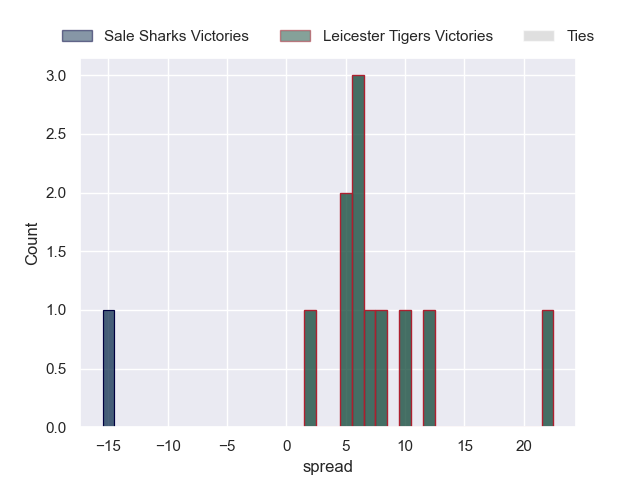

### La Rochelle V Benetton Treviso on 2025/04/04

Average Margin: La Rochelle by 5.2

### Munster V Leicester Tigers on 2025/04/04

Average Margin: Munster by 4.0

### Munster V Clermont Auvergne on 2025/04/04

Average Margin: Munster by 7.5

### Munster V Saracens on 2025/04/04

Average Margin: Munster by 3.3

### Northampton Saints V Racing 92 on 2025/04/04

Average Margin: Northampton Saints by 9.5

### Bordeaux Begles V Munster on 2025/04/04

Average Margin: Bordeaux Begles by 6.7

### Toulon V Racing 92 on 2025/04/04

Average Margin: Toulon by 9.5

### La Rochelle V Sale Sharks on 2025/04/04

Average Margin: La Rochelle by 7.4

### Leinster V La Rochelle on 2025/04/04

Average Margin: Leinster by 12.6

### Leinster V Castres Olympique on 2025/04/04

Average Margin: Leinster by 17.1

### Bordeaux Begles V Racing 92 on 2025/04/04

Average Margin: Bordeaux Begles by 9.1

### Castres Olympique V Leicester Tigers on 2025/04/04

Average Margin: Castres Olympique by 1.5

### Stade Toulousain V Sale Sharks on 2025/04/04

Average Margin: Stade Toulousain by 13.0

### Glasgow Warriors V Stormers on 2025/04/04

Average Margin: Glasgow Warriors by 9.1

### Saracens V La Rochelle on 2025/04/04

Average Margin: Saracens by 4.9

### Toulon V Saracens on 2025/04/04

Average Margin: Toulon by 5.1

### Northampton Saints V Clermont Auvergne on 2025/04/04

Average Margin: Northampton Saints by 6.2

### Munster V Northampton Saints on 2025/04/04

Average Margin: Munster by 2.0

### Stade Toulousain V Racing 92 on 2025/04/04

Average Margin: Stade Toulousain by 12.6

### Benetton Treviso V Leicester Tigers on 2025/04/04

Average Margin: Benetton Treviso by 2.0

### Bordeaux Begles V La Rochelle on 2025/04/04

Average Margin: Bordeaux Begles by 5.7

### Glasgow Warriors V Sale Sharks on 2025/04/04

Average Margin: Glasgow Warriors by 8.1

### Toulon V Stade Toulousain on 2025/04/04

Average Margin: Stade Toulousain by 0.0

### Stade Toulousain V Northampton Saints on 2025/04/04

Average Margin: Stade Toulousain by 8.0

### Leinster V Benetton Treviso on 2025/04/04

Average Margin: Leinster by 17.6

### Toulon V Munster on 2025/04/04

Average Margin: Toulon by 4.8

### La Rochelle V Harlequins on 2025/04/04

Average Margin: La Rochelle by 7.4

### Glasgow Warriors V Bath Rugby on 2025/04/04

Average Margin: Glasgow Warriors by 4.0

### Leinster V Sharks on 2025/04/04

Average Margin: Leinster by 15.7

### La Rochelle V Leicester Tigers on 2025/04/04

Average Margin: La Rochelle by 6.7

### Leinster V Bath Rugby on 2025/04/04

Average Margin: Leinster by 12.0

### Northampton Saints V Castres Olympique on 2025/04/04

Average Margin: Northampton Saints by 8.2

### Stade Toulousain V Stormers on 2025/04/04

Average Margin: Stade Toulousain by 11.4

### Glasgow Warriors V Clermont Auvergne on 2025/04/04

Average Margin: Glasgow Warriors by 8.9

### Saracens V Munster on 2025/04/04

Average Margin: Saracens by 6.2

### Bordeaux Begles V Sharks on 2025/04/04

Average Margin: Bordeaux Begles by 10.7

### La Rochelle V Saracens on 2025/04/04

Average Margin: La Rochelle by 4.2

### Bordeaux Begles V Bath Rugby on 2025/04/04

Average Margin: Bordeaux Begles by 5.5

### Leinster V Munster on 2025/04/04

Average Margin: Leinster by 10.2

### La Rochelle V Stormers on 2025/04/04

Average Margin: La Rochelle by 9.4

### Toulon V Clermont Auvergne on 2025/04/04

Average Margin: Toulon by 6.8

### Saracens V Bath Rugby on 2025/04/04

Average Margin: Saracens by 4.1

### Glasgow Warriors V Stade Toulousain on 2025/04/04

Average Margin: Glasgow Warriors by 3.0

### Northampton Saints V Sale Sharks on 2025/04/04

Average Margin: Northampton Saints by 7.7

### Northampton Saints V Stormers on 2025/04/04

Average Margin: Northampton Saints by 5.6

### Stade Toulousain V Bristol Rugby on 2025/04/04

Average Margin: Stade Toulousain by 12.8

### Saracens V Clermont Auvergne on 2025/04/04

Average Margin: Saracens by 5.3

### Toulon V Castres Olympique on 2025/04/04

Average Margin: Toulon by 8.1

### Leinster V Stade Toulousain on 2025/04/04

Average Margin: Leinster by 5.0

### Leinster V Racing 92 on 2025/04/04

Average Margin: Leinster by 15.1

### Glasgow Warriors V Northampton Saints on 2025/04/04

Average Margin: Glasgow Warriors by 8.2

### Stade Toulousain V Harlequins on 2025/04/04

Average Margin: Stade Toulousain by 10.7

### Munster V La Rochelle on 2025/04/04

Average Margin: Munster by 3.6

### Leinster V Clermont Auvergne on 2025/04/04

Average Margin: Leinster by 12.9

### Glasgow Warriors V Munster on 2025/04/04

Average Margin: Glasgow Warriors by 8.1

### Northampton Saints V Harlequins on 2025/04/04

Average Margin: Northampton Saints by 5.1

### La Rochelle V Munster on 2025/04/04

Average Margin: La Rochelle by 5.0

### Saracens V Benetton Treviso on 2025/04/04

Average Margin: Saracens by 9.4

### Stade Toulousain V Bath Rugby on 2025/04/04

Average Margin: Stade Toulousain by 6.1

### Glasgow Warriors V Leicester Tigers on 2025/04/04

Average Margin: Glasgow Warriors by 7.5

## Quarterfinals

### Toulon V Harlequins on 2025/04/11

Average Margin: Toulon by 7.2

### Saracens V Northampton Saints on 2025/04/11

Average Margin: Saracens by 8.5

### Leinster V Stormers on 2025/04/11

Average Margin: Leinster by 13.5

### Munster V Glasgow Warriors on 2025/04/11

Average Margin: Glasgow Warriors by 1.8

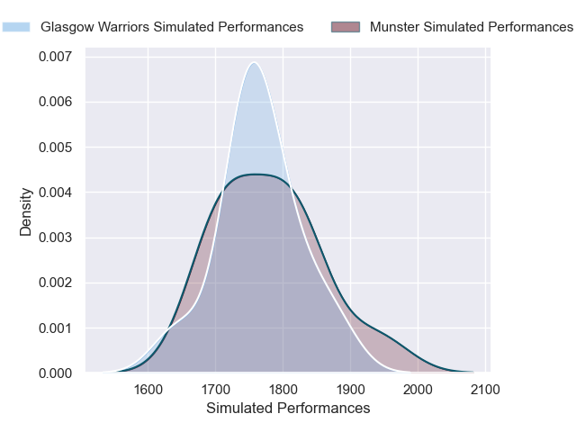

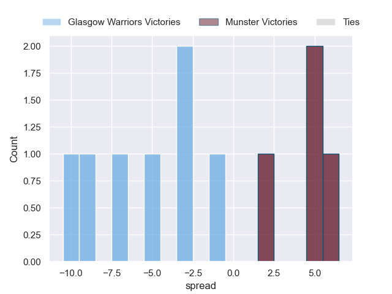

### Leinster V Harlequins on 2025/04/11

Average Margin: Leinster by 12.8

### Glasgow Warriors V Sale Sharks on 2025/04/11

Average Margin: Glasgow Warriors by 8.1

### Bordeaux Begles V Sharks on 2025/04/11

Average Margin: Bordeaux Begles by 10.7

### Northampton Saints V Glasgow Warriors on 2025/04/11

Average Margin: Glasgow Warriors by 0.0

### La Rochelle V Munster on 2025/04/11

Average Margin: La Rochelle by 5.0

### Saracens V Benetton Treviso on 2025/04/11

Average Margin: Saracens by 9.4

### Glasgow Warriors V Sharks on 2025/04/11

Average Margin: Glasgow Warriors by 7.5

### Saracens V Leinster on 2025/04/11

Average Margin: Leinster by 7.5

### Northampton Saints V Benetton Treviso on 2025/04/11

Average Margin: Northampton Saints by 6.9

### Glasgow Warriors V Stormers on 2025/04/11

Average Margin: Glasgow Warriors by 9.1

### Munster V Castres Olympique on 2025/04/11

Average Margin: Munster by 6.5

### Toulon V Clermont Auvergne on 2025/04/11

Average Margin: Toulon by 6.8

### Toulon V Stade Toulousain on 2025/04/11

Average Margin: Stade Toulousain by 0.0

### Saracens V Bath Rugby on 2025/04/11

Average Margin: Saracens by 4.1

### Stade Toulousain V Harlequins on 2025/04/11

Average Margin: Stade Toulousain by 10.7

### Toulon V Stormers on 2025/04/11

Average Margin: Toulon by 5.7

### Northampton Saints V Clermont Auvergne on 2025/04/11

Average Margin: Northampton Saints by 6.2

### Leinster V Bath Rugby on 2025/04/11

Average Margin: Leinster by 12.0

### La Rochelle V Clermont Auvergne on 2025/04/11

Average Margin: La Rochelle by 7.8

### Glasgow Warriors V Clermont Auvergne on 2025/04/11

Average Margin: Glasgow Warriors by 8.9

### La Rochelle V Stormers on 2025/04/11

Average Margin: La Rochelle by 9.4

### Leinster V Castres Olympique on 2025/04/11

Average Margin: Leinster by 17.1

### Northampton Saints V Sale Sharks on 2025/04/11

Average Margin: Northampton Saints by 7.7

### Stade Toulousain V Bordeaux Begles on 2025/04/11

Average Margin: Stade Toulousain by 2.3

### Northampton Saints V Racing 92 on 2025/04/11

Average Margin: Northampton Saints by 9.5

### Leinster V Leicester Tigers on 2025/04/11

Average Margin: Leinster by 13.2

### Saracens V Bristol Rugby on 2025/04/11

Average Margin: Saracens by 4.6

### Munster V Northampton Saints on 2025/04/11

Average Margin: Munster by 2.0

### Leinster V Stade Toulousain on 2025/04/11

Average Margin: Leinster by 5.0

### La Rochelle V Leicester Tigers on 2025/04/11

Average Margin: La Rochelle by 6.7

### La Rochelle V Sale Sharks on 2025/04/11

Average Margin: La Rochelle by 7.4

### Munster V Saracens on 2025/04/11

Average Margin: Munster by 3.3

### Saracens V Glasgow Warriors on 2025/04/11

Average Margin: Saracens by 4.2

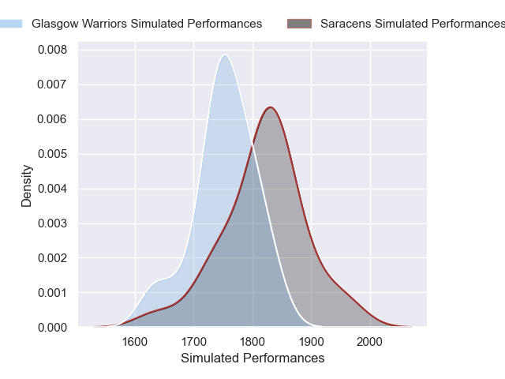
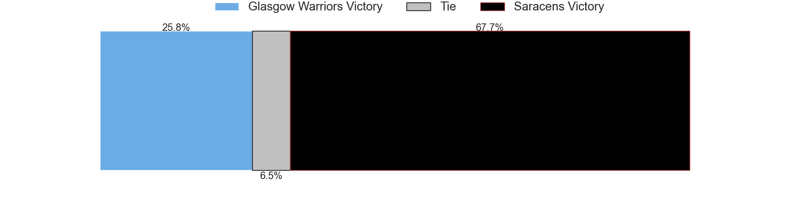
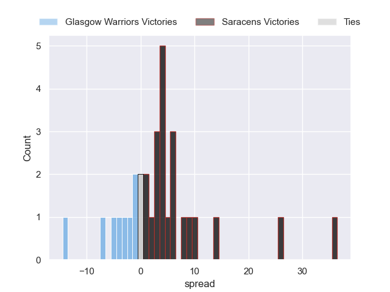

### Munster V La Rochelle on 2025/04/11

Average Margin: Munster by 3.6

### Leinster V Sale Sharks on 2025/04/11

Average Margin: Leinster by 14.1

### Toulon V Racing 92 on 2025/04/11

Average Margin: Toulon by 9.5

### La Rochelle V Benetton Treviso on 2025/04/11

Average Margin: La Rochelle by 5.2

### Toulon V Bath Rugby on 2025/04/11

Average Margin: Toulon by 0.7

### Leicester Tigers V La Rochelle on 2025/04/11

Average Margin: Leicester Tigers by 2.2

### Leinster V Clermont Auvergne on 2025/04/11

Average Margin: Leinster by 12.9

### Toulon V Sharks on 2025/04/11

Average Margin: Toulon by 4.6

### Northampton Saints V Munster on 2025/04/11

Average Margin: Northampton Saints by 5.6

### Bordeaux Begles V Stade Toulousain on 2025/04/11

Average Margin: Stade Toulousain by 3.2

### Leinster V Sharks on 2025/04/11

Average Margin: Leinster by 15.7

### Northampton Saints V Leicester Tigers on 2025/04/11

Average Margin: Northampton Saints by 5.5

### Northampton Saints V Bath Rugby on 2025/04/11

Average Margin: Bath Rugby by 0.9

### Saracens V Clermont Auvergne on 2025/04/11

Average Margin: Saracens by 5.3

### La Rochelle V Bath Rugby on 2025/04/11

Average Margin: La Rochelle by 7.1

### Bordeaux Begles V Sale Sharks on 2025/04/11

Average Margin: Bordeaux Begles by 8.6

### Northampton Saints V Stormers on 2025/04/11

Average Margin: Northampton Saints by 5.6

### Toulon V Benetton Treviso on 2025/04/11

Average Margin: Toulon by 10.3

### La Rochelle V Glasgow Warriors on 2025/04/11

Average Margin: La Rochelle by 1.0

### Northampton Saints V Harlequins on 2025/04/11

Average Margin: Northampton Saints by 5.1

### Saracens V Harlequins on 2025/04/11

Average Margin: Saracens by 8.7

### La Rochelle V Castres Olympique on 2025/04/11

Average Margin: La Rochelle by 10.6

### Glasgow Warriors V Bath Rugby on 2025/04/11

Average Margin: Glasgow Warriors by 4.0

### Glasgow Warriors V Benetton Treviso on 2025/04/11

Average Margin: Glasgow Warriors by 11.4

### Glasgow Warriors V Castres Olympique on 2025/04/11

Average Margin: Glasgow Warriors by 10.9

### La Rochelle V Leinster on 2025/04/11

Average Margin: Leinster by 2.4

### Stade Toulousain V Sale Sharks on 2025/04/11

Average Margin: Stade Toulousain by 13.0

### Glasgow Warriors V Munster on 2025/04/11

Average Margin: Glasgow Warriors by 8.1

### Northampton Saints V Castres Olympique on 2025/04/11

Average Margin: Northampton Saints by 8.2

### Leinster V Glasgow Warriors on 2025/04/11

Average Margin: Leinster by 8.5

### Leinster V Racing 92 on 2025/04/11

Average Margin: Leinster by 15.1

### Glasgow Warriors V Leicester Tigers on 2025/04/11

Average Margin: Glasgow Warriors by 7.5

### Stade Toulousain V Bristol Rugby on 2025/04/11

Average Margin: Stade Toulousain by 12.8

### Toulon V Munster on 2025/04/11

Average Margin: Toulon by 4.8

### Bordeaux Begles V Bristol Rugby on 2025/04/11

Average Margin: Bordeaux Begles by 8.1

### Leinster V Munster on 2025/04/11

Average Margin: Leinster by 10.2

### Glasgow Warriors V Stade Toulousain on 2025/04/11

Average Margin: Glasgow Warriors by 3.0

### Toulon V La Rochelle on 2025/04/11

Average Margin: Toulon by 3.2

### Bordeaux Begles V Castres Olympique on 2025/04/11

Average Margin: Bordeaux Begles by 11.5

### Bordeaux Begles V La Rochelle on 2025/04/11

Average Margin: Bordeaux Begles by 5.7

### Stade Toulousain V Leinster on 2025/04/11

Average Margin: Leinster by 0.5

### Bordeaux Begles V Northampton Saints on 2025/04/11

Average Margin: Bordeaux Begles by 7.2

### Glasgow Warriors V Leinster on 2025/04/11

Average Margin: Leinster by 0.8

### Bordeaux Begles V Glasgow Warriors on 2025/04/11

Average Margin: Bordeaux Begles by 3.9

### La Rochelle V Toulon on 2025/04/11

Average Margin: Toulon by 2.2

### Saracens V Castres Olympique on 2025/04/11

Average Margin: Saracens by 9.4

### Northampton Saints V Bristol Rugby on 2025/04/11

Average Margin: Northampton Saints by 4.6

### Stade Toulousain V Sharks on 2025/04/11

Average Margin: Stade Toulousain by 12.6

### Northampton Saints V Leinster on 2025/04/11

Average Margin: Leinster by 4.8

### Stade Toulousain V Stormers on 2025/04/11

Average Margin: Stade Toulousain by 11.4

### Bordeaux Begles V Saracens on 2025/04/11

Average Margin: Bordeaux Begles by 6.1

### Saracens V La Rochelle on 2025/04/11

Average Margin: Saracens by 4.9

### Stade Toulousain V Toulon on 2025/04/11

Average Margin: Stade Toulousain by 10.0

### Northampton Saints V La Rochelle on 2025/04/11

Average Margin: Northampton Saints by 3.1

### Stade Toulousain V Leicester Tigers on 2025/04/11

Average Margin: Stade Toulousain by 11.7

### Northampton Saints V Toulon on 2025/04/11

Average Margin: Northampton Saints by 2.7

### Bordeaux Begles V Munster on 2025/04/11

Average Margin: Bordeaux Begles by 6.7

### Bordeaux Begles V Leicester Tigers on 2025/04/11

Average Margin: Bordeaux Begles by 8.1

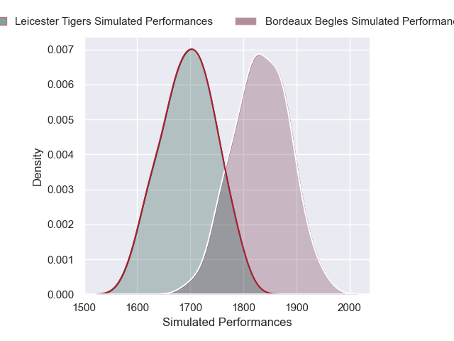
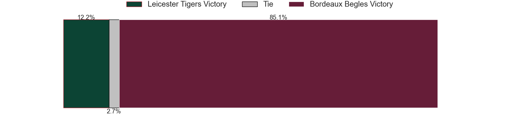
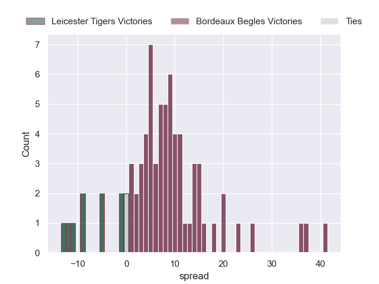

### Stade Toulousain V La Rochelle on 2025/04/11

Average Margin: Stade Toulousain by 8.5

### Toulon V Glasgow Warriors on 2025/04/11

Average Margin: Toulon by 1.4

### Bordeaux Begles V Benetton Treviso on 2025/04/11

Average Margin: Bordeaux Begles by 9.7

### Glasgow Warriors V Northampton Saints on 2025/04/11

Average Margin: Glasgow Warriors by 8.2

### Toulon V Leinster on 2025/04/11

Average Margin: Leinster by 0.3

### Stade Toulousain V Saracens on 2025/04/11

Average Margin: Stade Toulousain by 9.4

### Bordeaux Begles V Toulon on 2025/04/11

Average Margin: Bordeaux Begles by 5.2

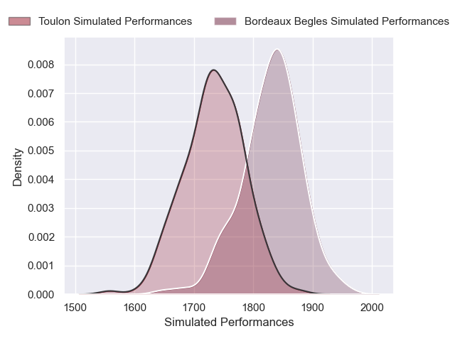

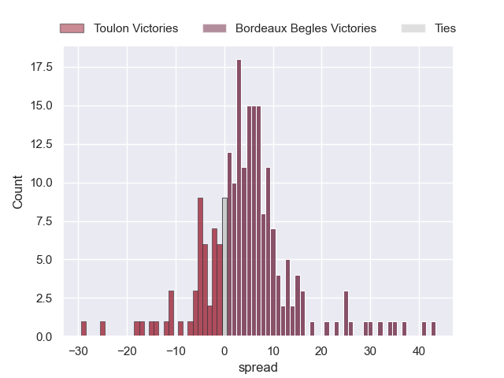

### Bordeaux Begles V Bath Rugby on 2025/04/11

Average Margin: Bordeaux Begles by 5.5

### Glasgow Warriors V Saracens on 2025/04/11

Average Margin: Glasgow Warriors by 7.1

### Leinster V Benetton Treviso on 2025/04/11

Average Margin: Leinster by 17.6

### Bordeaux Begles V Clermont Auvergne on 2025/04/11

Average Margin: Bordeaux Begles by 9.4

### Stade Toulousain V Northampton Saints on 2025/04/11

Average Margin: Stade Toulousain by 8.0

### Stade Toulousain V Glasgow Warriors on 2025/04/11

Average Margin: Stade Toulousain by 5.5

### La Rochelle V Northampton Saints on 2025/04/11

Average Margin: La Rochelle by 5.7

### Leinster V Toulon on 2025/04/11

Average Margin: Leinster by 9.6

### Leinster V Saracens on 2025/04/11

Average Margin: Leinster by 10.1

### Leinster V La Rochelle on 2025/04/11

Average Margin: Leinster by 12.6

### Toulon V Castres Olympique on 2025/04/11

Average Margin: Toulon by 8.1

### Bordeaux Begles V Leinster on 2025/04/11

Average Margin: Leinster by 4.2

### Glasgow Warriors V Toulon on 2025/04/11

Average Margin: Glasgow Warriors by 4.3

### Toulon V Northampton Saints on 2025/04/11

Average Margin: Toulon by 5.2

### Stade Toulousain V Munster on 2025/04/11

Average Margin: Stade Toulousain by 8.3

### Stade Toulousain V Castres Olympique on 2025/04/11

Average Margin: Stade Toulousain by 13.8

### Toulon V Saracens on 2025/04/11

Average Margin: Toulon by 5.1

### Toulon V Leicester Tigers on 2025/04/11

Average Margin: Toulon by 6.7

### Stade Toulousain V Racing 92 on 2025/04/11

Average Margin: Stade Toulousain by 12.6

### Leinster V Northampton Saints on 2025/04/11

Average Margin: Leinster by 11.2

### Stade Toulousain V Clermont Auvergne on 2025/04/11

Average Margin: Stade Toulousain by 12.1

### Northampton Saints V Saracens on 2025/04/11

Average Margin: Northampton Saints by 2.6

### Stade Toulousain V Benetton Treviso on 2025/04/11

Average Margin: Stade Toulousain by 15.4

### Bordeaux Begles V Harlequins on 2025/04/11

Average Margin: Bordeaux Begles by 8.0

### Glasgow Warriors V La Rochelle on 2025/04/11

Average Margin: Glasgow Warriors by 5.2

### Stade Toulousain V Bath Rugby on 2025/04/11

Average Margin: Stade Toulousain by 6.1

### Leinster V Bristol Rugby on 2025/04/11

Average Margin: Leinster by 12.9

### Munster V Leicester Tigers on 2025/04/11

Average Margin: Munster by 4.0

### Bordeaux Begles V Racing 92 on 2025/04/11

Average Margin: Bordeaux Begles by 9.1

### La Rochelle V Saracens on 2025/04/11

Average Margin: La Rochelle by 4.2

### Saracens V Toulon on 2025/04/11

Average Margin: Saracens by 4.7

### Saracens V Leicester Tigers on 2025/04/11

Average Margin: Saracens by 7.3

### Bordeaux Begles V Stormers on 2025/04/11

Average Margin: Bordeaux Begles by 7.3

### Saracens V Munster on 2025/04/11

Average Margin: Saracens by 6.2

## Semifinals

### Stade Toulousain V Harlequins on 2025/05/02

Average Margin: Stade Toulousain by 10.7

### Saracens V Munster on 2025/05/02

Average Margin: Saracens by 6.2

### Toulon V Bath Rugby on 2025/05/02

Average Margin: Toulon by 0.7

### Saracens V Stormers on 2025/05/02

Average Margin: Saracens by 3.3

### Bordeaux Begles V Bath Rugby on 2025/05/02

Average Margin: Bordeaux Begles by 5.5

### Leinster V La Rochelle on 2025/05/02

Average Margin: Leinster by 12.6

### Toulon V Northampton Saints on 2025/05/02

Average Margin: Toulon by 5.2

### Toulon V Racing 92 on 2025/05/02

Average Margin: Toulon by 9.5

### Saracens V Bath Rugby on 2025/05/02

Average Margin: Saracens by 4.1

### Bordeaux Begles V Castres Olympique on 2025/05/02

Average Margin: Bordeaux Begles by 11.5

### Stade Toulousain V Northampton Saints on 2025/05/02

Average Margin: Stade Toulousain by 8.0

### Leinster V Toulon on 2025/05/02

Average Margin: Leinster by 9.6

### Bordeaux Begles V Harlequins on 2025/05/02

Average Margin: Bordeaux Begles by 8.0

### Stade Toulousain V Leicester Tigers on 2025/05/02

Average Margin: Stade Toulousain by 11.7

### Glasgow Warriors V Saracens on 2025/05/02

Average Margin: Glasgow Warriors by 7.1

### Stade Toulousain V Benetton Treviso on 2025/05/02

Average Margin: Stade Toulousain by 15.4

### Leinster V Sharks on 2025/05/02

Average Margin: Leinster by 15.7

### La Rochelle V Munster on 2025/05/02

Average Margin: La Rochelle by 5.0

### Bordeaux Begles V Glasgow Warriors on 2025/05/02

Average Margin: Bordeaux Begles by 3.9

### Leinster V Sale Sharks on 2025/05/02

Average Margin: Leinster by 14.1

### Bordeaux Begles V Stormers on 2025/05/02

Average Margin: Bordeaux Begles by 7.3

### Bordeaux Begles V Clermont Auvergne on 2025/05/02

Average Margin: Bordeaux Begles by 9.4

### Leinster V Glasgow Warriors on 2025/05/02

Average Margin: Leinster by 8.5

### Bordeaux Begles V Stade Toulousain on 2025/05/02

Average Margin: Stade Toulousain by 3.2

### Leinster V Clermont Auvergne on 2025/05/02

Average Margin: Leinster by 12.9

### Saracens V La Rochelle on 2025/05/02

Average Margin: Saracens by 4.9

### Bordeaux Begles V Toulon on 2025/05/02

Average Margin: Bordeaux Begles by 5.2

### Northampton Saints V Toulon on 2025/05/02

Average Margin: Northampton Saints by 2.7

### Leinster V Northampton Saints on 2025/05/02

Average Margin: Leinster by 11.2

### Glasgow Warriors V Leinster on 2025/05/02

Average Margin: Leinster by 0.8

### Stade Toulousain V Leinster on 2025/05/02

Average Margin: Leinster by 0.5

### Northampton Saints V Leicester Tigers on 2025/05/02

Average Margin: Northampton Saints by 5.5

### Leinster V Castres Olympique on 2025/05/02

Average Margin: Leinster by 17.1

### Northampton Saints V Harlequins on 2025/05/02

Average Margin: Northampton Saints by 5.1

### Stade Toulousain V Munster on 2025/05/02

Average Margin: Stade Toulousain by 8.3

### Toulon V Sharks on 2025/05/02

Average Margin: Toulon by 4.6

### Saracens V Leinster on 2025/05/02

Average Margin: Leinster by 7.5

### Glasgow Warriors V Stade Toulousain on 2025/05/02

Average Margin: Glasgow Warriors by 3.0

### Leinster V Bordeaux Begles on 2025/05/02

Average Margin: Leinster by 9.1

### Glasgow Warriors V Clermont Auvergne on 2025/05/02

Average Margin: Glasgow Warriors by 8.9

### Glasgow Warriors V Northampton Saints on 2025/05/02

Average Margin: Glasgow Warriors by 8.2

### Bordeaux Begles V Racing 92 on 2025/05/02

Average Margin: Bordeaux Begles by 9.1

### Saracens V Sale Sharks on 2025/05/02

Average Margin: Saracens by 9.4

### Stade Toulousain V Toulon on 2025/05/02

Average Margin: Stade Toulousain by 10.0

### La Rochelle V Saracens on 2025/05/02

Average Margin: La Rochelle by 4.2

### Toulon V Clermont Auvergne on 2025/05/02

Average Margin: Toulon by 6.8

### Stade Toulousain V Castres Olympique on 2025/05/02

Average Margin: Stade Toulousain by 13.8

### Stade Toulousain V Glasgow Warriors on 2025/05/02

Average Margin: Stade Toulousain by 5.5

### Toulon V Leinster on 2025/05/02

Average Margin: Leinster by 0.3

### Leinster V Racing 92 on 2025/05/02

Average Margin: Leinster by 15.1

### Leinster V Saracens on 2025/05/02

Average Margin: Leinster by 10.1

### Toulon V Saracens on 2025/05/02

Average Margin: Toulon by 5.1

### Toulon V La Rochelle on 2025/05/02

Average Margin: Toulon by 3.2

### Bordeaux Begles V La Rochelle on 2025/05/02

Average Margin: Bordeaux Begles by 5.7

### Leinster V Bristol Rugby on 2025/05/02

Average Margin: Leinster by 12.9

### Stade Toulousain V Saracens on 2025/05/02

Average Margin: Stade Toulousain by 9.4

### Leinster V Benetton Treviso on 2025/05/02

Average Margin: Leinster by 17.6

### Leinster V Stade Toulousain on 2025/05/02

Average Margin: Leinster by 5.0

### Stade Toulousain V Bath Rugby on 2025/05/02

Average Margin: Stade Toulousain by 6.1

### Leicester Tigers V La Rochelle on 2025/05/02

Average Margin: Leicester Tigers by 2.2

### Northampton Saints V Leinster on 2025/05/02

Average Margin: Leinster by 4.8

### Bordeaux Begles V Sale Sharks on 2025/05/02

Average Margin: Bordeaux Begles by 8.6

### Leinster V Bath Rugby on 2025/05/02

Average Margin: Leinster by 12.0

### La Rochelle V Leinster on 2025/05/02

Average Margin: Leinster by 2.4

### Stade Toulousain V Clermont Auvergne on 2025/05/02

Average Margin: Stade Toulousain by 12.1

### Bordeaux Begles V Northampton Saints on 2025/05/02

Average Margin: Bordeaux Begles by 7.2

### Northampton Saints V Munster on 2025/05/02

Average Margin: Northampton Saints by 5.6

### La Rochelle V Glasgow Warriors on 2025/05/02

Average Margin: La Rochelle by 1.0

### Bordeaux Begles V Saracens on 2025/05/02

Average Margin: Bordeaux Begles by 6.1

### Leinster V Munster on 2025/05/02

Average Margin: Leinster by 10.2

### Saracens V Northampton Saints on 2025/05/02

Average Margin: Saracens by 8.5

### Stade Toulousain V Sale Sharks on 2025/05/02

Average Margin: Stade Toulousain by 13.0

### Bordeaux Begles V Leicester Tigers on 2025/05/02

Average Margin: Bordeaux Begles by 8.1

### Toulon V Munster on 2025/05/02

Average Margin: Toulon by 4.8

### Toulon V Glasgow Warriors on 2025/05/02

Average Margin: Toulon by 1.4

### Leinster V Harlequins on 2025/05/02

Average Margin: Leinster by 12.8

### Munster V Glasgow Warriors on 2025/05/02

Average Margin: Glasgow Warriors by 1.8

### Bordeaux Begles V Leinster on 2025/05/02

Average Margin: Leinster by 4.2

### Stade Toulousain V Bristol Rugby on 2025/05/02

Average Margin: Stade Toulousain by 12.8

### Northampton Saints V Saracens on 2025/05/02

Average Margin: Northampton Saints by 2.6

### Stade Toulousain V Stormers on 2025/05/02

Average Margin: Stade Toulousain by 11.4

### Glasgow Warriors V La Rochelle on 2025/05/02

Average Margin: Glasgow Warriors by 5.2

### Stade Toulousain V La Rochelle on 2025/05/02

Average Margin: Stade Toulousain by 8.5

### Northampton Saints V Glasgow Warriors on 2025/05/02

Average Margin: Glasgow Warriors by 0.0

### Bordeaux Begles V Munster on 2025/05/02

Average Margin: Bordeaux Begles by 6.7

### Saracens V Glasgow Warriors on 2025/05/02

Average Margin: Saracens by 4.2

### Glasgow Warriors V Leicester Tigers on 2025/05/02

Average Margin: Glasgow Warriors by 7.5

### Toulon V Stade Toulousain on 2025/05/02

Average Margin: Stade Toulousain by 0.0

### Glasgow Warriors V Munster on 2025/05/02

Average Margin: Glasgow Warriors by 8.1

### Saracens V Toulon on 2025/05/02

Average Margin: Saracens by 4.7

### Stade Toulousain V Bordeaux Begles on 2025/05/02

Average Margin: Stade Toulousain by 2.3

### Northampton Saints V La Rochelle on 2025/05/02

Average Margin: Northampton Saints by 3.1

### Stade Toulousain V Racing 92 on 2025/05/02

Average Margin: Stade Toulousain by 12.6

### Glasgow Warriors V Sharks on 2025/05/02

Average Margin: Glasgow Warriors by 7.5

### Leinster V Stormers on 2025/05/02

Average Margin: Leinster by 13.5

### La Rochelle V Northampton Saints on 2025/05/02

Average Margin: La Rochelle by 5.7

### Leinster V Leicester Tigers on 2025/05/02

Average Margin: Leinster by 13.2

### Glasgow Warriors V Toulon on 2025/05/02

Average Margin: Glasgow Warriors by 4.3

## Finals

### Bordeaux Begles V Stade Toulousain on 2025/05/24

Average Margin: Stade Toulousain by 3.2

### Glasgow Warriors V Toulon on 2025/05/24

Average Margin: Glasgow Warriors by 4.3

### Bordeaux Begles V Leicester Tigers on 2025/05/24

Average Margin: Bordeaux Begles by 8.1

### Leinster V Castres Olympique on 2025/05/24

Average Margin: Leinster by 17.1

### Toulon V Glasgow Warriors on 2025/05/24

Average Margin: Toulon by 1.4

### Leinster V Racing 92 on 2025/05/24

Average Margin: Leinster by 15.1

### Glasgow Warriors V Bath Rugby on 2025/05/24

Average Margin: Glasgow Warriors by 4.0

### Toulon V Munster on 2025/05/24

Average Margin: Toulon by 4.8

### La Rochelle V Leinster on 2025/05/24

Average Margin: Leinster by 2.4

### Stade Toulousain V Bordeaux Begles on 2025/05/24

Average Margin: Stade Toulousain by 2.3

### Bordeaux Begles V Toulon on 2025/05/24

Average Margin: Bordeaux Begles by 5.2

### Saracens V Bath Rugby on 2025/05/24

Average Margin: Saracens by 4.1

### Toulon V Leinster on 2025/05/24

Average Margin: Leinster by 0.3

### Northampton Saints V Glasgow Warriors on 2025/05/24

Average Margin: Glasgow Warriors by 0.0

### Stade Toulousain V Northampton Saints on 2025/05/24

Average Margin: Stade Toulousain by 8.0

### Stade Toulousain V Glasgow Warriors on 2025/05/24

Average Margin: Stade Toulousain by 5.5

### Toulon V Saracens on 2025/05/24

Average Margin: Toulon by 5.1

### Glasgow Warriors V Northampton Saints on 2025/05/24

Average Margin: Glasgow Warriors by 8.2

### Leinster V Glasgow Warriors on 2025/05/24

Average Margin: Leinster by 8.5

### Bordeaux Begles V Northampton Saints on 2025/05/24

Average Margin: Bordeaux Begles by 7.2

### Northampton Saints V Bath Rugby on 2025/05/24

Average Margin: Bath Rugby by 0.9

### Stade Toulousain V La Rochelle on 2025/05/24

Average Margin: Stade Toulousain by 8.5

### Bordeaux Begles V Munster on 2025/05/24

Average Margin: Bordeaux Begles by 6.7

### Leinster V Leicester Tigers on 2025/05/24

Average Margin: Leinster by 13.2

### Munster V Glasgow Warriors on 2025/05/24

Average Margin: Glasgow Warriors by 1.8

### Leinster V Northampton Saints on 2025/05/24

Average Margin: Leinster by 11.2

### Stade Toulousain V Saracens on 2025/05/24

Average Margin: Stade Toulousain by 9.4

### Glasgow Warriors V Stade Toulousain on 2025/05/24

Average Margin: Glasgow Warriors by 3.0

### Stade Toulousain V Munster on 2025/05/24

Average Margin: Stade Toulousain by 8.3

### Leinster V Toulon on 2025/05/24

Average Margin: Leinster by 9.6

### Bordeaux Begles V Saracens on 2025/05/24

Average Margin: Bordeaux Begles by 6.1

### Glasgow Warriors V Castres Olympique on 2025/05/24

Average Margin: Glasgow Warriors by 10.9

### Bordeaux Begles V Glasgow Warriors on 2025/05/24

Average Margin: Bordeaux Begles by 3.9

### Leinster V Stade Toulousain on 2025/05/24

Average Margin: Leinster by 5.0

### La Rochelle V Toulon on 2025/05/24

Average Margin: Toulon by 2.2

### Northampton Saints V Toulon on 2025/05/24

Average Margin: Northampton Saints by 2.7

### Toulon V Stade Toulousain on 2025/05/24

Average Margin: Stade Toulousain by 0.0

### Glasgow Warriors V La Rochelle on 2025/05/24

Average Margin: Glasgow Warriors by 5.2

### Saracens V Glasgow Warriors on 2025/05/24

Average Margin: Saracens by 4.2

### Leinster V Munster on 2025/05/24

Average Margin: Leinster by 10.2

### Stade Toulousain V Leinster on 2025/05/24

Average Margin: Leinster by 0.5

### Glasgow Warriors V Saracens on 2025/05/24

Average Margin: Glasgow Warriors by 7.1

### Stade Toulousain V Toulon on 2025/05/24

Average Margin: Stade Toulousain by 10.0

### Saracens V Leinster on 2025/05/24

Average Margin: Leinster by 7.5

### Leinster V La Rochelle on 2025/05/24

Average Margin: Leinster by 12.6

### Stade Toulousain V Leicester Tigers on 2025/05/24

Average Margin: Stade Toulousain by 11.7

### Bordeaux Begles V La Rochelle on 2025/05/24

Average Margin: Bordeaux Begles by 5.7

### Glasgow Warriors V Leinster on 2025/05/24

Average Margin: Leinster by 0.8

### Leinster V Saracens on 2025/05/24

Average Margin: Leinster by 10.1

### Northampton Saints V Leinster on 2025/05/24

Average Margin: Leinster by 4.8

### Leinster V Bordeaux Begles on 2025/05/24

Average Margin: Leinster by 9.1

### Bordeaux Begles V Leinster on 2025/05/24

Average Margin: Leinster by 4.2

### Leinster V Bath Rugby on 2025/05/24

Average Margin: Leinster by 12.0

### Leinster V Clermont Auvergne on 2025/05/24

Average Margin: Leinster by 12.9

### Leinster V Bristol Rugby on 2025/05/24

Average Margin: Leinster by 12.9

### La Rochelle V Glasgow Warriors on 2025/05/24

Average Margin: La Rochelle by 1.0

# Completed Match Review

| Match                                                   |   Result |   Lineup Prediction |   Minutes Prediction |   Club Prediction |
|:--------------------------------------------------------|---------:|--------------------:|---------------------:|------------------:|
| Bath Rugby V La Rochelle on 2024/12/06                  |       -4 |                -8.5 |                 -2.4 |               6.7 |
| Northampton Saints V Castres Olympique on 2024/12/07    |       30 |                 5.8 |                  0.2 |               7.1 |
| Saracens V Bulls on 2024/12/07                          |       22 |                -7.8 |                 -7.1 |               1.6 |
| Glasgow Warriors V Sale Sharks on 2024/12/07            |       19 |                10.6 |                  6.4 |               9.7 |
| Racing 92 V Harlequins on 2024/12/07                    |       11 |                 4.9 |                  0.4 |               3.2 |
| Bordeaux Begles V Leicester Tigers on 2024/12/08        |       14 |                19.7 |                 12.9 |               6.5 |
| Stade Toulousain V Ulster on 2024/12/08                 |       40 |                13   |                  4.7 |              11.4 |
| Bristol Rugby V Leinster on 2024/12/08                  |      -23 |                -5.1 |                 -1.6 |              -1.9 |
| Sale Sharks V Racing 92 on 2024/12/13                   |       22 |                 5.6 |                  8.1 |               4.5 |
| Leicester Tigers V Sharks on 2024/12/14                 |       39 |                 5.2 |                  1.8 |               7   |
| La Rochelle V Bristol Rugby on 2024/12/14               |       28 |                 9.4 |                  3.5 |               3.7 |
| Benetton Treviso V Bath Rugby on 2024/12/15             |        1 |                -2.4 |                 -1.1 |              -2.4 |
| Stade Francais Paris V Saracens on 2024/12/15           |      -11 |               -12.6 |                -10.5 |               0.2 |
| Toulon V Glasgow Warriors on 2024/12/15                 |        1 |                 1   |                 -0.4 |               1.7 |
| Exeter Chiefs V Stade Toulousain on 2024/12/15          |      -43 |               -23   |                -20.1 |              -1.9 |
| Stormers V Sale Sharks on 2025/01/11                    |       40 |                -7.9 |                -12.3 |               2.9 |
| Munster V Saracens on 2025/01/11                        |        5 |                -9.9 |                 -8.1 |               3   |
| Stade Francais Paris V Northampton Saints on 2025/01/11 |       10 |                 2.8 |                  2.7 |              -0.4 |
| Toulon V Harlequins on 2025/01/12                       |       12 |                10.8 |                  9.7 |               6.9 |
| Bristol Rugby V Benetton Treviso on 2025/01/12          |        6 |                -0.7 |                 -0.6 |               8.8 |
| La Rochelle V Leinster on 2025/01/12                    |       -2 |                 0.1 |                  0.1 |              -3   |
| Bath Rugby V Clermont Auvergne on 2025/01/12            |       19 |                11.9 |                 -4.4 |               8.9 |

# Model Accuracies

| Model | Percent Correct Predictions | Spread Error |
| ------ | ------ | ------ |
| Club Level | 77.8% | 16.5 |
| Player Level: Lineup | 72.7% | 13.8 |
| Player Level: Minutes | 63.6% | 16.0 |

