---  
title: "European Rugby Champions Cup 2024 Status"  
date: 2025-01-13 6:00:00 -0500  
categories: model review projection  
layout: article  
aside:  
    toc: true  
---
# Current Team Rankings

# Pool Results

## Pool A

## Current Standings

| Club             |   Played |   Wins |   Point Differential |   Losing Bonus Points |   Try Bonus Points |
|:-----------------|---------:|-------:|---------------------:|----------------------:|-------------------:|
| Bordeaux Begles  |        3 |      3 |                   87 |                     0 |                  3 |
| Stade Toulousain |        3 |      3 |                   95 |                     0 |                  2 |
| Leicester Tigers |        3 |      2 |                   53 |                     0 |                  3 |
| Sharks           |        3 |      1 |                  -33 |                     0 |                  1 |
| Ulster           |        3 |      0 |                  -89 |                     0 |                  0 |
| Exeter Chiefs    |        3 |      0 |                 -113 |                     0 |                  0 |

### Projected Total Table

| Club             |   Played |   Wins |   Point Differential |   Losing Bonus Points |   Try Bonus Points |   Competition Points |
|:-----------------|---------:|-------:|---------------------:|----------------------:|-------------------:|---------------------:|
| Bordeaux Begles  |        4 |    3.8 |              92.242  |                   0.1 |                3.3 |                 18.5 |
| Stade Toulousain |        4 |    3.8 |             102.99   |                   0.1 |                2.4 |                 17.9 |
| Leicester Tigers |        4 |    2.2 |              45.0104 |                   0.3 |                3.1 |                 12.1 |
| Sharks           |        4 |    1.2 |             -38.242  |                   0.4 |                1.4 |                  6.7 |
| Ulster           |        4 |    0.8 |             -81.4481 |                   0.1 |                0.4 |                  3.8 |
| Exeter Chiefs    |        4 |    0.2 |            -120.552  |                   0.3 |                0.2 |                  1.3 |

## Pool B

## Current Standings

| Club              |   Played |   Wins |   Point Differential |   Losing Bonus Points |   Try Bonus Points |
|:------------------|---------:|-------:|---------------------:|----------------------:|-------------------:|
| Leinster          |        3 |      3 |                   33 |                     0 |                  1 |
| La Rochelle       |        3 |      2 |                   30 |                     1 |                  1 |
| Bath Rugby        |        3 |      1 |                   14 |                     2 |                  1 |
| Benetton Treviso  |        3 |      1 |                  -33 |                     1 |                  2 |
| Clermont Auvergne |        3 |      1 |                    1 |                     0 |                  1 |
| Bristol Rugby     |        3 |      1 |                  -45 |                     0 |                  1 |

### Projected Total Table

| Club              |   Played |   Wins |   Point Differential |   Losing Bonus Points |   Try Bonus Points |   Competition Points |
|:------------------|---------:|-------:|---------------------:|----------------------:|-------------------:|---------------------:|
| Leinster          |        4 |    3.8 |             39.8043  |                   0.1 |                1.5 |                 16.8 |
| La Rochelle       |        4 |    2.3 |             26.7976  |                   1.5 |                1.2 |                 11.8 |
| Benetton Treviso  |        4 |    1.7 |            -29.7976  |                   1.2 |                2.2 |                 10.2 |
| Bath Rugby        |        4 |    1.2 |              7.19569 |                   2.4 |                1.1 |                  8.3 |
| Clermont Auvergne |        4 |    1.6 |              3.36223 |                   0.2 |                1.2 |                  8   |
| Bristol Rugby     |        4 |    1.4 |            -47.3622  |                   0.4 |                1.6 |                  7.4 |

## Pool C

## Current Standings

| Club                 |   Played |   Wins |   Point Differential |   Losing Bonus Points |   Try Bonus Points |
|:---------------------|---------:|-------:|---------------------:|----------------------:|-------------------:|
| Northampton Saints   |        3 |      2 |                   29 |                     0 |                  3 |
| Munster              |        3 |      2 |                   29 |                     1 |                  1 |
| Saracens             |        3 |      2 |                   28 |                     1 |                  1 |
| Castres Olympique    |        3 |      2 |                   11 |                     0 |                  1 |
| Stade Francais Paris |        3 |      1 |                  -27 |                     0 |                  1 |
| Bulls                |        3 |      0 |                  -70 |                     0 |                  0 |

### Projected Total Table

| Club                 |   Played |   Wins |   Point Differential |   Losing Bonus Points |   Try Bonus Points |   Competition Points |
|:---------------------|---------:|-------:|---------------------:|----------------------:|-------------------:|---------------------:|
| Northampton Saints   |        4 |    2.5 |              29.5255 |                   0.3 |                3.1 |                 13.5 |
| Saracens             |        4 |    2.6 |              28.8803 |                   1.3 |                1.1 |                 12.7 |
| Munster              |        4 |    2.5 |              28.4745 |                   1.3 |                1.4 |                 12.7 |
| Castres Olympique    |        4 |    2.4 |              10.1197 |                   0.4 |                1.3 |                 11.4 |
| Stade Francais Paris |        4 |    1.2 |             -31.5608 |                   0.5 |                1.2 |                  6.6 |
| Bulls                |        4 |    0.8 |             -65.4392 |                   0.1 |                0.2 |                  3.4 |

## Pool D

## Current Standings

| Club             |   Played |   Wins |   Point Differential |   Losing Bonus Points |   Try Bonus Points |
|:-----------------|---------:|-------:|---------------------:|----------------------:|-------------------:|
| Toulon           |        3 |      3 |                   23 |                     0 |                  1 |
| Glasgow Warriors |        3 |      2 |                   28 |                     1 |                  3 |
| Harlequins       |        3 |      1 |                   14 |                     0 |                  1 |
| Stormers         |        3 |      1 |                   -7 |                     0 |                  1 |
| Sale Sharks      |        3 |      1 |                  -37 |                     0 |                  1 |
| Racing 92        |        3 |      1 |                  -21 |                     0 |                  0 |

### Projected Total Table

| Club             |   Played |   Wins |   Point Differential |   Losing Bonus Points |   Try Bonus Points |   Competition Points |
|:-----------------|---------:|-------:|---------------------:|----------------------:|-------------------:|---------------------:|
| Toulon           |        4 |    3.6 |             25.1718  |                   0.3 |                1.4 |                 16.1 |
| Glasgow Warriors |        4 |    2.6 |             28.6116  |                   1.3 |                3.4 |                 15   |
| Stormers         |        4 |    1.5 |             -7.27522 |                   0.4 |                1.3 |                  7.6 |
| Harlequins       |        4 |    1.4 |             13.3884  |                   0.4 |                1.2 |                  7.2 |
| Sale Sharks      |        4 |    1.4 |            -39.1718  |                   0.4 |                1.1 |                  7.1 |
| Racing 92        |        4 |    1.5 |            -20.7248  |                   0.4 |                0.1 |                  6.5 |

# Projected Playoff Results

|                      | Reach Round of Sixteen   | Reach Quarterfinals   | Reach Semifinals   | Reach Final   | Win Final   |
|:---------------------|:-------------------------|:----------------------|:-------------------|:--------------|:------------|
| Bordeaux Begles      | 83.4 %                   | 83.5 %                | 66.9 %             | 50.4 %        | 33.2 %      |
| Glasgow Warriors     | 68.9 %                   | 80.6 %                | 49.5 %             | 25.1 %        | 17.3 %      |
| Leinster             | 74.0 %                   | 75.3 %                | 49.3 %             | 27.3 %        | 13.5 %      |
| Stade Toulousain     | 79.8 %                   | 74.4 %                | 54.2 %             | 36.5 %        | 9.1 %       |
| Toulon               | 66.8 %                   | 84.3 %                | 51.1 %             | 22.6 %        | 6.7 %       |
| Munster              | 69.4 %                   | 57.1 %                | 26.9 %             | 9.1 %         | 4.8 %       |
| Benetton Treviso     | 55.8 %                   | 41.4 %                | 15.5 %             | 6.5 %         | 4.3 %       |
| La Rochelle          | 52.3 %                   | 71.6 %                | 24.0 %             | 6.2 %         | 3.9 %       |
| Sharks               | 84.5 %                   | 24.2 %                | 9.0 %              | 3.6 %         | 2.4 %       |
| Stormers             | 44.7 %                   | 17.5 %                | 5.6 %              | 2.1 %         | 1.5 %       |
| Northampton Saints   | 70.3 %                   | 47.6 %                | 17.9 %             | 4.4 %         | 0.9 %       |
| Castres Olympique    | 65.4 %                   | 42.8 %                | 9.2 %              | 2.0 %         | 0.8 %       |
| Saracens             | 67.7 %                   | 41.0 %                | 8.8 %              | 2.1 %         | 0.6 %       |
| Leicester Tigers     | 88.4 %                   | 18.2 %                | 6.7 %              | 1.3 %         | 0.6 %       |
| Bath Rugby           | 27.0 %                   | 10.0 %                | 2.0 %              | 0.3 %         | 0.2 %       |
| Sale Sharks          | 32.4 %                   | 5.3 %                 | 0.4 %              | 0.2 %         | 0.2 %       |
| Bristol Rugby        | 25.9 %                   | 5.2 %                 | 0.8 %              | 0.2 %         | 0.0 %       |
| Clermont Auvergne    | 48.0 %                   | 5.1 %                 | 0.2 %              | 0.1 %         | 0.0 %       |
| Harlequins           | 56.2 %                   | 8.3 %                 | 1.4 %              | 0.0 %         | 0.0 %       |
| Racing 92            | 37.8 %                   | 5.6 %                 | 0.5 %              | 0.0 %         | 0.0 %       |
| Stade Francais Paris | 0.6 %                    | 0.4 %                 | 0.1 %              | 0.0 %         | 0.0 %       |
| champ SS_11          | 0.3 %                    | 0.0 %                 | 0.0 %              | 0.0 %         | 0.0 %       |
| Ulster               | 0.2 %                    | 0.0 %                 | 0.0 %              | 0.0 %         | 0.0 %       |
| champ SS_10          | 0.2 %                    | 0.0 %                 | 0.0 %              | 0.0 %         | 0.0 %       |
| champ SS_12          | 0.1 %                    | 0.0 %                 | 0.0 %              | 0.0 %         | 0.0 %       |
| champ SS_14          | 0.1 %                    | 0.0 %                 | 0.0 %              | 0.0 %         | 0.0 %       |
| champ SS_15          | 0.1 %                    | 0.0 %                 | 0.0 %              | 0.0 %         | 0.0 %       |
| champ SS_16          | 0.1 %                    | 0.0 %                 | 0.0 %              | 0.0 %         | 0.0 %       |
| champ SS_4           | 0.1 %                    | 0.0 %                 | 0.0 %              | 0.0 %         | 0.0 %       |
| champ SS_8           | 0.1 %                    | 0.0 %                 | 0.0 %              | 0.0 %         | 0.0 %       |

# Pool Match Predictions

## Pool A

### Ulster V Exeter Chiefs on 2025/01/17

Average Margin: Ulster by 7.6

Average Scoreline: 31-24

### Bordeaux Begles V Sharks on 2025/01/19

Average Margin: Bordeaux Begles by 5.2

Average Scoreline: 32-27

### Stade Toulousain V Leicester Tigers on 2025/01/19

Average Margin: Stade Toulousain by 8.0

Average Scoreline: 33-25

## Pool B

### Benetton Treviso V La Rochelle on 2025/01/18

Average Margin: Benetton Treviso by 3.2

Average Scoreline: 26-23

### Clermont Auvergne V Bristol Rugby on 2025/01/18

Average Margin: Clermont Auvergne by 2.4

Average Scoreline: 38-36

### Leinster V Bath Rugby on 2025/01/18

Average Margin: Leinster by 6.8

Average Scoreline: 32-25

## Pool C

### Northampton Saints V Munster on 2025/01/18

Average Margin: Northampton Saints by 0.5

Average Scoreline: 29-28

### Bulls V Stade Francais Paris on 2025/01/18

Average Margin: Bulls by 4.6

Average Scoreline: 29-24

### Saracens V Castres Olympique on 2025/01/19

Average Margin: Saracens by 0.9

Average Scoreline: 25-24

## Pool D

### Harlequins V Glasgow Warriors on 2025/01/18

Average Margin: Glasgow Warriors by 0.6

Average Scoreline: 32-32

### Racing 92 V Stormers on 2025/01/18

Average Margin: Racing 92 by 0.3

Average Scoreline: 30-30

### Sale Sharks V Toulon on 2025/01/19

Average Margin: Toulon by 2.2

Average Scoreline: 25-23

# Knockout Match Predictions

## Sixteens

### Leinster V Harlequins on 2025/04/04

Average Margin: Leinster by 8.8

### Stade Toulousain V La Rochelle on 2025/04/04

Average Margin: Stade Toulousain by 2.2

### Leinster V Sale Sharks on 2025/04/04

Average Margin: Leinster by 6.4

### Northampton Saints V Sale Sharks on 2025/04/04

Average Margin: Northampton Saints by 4.9

### Bordeaux Begles V Bath Rugby on 2025/04/04

Average Margin: Bordeaux Begles by 9.1

### Saracens V Harlequins on 2025/04/04

Average Margin: Saracens by 5.4

### La Rochelle V Benetton Treviso on 2025/04/04

Average Margin: La Rochelle by 3.1

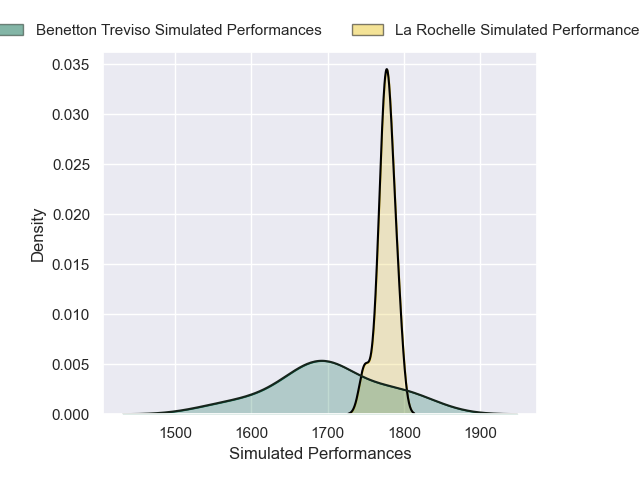
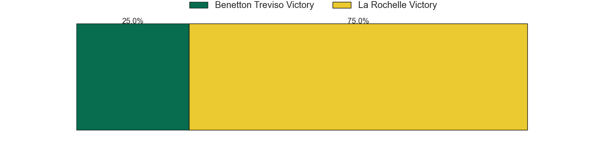
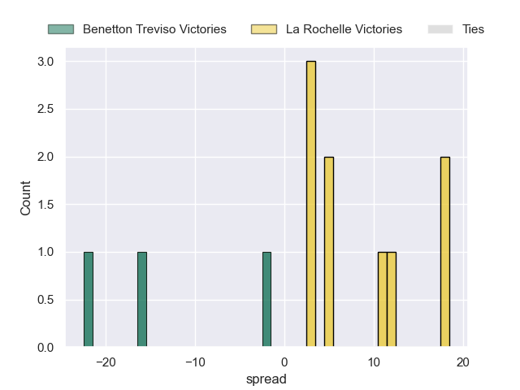

### Benetton Treviso V Munster on 2025/04/04

Average Margin: Benetton Treviso by 4.8

### Glasgow Warriors V Northampton Saints on 2025/04/04

Average Margin: Glasgow Warriors by 7.0

### Toulon V Harlequins on 2025/04/04

Average Margin: Toulon by 7.4

### Leinster V Bristol Rugby on 2025/04/04

Average Margin: Leinster by 8.5

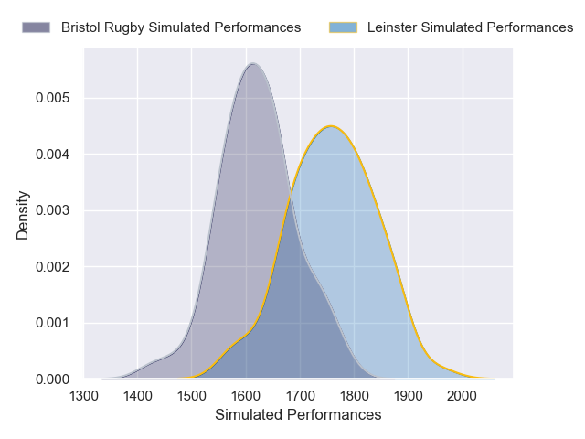

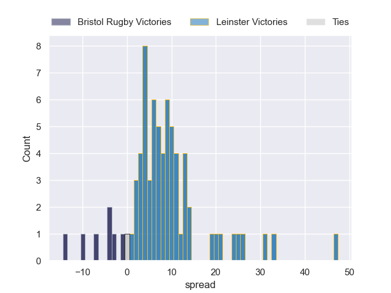

### Stade Toulousain V Benetton Treviso on 2025/04/04

Average Margin: Stade Toulousain by 0.5

### Saracens V Benetton Treviso on 2025/04/04

Average Margin: Benetton Treviso by 2.3

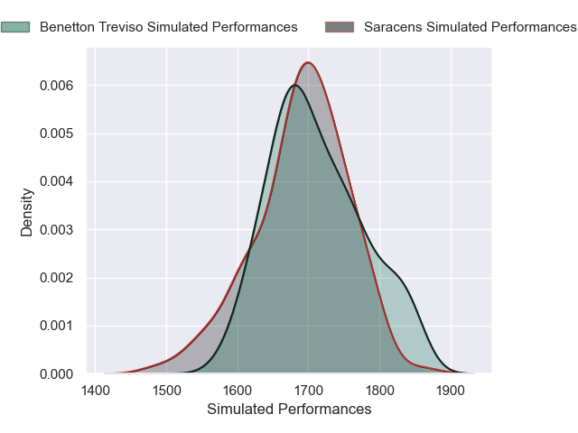

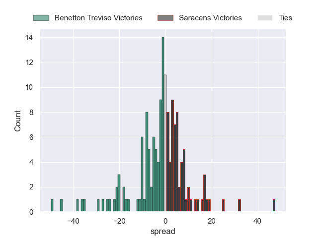

### Bordeaux Begles V Benetton Treviso on 2025/04/04

Average Margin: Bordeaux Begles by 3.3

### Leinster V Sharks on 2025/04/04

Average Margin: Leinster by 1.5

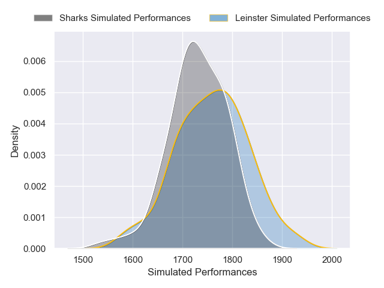

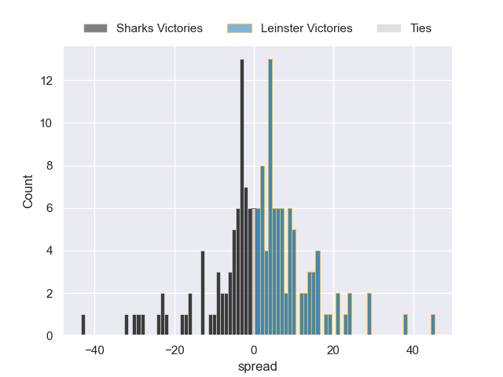

### Toulon V Racing 92 on 2025/04/04

Average Margin: Toulon by 6.8

### Leicester Tigers V Benetton Treviso on 2025/04/04

Average Margin: Leicester Tigers by 4.2

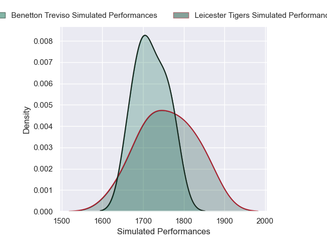

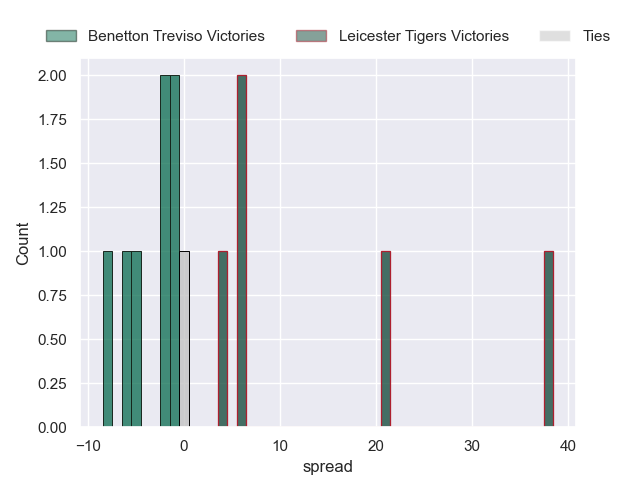

### La Rochelle V Clermont Auvergne on 2025/04/04

Average Margin: La Rochelle by 10.4

### La Rochelle V Stade Toulousain on 2025/04/04

Average Margin: La Rochelle by 4.1

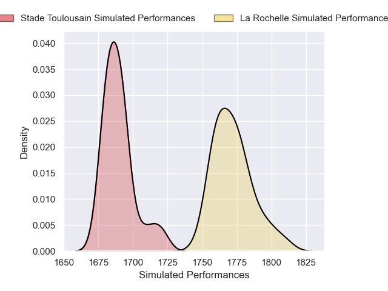

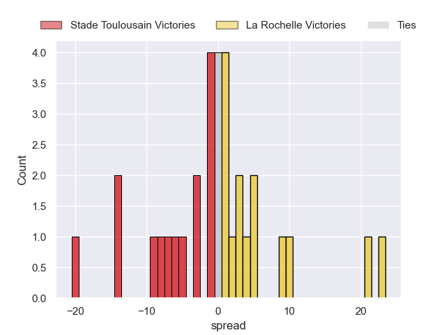

### Stade Toulousain V Bath Rugby on 2025/04/04

Average Margin: Stade Toulousain by 5.4

### Bordeaux Begles V Clermont Auvergne on 2025/04/04

Average Margin: Bordeaux Begles by 11.4

### Glasgow Warriors V Bristol Rugby on 2025/04/04

Average Margin: Glasgow Warriors by 9.1

### Munster V Castres Olympique on 2025/04/04

Average Margin: Munster by 6.7

### Saracens V Northampton Saints on 2025/04/04

Average Margin: Saracens by 3.1

### Leicester Tigers V Harlequins on 2025/04/04

Average Margin: Leicester Tigers by 6.0

### Northampton Saints V Stormers on 2025/04/04

Average Margin: Stormers by 0.6

### Leinster V Racing 92 on 2025/04/04

Average Margin: Leinster by 6.5

### Glasgow Warriors V Bath Rugby on 2025/04/04

Average Margin: Glasgow Warriors by 9.6

### Munster V Bristol Rugby on 2025/04/04

Average Margin: Munster by 4.5

### Northampton Saints V Bath Rugby on 2025/04/04

Average Margin: Northampton Saints by 4.7

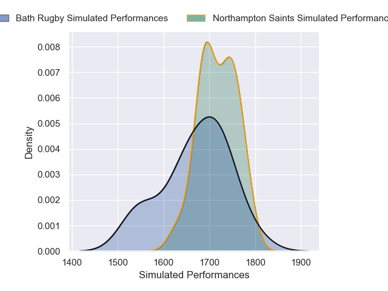

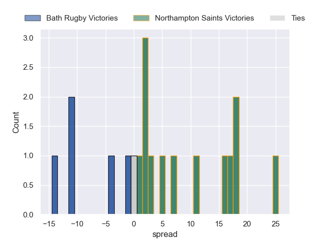

### Castres Olympique V Saracens on 2025/04/04

Average Margin: Castres Olympique by 8.5

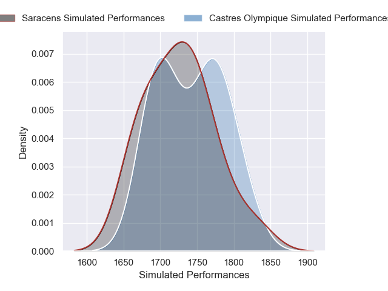

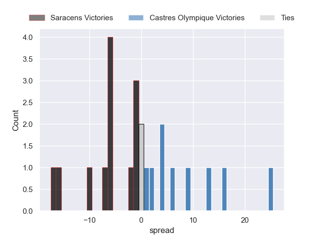

### La Rochelle V Leicester Tigers on 2025/04/04

Average Margin: La Rochelle by 8.7

### La Rochelle V Northampton Saints on 2025/04/04

Average Margin: La Rochelle by 8.6

### Glasgow Warriors V Castres Olympique on 2025/04/04

Average Margin: Glasgow Warriors by 7.3

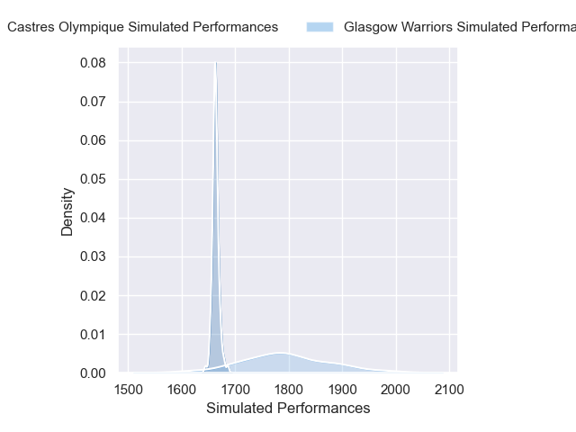
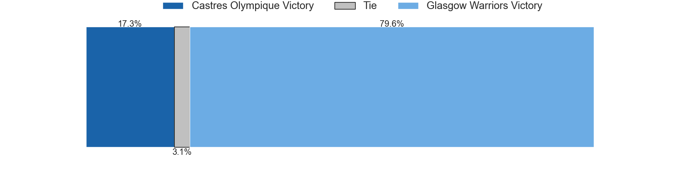
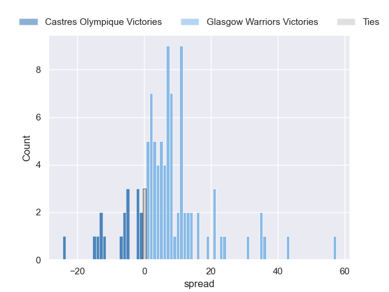

### Munster V Sharks on 2025/04/04

Average Margin: Munster by 5.3

### Bordeaux Begles V Stormers on 2025/04/04

Average Margin: Bordeaux Begles by 3.0

### Toulon V Sharks on 2025/04/04

Average Margin: Toulon by 1.7

### Leinster V Castres Olympique on 2025/04/04

Average Margin: Leinster by 4.4

### Northampton Saints V Harlequins on 2025/04/04

Average Margin: Northampton Saints by 8.2

### Glasgow Warriors V La Rochelle on 2025/04/04

Average Margin: Glasgow Warriors by 3.6

### Glasgow Warriors V Munster on 2025/04/04

Average Margin: Glasgow Warriors by 5.6

### Leinster V La Rochelle on 2025/04/04

Average Margin: Leinster by 3.5

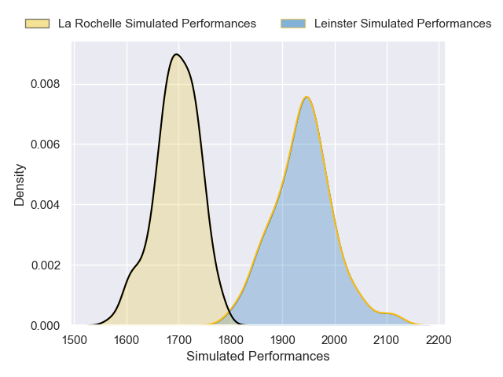

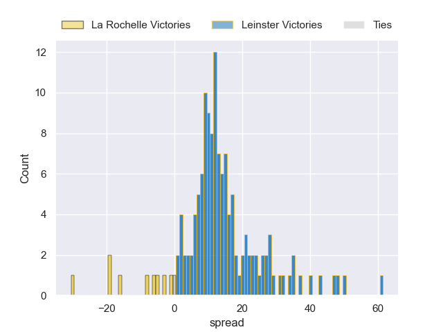

### Castres Olympique V Benetton Treviso on 2025/04/04

Average Margin: Castres Olympique by 0.5

### Bath Rugby V Leicester Tigers on 2025/04/04

Average Margin: Bath Rugby by 4.6

### Bordeaux Begles V La Rochelle on 2025/04/04

Average Margin: Bordeaux Begles by 4.5

### Glasgow Warriors V Stade Toulousain on 2025/04/04

Average Margin: Glasgow Warriors by 7.2

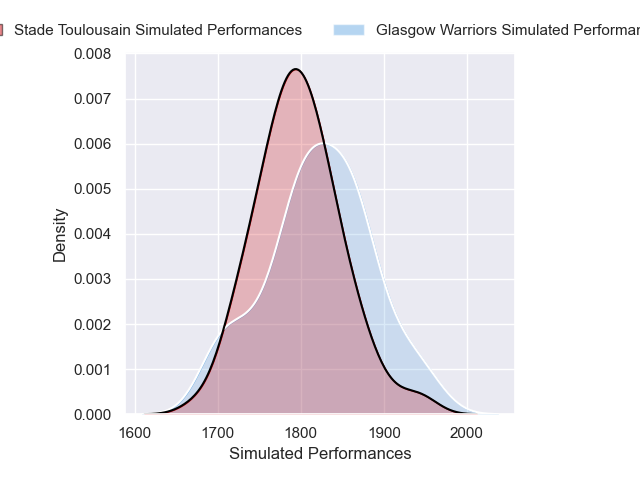
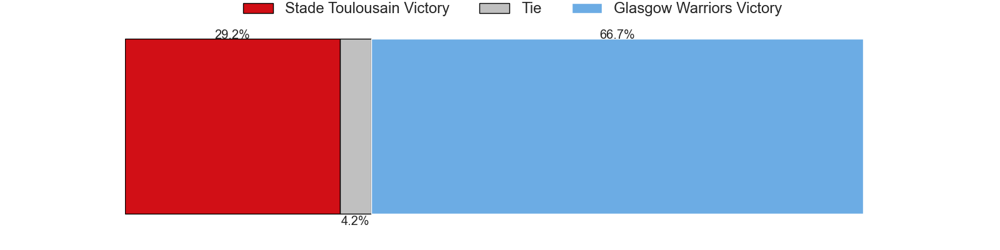
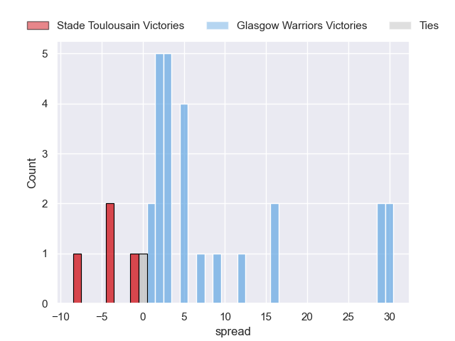

### Glasgow Warriors V Saracens on 2025/04/04

Average Margin: Glasgow Warriors by 9.8

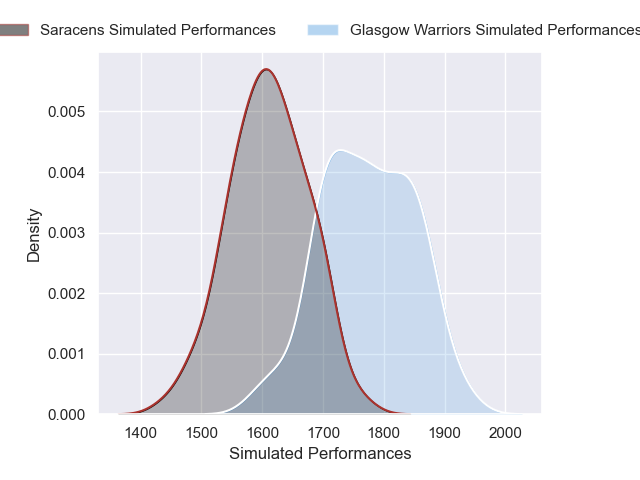
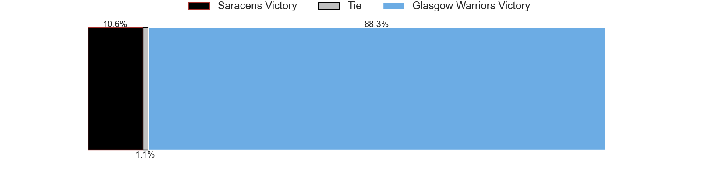
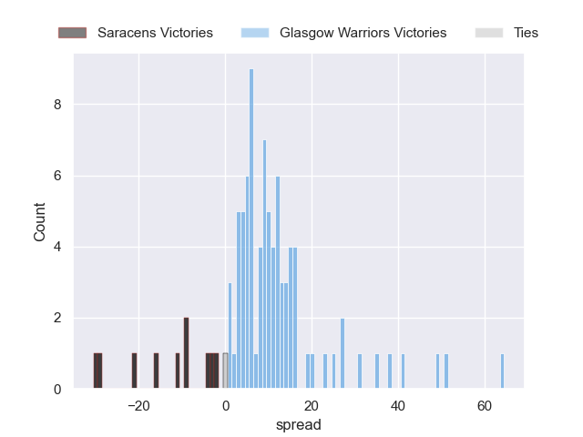

### Leinster V Clermont Auvergne on 2025/04/04

Average Margin: Leinster by 9.4

### Castres Olympique V La Rochelle on 2025/04/04

Average Margin: Castres Olympique by 3.0

### Munster V La Rochelle on 2025/04/04

Average Margin: Munster by 0.8

### Bordeaux Begles V Sale Sharks on 2025/04/04

Average Margin: Bordeaux Begles by 7.7

### Munster V Harlequins on 2025/04/04

Average Margin: Munster by 9.5

### Castres Olympique V Bath Rugby on 2025/04/04

Average Margin: Castres Olympique by 4.8

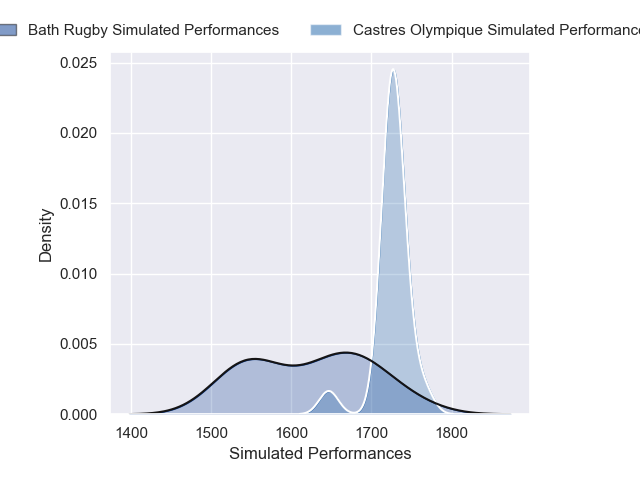
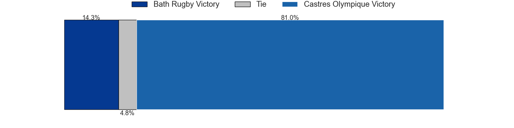
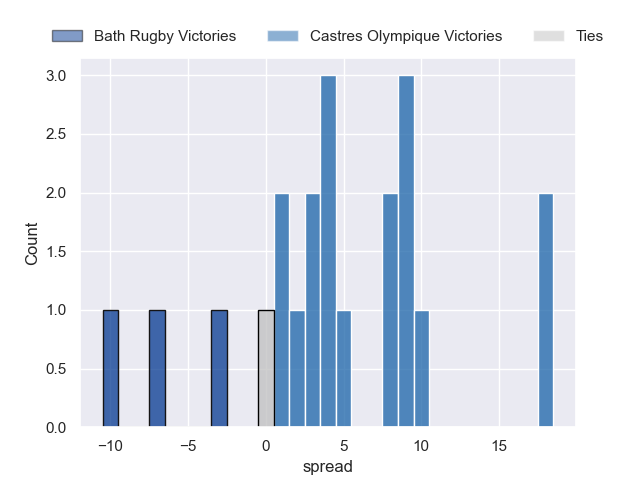

### Northampton Saints V Clermont Auvergne on 2025/04/04

Average Margin: Northampton Saints by 8.5

### Northampton Saints V Leicester Tigers on 2025/04/04

Average Margin: Northampton Saints by 3.7

### Benetton Treviso V Northampton Saints on 2025/04/04

Average Margin: Benetton Treviso by 9.4

### Toulon V Sale Sharks on 2025/04/04

Average Margin: Toulon by 6.8

### Glasgow Warriors V Sharks on 2025/04/04

Average Margin: Glasgow Warriors by 6.2

### Castres Olympique V Munster on 2025/04/04

Average Margin: Castres Olympique by 1.3

### Toulon V Bristol Rugby on 2025/04/04

Average Margin: Toulon by 8.4

### Leicester Tigers V Stormers on 2025/04/04

Average Margin: Leicester Tigers by 4.2

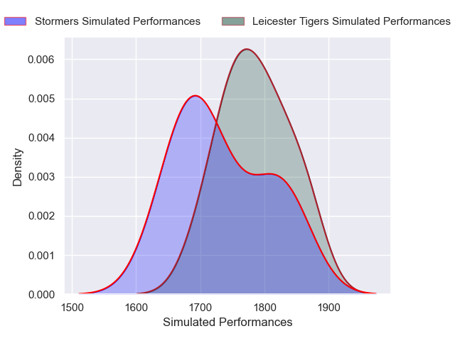

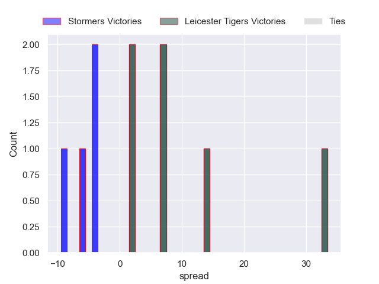

### Glasgow Warriors V Harlequins on 2025/04/04

Average Margin: Glasgow Warriors by 11.5

### Saracens V Bristol Rugby on 2025/04/04

Average Margin: Saracens by 3.3

### Munster V Stormers on 2025/04/04

Average Margin: Munster by 1.7

### Munster V Benetton Treviso on 2025/04/04

Average Margin: Munster by 2.6

### Toulon V La Rochelle on 2025/04/04

Average Margin: Toulon by 3.4

### Glasgow Warriors V Clermont Auvergne on 2025/04/04

Average Margin: Glasgow Warriors by 10.6

### Northampton Saints V Munster on 2025/04/04

Average Margin: Northampton Saints by 2.6

### Munster V Clermont Auvergne on 2025/04/04

Average Margin: Munster by 10.9

### Leinster V Saracens on 2025/04/04

Average Margin: Leinster by 8.1

### Stade Toulousain V Harlequins on 2025/04/04

Average Margin: Stade Toulousain by 7.0

### Northampton Saints V La Rochelle on 2025/04/04

Average Margin: Northampton Saints by 0.6

### Benetton Treviso V Leicester Tigers on 2025/04/04

Average Margin: Benetton Treviso by 9.3

### Saracens V La Rochelle on 2025/04/04

Average Margin: Saracens by 1.6

### Northampton Saints V Benetton Treviso on 2025/04/04

Average Margin: Benetton Treviso by 0.9

### Bordeaux Begles V Harlequins on 2025/04/04

Average Margin: Bordeaux Begles by 9.6

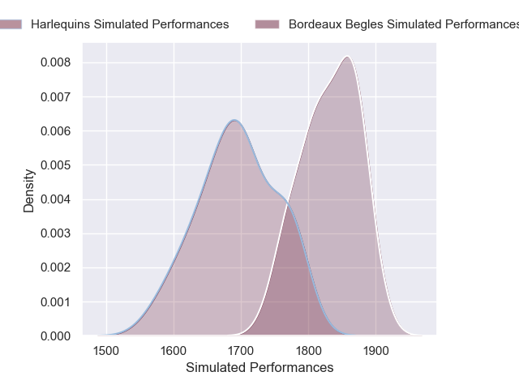
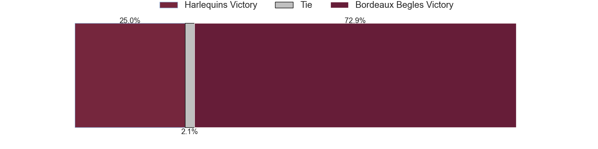
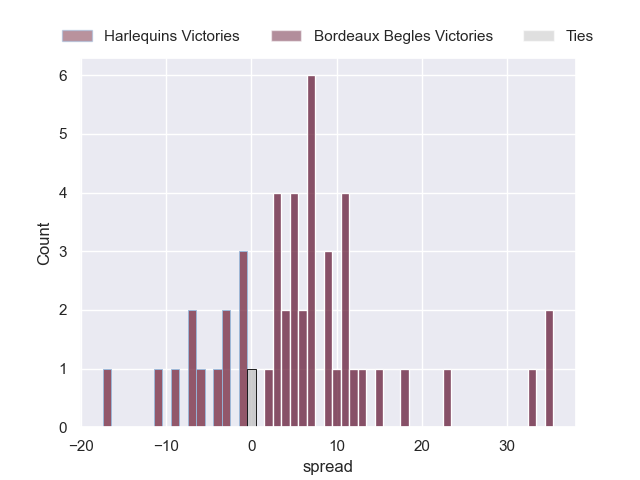

### Bordeaux Begles V Racing 92 on 2025/04/04

Average Margin: Bordeaux Begles by 9.1

### Northampton Saints V Sharks on 2025/04/04

Average Margin: Northampton Saints by 0.9

### Leinster V Munster on 2025/04/04

Average Margin: Leinster by 2.4

### Castres Olympique V Northampton Saints on 2025/04/04

Average Margin: Castres Olympique by 6.7

### Northampton Saints V Saracens on 2025/04/04

Average Margin: Northampton Saints by 6.0

### Leinster V Stormers on 2025/04/04

Average Margin: Leinster by 2.9

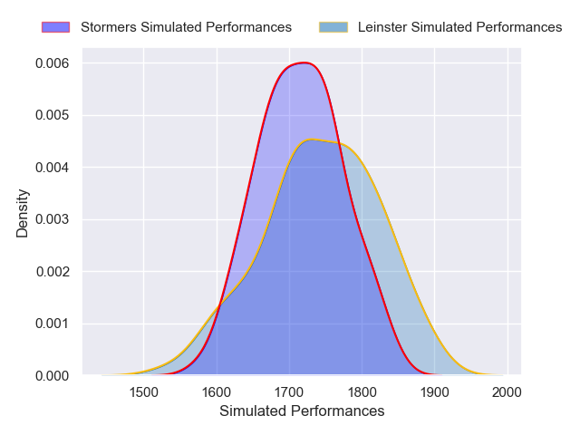

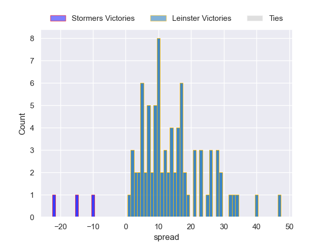

### Munster V Northampton Saints on 2025/04/04

Average Margin: Munster by 10.0

### Saracens V Stormers on 2025/04/04

Average Margin: Saracens by 0.5

### Toulon V Castres Olympique on 2025/04/04

Average Margin: Toulon by 6.8

### Benetton Treviso V Stade Toulousain on 2025/04/04

Average Margin: Benetton Treviso by 6.4

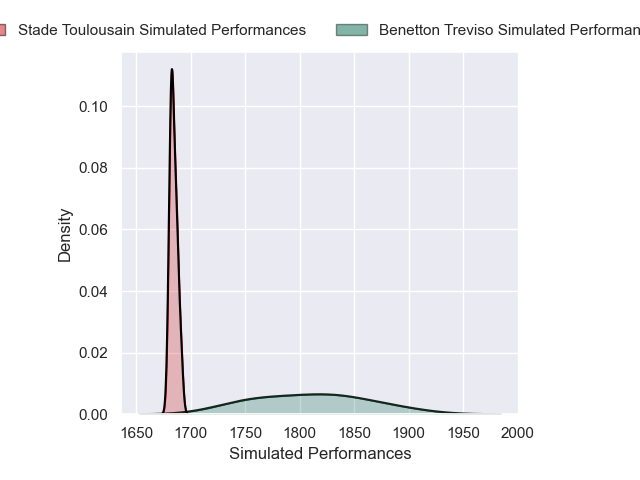

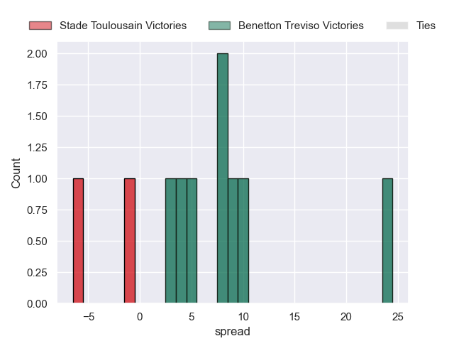

### Toulon V Leicester Tigers on 2025/04/04

Average Margin: Toulon by 6.9

### Bordeaux Begles V Saracens on 2025/04/04

Average Margin: Bordeaux Begles by 9.6

### Stade Toulousain V Munster on 2025/04/04

Average Margin: Stade Toulousain by 2.2

### Saracens V Bath Rugby on 2025/04/04

Average Margin: Saracens by 3.3

### Glasgow Warriors V Racing 92 on 2025/04/04

Average Margin: Glasgow Warriors by 10.0

### Stade Toulousain V Sale Sharks on 2025/04/04

Average Margin: Stade Toulousain by 9.3

### Saracens V Clermont Auvergne on 2025/04/04

Average Margin: Saracens by 6.3

### Bordeaux Begles V Castres Olympique on 2025/04/04

Average Margin: Bordeaux Begles by 6.2

### Bordeaux Begles V Northampton Saints on 2025/04/04

Average Margin: Bordeaux Begles by 8.4

### Leinster V Bath Rugby on 2025/04/04

Average Margin: Leinster by 9.4

### Toulon V Northampton Saints on 2025/04/04

Average Margin: Toulon by 7.8

### Saracens V Munster on 2025/04/04

Average Margin: Munster by 0.6

### Toulon V Stade Toulousain on 2025/04/04

Average Margin: Toulon by 6.7

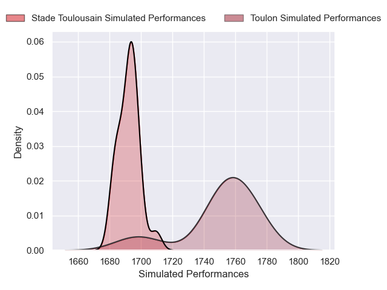
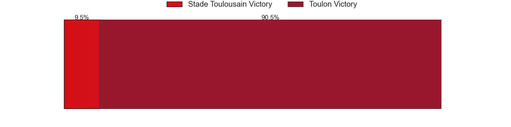
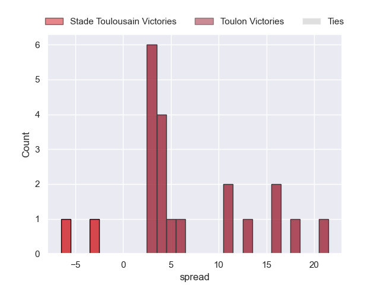

### Toulon V Stormers on 2025/04/04

Average Margin: Toulon by 2.5

### La Rochelle V Harlequins on 2025/04/04

Average Margin: La Rochelle by 12.2

### Glasgow Warriors V Leicester Tigers on 2025/04/04

Average Margin: Glasgow Warriors by 9.0

### Stade Toulousain V Sharks on 2025/04/04

Average Margin: Stade Toulousain by 2.4

### Bordeaux Begles V Leicester Tigers on 2025/04/04

Average Margin: Bordeaux Begles by 9.3

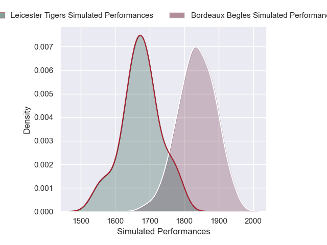
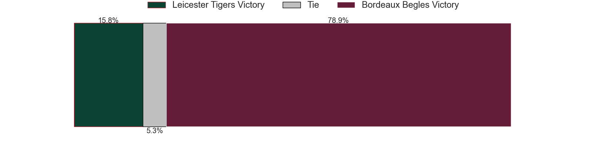
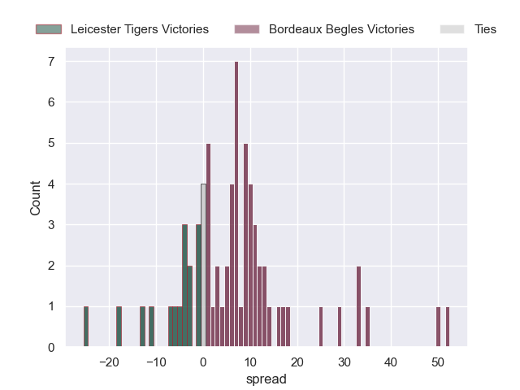

### La Rochelle V Stormers on 2025/04/04

Average Margin: La Rochelle by 5.5

### Bordeaux Begles V Bristol Rugby on 2025/04/04

Average Margin: Bordeaux Begles by 8.4

### Leinster V Benetton Treviso on 2025/04/04

Average Margin: Leinster by 1.8

### Glasgow Warriors V Sale Sharks on 2025/04/04

Average Margin: Glasgow Warriors by 12.5

### Toulon V Munster on 2025/04/04

Average Margin: Toulon by 4.2

### Munster V Leicester Tigers on 2025/04/04

Average Margin: Munster by 11.0

### Saracens V Castres Olympique on 2025/04/04

Average Margin: Saracens by 5.2

### La Rochelle V Bristol Rugby on 2025/04/04

Average Margin: La Rochelle by 8.0

### La Rochelle V Castres Olympique on 2025/04/04

Average Margin: La Rochelle by 5.6

### Bordeaux Begles V Sharks on 2025/04/04

Average Margin: Bordeaux Begles by 5.5

### Saracens V Leicester Tigers on 2025/04/04

Average Margin: Saracens by 5.7

### Northampton Saints V Bristol Rugby on 2025/04/04

Average Margin: Northampton Saints by 3.5

### Toulon V Saracens on 2025/04/04

Average Margin: Toulon by 7.6

### Stade Toulousain V Stormers on 2025/04/04

Average Margin: Stade Toulousain by 2.5

### Leinster V Leicester Tigers on 2025/04/04

Average Margin: Leinster by 4.5

### Stade Toulousain V Castres Olympique on 2025/04/04

Average Margin: Stade Toulousain by 4.2

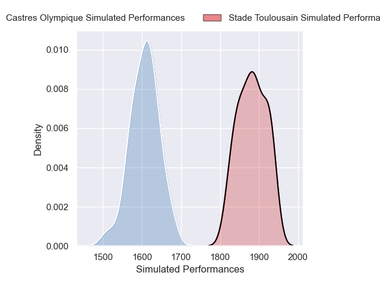
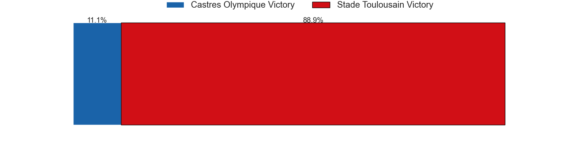
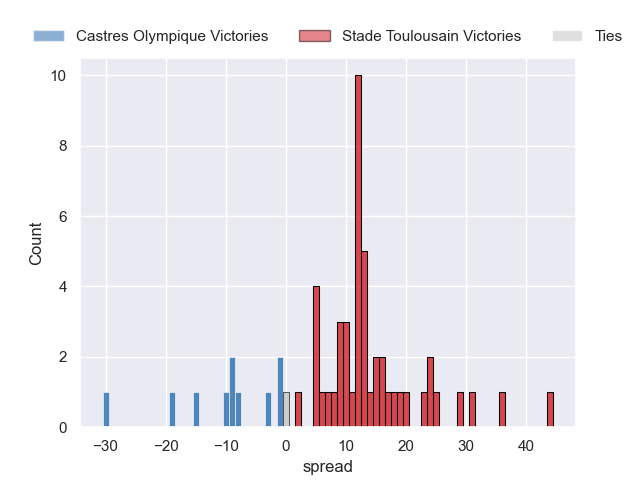

### Glasgow Warriors V Stormers on 2025/04/04

Average Margin: Glasgow Warriors by 5.2

### Leicester Tigers V Munster on 2025/04/04

Average Margin: Leicester Tigers by 6.2

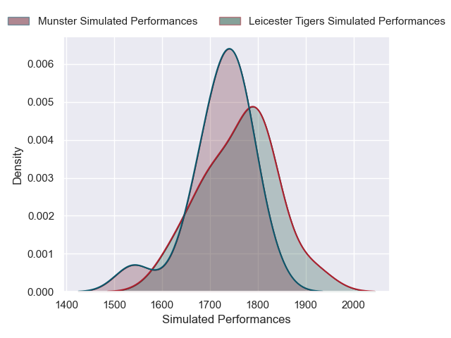

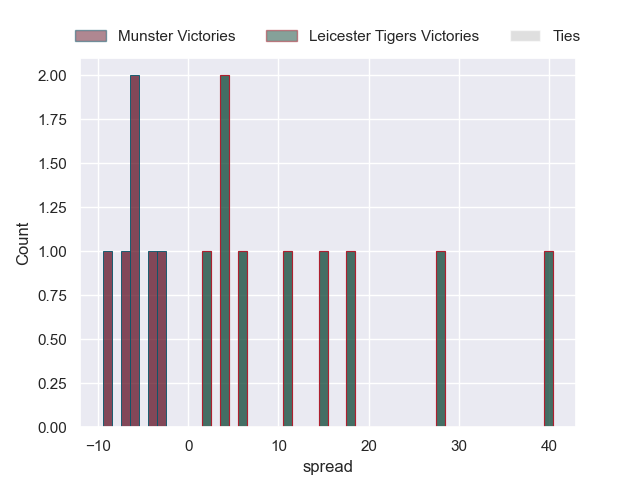

### Munster V Saracens on 2025/04/04

Average Margin: Munster by 9.5

### Stade Toulousain V Bristol Rugby on 2025/04/04

Average Margin: Stade Toulousain by 4.1

### Castres Olympique V Leicester Tigers on 2025/04/04

Average Margin: Castres Olympique by 9.2

### La Rochelle V Munster on 2025/04/04

Average Margin: La Rochelle by 5.5

### Toulon V Benetton Treviso on 2025/04/04

Average Margin: Toulon by 2.4

### Munster V Sale Sharks on 2025/04/04

Average Margin: Munster by 8.2

### Leinster V Northampton Saints on 2025/04/04

Average Margin: Leinster by 7.9

### Bordeaux Begles V Munster on 2025/04/04

Average Margin: Bordeaux Begles by 3.0

### Stade Toulousain V Clermont Auvergne on 2025/04/04

Average Margin: Stade Toulousain by 12.8

### La Rochelle V Saracens on 2025/04/04

Average Margin: La Rochelle by 9.7

### Toulon V Bath Rugby on 2025/04/04

Average Margin: Toulon by 9.4

### Stade Toulousain V Racing 92 on 2025/04/04

Average Margin: Stade Toulousain by 8.4

### Glasgow Warriors V Benetton Treviso on 2025/04/04

Average Margin: Glasgow Warriors by 4.2

### Toulon V Clermont Auvergne on 2025/04/04

Average Margin: Toulon by 10.0

### Northampton Saints V Castres Olympique on 2025/04/04

Average Margin: Northampton Saints by 5.4

## Quarterfinals

### La Rochelle V Benetton Treviso on 2025/04/11

Average Margin: La Rochelle by 3.1

### Toulon V Bath Rugby on 2025/04/11

Average Margin: Toulon by 9.4

### Leicester Tigers V Munster on 2025/04/11

Average Margin: Leicester Tigers by 6.2

### Stade Toulousain V Racing 92 on 2025/04/11

Average Margin: Stade Toulousain by 8.4

### Glasgow Warriors V Stormers on 2025/04/11

Average Margin: Glasgow Warriors by 5.2

### Stade Toulousain V Stormers on 2025/04/11

Average Margin: Stade Toulousain by 2.5

### Toulon V Northampton Saints on 2025/04/11

Average Margin: Toulon by 7.8

### Saracens V Stormers on 2025/04/11

Average Margin: Saracens by 0.5

### Munster V Leinster on 2025/04/11

Average Margin: Munster by 13.1

### Leicester Tigers V Stormers on 2025/04/11

Average Margin: Leicester Tigers by 4.2

### Glasgow Warriors V Clermont Auvergne on 2025/04/11

Average Margin: Glasgow Warriors by 10.6

### Munster V Northampton Saints on 2025/04/11

Average Margin: Munster by 10.0

### Glasgow Warriors V Bath Rugby on 2025/04/11

Average Margin: Glasgow Warriors by 9.6

### Toulon V Benetton Treviso on 2025/04/11

Average Margin: Toulon by 2.4

### Toulon V Clermont Auvergne on 2025/04/11

Average Margin: Toulon by 10.0

### Munster V Harlequins on 2025/04/11

Average Margin: Munster by 9.5

### Toulon V Sharks on 2025/04/11

Average Margin: Toulon by 1.7

### La Rochelle V Leicester Tigers on 2025/04/11

Average Margin: La Rochelle by 8.7

### Northampton Saints V Glasgow Warriors on 2025/04/11

Average Margin: Glasgow Warriors by 0.8

### Toulon V Leinster on 2025/04/11

Average Margin: Toulon by 1.5

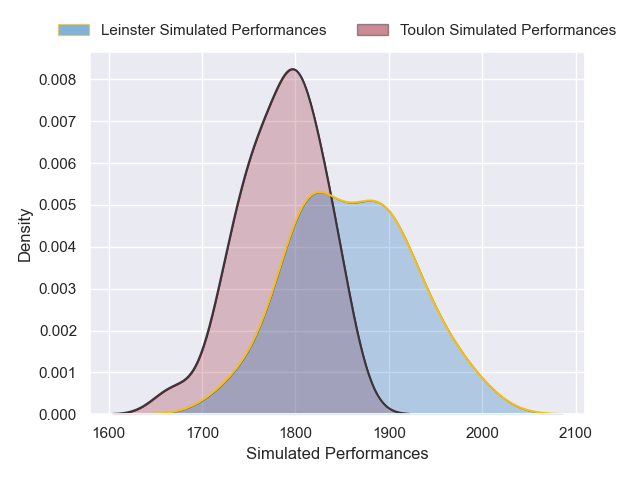

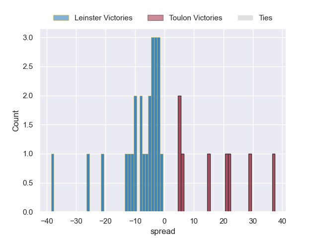

### Castres Olympique V Saracens on 2025/04/11

Average Margin: Castres Olympique by 8.5

### Leinster V Clermont Auvergne on 2025/04/11

Average Margin: Leinster by 9.4

### Castres Olympique V Munster on 2025/04/11

Average Margin: Castres Olympique by 1.3

### La Rochelle V Clermont Auvergne on 2025/04/11

Average Margin: La Rochelle by 10.4

### Northampton Saints V Harlequins on 2025/04/11

Average Margin: Northampton Saints by 8.2

### Saracens V Benetton Treviso on 2025/04/11

Average Margin: Benetton Treviso by 2.3

### Glasgow Warriors V Harlequins on 2025/04/11

Average Margin: Glasgow Warriors by 11.5

### La Rochelle V Glasgow Warriors on 2025/04/11

Average Margin: La Rochelle by 5.3

### Munster V Sharks on 2025/04/11

Average Margin: Munster by 5.3

### Saracens V Harlequins on 2025/04/11

Average Margin: Saracens by 5.4

### La Rochelle V Harlequins on 2025/04/11

Average Margin: La Rochelle by 12.2

### Northampton Saints V Leicester Tigers on 2025/04/11

Average Margin: Northampton Saints by 3.7

### Saracens V Leicester Tigers on 2025/04/11

Average Margin: Saracens by 5.7

### Munster V Sale Sharks on 2025/04/11

Average Margin: Munster by 8.2

### Leicester Tigers V Northampton Saints on 2025/04/11

Average Margin: Northampton Saints by 4.7

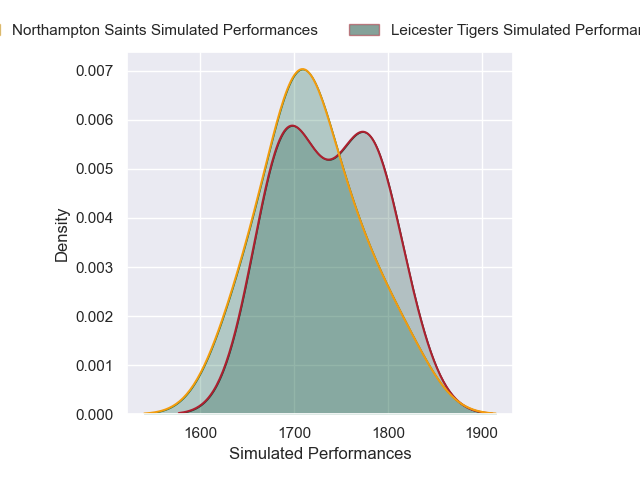

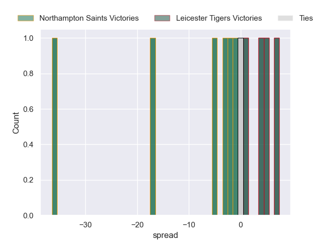

### Northampton Saints V Munster on 2025/04/11

Average Margin: Northampton Saints by 2.6

### Munster V Clermont Auvergne on 2025/04/11

Average Margin: Munster by 10.9

### Saracens V Castres Olympique on 2025/04/11

Average Margin: Saracens by 5.2

### Leinster V Sale Sharks on 2025/04/11

Average Margin: Leinster by 6.4

### Castres Olympique V Northampton Saints on 2025/04/11

Average Margin: Castres Olympique by 6.7

### Munster V Stormers on 2025/04/11

Average Margin: Munster by 1.7

### Benetton Treviso V Leicester Tigers on 2025/04/11

Average Margin: Benetton Treviso by 9.3

### Glasgow Warriors V Sale Sharks on 2025/04/11

Average Margin: Glasgow Warriors by 12.5

### Northampton Saints V Castres Olympique on 2025/04/11

Average Margin: Northampton Saints by 5.4

### Castres Olympique V Benetton Treviso on 2025/04/11

Average Margin: Castres Olympique by 0.5

### Northampton Saints V Benetton Treviso on 2025/04/11

Average Margin: Benetton Treviso by 0.9

### Castres Olympique V Glasgow Warriors on 2025/04/11

Average Margin: Glasgow Warriors by 0.6

### Glasgow Warriors V Bordeaux Begles on 2025/04/11

Average Margin: Glasgow Warriors by 5.3

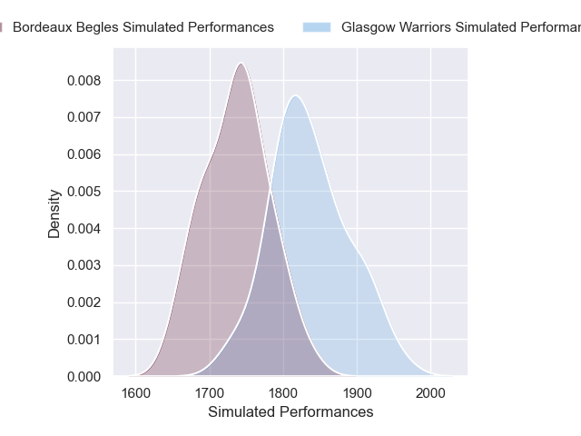
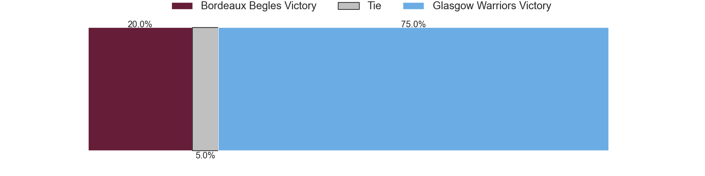
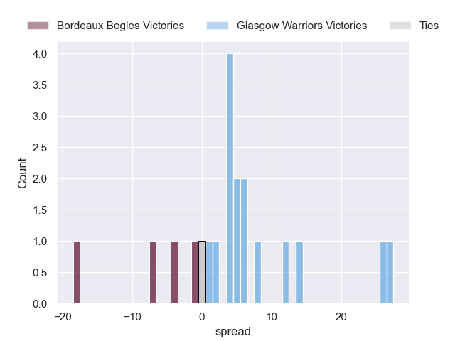

### Toulon V Bordeaux Begles on 2025/04/11

Average Margin: Bordeaux Begles by 0.6

### Northampton Saints V Sharks on 2025/04/11

Average Margin: Northampton Saints by 0.9

### Saracens V Bath Rugby on 2025/04/11

Average Margin: Saracens by 3.3

### Toulon V Sale Sharks on 2025/04/11

Average Margin: Toulon by 6.8

### Stade Toulousain V Bristol Rugby on 2025/04/11

Average Margin: Stade Toulousain by 4.1

### Northampton Saints V Clermont Auvergne on 2025/04/11

Average Margin: Northampton Saints by 8.5

### Leicester Tigers V Benetton Treviso on 2025/04/11

Average Margin: Leicester Tigers by 4.2

### Toulon V Stormers on 2025/04/11

Average Margin: Toulon by 2.5

### Munster V Glasgow Warriors on 2025/04/11

Average Margin: Munster by 6.3

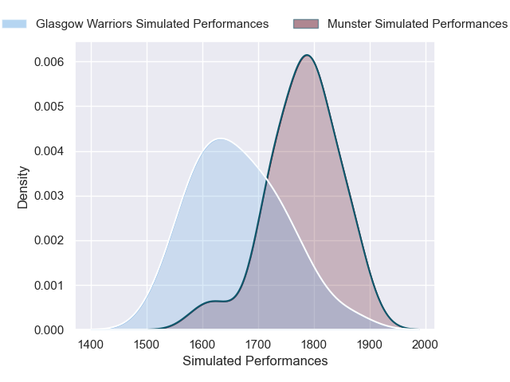
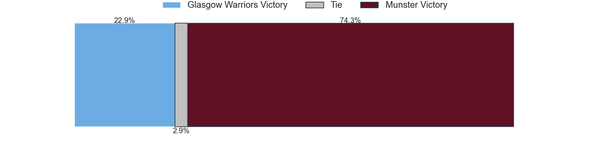
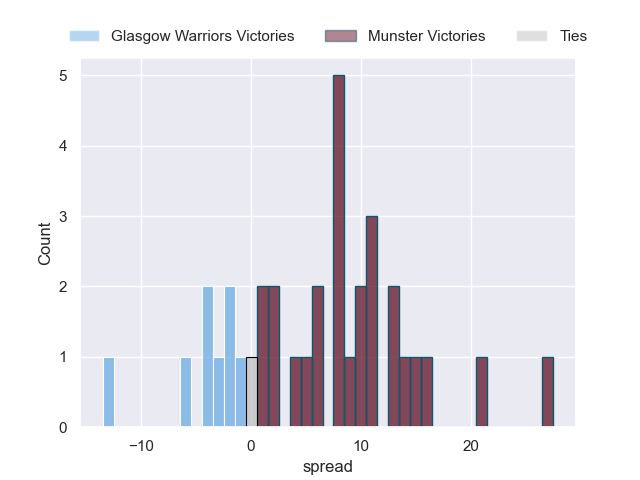

### Saracens V Northampton Saints on 2025/04/11

Average Margin: Saracens by 3.1

### Leicester Tigers V Glasgow Warriors on 2025/04/11

Average Margin: Glasgow Warriors by 2.2

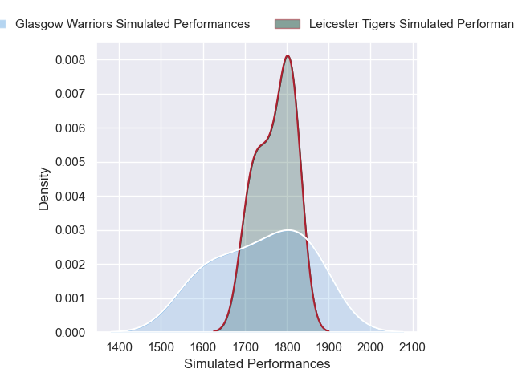

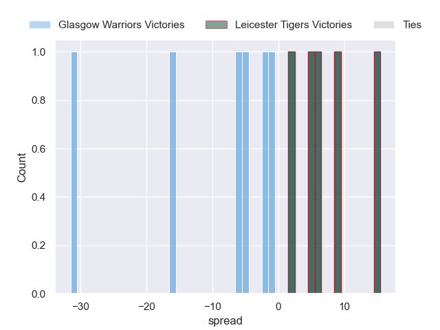

### Bordeaux Begles V Harlequins on 2025/04/11

Average Margin: Bordeaux Begles by 9.6

### Bath Rugby V Leicester Tigers on 2025/04/11

Average Margin: Bath Rugby by 4.6

### Glasgow Warriors V Stade Toulousain on 2025/04/11

Average Margin: Glasgow Warriors by 7.2

### Toulon V Racing 92 on 2025/04/11

Average Margin: Toulon by 6.8

### La Rochelle V Castres Olympique on 2025/04/11

Average Margin: La Rochelle by 5.6

### Toulon V Bristol Rugby on 2025/04/11

Average Margin: Toulon by 8.4

### Leinster V Bristol Rugby on 2025/04/11

Average Margin: Leinster by 8.5

### Toulon V Stade Toulousain on 2025/04/11

Average Margin: Toulon by 6.7

### Castres Olympique V La Rochelle on 2025/04/11

Average Margin: Castres Olympique by 3.0

### Northampton Saints V Toulon on 2025/04/11

Average Margin: Northampton Saints by 1.5

### Northampton Saints V Stormers on 2025/04/11

Average Margin: Stormers by 0.6

### Glasgow Warriors V Leicester Tigers on 2025/04/11

Average Margin: Glasgow Warriors by 9.0

### Leinster V Bath Rugby on 2025/04/11

Average Margin: Leinster by 9.4

### Stade Toulousain V Toulon on 2025/04/11

Average Margin: Stade Toulousain by 2.6

### Bordeaux Begles V Leicester Tigers on 2025/04/11

Average Margin: Bordeaux Begles by 9.3

### Leinster V Stormers on 2025/04/11

Average Margin: Leinster by 2.9

### La Rochelle V Northampton Saints on 2025/04/11

Average Margin: La Rochelle by 8.6

### Glasgow Warriors V Castres Olympique on 2025/04/11

Average Margin: Glasgow Warriors by 7.3

### Glasgow Warriors V Benetton Treviso on 2025/04/11

Average Margin: Glasgow Warriors by 4.2

### Bordeaux Begles V Northampton Saints on 2025/04/11

Average Margin: Bordeaux Begles by 8.4

### Stade Toulousain V Munster on 2025/04/11

Average Margin: Stade Toulousain by 2.2

### Northampton Saints V La Rochelle on 2025/04/11

Average Margin: Northampton Saints by 0.6

### Bordeaux Begles V Castres Olympique on 2025/04/11

Average Margin: Bordeaux Begles by 6.2

### Bordeaux Begles V Munster on 2025/04/11

Average Margin: Bordeaux Begles by 3.0

### Stade Toulousain V Northampton Saints on 2025/04/11

Average Margin: Stade Toulousain by 5.5

### Stade Toulousain V Saracens on 2025/04/11

Average Margin: Stade Toulousain by 6.9

### Bordeaux Begles V Benetton Treviso on 2025/04/11

Average Margin: Bordeaux Begles by 3.3

### Glasgow Warriors V Saracens on 2025/04/11

Average Margin: Glasgow Warriors by 9.8

### Bordeaux Begles V La Rochelle on 2025/04/11

Average Margin: Bordeaux Begles by 4.5

### Bordeaux Begles V Leinster on 2025/04/11

Average Margin: Bordeaux Begles by 1.6

### Toulon V Munster on 2025/04/11

Average Margin: Toulon by 4.2

### Leinster V La Rochelle on 2025/04/11

Average Margin: Leinster by 3.5

### Toulon V Leicester Tigers on 2025/04/11

Average Margin: Toulon by 6.9

### Bordeaux Begles V Sale Sharks on 2025/04/11

Average Margin: Bordeaux Begles by 7.7

### Munster V La Rochelle on 2025/04/11

Average Margin: Munster by 0.8

### Leinster V Leicester Tigers on 2025/04/11

Average Margin: Leinster by 4.5

### Glasgow Warriors V Racing 92 on 2025/04/11

Average Margin: Glasgow Warriors by 10.0

### Stade Toulousain V Glasgow Warriors on 2025/04/11

Average Margin: Glasgow Warriors by 0.5

### Stade Toulousain V Sale Sharks on 2025/04/11

Average Margin: Stade Toulousain by 9.3

### Munster V Leicester Tigers on 2025/04/11

Average Margin: Munster by 11.0

### Bordeaux Begles V Racing 92 on 2025/04/11

Average Margin: Bordeaux Begles by 9.1

### Toulon V Saracens on 2025/04/11

Average Margin: Toulon by 7.6

### Bordeaux Begles V Saracens on 2025/04/11

Average Margin: Bordeaux Begles by 9.6

### Glasgow Warriors V Toulon on 2025/04/11

Average Margin: Glasgow Warriors by 7.6

### Stade Toulousain V Leicester Tigers on 2025/04/11

Average Margin: Stade Toulousain by 5.5

### Toulon V La Rochelle on 2025/04/11

Average Margin: Toulon by 3.4

### Leinster V Northampton Saints on 2025/04/11

Average Margin: Leinster by 7.9

### Bordeaux Begles V Stormers on 2025/04/11

Average Margin: Bordeaux Begles by 3.0

### Stade Toulousain V Leinster on 2025/04/11

Average Margin: Stade Toulousain by 2.1

### Munster V Saracens on 2025/04/11

Average Margin: Munster by 9.5

### Glasgow Warriors V La Rochelle on 2025/04/11

Average Margin: Glasgow Warriors by 3.6

### Bordeaux Begles V Toulon on 2025/04/11

Average Margin: Bordeaux Begles by 5.3

### Glasgow Warriors V Bristol Rugby on 2025/04/11

Average Margin: Glasgow Warriors by 9.1

### Northampton Saints V Saracens on 2025/04/11

Average Margin: Northampton Saints by 6.0

### La Rochelle V Munster on 2025/04/11

Average Margin: La Rochelle by 5.5

### Leinster V Sharks on 2025/04/11

Average Margin: Leinster by 1.5

### Stade Toulousain V Castres Olympique on 2025/04/11

Average Margin: Stade Toulousain by 4.2

### La Rochelle V Saracens on 2025/04/11

Average Margin: La Rochelle by 9.7

### Toulon V Glasgow Warriors on 2025/04/11

Average Margin: Toulon by 1.0

### Bordeaux Begles V Bath Rugby on 2025/04/11

Average Margin: Bordeaux Begles by 9.1

### Leinster V Toulon on 2025/04/11

Average Margin: Leinster by 4.0

### Glasgow Warriors V Sharks on 2025/04/11

Average Margin: Glasgow Warriors by 6.2

### La Rochelle V Bristol Rugby on 2025/04/11

Average Margin: La Rochelle by 8.0

### Saracens V Toulon on 2025/04/11

Average Margin: Saracens by 8.0

### Northampton Saints V Bath Rugby on 2025/04/11

Average Margin: Northampton Saints by 4.7

### Leinster V Saracens on 2025/04/11

Average Margin: Leinster by 8.1

### Glasgow Warriors V Northampton Saints on 2025/04/11

Average Margin: Glasgow Warriors by 7.0

### Leinster V Munster on 2025/04/11

Average Margin: Leinster by 2.4

### Stade Toulousain V La Rochelle on 2025/04/11

Average Margin: Stade Toulousain by 2.2

### La Rochelle V Toulon on 2025/04/11

Average Margin: Toulon by 6.1

### Saracens V Munster on 2025/04/11

Average Margin: Munster by 0.6

### Leinster V Glasgow Warriors on 2025/04/11

Average Margin: Leinster by 1.4

### Stade Toulousain V Sharks on 2025/04/11

Average Margin: Stade Toulousain by 2.4

### Glasgow Warriors V Munster on 2025/04/11

Average Margin: Glasgow Warriors by 5.6

### Saracens V La Rochelle on 2025/04/11

Average Margin: Saracens by 1.6

### Bordeaux Begles V Bristol Rugby on 2025/04/11

Average Margin: Bordeaux Begles by 8.4

### Munster V Toulon on 2025/04/11

Average Margin: Munster by 6.1

### Glasgow Warriors V Leinster on 2025/04/11

Average Margin: Glasgow Warriors by 5.6

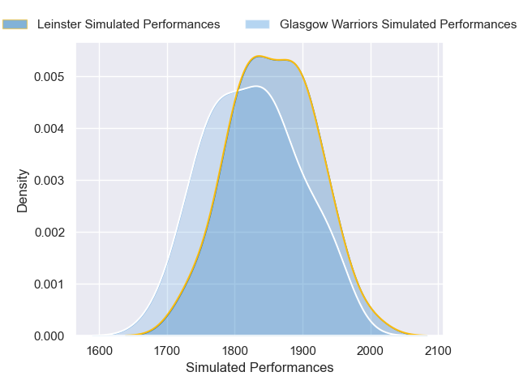
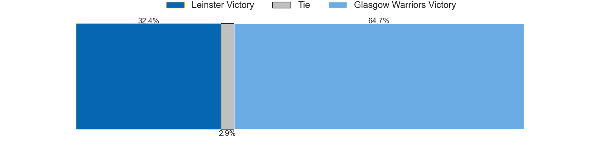
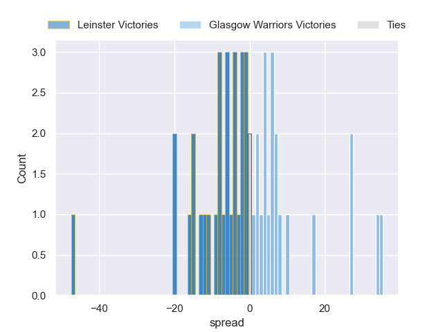

### Stade Toulousain V Benetton Treviso on 2025/04/11

Average Margin: Stade Toulousain by 0.5

### Toulon V Harlequins on 2025/04/11

Average Margin: Toulon by 7.4

### Stade Toulousain V Clermont Auvergne on 2025/04/11

Average Margin: Stade Toulousain by 12.8

### Munster V Benetton Treviso on 2025/04/11

Average Margin: Munster by 2.6

### Leinster V Racing 92 on 2025/04/11

Average Margin: Leinster by 6.5

### Stade Toulousain V Harlequins on 2025/04/11

Average Margin: Stade Toulousain by 7.0

### Northampton Saints V Leinster on 2025/04/11

Average Margin: Northampton Saints by 7.0

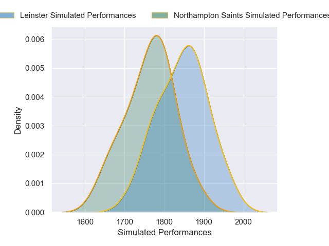
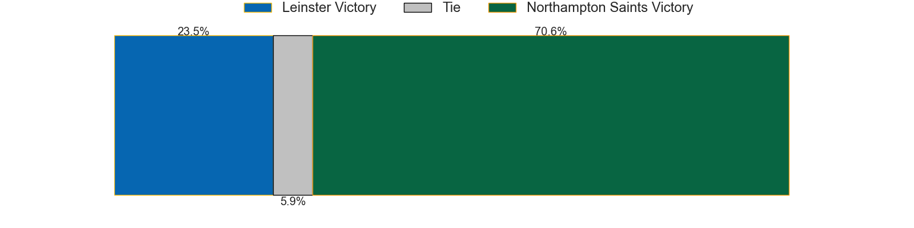
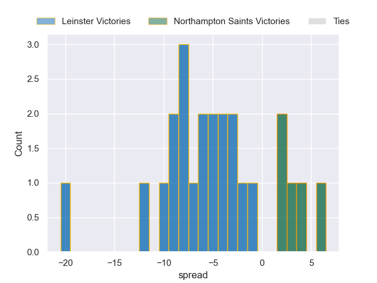

### Bordeaux Begles V Glasgow Warriors on 2025/04/11

Average Margin: Bordeaux Begles by 2.3

### Toulon V Castres Olympique on 2025/04/11

Average Margin: Toulon by 6.8

### Saracens V Glasgow Warriors on 2025/04/11

Average Margin: Glasgow Warriors by 1.4

### Bordeaux Begles V Sharks on 2025/04/11

Average Margin: Bordeaux Begles by 5.5

### Stade Toulousain V Bath Rugby on 2025/04/11

Average Margin: Stade Toulousain by 5.4

### Bordeaux Begles V Clermont Auvergne on 2025/04/11

Average Margin: Bordeaux Begles by 11.4

### Leinster V Benetton Treviso on 2025/04/11

Average Margin: Leinster by 1.8

### Munster V Castres Olympique on 2025/04/11

Average Margin: Munster by 6.7

### Leinster V Harlequins on 2025/04/11

Average Margin: Leinster by 8.8

### Leinster V Castres Olympique on 2025/04/11

Average Margin: Leinster by 4.4

## Semifinals

### Leicester Tigers V Benetton Treviso on 2025/05/02

Average Margin: Leicester Tigers by 4.2

### Bordeaux Begles V Leicester Tigers on 2025/05/02

Average Margin: Bordeaux Begles by 9.3

### Stade Toulousain V Saracens on 2025/05/02

Average Margin: Stade Toulousain by 6.9

### Northampton Saints V Sharks on 2025/05/02

Average Margin: Northampton Saints by 0.9

### Toulon V Benetton Treviso on 2025/05/02

Average Margin: Toulon by 2.4

### La Rochelle V Northampton Saints on 2025/05/02

Average Margin: La Rochelle by 8.6

### Northampton Saints V Saracens on 2025/05/02

Average Margin: Northampton Saints by 6.0

### Toulon V Racing 92 on 2025/05/02

Average Margin: Toulon by 6.8

### Glasgow Warriors V Bristol Rugby on 2025/05/02

Average Margin: Glasgow Warriors by 9.1

### Bordeaux Begles V Sharks on 2025/05/02

Average Margin: Bordeaux Begles by 5.5

### Glasgow Warriors V Leicester Tigers on 2025/05/02

Average Margin: Glasgow Warriors by 9.0

### Northampton Saints V Toulon on 2025/05/02

Average Margin: Northampton Saints by 1.5

### Munster V Leinster on 2025/05/02

Average Margin: Munster by 13.1

### Northampton Saints V Harlequins on 2025/05/02

Average Margin: Northampton Saints by 8.2

### Bordeaux Begles V Bath Rugby on 2025/05/02

Average Margin: Bordeaux Begles by 9.1

### Leinster V Toulon on 2025/05/02

Average Margin: Leinster by 4.0

### Leinster V Stormers on 2025/05/02

Average Margin: Leinster by 2.9

### Munster V Sharks on 2025/05/02

Average Margin: Munster by 5.3

### Stade Toulousain V Leicester Tigers on 2025/05/02

Average Margin: Stade Toulousain by 5.5

### Glasgow Warriors V Munster on 2025/05/02

Average Margin: Glasgow Warriors by 5.6

### Bordeaux Begles V Munster on 2025/05/02

Average Margin: Bordeaux Begles by 3.0

### Toulon V Munster on 2025/05/02

Average Margin: Toulon by 4.2

### Stade Toulousain V Glasgow Warriors on 2025/05/02

Average Margin: Glasgow Warriors by 0.5

### La Rochelle V Toulon on 2025/05/02

Average Margin: Toulon by 6.1

### Leinster V Munster on 2025/05/02

Average Margin: Leinster by 2.4

### Stade Toulousain V Harlequins on 2025/05/02

Average Margin: Stade Toulousain by 7.0

### Stade Toulousain V Stormers on 2025/05/02

Average Margin: Stade Toulousain by 2.5

### Northampton Saints V Glasgow Warriors on 2025/05/02

Average Margin: Glasgow Warriors by 0.8

### Northampton Saints V La Rochelle on 2025/05/02

Average Margin: Northampton Saints by 0.6

### Leinster V Castres Olympique on 2025/05/02

Average Margin: Leinster by 4.4

### Leinster V Sale Sharks on 2025/05/02

Average Margin: Leinster by 6.4

### Toulon V Bordeaux Begles on 2025/05/02

Average Margin: Bordeaux Begles by 0.6

### La Rochelle V Saracens on 2025/05/02

Average Margin: La Rochelle by 9.7

### Leinster V Glasgow Warriors on 2025/05/02

Average Margin: Leinster by 1.4

### Bordeaux Begles V Castres Olympique on 2025/05/02

Average Margin: Bordeaux Begles by 6.2

### Toulon V Leinster on 2025/05/02

Average Margin: Toulon by 1.5

### Leinster V Racing 92 on 2025/05/02

Average Margin: Leinster by 6.5

### Toulon V Glasgow Warriors on 2025/05/02

Average Margin: Toulon by 1.0

### Bordeaux Begles V Glasgow Warriors on 2025/05/02

Average Margin: Bordeaux Begles by 2.3

### Saracens V Toulon on 2025/05/02

Average Margin: Saracens by 8.0

### Stade Toulousain V La Rochelle on 2025/05/02

Average Margin: Stade Toulousain by 2.2

### Glasgow Warriors V La Rochelle on 2025/05/02

Average Margin: Glasgow Warriors by 3.6

### Glasgow Warriors V Toulon on 2025/05/02

Average Margin: Glasgow Warriors by 7.6

### Castres Olympique V La Rochelle on 2025/05/02

Average Margin: Castres Olympique by 3.0

### Saracens V Glasgow Warriors on 2025/05/02

Average Margin: Glasgow Warriors by 1.4

### Leinster V Harlequins on 2025/05/02

Average Margin: Leinster by 8.8

### Northampton Saints V Leinster on 2025/05/02

Average Margin: Northampton Saints by 7.0

### Leinster V Benetton Treviso on 2025/05/02

Average Margin: Leinster by 1.8

### Munster V Toulon on 2025/05/02

Average Margin: Munster by 6.1

### La Rochelle V Glasgow Warriors on 2025/05/02

Average Margin: La Rochelle by 5.3

### Saracens V Stormers on 2025/05/02

Average Margin: Saracens by 0.5

### Stade Toulousain V Benetton Treviso on 2025/05/02

Average Margin: Stade Toulousain by 0.5

### Toulon V Northampton Saints on 2025/05/02

Average Margin: Toulon by 7.8

### Stade Toulousain V Sharks on 2025/05/02

Average Margin: Stade Toulousain by 2.4

### Glasgow Warriors V Stormers on 2025/05/02

Average Margin: Glasgow Warriors by 5.2

### Stade Toulousain V Bath Rugby on 2025/05/02

Average Margin: Stade Toulousain by 5.4

### Munster V Northampton Saints on 2025/05/02

Average Margin: Munster by 10.0

### Saracens V Bath Rugby on 2025/05/02

Average Margin: Saracens by 3.3

### Glasgow Warriors V Harlequins on 2025/05/02

Average Margin: Glasgow Warriors by 11.5

### Toulon V Saracens on 2025/05/02

Average Margin: Toulon by 7.6

### Leinster V Bristol Rugby on 2025/05/02

Average Margin: Leinster by 8.5

### Stade Toulousain V Clermont Auvergne on 2025/05/02

Average Margin: Stade Toulousain by 12.8

### Northampton Saints V Stormers on 2025/05/02

Average Margin: Stormers by 0.6

### Northampton Saints V Benetton Treviso on 2025/05/02

Average Margin: Benetton Treviso by 0.9

### Munster V Benetton Treviso on 2025/05/02

Average Margin: Munster by 2.6

### Leicester Tigers V Munster on 2025/05/02

Average Margin: Leicester Tigers by 6.2

### Munster V La Rochelle on 2025/05/02

Average Margin: Munster by 0.8

### Northampton Saints V Castres Olympique on 2025/05/02

Average Margin: Northampton Saints by 5.4

### Glasgow Warriors V Stade Toulousain on 2025/05/02

Average Margin: Glasgow Warriors by 7.2

### Bordeaux Begles V Benetton Treviso on 2025/05/02

Average Margin: Bordeaux Begles by 3.3

### Stade Toulousain V Bristol Rugby on 2025/05/02

Average Margin: Stade Toulousain by 4.1

### Bordeaux Begles V Stade Toulousain on 2025/05/02

Average Margin: Bordeaux Begles by 2.5

### Glasgow Warriors V Castres Olympique on 2025/05/02

Average Margin: Glasgow Warriors by 7.3

### La Rochelle V Castres Olympique on 2025/05/02

Average Margin: La Rochelle by 5.6

### Munster V Glasgow Warriors on 2025/05/02

Average Margin: Munster by 6.3

### La Rochelle V Benetton Treviso on 2025/05/02

Average Margin: La Rochelle by 3.1

### Stade Toulousain V Castres Olympique on 2025/05/02

Average Margin: Stade Toulousain by 4.2

### Saracens V Bristol Rugby on 2025/05/02

Average Margin: Saracens by 3.3

### Bordeaux Begles V Saracens on 2025/05/02

Average Margin: Bordeaux Begles by 9.6

### Stade Toulousain V Sale Sharks on 2025/05/02

Average Margin: Stade Toulousain by 9.3

### Stade Toulousain V Leinster on 2025/05/02

Average Margin: Stade Toulousain by 2.1

### Stade Toulousain V Racing 92 on 2025/05/02

Average Margin: Stade Toulousain by 8.4

### Stade Toulousain V Munster on 2025/05/02

Average Margin: Stade Toulousain by 2.2

### Leicester Tigers V Glasgow Warriors on 2025/05/02

Average Margin: Glasgow Warriors by 2.2

### La Rochelle V Stormers on 2025/05/02

Average Margin: La Rochelle by 5.5

### Castres Olympique V Benetton Treviso on 2025/05/02

Average Margin: Castres Olympique by 0.5

### Leinster V Saracens on 2025/05/02

Average Margin: Leinster by 8.1

### Bordeaux Begles V Stormers on 2025/05/02

Average Margin: Bordeaux Begles by 3.0

### Toulon V Sharks on 2025/05/02

Average Margin: Toulon by 1.7

### Leicester Tigers V Northampton Saints on 2025/05/02

Average Margin: Northampton Saints by 4.7

### Stade Toulousain V Northampton Saints on 2025/05/02

Average Margin: Stade Toulousain by 5.5

### Toulon V Bath Rugby on 2025/05/02

Average Margin: Toulon by 9.4

### Northampton Saints V Munster on 2025/05/02

Average Margin: Northampton Saints by 2.6

### Glasgow Warriors V Bordeaux Begles on 2025/05/02

Average Margin: Glasgow Warriors by 5.3

### Toulon V Castres Olympique on 2025/05/02

Average Margin: Toulon by 6.8

### Toulon V Stade Toulousain on 2025/05/02

Average Margin: Toulon by 6.7

### Glasgow Warriors V Bath Rugby on 2025/05/02

Average Margin: Glasgow Warriors by 9.6

### Glasgow Warriors V Sharks on 2025/05/02

Average Margin: Glasgow Warriors by 6.2

### Glasgow Warriors V Saracens on 2025/05/02

Average Margin: Glasgow Warriors by 9.8

### Toulon V Stormers on 2025/05/02

Average Margin: Toulon by 2.5

### Glasgow Warriors V Benetton Treviso on 2025/05/02

Average Margin: Glasgow Warriors by 4.2

### Stade Toulousain V Toulon on 2025/05/02

Average Margin: Stade Toulousain by 2.6

### Glasgow Warriors V Leinster on 2025/05/02

Average Margin: Glasgow Warriors by 5.6

### Bordeaux Begles V Toulon on 2025/05/02

Average Margin: Bordeaux Begles by 5.3

### Bordeaux Begles V Northampton Saints on 2025/05/02

Average Margin: Bordeaux Begles by 8.4

### Saracens V Benetton Treviso on 2025/05/02

Average Margin: Benetton Treviso by 2.3

### Leinster V Sharks on 2025/05/02

Average Margin: Leinster by 1.5

### Leinster V Bath Rugby on 2025/05/02

Average Margin: Leinster by 9.4

### Leinster V Clermont Auvergne on 2025/05/02

Average Margin: Leinster by 9.4

### Saracens V La Rochelle on 2025/05/02

Average Margin: Saracens by 1.6

### Bordeaux Begles V Racing 92 on 2025/05/02

Average Margin: Bordeaux Begles by 9.1

### Munster V Saracens on 2025/05/02

Average Margin: Munster by 9.5

### Bordeaux Begles V Bristol Rugby on 2025/05/02

Average Margin: Bordeaux Begles by 8.4

### Bordeaux Begles V La Rochelle on 2025/05/02

Average Margin: Bordeaux Begles by 4.5

### Leinster V Stade Toulousain on 2025/05/02

Average Margin: Leinster by 3.1

### Leinster V La Rochelle on 2025/05/02

Average Margin: Leinster by 3.5

### Glasgow Warriors V Northampton Saints on 2025/05/02

Average Margin: Glasgow Warriors by 7.0

### Toulon V Harlequins on 2025/05/02

Average Margin: Toulon by 7.4

### Toulon V Leicester Tigers on 2025/05/02

Average Margin: Toulon by 6.9

### Bordeaux Begles V Leinster on 2025/05/02

Average Margin: Bordeaux Begles by 1.6

### Munster V Castres Olympique on 2025/05/02

Average Margin: Munster by 6.7

### Toulon V La Rochelle on 2025/05/02

Average Margin: Toulon by 3.4

### Leinster V Northampton Saints on 2025/05/02

Average Margin: Leinster by 7.9

### Leinster V Bordeaux Begles on 2025/05/02

Average Margin: Leinster by 0.3

### Bordeaux Begles V Harlequins on 2025/05/02

Average Margin: Bordeaux Begles by 9.6

### La Rochelle V Munster on 2025/05/02

Average Margin: La Rochelle by 5.5

### Munster V Harlequins on 2025/05/02

Average Margin: Munster by 9.5

### Munster V Stormers on 2025/05/02

Average Margin: Munster by 1.7

### Leinster V Leicester Tigers on 2025/05/02

Average Margin: Leinster by 4.5

### Stade Toulousain V Bordeaux Begles on 2025/05/02

Average Margin: Bordeaux Begles by 3.9

## Finals

### Toulon V Sharks on 2025/05/24

Average Margin: Toulon by 1.7

### Northampton Saints V Leinster on 2025/05/24

Average Margin: Northampton Saints by 7.0

### La Rochelle V Stormers on 2025/05/24

Average Margin: La Rochelle by 5.5

### Bordeaux Begles V Leicester Tigers on 2025/05/24

Average Margin: Bordeaux Begles by 9.3

### Munster V Leicester Tigers on 2025/05/24

Average Margin: Munster by 11.0

### Bordeaux Begles V Leinster on 2025/05/24

Average Margin: Bordeaux Begles by 1.6

### Glasgow Warriors V Bristol Rugby on 2025/05/24

Average Margin: Glasgow Warriors by 9.1

### Leicester Tigers V Northampton Saints on 2025/05/24

Average Margin: Northampton Saints by 4.7

### Northampton Saints V Benetton Treviso on 2025/05/24

Average Margin: Benetton Treviso by 0.9

### Toulon V Leicester Tigers on 2025/05/24

Average Margin: Toulon by 6.9

### Northampton Saints V Munster on 2025/05/24

Average Margin: Northampton Saints by 2.6

### Toulon V Stade Toulousain on 2025/05/24

Average Margin: Toulon by 6.7

### La Rochelle V Munster on 2025/05/24

Average Margin: La Rochelle by 5.5

### Leinster V Saracens on 2025/05/24

Average Margin: Leinster by 8.1

### Northampton Saints V Stormers on 2025/05/24

Average Margin: Stormers by 0.6

### Bordeaux Begles V Stade Toulousain on 2025/05/24

Average Margin: Bordeaux Begles by 2.5

### Leicester Tigers V Munster on 2025/05/24

Average Margin: Leicester Tigers by 6.2

### Saracens V Munster on 2025/05/24

Average Margin: Munster by 0.6

### Saracens V Stormers on 2025/05/24

Average Margin: Saracens by 0.5

### Glasgow Warriors V Leicester Tigers on 2025/05/24

Average Margin: Glasgow Warriors by 9.0

### Munster V Glasgow Warriors on 2025/05/24

Average Margin: Munster by 6.3

### Saracens V Glasgow Warriors on 2025/05/24

Average Margin: Glasgow Warriors by 1.4

### Stade Toulousain V Castres Olympique on 2025/05/24

Average Margin: Stade Toulousain by 4.2

### Leinster V Stade Toulousain on 2025/05/24

Average Margin: Leinster by 3.1

### Stade Toulousain V Benetton Treviso on 2025/05/24

Average Margin: Stade Toulousain by 0.5

### Bordeaux Begles V Northampton Saints on 2025/05/24

Average Margin: Bordeaux Begles by 8.4

### Glasgow Warriors V La Rochelle on 2025/05/24

Average Margin: Glasgow Warriors by 3.6

### Glasgow Warriors V Toulon on 2025/05/24

Average Margin: Glasgow Warriors by 7.6

### Leinster V Benetton Treviso on 2025/05/24

Average Margin: Leinster by 1.8

### Toulon V Leinster on 2025/05/24

Average Margin: Toulon by 1.5

### Leinster V Toulon on 2025/05/24

Average Margin: Leinster by 4.0

### Toulon V Munster on 2025/05/24

Average Margin: Toulon by 4.2

### Bordeaux Begles V Munster on 2025/05/24

Average Margin: Bordeaux Begles by 3.0

### Toulon V La Rochelle on 2025/05/24

Average Margin: Toulon by 3.4

### Munster V Toulon on 2025/05/24

Average Margin: Munster by 6.1

### Munster V Sharks on 2025/05/24

Average Margin: Munster by 5.3

### Saracens V La Rochelle on 2025/05/24

Average Margin: Saracens by 1.6

### Stade Toulousain V Sharks on 2025/05/24

Average Margin: Stade Toulousain by 2.4

### Glasgow Warriors V Munster on 2025/05/24

Average Margin: Glasgow Warriors by 5.6

### Stade Toulousain V Leinster on 2025/05/24

Average Margin: Stade Toulousain by 2.1

### Toulon V Castres Olympique on 2025/05/24

Average Margin: Toulon by 6.8

### Castres Olympique V Bath Rugby on 2025/05/24

Average Margin: Castres Olympique by 4.8

### Toulon V Sale Sharks on 2025/05/24

Average Margin: Toulon by 6.8

### Stade Toulousain V Bordeaux Begles on 2025/05/24

Average Margin: Bordeaux Begles by 3.9

### Munster V Benetton Treviso on 2025/05/24

Average Margin: Munster by 2.6

### Stade Toulousain V La Rochelle on 2025/05/24

Average Margin: Stade Toulousain by 2.2

### Glasgow Warriors V Stormers on 2025/05/24

Average Margin: Glasgow Warriors by 5.2

### Bordeaux Begles V Saracens on 2025/05/24

Average Margin: Bordeaux Begles by 9.6

### Glasgow Warriors V Bordeaux Begles on 2025/05/24

Average Margin: Glasgow Warriors by 5.3

### Bordeaux Begles V Toulon on 2025/05/24

Average Margin: Bordeaux Begles by 5.3

### Stade Toulousain V Northampton Saints on 2025/05/24

Average Margin: Stade Toulousain by 5.5

### Toulon V Saracens on 2025/05/24

Average Margin: Toulon by 7.6

### Stade Toulousain V Munster on 2025/05/24

Average Margin: Stade Toulousain by 2.2

### Toulon V Benetton Treviso on 2025/05/24

Average Margin: Toulon by 2.4

### Toulon V Northampton Saints on 2025/05/24

Average Margin: Toulon by 7.8

### Toulon V Stormers on 2025/05/24

Average Margin: Toulon by 2.5

### Toulon V Bordeaux Begles on 2025/05/24

Average Margin: Bordeaux Begles by 0.6

### Stade Toulousain V Glasgow Warriors on 2025/05/24

Average Margin: Glasgow Warriors by 0.5

### Castres Olympique V Benetton Treviso on 2025/05/24

Average Margin: Castres Olympique by 0.5

### Toulon V Glasgow Warriors on 2025/05/24

Average Margin: Toulon by 1.0

### Glasgow Warriors V Northampton Saints on 2025/05/24

Average Margin: Glasgow Warriors by 7.0

### Leicester Tigers V Glasgow Warriors on 2025/05/24

Average Margin: Glasgow Warriors by 2.2

### La Rochelle V Glasgow Warriors on 2025/05/24

Average Margin: La Rochelle by 5.3

### Leinster V La Rochelle on 2025/05/24

Average Margin: Leinster by 3.5

### Leinster V Sharks on 2025/05/24

Average Margin: Leinster by 1.5

### Leinster V Bordeaux Begles on 2025/05/24

Average Margin: Leinster by 0.3

### Leinster V Leicester Tigers on 2025/05/24

Average Margin: Leinster by 4.5

### Toulon V Clermont Auvergne on 2025/05/24

Average Margin: Toulon by 10.0

### Leinster V Northampton Saints on 2025/05/24

Average Margin: Leinster by 7.9

### Leinster V Munster on 2025/05/24

Average Margin: Leinster by 2.4

### Bordeaux Begles V Sharks on 2025/05/24

Average Margin: Bordeaux Begles by 5.5

### Saracens V Benetton Treviso on 2025/05/24

Average Margin: Benetton Treviso by 2.3

### Bordeaux Begles V Benetton Treviso on 2025/05/24

Average Margin: Bordeaux Begles by 3.3

### Glasgow Warriors V Sharks on 2025/05/24

Average Margin: Glasgow Warriors by 6.2

### Glasgow Warriors V Benetton Treviso on 2025/05/24

Average Margin: Glasgow Warriors by 4.2

### Glasgow Warriors V Leinster on 2025/05/24

Average Margin: Glasgow Warriors by 5.6

### Munster V Stormers on 2025/05/24

Average Margin: Munster by 1.7

### Bordeaux Begles V Castres Olympique on 2025/05/24

Average Margin: Bordeaux Begles by 6.2

### Bordeaux Begles V La Rochelle on 2025/05/24

Average Margin: Bordeaux Begles by 4.5

### Northampton Saints V Glasgow Warriors on 2025/05/24

Average Margin: Glasgow Warriors by 0.8

### Bordeaux Begles V Glasgow Warriors on 2025/05/24

Average Margin: Bordeaux Begles by 2.3

### Leinster V Glasgow Warriors on 2025/05/24

Average Margin: Leinster by 1.4

### Glasgow Warriors V Castres Olympique on 2025/05/24

Average Margin: Glasgow Warriors by 7.3

### Stade Toulousain V Toulon on 2025/05/24

Average Margin: Stade Toulousain by 2.6

### Munster V La Rochelle on 2025/05/24

Average Margin: Munster by 0.8

### Glasgow Warriors V Stade Toulousain on 2025/05/24

Average Margin: Glasgow Warriors by 7.2

### Glasgow Warriors V Saracens on 2025/05/24

Average Margin: Glasgow Warriors by 9.8

### Benetton Treviso V Sharks on 2025/05/24

Average Margin: Sharks by 1.9

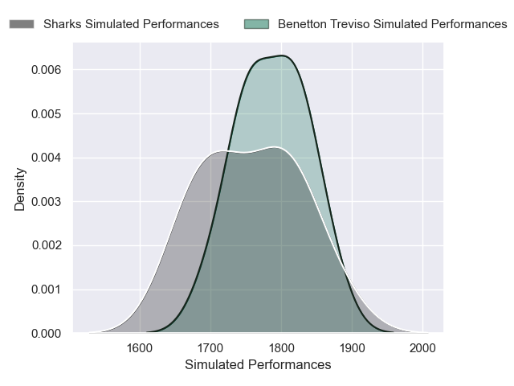

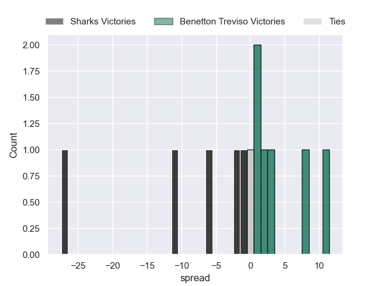

### Leinster V Castres Olympique on 2025/05/24

Average Margin: Leinster by 4.4

### Toulon V Bath Rugby on 2025/05/24

Average Margin: Toulon by 9.4

### Northampton Saints V Sale Sharks on 2025/05/24

Average Margin: Northampton Saints by 4.9

# Completed Match Review

| Match                                                   |   Result |   Lineup Prediction |   Minutes Prediction |   Club Prediction |
|:--------------------------------------------------------|---------:|--------------------:|---------------------:|------------------:|
| Bath Rugby V La Rochelle on 2024/12/06                  |       -4 |                -8.5 |                 -2.4 |               6.7 |
| Northampton Saints V Castres Olympique on 2024/12/07    |       30 |                 5.8 |                  0.2 |               7.1 |
| Saracens V Bulls on 2024/12/07                          |       22 |                -7.8 |                 -7.1 |               1.6 |
| Glasgow Warriors V Sale Sharks on 2024/12/07            |       19 |                10.6 |                  6.4 |               9.7 |
| Racing 92 V Harlequins on 2024/12/07                    |       11 |                 4.9 |                  0.4 |               3.2 |
| Bordeaux Begles V Leicester Tigers on 2024/12/08        |       14 |                19.7 |                 12.9 |               6.5 |
| Stade Toulousain V Ulster on 2024/12/08                 |       40 |                13   |                  4.7 |              11.4 |
| Bristol Rugby V Leinster on 2024/12/08                  |      -23 |                -5.1 |                 -1.6 |              -1.9 |
| Sale Sharks V Racing 92 on 2024/12/13                   |       22 |                 5.6 |                  8.1 |               4.5 |
| Leicester Tigers V Sharks on 2024/12/14                 |       39 |                 5.2 |                  1.8 |               7   |
| La Rochelle V Bristol Rugby on 2024/12/14               |       28 |                 9.4 |                  3.5 |               3.7 |
| Benetton Treviso V Bath Rugby on 2024/12/15             |        1 |                -2.4 |                 -1.1 |              -2.4 |
| Stade Francais Paris V Saracens on 2024/12/15           |      -11 |               -12.6 |                -10.5 |               0.2 |
| Toulon V Glasgow Warriors on 2024/12/15                 |        1 |                 1   |                 -0.4 |               1.7 |
| Exeter Chiefs V Stade Toulousain on 2024/12/15          |      -43 |               -23   |                -20.1 |              -1.9 |
| Stormers V Sale Sharks on 2025/01/11                    |       40 |                -7.9 |                -12.3 |               2.9 |
| Munster V Saracens on 2025/01/11                        |        5 |                -9.9 |                 -8.1 |               3   |
| Stade Francais Paris V Northampton Saints on 2025/01/11 |       10 |                 2.8 |                  2.7 |              -0.4 |
| Toulon V Harlequins on 2025/01/12                       |       12 |                10.8 |                  9.7 |               6.9 |
| Bristol Rugby V Benetton Treviso on 2025/01/12          |        6 |                -0.7 |                 -0.6 |               8.8 |
| La Rochelle V Leinster on 2025/01/12                    |       -2 |                 0.1 |                  0.1 |              -3   |
| Bath Rugby V Clermont Auvergne on 2025/01/12            |       19 |                11.9 |                 -4.4 |               8.9 |

# Model Accuracies

| Model | Percent Correct Predictions | Spread Error |
| ------ | ------ | ------ |
| Club Level | 77.8% | 16.5 |
| Player Level: Lineup | 72.7% | 13.8 |
| Player Level: Minutes | 63.6% | 16.0 |

