---  
title: "European Rugby Champions Cup 2024 Status"  
date: 2024-12-16 6:00:00 -0500  
categories: model review projection  
layout: article  
aside:  
    toc: true  
---
# Current Team Rankings

# Pool Results

## Pool A

## Current Standings

| Club             |   Played |   Wins |   Point Differential |   Losing Bonus Points |   Try Bonus Points |
|:-----------------|---------:|-------:|---------------------:|----------------------:|-------------------:|
| Stade Toulousain |        2 |      2 |                   83 |                     0 |                  2 |
| Bordeaux Begles  |        2 |      2 |                   35 |                     0 |                  2 |
| Leicester Tigers |        2 |      1 |                   25 |                     0 |                  2 |
| Sharks           |        2 |      1 |                  -21 |                     0 |                  1 |
| Ulster           |        2 |      0 |                  -61 |                     0 |                  0 |
| Exeter Chiefs    |        2 |      0 |                  -61 |                     0 |                  0 |

### Projected Total Table

| Club             |   Played |   Wins |   Point Differential |   Losing Bonus Points |   Try Bonus Points |   Competition Points |
|:-----------------|---------:|-------:|---------------------:|----------------------:|-------------------:|---------------------:|
| Stade Toulousain |        4 |    3.7 |             100.274  |                   0.2 |                2.9 |                 17.9 |
| Bordeaux Begles  |        4 |    3.5 |              46.3228 |                   0.3 |                2.7 |                 17   |
| Leicester Tigers |        4 |    1.9 |              20.5989 |                   0.3 |                2.3 |                 10.3 |
| Sharks           |        4 |    1.3 |             -37.0071 |                   0.7 |                1.6 |                  7.5 |
| Ulster           |        4 |    0.9 |             -64.2908 |                   0.6 |                0.4 |                  4.4 |
| Exeter Chiefs    |        4 |    0.7 |             -65.8979 |                   0.8 |                0.4 |                  4.1 |

## Pool B

## Current Standings

| Club              |   Played |   Wins |   Point Differential |   Losing Bonus Points |   Try Bonus Points |
|:------------------|---------:|-------:|---------------------:|----------------------:|-------------------:|
| La Rochelle       |        2 |      2 |                   32 |                     0 |                  1 |
| Leinster          |        2 |      2 |                   31 |                     0 |                  1 |
| Clermont Auvergne |        2 |      1 |                   20 |                     0 |                  1 |
| Benetton Treviso  |        2 |      1 |                  -27 |                     0 |                  1 |
| Bath Rugby        |        2 |      0 |                   -5 |                     2 |                  0 |
| Bristol Rugby     |        2 |      0 |                  -51 |                     0 |                  0 |

### Projected Total Table

| Club              |   Played |   Wins |   Point Differential |   Losing Bonus Points |   Try Bonus Points |   Competition Points |
|:------------------|---------:|-------:|---------------------:|----------------------:|-------------------:|---------------------:|
| Leinster          |        4 |    3.6 |             45.6763  |                   0.2 |                1.7 |                 16.4 |
| La Rochelle       |        4 |    3   |             31.3021  |                   0.7 |                1.7 |                 14.1 |
| Clermont Auvergne |        4 |    1.8 |             16.1962  |                   0.6 |                1.8 |                  9.7 |
| Benetton Treviso  |        4 |    1.5 |            -39.0804  |                   0.7 |                1.4 |                  8   |
| Bath Rugby        |        4 |    0.9 |             -9.16501 |                   2.3 |                0.5 |                  6.6 |
| Bristol Rugby     |        4 |    1.2 |            -44.9292  |                   0.5 |                1   |                  6.4 |

## Pool C

## Current Standings

| Club                 |   Played |   Wins |   Point Differential |   Losing Bonus Points |   Try Bonus Points |
|:---------------------|---------:|-------:|---------------------:|----------------------:|-------------------:|
| Northampton Saints   |        2 |      2 |                   39 |                     0 |                  2 |
| Saracens             |        2 |      2 |                   33 |                     0 |                  1 |
| Munster              |        2 |      1 |                   24 |                     1 |                  1 |
| Castres Olympique    |        2 |      1 |                  -28 |                     0 |                  0 |
| Bulls                |        2 |      0 |                  -31 |                     0 |                  0 |
| Stade Francais Paris |        2 |      0 |                  -37 |                     0 |                  0 |

### Projected Total Table

| Club                 |   Played |   Wins |   Point Differential |   Losing Bonus Points |   Try Bonus Points |   Competition Points |
|:---------------------|---------:|-------:|---------------------:|----------------------:|-------------------:|---------------------:|
| Northampton Saints   |        4 |    3.4 |              45.9533 |                   0.4 |                2.6 |                 16.7 |
| Saracens             |        4 |    3.2 |              40.4369 |                   0.5 |                1.4 |                 14.8 |
| Munster              |        4 |    1.9 |              21.7702 |                   1.7 |                1.3 |                 10.6 |
| Bulls                |        4 |    1.6 |             -17.7278 |                   0.3 |                0.7 |                  7.2 |
| Castres Olympique    |        4 |    1.5 |             -40.1063 |                   0.7 |                0.4 |                  7   |
| Stade Francais Paris |        4 |    0.4 |             -50.3264 |                   0.7 |                0.5 |                  2.9 |

## Pool D

## Current Standings

| Club             |   Played |   Wins |   Point Differential |   Losing Bonus Points |   Try Bonus Points |
|:-----------------|---------:|-------:|---------------------:|----------------------:|-------------------:|
| Toulon           |        2 |      2 |                   11 |                     0 |                  0 |
| Glasgow Warriors |        2 |      1 |                   18 |                     1 |                  2 |
| Harlequins       |        2 |      1 |                   26 |                     0 |                  1 |
| Sale Sharks      |        2 |      1 |                    3 |                     0 |                  1 |
| Racing 92        |        2 |      1 |                  -11 |                     0 |                  0 |
| Stormers         |        2 |      0 |                  -47 |                     0 |                  0 |

### Projected Total Table

| Club             |   Played |   Wins |   Point Differential |   Losing Bonus Points |   Try Bonus Points |   Competition Points |
|:-----------------|---------:|-------:|---------------------:|----------------------:|-------------------:|---------------------:|
| Glasgow Warriors |        4 |    2.4 |             29.3047  |                   1.4 |                2.9 |                 14   |
| Toulon           |        4 |    3.2 |             15.0452  |                   0.5 |                0.4 |                 13.8 |
| Sale Sharks      |        4 |    1.9 |              1.43284 |                   0.7 |                1.4 |                  9.7 |
| Harlequins       |        4 |    1.6 |             19.3366  |                   0.8 |                1.4 |                  8.8 |
| Racing 92        |        4 |    1.8 |            -17.7465  |                   0.4 |                0.4 |                  8.2 |
| Stormers         |        4 |    1   |            -47.3728  |                   0.7 |                0.4 |                  5   |

# Projected Playoff Results

|                      | Reach Round of Sixteen   | Reach Quarterfinals   | Reach Semifinals   | Reach Final   | Win Final   |
|:---------------------|:-------------------------|:----------------------|:-------------------|:--------------|:------------|
| Leinster             | 84.8 %                   | 91.6 %                | 76.5 %             | 55.0 %        | 41.2 %      |
| Stade Toulousain     | 84.8 %                   | 92.3 %                | 77.1 %             | 59.5 %        | 33.9 %      |
| Bordeaux Begles      | 71.4 %                   | 82.5 %                | 53.9 %             | 27.8 %        | 6.8 %       |
| Glasgow Warriors     | 55.1 %                   | 78.8 %                | 35.6 %             | 11.2 %        | 4.7 %       |
| Saracens             | 58.5 %                   | 76.2 %                | 34.7 %             | 10.9 %        | 4.1 %       |
| Northampton Saints   | 69.4 %                   | 75.9 %                | 45.3 %             | 18.2 %        | 3.9 %       |
| La Rochelle          | 54.5 %                   | 74.3 %                | 28.8 %             | 8.4 %         | 2.6 %       |
| Toulon               | 52.0 %                   | 66.5 %                | 20.5 %             | 4.6 %         | 1.5 %       |
| Munster              | 77.1 %                   | 29.6 %                | 8.2 %              | 1.9 %         | 0.5 %       |
| Harlequins           | 54.5 %                   | 15.4 %                | 2.9 %              | 0.5 %         | 0.3 %       |
| Clermont Auvergne    | 69.0 %                   | 18.0 %                | 2.9 %              | 0.5 %         | 0.2 %       |
| Leicester Tigers     | 78.2 %                   | 20.2 %                | 2.4 %              | 0.5 %         | 0.1 %       |
| Bath Rugby           | 28.5 %                   | 8.0 %                 | 2.1 %              | 0.3 %         | 0.1 %       |
| Bulls                | 46.8 %                   | 14.3 %                | 2.3 %              | 0.1 %         | 0.1 %       |
| Sale Sharks          | 61.2 %                   | 18.2 %                | 2.5 %              | 0.2 %         | 0.0 %       |
| Racing 92            | 41.2 %                   | 8.7 %                 | 1.4 %              | 0.1 %         | 0.0 %       |
| Sharks               | 73.3 %                   | 7.7 %                 | 1.1 %              | 0.1 %         | 0.0 %       |
| Benetton Treviso     | 45.4 %                   | 6.5 %                 | 0.6 %              | 0.1 %         | 0.0 %       |
| Bristol Rugby        | 24.9 %                   | 6.0 %                 | 0.6 %              | 0.1 %         | 0.0 %       |
| Castres Olympique    | 34.0 %                   | 5.4 %                 | 0.4 %              | 0.0 %         | 0.0 %       |
| Ulster               | 12.2 %                   | 2.1 %                 | 0.1 %              | 0.0 %         | 0.0 %       |
| Exeter Chiefs        | 9.3 %                    | 0.7 %                 | 0.1 %              | 0.0 %         | 0.0 %       |
| Stormers             | 10.2 %                   | 1.0 %                 | 0.0 %              | 0.0 %         | 0.0 %       |
| Stade Francais Paris | 3.6 %                    | 0.1 %                 | 0.0 %              | 0.0 %         | 0.0 %       |
| champ SS_16          | 0.1 %                    | 0.0 %                 | 0.0 %              | 0.0 %         | 0.0 %       |

# Pool Match Predictions

## Pool A

### Leicester Tigers V Ulster on 2025/01/11

Average Margin: Leicester Tigers by 6.5

Average Scoreline: 30-23

### Sharks V Stade Toulousain on 2025/01/11

Average Margin: Stade Toulousain by 6.4

Average Scoreline: 36-29

### Exeter Chiefs V Bordeaux Begles on 2025/01/11

Average Margin: Bordeaux Begles by 1.7

Average Scoreline: 28-26

### Ulster V Exeter Chiefs on 2025/01/17

Average Margin: Ulster by 3.2

Average Scoreline: 27-24

### Bordeaux Begles V Sharks on 2025/01/19

Average Margin: Bordeaux Begles by 9.6

Average Scoreline: 34-24

### Stade Toulousain V Leicester Tigers on 2025/01/19

Average Margin: Stade Toulousain by 10.9

Average Scoreline: 33-22

## Pool B

### La Rochelle V Leinster on 2025/01/12

Average Margin: Leinster by 3.9

Average Scoreline: 29-25

### Bristol Rugby V Benetton Treviso on 2025/01/12

Average Margin: Bristol Rugby by 8.9

Average Scoreline: 36-27

### Bath Rugby V Clermont Auvergne on 2025/01/12

Average Margin: Bath Rugby by 6.7

Average Scoreline: 35-28

### Benetton Treviso V La Rochelle on 2025/01/18

Average Margin: La Rochelle by 3.2

Average Scoreline: 28-25

### Leinster V Bath Rugby on 2025/01/18

Average Margin: Leinster by 10.8

Average Scoreline: 36-26

### Clermont Auvergne V Bristol Rugby on 2025/01/18

Average Margin: Clermont Auvergne by 2.9

Average Scoreline: 30-27

## Pool C

### Munster V Saracens on 2025/01/11

Average Margin: Munster by 2.1

Average Scoreline: 23-21

### Stade Francais Paris V Northampton Saints on 2025/01/11

Average Margin: Northampton Saints by 2.7

Average Scoreline: 31-28

### Castres Olympique V Bulls on 2025/01/11

Average Margin: Bulls by 2.6

Average Scoreline: 25-23

### Bulls V Stade Francais Paris on 2025/01/18

Average Margin: Bulls by 10.7

Average Scoreline: 38-27

### Northampton Saints V Munster on 2025/01/18

Average Margin: Northampton Saints by 4.3

Average Scoreline: 27-22

### Saracens V Castres Olympique on 2025/01/19

Average Margin: Saracens by 9.5

Average Scoreline: 33-23

## Pool D

### Glasgow Warriors V Racing 92 on 2025/01/10

Average Margin: Glasgow Warriors by 10.4

Average Scoreline: 31-21

### Stormers V Sale Sharks on 2025/01/11

Average Margin: Stormers by 3.3

Average Scoreline: 26-23

### Toulon V Harlequins on 2025/01/12

Average Margin: Toulon by 5.8

Average Scoreline: 29-23

### Harlequins V Glasgow Warriors on 2025/01/18

Average Margin: Glasgow Warriors by 0.9

Average Scoreline: 26-25

### Racing 92 V Stormers on 2025/01/18

Average Margin: Racing 92 by 3.7

Average Scoreline: 24-20

### Sale Sharks V Toulon on 2025/01/19

Average Margin: Sale Sharks by 1.7

Average Scoreline: 23-21

# Knockout Match Predictions

## Sixteens

### Glasgow Warriors V Sharks on 2025/04/04

Average Margin: Glasgow Warriors by 11.3

### La Rochelle V Bath Rugby on 2025/04/04

Average Margin: La Rochelle by 1.1

### Leinster V Ulster on 2025/04/04

Average Margin: Leinster by 12.7

### Glasgow Warriors V Northampton Saints on 2025/04/04

Average Margin: Glasgow Warriors by 6.2

### Northampton Saints V Harlequins on 2025/04/04

Average Margin: Northampton Saints by 4.2

### Bordeaux Begles V Racing 92 on 2025/04/04

Average Margin: Bordeaux Begles by 8.2

### Toulon V Castres Olympique on 2025/04/04

Average Margin: Toulon by 7.0

### Saracens V Bath Rugby on 2025/04/04

Average Margin: Saracens by 6.9

### Northampton Saints V Leicester Tigers on 2025/04/04

Average Margin: Northampton Saints by 5.2

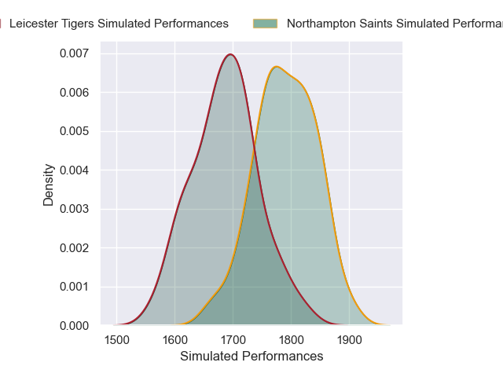
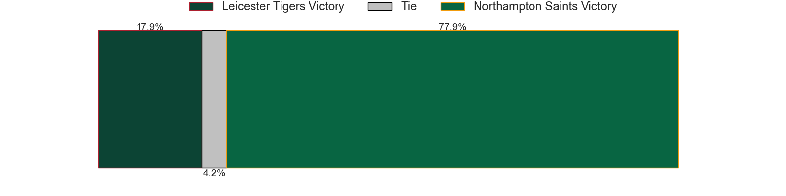
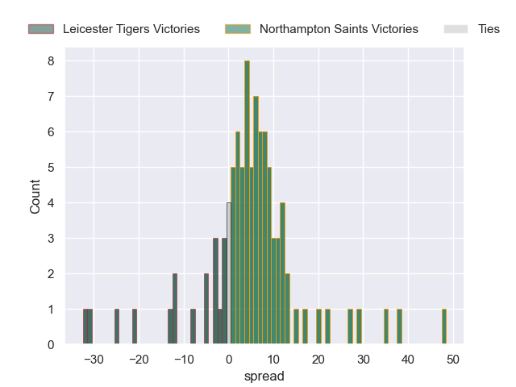

### Bordeaux Begles V Toulon on 2025/04/04

Average Margin: Bordeaux Begles by 5.9

### Northampton Saints V Munster on 2025/04/04

Average Margin: Northampton Saints by 3.8

### Bordeaux Begles V Saracens on 2025/04/04

Average Margin: Bordeaux Begles by 4.6

### Saracens V Sale Sharks on 2025/04/04

Average Margin: Saracens by 7.4

### Leinster V Bath Rugby on 2025/04/04

Average Margin: Leinster by 12.2

### Toulon V Bath Rugby on 2025/04/04

Average Margin: Bath Rugby by 0.6

### Bordeaux Begles V Glasgow Warriors on 2025/04/04

Average Margin: Bordeaux Begles by 3.5

### Stade Toulousain V Exeter Chiefs on 2025/04/04

Average Margin: Stade Toulousain by 14.8

### Saracens V Racing 92 on 2025/04/04

Average Margin: Saracens by 7.0

### La Rochelle V Northampton Saints on 2025/04/04

Average Margin: La Rochelle by 5.5

### Bordeaux Begles V Castres Olympique on 2025/04/04

Average Margin: Bordeaux Begles by 7.9

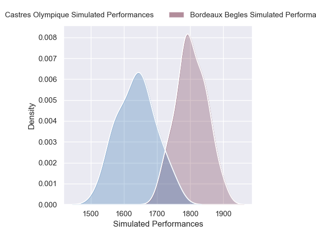

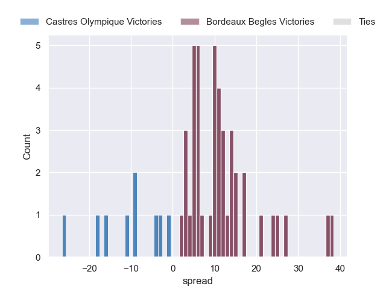

### Northampton Saints V La Rochelle on 2025/04/04

Average Margin: Northampton Saints by 3.9

### Toulon V Glasgow Warriors on 2025/04/04

Average Margin: Toulon by 2.5

### Glasgow Warriors V La Rochelle on 2025/04/04

Average Margin: Glasgow Warriors by 5.4

### Bordeaux Begles V Sharks on 2025/04/04

Average Margin: Bordeaux Begles by 8.3

### Northampton Saints V Exeter Chiefs on 2025/04/04

Average Margin: Northampton Saints by 14.9

### Stade Toulousain V Castres Olympique on 2025/04/04

Average Margin: Stade Toulousain by 12.2

### Sale Sharks V Leicester Tigers on 2025/04/04

Average Margin: Sale Sharks by 1.7

### La Rochelle V Toulon on 2025/04/04

Average Margin: La Rochelle by 2.8

### Northampton Saints V Sharks on 2025/04/04

Average Margin: Northampton Saints by 7.8

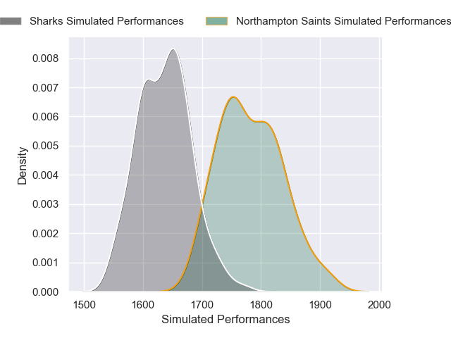
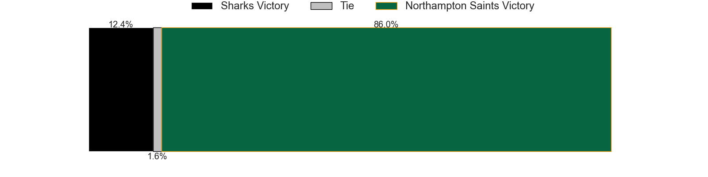
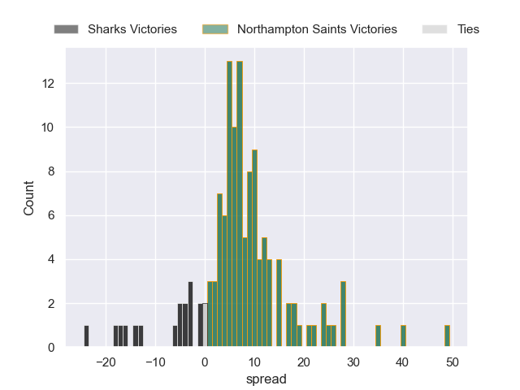

### Leinster V Clermont Auvergne on 2025/04/04

Average Margin: Leinster by 12.5

### La Rochelle V Benetton Treviso on 2025/04/04

Average Margin: La Rochelle by 14.2

### Stade Toulousain V Northampton Saints on 2025/04/04

Average Margin: Stade Toulousain by 9.0

### Northampton Saints V Clermont Auvergne on 2025/04/04

Average Margin: Northampton Saints by 4.9

### Toulon V Sharks on 2025/04/04

Average Margin: Toulon by 7.5

### La Rochelle V Bristol Rugby on 2025/04/04

Average Margin: La Rochelle by 6.4

### Sale Sharks V Toulon on 2025/04/04

Average Margin: Sale Sharks by 3.8

### Leinster V Stade Toulousain on 2025/04/04

Average Margin: Leinster by 4.4

### Bordeaux Begles V Stormers on 2025/04/04

Average Margin: Bordeaux Begles by 6.9

### Saracens V Toulon on 2025/04/04

Average Margin: Saracens by 4.1

### Leinster V Bulls on 2025/04/04

Average Margin: Leinster by 11.5

### Northampton Saints V Stormers on 2025/04/04

Average Margin: Northampton Saints by 7.5

### Glasgow Warriors V Bristol Rugby on 2025/04/04

Average Margin: Glasgow Warriors by 6.4

### Toulon V Bulls on 2025/04/04

Average Margin: Toulon by 0.4

### Glasgow Warriors V Leinster on 2025/04/04

Average Margin: Leinster by 1.6

### Saracens V Benetton Treviso on 2025/04/04

Average Margin: Saracens by 9.1

### Stade Toulousain V Racing 92 on 2025/04/04

Average Margin: Stade Toulousain by 15.3

### Clermont Auvergne V Leicester Tigers on 2025/04/04

Average Margin: Clermont Auvergne by 4.0

### La Rochelle V Leinster on 2025/04/04

Average Margin: Leinster by 3.4

### Glasgow Warriors V Toulon on 2025/04/04

Average Margin: Glasgow Warriors by 9.3

### Bordeaux Begles V Northampton Saints on 2025/04/04

Average Margin: Bordeaux Begles by 4.4

### Stade Toulousain V La Rochelle on 2025/04/04

Average Margin: Stade Toulousain by 8.6

### Toulon V Northampton Saints on 2025/04/04

Average Margin: Toulon by 1.7

### Munster V Bulls on 2025/04/04

Average Margin: Munster by 0.3

### La Rochelle V Castres Olympique on 2025/04/04

Average Margin: La Rochelle by 8.2

### Leinster V Bristol Rugby on 2025/04/04

Average Margin: Leinster by 9.5

### Stade Toulousain V Ulster on 2025/04/04

Average Margin: Stade Toulousain by 14.6

### Clermont Auvergne V Harlequins on 2025/04/04

Average Margin: Clermont Auvergne by 10.6

### Leinster V Saracens on 2025/04/04

Average Margin: Leinster by 10.2

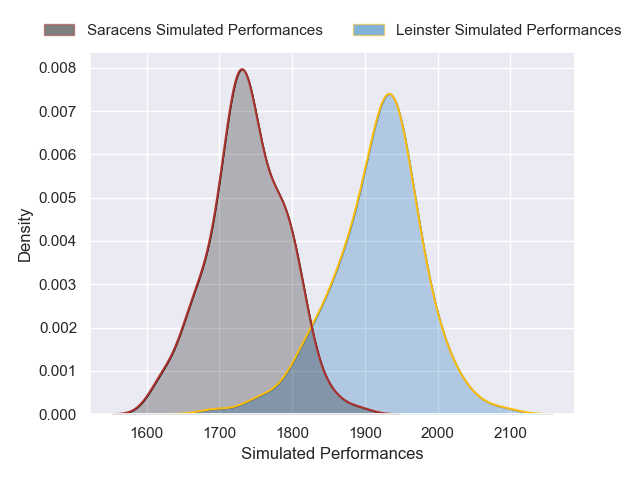
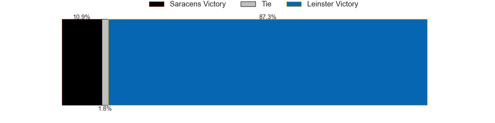
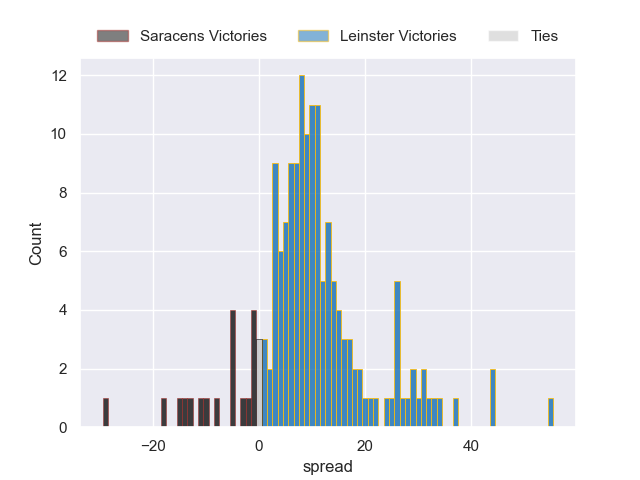

### Bordeaux Begles V Bath Rugby on 2025/04/04

Average Margin: Bordeaux Begles by 5.5

### La Rochelle V Stormers on 2025/04/04

Average Margin: La Rochelle by 6.0

### Northampton Saints V Saracens on 2025/04/04

Average Margin: Northampton Saints by 2.7

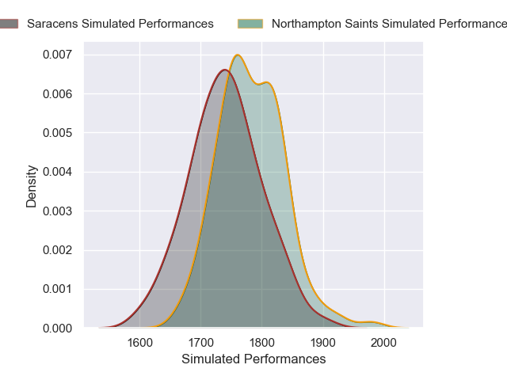
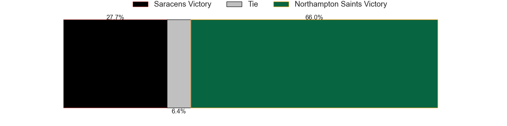
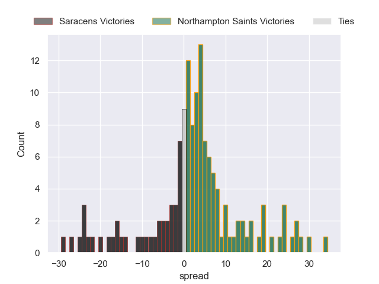

### Toulon V Stade Toulousain on 2025/04/04

Average Margin: Stade Toulousain by 1.0

### La Rochelle V Bulls on 2025/04/04

Average Margin: La Rochelle by 2.0

### Sale Sharks V Glasgow Warriors on 2025/04/04

Average Margin: Glasgow Warriors by 1.4

### Stade Toulousain V Stormers on 2025/04/04

Average Margin: Stade Toulousain by 11.7

### Harlequins V Munster on 2025/04/04

Average Margin: Harlequins by 2.5

### Munster V Harlequins on 2025/04/04

Average Margin: Munster by 11.1

### Saracens V Northampton Saints on 2025/04/04

Average Margin: Saracens by 3.5

### Northampton Saints V Toulon on 2025/04/04

Average Margin: Northampton Saints by 4.0

### Sale Sharks V Clermont Auvergne on 2025/04/04

Average Margin: Sale Sharks by 0.8

### Bordeaux Begles V Munster on 2025/04/04

Average Margin: Bordeaux Begles by 5.2

### Saracens V La Rochelle on 2025/04/04

Average Margin: Saracens by 5.2

### Saracens V Stormers on 2025/04/04

Average Margin: Saracens by 6.7

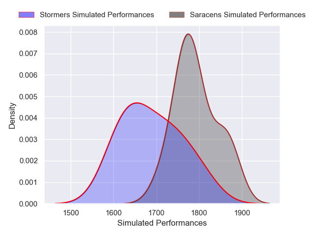

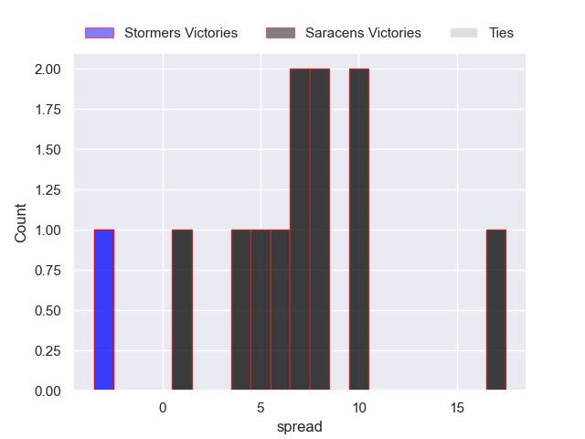

### Saracens V Glasgow Warriors on 2025/04/04

Average Margin: Saracens by 1.8

### Saracens V Bordeaux Begles on 2025/04/04

Average Margin: Saracens by 6.3

### Harlequins V Sale Sharks on 2025/04/04

Average Margin: Harlequins by 8.9

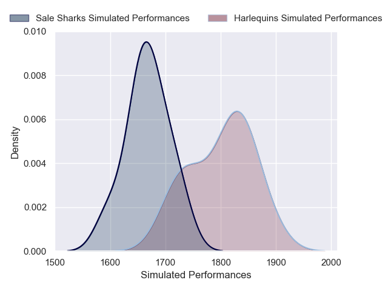

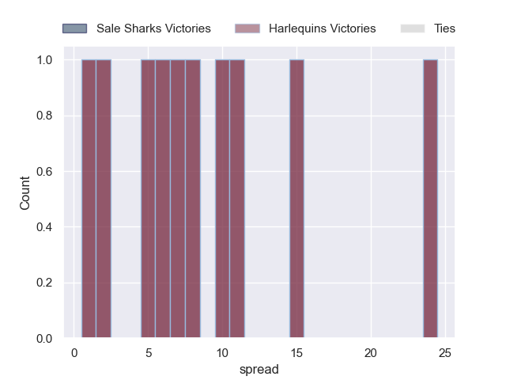

### Saracens V Sharks on 2025/04/04

Average Margin: Saracens by 10.8

### Stade Toulousain V Clermont Auvergne on 2025/04/04

Average Margin: Stade Toulousain by 11.6

### Leinster V La Rochelle on 2025/04/04

Average Margin: Leinster by 11.2

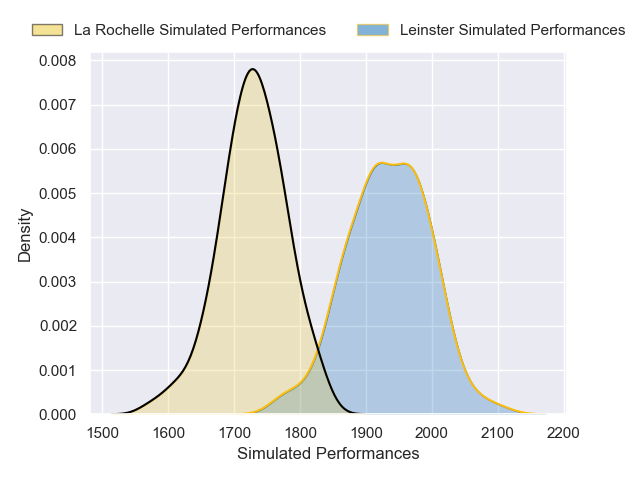

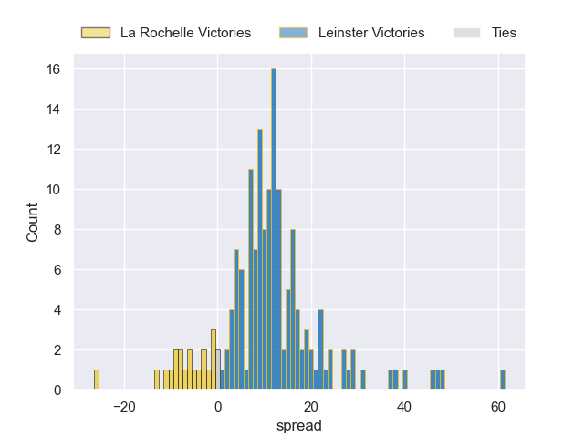

### Bordeaux Begles V Leinster on 2025/04/04

Average Margin: Leinster by 2.9

### Northampton Saints V Glasgow Warriors on 2025/04/04

Average Margin: Northampton Saints by 2.2

### Leinster V Glasgow Warriors on 2025/04/04

Average Margin: Leinster by 8.6

### Leinster V Toulon on 2025/04/04

Average Margin: Leinster by 11.7

### Glasgow Warriors V Saracens on 2025/04/04

Average Margin: Glasgow Warriors by 4.6

### Munster V Toulon on 2025/04/04

Average Margin: Munster by 6.9

### Bordeaux Begles V Exeter Chiefs on 2025/04/04

Average Margin: Bordeaux Begles by 4.9

### Saracens V Bristol Rugby on 2025/04/04

Average Margin: Saracens by 7.2

### Sale Sharks V Munster on 2025/04/04

Average Margin: Sale Sharks by 2.7

### Munster V Leicester Tigers on 2025/04/04

Average Margin: Munster by 8.2

### Munster V Northampton Saints on 2025/04/04

Average Margin: Munster by 10.3

### Glasgow Warriors V Stormers on 2025/04/04

Average Margin: Glasgow Warriors by 11.1

### Stade Toulousain V Toulon on 2025/04/04

Average Margin: Stade Toulousain by 9.4

### Harlequins V Leicester Tigers on 2025/04/04

Average Margin: Harlequins by 4.3

### Leinster V Stormers on 2025/04/04

Average Margin: Leinster by 16.1

### Stade Toulousain V Glasgow Warriors on 2025/04/04

Average Margin: Stade Toulousain by 6.3

### Toulon V Saracens on 2025/04/04

Average Margin: Toulon by 1.9

### Stade Toulousain V Bulls on 2025/04/04

Average Margin: Stade Toulousain by 6.3

### Saracens V Ulster on 2025/04/04

Average Margin: Saracens by 9.9

### Sale Sharks V Harlequins on 2025/04/04

Average Margin: Sale Sharks by 5.0

### La Rochelle V Racing 92 on 2025/04/04

Average Margin: La Rochelle by 9.0

### La Rochelle V Sale Sharks on 2025/04/04

Average Margin: La Rochelle by 8.4

### Bordeaux Begles V Ulster on 2025/04/04

Average Margin: Bordeaux Begles by 10.9

### La Rochelle V Clermont Auvergne on 2025/04/04

Average Margin: La Rochelle by 6.5

### Toulon V Harlequins on 2025/04/04

Average Margin: Toulon by 7.7

### Munster V Saracens on 2025/04/04

Average Margin: Munster by 2.5

### La Rochelle V Stade Toulousain on 2025/04/04

Average Margin: Stade Toulousain by 2.0

### Bordeaux Begles V Bristol Rugby on 2025/04/04

Average Margin: Bordeaux Begles by 7.0

### Saracens V Munster on 2025/04/04

Average Margin: Saracens by 6.9

### Glasgow Warriors V Racing 92 on 2025/04/04

Average Margin: Glasgow Warriors by 9.7

### Northampton Saints V Castres Olympique on 2025/04/04

Average Margin: Northampton Saints by 9.2

### Stade Toulousain V Benetton Treviso on 2025/04/04

Average Margin: Stade Toulousain by 15.1

### Leinster V Sale Sharks on 2025/04/04

Average Margin: Leinster by 15.2

### Toulon V Leicester Tigers on 2025/04/04

Average Margin: Toulon by 5.3

### La Rochelle V Sharks on 2025/04/04

Average Margin: La Rochelle by 7.9

### Glasgow Warriors V Castres Olympique on 2025/04/04

Average Margin: Glasgow Warriors by 7.8

### Stade Toulousain V Bath Rugby on 2025/04/04

Average Margin: Stade Toulousain by 7.5

### Leinster V Castres Olympique on 2025/04/04

Average Margin: Leinster by 13.9

### La Rochelle V Saracens on 2025/04/04

Average Margin: La Rochelle by 5.2

### Harlequins V Toulon on 2025/04/04

Average Margin: Harlequins by 1.9

### Munster V Clermont Auvergne on 2025/04/04

Average Margin: Munster by 5.2

### Glasgow Warriors V Sale Sharks on 2025/04/04

Average Margin: Glasgow Warriors by 9.5

### Toulon V Bordeaux Begles on 2025/04/04

Average Margin: Toulon by 8.7

### Bordeaux Begles V Benetton Treviso on 2025/04/04

Average Margin: Bordeaux Begles by 12.5

### Leinster V Sharks on 2025/04/04

Average Margin: Leinster by 15.0

### Stade Toulousain V Sale Sharks on 2025/04/04

Average Margin: Stade Toulousain by 8.9

### Toulon V Munster on 2025/04/04

Average Margin: Toulon by 4.2

### Leinster V Leicester Tigers on 2025/04/04

Average Margin: Leinster by 12.0

### Northampton Saints V Ulster on 2025/04/04

Average Margin: Northampton Saints by 7.3

### Toulon V Stormers on 2025/04/04

Average Margin: Toulon by 8.2

### Bordeaux Begles V Leicester Tigers on 2025/04/04

Average Margin: Bordeaux Begles by 8.3

### La Rochelle V Munster on 2025/04/04

Average Margin: La Rochelle by 5.4

### Glasgow Warriors V Bulls on 2025/04/04

Average Margin: Glasgow Warriors by 6.1

### Glasgow Warriors V Stade Toulousain on 2025/04/04

Average Margin: Glasgow Warriors by 2.6

### Northampton Saints V Bordeaux Begles on 2025/04/04

Average Margin: Northampton Saints by 1.8

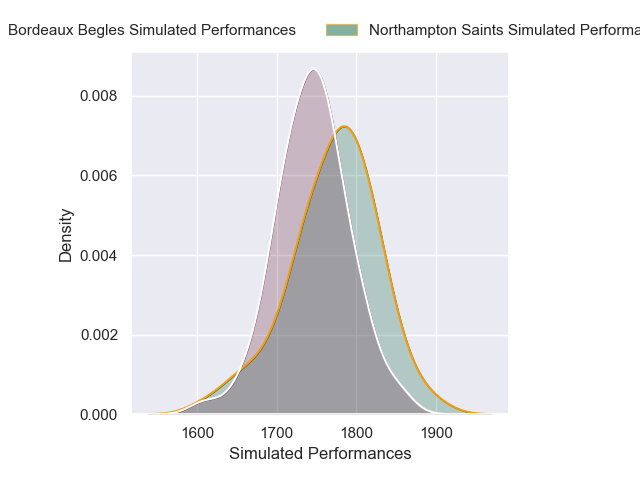
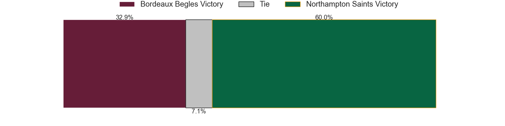
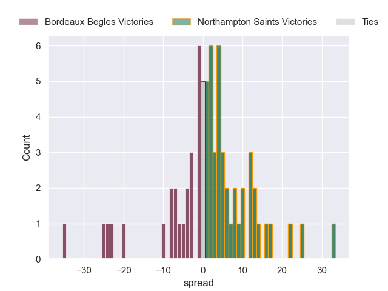

### Bordeaux Begles V Bulls on 2025/04/04

Average Margin: Bordeaux Begles by 3.2

### Northampton Saints V Benetton Treviso on 2025/04/04

Average Margin: Northampton Saints by 8.4

### Leinster V Harlequins on 2025/04/04

Average Margin: Leinster by 12.9

### Stade Toulousain V Munster on 2025/04/04

Average Margin: Stade Toulousain by 7.7

### Saracens V Clermont Auvergne on 2025/04/04

Average Margin: Saracens by 7.0

### La Rochelle V Leicester Tigers on 2025/04/04

Average Margin: La Rochelle by 6.3

### Stade Toulousain V Sharks on 2025/04/04

Average Margin: Stade Toulousain by 14.4

### Northampton Saints V Sale Sharks on 2025/04/04

Average Margin: Northampton Saints by 7.8

### Northampton Saints V Bath Rugby on 2025/04/04

Average Margin: Northampton Saints by 3.8

### Leinster V Munster on 2025/04/04

Average Margin: Leinster by 11.2

### Saracens V Harlequins on 2025/04/04

Average Margin: Saracens by 8.2

### Glasgow Warriors V Clermont Auvergne on 2025/04/04

Average Margin: Glasgow Warriors by 8.2

### Munster V Glasgow Warriors on 2025/04/04

Average Margin: Munster by 0.5

### Leinster V Racing 92 on 2025/04/04

Average Margin: Leinster by 15.7

### Northampton Saints V Bulls on 2025/04/04

Average Margin: Northampton Saints by 1.4

### Bordeaux Begles V Sale Sharks on 2025/04/04

Average Margin: Bordeaux Begles by 8.5

### Saracens V Leicester Tigers on 2025/04/04

Average Margin: Saracens by 7.9

### Toulon V La Rochelle on 2025/04/04

Average Margin: La Rochelle by 0.4

### Clermont Auvergne V Munster on 2025/04/04

Average Margin: Clermont Auvergne by 3.6

### Glasgow Warriors V Benetton Treviso on 2025/04/04

Average Margin: Glasgow Warriors by 11.2

### Leinster V Benetton Treviso on 2025/04/04

Average Margin: Leinster by 16.1

### Saracens V Castres Olympique on 2025/04/04

Average Margin: Saracens by 9.2

### Leinster V Northampton Saints on 2025/04/04

Average Margin: Leinster by 11.9

### Toulon V Clermont Auvergne on 2025/04/04

Average Margin: Toulon by 6.0

### Munster V Sale Sharks on 2025/04/04

Average Margin: Munster by 7.2

### Bordeaux Begles V Stade Toulousain on 2025/04/04

Average Margin: Stade Toulousain by 1.2

### Stade Toulousain V Bristol Rugby on 2025/04/04

Average Margin: Stade Toulousain by 11.1

### Stade Toulousain V Harlequins on 2025/04/04

Average Margin: Stade Toulousain by 12.1

### Bordeaux Begles V La Rochelle on 2025/04/04

Average Margin: Bordeaux Begles by 4.8

### Leinster V Exeter Chiefs on 2025/04/04

Average Margin: Leinster by 13.2

### Northampton Saints V Bristol Rugby on 2025/04/04

Average Margin: Northampton Saints by 6.4

### Toulon V Racing 92 on 2025/04/04

Average Margin: Toulon by 8.7

### La Rochelle V Harlequins on 2025/04/04

Average Margin: La Rochelle by 5.9

### Bordeaux Begles V Clermont Auvergne on 2025/04/04

Average Margin: Bordeaux Begles by 7.8

### La Rochelle V Glasgow Warriors on 2025/04/04

Average Margin: La Rochelle by 4.3

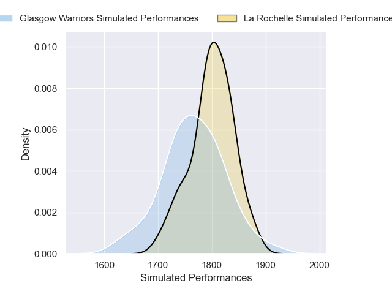
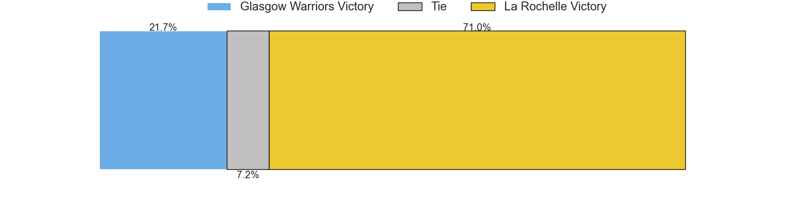
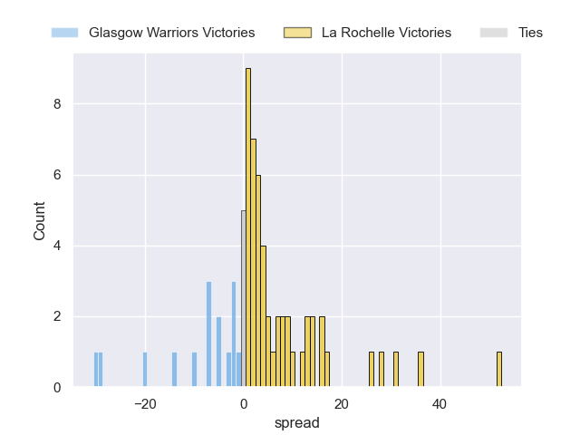

### Racing 92 V Leicester Tigers on 2025/04/04

Average Margin: Leicester Tigers by 0.8

### La Rochelle V Bordeaux Begles on 2025/04/04

Average Margin: La Rochelle by 1.5

### Saracens V Leinster on 2025/04/04

Average Margin: Leinster by 2.9

### Stade Toulousain V Leicester Tigers on 2025/04/04

Average Margin: Stade Toulousain by 12.8

### Toulon V Sale Sharks on 2025/04/04

Average Margin: Toulon by 8.2

### Glasgow Warriors V Harlequins on 2025/04/04

Average Margin: Glasgow Warriors by 9.7

### Glasgow Warriors V Leicester Tigers on 2025/04/04

Average Margin: Glasgow Warriors by 7.6

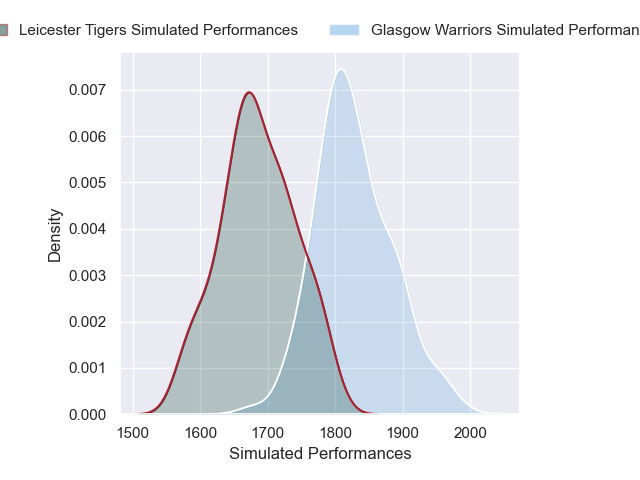
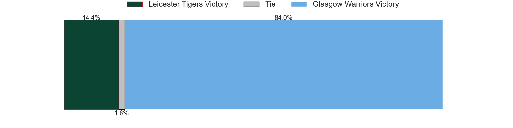
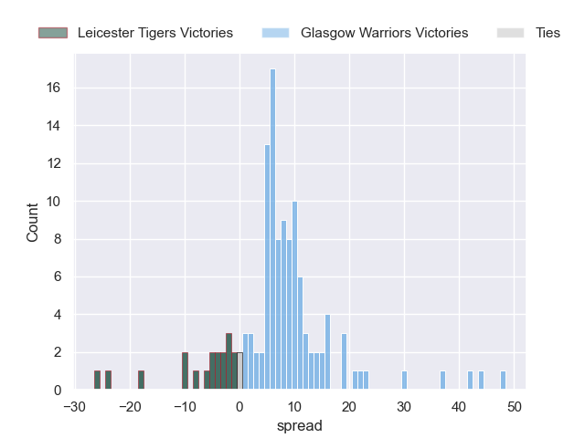

### Glasgow Warriors V Munster on 2025/04/04

Average Margin: Glasgow Warriors by 6.6

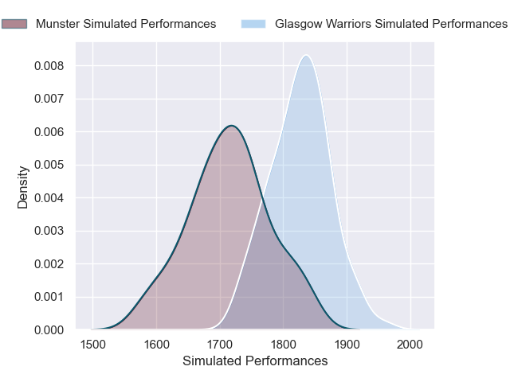
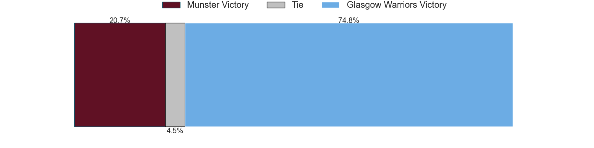
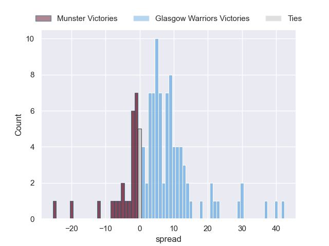

### Northampton Saints V Racing 92 on 2025/04/04

Average Margin: Northampton Saints by 6.6

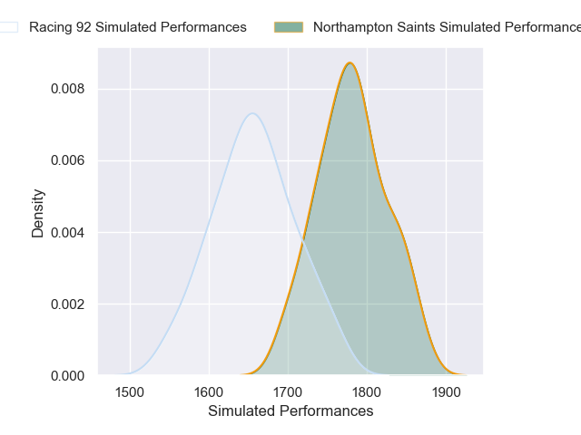

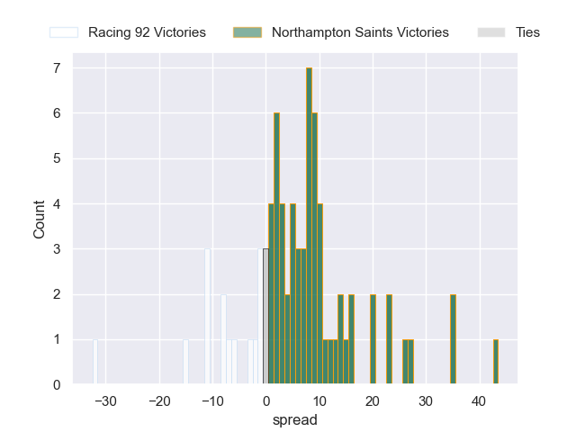

### Bordeaux Begles V Harlequins on 2025/04/04

Average Margin: Bordeaux Begles by 7.2

### Saracens V Bulls on 2025/04/04

Average Margin: Saracens by 4.9

### Glasgow Warriors V Bath Rugby on 2025/04/04

Average Margin: Glasgow Warriors by 3.8

### Toulon V Bristol Rugby on 2025/04/04

Average Margin: Toulon by 3.1

### Glasgow Warriors V Bordeaux Begles on 2025/04/04

Average Margin: Glasgow Warriors by 6.0

### Toulon V Leinster on 2025/04/04

Average Margin: Leinster by 7.8

### Toulon V Benetton Treviso on 2025/04/04

Average Margin: Toulon by 10.3

### Clermont Auvergne V La Rochelle on 2025/04/04

Average Margin: Clermont Auvergne by 6.2

## Quarterfinals

### La Rochelle V Bristol Rugby on 2025/04/11

Average Margin: La Rochelle by 6.4

### Leinster V Benetton Treviso on 2025/04/11

Average Margin: Leinster by 16.1

### Leinster V Exeter Chiefs on 2025/04/11

Average Margin: Leinster by 13.2

### Saracens V Bulls on 2025/04/11

Average Margin: Saracens by 4.9

### Munster V Saracens on 2025/04/11

Average Margin: Munster by 2.5

### Stade Toulousain V Ulster on 2025/04/11

Average Margin: Stade Toulousain by 14.6

### Harlequins V Toulon on 2025/04/11

Average Margin: Harlequins by 1.9

### Leinster V Stade Toulousain on 2025/04/11

Average Margin: Leinster by 4.4

### La Rochelle V Clermont Auvergne on 2025/04/11

Average Margin: La Rochelle by 6.5

### La Rochelle V Stade Toulousain on 2025/04/11

Average Margin: Stade Toulousain by 2.0

### Leinster V Castres Olympique on 2025/04/11

Average Margin: Leinster by 13.9

### La Rochelle V Racing 92 on 2025/04/11

Average Margin: La Rochelle by 9.0

### Toulon V Bath Rugby on 2025/04/11

Average Margin: Bath Rugby by 0.6

### Northampton Saints V Stade Toulousain on 2025/04/11

Average Margin: Stade Toulousain by 1.5

### Glasgow Warriors V Sale Sharks on 2025/04/11

Average Margin: Glasgow Warriors by 9.5

### Leinster V Sharks on 2025/04/11

Average Margin: Leinster by 15.0

### Bordeaux Begles V Stormers on 2025/04/11

Average Margin: Bordeaux Begles by 6.9

### Toulon V Racing 92 on 2025/04/11

Average Margin: Toulon by 8.7

### Glasgow Warriors V Sharks on 2025/04/11

Average Margin: Glasgow Warriors by 11.3

### Leinster V Northampton Saints on 2025/04/11

Average Margin: Leinster by 11.9

### Toulon V Bristol Rugby on 2025/04/11

Average Margin: Toulon by 3.1

### Leinster V Ulster on 2025/04/11

Average Margin: Leinster by 12.7

### Leinster V Bristol Rugby on 2025/04/11

Average Margin: Leinster by 9.5

### Toulon V Bulls on 2025/04/11

Average Margin: Toulon by 0.4

### Harlequins V Sale Sharks on 2025/04/11

Average Margin: Harlequins by 8.9

### La Rochelle V Bulls on 2025/04/11

Average Margin: La Rochelle by 2.0

### Glasgow Warriors V Bristol Rugby on 2025/04/11

Average Margin: Glasgow Warriors by 6.4

### Munster V Sale Sharks on 2025/04/11

Average Margin: Munster by 7.2

### Saracens V Benetton Treviso on 2025/04/11

Average Margin: Saracens by 9.1

### La Rochelle V Bath Rugby on 2025/04/11

Average Margin: La Rochelle by 1.1

### Toulon V Benetton Treviso on 2025/04/11

Average Margin: Toulon by 10.3

### Munster V Toulon on 2025/04/11

Average Margin: Munster by 6.9

### Northampton Saints V Ulster on 2025/04/11

Average Margin: Northampton Saints by 7.3

### Toulon V Castres Olympique on 2025/04/11

Average Margin: Toulon by 7.0

### Munster V Harlequins on 2025/04/11

Average Margin: Munster by 11.1

### La Rochelle V Benetton Treviso on 2025/04/11

Average Margin: La Rochelle by 14.2

### Saracens V Bath Rugby on 2025/04/11

Average Margin: Saracens by 6.9

### Clermont Auvergne V La Rochelle on 2025/04/11

Average Margin: Clermont Auvergne by 6.2

### Saracens V Castres Olympique on 2025/04/11

Average Margin: Saracens by 9.2

### Toulon V Harlequins on 2025/04/11

Average Margin: Toulon by 7.7

### Bordeaux Begles V Racing 92 on 2025/04/11

Average Margin: Bordeaux Begles by 8.2

### Glasgow Warriors V Benetton Treviso on 2025/04/11

Average Margin: Glasgow Warriors by 11.2

### Northampton Saints V Castres Olympique on 2025/04/11

Average Margin: Northampton Saints by 9.2

### Northampton Saints V Stormers on 2025/04/11

Average Margin: Northampton Saints by 7.5

### Glasgow Warriors V Harlequins on 2025/04/11

Average Margin: Glasgow Warriors by 9.7

### La Rochelle V Sharks on 2025/04/11

Average Margin: La Rochelle by 7.9

### Bordeaux Begles V Ulster on 2025/04/11

Average Margin: Bordeaux Begles by 10.9

### Bordeaux Begles V Stade Toulousain on 2025/04/11

Average Margin: Stade Toulousain by 1.2

### Northampton Saints V Bordeaux Begles on 2025/04/11

Average Margin: Northampton Saints by 1.8

### Leinster V Stormers on 2025/04/11

Average Margin: Leinster by 16.1

### Stade Toulousain V Exeter Chiefs on 2025/04/11

Average Margin: Stade Toulousain by 14.8

### Toulon V Sale Sharks on 2025/04/11

Average Margin: Toulon by 8.2

### Munster V Clermont Auvergne on 2025/04/11

Average Margin: Munster by 5.2

### Toulon V Clermont Auvergne on 2025/04/11

Average Margin: Toulon by 6.0

### Munster V Leicester Tigers on 2025/04/11

Average Margin: Munster by 8.2

### Bordeaux Begles V Exeter Chiefs on 2025/04/11

Average Margin: Bordeaux Begles by 4.9

### Toulon V Leicester Tigers on 2025/04/11

Average Margin: Toulon by 5.3

### Saracens V Racing 92 on 2025/04/11

Average Margin: Saracens by 7.0

### Stade Toulousain V Bordeaux Begles on 2025/04/11

Average Margin: Stade Toulousain by 5.3

### Bordeaux Begles V Sale Sharks on 2025/04/11

Average Margin: Bordeaux Begles by 8.5

### Leinster V Toulon on 2025/04/11

Average Margin: Leinster by 11.7

### Glasgow Warriors V Northampton Saints on 2025/04/11

Average Margin: Glasgow Warriors by 6.2

### Saracens V Clermont Auvergne on 2025/04/11

Average Margin: Saracens by 7.0

### Stade Toulousain V Castres Olympique on 2025/04/11

Average Margin: Stade Toulousain by 12.2

### La Rochelle V Harlequins on 2025/04/11

Average Margin: La Rochelle by 5.9

### La Rochelle V Saracens on 2025/04/11

Average Margin: La Rochelle by 5.2

### Bordeaux Begles V Benetton Treviso on 2025/04/11

Average Margin: Bordeaux Begles by 12.5

### Stade Toulousain V Toulon on 2025/04/11

Average Margin: Stade Toulousain by 9.4

### Leinster V Glasgow Warriors on 2025/04/11

Average Margin: Leinster by 8.6

### Saracens V Bordeaux Begles on 2025/04/11

Average Margin: Saracens by 6.3

### Glasgow Warriors V Bulls on 2025/04/11

Average Margin: Glasgow Warriors by 6.1

### Toulon V Leinster on 2025/04/11

Average Margin: Leinster by 7.8

### Northampton Saints V Benetton Treviso on 2025/04/11

Average Margin: Northampton Saints by 8.4

### Stade Toulousain V Harlequins on 2025/04/11

Average Margin: Stade Toulousain by 12.1

### Stade Toulousain V Benetton Treviso on 2025/04/11

Average Margin: Stade Toulousain by 15.1

### Toulon V La Rochelle on 2025/04/11

Average Margin: La Rochelle by 0.4

### Bordeaux Begles V Castres Olympique on 2025/04/11

Average Margin: Bordeaux Begles by 7.9

### Stade Toulousain V Sharks on 2025/04/11

Average Margin: Stade Toulousain by 14.4

### Northampton Saints V Glasgow Warriors on 2025/04/11

Average Margin: Northampton Saints by 2.2

### Saracens V Munster on 2025/04/11

Average Margin: Saracens by 6.9

### Leinster V Harlequins on 2025/04/11

Average Margin: Leinster by 12.9

### Toulon V Northampton Saints on 2025/04/11

Average Margin: Toulon by 1.7

### Bordeaux Begles V Northampton Saints on 2025/04/11

Average Margin: Bordeaux Begles by 4.4

### Bordeaux Begles V Saracens on 2025/04/11

Average Margin: Bordeaux Begles by 4.6

### Saracens V Leicester Tigers on 2025/04/11

Average Margin: Saracens by 7.9

### Stade Toulousain V Bristol Rugby on 2025/04/11

Average Margin: Stade Toulousain by 11.1

### Saracens V Leinster on 2025/04/11

Average Margin: Leinster by 2.9

### La Rochelle V Sale Sharks on 2025/04/11

Average Margin: La Rochelle by 8.4

### Saracens V Sharks on 2025/04/11

Average Margin: Saracens by 10.8

### Glasgow Warriors V Castres Olympique on 2025/04/11

Average Margin: Glasgow Warriors by 7.8

### Saracens V Northampton Saints on 2025/04/11

Average Margin: Saracens by 3.5

### Bordeaux Begles V Clermont Auvergne on 2025/04/11

Average Margin: Bordeaux Begles by 7.8

### Saracens V Sale Sharks on 2025/04/11

Average Margin: Saracens by 7.4

### Stade Toulousain V Bath Rugby on 2025/04/11

Average Margin: Stade Toulousain by 7.5

### Stade Toulousain V Sale Sharks on 2025/04/11

Average Margin: Stade Toulousain by 8.9

### Northampton Saints V Saracens on 2025/04/11

Average Margin: Northampton Saints by 2.7

### Leinster V Munster on 2025/04/11

Average Margin: Leinster by 11.2

### Northampton Saints V Harlequins on 2025/04/11

Average Margin: Northampton Saints by 4.2

### Bordeaux Begles V Leinster on 2025/04/11

Average Margin: Leinster by 2.9

### Bordeaux Begles V Bulls on 2025/04/11

Average Margin: Bordeaux Begles by 3.2

### Leinster V Racing 92 on 2025/04/11

Average Margin: Leinster by 15.7

### Northampton Saints V Leicester Tigers on 2025/04/11

Average Margin: Northampton Saints by 5.2

### Glasgow Warriors V Leinster on 2025/04/11

Average Margin: Leinster by 1.6

### Stade Toulousain V La Rochelle on 2025/04/11

Average Margin: Stade Toulousain by 8.6

### Glasgow Warriors V Leicester Tigers on 2025/04/11

Average Margin: Glasgow Warriors by 7.6

### Northampton Saints V Sale Sharks on 2025/04/11

Average Margin: Northampton Saints by 7.8

### Northampton Saints V Sharks on 2025/04/11

Average Margin: Northampton Saints by 7.8

### La Rochelle V Glasgow Warriors on 2025/04/11

Average Margin: La Rochelle by 4.3

### Saracens V Stormers on 2025/04/11

Average Margin: Saracens by 6.7

### Leinster V Bulls on 2025/04/11

Average Margin: Leinster by 11.5

### Stade Toulousain V Bulls on 2025/04/11

Average Margin: Stade Toulousain by 6.3

### Glasgow Warriors V Saracens on 2025/04/11

Average Margin: Glasgow Warriors by 4.6

### Bordeaux Begles V Toulon on 2025/04/11

Average Margin: Bordeaux Begles by 5.9

### Leinster V Clermont Auvergne on 2025/04/11

Average Margin: Leinster by 12.5

### Northampton Saints V La Rochelle on 2025/04/11

Average Margin: Northampton Saints by 3.9

### Glasgow Warriors V Toulon on 2025/04/11

Average Margin: Glasgow Warriors by 9.3

### Stade Toulousain V Saracens on 2025/04/11

Average Margin: Stade Toulousain by 6.7

### Leinster V Bordeaux Begles on 2025/04/11

Average Margin: Leinster by 11.0

### Northampton Saints V Bulls on 2025/04/11

Average Margin: Northampton Saints by 1.4

### La Rochelle V Munster on 2025/04/11

Average Margin: La Rochelle by 5.4

### Saracens V Harlequins on 2025/04/11

Average Margin: Saracens by 8.2

### Saracens V Bristol Rugby on 2025/04/11

Average Margin: Saracens by 7.2

### Stade Toulousain V Leicester Tigers on 2025/04/11

Average Margin: Stade Toulousain by 12.8

### Leinster V Sale Sharks on 2025/04/11

Average Margin: Leinster by 15.2

### La Rochelle V Toulon on 2025/04/11

Average Margin: La Rochelle by 2.8

### Saracens V Toulon on 2025/04/11

Average Margin: Saracens by 4.1

### Glasgow Warriors V Bordeaux Begles on 2025/04/11

Average Margin: Glasgow Warriors by 6.0

### Northampton Saints V Clermont Auvergne on 2025/04/11

Average Margin: Northampton Saints by 4.9

### Leinster V Leicester Tigers on 2025/04/11

Average Margin: Leinster by 12.0

### Stade Toulousain V Northampton Saints on 2025/04/11

Average Margin: Stade Toulousain by 9.0

### Leinster V La Rochelle on 2025/04/11

Average Margin: Leinster by 11.2

### Stade Toulousain V Clermont Auvergne on 2025/04/11

Average Margin: Stade Toulousain by 11.6

### Bordeaux Begles V Glasgow Warriors on 2025/04/11

Average Margin: Bordeaux Begles by 3.5

### Stade Toulousain V Racing 92 on 2025/04/11

Average Margin: Stade Toulousain by 15.3

### Saracens V Glasgow Warriors on 2025/04/11

Average Margin: Saracens by 1.8

### La Rochelle V Leinster on 2025/04/11

Average Margin: Leinster by 3.4

### Bordeaux Begles V Bristol Rugby on 2025/04/11

Average Margin: Bordeaux Begles by 7.0

### Bordeaux Begles V La Rochelle on 2025/04/11

Average Margin: Bordeaux Begles by 4.8

### Stade Toulousain V Glasgow Warriors on 2025/04/11

Average Margin: Stade Toulousain by 6.3

### Northampton Saints V Toulon on 2025/04/11

Average Margin: Northampton Saints by 4.0

### Glasgow Warriors V Stade Toulousain on 2025/04/11

Average Margin: Glasgow Warriors by 2.6

### Leinster V Saracens on 2025/04/11

Average Margin: Leinster by 10.2

### Bordeaux Begles V Leicester Tigers on 2025/04/11

Average Margin: Bordeaux Begles by 8.3

### Bordeaux Begles V Bath Rugby on 2025/04/11

Average Margin: Bordeaux Begles by 5.5

### Glasgow Warriors V Munster on 2025/04/11

Average Margin: Glasgow Warriors by 6.6

### Toulon V Saracens on 2025/04/11

Average Margin: Toulon by 1.9

### Stade Toulousain V Munster on 2025/04/11

Average Margin: Stade Toulousain by 7.7

### Northampton Saints V Munster on 2025/04/11

Average Margin: Northampton Saints by 3.8

### Munster V Glasgow Warriors on 2025/04/11

Average Margin: Munster by 0.5

### La Rochelle V Castres Olympique on 2025/04/11

Average Margin: La Rochelle by 8.2

### Toulon V Glasgow Warriors on 2025/04/11

Average Margin: Toulon by 2.5

### Stade Toulousain V Leinster on 2025/04/11

Average Margin: Leinster by 1.3

### Munster V Northampton Saints on 2025/04/11

Average Margin: Munster by 10.3

### Bordeaux Begles V Munster on 2025/04/11

Average Margin: Bordeaux Begles by 5.2

### La Rochelle V Northampton Saints on 2025/04/11

Average Margin: La Rochelle by 5.5

### Northampton Saints V Bristol Rugby on 2025/04/11

Average Margin: Northampton Saints by 6.4

### Saracens V Stade Toulousain on 2025/04/11

Average Margin: Saracens by 1.2

### Northampton Saints V Bath Rugby on 2025/04/11

Average Margin: Northampton Saints by 3.8

### Northampton Saints V Leinster on 2025/04/11

Average Margin: Leinster by 6.2

### Toulon V Munster on 2025/04/11

Average Margin: Toulon by 4.2

### Northampton Saints V Racing 92 on 2025/04/11

Average Margin: Northampton Saints by 6.6

### Bordeaux Begles V Harlequins on 2025/04/11

Average Margin: Bordeaux Begles by 7.2

### La Rochelle V Leicester Tigers on 2025/04/11

Average Margin: La Rochelle by 6.3

### Glasgow Warriors V Bath Rugby on 2025/04/11

Average Margin: Glasgow Warriors by 3.8

### La Rochelle V Bordeaux Begles on 2025/04/11

Average Margin: La Rochelle by 1.5

### Toulon V Stade Toulousain on 2025/04/11

Average Margin: Stade Toulousain by 1.0

### Toulon V Bordeaux Begles on 2025/04/11

Average Margin: Toulon by 8.7

### Saracens V La Rochelle on 2025/04/11

Average Margin: Saracens by 5.2

### Bordeaux Begles V Sharks on 2025/04/11

Average Margin: Bordeaux Begles by 8.3

### Stade Toulousain V Stormers on 2025/04/11

Average Margin: Stade Toulousain by 11.7

### Leinster V Bath Rugby on 2025/04/11

Average Margin: Leinster by 12.2

### Glasgow Warriors V La Rochelle on 2025/04/11

Average Margin: Glasgow Warriors by 5.4

### Glasgow Warriors V Clermont Auvergne on 2025/04/11

Average Margin: Glasgow Warriors by 8.2

## Semifinals

### Stade Toulousain V Glasgow Warriors on 2025/05/02

Average Margin: Stade Toulousain by 6.3

### Northampton Saints V Sale Sharks on 2025/05/02

Average Margin: Northampton Saints by 7.8

### Bordeaux Begles V La Rochelle on 2025/05/02

Average Margin: Bordeaux Begles by 4.8

### Northampton Saints V Saracens on 2025/05/02

Average Margin: Northampton Saints by 2.7

### Stade Toulousain V Bristol Rugby on 2025/05/02

Average Margin: Stade Toulousain by 11.1

### Glasgow Warriors V Bordeaux Begles on 2025/05/02

Average Margin: Glasgow Warriors by 6.0

### Toulon V Bristol Rugby on 2025/05/02

Average Margin: Toulon by 3.1

### Northampton Saints V Leicester Tigers on 2025/05/02

Average Margin: Northampton Saints by 5.2

### Bordeaux Begles V Clermont Auvergne on 2025/05/02

Average Margin: Bordeaux Begles by 7.8

### La Rochelle V Clermont Auvergne on 2025/05/02

Average Margin: La Rochelle by 6.5

### Northampton Saints V Bordeaux Begles on 2025/05/02

Average Margin: Northampton Saints by 1.8

### Leinster V Ulster on 2025/05/02

Average Margin: Leinster by 12.7

### Bordeaux Begles V Bulls on 2025/05/02

Average Margin: Bordeaux Begles by 3.2

### La Rochelle V Bulls on 2025/05/02

Average Margin: La Rochelle by 2.0

### Toulon V Harlequins on 2025/05/02

Average Margin: Toulon by 7.7

### La Rochelle V Saracens on 2025/05/02

Average Margin: La Rochelle by 5.2

### Bordeaux Begles V Saracens on 2025/05/02

Average Margin: Bordeaux Begles by 4.6

### Bordeaux Begles V Sharks on 2025/05/02

Average Margin: Bordeaux Begles by 8.3

### Saracens V Munster on 2025/05/02

Average Margin: Saracens by 6.9

### Munster V Glasgow Warriors on 2025/05/02

Average Margin: Munster by 0.5

### Leinster V Northampton Saints on 2025/05/02

Average Margin: Leinster by 11.9

### Toulon V Stade Toulousain on 2025/05/02

Average Margin: Stade Toulousain by 1.0

### Stade Toulousain V Benetton Treviso on 2025/05/02

Average Margin: Stade Toulousain by 15.1

### Glasgow Warriors V Toulon on 2025/05/02

Average Margin: Glasgow Warriors by 9.3

### Saracens V Sale Sharks on 2025/05/02

Average Margin: Saracens by 7.4

### Saracens V Northampton Saints on 2025/05/02

Average Margin: Saracens by 3.5

### Leinster V Racing 92 on 2025/05/02

Average Margin: Leinster by 15.7

### Saracens V Glasgow Warriors on 2025/05/02

Average Margin: Saracens by 1.8

### La Rochelle V Sharks on 2025/05/02

Average Margin: La Rochelle by 7.9

### Stade Toulousain V Leinster on 2025/05/02

Average Margin: Leinster by 1.3

### La Rochelle V Castres Olympique on 2025/05/02

Average Margin: La Rochelle by 8.2

### Leinster V Bath Rugby on 2025/05/02

Average Margin: Leinster by 12.2

### Leinster V Toulon on 2025/05/02

Average Margin: Leinster by 11.7

### Stade Toulousain V Saracens on 2025/05/02

Average Margin: Stade Toulousain by 6.7

### Leinster V Bordeaux Begles on 2025/05/02

Average Margin: Leinster by 11.0

### La Rochelle V Northampton Saints on 2025/05/02

Average Margin: La Rochelle by 5.5

### Glasgow Warriors V Munster on 2025/05/02

Average Margin: Glasgow Warriors by 6.6

### La Rochelle V Glasgow Warriors on 2025/05/02

Average Margin: La Rochelle by 4.3

### Leinster V La Rochelle on 2025/05/02

Average Margin: Leinster by 11.2

### Stade Toulousain V Toulon on 2025/05/02

Average Margin: Stade Toulousain by 9.4

### Bordeaux Begles V Stade Toulousain on 2025/05/02

Average Margin: Stade Toulousain by 1.2

### Toulon V Bulls on 2025/05/02

Average Margin: Toulon by 0.4

### Northampton Saints V Racing 92 on 2025/05/02

Average Margin: Northampton Saints by 6.6

### Saracens V La Rochelle on 2025/05/02

Average Margin: Saracens by 5.2

### La Rochelle V Racing 92 on 2025/05/02

Average Margin: La Rochelle by 9.0

### Northampton Saints V Toulon on 2025/05/02

Average Margin: Northampton Saints by 4.0

### Stade Toulousain V Bath Rugby on 2025/05/02

Average Margin: Stade Toulousain by 7.5

### Munster V Toulon on 2025/05/02

Average Margin: Munster by 6.9

### Leinster V Saracens on 2025/05/02

Average Margin: Leinster by 10.2

### Leinster V Munster on 2025/05/02

Average Margin: Leinster by 11.2

### Leinster V Benetton Treviso on 2025/05/02

Average Margin: Leinster by 16.1

### Northampton Saints V Harlequins on 2025/05/02

Average Margin: Northampton Saints by 4.2

### Munster V Harlequins on 2025/05/02

Average Margin: Munster by 11.1

### La Rochelle V Stade Toulousain on 2025/05/02

Average Margin: Stade Toulousain by 2.0

### La Rochelle V Harlequins on 2025/05/02

Average Margin: La Rochelle by 5.9

### Bordeaux Begles V Toulon on 2025/05/02

Average Margin: Bordeaux Begles by 5.9

### Leinster V Glasgow Warriors on 2025/05/02

Average Margin: Leinster by 8.6

### Munster V Saracens on 2025/05/02

Average Margin: Munster by 2.5

### Saracens V Clermont Auvergne on 2025/05/02

Average Margin: Saracens by 7.0

### Leinster V Bulls on 2025/05/02

Average Margin: Leinster by 11.5

### Northampton Saints V Bristol Rugby on 2025/05/02

Average Margin: Northampton Saints by 6.4

### La Rochelle V Sale Sharks on 2025/05/02

Average Margin: La Rochelle by 8.4

### Leinster V Bristol Rugby on 2025/05/02

Average Margin: Leinster by 9.5

### Glasgow Warriors V Sale Sharks on 2025/05/02

Average Margin: Glasgow Warriors by 9.5

### Saracens V Stade Toulousain on 2025/05/02

Average Margin: Saracens by 1.2

### Toulon V Racing 92 on 2025/05/02

Average Margin: Toulon by 8.7

### Northampton Saints V Glasgow Warriors on 2025/05/02

Average Margin: Northampton Saints by 2.2

### Stade Toulousain V Harlequins on 2025/05/02

Average Margin: Stade Toulousain by 12.1

### Northampton Saints V La Rochelle on 2025/05/02

Average Margin: Northampton Saints by 3.9

### Bordeaux Begles V Leinster on 2025/05/02

Average Margin: Leinster by 2.9

### Glasgow Warriors V Bulls on 2025/05/02

Average Margin: Glasgow Warriors by 6.1

### Bordeaux Begles V Sale Sharks on 2025/05/02

Average Margin: Bordeaux Begles by 8.5

### Northampton Saints V Munster on 2025/05/02

Average Margin: Northampton Saints by 3.8

### Glasgow Warriors V Stade Toulousain on 2025/05/02

Average Margin: Glasgow Warriors by 2.6

### Leinster V Castres Olympique on 2025/05/02

Average Margin: Leinster by 13.9

### Saracens V Leinster on 2025/05/02

Average Margin: Leinster by 2.9

### Toulon V Saracens on 2025/05/02

Average Margin: Toulon by 1.9

### Bordeaux Begles V Racing 92 on 2025/05/02

Average Margin: Bordeaux Begles by 8.2

### Saracens V Bulls on 2025/05/02

Average Margin: Saracens by 4.9

### Glasgow Warriors V Leicester Tigers on 2025/05/02

Average Margin: Glasgow Warriors by 7.6

### Bordeaux Begles V Harlequins on 2025/05/02

Average Margin: Bordeaux Begles by 7.2

### La Rochelle V Bordeaux Begles on 2025/05/02

Average Margin: La Rochelle by 1.5

### Saracens V Bath Rugby on 2025/05/02

Average Margin: Saracens by 6.9

### Bordeaux Begles V Glasgow Warriors on 2025/05/02

Average Margin: Bordeaux Begles by 3.5

### Stade Toulousain V La Rochelle on 2025/05/02

Average Margin: Stade Toulousain by 8.6

### Toulon V Northampton Saints on 2025/05/02

Average Margin: Toulon by 1.7

### Bordeaux Begles V Benetton Treviso on 2025/05/02

Average Margin: Bordeaux Begles by 12.5

### Toulon V Bordeaux Begles on 2025/05/02

Average Margin: Toulon by 8.7

### Stade Toulousain V Clermont Auvergne on 2025/05/02

Average Margin: Stade Toulousain by 11.6

### Glasgow Warriors V Leinster on 2025/05/02

Average Margin: Leinster by 1.6

### La Rochelle V Leinster on 2025/05/02

Average Margin: Leinster by 3.4

### Toulon V Glasgow Warriors on 2025/05/02

Average Margin: Toulon by 2.5

### Saracens V Harlequins on 2025/05/02

Average Margin: Saracens by 8.2

### Stade Toulousain V Munster on 2025/05/02

Average Margin: Stade Toulousain by 7.7

### La Rochelle V Bath Rugby on 2025/05/02

Average Margin: La Rochelle by 1.1

### Northampton Saints V Clermont Auvergne on 2025/05/02

Average Margin: Northampton Saints by 4.9

### Stade Toulousain V Racing 92 on 2025/05/02

Average Margin: Stade Toulousain by 15.3

### Toulon V La Rochelle on 2025/05/02

Average Margin: La Rochelle by 0.4

### Bordeaux Begles V Leicester Tigers on 2025/05/02

Average Margin: Bordeaux Begles by 8.3

### Bordeaux Begles V Bath Rugby on 2025/05/02

Average Margin: Bordeaux Begles by 5.5

### Northampton Saints V Stade Toulousain on 2025/05/02

Average Margin: Stade Toulousain by 1.5

### Toulon V Sharks on 2025/05/02

Average Margin: Toulon by 7.5

### Leinster V Stade Toulousain on 2025/05/02

Average Margin: Leinster by 4.4

### Saracens V Toulon on 2025/05/02

Average Margin: Saracens by 4.1

### Glasgow Warriors V Northampton Saints on 2025/05/02

Average Margin: Glasgow Warriors by 6.2

### La Rochelle V Toulon on 2025/05/02

Average Margin: La Rochelle by 2.8

### Leinster V Sharks on 2025/05/02

Average Margin: Leinster by 15.0

### Leinster V Harlequins on 2025/05/02

Average Margin: Leinster by 12.9

### Glasgow Warriors V La Rochelle on 2025/05/02

Average Margin: Glasgow Warriors by 5.4

### Stade Toulousain V Bulls on 2025/05/02

Average Margin: Stade Toulousain by 6.3

### Glasgow Warriors V Sharks on 2025/05/02

Average Margin: Glasgow Warriors by 11.3

### Glasgow Warriors V Bath Rugby on 2025/05/02

Average Margin: Glasgow Warriors by 3.8

### Northampton Saints V Bath Rugby on 2025/05/02

Average Margin: Northampton Saints by 3.8

### La Rochelle V Munster on 2025/05/02

Average Margin: La Rochelle by 5.4

### Saracens V Bordeaux Begles on 2025/05/02

Average Margin: Saracens by 6.3

### Bordeaux Begles V Munster on 2025/05/02

Average Margin: Bordeaux Begles by 5.2

### Toulon V Munster on 2025/05/02

Average Margin: Toulon by 4.2

### Bordeaux Begles V Castres Olympique on 2025/05/02

Average Margin: Bordeaux Begles by 7.9

### Northampton Saints V Benetton Treviso on 2025/05/02

Average Margin: Northampton Saints by 8.4

### Stade Toulousain V Bordeaux Begles on 2025/05/02

Average Margin: Stade Toulousain by 5.3

### Bordeaux Begles V Northampton Saints on 2025/05/02

Average Margin: Bordeaux Begles by 4.4

### Northampton Saints V Bulls on 2025/05/02

Average Margin: Northampton Saints by 1.4

### Stade Toulousain V Leicester Tigers on 2025/05/02

Average Margin: Stade Toulousain by 12.8

### Leinster V Sale Sharks on 2025/05/02

Average Margin: Leinster by 15.2

### Leinster V Leicester Tigers on 2025/05/02

Average Margin: Leinster by 12.0

### Toulon V Leinster on 2025/05/02

Average Margin: Leinster by 7.8

### Glasgow Warriors V Clermont Auvergne on 2025/05/02

Average Margin: Glasgow Warriors by 8.2

### Stade Toulousain V Sale Sharks on 2025/05/02

Average Margin: Stade Toulousain by 8.9

### Northampton Saints V Leinster on 2025/05/02

Average Margin: Leinster by 6.2

### Glasgow Warriors V Saracens on 2025/05/02

Average Margin: Glasgow Warriors by 4.6

### Leinster V Clermont Auvergne on 2025/05/02

Average Margin: Leinster by 12.5

### Stade Toulousain V Northampton Saints on 2025/05/02

Average Margin: Stade Toulousain by 9.0

## Finals

### Toulon V Saracens on 2025/05/24

Average Margin: Toulon by 1.9

### Leinster V Northampton Saints on 2025/05/24

Average Margin: Leinster by 11.9

### Northampton Saints V Leinster on 2025/05/24

Average Margin: Leinster by 6.2

### Bordeaux Begles V La Rochelle on 2025/05/24

Average Margin: Bordeaux Begles by 4.8

### Harlequins V Toulon on 2025/05/24

Average Margin: Harlequins by 1.9

### Leinster V Bath Rugby on 2025/05/24

Average Margin: Leinster by 12.2

### La Rochelle V Northampton Saints on 2025/05/24

Average Margin: La Rochelle by 5.5

### Leinster V Leicester Tigers on 2025/05/24

Average Margin: Leinster by 12.0

### Saracens V Clermont Auvergne on 2025/05/24

Average Margin: Saracens by 7.0

### Leinster V Stade Toulousain on 2025/05/24

Average Margin: Leinster by 4.4

### Northampton Saints V La Rochelle on 2025/05/24

Average Margin: Northampton Saints by 3.9

### Leinster V Harlequins on 2025/05/24

Average Margin: Leinster by 12.9

### La Rochelle V Bordeaux Begles on 2025/05/24

Average Margin: La Rochelle by 1.5

### Bordeaux Begles V Bulls on 2025/05/24

Average Margin: Bordeaux Begles by 3.2

### Stade Toulousain V Harlequins on 2025/05/24

Average Margin: Stade Toulousain by 12.1

### Saracens V Glasgow Warriors on 2025/05/24

Average Margin: Saracens by 1.8

### La Rochelle V Munster on 2025/05/24

Average Margin: La Rochelle by 5.4

### Bordeaux Begles V Saracens on 2025/05/24

Average Margin: Bordeaux Begles by 4.6

### La Rochelle V Clermont Auvergne on 2025/05/24

Average Margin: La Rochelle by 6.5

### Saracens V Bordeaux Begles on 2025/05/24

Average Margin: Saracens by 6.3

### Leinster V Saracens on 2025/05/24

Average Margin: Leinster by 10.2

### Bordeaux Begles V Clermont Auvergne on 2025/05/24

Average Margin: Bordeaux Begles by 7.8

### Northampton Saints V Saracens on 2025/05/24

Average Margin: Northampton Saints by 2.7

### Stade Toulousain V Saracens on 2025/05/24

Average Margin: Stade Toulousain by 6.7

### Toulon V Clermont Auvergne on 2025/05/24

Average Margin: Toulon by 6.0

### Leinster V Sale Sharks on 2025/05/24

Average Margin: Leinster by 15.2

### Leinster V Bordeaux Begles on 2025/05/24

Average Margin: Leinster by 11.0

### Toulon V Stade Toulousain on 2025/05/24

Average Margin: Stade Toulousain by 1.0

### Leinster V Clermont Auvergne on 2025/05/24

Average Margin: Leinster by 12.5

### La Rochelle V Leinster on 2025/05/24

Average Margin: Leinster by 3.4

### Saracens V Leinster on 2025/05/24

Average Margin: Leinster by 2.9

### Glasgow Warriors V Leinster on 2025/05/24

Average Margin: Leinster by 1.6

### Stade Toulousain V Northampton Saints on 2025/05/24

Average Margin: Stade Toulousain by 9.0

### Bordeaux Begles V Northampton Saints on 2025/05/24

Average Margin: Bordeaux Begles by 4.4

### Stade Toulousain V Leicester Tigers on 2025/05/24

Average Margin: Stade Toulousain by 12.8

### Bordeaux Begles V Glasgow Warriors on 2025/05/24

Average Margin: Bordeaux Begles by 3.5

### Northampton Saints V Stade Toulousain on 2025/05/24

Average Margin: Stade Toulousain by 1.5

### Saracens V Harlequins on 2025/05/24

Average Margin: Saracens by 8.2

### Stade Toulousain V La Rochelle on 2025/05/24

Average Margin: Stade Toulousain by 8.6

### Toulon V Sale Sharks on 2025/05/24

Average Margin: Toulon by 8.2

### La Rochelle V Saracens on 2025/05/24

Average Margin: La Rochelle by 5.2

### Leinster V Sharks on 2025/05/24

Average Margin: Leinster by 15.0

### La Rochelle V Toulon on 2025/05/24

Average Margin: La Rochelle by 2.8

### Saracens V Racing 92 on 2025/05/24

Average Margin: Saracens by 7.0

### Northampton Saints V Glasgow Warriors on 2025/05/24

Average Margin: Northampton Saints by 2.2

### Toulon V Leinster on 2025/05/24

Average Margin: Leinster by 7.8

### Leinster V Munster on 2025/05/24

Average Margin: Leinster by 11.2

### Bordeaux Begles V Munster on 2025/05/24

Average Margin: Bordeaux Begles by 5.2

### Glasgow Warriors V Leicester Tigers on 2025/05/24

Average Margin: Glasgow Warriors by 7.6

### La Rochelle V Glasgow Warriors on 2025/05/24

Average Margin: La Rochelle by 4.3

### Stade Toulousain V Toulon on 2025/05/24

Average Margin: Stade Toulousain by 9.4

### Glasgow Warriors V Bordeaux Begles on 2025/05/24

Average Margin: Glasgow Warriors by 6.0

### Stade Toulousain V Leinster on 2025/05/24

Average Margin: Leinster by 1.3

### Stade Toulousain V Glasgow Warriors on 2025/05/24

Average Margin: Stade Toulousain by 6.3

### Stade Toulousain V Benetton Treviso on 2025/05/24

Average Margin: Stade Toulousain by 15.1

### Glasgow Warriors V Stade Toulousain on 2025/05/24

Average Margin: Glasgow Warriors by 2.6

### Saracens V Northampton Saints on 2025/05/24

Average Margin: Saracens by 3.5

### Leinster V Bristol Rugby on 2025/05/24

Average Margin: Leinster by 9.5

### Leinster V La Rochelle on 2025/05/24

Average Margin: Leinster by 11.2

### Saracens V Toulon on 2025/05/24

Average Margin: Saracens by 4.1

### Northampton Saints V Toulon on 2025/05/24

Average Margin: Northampton Saints by 4.0

### Glasgow Warriors V Toulon on 2025/05/24

Average Margin: Glasgow Warriors by 9.3

### Toulon V Northampton Saints on 2025/05/24

Average Margin: Toulon by 1.7

### Leinster V Toulon on 2025/05/24

Average Margin: Leinster by 11.7

### Bordeaux Begles V Stade Toulousain on 2025/05/24

Average Margin: Stade Toulousain by 1.2

### Northampton Saints V Munster on 2025/05/24

Average Margin: Northampton Saints by 3.8

### Leinster V Glasgow Warriors on 2025/05/24

Average Margin: Leinster by 8.6

### Northampton Saints V Bordeaux Begles on 2025/05/24

Average Margin: Northampton Saints by 1.8

### Bordeaux Begles V Toulon on 2025/05/24

Average Margin: Bordeaux Begles by 5.9

### Saracens V La Rochelle on 2025/05/24

Average Margin: Saracens by 5.2

### Stade Toulousain V Bordeaux Begles on 2025/05/24

Average Margin: Stade Toulousain by 5.3

### Toulon V La Rochelle on 2025/05/24

Average Margin: La Rochelle by 0.4

### Bordeaux Begles V Leinster on 2025/05/24

Average Margin: Leinster by 2.9

### Saracens V Stade Toulousain on 2025/05/24

Average Margin: Saracens by 1.2

### Glasgow Warriors V Northampton Saints on 2025/05/24

Average Margin: Glasgow Warriors by 6.2

### Stade Toulousain V Munster on 2025/05/24

Average Margin: Stade Toulousain by 7.7

### La Rochelle V Stade Toulousain on 2025/05/24

Average Margin: Stade Toulousain by 2.0

### Glasgow Warriors V Saracens on 2025/05/24

Average Margin: Glasgow Warriors by 4.6

# Completed Match Review

| Match                                                |   Result |   Lineup Prediction |   Minutes Prediction |   Club Prediction |
|:-----------------------------------------------------|---------:|--------------------:|---------------------:|------------------:|
| Bath Rugby V La Rochelle on 2024/12/06               |       -4 |                26   |                 37   |               6.7 |
| Clermont Auvergne V Benetton Treviso on 2024/12/07   |       28 |                -4.8 |                  0.4 |               6.9 |
| Sharks V Exeter Chiefs on 2024/12/07                 |       18 |                23.3 |                 15   |               2.8 |
| Northampton Saints V Castres Olympique on 2024/12/07 |       30 |                12.7 |                 22.4 |               7.1 |
| Stormers V Toulon on 2024/12/07                      |      -10 |                -3.2 |                  2.5 |               3.6 |
| Munster V Stade Francais Paris on 2024/12/07         |       26 |               -16.1 |                 -9.2 |               8.1 |
| Saracens V Bulls on 2024/12/07                       |       22 |                -2.2 |                 18.8 |               1.6 |
| Glasgow Warriors V Sale Sharks on 2024/12/07         |       19 |                38.2 |                 32.5 |               9.7 |
| Racing 92 V Harlequins on 2024/12/07                 |       11 |                 4.2 |                 -1.1 |               3.2 |
| Bordeaux Begles V Leicester Tigers on 2024/12/08     |       14 |                13.3 |                  5.7 |               6.5 |
| Stade Toulousain V Ulster on 2024/12/08              |       40 |                 8.5 |                -52.8 |              11.4 |
| Bristol Rugby V Leinster on 2024/12/08               |      -23 |               -20.6 |               -103.6 |              -1.9 |
| Castres Olympique V Munster on 2024/12/13            |        2 |                 1.4 |                -10.3 |               1.6 |
| Sale Sharks V Racing 92 on 2024/12/13                |       22 |               -30.7 |                -53.7 |               4.5 |
| Bulls V Northampton Saints on 2024/12/14             |       -9 |                -3.8 |                -73.8 |               8.3 |
| Leicester Tigers V Sharks on 2024/12/14              |       39 |                 5.1 |                  4.3 |               7   |
| Leinster V Clermont Auvergne on 2024/12/14           |        8 |                19.9 |                 70.1 |              13.9 |
| Harlequins V Stormers on 2024/12/14                  |       37 |                -2.4 |                 -4.6 |               4.2 |
| La Rochelle V Bristol Rugby on 2024/12/14            |       28 |               -40.5 |                -73   |               3.7 |
| Ulster V Bordeaux Begles on 2024/12/14               |      -21 |                 1.4 |                  3.4 |               1.2 |
| Benetton Treviso V Bath Rugby on 2024/12/15          |        1 |                -2   |                 -7   |              -2.4 |
| Stade Francais Paris V Saracens on 2024/12/15        |      -11 |               -18.1 |                -33.9 |               0.2 |
| Toulon V Glasgow Warriors on 2024/12/15              |        1 |                -1.2 |                 -4.5 |               1.7 |
| Exeter Chiefs V Stade Toulousain on 2024/12/15       |      -43 |               -29.2 |                -20   |              -1.9 |

# Model Accuracies

| Model | Percent Correct Predictions | Spread Error |
| ------ | ------ | ------ |
| Club Level | 75.0% | 16.9 |
| Player Level: Lineup | 58.3% | 20.0 |
| Player Level: Minutes | 50.0% | 33.9 |

