---  
title: "European Rugby Champions Cup 2024 Status"  
date: 2025-01-09 6:00:00 -0500  
categories: model review projection  
layout: article  
aside:  
    toc: true  
---
# Current Team Rankings

# Pool Results

## Pool A

## Current Standings

| Club             |   Played |   Wins |   Point Differential |   Losing Bonus Points |   Try Bonus Points |
|:-----------------|---------:|-------:|---------------------:|----------------------:|-------------------:|
| Stade Toulousain |        2 |      2 |                   83 |                     0 |                  2 |
| Bordeaux Begles  |        2 |      2 |                   35 |                     0 |                  2 |
| Leicester Tigers |        2 |      1 |                   25 |                     0 |                  2 |
| Sharks           |        2 |      1 |                  -21 |                     0 |                  1 |
| Ulster           |        2 |      0 |                  -61 |                     0 |                  0 |
| Exeter Chiefs    |        2 |      0 |                  -61 |                     0 |                  0 |

### Projected Total Table

| Club             |   Played |   Wins |   Point Differential |   Losing Bonus Points |   Try Bonus Points |   Competition Points |
|:-----------------|---------:|-------:|---------------------:|----------------------:|-------------------:|---------------------:|
| Bordeaux Begles  |        4 |    3.4 |              41.5684 |                   0.4 |                2.8 |                 16.7 |
| Stade Toulousain |        4 |    3.2 |              88.8044 |                   0.5 |                2.8 |                 16.2 |
| Sharks           |        4 |    1.9 |             -21.8294 |                   0.7 |                1.5 |                 10   |
| Leicester Tigers |        4 |    1.6 |              15.9529 |                   0.6 |                2.4 |                  9.5 |
| Ulster           |        4 |    1.4 |             -48.8819 |                   0.4 |                0.9 |                  6.9 |
| Exeter Chiefs    |        4 |    0.5 |             -75.6144 |                   0.6 |                0.3 |                  2.8 |

## Pool B

## Current Standings

| Club              |   Played |   Wins |   Point Differential |   Losing Bonus Points |   Try Bonus Points |
|:------------------|---------:|-------:|---------------------:|----------------------:|-------------------:|
| La Rochelle       |        2 |      2 |                   32 |                     0 |                  1 |
| Leinster          |        2 |      2 |                   31 |                     0 |                  1 |
| Clermont Auvergne |        2 |      1 |                   20 |                     0 |                  1 |
| Benetton Treviso  |        2 |      1 |                  -27 |                     0 |                  1 |
| Bath Rugby        |        2 |      0 |                   -5 |                     2 |                  0 |
| Bristol Rugby     |        2 |      0 |                  -51 |                     0 |                  0 |

### Projected Total Table

| Club              |   Played |   Wins |   Point Differential |   Losing Bonus Points |   Try Bonus Points |   Competition Points |
|:------------------|---------:|-------:|---------------------:|----------------------:|-------------------:|---------------------:|
| La Rochelle       |        4 |    3.1 |              33.9753 |                   0.6 |                1.6 |                 14.6 |
| Leinster          |        4 |    3   |              33.41   |                   0.5 |                1.7 |                 14.4 |
| Clermont Auvergne |        4 |    2.4 |              27.9789 |                   0.4 |                2.2 |                 12.1 |
| Benetton Treviso  |        4 |    2.2 |             -22.9483 |                   0.5 |                1.7 |                 11   |
| Bath Rugby        |        4 |    0.6 |             -13.1094 |                   2.7 |                0.3 |                  5.6 |
| Bristol Rugby     |        4 |    0.6 |             -59.3064 |                   0.7 |                0.4 |                  3.6 |

## Pool C

## Current Standings

| Club                 |   Played |   Wins |   Point Differential |   Losing Bonus Points |   Try Bonus Points |
|:---------------------|---------:|-------:|---------------------:|----------------------:|-------------------:|
| Northampton Saints   |        2 |      2 |                   39 |                     0 |                  2 |
| Saracens             |        2 |      2 |                   33 |                     0 |                  1 |
| Munster              |        2 |      1 |                   24 |                     1 |                  1 |
| Castres Olympique    |        2 |      1 |                  -28 |                     0 |                  0 |
| Bulls                |        2 |      0 |                  -31 |                     0 |                  0 |
| Stade Francais Paris |        2 |      0 |                  -37 |                     0 |                  0 |

### Projected Total Table

| Club                 |   Played |   Wins |   Point Differential |   Losing Bonus Points |   Try Bonus Points |   Competition Points |
|:---------------------|---------:|-------:|---------------------:|----------------------:|-------------------:|---------------------:|
| Northampton Saints   |        4 |    2.9 |              36.4289 |                   0.7 |                2.4 |                 14.5 |
| Saracens             |        4 |    2.8 |              27.2062 |                   0.6 |                1.3 |                 13.1 |
| Munster              |        4 |    2.1 |              28.2796 |                   1.5 |                1.6 |                 11.7 |
| Castres Olympique    |        4 |    2.1 |             -25.5773 |                   0.6 |                0.4 |                  9.5 |
| Bulls                |        4 |    1.1 |             -29.8632 |                   0.6 |                0.6 |                  5.4 |
| Stade Francais Paris |        4 |    1   |             -36.4741 |                   0.6 |                0.5 |                  5.2 |

## Pool D

## Current Standings

| Club             |   Played |   Wins |   Point Differential |   Losing Bonus Points |   Try Bonus Points |
|:-----------------|---------:|-------:|---------------------:|----------------------:|-------------------:|
| Toulon           |        2 |      2 |                   11 |                     0 |                  0 |
| Glasgow Warriors |        2 |      1 |                   18 |                     1 |                  2 |
| Harlequins       |        2 |      1 |                   26 |                     0 |                  1 |
| Sale Sharks      |        2 |      1 |                    3 |                     0 |                  1 |
| Racing 92        |        2 |      1 |                  -11 |                     0 |                  0 |
| Stormers         |        2 |      0 |                  -47 |                     0 |                  0 |

### Projected Total Table

| Club             |   Played |   Wins |   Point Differential |   Losing Bonus Points |   Try Bonus Points |   Competition Points |
|:-----------------|---------:|-------:|---------------------:|----------------------:|-------------------:|---------------------:|
| Toulon           |        4 |    3.1 |             14.6379  |                   0.6 |                0.9 |                 14.1 |
| Glasgow Warriors |        4 |    2.2 |             20.3494  |                   1.5 |                2.7 |                 12.8 |
| Harlequins       |        4 |    1.8 |             22.2404  |                   0.7 |                1.4 |                  9.3 |
| Sale Sharks      |        4 |    1.9 |             -1.49641 |                   0.6 |                1.3 |                  9.3 |
| Racing 92        |        4 |    1.8 |            -15.3829  |                   0.8 |                0.5 |                  8.4 |
| Stormers         |        4 |    1.3 |            -40.3484  |                   0.5 |                0.6 |                  6.2 |

# Projected Playoff Results

|                      | Reach Round of Sixteen   | Reach Quarterfinals   | Reach Semifinals   | Reach Final   | Win Final   |
|:---------------------|:-------------------------|:----------------------|:-------------------|:--------------|:------------|
| Stade Toulousain     | 80.7 %                   | 81.4 %                | 62.1 %             | 44.4 %        | 30.2 %      |
| Bordeaux Begles      | 77.8 %                   | 76.1 %                | 53.9 %             | 34.9 %        | 11.7 %      |
| La Rochelle          | 75.9 %                   | 70.6 %                | 46.5 %             | 22.4 %        | 11.6 %      |
| Leinster             | 73.6 %                   | 59.2 %                | 34.0 %             | 16.8 %        | 8.6 %       |
| Northampton Saints   | 75.1 %                   | 56.4 %                | 31.5 %             | 15.4 %        | 6.8 %       |
| Benetton Treviso     | 68.1 %                   | 39.7 %                | 19.6 %             | 8.4 %         | 5.2 %       |
| Sharks               | 70.3 %                   | 34.1 %                | 16.6 %             | 6.8 %         | 4.6 %       |
| Ulster               | 29.3 %                   | 16.5 %                | 8.9 %              | 6.6 %         | 4.6 %       |
| Munster              | 74.4 %                   | 42.4 %                | 18.1 %             | 7.7 %         | 3.7 %       |
| Glasgow Warriors     | 61.9 %                   | 50.9 %                | 20.6 %             | 8.0 %         | 3.4 %       |
| Bulls                | 17.5 %                   | 9.8 %                 | 4.5 %              | 2.4 %         | 1.9 %       |
| Saracens             | 71.9 %                   | 43.9 %                | 16.2 %             | 5.2 %         | 1.8 %       |
| Stormers             | 17.6 %                   | 8.5 %                 | 3.7 %              | 2.2 %         | 1.8 %       |
| Clermont Auvergne    | 66.8 %                   | 50.9 %                | 21.1 %             | 6.9 %         | 1.4 %       |
| Toulon               | 58.7 %                   | 63.0 %                | 23.7 %             | 7.6 %         | 1.1 %       |
| Leicester Tigers     | 59.2 %                   | 18.2 %                | 4.5 %              | 1.5 %         | 0.9 %       |
| Harlequins           | 56.6 %                   | 20.7 %                | 4.5 %              | 1.4 %         | 0.3 %       |
| Sale Sharks          | 53.8 %                   | 18.2 %                | 3.2 %              | 0.7 %         | 0.2 %       |
| Castres Olympique    | 53.2 %                   | 24.3 %                | 4.6 %              | 0.4 %         | 0.1 %       |
| Racing 92            | 36.8 %                   | 10.7 %                | 1.7 %              | 0.2 %         | 0.1 %       |
| Stade Francais Paris | 4.8 %                    | 1.2 %                 | 0.1 %              | 0.1 %         | 0.0 %       |
| Bath Rugby           | 10.0 %                   | 2.3 %                 | 0.3 %              | 0.0 %         | 0.0 %       |
| Exeter Chiefs        | 2.3 %                    | 0.2 %                 | 0.1 %              | 0.0 %         | 0.0 %       |
| Bristol Rugby        | 3.4 %                    | 0.8 %                 | 0.0 %              | 0.0 %         | 0.0 %       |
| champ SS_14          | 0.1 %                    | 0.0 %                 | 0.0 %              | 0.0 %         | 0.0 %       |
| champ SS_16          | 0.1 %                    | 0.0 %                 | 0.0 %              | 0.0 %         | 0.0 %       |
| champ SS_6           | 0.1 %                    | 0.0 %                 | 0.0 %              | 0.0 %         | 0.0 %       |

# Pool Match Predictions

## Pool A

### Leicester Tigers V Ulster on 2025/01/11

Average Margin: Ulster by 0.6

Average Scoreline: 34-34

### Sharks V Stade Toulousain on 2025/01/11

Average Margin: Sharks by 2.6

Average Scoreline: 37-34

### Exeter Chiefs V Bordeaux Begles on 2025/01/11

Average Margin: Bordeaux Begles by 3.1

Average Scoreline: 38-34

### Ulster V Exeter Chiefs on 2025/01/17

Average Margin: Ulster by 11.5

Average Scoreline: 33-22

### Stade Toulousain V Leicester Tigers on 2025/01/19

Average Margin: Stade Toulousain by 8.4

Average Scoreline: 37-28

### Bordeaux Begles V Sharks on 2025/01/19

Average Margin: Bordeaux Begles by 3.4

Average Scoreline: 30-26

## Pool B

### Bristol Rugby V Benetton Treviso on 2025/01/12

Average Margin: Benetton Treviso by 0.6

Average Scoreline: 36-36

### La Rochelle V Leinster on 2025/01/12

Average Margin: La Rochelle by 5.4

Average Scoreline: 30-24

### Bath Rugby V Clermont Auvergne on 2025/01/12

Average Margin: Clermont Auvergne by 0.3

Average Scoreline: 31-31

### Leinster V Bath Rugby on 2025/01/18

Average Margin: Leinster by 7.8

Average Scoreline: 32-24

### Clermont Auvergne V Bristol Rugby on 2025/01/18

Average Margin: Clermont Auvergne by 7.7

Average Scoreline: 35-27

### Benetton Treviso V La Rochelle on 2025/01/18

Average Margin: Benetton Treviso by 3.4

Average Scoreline: 32-28

## Pool C

### Munster V Saracens on 2025/01/11

Average Margin: Munster by 6.7

Average Scoreline: 27-20

### Castres Olympique V Bulls on 2025/01/11

Average Margin: Castres Olympique by 3.3

Average Scoreline: 30-26

### Stade Francais Paris V Northampton Saints on 2025/01/11

Average Margin: Stade Francais Paris by 5.0

Average Scoreline: 28-23

### Bulls V Stade Francais Paris on 2025/01/18

Average Margin: Bulls by 4.4

Average Scoreline: 31-27

### Northampton Saints V Munster on 2025/01/18

Average Margin: Northampton Saints by 2.4

Average Scoreline: 33-30

### Saracens V Castres Olympique on 2025/01/19

Average Margin: Saracens by 0.9

Average Scoreline: 29-28

## Pool D

### Glasgow Warriors V Racing 92 on 2025/01/10

Average Margin: Glasgow Warriors by 4.5

Average Scoreline: 29-24

### Stormers V Sale Sharks on 2025/01/11

Average Margin: Stormers by 6.7

Average Scoreline: 32-25

### Toulon V Harlequins on 2025/01/12

Average Margin: Toulon by 5.9

Average Scoreline: 26-21

### Harlequins V Glasgow Warriors on 2025/01/18

Average Margin: Harlequins by 2.1

Average Scoreline: 36-34

### Racing 92 V Stormers on 2025/01/18

Average Margin: Racing 92 by 0.1

Average Scoreline: 30-30

### Sale Sharks V Toulon on 2025/01/19

Average Margin: Sale Sharks by 2.2

Average Scoreline: 29-27

# Knockout Match Predictions

## Sixteens

### Glasgow Warriors V Benetton Treviso on 2025/04/04

Average Margin: Benetton Treviso by 0.3

### Glasgow Warriors V Toulon on 2025/04/04

Average Margin: Glasgow Warriors by 5.1

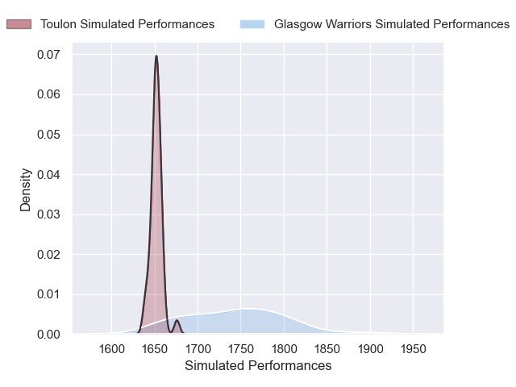
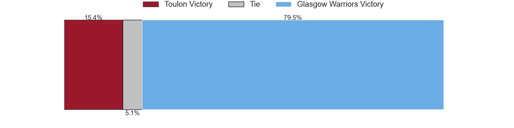
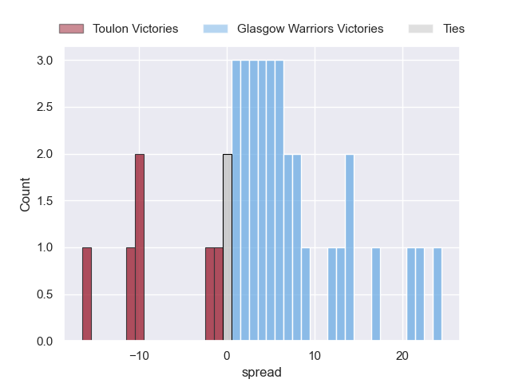

### Saracens V Ulster on 2025/04/04

Average Margin: Ulster by 4.2

### Munster V Glasgow Warriors on 2025/04/04

Average Margin: Munster by 7.5

### Saracens V Bulls on 2025/04/04

Average Margin: Bulls by 3.3

### Munster V Sale Sharks on 2025/04/04

Average Margin: Munster by 5.9

### Leinster V Saracens on 2025/04/04

Average Margin: Leinster by 8.3

### Glasgow Warriors V Harlequins on 2025/04/04

Average Margin: Glasgow Warriors by 5.6

### Harlequins V Sale Sharks on 2025/04/04

Average Margin: Harlequins by 6.0

### Munster V Clermont Auvergne on 2025/04/04

Average Margin: Munster by 4.0

### Bordeaux Begles V Northampton Saints on 2025/04/04

Average Margin: Bordeaux Begles by 6.0

### Harlequins V Racing 92 on 2025/04/04

Average Margin: Harlequins by 5.5

### Munster V Benetton Treviso on 2025/04/04

Average Margin: Munster by 3.0

### La Rochelle V Castres Olympique on 2025/04/04

Average Margin: La Rochelle by 9.7

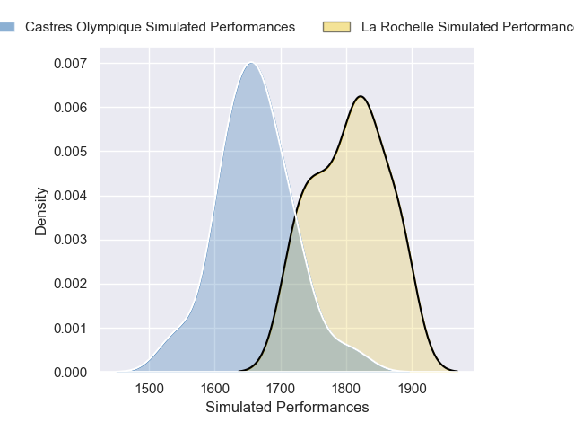
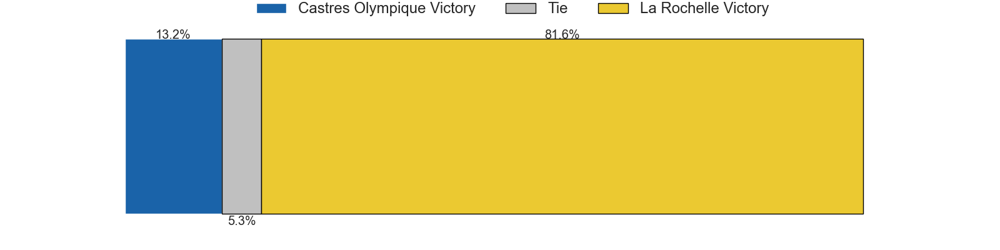
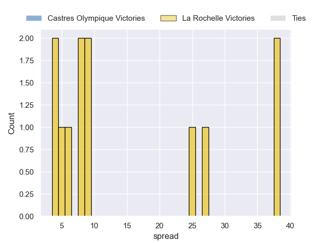

### Toulon V Northampton Saints on 2025/04/04

Average Margin: Toulon by 3.2

### Glasgow Warriors V Leinster on 2025/04/04

Average Margin: Glasgow Warriors by 3.9

### Northampton Saints V Bordeaux Begles on 2025/04/04

Average Margin: Northampton Saints by 2.7

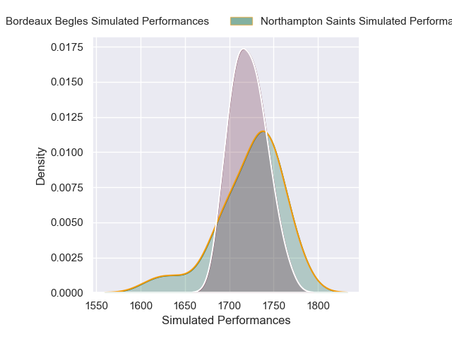

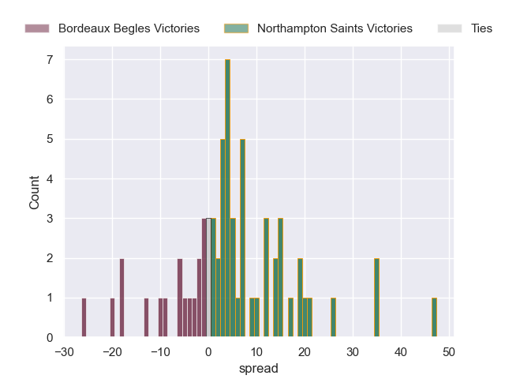

### Castres Olympique V Northampton Saints on 2025/04/04

Average Margin: Castres Olympique by 4.0

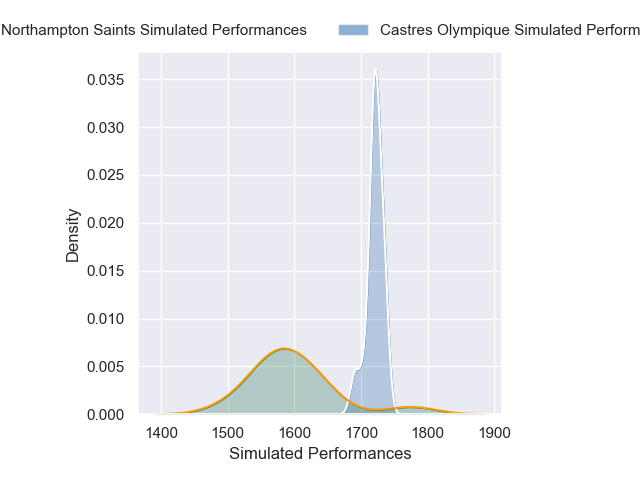
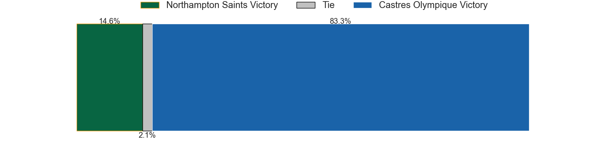
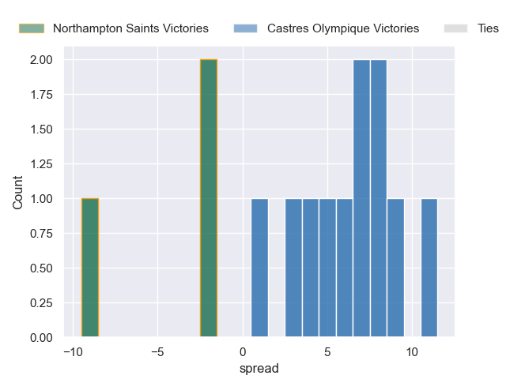

### Glasgow Warriors V Bordeaux Begles on 2025/04/04

Average Margin: Glasgow Warriors by 0.5

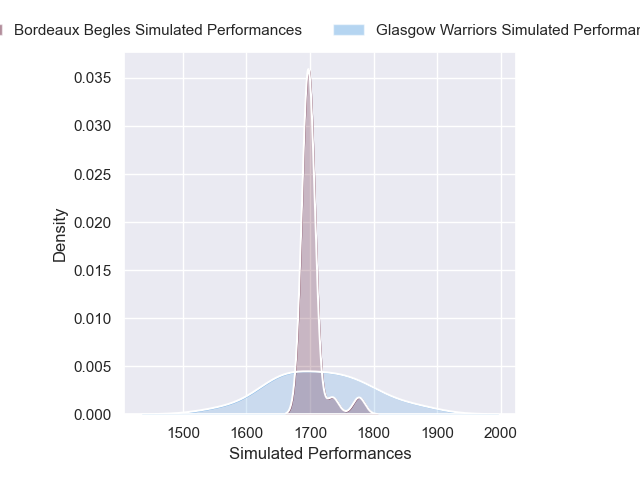

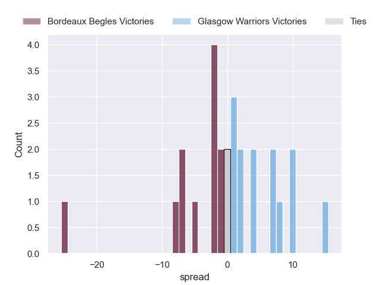

### Sharks V Benetton Treviso on 2025/04/04

Average Margin: Sharks by 4.9

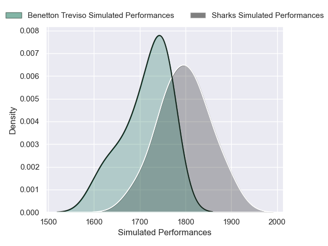

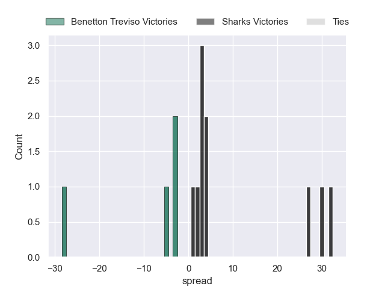

### Bordeaux Begles V Clermont Auvergne on 2025/04/04

Average Margin: Bordeaux Begles by 5.0

### Clermont Auvergne V Leinster on 2025/04/04

Average Margin: Clermont Auvergne by 6.0

### Sharks V Munster on 2025/04/04

Average Margin: Sharks by 2.7

### La Rochelle V Ulster on 2025/04/04

Average Margin: Ulster by 2.0

### Northampton Saints V Toulon on 2025/04/04

Average Margin: Northampton Saints by 2.0

### Racing 92 V Leicester Tigers on 2025/04/04

Average Margin: Racing 92 by 0.4

### Castres Olympique V Munster on 2025/04/04

Average Margin: Castres Olympique by 7.6

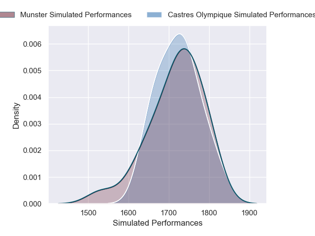
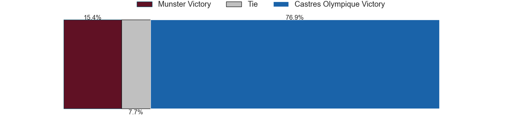
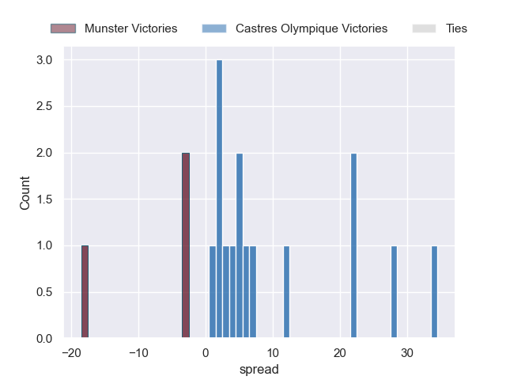

### Northampton Saints V Glasgow Warriors on 2025/04/04

Average Margin: Northampton Saints by 4.0

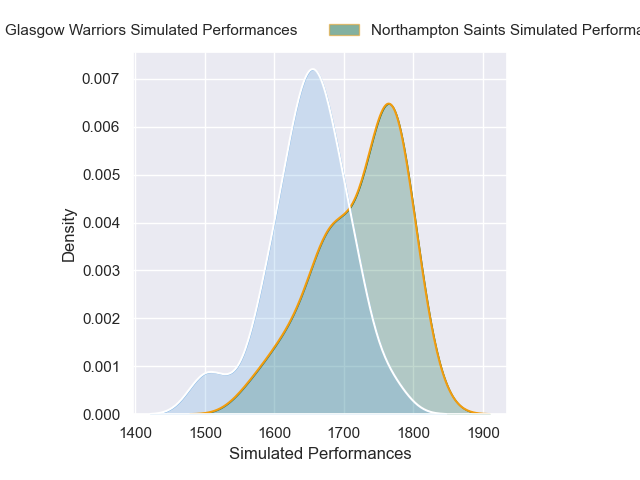
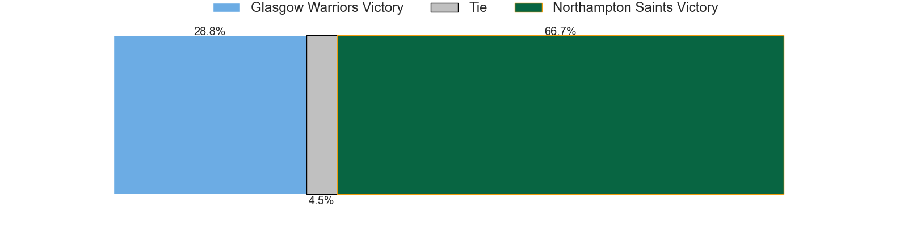
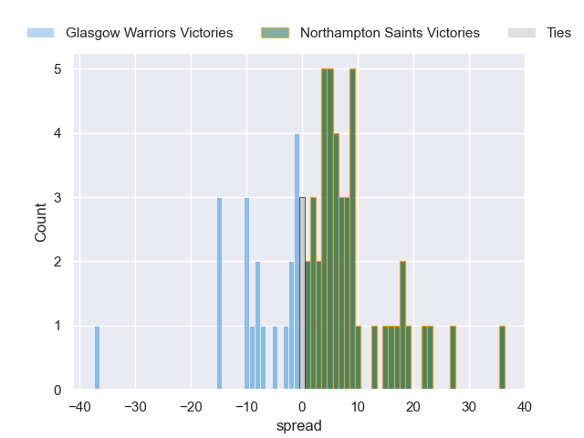

### Toulon V Bulls on 2025/04/04

Average Margin: Toulon by 1.1

### Stade Toulousain V Ulster on 2025/04/04

Average Margin: Stade Toulousain by 1.4

### La Rochelle V Bristol Rugby on 2025/04/04

Average Margin: La Rochelle by 5.0

### Clermont Auvergne V Saracens on 2025/04/04

Average Margin: Clermont Auvergne by 10.2

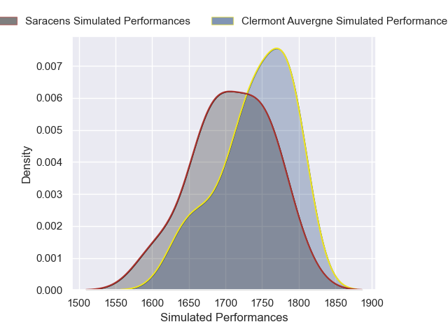
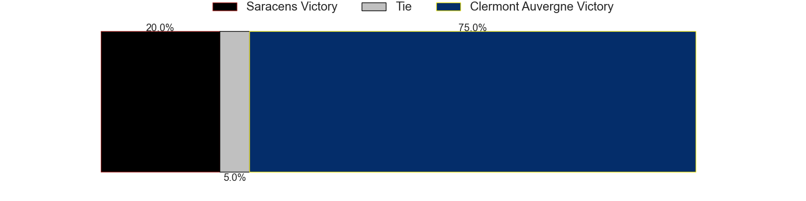
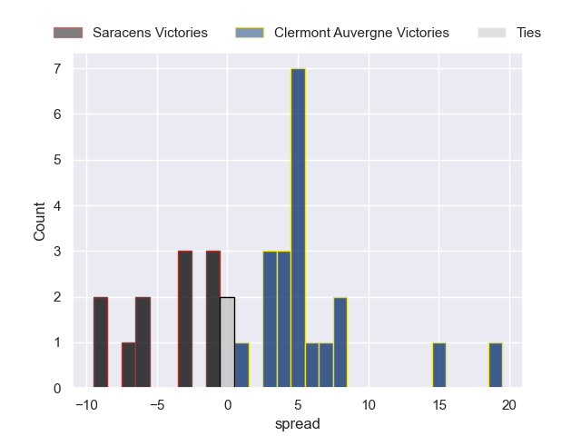

### Bordeaux Begles V Benetton Treviso on 2025/04/04

Average Margin: Bordeaux Begles by 2.7

### La Rochelle V Stade Toulousain on 2025/04/04

Average Margin: Stade Toulousain by 1.0

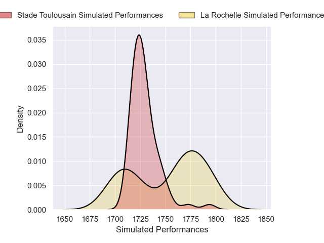

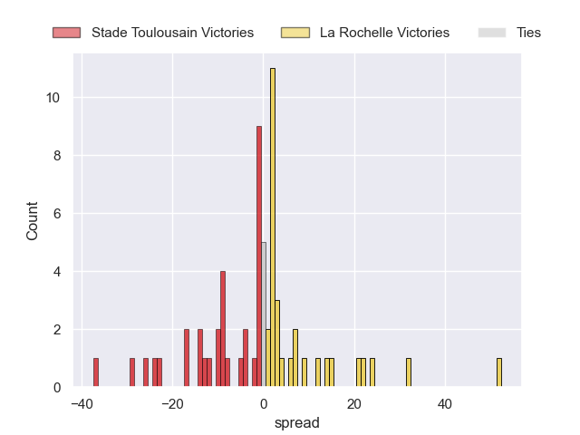

### Castres Olympique V Clermont Auvergne on 2025/04/04

Average Margin: Castres Olympique by 0.7

### Leinster V Northampton Saints on 2025/04/04

Average Margin: Leinster by 4.0

### Munster V Racing 92 on 2025/04/04

Average Margin: Munster by 6.6

### La Rochelle V Saracens on 2025/04/04

Average Margin: La Rochelle by 8.0

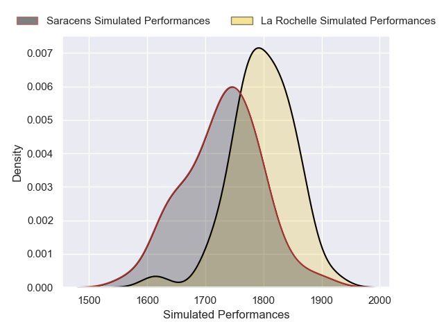
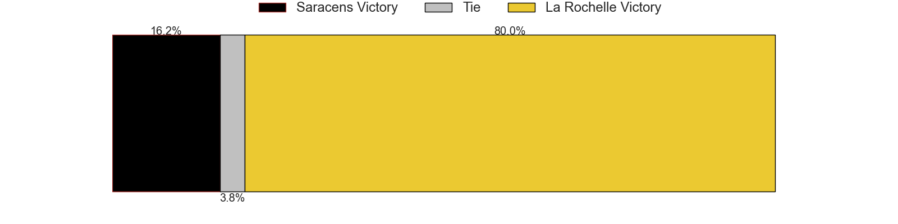
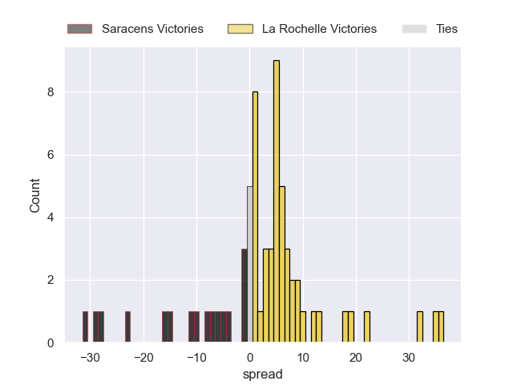

### Glasgow Warriors V Stormers on 2025/04/04

Average Margin: Glasgow Warriors by 3.1

### Munster V Bulls on 2025/04/04

Average Margin: Munster by 2.0

### Stade Toulousain V Bordeaux Begles on 2025/04/04

Average Margin: Stade Toulousain by 3.3

### Bordeaux Begles V Sale Sharks on 2025/04/04

Average Margin: Bordeaux Begles by 9.1

### La Rochelle V Benetton Treviso on 2025/04/04

Average Margin: La Rochelle by 5.5

### Toulon V Leinster on 2025/04/04

Average Margin: Toulon by 2.5

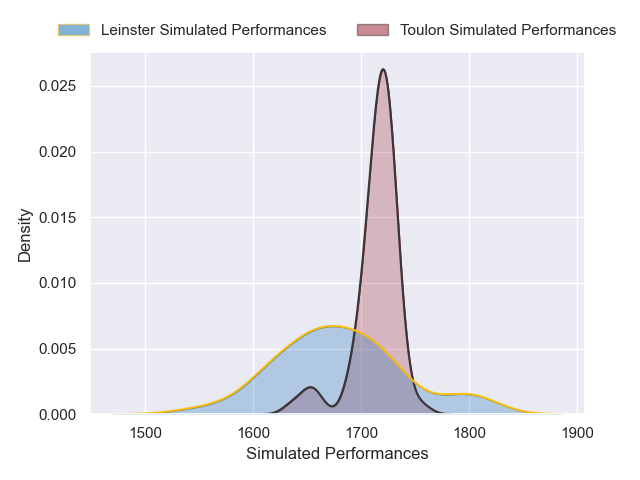

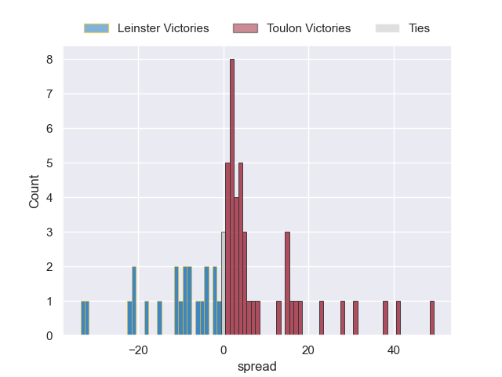

### Clermont Auvergne V Sharks on 2025/04/04

Average Margin: Clermont Auvergne by 1.3

### Harlequins V La Rochelle on 2025/04/04

Average Margin: Harlequins by 2.2

### Northampton Saints V Stade Toulousain on 2025/04/04

Average Margin: Stade Toulousain by 0.7

### Saracens V Sharks on 2025/04/04

Average Margin: Sharks by 0.6

### Leinster V Stade Toulousain on 2025/04/04

Average Margin: Stade Toulousain by 0.1

### Toulon V Bath Rugby on 2025/04/04

Average Margin: Toulon by 2.4

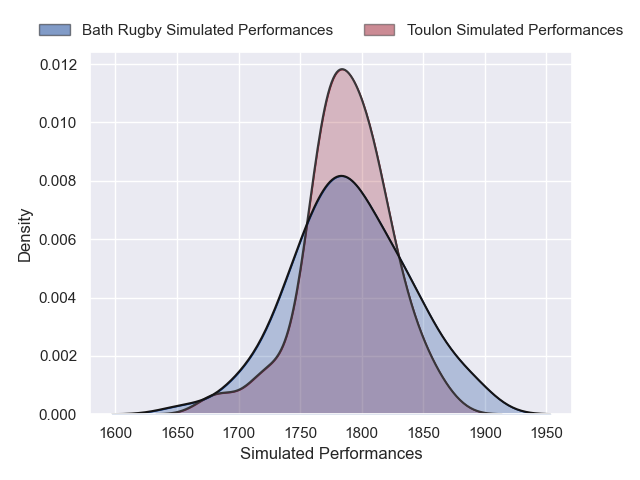

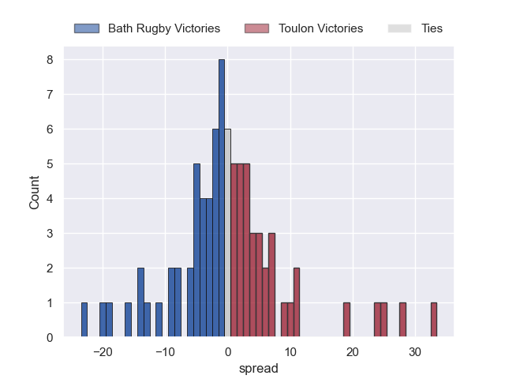

### Castres Olympique V Sharks on 2025/04/04

Average Margin: Sharks by 3.0

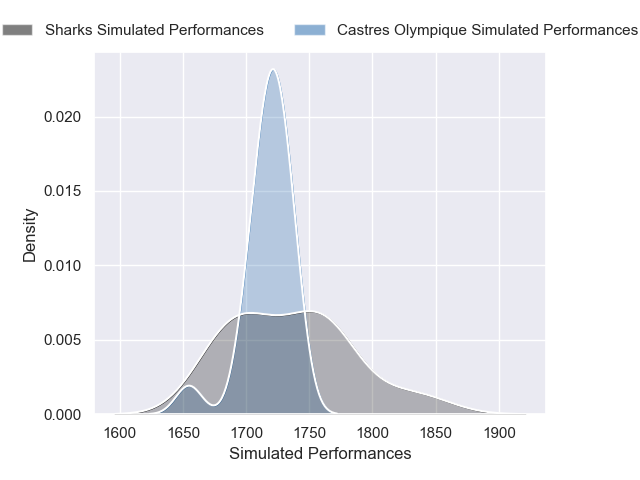

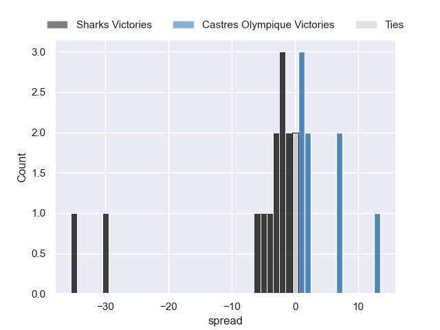

### Northampton Saints V Saracens on 2025/04/04

Average Margin: Northampton Saints by 5.9

### La Rochelle V Leicester Tigers on 2025/04/04

Average Margin: La Rochelle by 7.5

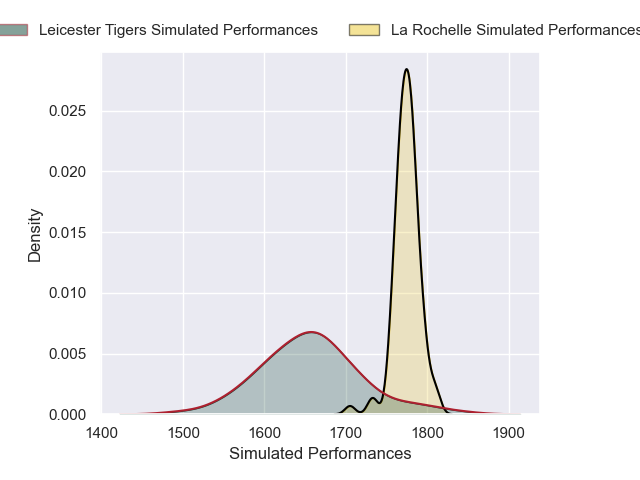
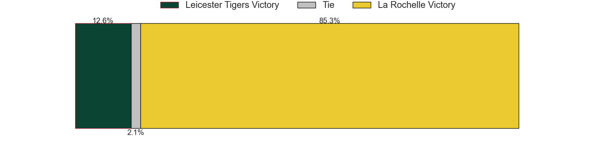
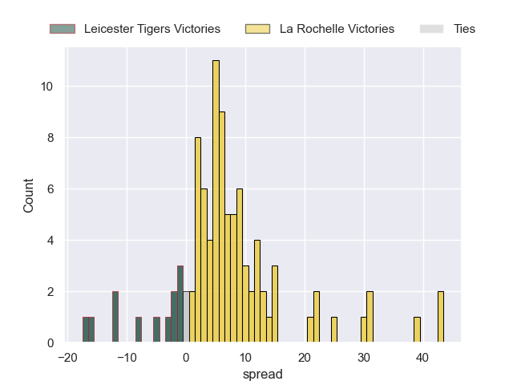

### La Rochelle V Bulls on 2025/04/04

Average Margin: La Rochelle by 2.9

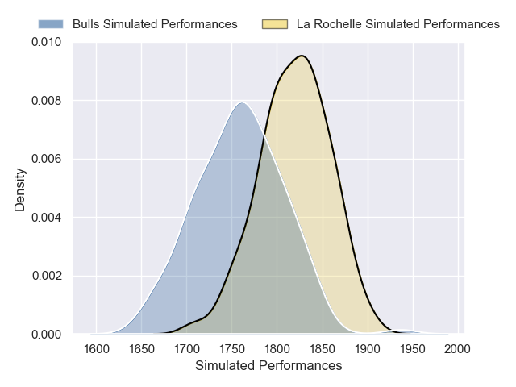
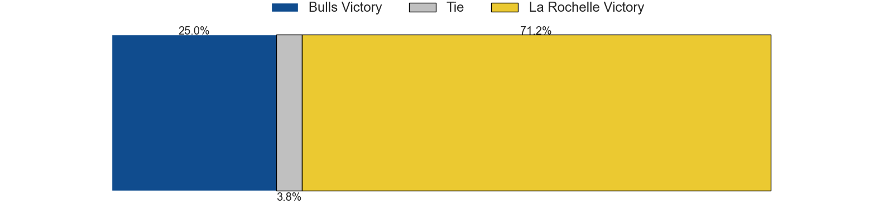
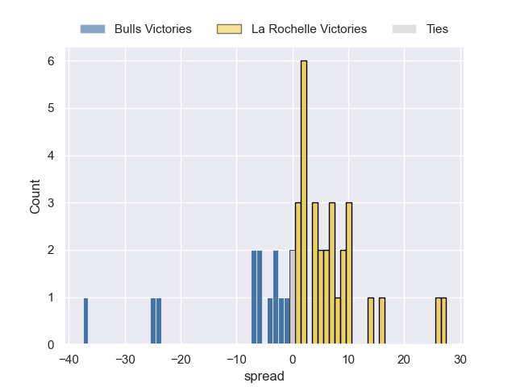

### Bordeaux Begles V Racing 92 on 2025/04/04

Average Margin: Bordeaux Begles by 7.4

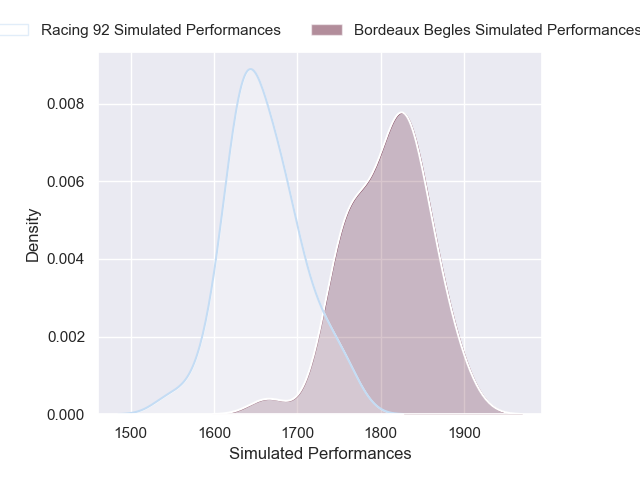
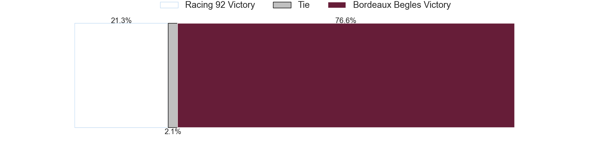
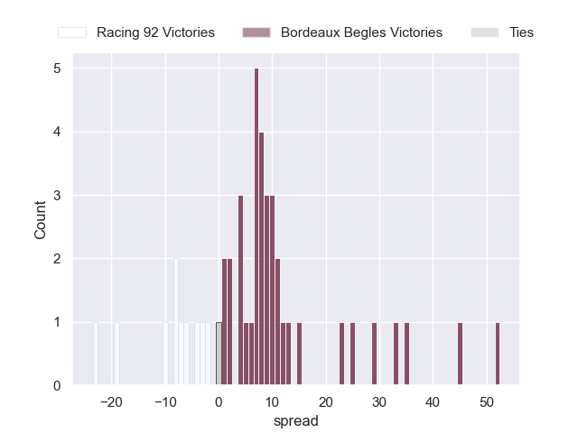

### Northampton Saints V Stormers on 2025/04/04

Average Margin: Northampton Saints by 1.3

### Munster V La Rochelle on 2025/04/04

Average Margin: Munster by 4.3

### Bordeaux Begles V Stormers on 2025/04/04

Average Margin: Bordeaux Begles by 0.5

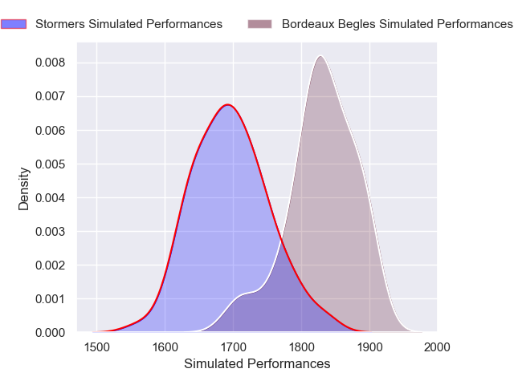
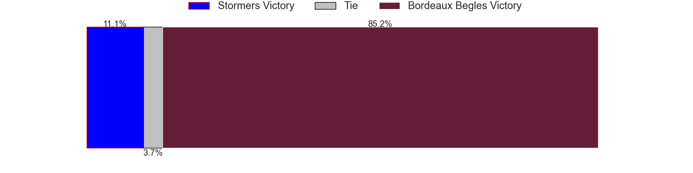
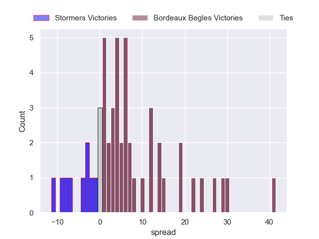

### Benetton Treviso V Saracens on 2025/04/04

Average Margin: Benetton Treviso by 12.1

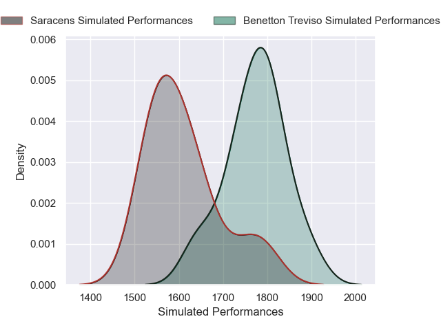
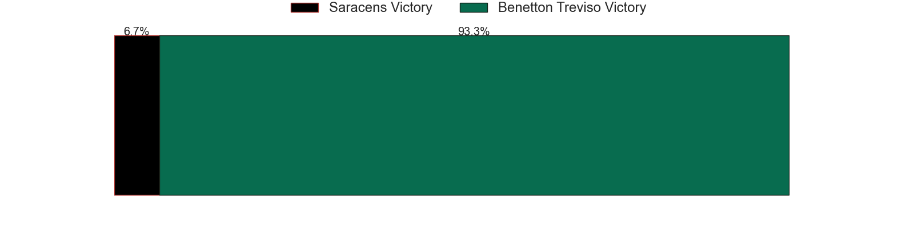
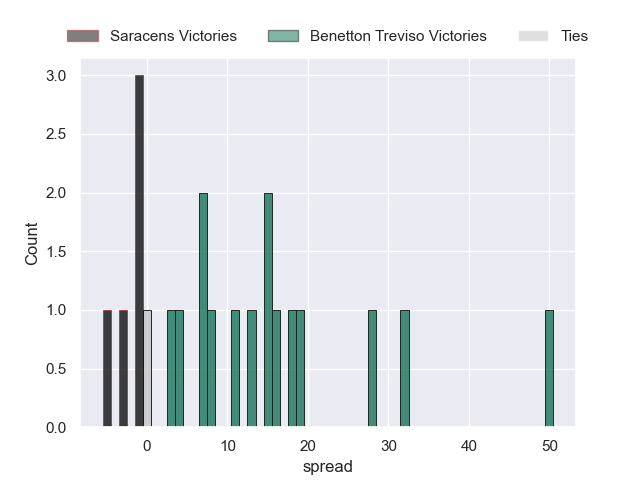

### Leinster V Glasgow Warriors on 2025/04/04

Average Margin: Leinster by 8.9

### Benetton Treviso V Leicester Tigers on 2025/04/04

Average Margin: Benetton Treviso by 9.4


### Leinster V Bristol Rugby on 2025/04/04

Average Margin: Leinster by 10.9

### Glasgow Warriors V Northampton Saints on 2025/04/04

Average Margin: Glasgow Warriors by 5.8

### Munster V Harlequins on 2025/04/04

Average Margin: Munster by 7.9

### Bordeaux Begles V Leinster on 2025/04/04

Average Margin: Bordeaux Begles by 3.1

### Glasgow Warriors V Bulls on 2025/04/04

Average Margin: Glasgow Warriors by 1.2


### Saracens V Racing 92 on 2025/04/04

Average Margin: Saracens by 3.7

### Stade Toulousain V Northampton Saints on 2025/04/04

Average Margin: Stade Toulousain by 7.5

### Saracens V Stade Toulousain on 2025/04/04

Average Margin: Stade Toulousain by 4.5

### Glasgow Warriors V Saracens on 2025/04/04

Average Margin: Glasgow Warriors by 9.1

### Castres Olympique V Leicester Tigers on 2025/04/04

Average Margin: Castres Olympique by 4.0


### Leinster V Benetton Treviso on 2025/04/04

Average Margin: Leinster by 2.9

### Leinster V Leicester Tigers on 2025/04/04

Average Margin: Leinster by 6.6

### Leinster V Stormers on 2025/04/04

Average Margin: Stormers by 4.5

### Harlequins V Sharks on 2025/04/04

Average Margin: Sharks by 0.8

### Bordeaux Begles V Glasgow Warriors on 2025/04/04

Average Margin: Bordeaux Begles by 6.0

### Stade Toulousain V Bulls on 2025/04/04

Average Margin: Stade Toulousain by 3.9

### Harlequins V Munster on 2025/04/04

Average Margin: Harlequins by 7.2

### Northampton Saints V Munster on 2025/04/04

Average Margin: Northampton Saints by 2.8

### Stade Toulousain V Toulon on 2025/04/04

Average Margin: Stade Toulousain by 8.6

### Bordeaux Begles V La Rochelle on 2025/04/04

Average Margin: Bordeaux Begles by 2.1

### Benetton Treviso V Leinster on 2025/04/04

Average Margin: Benetton Treviso by 7.5


### Clermont Auvergne V La Rochelle on 2025/04/04

Average Margin: Clermont Auvergne by 3.3

### Sharks V Bordeaux Begles on 2025/04/04

Average Margin: Sharks by 7.6

### Benetton Treviso V Castres Olympique on 2025/04/04

Average Margin: Benetton Treviso by 8.3


### Sharks V Clermont Auvergne on 2025/04/04

Average Margin: Sharks by 6.9


### La Rochelle V Bordeaux Begles on 2025/04/04

Average Margin: La Rochelle by 2.7


### Saracens V La Rochelle on 2025/04/04

Average Margin: La Rochelle by 0.9

### Saracens V Glasgow Warriors on 2025/04/04

Average Margin: Saracens by 2.3

### Clermont Auvergne V Racing 92 on 2025/04/04

Average Margin: Clermont Auvergne by 7.1


### Sale Sharks V Benetton Treviso on 2025/04/04

Average Margin: Sale Sharks by 2.9

### Leinster V Bordeaux Begles on 2025/04/04

Average Margin: Leinster by 5.5


### Benetton Treviso V Clermont Auvergne on 2025/04/04

Average Margin: Benetton Treviso by 13.7


### Racing 92 V Benetton Treviso on 2025/04/04

Average Margin: Benetton Treviso by 1.3

### Munster V Toulon on 2025/04/04

Average Margin: Munster by 7.1


### La Rochelle V Northampton Saints on 2025/04/04

Average Margin: La Rochelle by 8.3

### La Rochelle V Leinster on 2025/04/04

Average Margin: La Rochelle by 6.0

### Northampton Saints V La Rochelle on 2025/04/04

Average Margin: Northampton Saints by 1.3

### Stade Toulousain V Stade Francais Paris on 2025/04/04

Average Margin: Stade Toulousain by 6.6


### Sharks V Northampton Saints on 2025/04/04

Average Margin: Sharks by 8.7


### Harlequins V Leinster on 2025/04/04

Average Margin: Harlequins by 3.1


### Bordeaux Begles V Stade Toulousain on 2025/04/04

Average Margin: Stade Toulousain by 1.2

### Benetton Treviso V Northampton Saints on 2025/04/04

Average Margin: Benetton Treviso by 10.1


### Clermont Auvergne V Northampton Saints on 2025/04/04

Average Margin: Clermont Auvergne by 7.2

### Benetton Treviso V Toulon on 2025/04/04

Average Margin: Benetton Treviso by 5.9


### Benetton Treviso V Harlequins on 2025/04/04

Average Margin: Benetton Treviso by 10.7


### Clermont Auvergne V Ulster on 2025/04/04

Average Margin: Ulster by 8.4


### Stade Toulousain V Leinster on 2025/04/04

Average Margin: Stade Toulousain by 4.8

### Castres Olympique V Benetton Treviso on 2025/04/04

Average Margin: Castres Olympique by 3.8

### Munster V Northampton Saints on 2025/04/04

Average Margin: Munster by 6.5

### Munster V Saracens on 2025/04/04

Average Margin: Munster by 11.4


### Stade Toulousain V Glasgow Warriors on 2025/04/04

Average Margin: Stade Toulousain by 8.0

### Munster V Leicester Tigers on 2025/04/04

Average Margin: Munster by 5.7


### Bordeaux Begles V Saracens on 2025/04/04

Average Margin: Bordeaux Begles by 8.4

### Sale Sharks V Harlequins on 2025/04/04

Average Margin: Harlequins by 0.6

### Racing 92 V Clermont Auvergne on 2025/04/04

Average Margin: Clermont Auvergne by 0.7

### Glasgow Warriors V Ulster on 2025/04/04

Average Margin: Ulster by 4.4

### Munster V Ulster on 2025/04/04

Average Margin: Ulster by 4.8

### Toulon V Glasgow Warriors on 2025/04/04

Average Margin: Toulon by 2.2

### Toulon V Ulster on 2025/04/04

Average Margin: Ulster by 2.3

### Castres Olympique V Glasgow Warriors on 2025/04/04

Average Margin: Castres Olympique by 6.3


### Toulon V Bordeaux Begles on 2025/04/04

Average Margin: Toulon by 0.3

### Munster V Leinster on 2025/04/04

Average Margin: Munster by 2.5

### Harlequins V Benetton Treviso on 2025/04/04

Average Margin: Benetton Treviso by 1.0

### Clermont Auvergne V Sale Sharks on 2025/04/04

Average Margin: Clermont Auvergne by 6.2


### Bordeaux Begles V Stade Francais Paris on 2025/04/04

Average Margin: Bordeaux Begles by 4.7


### Harlequins V Saracens on 2025/04/04

Average Margin: Harlequins by 5.4


### Sale Sharks V Toulon on 2025/04/04

Average Margin: Sale Sharks by 2.2

### Sharks V Sale Sharks on 2025/04/04

Average Margin: Sharks by 11.1


### Clermont Auvergne V Benetton Treviso on 2025/04/04

Average Margin: Clermont Auvergne by 1.9


### Northampton Saints V Stade Francais Paris on 2025/04/04

Average Margin: Northampton Saints by 7.2


### Clermont Auvergne V Toulon on 2025/04/04

Average Margin: Clermont Auvergne by 10.7


### Toulon V Stade Toulousain on 2025/04/04

Average Margin: Toulon by 1.3

### Munster V Bordeaux Begles on 2025/04/04

Average Margin: Munster by 3.2


### Clermont Auvergne V Bordeaux Begles on 2025/04/04

Average Margin: Clermont Auvergne by 4.2


### Toulon V Stormers on 2025/04/04

Average Margin: Stormers by 2.5


### Stade Toulousain V Saracens on 2025/04/04

Average Margin: Stade Toulousain by 8.7

### Benetton Treviso V Sharks on 2025/04/04

Average Margin: Benetton Treviso by 0.3

### Benetton Treviso V Glasgow Warriors on 2025/04/04

Average Margin: Benetton Treviso by 11.9


### Clermont Auvergne V Glasgow Warriors on 2025/04/04

Average Margin: Clermont Auvergne by 8.6


### Castres Olympique V La Rochelle on 2025/04/04

Average Margin: La Rochelle by 0.9


### Saracens V Toulon on 2025/04/04

Average Margin: Saracens by 0.2


### Castres Olympique V Leinster on 2025/04/04

Average Margin: Castres Olympique by 4.1

### Northampton Saints V Leinster on 2025/04/04

Average Margin: Northampton Saints by 2.5


### Clermont Auvergne V Castres Olympique on 2025/04/04

Average Margin: Clermont Auvergne by 5.1

### Stade Toulousain V Sale Sharks on 2025/04/04

Average Margin: Stade Toulousain by 8.6

### Leinster V Bulls on 2025/04/04

Average Margin: Bulls by 1.0

### Glasgow Warriors V Clermont Auvergne on 2025/04/04

Average Margin: Glasgow Warriors by 3.0

### Benetton Treviso V Munster on 2025/04/04

Average Margin: Benetton Treviso by 5.6

### Bordeaux Begles V Harlequins on 2025/04/04

Average Margin: Bordeaux Begles by 7.8


### Northampton Saints V Sale Sharks on 2025/04/04

Average Margin: Northampton Saints by 4.4

### Bordeaux Begles V Castres Olympique on 2025/04/04

Average Margin: Bordeaux Begles by 6.2

### Harlequins V Clermont Auvergne on 2025/04/04

Average Margin: Clermont Auvergne by 3.9

### Northampton Saints V Ulster on 2025/04/04

Average Margin: Ulster by 2.3

### Northampton Saints V Sharks on 2025/04/04

Average Margin: Northampton Saints by 1.7

### Stade Toulousain V Castres Olympique on 2025/04/04

Average Margin: Stade Toulousain by 7.7

### Benetton Treviso V Sale Sharks on 2025/04/04

Average Margin: Benetton Treviso by 8.5


### Glasgow Warriors V La Rochelle on 2025/04/04

Average Margin: La Rochelle by 0.9

### Saracens V Leicester Tigers on 2025/04/04

Average Margin: Saracens by 0.6

### Toulon V Clermont Auvergne on 2025/04/04

Average Margin: Toulon by 1.5

### Sharks V La Rochelle on 2025/04/04

Average Margin: Sharks by 6.1


### Leinster V Munster on 2025/04/04

Average Margin: Leinster by 7.1

### Northampton Saints V Leicester Tigers on 2025/04/04

Average Margin: Northampton Saints by 5.5

### Toulon V Castres Olympique on 2025/04/04

Average Margin: Toulon by 2.7

### Stade Toulousain V Stormers on 2025/04/04

Average Margin: Stade Toulousain by 2.8

### Northampton Saints V Bath Rugby on 2025/04/04

Average Margin: Northampton Saints by 3.6

### Glasgow Warriors V Leicester Tigers on 2025/04/04

Average Margin: Glasgow Warriors by 5.4

### Saracens V Clermont Auvergne on 2025/04/04

Average Margin: Clermont Auvergne by 0.4


### Stade Toulousain V Harlequins on 2025/04/04

Average Margin: Stade Toulousain by 8.4

### La Rochelle V Stormers on 2025/04/04

Average Margin: La Rochelle by 2.8


### Stade Toulousain V Bath Rugby on 2025/04/04

Average Margin: Stade Toulousain by 5.9

### Glasgow Warriors V Sharks on 2025/04/04

Average Margin: Glasgow Warriors by 0.3


### Toulon V Benetton Treviso on 2025/04/04

Average Margin: Toulon by 0.2

### La Rochelle V Sharks on 2025/04/04

Average Margin: La Rochelle by 3.8

### Stade Toulousain V Munster on 2025/04/04

Average Margin: Stade Toulousain by 6.0

### La Rochelle V Harlequins on 2025/04/04

Average Margin: La Rochelle by 8.9

### Northampton Saints V Clermont Auvergne on 2025/04/04

Average Margin: Northampton Saints by 2.3

### Toulon V Leicester Tigers on 2025/04/04

Average Margin: Toulon by 2.6

### Leinster V Racing 92 on 2025/04/04

Average Margin: Leinster by 8.3

### Benetton Treviso V Ulster on 2025/04/04

Average Margin: Benetton Treviso by 1.5


### Bordeaux Begles V Bath Rugby on 2025/04/04

Average Margin: Bordeaux Begles by 11.0

### Clermont Auvergne V Harlequins on 2025/04/04

Average Margin: Clermont Auvergne by 9.7

### Bordeaux Begles V Bulls on 2025/04/04

Average Margin: Bordeaux Begles by 2.6

### Toulon V La Rochelle on 2025/04/04

Average Margin: La Rochelle by 1.3

### Sale Sharks V La Rochelle on 2025/04/04

Average Margin: Sale Sharks by 2.1


### Munster V Sharks on 2025/04/04

Average Margin: Munster by 2.2

### Stade Toulousain V Benetton Treviso on 2025/04/04

Average Margin: Stade Toulousain by 4.6

### Leinster V Bath Rugby on 2025/04/04

Average Margin: Leinster by 2.3

### Stade Toulousain V Leicester Tigers on 2025/04/04

Average Margin: Stade Toulousain by 8.1

### Glasgow Warriors V Munster on 2025/04/04

Average Margin: Munster by 0.1

### Saracens V Harlequins on 2025/04/04

Average Margin: Saracens by 3.9

### La Rochelle V Clermont Auvergne on 2025/04/04

Average Margin: La Rochelle by 4.6

### Bordeaux Begles V Ulster on 2025/04/04

Average Margin: Bordeaux Begles by 0.5

### Bordeaux Begles V Toulon on 2025/04/04

Average Margin: Bordeaux Begles by 7.8


### Toulon V Sale Sharks on 2025/04/04

Average Margin: Toulon by 3.7

### Leinster V Castres Olympique on 2025/04/04

Average Margin: Leinster by 6.2

### Stade Toulousain V Sharks on 2025/04/04

Average Margin: Stade Toulousain by 5.3

### La Rochelle V Toulon on 2025/04/04

Average Margin: La Rochelle by 7.3

### Sale Sharks V Clermont Auvergne on 2025/04/04

Average Margin: Sale Sharks by 9.4

### Saracens V Munster on 2025/04/04

Average Margin: Saracens by 3.1

### Bordeaux Begles V Leicester Tigers on 2025/04/04

Average Margin: Bordeaux Begles by 6.7

### Northampton Saints V Racing 92 on 2025/04/04

Average Margin: Northampton Saints by 5.0

### Northampton Saints V Castres Olympique on 2025/04/04

Average Margin: Northampton Saints by 4.9

### Saracens V Northampton Saints on 2025/04/04

Average Margin: Saracens by 4.0

### Clermont Auvergne V Leicester Tigers on 2025/04/04

Average Margin: Clermont Auvergne by 6.4

### Leinster V Harlequins on 2025/04/04

Average Margin: Leinster by 5.9

### Saracens V Sale Sharks on 2025/04/04

Average Margin: Saracens by 4.7

### Leinster V Sharks on 2025/04/04

Average Margin: Leinster by 2.7

### Bordeaux Begles V Munster on 2025/04/04

Average Margin: Bordeaux Begles by 5.7

### Harlequins V Glasgow Warriors on 2025/04/04

Average Margin: Harlequins by 1.8

### Stade Toulousain V La Rochelle on 2025/04/04

Average Margin: Stade Toulousain by 3.0

### Saracens V Castres Olympique on 2025/04/04

Average Margin: Saracens by 3.8

### Toulon V Racing 92 on 2025/04/04

Average Margin: Toulon by 7.3

### Northampton Saints V Benetton Treviso on 2025/04/04

Average Margin: Northampton Saints by 0.9

### Glasgow Warriors V Sale Sharks on 2025/04/04

Average Margin: Glasgow Warriors by 4.2

### La Rochelle V Munster on 2025/04/04

Average Margin: La Rochelle by 5.8

### Toulon V Harlequins on 2025/04/04

Average Margin: Toulon by 3.9

### Bordeaux Begles V Sharks on 2025/04/04

Average Margin: Bordeaux Begles by 3.6

### La Rochelle V Racing 92 on 2025/04/04

Average Margin: La Rochelle by 8.5

### Toulon V Munster on 2025/04/04

Average Margin: Toulon by 1.0

### Saracens V Benetton Treviso on 2025/04/04

Average Margin: Benetton Treviso by 2.8

### Sale Sharks V Glasgow Warriors on 2025/04/04

Average Margin: Sale Sharks by 11.3

### Leinster V Clermont Auvergne on 2025/04/04

Average Margin: Leinster by 3.5


### Glasgow Warriors V Castres Olympique on 2025/04/04

Average Margin: Glasgow Warriors by 5.2

### Benetton Treviso V La Rochelle on 2025/04/04

Average Margin: Benetton Treviso by 5.3


### Leinster V Ulster on 2025/04/04

Average Margin: Ulster by 0.3

### Leinster V Sale Sharks on 2025/04/04

Average Margin: Leinster by 7.0

### Clermont Auvergne V Munster on 2025/04/04

Average Margin: Clermont Auvergne by 7.1

### Munster V Castres Olympique on 2025/04/04

Average Margin: Munster by 2.1

### Toulon V Saracens on 2025/04/04

Average Margin: Toulon by 6.7

### La Rochelle V Glasgow Warriors on 2025/04/04

Average Margin: La Rochelle by 9.2

### Stade Toulousain V Racing 92 on 2025/04/04

Average Margin: Stade Toulousain by 6.9

### Saracens V Leinster on 2025/04/04

Average Margin: Leinster by 1.2


### Sharks V Leinster on 2025/04/04

Average Margin: Sharks by 5.8


### Saracens V Bordeaux Begles on 2025/04/04

Average Margin: Saracens by 1.1

### La Rochelle V Bath Rugby on 2025/04/04

Average Margin: La Rochelle by 8.9


### Glasgow Warriors V Stade Toulousain on 2025/04/04

Average Margin: Glasgow Warriors by 0.1


### Northampton Saints V Harlequins on 2025/04/04

Average Margin: Northampton Saints by 4.9


### Saracens V Stormers on 2025/04/04

Average Margin: Stormers by 1.7

### Glasgow Warriors V Racing 92 on 2025/04/04

Average Margin: Glasgow Warriors by 6.3

### Leinster V La Rochelle on 2025/04/04

Average Margin: Leinster by 3.0

### Toulon V Sharks on 2025/04/04

Average Margin: Sharks by 2.1

### Northampton Saints V Bulls on 2025/04/04

Average Margin: Bulls by 0.9

### Leinster V Toulon on 2025/04/04

Average Margin: Leinster by 6.1

### Stade Toulousain V Clermont Auvergne on 2025/04/04

Average Margin: Stade Toulousain by 6.4

### La Rochelle V Sale Sharks on 2025/04/04

Average Margin: La Rochelle by 6.5

### Harlequins V Leicester Tigers on 2025/04/04

Average Margin: Harlequins by 1.3

## Quarterfinals

### Bordeaux Begles V Northampton Saints on 2025/04/11

Average Margin: Bordeaux Begles by 6.0

### Castres Olympique V La Rochelle on 2025/04/11

Average Margin: La Rochelle by 0.9

### Benetton Treviso V Munster on 2025/04/11

Average Margin: Benetton Treviso by 5.6

### Saracens V Leicester Tigers on 2025/04/11

Average Margin: Saracens by 0.6

### La Rochelle V Sale Sharks on 2025/04/11

Average Margin: La Rochelle by 6.5

### Glasgow Warriors V La Rochelle on 2025/04/11

Average Margin: La Rochelle by 0.9

### Stade Toulousain V Bulls on 2025/04/11

Average Margin: Stade Toulousain by 3.9

### Castres Olympique V Leicester Tigers on 2025/04/11

Average Margin: Castres Olympique by 4.0

### Leinster V Leicester Tigers on 2025/04/11

Average Margin: Leinster by 6.6

### Saracens V La Rochelle on 2025/04/11

Average Margin: La Rochelle by 0.9

### Munster V Bordeaux Begles on 2025/04/11

Average Margin: Munster by 3.2

### Clermont Auvergne V Northampton Saints on 2025/04/11

Average Margin: Clermont Auvergne by 7.2

### Harlequins V Sale Sharks on 2025/04/11

Average Margin: Harlequins by 6.0

### Clermont Auvergne V Racing 92 on 2025/04/11

Average Margin: Clermont Auvergne by 7.1

### Leinster V Saracens on 2025/04/11

Average Margin: Leinster by 8.3

### Stade Toulousain V Sale Sharks on 2025/04/11

Average Margin: Stade Toulousain by 8.6

### Bordeaux Begles V Saracens on 2025/04/11

Average Margin: Bordeaux Begles by 8.4

### Bordeaux Begles V Stade Francais Paris on 2025/04/11

Average Margin: Bordeaux Begles by 4.7

### Sharks V Benetton Treviso on 2025/04/11

Average Margin: Sharks by 4.9

### Northampton Saints V Stormers on 2025/04/11

Average Margin: Northampton Saints by 1.3

### Benetton Treviso V Saracens on 2025/04/11

Average Margin: Benetton Treviso by 12.1

### Glasgow Warriors V Stormers on 2025/04/11

Average Margin: Glasgow Warriors by 3.1

### Toulon V Stade Toulousain on 2025/04/11

Average Margin: Toulon by 1.3

### Munster V Benetton Treviso on 2025/04/11

Average Margin: Munster by 3.0

### Munster V Leicester Tigers on 2025/04/11

Average Margin: Munster by 5.7

### Saracens V Castres Olympique on 2025/04/11

Average Margin: Saracens by 3.8

### Saracens V Harlequins on 2025/04/11

Average Margin: Saracens by 3.9

### Sharks V Munster on 2025/04/11

Average Margin: Sharks by 2.7

### Benetton Treviso V Castres Olympique on 2025/04/11

Average Margin: Benetton Treviso by 8.3

### Northampton Saints V Sharks on 2025/04/11

Average Margin: Northampton Saints by 1.7

### Bordeaux Begles V Racing 92 on 2025/04/11

Average Margin: Bordeaux Begles by 7.4

### Clermont Auvergne V Sharks on 2025/04/11

Average Margin: Clermont Auvergne by 1.3

### Glasgow Warriors V Clermont Auvergne on 2025/04/11

Average Margin: Glasgow Warriors by 3.0

### Leinster V Benetton Treviso on 2025/04/11

Average Margin: Leinster by 2.9

### Harlequins V La Rochelle on 2025/04/11

Average Margin: Harlequins by 2.2

### Racing 92 V Leicester Tigers on 2025/04/11

Average Margin: Racing 92 by 0.4

### Castres Olympique V Clermont Auvergne on 2025/04/11

Average Margin: Castres Olympique by 0.7

### Northampton Saints V Benetton Treviso on 2025/04/11

Average Margin: Northampton Saints by 0.9

### Harlequins V Sharks on 2025/04/11

Average Margin: Sharks by 0.8

### Clermont Auvergne V Leinster on 2025/04/11

Average Margin: Clermont Auvergne by 6.0

### Saracens V Stade Toulousain on 2025/04/11

Average Margin: Stade Toulousain by 4.5

### La Rochelle V Leinster on 2025/04/11

Average Margin: La Rochelle by 6.0

### Munster V Clermont Auvergne on 2025/04/11

Average Margin: Munster by 4.0

### Toulon V Leicester Tigers on 2025/04/11

Average Margin: Toulon by 2.6

### Castres Olympique V Benetton Treviso on 2025/04/11

Average Margin: Castres Olympique by 3.8

### Saracens V Northampton Saints on 2025/04/11

Average Margin: Saracens by 4.0

### Stade Toulousain V La Rochelle on 2025/04/11

Average Margin: Stade Toulousain by 3.0

### Bordeaux Begles V Clermont Auvergne on 2025/04/11

Average Margin: Bordeaux Begles by 5.0

### Glasgow Warriors V Sale Sharks on 2025/04/11

Average Margin: Glasgow Warriors by 4.2

### Glasgow Warriors V Stade Toulousain on 2025/04/11

Average Margin: Glasgow Warriors by 0.1

### Clermont Auvergne V Toulon on 2025/04/11

Average Margin: Clermont Auvergne by 10.7

### Glasgow Warriors V Munster on 2025/04/11

Average Margin: Munster by 0.1

### Toulon V Bordeaux Begles on 2025/04/11

Average Margin: Toulon by 0.3

### Glasgow Warriors V Leicester Tigers on 2025/04/11

Average Margin: Glasgow Warriors by 5.4

### Saracens V Benetton Treviso on 2025/04/11

Average Margin: Benetton Treviso by 2.8

### Leinster V Clermont Auvergne on 2025/04/11

Average Margin: Leinster by 3.5

### Harlequins V Clermont Auvergne on 2025/04/11

Average Margin: Clermont Auvergne by 3.9

### Bordeaux Begles V Munster on 2025/04/11

Average Margin: Bordeaux Begles by 5.7

### Clermont Auvergne V Saracens on 2025/04/11

Average Margin: Clermont Auvergne by 10.2

### Toulon V Castres Olympique on 2025/04/11

Average Margin: Toulon by 2.7

### Clermont Auvergne V La Rochelle on 2025/04/11

Average Margin: Clermont Auvergne by 3.3

### Sharks V Bordeaux Begles on 2025/04/11

Average Margin: Sharks by 7.6

### Bordeaux Begles V Bulls on 2025/04/11

Average Margin: Bordeaux Begles by 2.6

### Leinster V Sharks on 2025/04/11

Average Margin: Leinster by 2.7

### Glasgow Warriors V Sharks on 2025/04/11

Average Margin: Glasgow Warriors by 0.3

### Glasgow Warriors V Harlequins on 2025/04/11

Average Margin: Glasgow Warriors by 5.6

### Sharks V La Rochelle on 2025/04/11

Average Margin: Sharks by 6.1

### Northampton Saints V Saracens on 2025/04/11

Average Margin: Northampton Saints by 5.9

### Benetton Treviso V Clermont Auvergne on 2025/04/11

Average Margin: Benetton Treviso by 13.7

### Benetton Treviso V Sale Sharks on 2025/04/11

Average Margin: Benetton Treviso by 8.5

### Munster V Ulster on 2025/04/11

Average Margin: Ulster by 4.8

### Castres Olympique V Munster on 2025/04/11

Average Margin: Castres Olympique by 7.6

### Stade Toulousain V Benetton Treviso on 2025/04/11

Average Margin: Stade Toulousain by 4.6

### Stade Toulousain V Munster on 2025/04/11

Average Margin: Stade Toulousain by 6.0

### Leinster V Bristol Rugby on 2025/04/11

Average Margin: Leinster by 10.9

### Bordeaux Begles V Harlequins on 2025/04/11

Average Margin: Bordeaux Begles by 7.8

### Stade Toulousain V Clermont Auvergne on 2025/04/11

Average Margin: Stade Toulousain by 6.4

### Clermont Auvergne V Leicester Tigers on 2025/04/11

Average Margin: Clermont Auvergne by 6.4

### Clermont Auvergne V Munster on 2025/04/11

Average Margin: Clermont Auvergne by 7.1

### Stade Toulousain V Sharks on 2025/04/11

Average Margin: Stade Toulousain by 5.3

### Clermont Auvergne V Ulster on 2025/04/11

Average Margin: Ulster by 8.4

### Northampton Saints V Ulster on 2025/04/11

Average Margin: Ulster by 2.3

### Leinster V La Rochelle on 2025/04/11

Average Margin: Leinster by 3.0

### Toulon V Ulster on 2025/04/11

Average Margin: Ulster by 2.3

### Stade Toulousain V Toulon on 2025/04/11

Average Margin: Stade Toulousain by 8.6

### Sharks V Clermont Auvergne on 2025/04/11

Average Margin: Sharks by 6.9

### Castres Olympique V Sharks on 2025/04/11

Average Margin: Sharks by 3.0

### Bordeaux Begles V Sale Sharks on 2025/04/11

Average Margin: Bordeaux Begles by 9.1

### Bordeaux Begles V Toulon on 2025/04/11

Average Margin: Bordeaux Begles by 7.8

### Glasgow Warriors V Bulls on 2025/04/11

Average Margin: Glasgow Warriors by 1.2

### Benetton Treviso V Toulon on 2025/04/11

Average Margin: Benetton Treviso by 5.9

### La Rochelle V Leicester Tigers on 2025/04/11

Average Margin: La Rochelle by 7.5

### Bordeaux Begles V Stormers on 2025/04/11

Average Margin: Bordeaux Begles by 0.5

### Munster V Sale Sharks on 2025/04/11

Average Margin: Munster by 5.9

### Leinster V Bulls on 2025/04/11

Average Margin: Bulls by 1.0

### Benetton Treviso V Harlequins on 2025/04/11

Average Margin: Benetton Treviso by 10.7

### Bordeaux Begles V Castres Olympique on 2025/04/11

Average Margin: Bordeaux Begles by 6.2

### Toulon V Bath Rugby on 2025/04/11

Average Margin: Toulon by 2.4

### Munster V Harlequins on 2025/04/11

Average Margin: Munster by 7.9

### Glasgow Warriors V Benetton Treviso on 2025/04/11

Average Margin: Benetton Treviso by 0.3

### Saracens V Leinster on 2025/04/11

Average Margin: Leinster by 1.2

### Toulon V Stormers on 2025/04/11

Average Margin: Stormers by 2.5

### Saracens V Ulster on 2025/04/11

Average Margin: Ulster by 4.2

### Benetton Treviso V Glasgow Warriors on 2025/04/11

Average Margin: Benetton Treviso by 11.9

### Bordeaux Begles V Stade Toulousain on 2025/04/11

Average Margin: Stade Toulousain by 1.2

### Benetton Treviso V Sharks on 2025/04/11

Average Margin: Benetton Treviso by 0.3

### Benetton Treviso V La Rochelle on 2025/04/11

Average Margin: Benetton Treviso by 5.3

### Benetton Treviso V Leinster on 2025/04/11

Average Margin: Benetton Treviso by 7.5

### Sale Sharks V Clermont Auvergne on 2025/04/11

Average Margin: Sale Sharks by 9.4

### La Rochelle V Bordeaux Begles on 2025/04/11

Average Margin: La Rochelle by 2.7

### Saracens V Racing 92 on 2025/04/11

Average Margin: Saracens by 3.7

### Saracens V Sharks on 2025/04/11

Average Margin: Sharks by 0.6

### Leinster V Sale Sharks on 2025/04/11

Average Margin: Leinster by 7.0

### Northampton Saints V Toulon on 2025/04/11

Average Margin: Northampton Saints by 2.0

### Leinster V Glasgow Warriors on 2025/04/11

Average Margin: Leinster by 8.9

### Harlequins V Glasgow Warriors on 2025/04/11

Average Margin: Harlequins by 1.8

### Glasgow Warriors V Ulster on 2025/04/11

Average Margin: Ulster by 4.4

### Northampton Saints V Bulls on 2025/04/11

Average Margin: Bulls by 0.9

### Bordeaux Begles V Leicester Tigers on 2025/04/11

Average Margin: Bordeaux Begles by 6.7

### La Rochelle V Saracens on 2025/04/11

Average Margin: La Rochelle by 8.0

### Harlequins V Benetton Treviso on 2025/04/11

Average Margin: Benetton Treviso by 1.0

### Leinster V Ulster on 2025/04/11

Average Margin: Ulster by 0.3

### Northampton Saints V Bordeaux Begles on 2025/04/11

Average Margin: Northampton Saints by 2.7

### Leinster V Stade Toulousain on 2025/04/11

Average Margin: Stade Toulousain by 0.1

### Toulon V Munster on 2025/04/11

Average Margin: Toulon by 1.0

### Clermont Auvergne V Castres Olympique on 2025/04/11

Average Margin: Clermont Auvergne by 5.1

### Bordeaux Begles V Glasgow Warriors on 2025/04/11

Average Margin: Bordeaux Begles by 6.0

### Munster V Northampton Saints on 2025/04/11

Average Margin: Munster by 6.5

### La Rochelle V Sharks on 2025/04/11

Average Margin: La Rochelle by 3.8

### La Rochelle V Clermont Auvergne on 2025/04/11

Average Margin: La Rochelle by 4.6

### Northampton Saints V Stade Francais Paris on 2025/04/11

Average Margin: Northampton Saints by 7.2

### La Rochelle V Glasgow Warriors on 2025/04/11

Average Margin: La Rochelle by 9.2

### Munster V Bulls on 2025/04/11

Average Margin: Munster by 2.0

### Leinster V Northampton Saints on 2025/04/11

Average Margin: Leinster by 4.0

### Harlequins V Munster on 2025/04/11

Average Margin: Harlequins by 7.2

### Glasgow Warriors V Toulon on 2025/04/11

Average Margin: Glasgow Warriors by 5.1

### Northampton Saints V Stade Toulousain on 2025/04/11

Average Margin: Stade Toulousain by 0.7

### Saracens V Bulls on 2025/04/11

Average Margin: Bulls by 3.3

### Toulon V Saracens on 2025/04/11

Average Margin: Toulon by 6.7

### La Rochelle V Stormers on 2025/04/11

Average Margin: La Rochelle by 2.8

### Stade Toulousain V Bordeaux Begles on 2025/04/11

Average Margin: Stade Toulousain by 3.3

### Saracens V Stormers on 2025/04/11

Average Margin: Stormers by 1.7

### La Rochelle V Munster on 2025/04/11

Average Margin: La Rochelle by 5.8

### Northampton Saints V Castres Olympique on 2025/04/11

Average Margin: Northampton Saints by 4.9

### Northampton Saints V Racing 92 on 2025/04/11

Average Margin: Northampton Saints by 5.0

### Northampton Saints V La Rochelle on 2025/04/11

Average Margin: Northampton Saints by 1.3

### Toulon V Racing 92 on 2025/04/11

Average Margin: Toulon by 7.3

### Glasgow Warriors V Bordeaux Begles on 2025/04/11

Average Margin: Glasgow Warriors by 0.5

### Stade Toulousain V Bath Rugby on 2025/04/11

Average Margin: Stade Toulousain by 5.9

### Stade Toulousain V Stormers on 2025/04/11

Average Margin: Stade Toulousain by 2.8

### Stade Toulousain V Castres Olympique on 2025/04/11

Average Margin: Stade Toulousain by 7.7

### Toulon V Leinster on 2025/04/11

Average Margin: Toulon by 2.5

### Toulon V Sale Sharks on 2025/04/11

Average Margin: Toulon by 3.7

### Stade Toulousain V Ulster on 2025/04/11

Average Margin: Stade Toulousain by 1.4

### Clermont Auvergne V Glasgow Warriors on 2025/04/11

Average Margin: Clermont Auvergne by 8.6

### Clermont Auvergne V Sale Sharks on 2025/04/11

Average Margin: Clermont Auvergne by 6.2

### Northampton Saints V Sale Sharks on 2025/04/11

Average Margin: Northampton Saints by 4.4

### Sale Sharks V Toulon on 2025/04/11

Average Margin: Sale Sharks by 2.2

### Bordeaux Begles V Bath Rugby on 2025/04/11

Average Margin: Bordeaux Begles by 11.0

### La Rochelle V Bulls on 2025/04/11

Average Margin: La Rochelle by 2.9

### Saracens V Sale Sharks on 2025/04/11

Average Margin: Saracens by 4.7

### Leinster V Munster on 2025/04/11

Average Margin: Leinster by 7.1

### La Rochelle V Toulon on 2025/04/11

Average Margin: La Rochelle by 7.3

### Toulon V La Rochelle on 2025/04/11

Average Margin: La Rochelle by 1.3

### Stade Toulousain V Northampton Saints on 2025/04/11

Average Margin: Stade Toulousain by 7.5

### Bordeaux Begles V Leinster on 2025/04/11

Average Margin: Bordeaux Begles by 3.1

### Toulon V Northampton Saints on 2025/04/11

Average Margin: Toulon by 3.2

### La Rochelle V Harlequins on 2025/04/11

Average Margin: La Rochelle by 8.9

### Glasgow Warriors V Leinster on 2025/04/11

Average Margin: Glasgow Warriors by 3.9

### Stade Toulousain V Harlequins on 2025/04/11

Average Margin: Stade Toulousain by 8.4

### Clermont Auvergne V Bordeaux Begles on 2025/04/11

Average Margin: Clermont Auvergne by 4.2

### Northampton Saints V Leinster on 2025/04/11

Average Margin: Northampton Saints by 2.5

### La Rochelle V Racing 92 on 2025/04/11

Average Margin: La Rochelle by 8.5

### Glasgow Warriors V Saracens on 2025/04/11

Average Margin: Glasgow Warriors by 9.1

### Bordeaux Begles V Sharks on 2025/04/11

Average Margin: Bordeaux Begles by 3.6

### La Rochelle V Stade Toulousain on 2025/04/11

Average Margin: Stade Toulousain by 1.0

### Glasgow Warriors V Castres Olympique on 2025/04/11

Average Margin: Glasgow Warriors by 5.2

### Leinster V Toulon on 2025/04/11

Average Margin: Leinster by 6.1

### Saracens V Bordeaux Begles on 2025/04/11

Average Margin: Saracens by 1.1

### Glasgow Warriors V Racing 92 on 2025/04/11

Average Margin: Glasgow Warriors by 6.3

### Toulon V Benetton Treviso on 2025/04/11

Average Margin: Toulon by 0.2

### Northampton Saints V Leicester Tigers on 2025/04/11

Average Margin: Northampton Saints by 5.5

### Saracens V Munster on 2025/04/11

Average Margin: Saracens by 3.1

### Saracens V Toulon on 2025/04/11

Average Margin: Saracens by 0.2

### La Rochelle V Bath Rugby on 2025/04/11

Average Margin: La Rochelle by 8.9

### Stade Toulousain V Racing 92 on 2025/04/11

Average Margin: Stade Toulousain by 6.9

### Northampton Saints V Glasgow Warriors on 2025/04/11

Average Margin: Northampton Saints by 4.0

### Toulon V Harlequins on 2025/04/11

Average Margin: Toulon by 3.9

### Stade Toulousain V Leicester Tigers on 2025/04/11

Average Margin: Stade Toulousain by 8.1

### Munster V Toulon on 2025/04/11

Average Margin: Munster by 7.1

### Toulon V Glasgow Warriors on 2025/04/11

Average Margin: Toulon by 2.2

### Sharks V Northampton Saints on 2025/04/11

Average Margin: Sharks by 8.7

### Harlequins V Saracens on 2025/04/11

Average Margin: Harlequins by 5.4

### Munster V Leinster on 2025/04/11

Average Margin: Munster by 2.5

### Leinster V Racing 92 on 2025/04/11

Average Margin: Leinster by 8.3

### La Rochelle V Castres Olympique on 2025/04/11

Average Margin: La Rochelle by 9.7

### Toulon V Sharks on 2025/04/11

Average Margin: Sharks by 2.1

### Stade Toulousain V Glasgow Warriors on 2025/04/11

Average Margin: Stade Toulousain by 8.0

### Harlequins V Leinster on 2025/04/11

Average Margin: Harlequins by 3.1

### Bordeaux Begles V La Rochelle on 2025/04/11

Average Margin: Bordeaux Begles by 2.1

### Northampton Saints V Clermont Auvergne on 2025/04/11

Average Margin: Northampton Saints by 2.3

### Leinster V Bordeaux Begles on 2025/04/11

Average Margin: Leinster by 5.5

### Munster V Racing 92 on 2025/04/11

Average Margin: Munster by 6.6

### Castres Olympique V Glasgow Warriors on 2025/04/11

Average Margin: Castres Olympique by 6.3

### Northampton Saints V Harlequins on 2025/04/11

Average Margin: Northampton Saints by 4.9

### Benetton Treviso V Northampton Saints on 2025/04/11

Average Margin: Benetton Treviso by 10.1

### Munster V La Rochelle on 2025/04/11

Average Margin: Munster by 4.3

### La Rochelle V Ulster on 2025/04/11

Average Margin: Ulster by 2.0

### Bordeaux Begles V Ulster on 2025/04/11

Average Margin: Bordeaux Begles by 0.5

### Munster V Glasgow Warriors on 2025/04/11

Average Margin: Munster by 7.5

### Clermont Auvergne V Harlequins on 2025/04/11

Average Margin: Clermont Auvergne by 9.7

### Munster V Castres Olympique on 2025/04/11

Average Margin: Munster by 2.1

### La Rochelle V Northampton Saints on 2025/04/11

Average Margin: La Rochelle by 8.3

### Leinster V Bath Rugby on 2025/04/11

Average Margin: Leinster by 2.3

### Munster V Sharks on 2025/04/11

Average Margin: Munster by 2.2

### Leinster V Castres Olympique on 2025/04/11

Average Margin: Leinster by 6.2

### La Rochelle V Benetton Treviso on 2025/04/11

Average Margin: La Rochelle by 5.5

### Harlequins V Racing 92 on 2025/04/11

Average Margin: Harlequins by 5.5

### Saracens V Glasgow Warriors on 2025/04/11

Average Margin: Saracens by 2.3

### Bordeaux Begles V Benetton Treviso on 2025/04/11

Average Margin: Bordeaux Begles by 2.7

### Stade Toulousain V Leinster on 2025/04/11

Average Margin: Stade Toulousain by 4.8

### Toulon V Clermont Auvergne on 2025/04/11

Average Margin: Toulon by 1.5

### Stade Toulousain V Saracens on 2025/04/11

Average Margin: Stade Toulousain by 8.7

### Munster V Saracens on 2025/04/11

Average Margin: Munster by 11.4

### Saracens V Clermont Auvergne on 2025/04/11

Average Margin: Clermont Auvergne by 0.4

### Northampton Saints V Munster on 2025/04/11

Average Margin: Northampton Saints by 2.8

### Leinster V Harlequins on 2025/04/11

Average Margin: Leinster by 5.9

### Sharks V Leinster on 2025/04/11

Average Margin: Sharks by 5.8

### Benetton Treviso V Ulster on 2025/04/11

Average Margin: Benetton Treviso by 1.5

### Stade Toulousain V Stade Francais Paris on 2025/04/11

Average Margin: Stade Toulousain by 6.6

### Benetton Treviso V Leicester Tigers on 2025/04/11

Average Margin: Benetton Treviso by 9.4

### Glasgow Warriors V Northampton Saints on 2025/04/11

Average Margin: Glasgow Warriors by 5.8

### Leinster V Stormers on 2025/04/11

Average Margin: Stormers by 4.5

### Racing 92 V Clermont Auvergne on 2025/04/11

Average Margin: Clermont Auvergne by 0.7

### Clermont Auvergne V Benetton Treviso on 2025/04/11

Average Margin: Clermont Auvergne by 1.9

### Toulon V Bulls on 2025/04/11

Average Margin: Toulon by 1.1

## Semifinals

### Glasgow Warriors V Leicester Tigers on 2025/05/02

Average Margin: Glasgow Warriors by 5.4

### Glasgow Warriors V Munster on 2025/05/02

Average Margin: Munster by 0.1

### Toulon V Ulster on 2025/05/02

Average Margin: Ulster by 2.3

### Benetton Treviso V Glasgow Warriors on 2025/05/02

Average Margin: Benetton Treviso by 11.9

### Saracens V Bordeaux Begles on 2025/05/02

Average Margin: Saracens by 1.1

### Harlequins V Benetton Treviso on 2025/05/02

Average Margin: Benetton Treviso by 1.0

### Munster V Toulon on 2025/05/02

Average Margin: Munster by 7.1

### Saracens V Stormers on 2025/05/02

Average Margin: Stormers by 1.7

### Sharks V Sale Sharks on 2025/05/02

Average Margin: Sharks by 11.1

### Sale Sharks V Clermont Auvergne on 2025/05/02

Average Margin: Sale Sharks by 9.4

### Saracens V La Rochelle on 2025/05/02

Average Margin: La Rochelle by 0.9

### Benetton Treviso V Ulster on 2025/05/02

Average Margin: Benetton Treviso by 1.5

### Glasgow Warriors V Stormers on 2025/05/02

Average Margin: Glasgow Warriors by 3.1

### Munster V Sharks on 2025/05/02

Average Margin: Munster by 2.2

### Northampton Saints V Saracens on 2025/05/02

Average Margin: Northampton Saints by 5.9

### Harlequins V La Rochelle on 2025/05/02

Average Margin: Harlequins by 2.2

### Harlequins V Clermont Auvergne on 2025/05/02

Average Margin: Clermont Auvergne by 3.9

### Harlequins V Munster on 2025/05/02

Average Margin: Harlequins by 7.2

### Munster V Bulls on 2025/05/02

Average Margin: Munster by 2.0

### Leinster V Racing 92 on 2025/05/02

Average Margin: Leinster by 8.3

### Leinster V Stormers on 2025/05/02

Average Margin: Stormers by 4.5

### Leinster V Leicester Tigers on 2025/05/02

Average Margin: Leinster by 6.6

### Clermont Auvergne V Saracens on 2025/05/02

Average Margin: Clermont Auvergne by 10.2

### Clermont Auvergne V Benetton Treviso on 2025/05/02

Average Margin: Clermont Auvergne by 1.9

### Leinster V Ulster on 2025/05/02

Average Margin: Ulster by 0.3

### Glasgow Warriors V Ulster on 2025/05/02

Average Margin: Ulster by 4.4

### Castres Olympique V Benetton Treviso on 2025/05/02

Average Margin: Castres Olympique by 3.8

### Northampton Saints V Stormers on 2025/05/02

Average Margin: Northampton Saints by 1.3

### La Rochelle V Bulls on 2025/05/02

Average Margin: La Rochelle by 2.9

### Saracens V Northampton Saints on 2025/05/02

Average Margin: Saracens by 4.0

### Benetton Treviso V Saracens on 2025/05/02

Average Margin: Benetton Treviso by 12.1

### Leinster V Castres Olympique on 2025/05/02

Average Margin: Leinster by 6.2

### Northampton Saints V Bulls on 2025/05/02

Average Margin: Bulls by 0.9

### Saracens V Harlequins on 2025/05/02

Average Margin: Saracens by 3.9

### Munster V Harlequins on 2025/05/02

Average Margin: Munster by 7.9

### Glasgow Warriors V Saracens on 2025/05/02

Average Margin: Glasgow Warriors by 9.1

### Clermont Auvergne V Castres Olympique on 2025/05/02

Average Margin: Clermont Auvergne by 5.1

### Toulon V Bulls on 2025/05/02

Average Margin: Toulon by 1.1

### Harlequins V Leicester Tigers on 2025/05/02

Average Margin: Harlequins by 1.3

### Benetton Treviso V Harlequins on 2025/05/02

Average Margin: Benetton Treviso by 10.7

### Glasgow Warriors V Sharks on 2025/05/02

Average Margin: Glasgow Warriors by 0.3

### Toulon V Munster on 2025/05/02

Average Margin: Toulon by 1.0

### Sharks V Leinster on 2025/05/02

Average Margin: Sharks by 5.8

### Saracens V Ulster on 2025/05/02

Average Margin: Ulster by 4.2

### Glasgow Warriors V Bulls on 2025/05/02

Average Margin: Glasgow Warriors by 1.2

### Clermont Auvergne V Munster on 2025/05/02

Average Margin: Clermont Auvergne by 7.1

### Saracens V Castres Olympique on 2025/05/02

Average Margin: Saracens by 3.8

### Saracens V Glasgow Warriors on 2025/05/02

Average Margin: Saracens by 2.3

### Saracens V Leicester Tigers on 2025/05/02

Average Margin: Saracens by 0.6

### Saracens V Munster on 2025/05/02

Average Margin: Saracens by 3.1

### Toulon V Leicester Tigers on 2025/05/02

Average Margin: Toulon by 2.6

### Toulon V Harlequins on 2025/05/02

Average Margin: Toulon by 3.9

### Benetton Treviso V Munster on 2025/05/02

Average Margin: Benetton Treviso by 5.6

### Clermont Auvergne V Sale Sharks on 2025/05/02

Average Margin: Clermont Auvergne by 6.2

### Munster V Sale Sharks on 2025/05/02

Average Margin: Munster by 5.9

### Saracens V Benetton Treviso on 2025/05/02

Average Margin: Benetton Treviso by 2.8

### Saracens V Bulls on 2025/05/02

Average Margin: Bulls by 3.3

### Benetton Treviso V Northampton Saints on 2025/05/02

Average Margin: Benetton Treviso by 10.1

### Leinster V Harlequins on 2025/05/02

Average Margin: Leinster by 5.9

### Northampton Saints V Harlequins on 2025/05/02

Average Margin: Northampton Saints by 4.9

### Stade Toulousain V Racing 92 on 2025/05/02

Average Margin: Stade Toulousain by 6.9

### La Rochelle V Racing 92 on 2025/05/02

Average Margin: La Rochelle by 8.5

### Sharks V Benetton Treviso on 2025/05/02

Average Margin: Sharks by 4.9

### Benetton Treviso V Sharks on 2025/05/02

Average Margin: Benetton Treviso by 0.3

### Northampton Saints V Sale Sharks on 2025/05/02

Average Margin: Northampton Saints by 4.4

### Benetton Treviso V Leinster on 2025/05/02

Average Margin: Benetton Treviso by 7.5

### Clermont Auvergne V Leicester Tigers on 2025/05/02

Average Margin: Clermont Auvergne by 6.4

### Harlequins V Leinster on 2025/05/02

Average Margin: Harlequins by 3.1

### Munster V Leinster on 2025/05/02

Average Margin: Munster by 2.5

### Saracens V Sharks on 2025/05/02

Average Margin: Sharks by 0.6

### Munster V Northampton Saints on 2025/05/02

Average Margin: Munster by 6.5

### Bordeaux Begles V Harlequins on 2025/05/02

Average Margin: Bordeaux Begles by 7.8

### Munster V Ulster on 2025/05/02

Average Margin: Ulster by 4.8

### La Rochelle V Sale Sharks on 2025/05/02

Average Margin: La Rochelle by 6.5

### Munster V Bordeaux Begles on 2025/05/02

Average Margin: Munster by 3.2

### La Rochelle V Bordeaux Begles on 2025/05/02

Average Margin: La Rochelle by 2.7

### Glasgow Warriors V Leinster on 2025/05/02

Average Margin: Glasgow Warriors by 3.9

### Northampton Saints V Sharks on 2025/05/02

Average Margin: Northampton Saints by 1.7

### Leinster V Toulon on 2025/05/02

Average Margin: Leinster by 6.1

### Harlequins V Sharks on 2025/05/02

Average Margin: Sharks by 0.8

### La Rochelle V Stade Toulousain on 2025/05/02

Average Margin: Stade Toulousain by 1.0

### Bordeaux Begles V Glasgow Warriors on 2025/05/02

Average Margin: Bordeaux Begles by 6.0

### Toulon V Clermont Auvergne on 2025/05/02

Average Margin: Toulon by 1.5

### Leinster V Sharks on 2025/05/02

Average Margin: Leinster by 2.7

### Munster V Saracens on 2025/05/02

Average Margin: Munster by 11.4

### Saracens V Toulon on 2025/05/02

Average Margin: Saracens by 0.2

### Stade Toulousain V Bulls on 2025/05/02

Average Margin: Stade Toulousain by 3.9

### Saracens V Stade Toulousain on 2025/05/02

Average Margin: Stade Toulousain by 4.5

### La Rochelle V Saracens on 2025/05/02

Average Margin: La Rochelle by 8.0

### La Rochelle V Munster on 2025/05/02

Average Margin: La Rochelle by 5.8

### Bordeaux Begles V Racing 92 on 2025/05/02

Average Margin: Bordeaux Begles by 7.4

### Stade Toulousain V Clermont Auvergne on 2025/05/02

Average Margin: Stade Toulousain by 6.4

### Northampton Saints V Glasgow Warriors on 2025/05/02

Average Margin: Northampton Saints by 4.0

### La Rochelle V Toulon on 2025/05/02

Average Margin: La Rochelle by 7.3

### Northampton Saints V Bordeaux Begles on 2025/05/02

Average Margin: Northampton Saints by 2.7

### Sharks V La Rochelle on 2025/05/02

Average Margin: Sharks by 6.1

### La Rochelle V Benetton Treviso on 2025/05/02

Average Margin: La Rochelle by 5.5

### Munster V Clermont Auvergne on 2025/05/02

Average Margin: Munster by 4.0

### Toulon V Saracens on 2025/05/02

Average Margin: Toulon by 6.7

### Glasgow Warriors V Castres Olympique on 2025/05/02

Average Margin: Glasgow Warriors by 5.2

### Bordeaux Begles V Castres Olympique on 2025/05/02

Average Margin: Bordeaux Begles by 6.2

### Northampton Saints V Clermont Auvergne on 2025/05/02

Average Margin: Northampton Saints by 2.3

### Bordeaux Begles V Sharks on 2025/05/02

Average Margin: Bordeaux Begles by 3.6

### Northampton Saints V Toulon on 2025/05/02

Average Margin: Northampton Saints by 2.0

### La Rochelle V Castres Olympique on 2025/05/02

Average Margin: La Rochelle by 9.7

### Bordeaux Begles V Clermont Auvergne on 2025/05/02

Average Margin: Bordeaux Begles by 5.0

### Stade Toulousain V Sale Sharks on 2025/05/02

Average Margin: Stade Toulousain by 8.6

### Northampton Saints V Castres Olympique on 2025/05/02

Average Margin: Northampton Saints by 4.9

### Toulon V Stade Toulousain on 2025/05/02

Average Margin: Toulon by 1.3

### Munster V La Rochelle on 2025/05/02

Average Margin: Munster by 4.3

### La Rochelle V Sharks on 2025/05/02

Average Margin: La Rochelle by 3.8

### Stade Toulousain V Leicester Tigers on 2025/05/02

Average Margin: Stade Toulousain by 8.1

### Stade Toulousain V Castres Olympique on 2025/05/02

Average Margin: Stade Toulousain by 7.7

### Stade Toulousain V Harlequins on 2025/05/02

Average Margin: Stade Toulousain by 8.4

### La Rochelle V Harlequins on 2025/05/02

Average Margin: La Rochelle by 8.9

### Bordeaux Begles V Sale Sharks on 2025/05/02

Average Margin: Bordeaux Begles by 9.1

### Benetton Treviso V La Rochelle on 2025/05/02

Average Margin: Benetton Treviso by 5.3

### Castres Olympique V Sharks on 2025/05/02

Average Margin: Sharks by 3.0

### Glasgow Warriors V Racing 92 on 2025/05/02

Average Margin: Glasgow Warriors by 6.3

### Bordeaux Begles V Munster on 2025/05/02

Average Margin: Bordeaux Begles by 5.7

### Bordeaux Begles V Stormers on 2025/05/02

Average Margin: Bordeaux Begles by 0.5

### Toulon V Northampton Saints on 2025/05/02

Average Margin: Toulon by 3.2

### Stade Toulousain V Bordeaux Begles on 2025/05/02

Average Margin: Stade Toulousain by 3.3

### Northampton Saints V La Rochelle on 2025/05/02

Average Margin: Northampton Saints by 1.3

### Stade Toulousain V Saracens on 2025/05/02

Average Margin: Stade Toulousain by 8.7

### Northampton Saints V Leinster on 2025/05/02

Average Margin: Northampton Saints by 2.5

### Bordeaux Begles V Stade Toulousain on 2025/05/02

Average Margin: Stade Toulousain by 1.2

### Northampton Saints V Leicester Tigers on 2025/05/02

Average Margin: Northampton Saints by 5.5

### Glasgow Warriors V Benetton Treviso on 2025/05/02

Average Margin: Benetton Treviso by 0.3

### Leinster V La Rochelle on 2025/05/02

Average Margin: Leinster by 3.0

### Saracens V Clermont Auvergne on 2025/05/02

Average Margin: Clermont Auvergne by 0.4

### Bordeaux Begles V Toulon on 2025/05/02

Average Margin: Bordeaux Begles by 7.8

### Stade Toulousain V Toulon on 2025/05/02

Average Margin: Stade Toulousain by 8.6

### Leinster V Saracens on 2025/05/02

Average Margin: Leinster by 8.3

### Bordeaux Begles V Leinster on 2025/05/02

Average Margin: Bordeaux Begles by 3.1

### Northampton Saints V Stade Toulousain on 2025/05/02

Average Margin: Stade Toulousain by 0.7

### Leinster V Clermont Auvergne on 2025/05/02

Average Margin: Leinster by 3.5

### Glasgow Warriors V Bordeaux Begles on 2025/05/02

Average Margin: Glasgow Warriors by 0.5

### Bordeaux Begles V La Rochelle on 2025/05/02

Average Margin: Bordeaux Begles by 2.1

### Leinster V Northampton Saints on 2025/05/02

Average Margin: Leinster by 4.0

### Stade Toulousain V Northampton Saints on 2025/05/02

Average Margin: Stade Toulousain by 7.5

### Leinster V Bordeaux Begles on 2025/05/02

Average Margin: Leinster by 5.5

### Stade Toulousain V La Rochelle on 2025/05/02

Average Margin: Stade Toulousain by 3.0

### Glasgow Warriors V Toulon on 2025/05/02

Average Margin: Glasgow Warriors by 5.1

### Saracens V Leinster on 2025/05/02

Average Margin: Leinster by 1.2

### La Rochelle V Leicester Tigers on 2025/05/02

Average Margin: La Rochelle by 7.5

### Bordeaux Begles V Benetton Treviso on 2025/05/02

Average Margin: Bordeaux Begles by 2.7

### Toulon V La Rochelle on 2025/05/02

Average Margin: La Rochelle by 1.3

### Leinster V Munster on 2025/05/02

Average Margin: Leinster by 7.1

### Leinster V Stade Toulousain on 2025/05/02

Average Margin: Stade Toulousain by 0.1

### Stade Toulousain V Sharks on 2025/05/02

Average Margin: Stade Toulousain by 5.3

### La Rochelle V Northampton Saints on 2025/05/02

Average Margin: La Rochelle by 8.3

### Stade Toulousain V Stormers on 2025/05/02

Average Margin: Stade Toulousain by 2.8

### La Rochelle V Leinster on 2025/05/02

Average Margin: La Rochelle by 6.0

### Bordeaux Begles V Leicester Tigers on 2025/05/02

Average Margin: Bordeaux Begles by 6.7

### Glasgow Warriors V Stade Toulousain on 2025/05/02

Average Margin: Glasgow Warriors by 0.1

### Bordeaux Begles V Bath Rugby on 2025/05/02

Average Margin: Bordeaux Begles by 11.0

### Bordeaux Begles V Saracens on 2025/05/02

Average Margin: Bordeaux Begles by 8.4

### Stade Toulousain V Glasgow Warriors on 2025/05/02

Average Margin: Stade Toulousain by 8.0

### La Rochelle V Clermont Auvergne on 2025/05/02

Average Margin: La Rochelle by 4.6

### Stade Toulousain V Munster on 2025/05/02

Average Margin: Stade Toulousain by 6.0

### Stade Toulousain V Leinster on 2025/05/02

Average Margin: Stade Toulousain by 4.8

### Northampton Saints V Munster on 2025/05/02

Average Margin: Northampton Saints by 2.8

### Leinster V Glasgow Warriors on 2025/05/02

Average Margin: Leinster by 8.9

### La Rochelle V Glasgow Warriors on 2025/05/02

Average Margin: La Rochelle by 9.2

### Bordeaux Begles V Northampton Saints on 2025/05/02

Average Margin: Bordeaux Begles by 6.0

### Toulon V Sharks on 2025/05/02

Average Margin: Sharks by 2.1

### Leinster V Bulls on 2025/05/02

Average Margin: Bulls by 1.0

### Clermont Auvergne V Northampton Saints on 2025/05/02

Average Margin: Clermont Auvergne by 7.2

### Clermont Auvergne V Toulon on 2025/05/02

Average Margin: Clermont Auvergne by 10.7

### Munster V Glasgow Warriors on 2025/05/02

Average Margin: Munster by 7.5

### Clermont Auvergne V Sharks on 2025/05/02

Average Margin: Clermont Auvergne by 1.3

### Bordeaux Begles V Bulls on 2025/05/02

Average Margin: Bordeaux Begles by 2.6

### Bordeaux Begles V Ulster on 2025/05/02

Average Margin: Bordeaux Begles by 0.5

### Clermont Auvergne V Ulster on 2025/05/02

Average Margin: Ulster by 8.4

### Glasgow Warriors V Clermont Auvergne on 2025/05/02

Average Margin: Glasgow Warriors by 3.0

### La Rochelle V Stormers on 2025/05/02

Average Margin: La Rochelle by 2.8

### Toulon V Benetton Treviso on 2025/05/02

Average Margin: Toulon by 0.2

### Toulon V Glasgow Warriors on 2025/05/02

Average Margin: Toulon by 2.2

### Munster V Castres Olympique on 2025/05/02

Average Margin: Munster by 2.1

### Toulon V Castres Olympique on 2025/05/02

Average Margin: Toulon by 2.7

### Toulon V Bordeaux Begles on 2025/05/02

Average Margin: Toulon by 0.3

### La Rochelle V Ulster on 2025/05/02

Average Margin: Ulster by 2.0

### Toulon V Racing 92 on 2025/05/02

Average Margin: Toulon by 7.3

### Clermont Auvergne V Bordeaux Begles on 2025/05/02

Average Margin: Clermont Auvergne by 4.2

### Benetton Treviso V Clermont Auvergne on 2025/05/02

Average Margin: Benetton Treviso by 13.7

### Benetton Treviso V Sale Sharks on 2025/05/02

Average Margin: Benetton Treviso by 8.5

### Glasgow Warriors V La Rochelle on 2025/05/02

Average Margin: La Rochelle by 0.9

### Toulon V Leinster on 2025/05/02

Average Margin: Toulon by 2.5

### Glasgow Warriors V Northampton Saints on 2025/05/02

Average Margin: Glasgow Warriors by 5.8

### Clermont Auvergne V Glasgow Warriors on 2025/05/02

Average Margin: Clermont Auvergne by 8.6

### Clermont Auvergne V La Rochelle on 2025/05/02

Average Margin: Clermont Auvergne by 3.3

### Clermont Auvergne V Leinster on 2025/05/02

Average Margin: Clermont Auvergne by 6.0

### Northampton Saints V Benetton Treviso on 2025/05/02

Average Margin: Northampton Saints by 0.9

### Stade Toulousain V Benetton Treviso on 2025/05/02

Average Margin: Stade Toulousain by 4.6

### Leinster V Sale Sharks on 2025/05/02

Average Margin: Leinster by 7.0

### Munster V Benetton Treviso on 2025/05/02

Average Margin: Munster by 3.0

### Leinster V Benetton Treviso on 2025/05/02

Average Margin: Leinster by 2.9

### Toulon V Stormers on 2025/05/02

Average Margin: Stormers by 2.5

### Northampton Saints V Ulster on 2025/05/02

Average Margin: Ulster by 2.3

### Stade Toulousain V Ulster on 2025/05/02

Average Margin: Stade Toulousain by 1.4

## Finals

### Northampton Saints V Stormers on 2025/05/24

Average Margin: Northampton Saints by 1.3

### La Rochelle V Stade Toulousain on 2025/05/24

Average Margin: Stade Toulousain by 1.0

### Toulon V La Rochelle on 2025/05/24

Average Margin: La Rochelle by 1.3

### Northampton Saints V Bulls on 2025/05/24

Average Margin: Bulls by 0.9

### Munster V Benetton Treviso on 2025/05/24

Average Margin: Munster by 3.0

### Glasgow Warriors V Munster on 2025/05/24

Average Margin: Munster by 0.1

### Leinster V Stade Toulousain on 2025/05/24

Average Margin: Stade Toulousain by 0.1

### Clermont Auvergne V Leinster on 2025/05/24

Average Margin: Clermont Auvergne by 6.0

### Toulon V Bordeaux Begles on 2025/05/24

Average Margin: Toulon by 0.3

### Glasgow Warriors V Clermont Auvergne on 2025/05/24

Average Margin: Glasgow Warriors by 3.0

### Toulon V Bulls on 2025/05/24

Average Margin: Toulon by 1.1

### Glasgow Warriors V Saracens on 2025/05/24

Average Margin: Glasgow Warriors by 9.1

### Saracens V Leicester Tigers on 2025/05/24

Average Margin: Saracens by 0.6

### Stade Toulousain V Glasgow Warriors on 2025/05/24

Average Margin: Stade Toulousain by 8.0

### Munster V Bulls on 2025/05/24

Average Margin: Munster by 2.0

### Stade Toulousain V Bulls on 2025/05/24

Average Margin: Stade Toulousain by 3.9

### Bordeaux Begles V Stormers on 2025/05/24

Average Margin: Bordeaux Begles by 0.5

### Bordeaux Begles V Stade Toulousain on 2025/05/24

Average Margin: Stade Toulousain by 1.2

### Bordeaux Begles V Northampton Saints on 2025/05/24

Average Margin: Bordeaux Begles by 6.0

### Leinster V Stormers on 2025/05/24

Average Margin: Stormers by 4.5

### La Rochelle V Bulls on 2025/05/24

Average Margin: La Rochelle by 2.9

### La Rochelle V Stormers on 2025/05/24

Average Margin: La Rochelle by 2.8

### Leinster V Bulls on 2025/05/24

Average Margin: Bulls by 1.0

### Bordeaux Begles V Leicester Tigers on 2025/05/24

Average Margin: Bordeaux Begles by 6.7

### Leinster V Northampton Saints on 2025/05/24

Average Margin: Leinster by 4.0

### Clermont Auvergne V Benetton Treviso on 2025/05/24

Average Margin: Clermont Auvergne by 1.9

### Northampton Saints V Leinster on 2025/05/24

Average Margin: Northampton Saints by 2.5

### Stade Toulousain V Harlequins on 2025/05/24

Average Margin: Stade Toulousain by 8.4

### Glasgow Warriors V Bordeaux Begles on 2025/05/24

Average Margin: Glasgow Warriors by 0.5

### Benetton Treviso V Ulster on 2025/05/24

Average Margin: Benetton Treviso by 1.5

### Leinster V Ulster on 2025/05/24

Average Margin: Ulster by 0.3

### Munster V Ulster on 2025/05/24

Average Margin: Ulster by 4.8

### Stade Toulousain V Ulster on 2025/05/24

Average Margin: Stade Toulousain by 1.4

### Munster V Bordeaux Begles on 2025/05/24

Average Margin: Munster by 3.2

### Leinster V Bordeaux Begles on 2025/05/24

Average Margin: Leinster by 5.5

### Toulon V Ulster on 2025/05/24

Average Margin: Ulster by 2.3

### Munster V Toulon on 2025/05/24

Average Margin: Munster by 7.1

### Bordeaux Begles V Leinster on 2025/05/24

Average Margin: Bordeaux Begles by 3.1

### Bordeaux Begles V Ulster on 2025/05/24

Average Margin: Bordeaux Begles by 0.5

### Stade Toulousain V Munster on 2025/05/24

Average Margin: Stade Toulousain by 6.0

### Munster V Glasgow Warriors on 2025/05/24

Average Margin: Munster by 7.5

### Sharks V Clermont Auvergne on 2025/05/24

Average Margin: Sharks by 6.9

### Stade Toulousain V Leinster on 2025/05/24

Average Margin: Stade Toulousain by 4.8

### Clermont Auvergne V Ulster on 2025/05/24

Average Margin: Ulster by 8.4

### Munster V Leinster on 2025/05/24

Average Margin: Munster by 2.5

### Glasgow Warriors V Ulster on 2025/05/24

Average Margin: Ulster by 4.4

### Leinster V Clermont Auvergne on 2025/05/24

Average Margin: Leinster by 3.5

### La Rochelle V Sale Sharks on 2025/05/24

Average Margin: La Rochelle by 6.5

### La Rochelle V Bordeaux Begles on 2025/05/24

Average Margin: La Rochelle by 2.7

### Northampton Saints V Ulster on 2025/05/24

Average Margin: Ulster by 2.3

### Benetton Treviso V Clermont Auvergne on 2025/05/24

Average Margin: Benetton Treviso by 13.7

### Leinster V Leicester Tigers on 2025/05/24

Average Margin: Leinster by 6.6

### Clermont Auvergne V La Rochelle on 2025/05/24

Average Margin: Clermont Auvergne by 3.3

### Glasgow Warriors V Sale Sharks on 2025/05/24

Average Margin: Glasgow Warriors by 4.2

### Stade Toulousain V Sale Sharks on 2025/05/24

Average Margin: Stade Toulousain by 8.6

### Benetton Treviso V Harlequins on 2025/05/24

Average Margin: Benetton Treviso by 10.7

### Stade Toulousain V La Rochelle on 2025/05/24

Average Margin: Stade Toulousain by 3.0

### Glasgow Warriors V Sharks on 2025/05/24

Average Margin: Glasgow Warriors by 0.3

### Stade Toulousain V Northampton Saints on 2025/05/24

Average Margin: Stade Toulousain by 7.5

### Benetton Treviso V Toulon on 2025/05/24

Average Margin: Benetton Treviso by 5.9

### Sharks V Munster on 2025/05/24

Average Margin: Sharks by 2.7

### Northampton Saints V Glasgow Warriors on 2025/05/24

Average Margin: Northampton Saints by 4.0

### La Rochelle V Ulster on 2025/05/24

Average Margin: Ulster by 2.0

### Glasgow Warriors V Leicester Tigers on 2025/05/24

Average Margin: Glasgow Warriors by 5.4

### Leinster V Glasgow Warriors on 2025/05/24

Average Margin: Leinster by 8.9

### Toulon V Munster on 2025/05/24

Average Margin: Toulon by 1.0

### Leinster V Sharks on 2025/05/24

Average Margin: Leinster by 2.7

### Northampton Saints V Clermont Auvergne on 2025/05/24

Average Margin: Northampton Saints by 2.3

### La Rochelle V Leicester Tigers on 2025/05/24

Average Margin: La Rochelle by 7.5

### Northampton Saints V Sharks on 2025/05/24

Average Margin: Northampton Saints by 1.7

### La Rochelle V Sharks on 2025/05/24

Average Margin: La Rochelle by 3.8

### Bordeaux Begles V Benetton Treviso on 2025/05/24

Average Margin: Bordeaux Begles by 2.7

### Northampton Saints V Munster on 2025/05/24

Average Margin: Northampton Saints by 2.8

### Clermont Auvergne V Munster on 2025/05/24

Average Margin: Clermont Auvergne by 7.1

### Stade Toulousain V Sharks on 2025/05/24

Average Margin: Stade Toulousain by 5.3

### Glasgow Warriors V Benetton Treviso on 2025/05/24

Average Margin: Benetton Treviso by 0.3

### Toulon V Leinster on 2025/05/24

Average Margin: Toulon by 2.5

### La Rochelle V Leinster on 2025/05/24

Average Margin: La Rochelle by 6.0

### Bordeaux Begles V Castres Olympique on 2025/05/24

Average Margin: Bordeaux Begles by 6.2

### Harlequins V Saracens on 2025/05/24

Average Margin: Harlequins by 5.4

### Leinster V Harlequins on 2025/05/24

Average Margin: Leinster by 5.9

### Leinster V Toulon on 2025/05/24

Average Margin: Leinster by 6.1

### Saracens V Sharks on 2025/05/24

Average Margin: Sharks by 0.6

### La Rochelle V Munster on 2025/05/24

Average Margin: La Rochelle by 5.8

### Bordeaux Begles V Clermont Auvergne on 2025/05/24

Average Margin: Bordeaux Begles by 5.0

### Northampton Saints V Toulon on 2025/05/24

Average Margin: Northampton Saints by 2.0

### Clermont Auvergne V Sharks on 2025/05/24

Average Margin: Clermont Auvergne by 1.3

### Castres Olympique V Sharks on 2025/05/24

Average Margin: Sharks by 3.0

### Glasgow Warriors V La Rochelle on 2025/05/24

Average Margin: La Rochelle by 0.9

### Munster V Castres Olympique on 2025/05/24

Average Margin: Munster by 2.1

### Toulon V Glasgow Warriors on 2025/05/24

Average Margin: Toulon by 2.2

### La Rochelle V Racing 92 on 2025/05/24

Average Margin: La Rochelle by 8.5

### Northampton Saints V Benetton Treviso on 2025/05/24

Average Margin: Northampton Saints by 0.9

### Glasgow Warriors V Stade Toulousain on 2025/05/24

Average Margin: Glasgow Warriors by 0.1

### Munster V Harlequins on 2025/05/24

Average Margin: Munster by 7.9

### Saracens V Bordeaux Begles on 2025/05/24

Average Margin: Saracens by 1.1

### Bordeaux Begles V Harlequins on 2025/05/24

Average Margin: Bordeaux Begles by 7.8

### Northampton Saints V Bordeaux Begles on 2025/05/24

Average Margin: Northampton Saints by 2.7

### La Rochelle V Benetton Treviso on 2025/05/24

Average Margin: La Rochelle by 5.5

### Northampton Saints V Stade Toulousain on 2025/05/24

Average Margin: Stade Toulousain by 0.7

### Munster V La Rochelle on 2025/05/24

Average Margin: Munster by 4.3

### Bordeaux Begles V Munster on 2025/05/24

Average Margin: Bordeaux Begles by 5.7

### Northampton Saints V La Rochelle on 2025/05/24

Average Margin: Northampton Saints by 1.3

### Saracens V Munster on 2025/05/24

Average Margin: Saracens by 3.1

### Munster V Sharks on 2025/05/24

Average Margin: Munster by 2.2

### Sharks V Sale Sharks on 2025/05/24

Average Margin: Sharks by 11.1

### Bordeaux Begles V Sharks on 2025/05/24

Average Margin: Bordeaux Begles by 3.6

### La Rochelle V Clermont Auvergne on 2025/05/24

Average Margin: La Rochelle by 4.6

### Stade Toulousain V Toulon on 2025/05/24

Average Margin: Stade Toulousain by 8.6

### Glasgow Warriors V Northampton Saints on 2025/05/24

Average Margin: Glasgow Warriors by 5.8

### Leinster V Benetton Treviso on 2025/05/24

Average Margin: Leinster by 2.9

### Toulon V Saracens on 2025/05/24

Average Margin: Toulon by 6.7

### Saracens V Glasgow Warriors on 2025/05/24

Average Margin: Saracens by 2.3

### Stade Toulousain V Bordeaux Begles on 2025/05/24

Average Margin: Stade Toulousain by 3.3

### Bordeaux Begles V La Rochelle on 2025/05/24

Average Margin: Bordeaux Begles by 2.1

### Stade Toulousain V Leicester Tigers on 2025/05/24

Average Margin: Stade Toulousain by 8.1

### Saracens V Northampton Saints on 2025/05/24

Average Margin: Saracens by 4.0

### Munster V Clermont Auvergne on 2025/05/24

Average Margin: Munster by 4.0

### Toulon V Clermont Auvergne on 2025/05/24

Average Margin: Toulon by 1.5

### Saracens V Bulls on 2025/05/24

Average Margin: Bulls by 3.3

### Bordeaux Begles V Glasgow Warriors on 2025/05/24

Average Margin: Bordeaux Begles by 6.0

### Leinster V La Rochelle on 2025/05/24

Average Margin: Leinster by 3.0

### Glasgow Warriors V Bulls on 2025/05/24

Average Margin: Glasgow Warriors by 1.2

### Leinster V Saracens on 2025/05/24

Average Margin: Leinster by 8.3

### Toulon V Stormers on 2025/05/24

Average Margin: Stormers by 2.5

### La Rochelle V Toulon on 2025/05/24

Average Margin: La Rochelle by 7.3

### Stade Toulousain V Stormers on 2025/05/24

Average Margin: Stade Toulousain by 2.8

### Stade Toulousain V Benetton Treviso on 2025/05/24

Average Margin: Stade Toulousain by 4.6

### Saracens V Stormers on 2025/05/24

Average Margin: Stormers by 1.7

### Saracens V La Rochelle on 2025/05/24

Average Margin: La Rochelle by 0.9

### Saracens V Ulster on 2025/05/24

Average Margin: Ulster by 4.2

### Toulon V Benetton Treviso on 2025/05/24

Average Margin: Toulon by 0.2

### Saracens V Leinster on 2025/05/24

Average Margin: Leinster by 1.2

### Saracens V Stade Toulousain on 2025/05/24

Average Margin: Stade Toulousain by 4.5

### Saracens V Benetton Treviso on 2025/05/24

Average Margin: Benetton Treviso by 2.8

### Harlequins V Clermont Auvergne on 2025/05/24

Average Margin: Clermont Auvergne by 3.9

### Toulon V Sharks on 2025/05/24

Average Margin: Sharks by 2.1

### La Rochelle V Northampton Saints on 2025/05/24

Average Margin: La Rochelle by 8.3

### La Rochelle V Saracens on 2025/05/24

Average Margin: La Rochelle by 8.0

### Toulon V Stade Toulousain on 2025/05/24

Average Margin: Toulon by 1.3

### La Rochelle V Glasgow Warriors on 2025/05/24

Average Margin: La Rochelle by 9.2

### Harlequins V Leicester Tigers on 2025/05/24

Average Margin: Harlequins by 1.3

### Bordeaux Begles V Toulon on 2025/05/24

Average Margin: Bordeaux Begles by 7.8

### Benetton Treviso V Sharks on 2025/05/24

Average Margin: Benetton Treviso by 0.3

### Leinster V Munster on 2025/05/24

Average Margin: Leinster by 7.1

### Toulon V Northampton Saints on 2025/05/24

Average Margin: Toulon by 3.2

### Stade Toulousain V Saracens on 2025/05/24

Average Margin: Stade Toulousain by 8.7

### Stade Toulousain V Clermont Auvergne on 2025/05/24

Average Margin: Stade Toulousain by 6.4

### Bordeaux Begles V Saracens on 2025/05/24

Average Margin: Bordeaux Begles by 8.4

### Harlequins V Sharks on 2025/05/24

Average Margin: Sharks by 0.8

# Completed Match Review

| Match                                                |   Result |   Lineup Prediction |   Minutes Prediction |   Club Prediction |
|:-----------------------------------------------------|---------:|--------------------:|---------------------:|------------------:|
| Bath Rugby V La Rochelle on 2024/12/06               |       -4 |                -8.5 |                  4.4 |               6.7 |
| Sharks V Exeter Chiefs on 2024/12/07                 |       18 |                13.7 |                  9.3 |               2.8 |
| Northampton Saints V Castres Olympique on 2024/12/07 |       30 |                 4.8 |                  5.9 |               7.1 |
| Stormers V Toulon on 2024/12/07                      |      -10 |                -4.6 |                 -2.3 |               3.6 |
| Saracens V Bulls on 2024/12/07                       |       22 |                -7.9 |                -11.2 |               1.6 |
| Glasgow Warriors V Sale Sharks on 2024/12/07         |       19 |                10.1 |                  9.6 |               9.7 |
| Racing 92 V Harlequins on 2024/12/07                 |       11 |                 4.4 |                 -0.9 |               3.2 |
| Bordeaux Begles V Leicester Tigers on 2024/12/08     |       14 |                19.7 |                 11.7 |               6.5 |
| Stade Toulousain V Ulster on 2024/12/08              |       40 |                22.1 |                 12.9 |              11.4 |
| Bristol Rugby V Leinster on 2024/12/08               |      -23 |                -5.6 |                 -0.1 |              -1.9 |
| Bulls V Northampton Saints on 2024/12/14             |       -9 |                12.3 |                 14.4 |               8.3 |
| Ulster V Bordeaux Begles on 2024/12/14               |      -21 |                -7.9 |                -10.4 |               1.2 |
| Leicester Tigers V Sharks on 2024/12/14              |       39 |                 4.3 |                  2.1 |               7   |
| La Rochelle V Bristol Rugby on 2024/12/14            |       28 |                 9.8 |                 -2.8 |               3.7 |
| Benetton Treviso V Bath Rugby on 2024/12/15          |        1 |                -2.4 |                  1.5 |              -2.4 |
| Stade Francais Paris V Saracens on 2024/12/15        |      -11 |               -12.2 |                 -7.6 |               0.2 |
| Exeter Chiefs V Stade Toulousain on 2024/12/15       |      -43 |               -24.2 |                -15.4 |              -1.9 |

# Model Accuracies

| Model | Percent Correct Predictions | Spread Error |
| ------ | ------ | ------ |
| Club Level | 75.0% | 16.9 |
| Player Level: Lineup | 82.4% | 13.9 |
| Player Level: Minutes | 70.6% | 17.0 |

