---  
title: "European Rugby Champions Cup 2024 Status"  
date: 2024-12-13 6:00:00 -0500  
categories: model review projection  
layout: article  
aside:  
    toc: true  
---
# Current Team Rankings

# Pool Results

## Pool A

## Current Standings

| Club             |   Played |   Wins |   Point Differential |   Losing Bonus Points |   Try Bonus Points |
|:-----------------|---------:|-------:|---------------------:|----------------------:|-------------------:|
| Stade Toulousain |        2 |      2 |                   72 |                     0 |                nan |
| Sharks           |        1 |      1 |                   18 |                     0 |                  1 |
| Bordeaux Begles  |        1 |      1 |                   14 |                     0 |                  1 |
| Leicester Tigers |        1 |      0 |                  -14 |                     0 |                  1 |
| Ulster           |        1 |      0 |                  -40 |                     0 |                  0 |
| Exeter Chiefs    |        2 |      0 |                  -50 |                     0 |                nan |

### Projected Total Table

| Club             |   Played |   Wins |   Point Differential |   Losing Bonus Points |   Try Bonus Points |   Competition Points |
|:-----------------|---------:|-------:|---------------------:|----------------------:|-------------------:|---------------------:|
| Stade Toulousain |        5 |    4.5 |             94.5925  |                   0.3 |                1.5 |                 20.8 |
| Bordeaux Begles  |        4 |    3   |             23.5476  |                   0.7 |                2   |                 14.7 |
| Sharks           |        4 |    1.5 |             -2.21589 |                   1.2 |                1.7 |                  8.9 |
| Leicester Tigers |        4 |    1.7 |            -13.773   |                   0.5 |                1.5 |                  8.6 |
| Ulster           |        4 |    1.4 |            -41.6863  |                   1   |                0.6 |                  7.2 |
| Exeter Chiefs    |        5 |    0.9 |            -60.4649  |                   1.3 |                0.5 |                  5.5 |

## Pool B

## Current Standings

| Club              |   Played |   Wins |   Point Differential |   Losing Bonus Points |   Try Bonus Points |
|:------------------|---------:|-------:|---------------------:|----------------------:|-------------------:|
| Clermont Auvergne |        1 |      1 |                   28 |                     0 |                  1 |
| Leinster          |        1 |      1 |                   23 |                     0 |                  1 |
| La Rochelle       |        1 |      1 |                    4 |                     0 |                  0 |
| Bath Rugby        |        1 |      0 |                   -4 |                     1 |                  0 |
| Bristol Rugby     |        1 |      0 |                  -23 |                     0 |                  0 |
| Benetton Treviso  |        1 |      0 |                  -28 |                     0 |                  0 |

### Projected Total Table

| Club              |   Played |   Wins |   Point Differential |   Losing Bonus Points |   Try Bonus Points |   Competition Points |
|:------------------|---------:|-------:|---------------------:|----------------------:|-------------------:|---------------------:|
| Leinster          |        4 |    3.6 |             51.3629  |                   0.2 |                2.3 |                 16.8 |
| La Rochelle       |        4 |    2.7 |              7.38605 |                   0.8 |                1.1 |                 12.6 |
| Clermont Auvergne |        4 |    1.9 |              8.7216  |                   0.8 |                2   |                 10.1 |
| Bath Rugby        |        4 |    1.7 |             -3.19942 |                   1.5 |                0.8 |                  9.1 |
| Bristol Rugby     |        4 |    1.5 |            -18.9061  |                   0.9 |                1.8 |                  8.8 |
| Benetton Treviso  |        4 |    0.7 |            -45.3651  |                   1.2 |                0.5 |                  4.5 |

## Pool C

## Current Standings

| Club                 |   Played |   Wins |   Point Differential |   Losing Bonus Points |   Try Bonus Points |
|:---------------------|---------:|-------:|---------------------:|----------------------:|-------------------:|
| Northampton Saints   |        1 |      1 |                   30 |                     0 |                  1 |
| Munster              |        1 |      1 |                   26 |                     0 |                  1 |
| Saracens             |        1 |      1 |                   22 |                     0 |                  1 |
| Bulls                |        1 |      0 |                  -22 |                     0 |                  0 |
| Stade Francais Paris |        1 |      0 |                  -26 |                     0 |                  0 |
| Castres Olympique    |        1 |      0 |                  -30 |                     0 |                  0 |

### Projected Total Table

| Club                 |   Played |   Wins |   Point Differential |   Losing Bonus Points |   Try Bonus Points |   Competition Points |
|:---------------------|---------:|-------:|---------------------:|----------------------:|-------------------:|---------------------:|
| Saracens             |        4 |    2.8 |             29.9706  |                   0.7 |                1.8 |                 13.8 |
| Munster              |        4 |    2.6 |             26.5368  |                   0.9 |                1.6 |                 12.8 |
| Northampton Saints   |        4 |    2.4 |             27.4692  |                   0.9 |                1.7 |                 12.4 |
| Bulls                |        4 |    2.4 |             -1.67389 |                   0.4 |                1.1 |                 11   |
| Stade Francais Paris |        4 |    0.9 |            -39.5534  |                   1.1 |                0.5 |                  5.1 |
| Castres Olympique    |        4 |    0.9 |            -42.7493  |                   1.1 |                0.4 |                  5   |

## Pool D

## Current Standings

| Club             |   Played |   Wins |   Point Differential |   Losing Bonus Points |   Try Bonus Points |
|:-----------------|---------:|-------:|---------------------:|----------------------:|-------------------:|
| Glasgow Warriors |        1 |      1 |                   19 |                     0 |                  1 |
| Racing 92        |        1 |      1 |                   11 |                     0 |                  0 |
| Toulon           |        1 |      1 |                   10 |                     0 |                  0 |
| Stormers         |        1 |      0 |                  -10 |                     0 |                  0 |
| Harlequins       |        1 |      0 |                  -11 |                     0 |                  0 |
| Sale Sharks      |        1 |      0 |                  -19 |                     0 |                  0 |

### Projected Total Table

| Club             |   Played |   Wins |   Point Differential |   Losing Bonus Points |   Try Bonus Points |   Competition Points |
|:-----------------|---------:|-------:|---------------------:|----------------------:|-------------------:|---------------------:|
| Glasgow Warriors |        4 |    2.9 |          29.2962     |                   0.7 |                2.3 |                 14.7 |
| Toulon           |        4 |    2.8 |          16.1053     |                   0.8 |                0.6 |                 12.6 |
| Racing 92        |        4 |    2   |          -0.00708436 |                   1   |                0.6 |                  9.8 |
| Sale Sharks      |        4 |    1.6 |         -18.1782     |                   0.9 |                0.6 |                  7.8 |
| Stormers         |        4 |    1.4 |         -12.3607     |                   1   |                0.6 |                  7.1 |
| Harlequins       |        4 |    1.3 |         -14.8556     |                   1   |                0.6 |                  6.8 |

# Projected Playoff Results

|                      | Reach Round of Sixteen   | Reach Quarterfinals   | Reach Semifinals   | Reach Final   | Win Final   |
|:---------------------|:-------------------------|:----------------------|:-------------------|:--------------|:------------|
| Leinster             | 87.5 %                   | 90.6 %                | 78.4 %             | 62.8 %        | 46.0 %      |
| Stade Toulousain     | 89.4 %                   | 92.4 %                | 81.8 %             | 68.6 %        | 32.5 %      |
| Glasgow Warriors     | 68.5 %                   | 77.1 %                | 47.0 %             | 17.3 %        | 6.9 %       |
| Saracens             | 64.8 %                   | 62.4 %                | 30.1 %             | 10.5 %        | 2.8 %       |
| Bordeaux Begles      | 61.0 %                   | 74.7 %                | 38.0 %             | 11.3 %        | 2.4 %       |
| Munster              | 67.6 %                   | 53.0 %                | 24.3 %             | 6.7 %         | 1.8 %       |
| Bulls                | 60.7 %                   | 41.2 %                | 13.1 %             | 3.4 %         | 1.8 %       |
| La Rochelle          | 55.2 %                   | 56.6 %                | 19.1 %             | 4.8 %         | 1.7 %       |
| Northampton Saints   | 67.0 %                   | 47.4 %                | 19.1 %             | 4.8 %         | 1.5 %       |
| Toulon               | 58.0 %                   | 57.3 %                | 20.9 %             | 5.5 %         | 1.4 %       |
| Bath Rugby           | 50.2 %                   | 25.1 %                | 5.9 %              | 0.9 %         | 0.7 %       |
| Bristol Rugby        | 39.7 %                   | 15.8 %                | 3.8 %              | 0.8 %         | 0.2 %       |
| Sharks               | 65.6 %                   | 10.2 %                | 1.9 %              | 0.4 %         | 0.1 %       |
| Stormers             | 33.4 %                   | 9.4 %                 | 1.5 %              | 0.4 %         | 0.1 %       |
| Racing 92            | 62.1 %                   | 19.9 %                | 3.2 %              | 0.3 %         | 0.1 %       |
| Clermont Auvergne    | 57.0 %                   | 23.8 %                | 6.0 %              | 1.0 %         | 0.0 %       |
| Harlequins           | 31.7 %                   | 7.7 %                 | 1.7 %              | 0.2 %         | 0.0 %       |
| Leicester Tigers     | 60.8 %                   | 10.7 %                | 1.4 %              | 0.1 %         | 0.0 %       |
| Benetton Treviso     | 10.6 %                   | 1.4 %                 | 0.4 %              | 0.1 %         | 0.0 %       |
| Exeter Chiefs        | 16.6 %                   | 2.4 %                 | 0.2 %              | 0.1 %         | 0.0 %       |
| Sale Sharks          | 39.7 %                   | 10.8 %                | 1.4 %              | 0.0 %         | 0.0 %       |
| Ulster               | 32.9 %                   | 7.0 %                 | 0.5 %              | 0.0 %         | 0.0 %       |
| Castres Olympique    | 8.9 %                    | 1.8 %                 | 0.3 %              | 0.0 %         | 0.0 %       |
| Stade Francais Paris | 10.8 %                   | 1.3 %                 | 0.0 %              | 0.0 %         | 0.0 %       |
| champ SS_6           | 0.2 %                    | 0.0 %                 | 0.0 %              | 0.0 %         | 0.0 %       |
| champ SS_7           | 0.1 %                    | 0.0 %                 | 0.0 %              | 0.0 %         | 0.0 %       |

# Pool Match Predictions

## Pool A

### Ulster V Bordeaux Begles on 2024/12/14

Average Margin: Bordeaux Begles by 0.1

Average Scoreline: 22-22

### Leicester Tigers V Sharks on 2024/12/14

Average Margin: Leicester Tigers by 5.9

Average Scoreline: 31-25

### Exeter Chiefs V Stade Toulousain on 2024/12/15

Average Margin: Stade Toulousain by 5.6

Average Scoreline: 30-24

### Leicester Tigers V Ulster on 2025/01/11

Average Margin: Leicester Tigers by 5.4

Average Scoreline: 29-24

### Sharks V Stade Toulousain on 2025/01/11

Average Margin: Stade Toulousain by 5.9

Average Scoreline: 31-25

### Exeter Chiefs V Bordeaux Begles on 2025/01/11

Average Margin: Bordeaux Begles by 1.0

Average Scoreline: 30-29

### Ulster V Exeter Chiefs on 2025/01/17

Average Margin: Ulster by 3.9

Average Scoreline: 26-22

### Bordeaux Begles V Sharks on 2025/01/19

Average Margin: Bordeaux Begles by 8.4

Average Scoreline: 33-25

### Stade Toulousain V Leicester Tigers on 2025/01/19

Average Margin: Stade Toulousain by 11.1

Average Scoreline: 36-25

## Pool B

### Leinster V Clermont Auvergne on 2024/12/14

Average Margin: Leinster by 13.7

Average Scoreline: 38-25

### La Rochelle V Bristol Rugby on 2024/12/14

Average Margin: La Rochelle by 4.1

Average Scoreline: 35-30

### Benetton Treviso V Bath Rugby on 2024/12/15

Average Margin: Bath Rugby by 3.7

Average Scoreline: 26-22

### La Rochelle V Leinster on 2025/01/12

Average Margin: Leinster by 4.3

Average Scoreline: 28-24

### Bath Rugby V Clermont Auvergne on 2025/01/12

Average Margin: Bath Rugby by 7.5

Average Scoreline: 35-27

### Bristol Rugby V Benetton Treviso on 2025/01/12

Average Margin: Bristol Rugby by 10.2

Average Scoreline: 37-27

### Clermont Auvergne V Bristol Rugby on 2025/01/18

Average Margin: Clermont Auvergne by 1.9

Average Scoreline: 37-35

### Leinster V Bath Rugby on 2025/01/18

Average Margin: Leinster by 10.4

Average Scoreline: 28-17

### Benetton Treviso V La Rochelle on 2025/01/18

Average Margin: La Rochelle by 3.6

Average Scoreline: 27-23

## Pool C

### Castres Olympique V Munster on 2024/12/13

Average Margin: Munster by 0.5

Average Scoreline: 21-21

### Bulls V Northampton Saints on 2024/12/14

Average Margin: Bulls by 6.5

Average Scoreline: 25-19

### Stade Francais Paris V Saracens on 2024/12/15

Average Margin: Saracens by 2.0

Average Scoreline: 25-23

### Castres Olympique V Bulls on 2025/01/11

Average Margin: Bulls by 3.2

Average Scoreline: 26-22

### Stade Francais Paris V Northampton Saints on 2025/01/11

Average Margin: Northampton Saints by 0.9

Average Scoreline: 24-23

### Munster V Saracens on 2025/01/11

Average Margin: Munster by 3.1

Average Scoreline: 22-19

### Northampton Saints V Munster on 2025/01/18

Average Margin: Northampton Saints by 3.1

Average Scoreline: 23-20

### Bulls V Stade Francais Paris on 2025/01/18

Average Margin: Bulls by 10.7

Average Scoreline: 38-27

### Saracens V Castres Olympique on 2025/01/19

Average Margin: Saracens by 9.0

Average Scoreline: 28-19

## Pool D

### Sale Sharks V Racing 92 on 2024/12/13

Average Margin: Sale Sharks by 4.4

Average Scoreline: 30-26

### Harlequins V Stormers on 2024/12/14

Average Margin: Harlequins by 3.8

Average Scoreline: 29-25

### Toulon V Glasgow Warriors on 2024/12/15

Average Margin: Toulon by 0.9

Average Scoreline: 25-25

### Glasgow Warriors V Racing 92 on 2025/01/10

Average Margin: Glasgow Warriors by 9.8

Average Scoreline: 35-25

### Stormers V Sale Sharks on 2025/01/11

Average Margin: Stormers by 4.5

Average Scoreline: 26-22

### Toulon V Harlequins on 2025/01/12

Average Margin: Toulon by 6.2

Average Scoreline: 26-20

### Racing 92 V Stormers on 2025/01/18

Average Margin: Racing 92 by 3.1

Average Scoreline: 27-24

### Harlequins V Glasgow Warriors on 2025/01/18

Average Margin: Glasgow Warriors by 1.4

Average Scoreline: 26-24

### Sale Sharks V Toulon on 2025/01/19

Average Margin: Sale Sharks by 1.0

Average Scoreline: 22-21

# Knockout Match Predictions

## Sixteens

### Leinster V Northampton Saints on 2025/04/04

Average Margin: Leinster by 13.2

### Leinster V Stade Francais Paris on 2025/04/04

Average Margin: Leinster by 15.4

### Racing 92 V Ulster on 2025/04/04

Average Margin: Racing 92 by 3.5

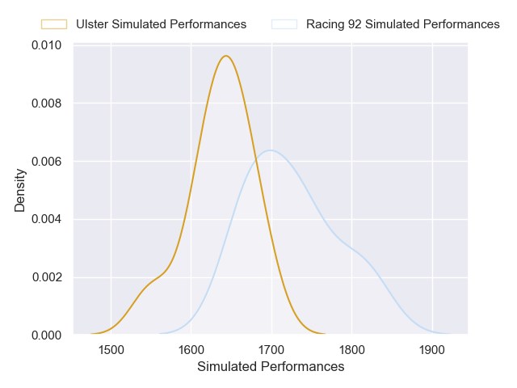
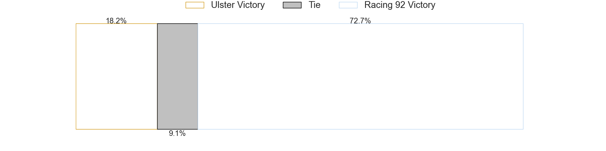
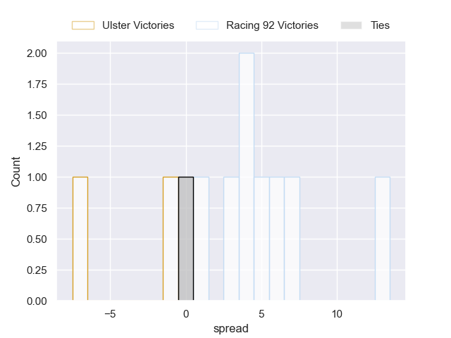

### Clermont Auvergne V Sale Sharks on 2025/04/04

Average Margin: Clermont Auvergne by 7.6

### Glasgow Warriors V Castres Olympique on 2025/04/04

Average Margin: Glasgow Warriors by 7.9

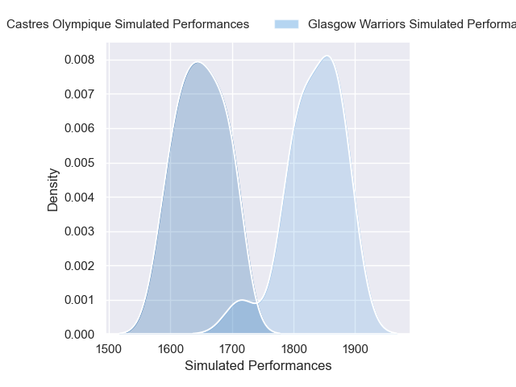
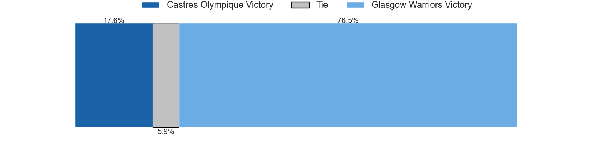
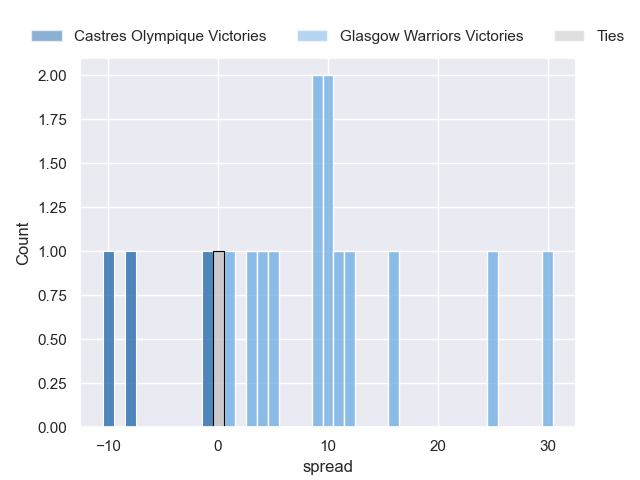

### Leinster V Exeter Chiefs on 2025/04/04

Average Margin: Leinster by 17.0

### La Rochelle V Munster on 2025/04/04

Average Margin: La Rochelle by 5.0

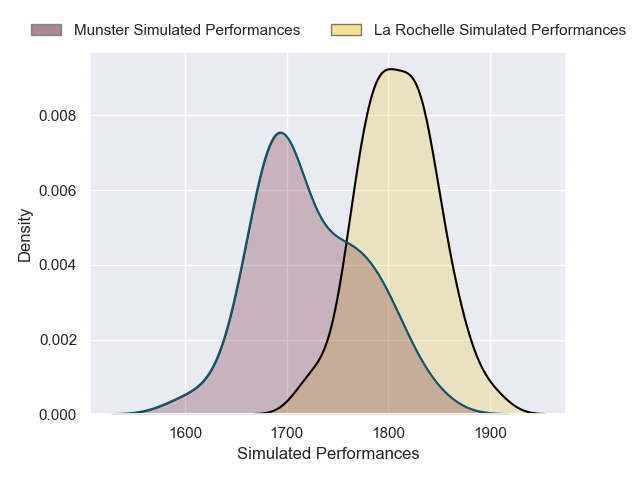
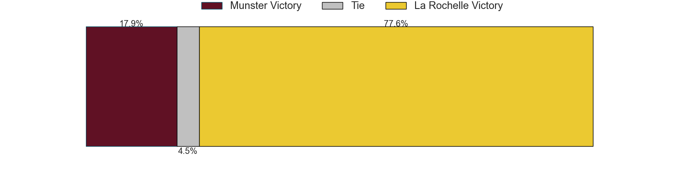
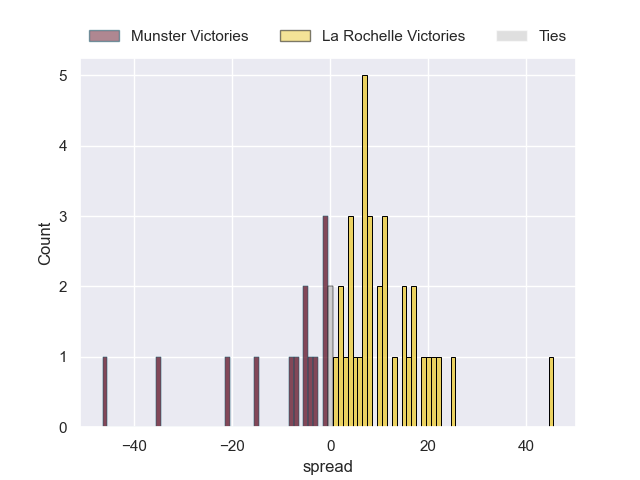

### Northampton Saints V Glasgow Warriors on 2025/04/04

Average Margin: Northampton Saints by 0.3

### Clermont Auvergne V Sharks on 2025/04/04

Average Margin: Clermont Auvergne by 10.1

### Munster V Bristol Rugby on 2025/04/04

Average Margin: Munster by 4.6

### Racing 92 V Bordeaux Begles on 2025/04/04

Average Margin: Racing 92 by 0.4

### Bulls V Saracens on 2025/04/04

Average Margin: Bulls by 6.7

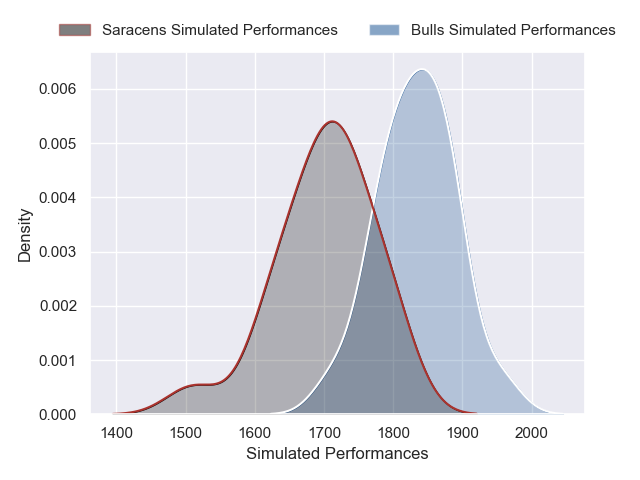

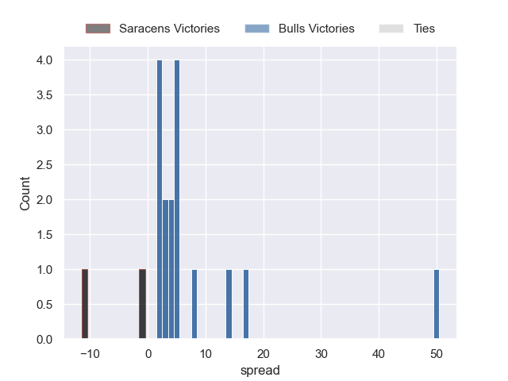

### Glasgow Warriors V Stade Francais Paris on 2025/04/04

Average Margin: Glasgow Warriors by 13.3

### Clermont Auvergne V Toulon on 2025/04/04

Average Margin: Clermont Auvergne by 0.9

### Harlequins V Bulls on 2025/04/04

Average Margin: Harlequins by 2.3

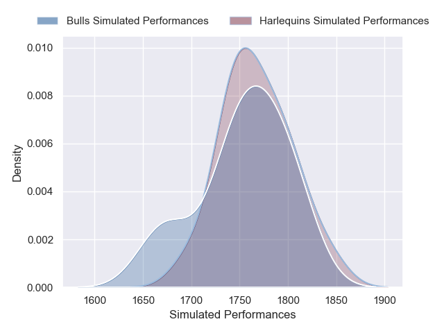

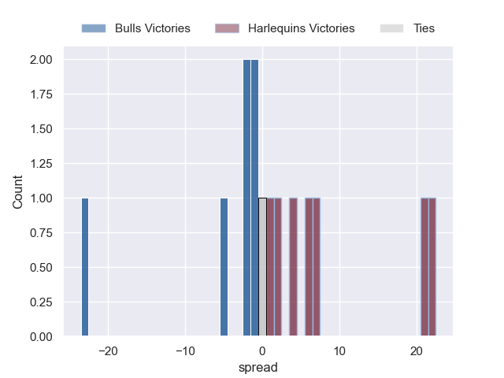

### Toulon V Leinster on 2025/04/04

Average Margin: Leinster by 5.2

### Bulls V Racing 92 on 2025/04/04

Average Margin: Bulls by 9.7

### Clermont Auvergne V Racing 92 on 2025/04/04

Average Margin: Clermont Auvergne by 1.8

### Stade Toulousain V Bordeaux Begles on 2025/04/04

Average Margin: Stade Toulousain by 8.4

### Glasgow Warriors V Saracens on 2025/04/04

Average Margin: Glasgow Warriors by 4.6

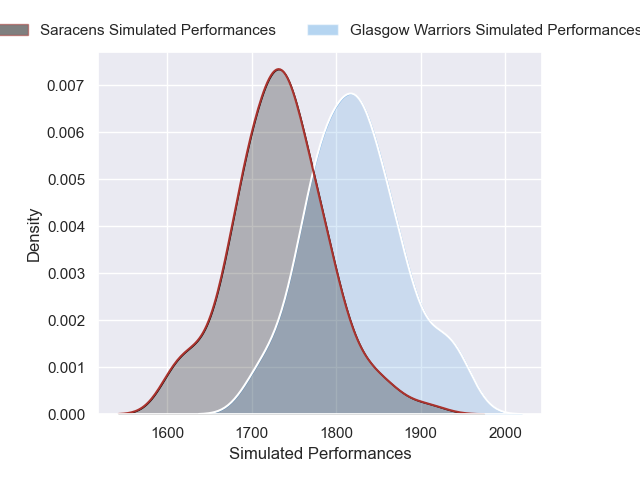
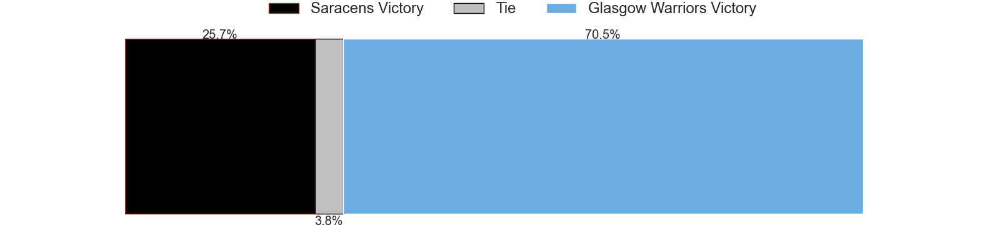
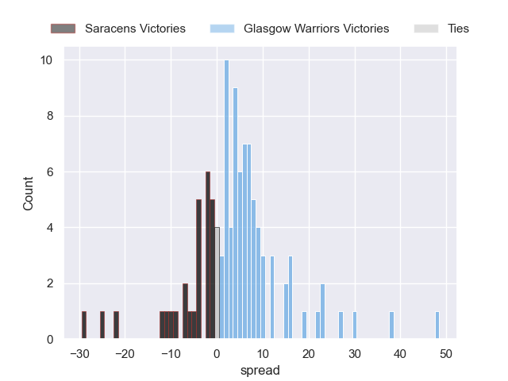

### Racing 92 V Sharks on 2025/04/04

Average Margin: Racing 92 by 11.9

### Munster V Sale Sharks on 2025/04/04

Average Margin: Munster by 8.7

### Clermont Auvergne V Bath Rugby on 2025/04/04

Average Margin: Clermont Auvergne by 4.4

### Racing 92 V Munster on 2025/04/04

Average Margin: Racing 92 by 0.6

### Toulon V Bordeaux Begles on 2025/04/04

Average Margin: Toulon by 0.7

### Bulls V Ulster on 2025/04/04

Average Margin: Bulls by 7.0

### Stade Toulousain V Bath Rugby on 2025/04/04

Average Margin: Stade Toulousain by 7.9

### Clermont Auvergne V La Rochelle on 2025/04/04

Average Margin: Clermont Auvergne by 3.2

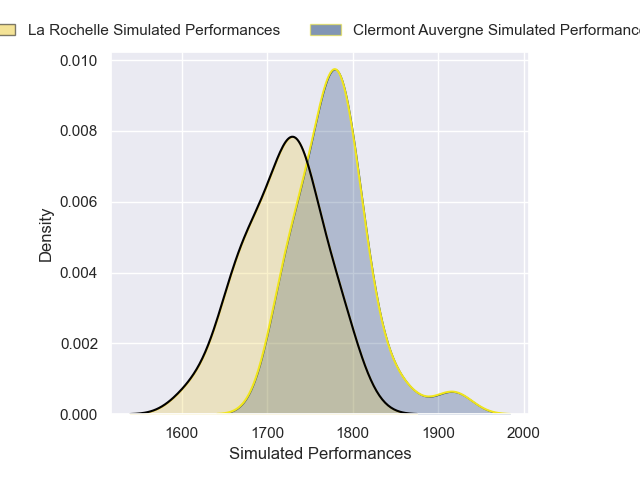

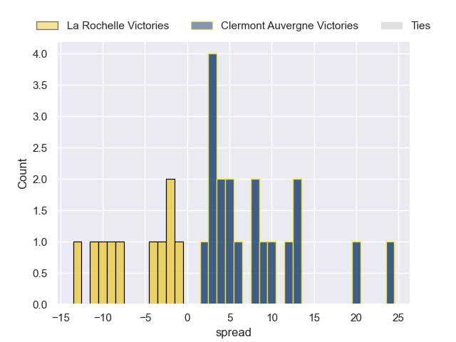

### Bulls V Northampton Saints on 2025/04/04

Average Margin: Bulls by 6.8

### Clermont Auvergne V Stormers on 2025/04/04

Average Margin: Clermont Auvergne by 7.1

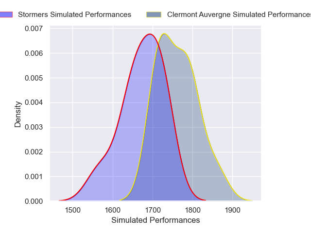

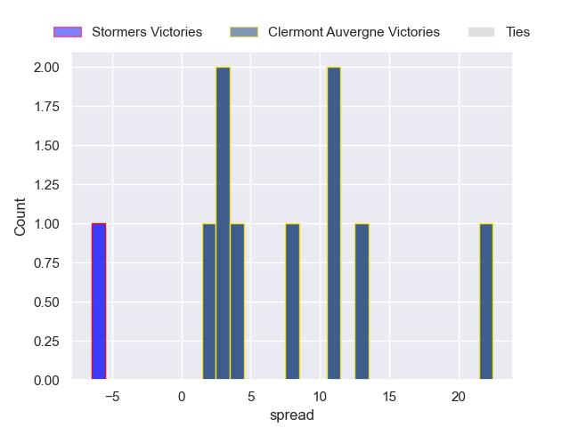

### Munster V Harlequins on 2025/04/04

Average Margin: Munster by 5.0

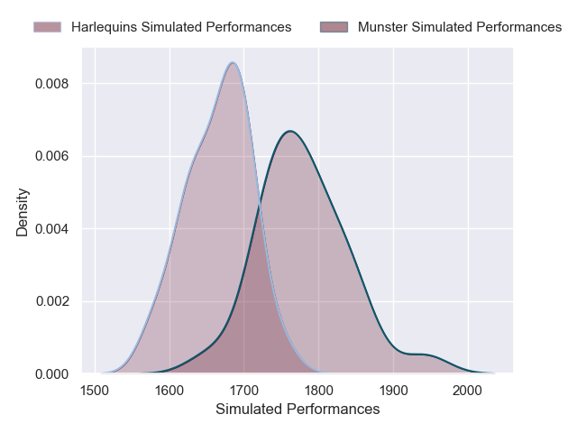

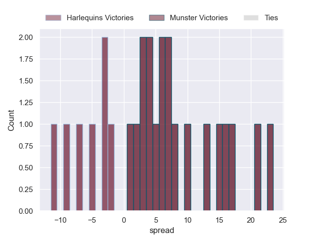

### Bulls V Leicester Tigers on 2025/04/04

Average Margin: Bulls by 8.8

### Bordeaux Begles V Clermont Auvergne on 2025/04/04

Average Margin: Bordeaux Begles by 5.8

### Toulon V Glasgow Warriors on 2025/04/04

Average Margin: Toulon by 1.9

### Toulon V Northampton Saints on 2025/04/04

Average Margin: Toulon by 3.2

### La Rochelle V Saracens on 2025/04/04

Average Margin: La Rochelle by 3.5

### Munster V Leinster on 2025/04/04

Average Margin: Leinster by 6.1

### Glasgow Warriors V Toulon on 2025/04/04

Average Margin: Glasgow Warriors by 8.2

### Saracens V Leinster on 2025/04/04

Average Margin: Leinster by 3.7

### La Rochelle V Sale Sharks on 2025/04/04

Average Margin: La Rochelle by 9.7

### Munster V Ulster on 2025/04/04

Average Margin: Munster by 5.4

### Northampton Saints V Clermont Auvergne on 2025/04/04

Average Margin: Northampton Saints by 5.3

### Bordeaux Begles V Leinster on 2025/04/04

Average Margin: Leinster by 4.8

### Munster V Sharks on 2025/04/04

Average Margin: Munster by 10.2

### La Rochelle V Bristol Rugby on 2025/04/04

Average Margin: La Rochelle by 4.6

### Stade Toulousain V Toulon on 2025/04/04

Average Margin: Stade Toulousain by 8.6

### Bristol Rugby V Bulls on 2025/04/04

Average Margin: Bristol Rugby by 1.0

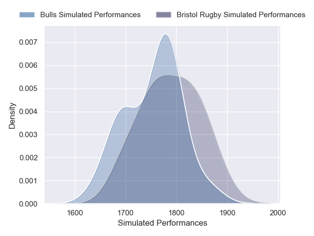

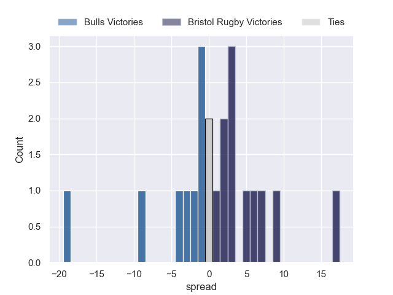

### Bristol Rugby V Bath Rugby on 2025/04/04

Average Margin: Bath Rugby by 0.9

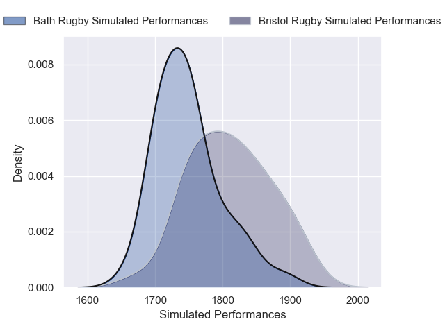

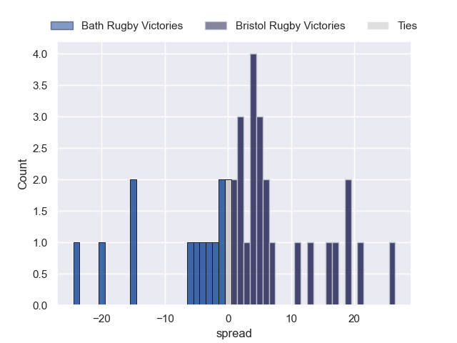

### Racing 92 V Glasgow Warriors on 2025/04/04

Average Margin: Racing 92 by 0.6

### Saracens V La Rochelle on 2025/04/04

Average Margin: Saracens by 5.2

### Leinster V Bulls on 2025/04/04

Average Margin: Leinster by 8.6

### Stade Toulousain V Clermont Auvergne on 2025/04/04

Average Margin: Stade Toulousain by 11.5

### La Rochelle V Bordeaux Begles on 2025/04/04

Average Margin: La Rochelle by 5.2

### Stade Toulousain V Stormers on 2025/04/04

Average Margin: Stade Toulousain by 9.3

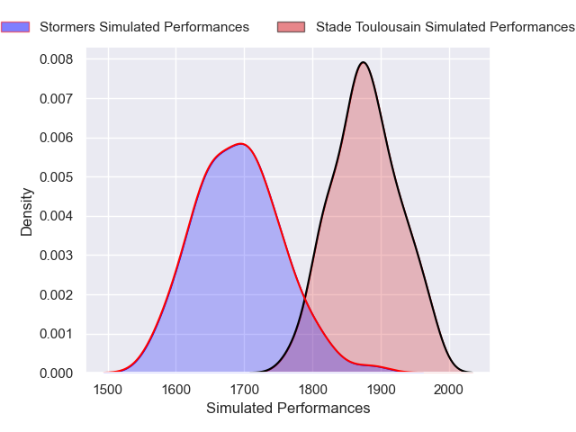
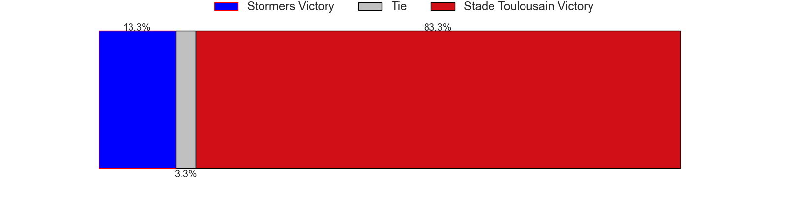
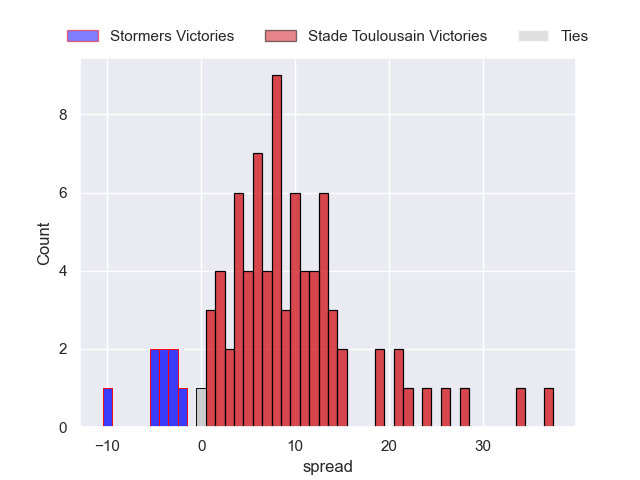

### Bordeaux Begles V Northampton Saints on 2025/04/04

Average Margin: Bordeaux Begles by 3.8

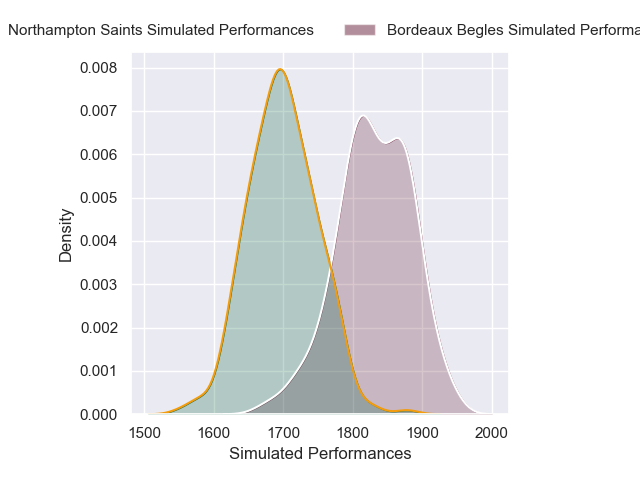
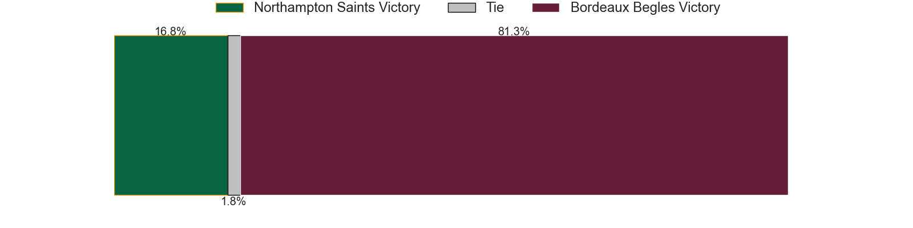
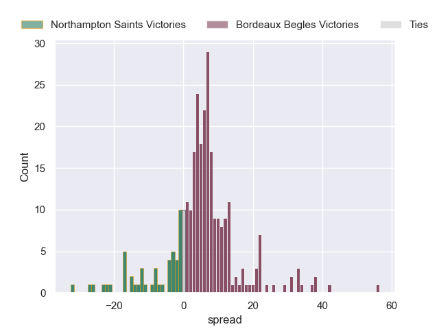

### Munster V Racing 92 on 2025/04/04

Average Margin: Munster by 5.9

### Bulls V La Rochelle on 2025/04/04

Average Margin: Bulls by 6.1

### Bristol Rugby V La Rochelle on 2025/04/04

Average Margin: Bristol Rugby by 2.0

### Northampton Saints V Ulster on 2025/04/04

Average Margin: Northampton Saints by 7.6

### Bordeaux Begles V Saracens on 2025/04/04

Average Margin: Bordeaux Begles by 3.9

### Bulls V Bath Rugby on 2025/04/04

Average Margin: Bulls by 1.4

### La Rochelle V Ulster on 2025/04/04

Average Margin: La Rochelle by 5.7

### Northampton Saints V Saracens on 2025/04/04

Average Margin: Northampton Saints by 5.8

### Bulls V Bristol Rugby on 2025/04/04

Average Margin: Bulls by 2.5

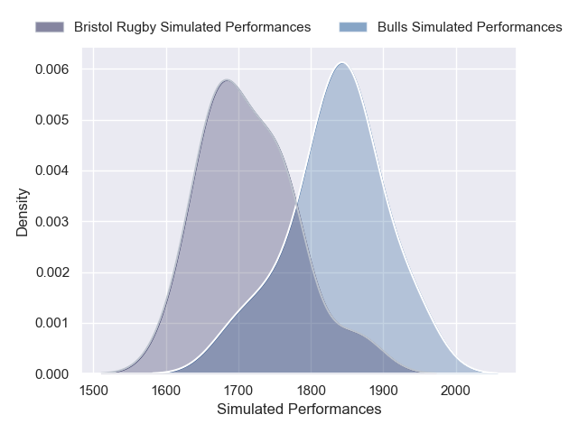

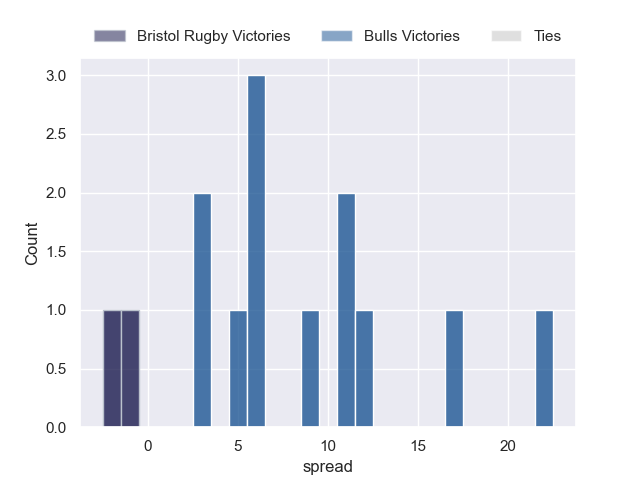

### Clermont Auvergne V Northampton Saints on 2025/04/04

Average Margin: Clermont Auvergne by 5.5

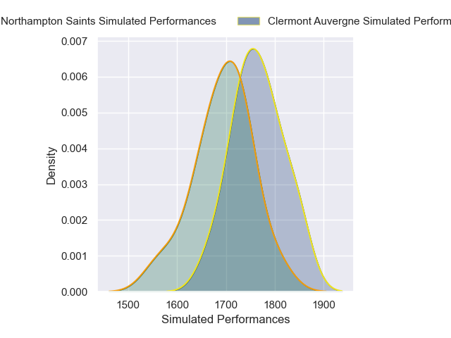

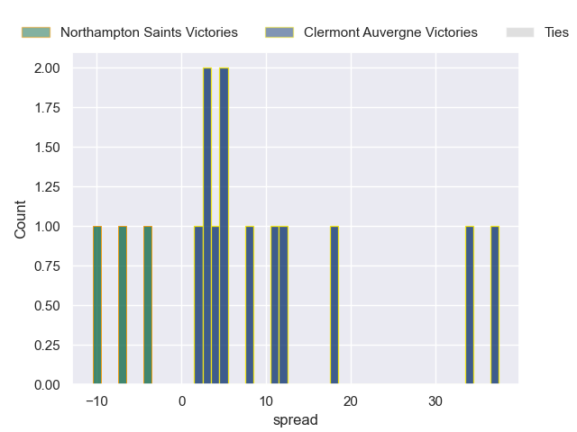

### Bristol Rugby V Munster on 2025/04/04

Average Margin: Bristol Rugby by 5.3

### Sale Sharks V Sharks on 2025/04/04

Average Margin: Sale Sharks by 2.0

### Glasgow Warriors V Stormers on 2025/04/04

Average Margin: Glasgow Warriors by 8.9

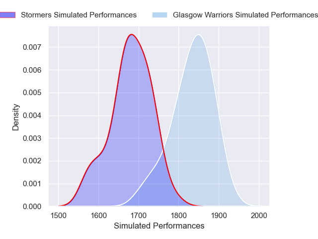
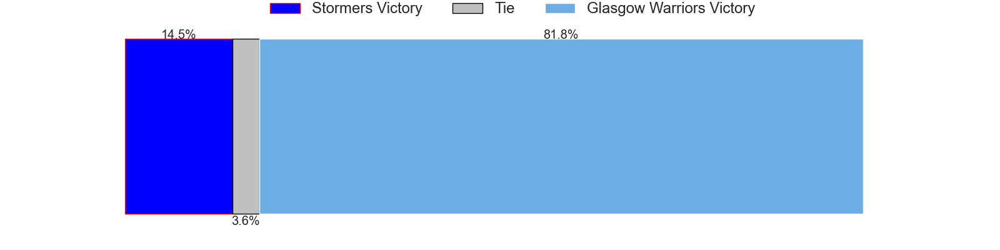
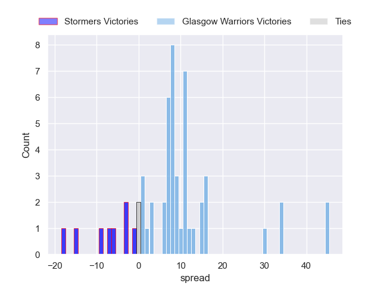

### Leinster V Benetton Treviso on 2025/04/04

Average Margin: Leinster by 18.5

### Glasgow Warriors V Bordeaux Begles on 2025/04/04

Average Margin: Glasgow Warriors by 5.1

### Toulon V La Rochelle on 2025/04/04

Average Margin: Toulon by 5.0

### Glasgow Warriors V Harlequins on 2025/04/04

Average Margin: Glasgow Warriors by 8.0

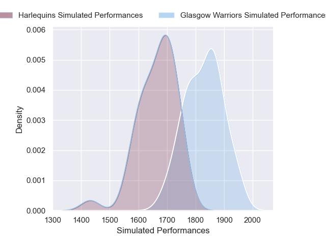
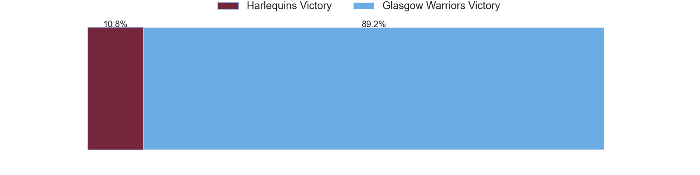
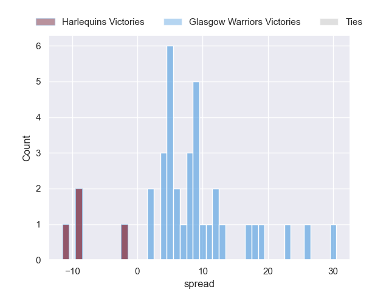

### Saracens V Exeter Chiefs on 2025/04/04

Average Margin: Saracens by 6.7

### La Rochelle V Glasgow Warriors on 2025/04/04

Average Margin: La Rochelle by 0.1

### Munster V Exeter Chiefs on 2025/04/04

Average Margin: Munster by 10.3

### Bath Rugby V La Rochelle on 2025/04/04

Average Margin: Bath Rugby by 4.7

### Bordeaux Begles V Glasgow Warriors on 2025/04/04

Average Margin: Bordeaux Begles by 1.6

### Bordeaux Begles V Leicester Tigers on 2025/04/04

Average Margin: Bordeaux Begles by 7.4

### Glasgow Warriors V Leinster on 2025/04/04

Average Margin: Glasgow Warriors by 0.7

### Bulls V Bordeaux Begles on 2025/04/04

Average Margin: Bulls by 2.6

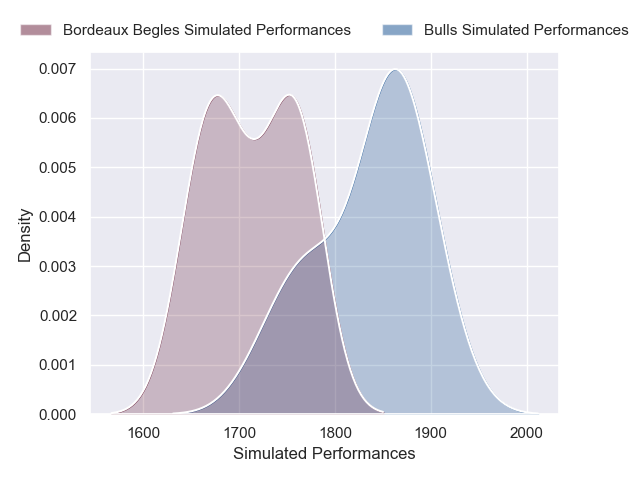

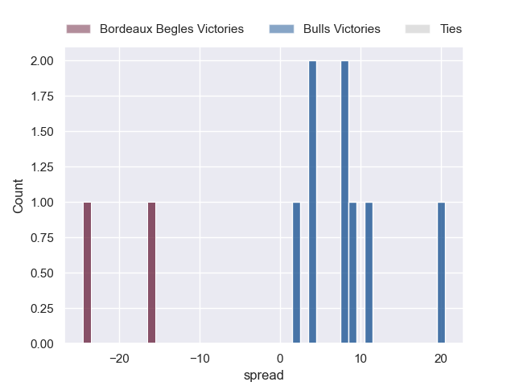

### Clermont Auvergne V Bordeaux Begles on 2025/04/04

Average Margin: Clermont Auvergne by 5.9

### Stade Toulousain V Glasgow Warriors on 2025/04/04

Average Margin: Stade Toulousain by 6.4

### Munster V Glasgow Warriors on 2025/04/04

Average Margin: Munster by 0.8

### Leinster V Bordeaux Begles on 2025/04/04

Average Margin: Leinster by 13.2

### Racing 92 V Saracens on 2025/04/04

Average Margin: Saracens by 2.2

### Clermont Auvergne V Bristol Rugby on 2025/04/04

Average Margin: Clermont Auvergne by 3.6

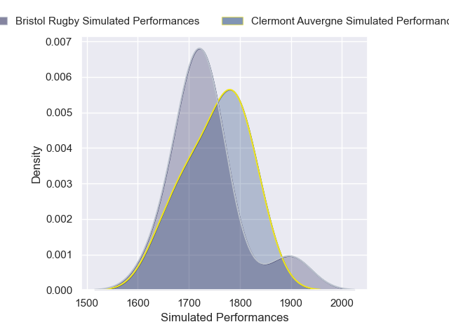

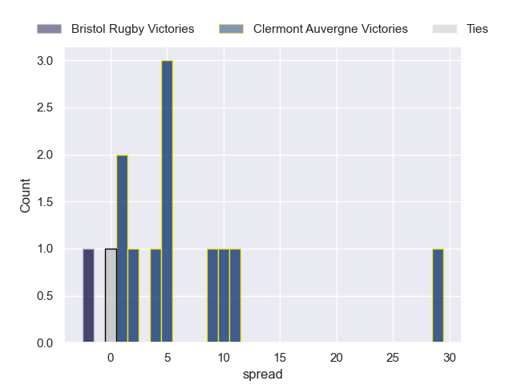

### Munster V Stade Francais Paris on 2025/04/04

Average Margin: Munster by 12.6

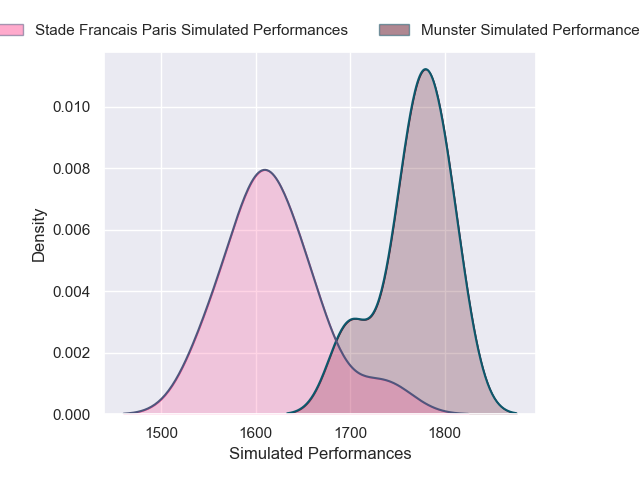

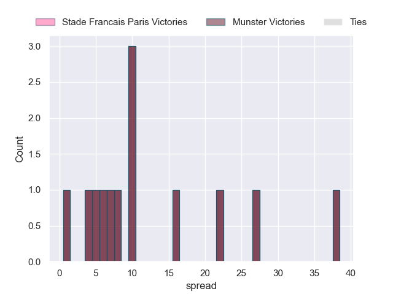

### Clermont Auvergne V Leinster on 2025/04/04

Average Margin: Leinster by 0.9

### La Rochelle V Leinster on 2025/04/04

Average Margin: Leinster by 1.5

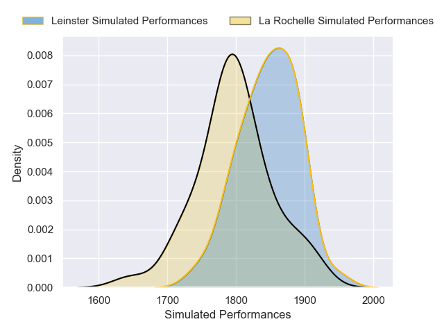

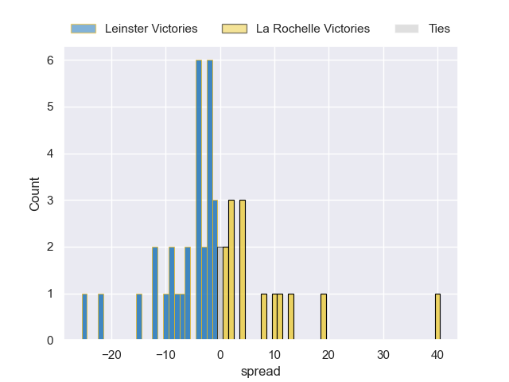

### Munster V Bordeaux Begles on 2025/04/04

Average Margin: Munster by 4.1

### Bulls V Clermont Auvergne on 2025/04/04

Average Margin: Bulls by 7.9

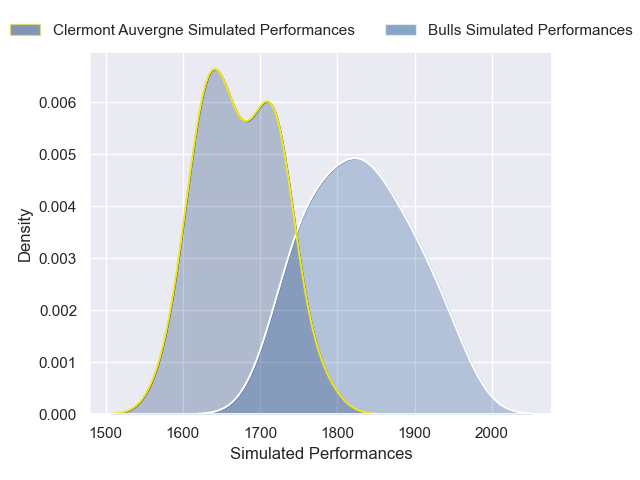

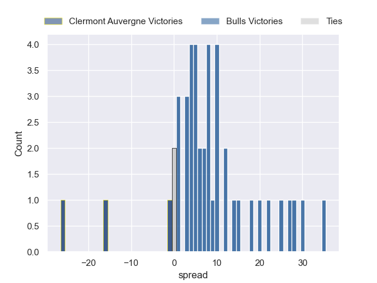

### Bordeaux Begles V Stade Francais Paris on 2025/04/04

Average Margin: Bordeaux Begles by 8.8

### Racing 92 V Toulon on 2025/04/04

Average Margin: Toulon by 3.7

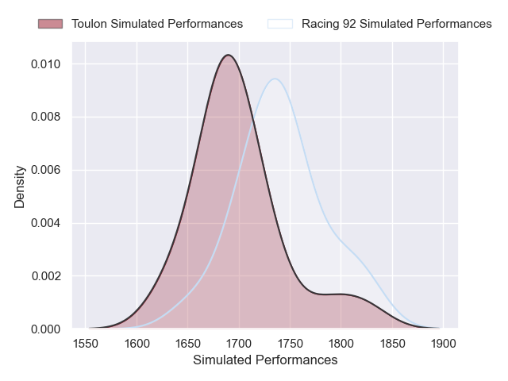

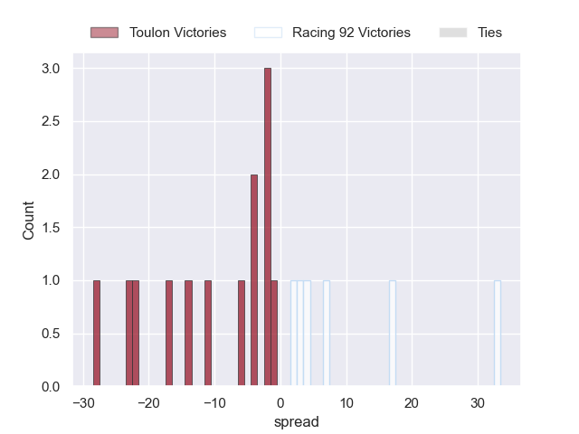

### Stade Toulousain V Saracens on 2025/04/04

Average Margin: Stade Toulousain by 8.5

### Munster V Toulon on 2025/04/04

Average Margin: Munster by 2.3

### Sale Sharks V Clermont Auvergne on 2025/04/04

Average Margin: Sale Sharks by 0.6

### Leinster V Glasgow Warriors on 2025/04/04

Average Margin: Leinster by 9.6

### La Rochelle V Castres Olympique on 2025/04/04

Average Margin: La Rochelle by 15.1

### Saracens V Stormers on 2025/04/04

Average Margin: Saracens by 6.4

### Munster V Bath Rugby on 2025/04/04

Average Margin: Munster by 4.9

### Bordeaux Begles V Harlequins on 2025/04/04

Average Margin: Bordeaux Begles by 12.0

### Saracens V Clermont Auvergne on 2025/04/04

Average Margin: Saracens by 9.6

### Clermont Auvergne V Saracens on 2025/04/04

Average Margin: Clermont Auvergne by 3.0

### Stade Toulousain V Leicester Tigers on 2025/04/04

Average Margin: Stade Toulousain by 11.0

### Stade Toulousain V Leinster on 2025/04/04

Average Margin: Leinster by 2.2

### Leinster V Leicester Tigers on 2025/04/04

Average Margin: Leinster by 14.0

### Racing 92 V Clermont Auvergne on 2025/04/04

Average Margin: Racing 92 by 6.1

### Toulon V Harlequins on 2025/04/04

Average Margin: Toulon by 6.8

### Munster V Bulls on 2025/04/04

Average Margin: Munster by 1.7

### Glasgow Warriors V Racing 92 on 2025/04/04

Average Margin: Glasgow Warriors by 10.5

### Munster V Saracens on 2025/04/04

Average Margin: Munster by 3.5

### Bordeaux Begles V Ulster on 2025/04/04

Average Margin: Bordeaux Begles by 8.6

### La Rochelle V Clermont Auvergne on 2025/04/04

Average Margin: La Rochelle by 6.7

### Bulls V Toulon on 2025/04/04

Average Margin: Bulls by 6.6

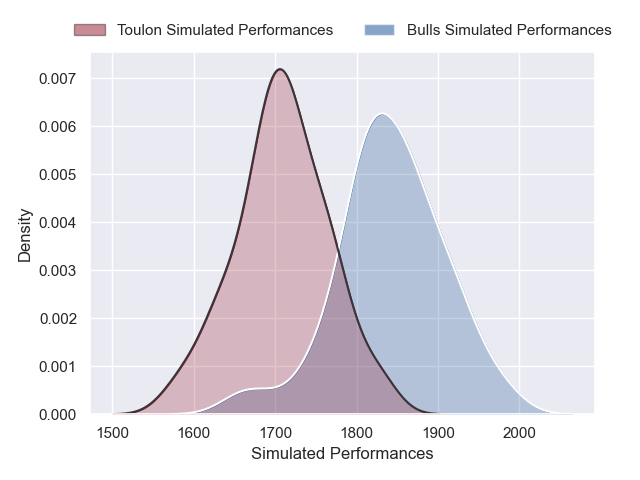

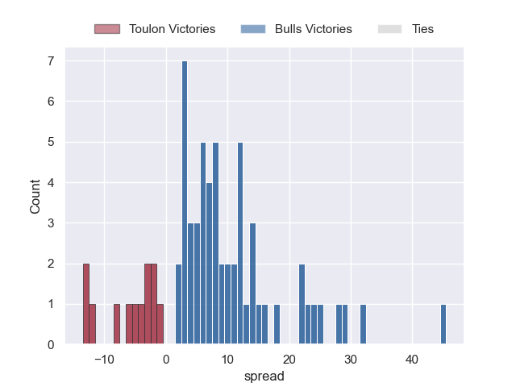

### Stade Toulousain V Northampton Saints on 2025/04/04

Average Margin: Stade Toulousain by 8.0

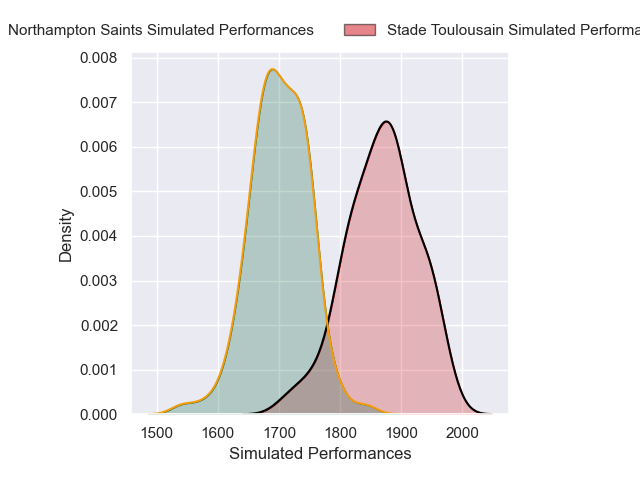
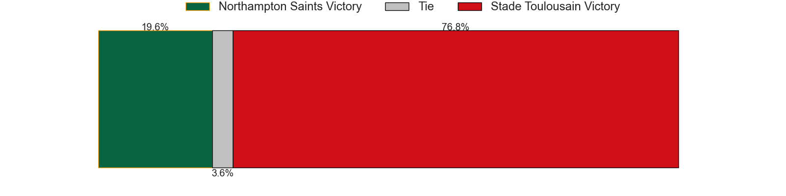
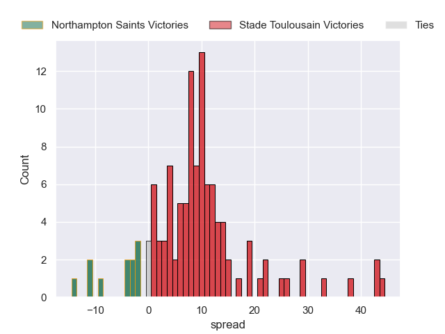

### Saracens V Glasgow Warriors on 2025/04/04

Average Margin: Saracens by 3.5

### Bordeaux Begles V Sale Sharks on 2025/04/04

Average Margin: Bordeaux Begles by 9.2

### Northampton Saints V Bath Rugby on 2025/04/04

Average Margin: Northampton Saints by 0.1

### Leinster V Racing 92 on 2025/04/04

Average Margin: Leinster by 14.7

### Munster V Northampton Saints on 2025/04/04

Average Margin: Munster by 5.6

### Toulon V Leicester Tigers on 2025/04/04

Average Margin: Toulon by 7.5

### Toulon V Clermont Auvergne on 2025/04/04

Average Margin: Toulon by 7.2

### Stade Toulousain V Sale Sharks on 2025/04/04

Average Margin: Stade Toulousain by 12.7

### La Rochelle V Northampton Saints on 2025/04/04

Average Margin: La Rochelle by 4.7

### Leinster V Toulon on 2025/04/04

Average Margin: Leinster by 11.9

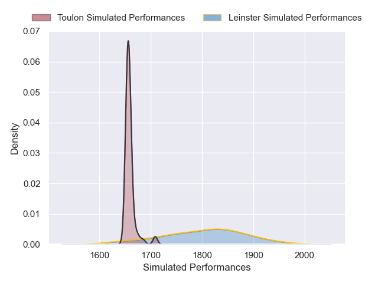
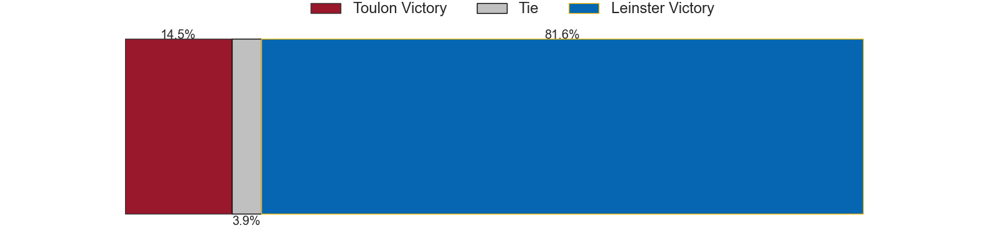
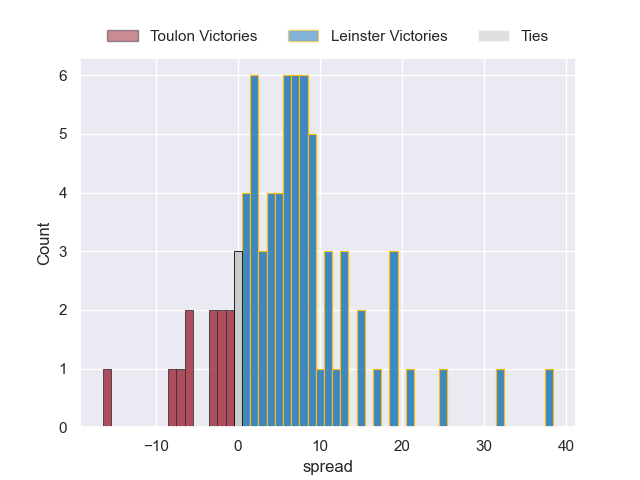

### Northampton Saints V Leinster on 2025/04/04

Average Margin: Leinster by 3.9

### Northampton Saints V Munster on 2025/04/04

Average Margin: Northampton Saints by 4.8

### Stade Toulousain V Harlequins on 2025/04/04

Average Margin: Stade Toulousain by 12.1

### La Rochelle V Sharks on 2025/04/04

Average Margin: La Rochelle by 7.8

### Sale Sharks V Toulon on 2025/04/04

Average Margin: Sale Sharks by 0.5

### Glasgow Warriors V La Rochelle on 2025/04/04

Average Margin: Glasgow Warriors by 6.6

### Saracens V Bath Rugby on 2025/04/04

Average Margin: Saracens by 4.7

### Racing 92 V Bulls on 2025/04/04

Average Margin: Racing 92 by 0.7

### Bordeaux Begles V Exeter Chiefs on 2025/04/04

Average Margin: Bordeaux Begles by 11.4

### Toulon V Racing 92 on 2025/04/04

Average Margin: Toulon by 6.0

### Stade Toulousain V Benetton Treviso on 2025/04/04

Average Margin: Stade Toulousain by 12.1

### Munster V La Rochelle on 2025/04/04

Average Margin: Munster by 5.4

### Glasgow Warriors V Ulster on 2025/04/04

Average Margin: Glasgow Warriors by 7.9

### Glasgow Warriors V Bristol Rugby on 2025/04/04

Average Margin: Glasgow Warriors by 8.1

### Saracens V Sale Sharks on 2025/04/04

Average Margin: Saracens by 7.1

### Toulon V Bristol Rugby on 2025/04/04

Average Margin: Toulon by 5.2

### Northampton Saints V Leicester Tigers on 2025/04/04

Average Margin: Northampton Saints by 6.9

### Leinster V Bath Rugby on 2025/04/04

Average Margin: Leinster by 10.3

### La Rochelle V Stormers on 2025/04/04

Average Margin: La Rochelle by 7.6

### Northampton Saints V Racing 92 on 2025/04/04

Average Margin: Northampton Saints by 6.3

### Glasgow Warriors V Munster on 2025/04/04

Average Margin: Glasgow Warriors by 8.2

### Leinster V Castres Olympique on 2025/04/04

Average Margin: Leinster by 13.9

### Stade Toulousain V Stade Francais Paris on 2025/04/04

Average Margin: Stade Toulousain by 13.9

### Bordeaux Begles V Bath Rugby on 2025/04/04

Average Margin: Bordeaux Begles by 4.0

### Bordeaux Begles V Sharks on 2025/04/04

Average Margin: Bordeaux Begles by 6.6

### Munster V Leicester Tigers on 2025/04/04

Average Margin: Munster by 6.3

### Leinster V Ulster on 2025/04/04

Average Margin: Leinster by 12.9

### Glasgow Warriors V Benetton Treviso on 2025/04/04

Average Margin: Glasgow Warriors by 11.5

### Toulon V Sale Sharks on 2025/04/04

Average Margin: Toulon by 2.1

### Northampton Saints V Stormers on 2025/04/04

Average Margin: Northampton Saints by 4.8

### Stade Toulousain V Castres Olympique on 2025/04/04

Average Margin: Stade Toulousain by 11.5

### Leinster V Saracens on 2025/04/04

Average Margin: Leinster by 12.2

### Clermont Auvergne V Bulls on 2025/04/04

Average Margin: Clermont Auvergne by 0.6

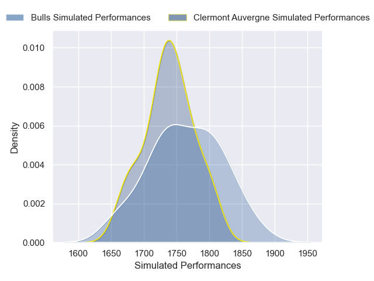

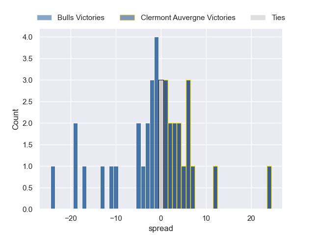

### Leinster V Stormers on 2025/04/04

Average Margin: Leinster by 15.3

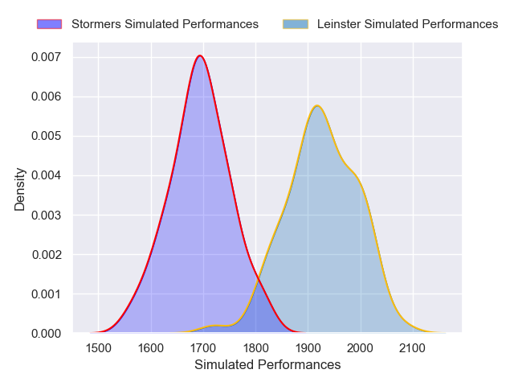

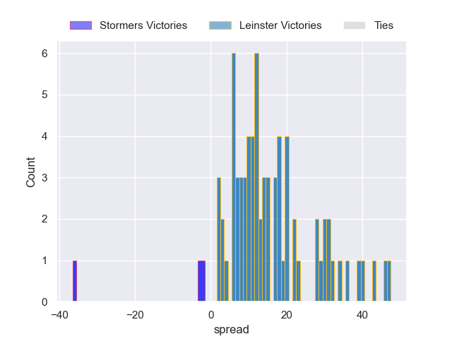

### Glasgow Warriors V Bath Rugby on 2025/04/04

Average Margin: Glasgow Warriors by 5.0

### Saracens V Bordeaux Begles on 2025/04/04

Average Margin: Saracens by 5.8

### La Rochelle V Bath Rugby on 2025/04/04

Average Margin: La Rochelle by 1.2

### Leinster V Harlequins on 2025/04/04

Average Margin: Leinster by 14.4

### Toulon V Munster on 2025/04/04

Average Margin: Toulon by 2.2

### Bordeaux Begles V Bristol Rugby on 2025/04/04

Average Margin: Bordeaux Begles by 5.1

### Bulls V Glasgow Warriors on 2025/04/04

Average Margin: Bulls by 6.9

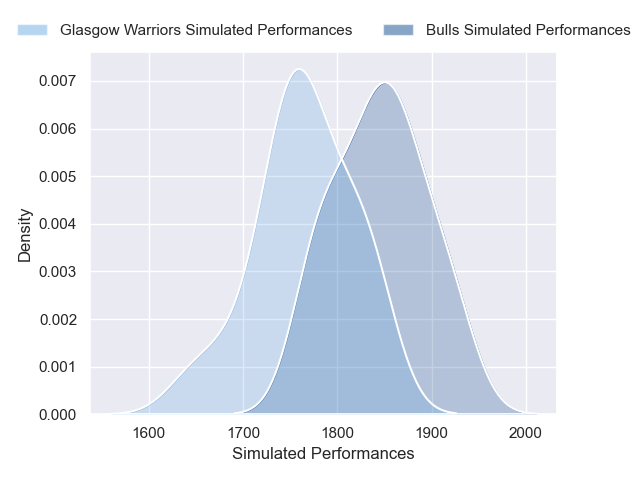

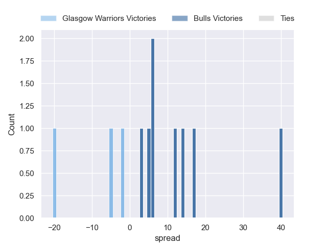

### Stade Toulousain V Bulls on 2025/04/04

Average Margin: Stade Toulousain by 7.2

### Bordeaux Begles V Toulon on 2025/04/04

Average Margin: Bordeaux Begles by 6.8

### Racing 92 V Bath Rugby on 2025/04/04

Average Margin: Bath Rugby by 0.2

### Saracens V Munster on 2025/04/04

Average Margin: Saracens by 5.8

### Glasgow Warriors V Sharks on 2025/04/04

Average Margin: Glasgow Warriors by 12.4

### Northampton Saints V Harlequins on 2025/04/04

Average Margin: Northampton Saints by 8.3

### Stade Toulousain V Ulster on 2025/04/04

Average Margin: Stade Toulousain by 13.9

### Leinster V La Rochelle on 2025/04/04

Average Margin: Leinster by 11.6

### Glasgow Warriors V Sale Sharks on 2025/04/04

Average Margin: Glasgow Warriors by 9.5

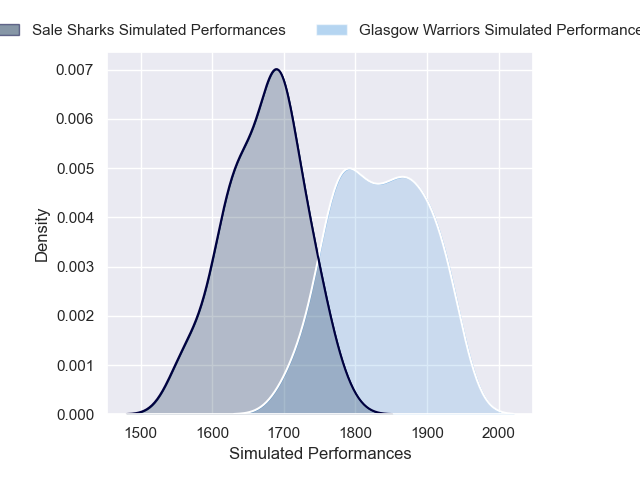
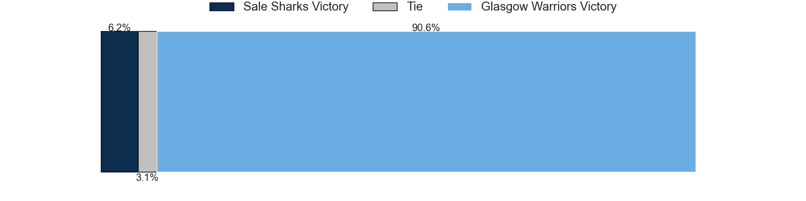
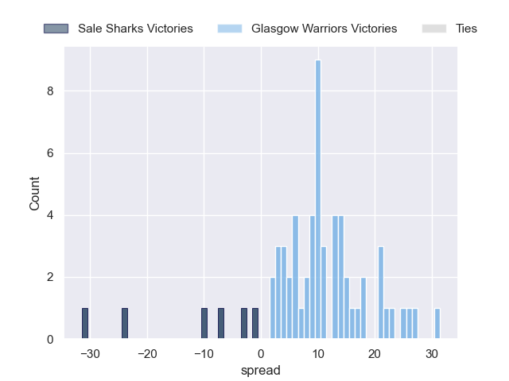

### Northampton Saints V Sharks on 2025/04/04

Average Margin: Northampton Saints by 6.9

### La Rochelle V Toulon on 2025/04/04

Average Margin: La Rochelle by 3.6

### Saracens V Bulls on 2025/04/04

Average Margin: Saracens by 4.3

### Toulon V Bulls on 2025/04/04

Average Margin: Toulon by 3.7

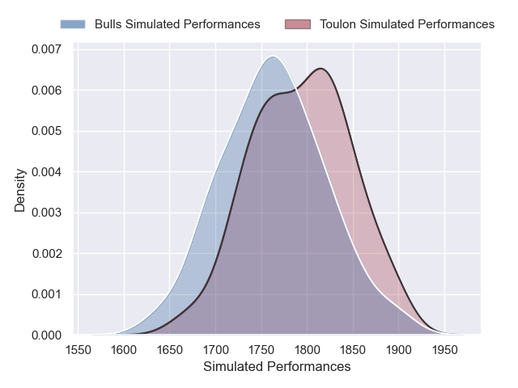

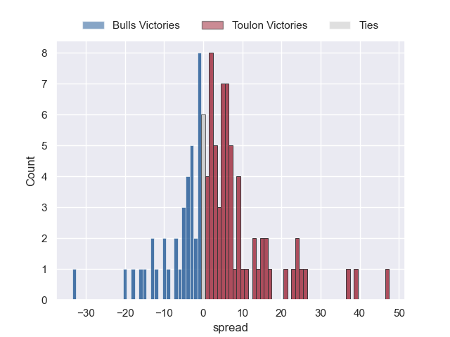

### Stade Toulousain V Munster on 2025/04/04

Average Margin: Stade Toulousain by 8.4

### Northampton Saints V Sale Sharks on 2025/04/04

Average Margin: Northampton Saints by 4.0

### Bulls V Sharks on 2025/04/04

Average Margin: Bulls by 8.6

### Northampton Saints V Bulls on 2025/04/04

Average Margin: Northampton Saints by 3.6

### Saracens V Northampton Saints on 2025/04/04

Average Margin: Saracens by 5.4

### Bulls V Munster on 2025/04/04

Average Margin: Bulls by 9.1

### Toulon V Sharks on 2025/04/04

Average Margin: Toulon by 9.5

### Northampton Saints V Bristol Rugby on 2025/04/04

Average Margin: Northampton Saints by 3.6

### Toulon V Ulster on 2025/04/04

Average Margin: Toulon by 6.2

### Leinster V Munster on 2025/04/04

Average Margin: Leinster by 9.9

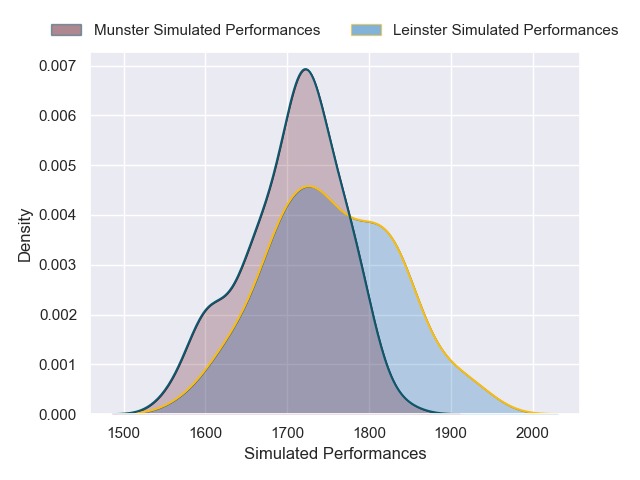

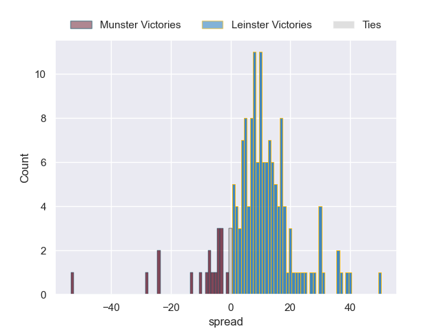

### Saracens V Ulster on 2025/04/04

Average Margin: Saracens by 8.2

### Stade Toulousain V Sharks on 2025/04/04

Average Margin: Stade Toulousain by 13.4

### Bordeaux Begles V La Rochelle on 2025/04/04

Average Margin: Bordeaux Begles by 4.0

### Clermont Auvergne V Munster on 2025/04/04

Average Margin: Clermont Auvergne by 3.0

### Stade Toulousain V Racing 92 on 2025/04/04

Average Margin: Stade Toulousain by 14.0

### Glasgow Warriors V Exeter Chiefs on 2025/04/04

Average Margin: Glasgow Warriors by 6.3

### Bordeaux Begles V Stormers on 2025/04/04

Average Margin: Bordeaux Begles by 8.2

### Clermont Auvergne V Leicester Tigers on 2025/04/04

Average Margin: Clermont Auvergne by 2.3

### Toulon V Saracens on 2025/04/04

Average Margin: Toulon by 4.3

### La Rochelle V Harlequins on 2025/04/04

Average Margin: La Rochelle by 13.4

### Northampton Saints V La Rochelle on 2025/04/04

Average Margin: Northampton Saints by 5.1

### Leinster V Bristol Rugby on 2025/04/04

Average Margin: Leinster by 12.1

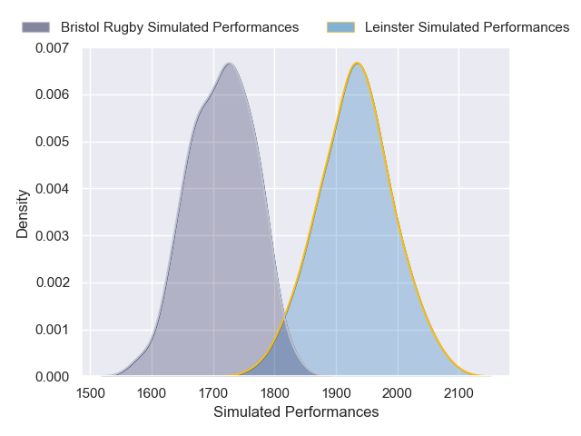

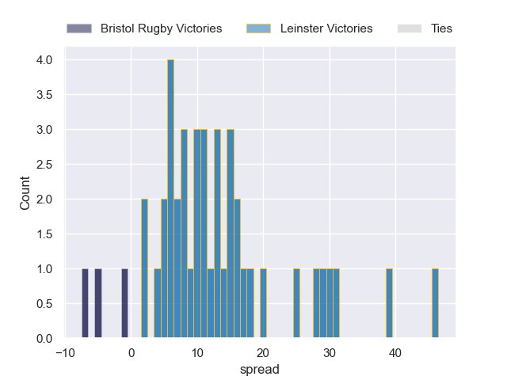

### Saracens V Leicester Tigers on 2025/04/04

Average Margin: Saracens by 6.9

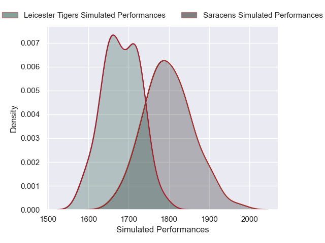
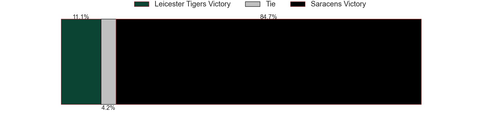
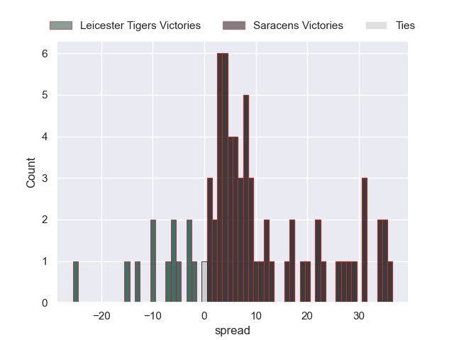

### La Rochelle V Bulls on 2025/04/04

Average Margin: La Rochelle by 3.6

### Saracens V Racing 92 on 2025/04/04

Average Margin: Saracens by 9.1

### Leinster V Clermont Auvergne on 2025/04/04

Average Margin: Leinster by 13.6

### Munster V Stormers on 2025/04/04

Average Margin: Munster by 6.9

### Toulon V Bath Rugby on 2025/04/04

Average Margin: Toulon by 1.8

### Racing 92 V La Rochelle on 2025/04/04

Average Margin: La Rochelle by 1.2

### Saracens V Harlequins on 2025/04/04

Average Margin: Saracens by 5.8

### Bordeaux Begles V Bulls on 2025/04/04

Average Margin: Bordeaux Begles by 2.5

### Saracens V Sharks on 2025/04/04

Average Margin: Saracens by 7.2

### La Rochelle V Racing 92 on 2025/04/04

Average Margin: La Rochelle by 6.7

### Glasgow Warriors V Northampton Saints on 2025/04/04

Average Margin: Glasgow Warriors by 8.9

### Bordeaux Begles V Munster on 2025/04/04

Average Margin: Bordeaux Begles by 3.9

### Glasgow Warriors V Clermont Auvergne on 2025/04/04

Average Margin: Glasgow Warriors by 9.3

### Stade Toulousain V Exeter Chiefs on 2025/04/04

Average Margin: Stade Toulousain by 13.4

### Munster V Clermont Auvergne on 2025/04/04

Average Margin: Munster by 4.4

### Glasgow Warriors V Leicester Tigers on 2025/04/04

Average Margin: Glasgow Warriors by 7.8

### Toulon V Stormers on 2025/04/04

Average Margin: Toulon by 4.8

### Stade Toulousain V Bristol Rugby on 2025/04/04

Average Margin: Stade Toulousain by 9.3

### Saracens V Toulon on 2025/04/04

Average Margin: Saracens by 6.5

### Northampton Saints V Toulon on 2025/04/04

Average Margin: Northampton Saints by 3.2

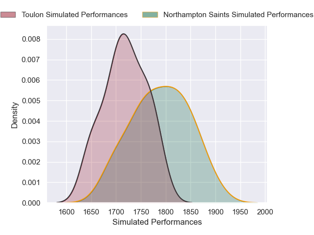
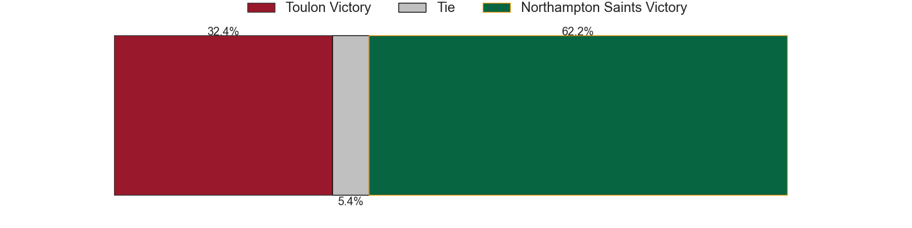
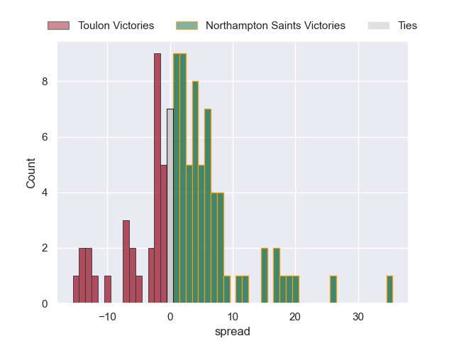

### Stade Toulousain V La Rochelle on 2025/04/04

Average Margin: Stade Toulousain by 8.2

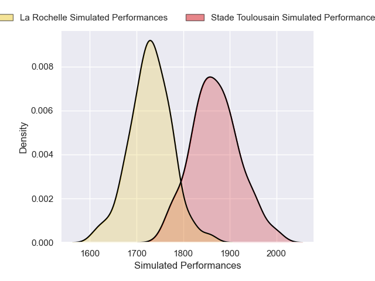
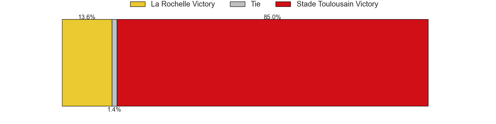
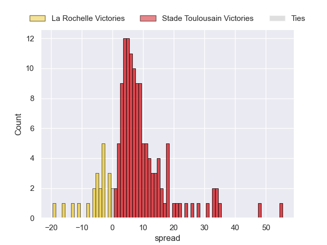

### Bordeaux Begles V Racing 92 on 2025/04/04

Average Margin: Bordeaux Begles by 6.8

### Leinster V Sharks on 2025/04/04

Average Margin: Leinster by 15.1

### Glasgow Warriors V Bulls on 2025/04/04

Average Margin: Glasgow Warriors by 4.0

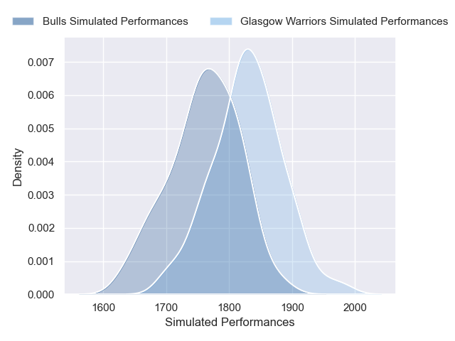

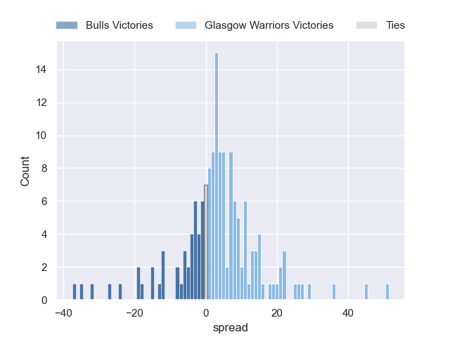

### La Rochelle V Leicester Tigers on 2025/04/04

Average Margin: La Rochelle by 7.6

### Northampton Saints V Bordeaux Begles on 2025/04/04

Average Margin: Northampton Saints by 6.6

### Bristol Rugby V Saracens on 2025/04/04

Average Margin: Bristol Rugby by 7.4

### Leinster V Sale Sharks on 2025/04/04

Average Margin: Leinster by 14.8

### Saracens V Bristol Rugby on 2025/04/04

Average Margin: Saracens by 2.4

## Quarterfinals

### Harlequins V Bulls on 2025/04/11

Average Margin: Harlequins by 2.3

### Stade Toulousain V Bordeaux Begles on 2025/04/11

Average Margin: Stade Toulousain by 8.4

### Bordeaux Begles V Saracens on 2025/04/11

Average Margin: Bordeaux Begles by 3.9

### Northampton Saints V La Rochelle on 2025/04/11

Average Margin: Northampton Saints by 5.1

### Northampton Saints V Stormers on 2025/04/11

Average Margin: Northampton Saints by 4.8

### Munster V Toulon on 2025/04/11

Average Margin: Munster by 2.3

### Saracens V Bath Rugby on 2025/04/11

Average Margin: Saracens by 4.7

### Glasgow Warriors V Stormers on 2025/04/11

Average Margin: Glasgow Warriors by 8.9

### Bulls V La Rochelle on 2025/04/11

Average Margin: Bulls by 6.1

### Sale Sharks V Sharks on 2025/04/11

Average Margin: Sale Sharks by 2.0

### Stade Toulousain V Bristol Rugby on 2025/04/11

Average Margin: Stade Toulousain by 9.3

### Toulon V Racing 92 on 2025/04/11

Average Margin: Toulon by 6.0

### Northampton Saints V Bristol Rugby on 2025/04/11

Average Margin: Northampton Saints by 3.6

### Saracens V Harlequins on 2025/04/11

Average Margin: Saracens by 5.8

### Stade Toulousain V Racing 92 on 2025/04/11

Average Margin: Stade Toulousain by 14.0

### Bulls V Clermont Auvergne on 2025/04/11

Average Margin: Bulls by 7.9

### Toulon V Sharks on 2025/04/11

Average Margin: Toulon by 9.5

### La Rochelle V Toulon on 2025/04/11

Average Margin: La Rochelle by 3.6

### La Rochelle V Harlequins on 2025/04/11

Average Margin: La Rochelle by 13.4

### Bulls V Racing 92 on 2025/04/11

Average Margin: Bulls by 9.7

### Stade Toulousain V Glasgow Warriors on 2025/04/11

Average Margin: Stade Toulousain by 6.4

### Leinster V Glasgow Warriors on 2025/04/11

Average Margin: Leinster by 9.6

### Clermont Auvergne V Bordeaux Begles on 2025/04/11

Average Margin: Clermont Auvergne by 5.9

### La Rochelle V Sharks on 2025/04/11

Average Margin: La Rochelle by 7.8

### Munster V Sale Sharks on 2025/04/11

Average Margin: Munster by 8.7

### Northampton Saints V Ulster on 2025/04/11

Average Margin: Northampton Saints by 7.6

### Saracens V Sale Sharks on 2025/04/11

Average Margin: Saracens by 7.1

### Saracens V Northampton Saints on 2025/04/11

Average Margin: Saracens by 5.4

### Racing 92 V Bulls on 2025/04/11

Average Margin: Racing 92 by 0.7

### Leinster V Exeter Chiefs on 2025/04/11

Average Margin: Leinster by 17.0

### Leinster V Castres Olympique on 2025/04/11

Average Margin: Leinster by 13.9

### Northampton Saints V Sale Sharks on 2025/04/11

Average Margin: Northampton Saints by 4.0

### Clermont Auvergne V Leicester Tigers on 2025/04/11

Average Margin: Clermont Auvergne by 2.3

### Glasgow Warriors V Toulon on 2025/04/11

Average Margin: Glasgow Warriors by 8.2

### Leinster V La Rochelle on 2025/04/11

Average Margin: Leinster by 11.6

### Bristol Rugby V Bath Rugby on 2025/04/11

Average Margin: Bath Rugby by 0.9

### Munster V Leinster on 2025/04/11

Average Margin: Leinster by 6.1

### Munster V Northampton Saints on 2025/04/11

Average Margin: Munster by 5.6

### La Rochelle V Castres Olympique on 2025/04/11

Average Margin: La Rochelle by 15.1

### Saracens V Leinster on 2025/04/11

Average Margin: Leinster by 3.7

### Stade Toulousain V Toulon on 2025/04/11

Average Margin: Stade Toulousain by 8.6

### La Rochelle V Clermont Auvergne on 2025/04/11

Average Margin: La Rochelle by 6.7

### Saracens V Munster on 2025/04/11

Average Margin: Saracens by 5.8

### La Rochelle V Northampton Saints on 2025/04/11

Average Margin: La Rochelle by 4.7

### Toulon V Ulster on 2025/04/11

Average Margin: Toulon by 6.2

### Northampton Saints V Racing 92 on 2025/04/11

Average Margin: Northampton Saints by 6.3

### Northampton Saints V Harlequins on 2025/04/11

Average Margin: Northampton Saints by 8.3

### Bulls V Munster on 2025/04/11

Average Margin: Bulls by 9.1

### Bordeaux Begles V Munster on 2025/04/11

Average Margin: Bordeaux Begles by 3.9

### Clermont Auvergne V Toulon on 2025/04/11

Average Margin: Clermont Auvergne by 0.9

### Clermont Auvergne V Leinster on 2025/04/11

Average Margin: Leinster by 0.9

### Bath Rugby V La Rochelle on 2025/04/11

Average Margin: Bath Rugby by 4.7

### Leinster V Leicester Tigers on 2025/04/11

Average Margin: Leinster by 14.0

### Glasgow Warriors V Harlequins on 2025/04/11

Average Margin: Glasgow Warriors by 8.0

### Bordeaux Begles V Toulon on 2025/04/11

Average Margin: Bordeaux Begles by 6.8

### Glasgow Warriors V Stade Francais Paris on 2025/04/11

Average Margin: Glasgow Warriors by 13.3

### Northampton Saints V Sharks on 2025/04/11

Average Margin: Northampton Saints by 6.9

### Racing 92 V Sharks on 2025/04/11

Average Margin: Racing 92 by 11.9

### Glasgow Warriors V Exeter Chiefs on 2025/04/11

Average Margin: Glasgow Warriors by 6.3

### Northampton Saints V Bulls on 2025/04/11

Average Margin: Northampton Saints by 3.6

### Saracens V Ulster on 2025/04/11

Average Margin: Saracens by 8.2

### La Rochelle V Racing 92 on 2025/04/11

Average Margin: La Rochelle by 6.7

### Leinster V Saracens on 2025/04/11

Average Margin: Leinster by 12.2

### Glasgow Warriors V La Rochelle on 2025/04/11

Average Margin: Glasgow Warriors by 6.6

### Glasgow Warriors V Clermont Auvergne on 2025/04/11

Average Margin: Glasgow Warriors by 9.3

### Munster V Exeter Chiefs on 2025/04/11

Average Margin: Munster by 10.3

### Bordeaux Begles V Harlequins on 2025/04/11

Average Margin: Bordeaux Begles by 12.0

### Bristol Rugby V Saracens on 2025/04/11

Average Margin: Bristol Rugby by 7.4

### Stade Toulousain V Northampton Saints on 2025/04/11

Average Margin: Stade Toulousain by 8.0

### Stade Toulousain V Bulls on 2025/04/11

Average Margin: Stade Toulousain by 7.2

### Clermont Auvergne V Bath Rugby on 2025/04/11

Average Margin: Clermont Auvergne by 4.4

### Bulls V Northampton Saints on 2025/04/11

Average Margin: Bulls by 6.8

### Glasgow Warriors V Castres Olympique on 2025/04/11

Average Margin: Glasgow Warriors by 7.9

### Clermont Auvergne V Northampton Saints on 2025/04/11

Average Margin: Clermont Auvergne by 5.5

### Leinster V Munster on 2025/04/11

Average Margin: Leinster by 9.9

### Bulls V Saracens on 2025/04/11

Average Margin: Bulls by 6.7

### Clermont Auvergne V Munster on 2025/04/11

Average Margin: Clermont Auvergne by 3.0

### Toulon V Bristol Rugby on 2025/04/11

Average Margin: Toulon by 5.2

### La Rochelle V Stormers on 2025/04/11

Average Margin: La Rochelle by 7.6

### Racing 92 V Glasgow Warriors on 2025/04/11

Average Margin: Racing 92 by 0.6

### Bulls V Sharks on 2025/04/11

Average Margin: Bulls by 8.6

### Bristol Rugby V Bulls on 2025/04/11

Average Margin: Bristol Rugby by 1.0

### Racing 92 V La Rochelle on 2025/04/11

Average Margin: La Rochelle by 1.2

### Racing 92 V Saracens on 2025/04/11

Average Margin: Saracens by 2.2

### Toulon V Bulls on 2025/04/11

Average Margin: Toulon by 3.7

### Racing 92 V Munster on 2025/04/11

Average Margin: Racing 92 by 0.6

### Glasgow Warriors V Benetton Treviso on 2025/04/11

Average Margin: Glasgow Warriors by 11.5

### Bordeaux Begles V Stade Francais Paris on 2025/04/11

Average Margin: Bordeaux Begles by 8.8

### Stade Toulousain V Ulster on 2025/04/11

Average Margin: Stade Toulousain by 13.9

### Bulls V Toulon on 2025/04/11

Average Margin: Bulls by 6.6

### Bordeaux Begles V Bristol Rugby on 2025/04/11

Average Margin: Bordeaux Begles by 5.1

### Glasgow Warriors V Sale Sharks on 2025/04/11

Average Margin: Glasgow Warriors by 9.5

### Munster V La Rochelle on 2025/04/11

Average Margin: Munster by 5.4

### Bordeaux Begles V Bulls on 2025/04/11

Average Margin: Bordeaux Begles by 2.5

### Glasgow Warriors V Bulls on 2025/04/11

Average Margin: Glasgow Warriors by 4.0

### Stade Toulousain V Leicester Tigers on 2025/04/11

Average Margin: Stade Toulousain by 11.0

### Leinster V Bristol Rugby on 2025/04/11

Average Margin: Leinster by 12.1

### Bordeaux Begles V Stormers on 2025/04/11

Average Margin: Bordeaux Begles by 8.2

### Bordeaux Begles V Leicester Tigers on 2025/04/11

Average Margin: Bordeaux Begles by 7.4

### Saracens V Bulls on 2025/04/11

Average Margin: Saracens by 4.3

### Clermont Auvergne V Bulls on 2025/04/11

Average Margin: Clermont Auvergne by 0.6

### Bordeaux Begles V Northampton Saints on 2025/04/11

Average Margin: Bordeaux Begles by 3.8

### Northampton Saints V Munster on 2025/04/11

Average Margin: Northampton Saints by 4.8

### Stade Toulousain V Castres Olympique on 2025/04/11

Average Margin: Stade Toulousain by 11.5

### La Rochelle V Leicester Tigers on 2025/04/11

Average Margin: La Rochelle by 7.6

### La Rochelle V Bristol Rugby on 2025/04/11

Average Margin: La Rochelle by 4.6

### Glasgow Warriors V Ulster on 2025/04/11

Average Margin: Glasgow Warriors by 7.9

### Northampton Saints V Saracens on 2025/04/11

Average Margin: Northampton Saints by 5.8

### Munster V Saracens on 2025/04/11

Average Margin: Munster by 3.5

### Glasgow Warriors V Leicester Tigers on 2025/04/11

Average Margin: Glasgow Warriors by 7.8

### Glasgow Warriors V Bath Rugby on 2025/04/11

Average Margin: Glasgow Warriors by 5.0

### Saracens V Bristol Rugby on 2025/04/11

Average Margin: Saracens by 2.4

### Northampton Saints V Clermont Auvergne on 2025/04/11

Average Margin: Northampton Saints by 5.3

### Glasgow Warriors V Bordeaux Begles on 2025/04/11

Average Margin: Glasgow Warriors by 5.1

### Glasgow Warriors V Northampton Saints on 2025/04/11

Average Margin: Glasgow Warriors by 8.9

### Stade Toulousain V Sharks on 2025/04/11

Average Margin: Stade Toulousain by 13.4

### Munster V Stade Francais Paris on 2025/04/11

Average Margin: Munster by 12.6

### Leinster V Stormers on 2025/04/11

Average Margin: Leinster by 15.3

### Saracens V Leicester Tigers on 2025/04/11

Average Margin: Saracens by 6.9

### Toulon V Leicester Tigers on 2025/04/11

Average Margin: Toulon by 7.5

### Sale Sharks V Toulon on 2025/04/11

Average Margin: Sale Sharks by 0.5

### Munster V Glasgow Warriors on 2025/04/11

Average Margin: Munster by 0.8

### Leinster V Harlequins on 2025/04/11

Average Margin: Leinster by 14.4

### Toulon V Saracens on 2025/04/11

Average Margin: Toulon by 4.3

### Leinster V Stade Francais Paris on 2025/04/11

Average Margin: Leinster by 15.4

### Stade Toulousain V Sale Sharks on 2025/04/11

Average Margin: Stade Toulousain by 12.7

### Toulon V Stormers on 2025/04/11

Average Margin: Toulon by 4.8

### Bordeaux Begles V Exeter Chiefs on 2025/04/11

Average Margin: Bordeaux Begles by 11.4

### Racing 92 V Bordeaux Begles on 2025/04/11

Average Margin: Racing 92 by 0.4

### Saracens V Exeter Chiefs on 2025/04/11

Average Margin: Saracens by 6.7

### Glasgow Warriors V Saracens on 2025/04/11

Average Margin: Glasgow Warriors by 4.6

### Stade Toulousain V Bath Rugby on 2025/04/11

Average Margin: Stade Toulousain by 7.9

### Racing 92 V Bath Rugby on 2025/04/11

Average Margin: Bath Rugby by 0.2

### Stade Toulousain V Stormers on 2025/04/11

Average Margin: Stade Toulousain by 9.3

### Saracens V Clermont Auvergne on 2025/04/11

Average Margin: Saracens by 9.6

### Munster V Stormers on 2025/04/11

Average Margin: Munster by 6.9

### Clermont Auvergne V Saracens on 2025/04/11

Average Margin: Clermont Auvergne by 3.0

### Bordeaux Begles V Ulster on 2025/04/11

Average Margin: Bordeaux Begles by 8.6

### Glasgow Warriors V Racing 92 on 2025/04/11

Average Margin: Glasgow Warriors by 10.5

### Leinster V Northampton Saints on 2025/04/11

Average Margin: Leinster by 13.2

### Stade Toulousain V Benetton Treviso on 2025/04/11

Average Margin: Stade Toulousain by 12.1

### Munster V Racing 92 on 2025/04/11

Average Margin: Munster by 5.9

### Toulon V La Rochelle on 2025/04/11

Average Margin: Toulon by 5.0

### Leinster V Bulls on 2025/04/11

Average Margin: Leinster by 8.6

### Munster V Bordeaux Begles on 2025/04/11

Average Margin: Munster by 4.1

### Munster V Clermont Auvergne on 2025/04/11

Average Margin: Munster by 4.4

### Glasgow Warriors V Leinster on 2025/04/11

Average Margin: Glasgow Warriors by 0.7

### Stade Toulousain V Clermont Auvergne on 2025/04/11

Average Margin: Stade Toulousain by 11.5

### Glasgow Warriors V Bristol Rugby on 2025/04/11

Average Margin: Glasgow Warriors by 8.1

### Clermont Auvergne V La Rochelle on 2025/04/11

Average Margin: Clermont Auvergne by 3.2

### Leinster V Clermont Auvergne on 2025/04/11

Average Margin: Leinster by 13.6

### Northampton Saints V Toulon on 2025/04/11

Average Margin: Northampton Saints by 3.2

### Bordeaux Begles V La Rochelle on 2025/04/11

Average Margin: Bordeaux Begles by 4.0

### La Rochelle V Saracens on 2025/04/11

Average Margin: La Rochelle by 3.5

### Stade Toulousain V Leinster on 2025/04/11

Average Margin: Leinster by 2.2

### Bordeaux Begles V Glasgow Warriors on 2025/04/11

Average Margin: Bordeaux Begles by 1.6

### Bordeaux Begles V Bath Rugby on 2025/04/11

Average Margin: Bordeaux Begles by 4.0

### Saracens V Glasgow Warriors on 2025/04/11

Average Margin: Saracens by 3.5

### Saracens V Stormers on 2025/04/11

Average Margin: Saracens by 6.4

### Bulls V Bordeaux Begles on 2025/04/11

Average Margin: Bulls by 2.6

### Leinster V Bath Rugby on 2025/04/11

Average Margin: Leinster by 10.3

### Northampton Saints V Leinster on 2025/04/11

Average Margin: Leinster by 3.9

### La Rochelle V Bordeaux Begles on 2025/04/11

Average Margin: La Rochelle by 5.2

### Leinster V Ulster on 2025/04/11

Average Margin: Leinster by 12.9

### Northampton Saints V Bath Rugby on 2025/04/11

Average Margin: Northampton Saints by 0.1

### Bordeaux Begles V Leinster on 2025/04/11

Average Margin: Leinster by 4.8

### Leinster V Racing 92 on 2025/04/11

Average Margin: Leinster by 14.7

### Toulon V Northampton Saints on 2025/04/11

Average Margin: Toulon by 3.2

### Leinster V Bordeaux Begles on 2025/04/11

Average Margin: Leinster by 13.2

### Glasgow Warriors V Munster on 2025/04/11

Average Margin: Glasgow Warriors by 8.2

### Stade Toulousain V Saracens on 2025/04/11

Average Margin: Stade Toulousain by 8.5

### Toulon V Munster on 2025/04/11

Average Margin: Toulon by 2.2

### Glasgow Warriors V Stade Toulousain on 2025/04/11

Average Margin: Glasgow Warriors by 4.4

### La Rochelle V Munster on 2025/04/11

Average Margin: La Rochelle by 5.0

### Stade Toulousain V La Rochelle on 2025/04/11

Average Margin: Stade Toulousain by 8.2

### Toulon V Bordeaux Begles on 2025/04/11

Average Margin: Toulon by 0.7

### Toulon V Clermont Auvergne on 2025/04/11

Average Margin: Toulon by 7.2

### Saracens V Bordeaux Begles on 2025/04/11

Average Margin: Saracens by 5.8

### Stade Toulousain V Munster on 2025/04/11

Average Margin: Stade Toulousain by 8.4

### Leinster V Sale Sharks on 2025/04/11

Average Margin: Leinster by 14.8

### Bulls V Bath Rugby on 2025/04/11

Average Margin: Bulls by 1.4

### Saracens V Toulon on 2025/04/11

Average Margin: Saracens by 6.5

### Racing 92 V Toulon on 2025/04/11

Average Margin: Toulon by 3.7

### Munster V Bath Rugby on 2025/04/11

Average Margin: Munster by 4.9

### Northampton Saints V Glasgow Warriors on 2025/04/11

Average Margin: Northampton Saints by 0.3

### Leinster V Sharks on 2025/04/11

Average Margin: Leinster by 15.1

### Munster V Bulls on 2025/04/11

Average Margin: Munster by 1.7

### Bordeaux Begles V Racing 92 on 2025/04/11

Average Margin: Bordeaux Begles by 6.8

### Stade Toulousain V Exeter Chiefs on 2025/04/11

Average Margin: Stade Toulousain by 13.4

### Munster V Leicester Tigers on 2025/04/11

Average Margin: Munster by 6.3

### La Rochelle V Sale Sharks on 2025/04/11

Average Margin: La Rochelle by 9.7

### Saracens V Sharks on 2025/04/11

Average Margin: Saracens by 7.2

### Toulon V Leinster on 2025/04/11

Average Margin: Leinster by 5.2

### Stade Toulousain V Harlequins on 2025/04/11

Average Margin: Stade Toulousain by 12.1

### Stade Toulousain V Stade Francais Paris on 2025/04/11

Average Margin: Stade Toulousain by 13.9

### Bulls V Glasgow Warriors on 2025/04/11

Average Margin: Bulls by 6.9

### La Rochelle V Bath Rugby on 2025/04/11

Average Margin: La Rochelle by 1.2

### Munster V Harlequins on 2025/04/11

Average Margin: Munster by 5.0

### Bordeaux Begles V Sharks on 2025/04/11

Average Margin: Bordeaux Begles by 6.6

### La Rochelle V Glasgow Warriors on 2025/04/11

Average Margin: La Rochelle by 0.1

### Northampton Saints V Bordeaux Begles on 2025/04/11

Average Margin: Northampton Saints by 6.6

### Saracens V Racing 92 on 2025/04/11

Average Margin: Saracens by 9.1

### Saracens V La Rochelle on 2025/04/11

Average Margin: Saracens by 5.2

### La Rochelle V Bulls on 2025/04/11

Average Margin: La Rochelle by 3.6

### Munster V Ulster on 2025/04/11

Average Margin: Munster by 5.4

### Northampton Saints V Leicester Tigers on 2025/04/11

Average Margin: Northampton Saints by 6.9

### Bristol Rugby V Munster on 2025/04/11

Average Margin: Bristol Rugby by 5.3

### Bordeaux Begles V Clermont Auvergne on 2025/04/11

Average Margin: Bordeaux Begles by 5.8

### Munster V Bristol Rugby on 2025/04/11

Average Margin: Munster by 4.6

### Leinster V Toulon on 2025/04/11

Average Margin: Leinster by 11.9

### Toulon V Bath Rugby on 2025/04/11

Average Margin: Toulon by 1.8

### Toulon V Glasgow Warriors on 2025/04/11

Average Margin: Toulon by 1.9

### Bordeaux Begles V Sale Sharks on 2025/04/11

Average Margin: Bordeaux Begles by 9.2

### La Rochelle V Leinster on 2025/04/11

Average Margin: Leinster by 1.5

### Glasgow Warriors V Sharks on 2025/04/11

Average Margin: Glasgow Warriors by 12.4

## Semifinals

### Bordeaux Begles V Stade Toulousain on 2025/05/02

Average Margin: Stade Toulousain by 4.6

### Saracens V Northampton Saints on 2025/05/02

Average Margin: Saracens by 5.4

### Bordeaux Begles V Glasgow Warriors on 2025/05/02

Average Margin: Bordeaux Begles by 1.6

### Toulon V Glasgow Warriors on 2025/05/02

Average Margin: Toulon by 1.9

### Bordeaux Begles V Sharks on 2025/05/02

Average Margin: Bordeaux Begles by 6.6

### Glasgow Warriors V Saracens on 2025/05/02

Average Margin: Glasgow Warriors by 4.6

### La Rochelle V Saracens on 2025/05/02

Average Margin: La Rochelle by 3.5

### Toulon V Bordeaux Begles on 2025/05/02

Average Margin: Toulon by 0.7

### La Rochelle V Harlequins on 2025/05/02

Average Margin: La Rochelle by 13.4

### Clermont Auvergne V Racing 92 on 2025/05/02

Average Margin: Clermont Auvergne by 1.8

### Munster V Glasgow Warriors on 2025/05/02

Average Margin: Munster by 0.8

### Bordeaux Begles V Leinster on 2025/05/02

Average Margin: Leinster by 4.8

### Munster V Sharks on 2025/05/02

Average Margin: Munster by 10.2

### Glasgow Warriors V Stormers on 2025/05/02

Average Margin: Glasgow Warriors by 8.9

### Munster V Bulls on 2025/05/02

Average Margin: Munster by 1.7

### Glasgow Warriors V Leicester Tigers on 2025/05/02

Average Margin: Glasgow Warriors by 7.8

### Leinster V Northampton Saints on 2025/05/02

Average Margin: Leinster by 13.2

### Bordeaux Begles V Bristol Rugby on 2025/05/02

Average Margin: Bordeaux Begles by 5.1

### Saracens V Clermont Auvergne on 2025/05/02

Average Margin: Saracens by 9.6

### La Rochelle V Leinster on 2025/05/02

Average Margin: Leinster by 1.5

### Stade Toulousain V Northampton Saints on 2025/05/02

Average Margin: Stade Toulousain by 8.0

### Bordeaux Begles V La Rochelle on 2025/05/02

Average Margin: Bordeaux Begles by 4.0

### Leinster V Leicester Tigers on 2025/05/02

Average Margin: Leinster by 14.0

### Munster V Toulon on 2025/05/02

Average Margin: Munster by 2.3

### Glasgow Warriors V Clermont Auvergne on 2025/05/02

Average Margin: Glasgow Warriors by 9.3

### Toulon V Stormers on 2025/05/02

Average Margin: Toulon by 4.8

### Bordeaux Begles V Saracens on 2025/05/02

Average Margin: Bordeaux Begles by 3.9

### Stade Toulousain V Leicester Tigers on 2025/05/02

Average Margin: Stade Toulousain by 11.0

### Munster V Harlequins on 2025/05/02

Average Margin: Munster by 5.0

### Glasgow Warriors V Racing 92 on 2025/05/02

Average Margin: Glasgow Warriors by 10.5

### Saracens V Bulls on 2025/05/02

Average Margin: Saracens by 4.3

### La Rochelle V Bulls on 2025/05/02

Average Margin: La Rochelle by 3.6

### Clermont Auvergne V Munster on 2025/05/02

Average Margin: Clermont Auvergne by 3.0

### Leinster V Munster on 2025/05/02

Average Margin: Leinster by 9.9

### Bulls V Racing 92 on 2025/05/02

Average Margin: Bulls by 9.7

### Glasgow Warriors V Munster on 2025/05/02

Average Margin: Glasgow Warriors by 8.2

### Northampton Saints V Bulls on 2025/05/02

Average Margin: Northampton Saints by 3.6

### Glasgow Warriors V Bristol Rugby on 2025/05/02

Average Margin: Glasgow Warriors by 8.1

### Bordeaux Begles V Bulls on 2025/05/02

Average Margin: Bordeaux Begles by 2.5

### Glasgow Warriors V Sharks on 2025/05/02

Average Margin: Glasgow Warriors by 12.4

### Bulls V Northampton Saints on 2025/05/02

Average Margin: Bulls by 6.8

### Bordeaux Begles V Sale Sharks on 2025/05/02

Average Margin: Bordeaux Begles by 9.2

### Saracens V Leicester Tigers on 2025/05/02

Average Margin: Saracens by 6.9

### Toulon V Saracens on 2025/05/02

Average Margin: Toulon by 4.3

### Clermont Auvergne V La Rochelle on 2025/05/02

Average Margin: Clermont Auvergne by 3.2

### Stade Toulousain V Toulon on 2025/05/02

Average Margin: Stade Toulousain by 8.6

### Saracens V Munster on 2025/05/02

Average Margin: Saracens by 5.8

### Clermont Auvergne V Leinster on 2025/05/02

Average Margin: Leinster by 0.9

### Leinster V Sale Sharks on 2025/05/02

Average Margin: Leinster by 14.8

### Bordeaux Begles V Northampton Saints on 2025/05/02

Average Margin: Bordeaux Begles by 3.8

### Stade Toulousain V La Rochelle on 2025/05/02

Average Margin: Stade Toulousain by 8.2

### Clermont Auvergne V Toulon on 2025/05/02

Average Margin: Clermont Auvergne by 0.9

### La Rochelle V Bath Rugby on 2025/05/02

Average Margin: La Rochelle by 1.2

### Northampton Saints V Munster on 2025/05/02

Average Margin: Northampton Saints by 4.8

### Leinster V Castres Olympique on 2025/05/02

Average Margin: Leinster by 13.9

### Saracens V Bristol Rugby on 2025/05/02

Average Margin: Saracens by 2.4

### Leinster V Racing 92 on 2025/05/02

Average Margin: Leinster by 14.7

### Munster V Saracens on 2025/05/02

Average Margin: Munster by 3.5

### Leinster V Glasgow Warriors on 2025/05/02

Average Margin: Leinster by 9.6

### Toulon V Northampton Saints on 2025/05/02

Average Margin: Toulon by 3.2

### Stade Toulousain V Bath Rugby on 2025/05/02

Average Margin: Stade Toulousain by 7.9

### Bulls V Saracens on 2025/05/02

Average Margin: Bulls by 6.7

### Leinster V Saracens on 2025/05/02

Average Margin: Leinster by 12.2

### Saracens V Stormers on 2025/05/02

Average Margin: Saracens by 6.4

### Racing 92 V Saracens on 2025/05/02

Average Margin: Saracens by 2.2

### Leinster V Sharks on 2025/05/02

Average Margin: Leinster by 15.1

### Leinster V Stormers on 2025/05/02

Average Margin: Leinster by 15.3

### Northampton Saints V Bordeaux Begles on 2025/05/02

Average Margin: Northampton Saints by 6.6

### Glasgow Warriors V Sale Sharks on 2025/05/02

Average Margin: Glasgow Warriors by 9.5

### Toulon V Munster on 2025/05/02

Average Margin: Toulon by 2.2

### Racing 92 V Toulon on 2025/05/02

Average Margin: Toulon by 3.7

### Glasgow Warriors V Bath Rugby on 2025/05/02

Average Margin: Glasgow Warriors by 5.0

### Leinster V Bulls on 2025/05/02

Average Margin: Leinster by 8.6

### Bulls V Munster on 2025/05/02

Average Margin: Bulls by 9.1

### Stade Toulousain V Benetton Treviso on 2025/05/02

Average Margin: Stade Toulousain by 12.1

### Glasgow Warriors V Toulon on 2025/05/02

Average Margin: Glasgow Warriors by 8.2

### Stade Toulousain V Sale Sharks on 2025/05/02

Average Margin: Stade Toulousain by 12.7

### Clermont Auvergne V Bordeaux Begles on 2025/05/02

Average Margin: Clermont Auvergne by 5.9

### La Rochelle V Clermont Auvergne on 2025/05/02

Average Margin: La Rochelle by 6.7

### Toulon V Leinster on 2025/05/02

Average Margin: Leinster by 5.2

### Northampton Saints V Saracens on 2025/05/02

Average Margin: Northampton Saints by 5.8

### Stade Toulousain V Bordeaux Begles on 2025/05/02

Average Margin: Stade Toulousain by 8.4

### Munster V Leinster on 2025/05/02

Average Margin: Leinster by 6.1

### Toulon V Bulls on 2025/05/02

Average Margin: Toulon by 3.7

### Munster V Sale Sharks on 2025/05/02

Average Margin: Munster by 8.7

### Saracens V Bordeaux Begles on 2025/05/02

Average Margin: Saracens by 5.8

### Saracens V Racing 92 on 2025/05/02

Average Margin: Saracens by 9.1

### Saracens V Leinster on 2025/05/02

Average Margin: Leinster by 3.7

### Stade Toulousain V Sharks on 2025/05/02

Average Margin: Stade Toulousain by 13.4

### Northampton Saints V Glasgow Warriors on 2025/05/02

Average Margin: Northampton Saints by 0.3

### Glasgow Warriors V Bulls on 2025/05/02

Average Margin: Glasgow Warriors by 4.0

### Toulon V Racing 92 on 2025/05/02

Average Margin: Toulon by 6.0

### Bordeaux Begles V Munster on 2025/05/02

Average Margin: Bordeaux Begles by 3.9

### Bordeaux Begles V Stormers on 2025/05/02

Average Margin: Bordeaux Begles by 8.2

### Toulon V La Rochelle on 2025/05/02

Average Margin: Toulon by 5.0

### Stade Toulousain V Stormers on 2025/05/02

Average Margin: Stade Toulousain by 9.3

### La Rochelle V Munster on 2025/05/02

Average Margin: La Rochelle by 5.0

### Glasgow Warriors V La Rochelle on 2025/05/02

Average Margin: Glasgow Warriors by 6.6

### Saracens V Glasgow Warriors on 2025/05/02

Average Margin: Saracens by 3.5

### Stade Toulousain V Racing 92 on 2025/05/02

Average Margin: Stade Toulousain by 14.0

### La Rochelle V Glasgow Warriors on 2025/05/02

Average Margin: La Rochelle by 0.1

### Munster V Northampton Saints on 2025/05/02

Average Margin: Munster by 5.6

### Munster V Bordeaux Begles on 2025/05/02

Average Margin: Munster by 4.1

### Stade Toulousain V Harlequins on 2025/05/02

Average Margin: Stade Toulousain by 12.1

### Munster V Bath Rugby on 2025/05/02

Average Margin: Munster by 4.9

### Northampton Saints V Racing 92 on 2025/05/02

Average Margin: Northampton Saints by 6.3

### Munster V Bristol Rugby on 2025/05/02

Average Margin: Munster by 4.6

### La Rochelle V Northampton Saints on 2025/05/02

Average Margin: La Rochelle by 4.7

### Northampton Saints V Clermont Auvergne on 2025/05/02

Average Margin: Northampton Saints by 5.3

### Glasgow Warriors V Harlequins on 2025/05/02

Average Margin: Glasgow Warriors by 8.0

### Leinster V Harlequins on 2025/05/02

Average Margin: Leinster by 14.4

### Bordeaux Begles V Bath Rugby on 2025/05/02

Average Margin: Bordeaux Begles by 4.0

### Leinster V Stade Toulousain on 2025/05/02

Average Margin: Leinster by 4.7

### Northampton Saints V Leinster on 2025/05/02

Average Margin: Leinster by 3.9

### Leinster V Benetton Treviso on 2025/05/02

Average Margin: Leinster by 18.5

### Northampton Saints V Toulon on 2025/05/02

Average Margin: Northampton Saints by 3.2

### Leinster V Clermont Auvergne on 2025/05/02

Average Margin: Leinster by 13.6

### Clermont Auvergne V Bulls on 2025/05/02

Average Margin: Clermont Auvergne by 0.6

### Leinster V La Rochelle on 2025/05/02

Average Margin: Leinster by 11.6

### Bulls V La Rochelle on 2025/05/02

Average Margin: Bulls by 6.1

### Glasgow Warriors V Castres Olympique on 2025/05/02

Average Margin: Glasgow Warriors by 7.9

### Bordeaux Begles V Leicester Tigers on 2025/05/02

Average Margin: Bordeaux Begles by 7.4

### La Rochelle V Bordeaux Begles on 2025/05/02

Average Margin: La Rochelle by 5.2

### Munster V Clermont Auvergne on 2025/05/02

Average Margin: Munster by 4.4

### Saracens V La Rochelle on 2025/05/02

Average Margin: Saracens by 5.2

### La Rochelle V Leicester Tigers on 2025/05/02

Average Margin: La Rochelle by 7.6

### Stade Toulousain V Bulls on 2025/05/02

Average Margin: Stade Toulousain by 7.2

### Stade Toulousain V Saracens on 2025/05/02

Average Margin: Stade Toulousain by 8.5

### Munster V Leicester Tigers on 2025/05/02

Average Margin: Munster by 6.3

### Glasgow Warriors V Northampton Saints on 2025/05/02

Average Margin: Glasgow Warriors by 8.9

### Bordeaux Begles V Clermont Auvergne on 2025/05/02

Average Margin: Bordeaux Begles by 5.8

### Leinster V Ulster on 2025/05/02

Average Margin: Leinster by 12.9

### Saracens V Bath Rugby on 2025/05/02

Average Margin: Saracens by 4.7

### Bordeaux Begles V Toulon on 2025/05/02

Average Margin: Bordeaux Begles by 6.8

### Clermont Auvergne V Bath Rugby on 2025/05/02

Average Margin: Clermont Auvergne by 4.4

### Stade Toulousain V Clermont Auvergne on 2025/05/02

Average Margin: Stade Toulousain by 11.5

### Toulon V Clermont Auvergne on 2025/05/02

Average Margin: Toulon by 7.2

### Leinster V Toulon on 2025/05/02

Average Margin: Leinster by 11.9

### Stade Toulousain V Ulster on 2025/05/02

Average Margin: Stade Toulousain by 13.9

### Stade Toulousain V Castres Olympique on 2025/05/02

Average Margin: Stade Toulousain by 11.5

### Glasgow Warriors V Leinster on 2025/05/02

Average Margin: Glasgow Warriors by 0.7

### Glasgow Warriors V Stade Toulousain on 2025/05/02

Average Margin: Glasgow Warriors by 4.4

### Leinster V Bristol Rugby on 2025/05/02

Average Margin: Leinster by 12.1

### La Rochelle V Toulon on 2025/05/02

Average Margin: La Rochelle by 3.6

### Stade Toulousain V Bristol Rugby on 2025/05/02

Average Margin: Stade Toulousain by 9.3

### Munster V La Rochelle on 2025/05/02

Average Margin: Munster by 5.4

### Stade Toulousain V Leinster on 2025/05/02

Average Margin: Leinster by 2.2

### Bristol Rugby V Bath Rugby on 2025/05/02

Average Margin: Bath Rugby by 0.9

### Leinster V Bath Rugby on 2025/05/02

Average Margin: Leinster by 10.3

### Saracens V Toulon on 2025/05/02

Average Margin: Saracens by 6.5

### Northampton Saints V La Rochelle on 2025/05/02

Average Margin: Northampton Saints by 5.1

### Glasgow Warriors V Bordeaux Begles on 2025/05/02

Average Margin: Glasgow Warriors by 5.1

### Stade Toulousain V Glasgow Warriors on 2025/05/02

Average Margin: Stade Toulousain by 6.4

### Stade Toulousain V Munster on 2025/05/02

Average Margin: Stade Toulousain by 8.4

### Leinster V Bordeaux Begles on 2025/05/02

Average Margin: Leinster by 13.2

### Bordeaux Begles V Racing 92 on 2025/05/02

Average Margin: Bordeaux Begles by 6.8

### Glasgow Warriors V Exeter Chiefs on 2025/05/02

Average Margin: Glasgow Warriors by 6.3

### Bulls V Glasgow Warriors on 2025/05/02

Average Margin: Bulls by 6.9

## Finals

### Saracens V La Rochelle on 2025/05/24

Average Margin: Saracens by 5.2

### Glasgow Warriors V La Rochelle on 2025/05/24

Average Margin: Glasgow Warriors by 6.6

### Leinster V Bulls on 2025/05/24

Average Margin: Leinster by 8.6

### Glasgow Warriors V Northampton Saints on 2025/05/24

Average Margin: Glasgow Warriors by 8.9

### Stade Toulousain V Glasgow Warriors on 2025/05/24

Average Margin: Stade Toulousain by 6.4

### Leinster V Racing 92 on 2025/05/24

Average Margin: Leinster by 14.7

### Bordeaux Begles V Clermont Auvergne on 2025/05/24

Average Margin: Bordeaux Begles by 5.8

### Clermont Auvergne V Leinster on 2025/05/24

Average Margin: Leinster by 0.9

### Stade Toulousain V Bulls on 2025/05/24

Average Margin: Stade Toulousain by 7.2

### Saracens V Toulon on 2025/05/24

Average Margin: Saracens by 6.5

### Stade Toulousain V Northampton Saints on 2025/05/24

Average Margin: Stade Toulousain by 8.0

### Toulon V Glasgow Warriors on 2025/05/24

Average Margin: Toulon by 1.9

### Saracens V Bath Rugby on 2025/05/24

Average Margin: Saracens by 4.7

### Stade Toulousain V Saracens on 2025/05/24

Average Margin: Stade Toulousain by 8.5

### Saracens V Northampton Saints on 2025/05/24

Average Margin: Saracens by 5.4

### Saracens V Bulls on 2025/05/24

Average Margin: Saracens by 4.3

### Saracens V Bristol Rugby on 2025/05/24

Average Margin: Saracens by 2.4

### La Rochelle V Bulls on 2025/05/24

Average Margin: La Rochelle by 3.6

### Saracens V Harlequins on 2025/05/24

Average Margin: Saracens by 5.8

### Munster V La Rochelle on 2025/05/24

Average Margin: Munster by 5.4

### Glasgow Warriors V Leinster on 2025/05/24

Average Margin: Glasgow Warriors by 0.7

### Leinster V Sharks on 2025/05/24

Average Margin: Leinster by 15.1

### Munster V Toulon on 2025/05/24

Average Margin: Munster by 2.3

### Bordeaux Begles V Munster on 2025/05/24

Average Margin: Bordeaux Begles by 3.9

### Glasgow Warriors V Toulon on 2025/05/24

Average Margin: Glasgow Warriors by 8.2

### Toulon V Bulls on 2025/05/24

Average Margin: Toulon by 3.7

### Glasgow Warriors V Stade Toulousain on 2025/05/24

Average Margin: Glasgow Warriors by 4.4

### Leinster V Munster on 2025/05/24

Average Margin: Leinster by 9.9

### Bordeaux Begles V Bristol Rugby on 2025/05/24

Average Margin: Bordeaux Begles by 5.1

### Bulls V Toulon on 2025/05/24

Average Margin: Bulls by 6.6

### Stade Toulousain V Clermont Auvergne on 2025/05/24

Average Margin: Stade Toulousain by 11.5

### Stade Toulousain V La Rochelle on 2025/05/24

Average Margin: Stade Toulousain by 8.2

### Munster V Bulls on 2025/05/24

Average Margin: Munster by 1.7

### La Rochelle V Glasgow Warriors on 2025/05/24

Average Margin: La Rochelle by 0.1

### Stade Toulousain V Munster on 2025/05/24

Average Margin: Stade Toulousain by 8.4

### Stade Toulousain V Bordeaux Begles on 2025/05/24

Average Margin: Stade Toulousain by 8.4

### Leinster V Bordeaux Begles on 2025/05/24

Average Margin: Leinster by 13.2

### Toulon V Leinster on 2025/05/24

Average Margin: Leinster by 5.2

### Bordeaux Begles V La Rochelle on 2025/05/24

Average Margin: Bordeaux Begles by 4.0

### Northampton Saints V Saracens on 2025/05/24

Average Margin: Northampton Saints by 5.8

### La Rochelle V Racing 92 on 2025/05/24

Average Margin: La Rochelle by 6.7

### Toulon V Bristol Rugby on 2025/05/24

Average Margin: Toulon by 5.2

### Leinster V Toulon on 2025/05/24

Average Margin: Leinster by 11.9

### Saracens V Bordeaux Begles on 2025/05/24

Average Margin: Saracens by 5.8

### Bordeaux Begles V Stade Toulousain on 2025/05/24

Average Margin: Stade Toulousain by 4.6

### Leinster V Northampton Saints on 2025/05/24

Average Margin: Leinster by 13.2

### Stade Toulousain V Harlequins on 2025/05/24

Average Margin: Stade Toulousain by 12.1

### Leinster V Bath Rugby on 2025/05/24

Average Margin: Leinster by 10.3

### Stade Toulousain V Leicester Tigers on 2025/05/24

Average Margin: Stade Toulousain by 11.0

### Bordeaux Begles V Northampton Saints on 2025/05/24

Average Margin: Bordeaux Begles by 3.8

### Bordeaux Begles V Bath Rugby on 2025/05/24

Average Margin: Bordeaux Begles by 4.0

### Saracens V Leinster on 2025/05/24

Average Margin: Leinster by 3.7

### Bordeaux Begles V Glasgow Warriors on 2025/05/24

Average Margin: Bordeaux Begles by 1.6

### La Rochelle V Sharks on 2025/05/24

Average Margin: La Rochelle by 7.8

### Munster V Northampton Saints on 2025/05/24

Average Margin: Munster by 5.6

### Leinster V Stade Toulousain on 2025/05/24

Average Margin: Leinster by 4.7

### Leinster V Stormers on 2025/05/24

Average Margin: Leinster by 15.3

### Bordeaux Begles V Bulls on 2025/05/24

Average Margin: Bordeaux Begles by 2.5

### Leinster V Saracens on 2025/05/24

Average Margin: Leinster by 12.2

### Stade Toulousain V Bristol Rugby on 2025/05/24

Average Margin: Stade Toulousain by 9.3

### Saracens V Stormers on 2025/05/24

Average Margin: Saracens by 6.4

### Northampton Saints V Leinster on 2025/05/24

Average Margin: Leinster by 3.9

### Bordeaux Begles V Leinster on 2025/05/24

Average Margin: Leinster by 4.8

### Stade Toulousain V Leinster on 2025/05/24

Average Margin: Leinster by 2.2

### Stade Toulousain V Toulon on 2025/05/24

Average Margin: Stade Toulousain by 8.6

### Glasgow Warriors V Bristol Rugby on 2025/05/24

Average Margin: Glasgow Warriors by 8.1

### Saracens V Sharks on 2025/05/24

Average Margin: Saracens by 7.2

### La Rochelle V Leinster on 2025/05/24

Average Margin: Leinster by 1.5

### Glasgow Warriors V Bordeaux Begles on 2025/05/24

Average Margin: Glasgow Warriors by 5.1

### Stade Toulousain V Bath Rugby on 2025/05/24

Average Margin: Stade Toulousain by 7.9

### Bordeaux Begles V Saracens on 2025/05/24

Average Margin: Bordeaux Begles by 3.9

### Munster V Bordeaux Begles on 2025/05/24

Average Margin: Munster by 4.1

### Northampton Saints V Munster on 2025/05/24

Average Margin: Northampton Saints by 4.8

### Leinster V Bristol Rugby on 2025/05/24

Average Margin: Leinster by 12.1

### Glasgow Warriors V Munster on 2025/05/24

Average Margin: Glasgow Warriors by 8.2

### Leinster V Glasgow Warriors on 2025/05/24

Average Margin: Leinster by 9.6

### Munster V Leinster on 2025/05/24

Average Margin: Leinster by 6.1

### Glasgow Warriors V Clermont Auvergne on 2025/05/24

Average Margin: Glasgow Warriors by 9.3

### Saracens V Glasgow Warriors on 2025/05/24

Average Margin: Saracens by 3.5

### Glasgow Warriors V Bulls on 2025/05/24

Average Margin: Glasgow Warriors by 4.0

### Munster V Saracens on 2025/05/24

Average Margin: Munster by 3.5

### Bulls V Glasgow Warriors on 2025/05/24

Average Margin: Bulls by 6.9

### Bordeaux Begles V Toulon on 2025/05/24

Average Margin: Bordeaux Begles by 6.8

### Glasgow Warriors V Saracens on 2025/05/24

Average Margin: Glasgow Warriors by 4.6

### Leinster V La Rochelle on 2025/05/24

Average Margin: Leinster by 11.6

# Completed Match Review

| Match                                                |   Result |   Lineup Prediction |   Minutes Prediction |   Club Prediction |
|:-----------------------------------------------------|---------:|--------------------:|---------------------:|------------------:|
| Bath Rugby V La Rochelle on 2024/12/06               |       -4 |                13.3 |                 32.5 |               6.7 |
| Clermont Auvergne V Benetton Treviso on 2024/12/07   |       28 |                -3.3 |                 -4.6 |               6.9 |
| Sharks V Exeter Chiefs on 2024/12/07                 |       18 |                26.6 |                 38.1 |               2.8 |
| Northampton Saints V Castres Olympique on 2024/12/07 |       30 |                18   |                 33   |               7.1 |
| Stormers V Toulon on 2024/12/07                      |      -10 |                -3.9 |                 -1.7 |               3.6 |
| Munster V Stade Francais Paris on 2024/12/07         |       26 |               -31.3 |                -65.4 |               8.1 |
| Saracens V Bulls on 2024/12/07                       |       22 |                -2.6 |                 17.1 |               1.6 |
| Glasgow Warriors V Sale Sharks on 2024/12/07         |       19 |                51.6 |                 94   |               9.7 |
| Racing 92 V Harlequins on 2024/12/07                 |       11 |                 6.7 |                  6.8 |               3.2 |
| Bordeaux Begles V Leicester Tigers on 2024/12/08     |       14 |                12.9 |                 17.5 |               6.4 |
| Stade Toulousain V Ulster on 2024/12/08              |       40 |                 8.2 |                -48.7 |              11.4 |
| Bristol Rugby V Leinster on 2024/12/08               |      -23 |               -13.4 |                -63.2 |              -1.9 |
| Exeter Chiefs V Stade Toulousain on 2024/12/15       |      -32 |               -29   |                -21.7 |              -1.9 |

# Model Accuracies

| Model | Percent Correct Predictions | Spread Error |
| ------ | ------ | ------ |
| Club Level | 84.6% | 17.4 |
| Player Level: Lineup | 39.1% | 18.4 |
| Player Level: Minutes | 69.2% | 32.2 |

