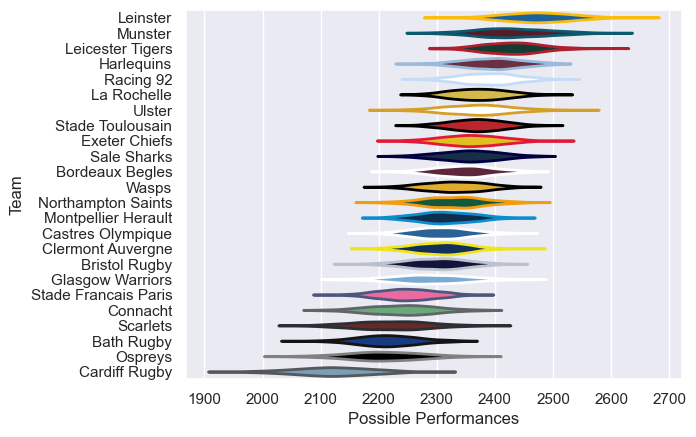

---  
title: "European Rugby Champions Cup 21/22"  
date: 2025-07-29 6:00:00 -0500  
categories: model review projection  
layout: article  
aside:  
    toc: true  
---
# Current Team Rankings

# Standings

## Current Standings

| Club                 |   Played |   Wins |   Point Differential |   Losing Bonus Points | Try Bonus Points   |   Competition Points |
|:---------------------|---------:|-------:|---------------------:|----------------------:|:-------------------|---------------------:|
| La Rochelle          |        8 |      8 |                   81 |                     0 |                    |                   32 |
| Leinster             |        8 |      7 |                  234 |                     1 |                    |                   29 |
| Munster              |        7 |      5 |                   79 |                     1 |                    |                   23 |
| Racing 92            |        6 |      5 |                   75 |                     1 |                    |                   21 |
| Ulster               |        6 |      5 |                   17 |                     1 |                    |                   21 |
| Harlequins           |        6 |      5 |                   33 |                     0 |                    |                   20 |
| Leicester Tigers     |        6 |      5 |                   30 |                     0 |                    |                   20 |
| Sale Sharks          |        6 |      3 |                   34 |                     2 |                    |                   14 |
| Bristol Rugby        |        4 |      3 |                   37 |                     1 |                    |                   13 |
| Exeter Chiefs        |        6 |      3 |                   34 |                     0 |                    |                   12 |
| Stade Toulousain     |        6 |      2 |                    2 |                     1 |                    |                   11 |
| Connacht             |        6 |      1 |                  -27 |                     4 |                    |                    8 |
| Montpellier Herault  |        6 |      2 |                 -118 |                     0 |                    |                    8 |
| Clermont Auvergne    |        5 |      1 |                  -32 |                     2 |                    |                    6 |
| Bordeaux Begles      |        4 |      1 |                    6 |                     1 |                    |                    5 |
| Glasgow Warriors     |        4 |      1 |                  -35 |                     1 |                    |                    5 |
| Castres Olympique    |        4 |      0 |                  -14 |                     4 |                    |                    4 |
| Wasps                |        3 |      1 |                  -51 |                     0 |                    |                    4 |
| Stade Francais Paris |        5 |      1 |                  -56 |                     0 |                    |                    4 |
| Northampton Saints   |        3 |      0 |                  -40 |                     2 |                    |                    2 |
| Cardiff Rugby        |        3 |      0 |                  -61 |                     1 |                    |                    1 |
| Ospreys              |        3 |      0 |                  -62 |                     0 |                    |                    0 |
| Scarlets             |        2 |      0 |                  -66 |                     0 |                    |                    0 |
| Bath Rugby           |        3 |      0 |                 -100 |                     0 |                    |                    0 |

# Completed Match Review

| Model | Percent Correct Predictions | Spread Error |
| ------ | ------ | ------ |
| Club Level | 66.7% | 12.6 |
| Player Level: Lineup | nan% | nan |
| Player Level: Minutes | nan% | nan |

