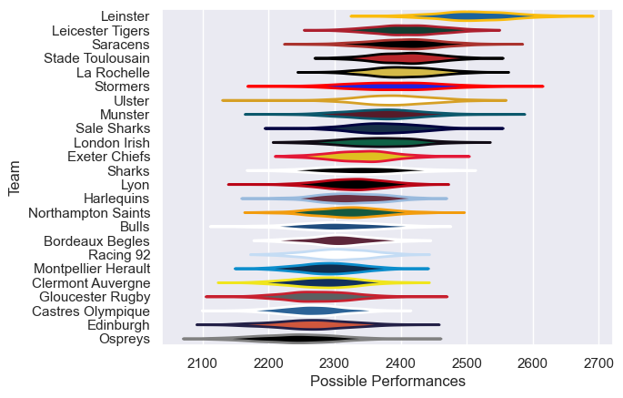

---  
title: "European Rugby Champions Cup 22/23"  
date: 2025-07-29 6:00:00 -0500  
categories: model review projection  
layout: article  
aside:  
    toc: true  
---
# Current Team Rankings

# Standings

## Current Standings

| Club                |   Played |   Wins |   Point Differential |   Losing Bonus Points |   Try Bonus Points |   Competition Points |
|:--------------------|---------:|-------:|---------------------:|----------------------:|-------------------:|---------------------:|
| La Rochelle         |        8 |      8 |                  100 |                     0 |                  4 |                   36 |
| Leinster            |        8 |      7 |                  214 |                     1 |                  6 |                   35 |
| Stade Toulousain    |        7 |      6 |                   96 |                     0 |                  2 |                   26 |
| Exeter Chiefs       |        7 |      4 |                   77 |                     0 |                  7 |                   25 |
| Saracens            |        6 |      4 |                   27 |                     1 |                  3 |                   20 |
| Stormers            |        6 |      4 |                   17 |                     0 |                  4 |                   20 |
| Sharks              |        6 |      4 |                   11 |                     0 |                  4 |                   20 |
| Leicester Tigers    |        6 |      4 |                    6 |                     1 |                  1 |                   18 |
| Edinburgh           |        5 |      3 |                   16 |                     1 |                  2 |                   15 |
| Harlequins          |        5 |      2 |                    1 |                     2 |                  4 |                   14 |
| Ospreys             |        5 |      3 |                   -3 |                     1 |                  1 |                   14 |
| Montpellier Herault |        5 |      1 |                  -12 |                     1 |                  3 |                   12 |
| Munster             |        5 |      2 |                   -9 |                     2 |                  1 |                   11 |
| Bulls               |        5 |      2 |                  -61 |                     0 |                  2 |                   10 |
| Gloucester Rugby    |        5 |      2 |                  -81 |                     1 |                  1 |                   10 |
| Lyon                |        4 |      1 |                  -10 |                     1 |                  3 |                    8 |
| Ulster              |        5 |      1 |                  -54 |                     2 |                  1 |                    7 |
| Clermont Auvergne   |        4 |      1 |                  -26 |                     1 |                  1 |                    6 |
| Sale Sharks         |        4 |      1 |                  -20 |                     0 |                  1 |                    5 |
| Racing 92           |        4 |      1 |                  -61 |                     1 |                    |                    5 |
| London Irish        |        4 |      0 |                  -39 |                     1 |                    |                    3 |
| Bordeaux Begles     |        4 |      0 |                  -46 |                     2 |                    |                    2 |
| Northampton Saints  |        4 |      0 |                  -67 |                     1 |                    |                    1 |
| Castres Olympique   |        4 |      0 |                  -76 |                     0 |                    |                    0 |

# Completed Match Review

| Model | Percent Correct Predictions | Spread Error |
| ------ | ------ | ------ |
| Club Level | 68.3% | 12.7 |
| Player Level: Lineup | nan% | nan |
| Player Level: Minutes | nan% | nan |

