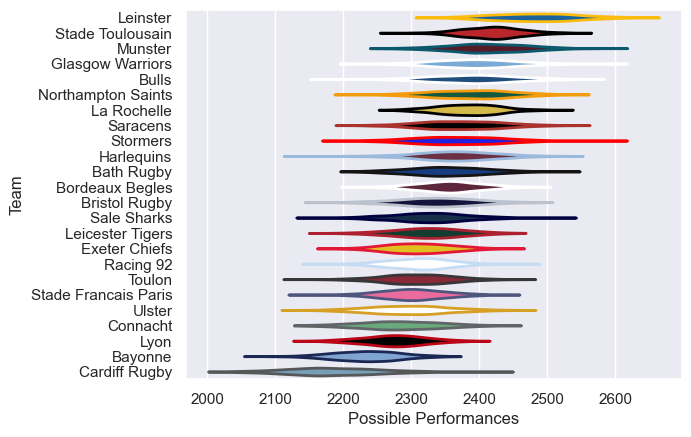

---  
title: "European Rugby Champions Cup 23/24 Status"  
date: 2025-07-28 6:00:00 -0500  
categories: model review projection  
layout: article  
aside:  
    toc: true  
---
# Current Team Rankings

# Standings

## Current Standings

| Club                 |   Played |   Wins |   Point Differential |   Losing Bonus Points |   Try Bonus Points |   Competition Points |
|:---------------------|---------:|-------:|---------------------:|----------------------:|-------------------:|---------------------:|
| Stade Toulousain     |        8 |      8 |                  192 |                     0 |                  7 |                   39 |
| Leinster             |        8 |      7 |                  105 |                     0 |                  5 |                   33 |
| Northampton Saints   |        7 |      6 |                  106 |                     1 |                  4 |                   29 |
| Harlequins           |        7 |      5 |                   35 |                     0 |                  6 |                   26 |
| Bordeaux Begles      |        6 |      4 |                  121 |                     2 |                  6 |                   24 |
| Bulls                |        6 |      4 |                   33 |                     1 |                  3 |                   20 |
| Exeter Chiefs        |        6 |      4 |                  -44 |                     0 |                  1 |                   17 |
| Bath Rugby           |        5 |      3 |                   16 |                     1 |                  3 |                   16 |
| La Rochelle          |        6 |      3 |                   12 |                     2 |                  2 |                   16 |
| Stormers             |        5 |      3 |                    2 |                     1 |                  2 |                   15 |
| Lyon                 |        5 |      2 |                  -42 |                     1 |                  3 |                   12 |
| Glasgow Warriors     |        5 |      2 |                   10 |                     2 |                  1 |                   11 |
| Saracens             |        5 |      2 |                  -50 |                     0 |                  2 |                   10 |
| Munster              |        5 |      1 |                  -10 |                     1 |                  2 |                    9 |
| Leicester Tigers     |        5 |      2 |                  -52 |                     0 |                  1 |                    9 |
| Bayonne              |        4 |      1 |                  -25 |                     1 |                  1 |                    8 |
| Racing 92            |        5 |      1 |                  -25 |                     2 |                  2 |                    8 |
| Sale Sharks          |        4 |      1 |                   -7 |                     1 |                  1 |                    6 |
| Connacht             |        4 |      1 |                  -52 |                     0 |                  2 |                    6 |
| Bristol Rugby        |        4 |      1 |                  -48 |                     0 |                  1 |                    5 |
| Ulster               |        4 |      1 |                  -59 |                     0 |                  1 |                    5 |
| Cardiff Rugby        |        4 |      0 |                 -113 |                     1 |                  2 |                    3 |
| Toulon               |        4 |      0 |                  -39 |                     2 |                    |                    2 |
| Stade Francais Paris |        4 |      0 |                  -66 |                     2 |                    |                    2 |

# Completed Match Review

| Model | Percent Correct Predictions | Spread Error |
| ------ | ------ | ------ |
| Club Level | 73.0% | 13.1 |
| Player Level: Lineup | nan% | nan |
| Player Level: Minutes | nan% | nan |

