---  
title: "European Rugby Champions Cup 24/25 Status"  
date: 2025-04-10 6:00:00 -0500  
categories: model review projection  
layout: article  
aside:  
    toc: true  
---
# Current Team Rankings

# Pool Results

## Pool A

## Current Standings

| Club             |   Played |   Wins |   Point Differential |   Losing Bonus Points |   Try Bonus Points |
|:-----------------|---------:|-------:|---------------------:|----------------------:|-------------------:|
| Bordeaux Begles  |        5 |      5 |                  151 |                     0 |                  5 |
| Stade Toulousain |        5 |      5 |                  186 |                     0 |                  4 |
| Leicester Tigers |        5 |      2 |                  -39 |                     0 |                  3 |
| Ulster           |        5 |      1 |                  -71 |                     0 |                  2 |
| Sharks           |        4 |      1 |                  -87 |                     0 |                  1 |
| Exeter Chiefs    |        4 |      0 |                 -141 |                     0 |                  1 |

### Projected Total Table

| Club             |   Played |   Wins |   Point Differential |   Losing Bonus Points |   Try Bonus Points |   Competition Points | Pool   |
|:-----------------|---------:|-------:|---------------------:|----------------------:|-------------------:|---------------------:|:-------|
| Bordeaux Begles  |        5 |      5 |                  151 |                     0 |                  5 |                   25 | PoolA  |
| Stade Toulousain |        5 |      5 |                  186 |                     0 |                  4 |                   24 | PoolA  |
| Leicester Tigers |        5 |      2 |                  -39 |                     0 |                  3 |                   11 | PoolA  |
| Ulster           |        5 |      1 |                  -71 |                     0 |                  2 |                    6 | PoolA  |
| Sharks           |        4 |      1 |                  -87 |                     0 |                  1 |                    5 | PoolA  |
| Exeter Chiefs    |        4 |      0 |                 -141 |                     0 |                  1 |                    1 | PoolA  |

## Pool B

## Current Standings

| Club              |   Played |   Wins |   Point Differential |   Losing Bonus Points |   Try Bonus Points |
|:------------------|---------:|-------:|---------------------:|----------------------:|-------------------:|
| Leinster          |        6 |      5 |                   49 |                     0 |                nan |
| Benetton Treviso  |        5 |      3 |                  -11 |                     1 |                  3 |
| La Rochelle       |        5 |      2 |                   22 |                     3 |                  1 |
| Clermont Auvergne |        5 |      2 |                   -4 |                     0 |                  2 |
| Bath Rugby        |        4 |      1 |                  -12 |                     2 |                  1 |
| Bristol Rugby     |        4 |      1 |                  -52 |                     1 |                  2 |

### Projected Total Table

| Club              |   Played |   Wins |   Point Differential |   Losing Bonus Points |   Try Bonus Points |   Competition Points | Pool   |
|:------------------|---------:|-------:|---------------------:|----------------------:|-------------------:|---------------------:|:-------|
| Leinster          |        6 |      5 |                   49 |                     0 |                nan |                   23 | PoolB  |
| Benetton Treviso  |        5 |      3 |                  -11 |                     1 |                  3 |                   16 | PoolB  |
| La Rochelle       |        5 |      2 |                   22 |                     3 |                  1 |                   12 | PoolB  |
| Clermont Auvergne |        5 |      2 |                   -4 |                     0 |                  2 |                   10 | PoolB  |
| Bath Rugby        |        4 |      1 |                  -12 |                     2 |                  1 |                    7 | PoolB  |
| Bristol Rugby     |        4 |      1 |                  -52 |                     1 |                  2 |                    7 | PoolB  |

## Pool C

## Current Standings

| Club                 |   Played |   Wins |   Point Differential |   Losing Bonus Points |   Try Bonus Points |
|:---------------------|---------:|-------:|---------------------:|----------------------:|-------------------:|
| Northampton Saints   |        5 |      4 |                   43 |                     0 |                  5 |
| Munster              |        5 |      3 |                   28 |                     2 |                  2 |
| Castres Olympique    |        5 |      3 |                    4 |                     0 |                  3 |
| Saracens             |        5 |      2 |                  -10 |                     1 |                  3 |
| Bulls                |        4 |      1 |                  -29 |                     0 |                  1 |
| Stade Francais Paris |        4 |      1 |                  -68 |                     0 |                  1 |

### Projected Total Table

| Club                 |   Played |   Wins |   Point Differential |   Losing Bonus Points |   Try Bonus Points |   Competition Points | Pool   |
|:---------------------|---------:|-------:|---------------------:|----------------------:|-------------------:|---------------------:|:-------|
| Northampton Saints   |        5 |      4 |                   43 |                     0 |                  5 |                   21 | PoolC  |
| Munster              |        5 |      3 |                   28 |                     2 |                  2 |                   16 | PoolC  |
| Castres Olympique    |        5 |      3 |                    4 |                     0 |                  3 |                   15 | PoolC  |
| Saracens             |        5 |      2 |                  -10 |                     1 |                  3 |                   12 | PoolC  |
| Bulls                |        4 |      1 |                  -29 |                     0 |                  1 |                    5 | PoolC  |
| Stade Francais Paris |        4 |      1 |                  -68 |                     0 |                  1 |                    5 | PoolC  |

## Pool D

## Current Standings

| Club             |   Played |   Wins |   Point Differential |   Losing Bonus Points |   Try Bonus Points |
|:-----------------|---------:|-------:|---------------------:|----------------------:|-------------------:|
| Glasgow Warriors |        6 |      3 |                   30 |                     2 |                nan |
| Toulon           |        5 |      4 |                   27 |                     0 |                  2 |
| Harlequins       |        5 |      3 |                   46 |                     0 |                  1 |
| Sale Sharks      |        5 |      2 |                  -34 |                     0 |                  3 |
| Racing 92        |        4 |      2 |                  -12 |                     0 |                  1 |
| Stormers         |        4 |      1 |                  -16 |                     0 |                  1 |

### Projected Total Table

| Club             |   Played |   Wins |   Point Differential |   Losing Bonus Points |   Try Bonus Points |   Competition Points | Pool   |
|:-----------------|---------:|-------:|---------------------:|----------------------:|-------------------:|---------------------:|:-------|
| Glasgow Warriors |        6 |      3 |                   30 |                     2 |                nan |                   18 | PoolD  |
| Toulon           |        5 |      4 |                   27 |                     0 |                  2 |                   18 | PoolD  |
| Harlequins       |        5 |      3 |                   46 |                     0 |                  1 |                   13 | PoolD  |
| Sale Sharks      |        5 |      2 |                  -34 |                     0 |                  3 |                   11 | PoolD  |
| Racing 92        |        4 |      2 |                  -12 |                     0 |                  1 |                    9 | PoolD  |
| Stormers         |        4 |      1 |                  -16 |                     0 |                  1 |                    5 | PoolD  |

# Projected Playoff Results

|                    | Reach Quarterfinals   | Reach Semifinals   | Reach Final   | Win Final   |
|:-------------------|:----------------------|:-------------------|:--------------|:------------|
| Stade Toulousain   | 100.0 %               | 65.6 %             | 51.6 %        | 36.4 %      |
| Leinster           | 100.0 %               | 89.0 %             | 52.2 %        | 35.7 %      |
| Bordeaux Begles    | 100.0 %               | 85.1 %             | 66.3 %        | 20.6 %      |
| Toulon             | 100.0 %               | 34.4 %             | 8.7 %         | 2.9 %       |
| Glasgow Warriors   | 100.0 %               | 11.0 %             | 4.7 %         | 1.7 %       |
| Munster            | 100.0 %               | 14.9 %             | 3.0 %         | 1.2 %       |
| Northampton Saints | 100.0 %               | 76.4 %             | 10.6 %        | 1.1 %       |
| Castres Olympique  | 100.0 %               | 23.6 %             | 2.9 %         | 0.4 %       |

# Knockout Match Predictions

## Quarterfinals

### Leinster V Glasgow Warriors on 2025/04/11

Average Margin: Leinster by 9.6

### Bordeaux Begles V Munster on 2025/04/12

Average Margin: Bordeaux Begles by 6.9

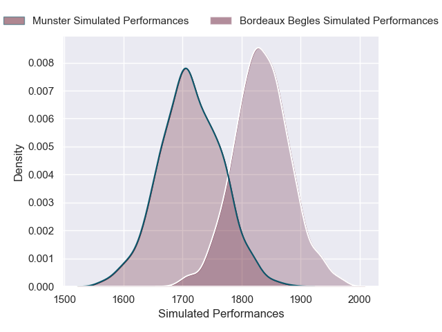

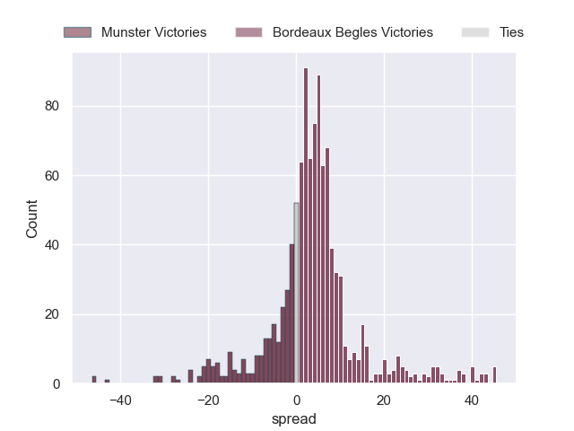

### Northampton Saints V Castres Olympique on 2025/04/12

Average Margin: Northampton Saints by 4.8

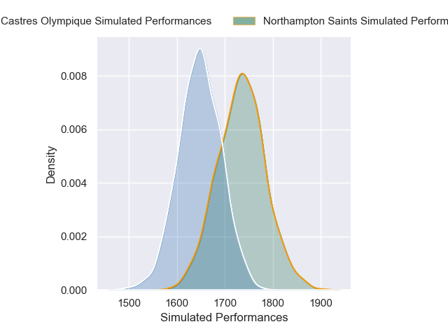
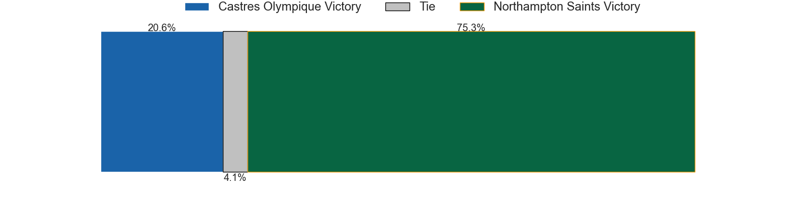
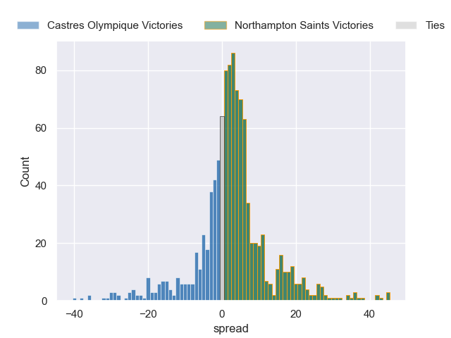

### Toulon V Stade Toulousain on 2025/04/13

Average Margin: Stade Toulousain by 2.3

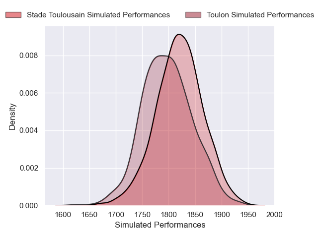

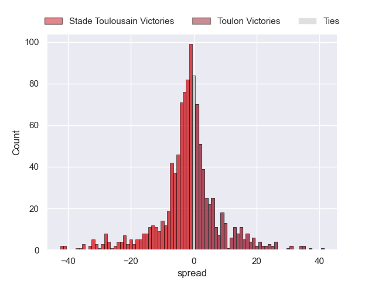

## Semifinals

### Bordeaux Begles V Castres Olympique on 2025/05/02

Average Margin: Bordeaux Begles by 10.6

### Leinster V Toulon on 2025/05/02

Average Margin: Leinster by 6.6

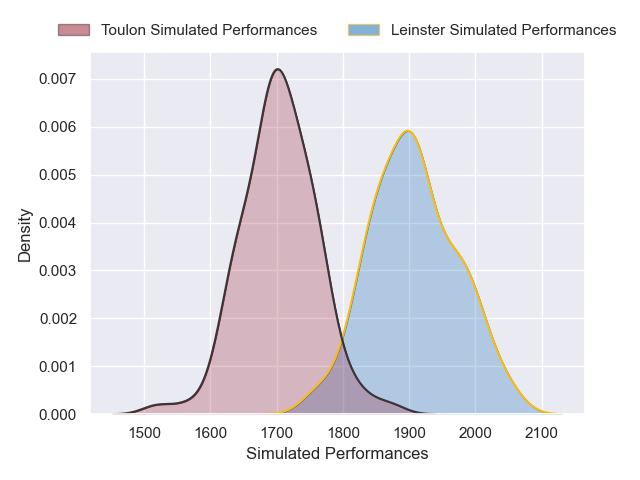

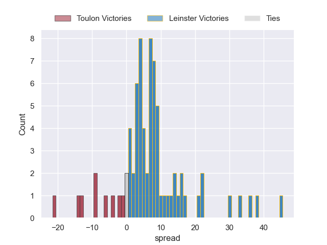

### Stade Toulousain V Glasgow Warriors on 2025/05/02

Average Margin: Stade Toulousain by 5.6

### Glasgow Warriors V Toulon on 2025/05/02

Average Margin: Glasgow Warriors by 9.3

### Northampton Saints V Munster on 2025/05/02

Average Margin: Munster by 5.2

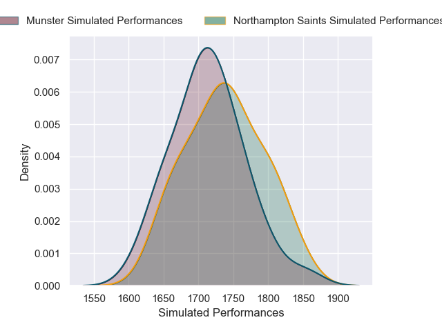

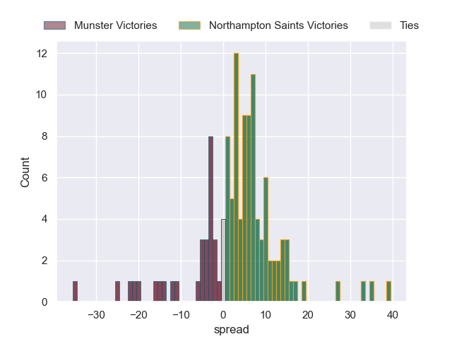

### Toulon V Munster on 2025/05/02

Average Margin: Toulon by 2.5

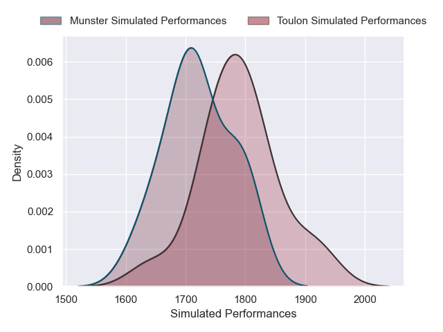

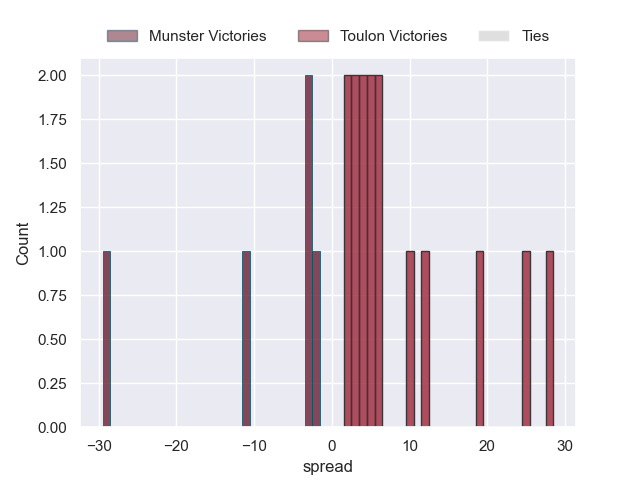

### Leinster V Munster on 2025/05/02

Average Margin: Leinster by 4.3

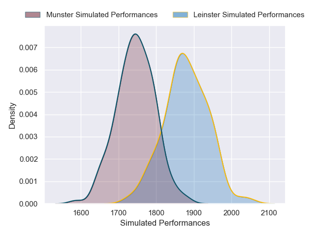

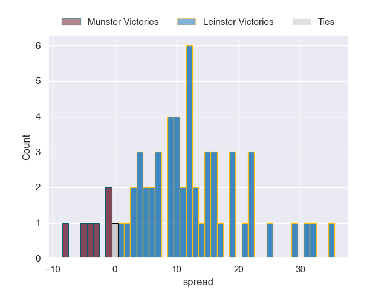

### Leinster V Castres Olympique on 2025/05/02

Average Margin: Leinster by 9.4

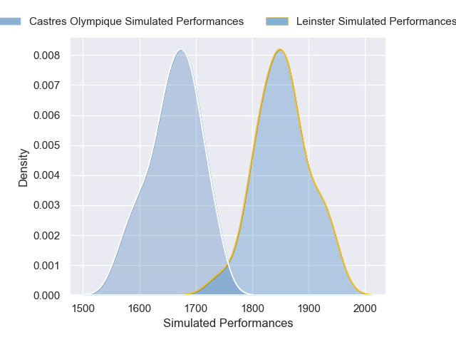

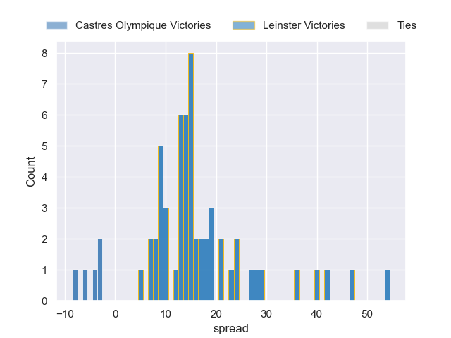

### Northampton Saints V Toulon on 2025/05/02

Average Margin: Toulon by 2.2

### Stade Toulousain V Munster on 2025/05/02

Average Margin: Stade Toulousain by 9.3

### Northampton Saints V Glasgow Warriors on 2025/05/02

Average Margin: Northampton Saints by 1.9

### Stade Toulousain V Northampton Saints on 2025/05/02

Average Margin: Stade Toulousain by 10.8

### Leinster V Northampton Saints on 2025/05/02

Average Margin: Leinster by 13.1

### Bordeaux Begles V Leinster on 2025/05/02

Average Margin: Leinster by 2.9

### Bordeaux Begles V Toulon on 2025/05/02

Average Margin: Bordeaux Begles by 4.4

### Stade Toulousain V Castres Olympique on 2025/05/02

Average Margin: Stade Toulousain by 11.7

### Stade Toulousain V Leinster on 2025/05/02

Average Margin: Stade Toulousain by 3.3

### Bordeaux Begles V Northampton Saints on 2025/05/02

Average Margin: Bordeaux Begles by 8.6

### Bordeaux Begles V Glasgow Warriors on 2025/05/02

Average Margin: Bordeaux Begles by 6.4

## Finals

### Glasgow Warriors V Toulon on 2025/05/24

Average Margin: Glasgow Warriors by 9.3

### Northampton Saints V Munster on 2025/05/24

Average Margin: Munster by 5.2

### Bordeaux Begles V Toulon on 2025/05/24

Average Margin: Bordeaux Begles by 4.4

### Stade Toulousain V Bordeaux Begles on 2025/05/24

Average Margin: Stade Toulousain by 3.3

### Northampton Saints V Toulon on 2025/05/24

Average Margin: Toulon by 2.2

### Toulon V Munster on 2025/05/24

Average Margin: Toulon by 2.5

### Stade Toulousain V Leinster on 2025/05/24

Average Margin: Stade Toulousain by 3.3

### Stade Toulousain V Northampton Saints on 2025/05/24

Average Margin: Stade Toulousain by 10.8

### Stade Toulousain V Castres Olympique on 2025/05/24

Average Margin: Stade Toulousain by 11.7

### Leinster V Munster on 2025/05/24

Average Margin: Leinster by 4.3

### Northampton Saints V Glasgow Warriors on 2025/05/24

Average Margin: Northampton Saints by 1.9

### Bordeaux Begles V Leinster on 2025/05/24

Average Margin: Leinster by 2.9

### Bordeaux Begles V Northampton Saints on 2025/05/24

Average Margin: Bordeaux Begles by 8.6

### Stade Toulousain V Munster on 2025/05/24

Average Margin: Stade Toulousain by 9.3

### Leinster V Toulon on 2025/05/24

Average Margin: Leinster by 6.6

### Bordeaux Begles V Stade Toulousain on 2025/05/24

Average Margin: Stade Toulousain by 4.0

### Leinster V Northampton Saints on 2025/05/24

Average Margin: Leinster by 13.1

### Leinster V Castres Olympique on 2025/05/24

Average Margin: Leinster by 9.4

### Bordeaux Begles V Glasgow Warriors on 2025/05/24

Average Margin: Bordeaux Begles by 6.4

### Stade Toulousain V Glasgow Warriors on 2025/05/24

Average Margin: Stade Toulousain by 5.6

# Completed Match Review

| Match                                              |   Result |   Lineup Prediction |   Minutes Prediction |   Club Prediction |
|:---------------------------------------------------|---------:|--------------------:|---------------------:|------------------:|
| Clermont Auvergne V Benetton Treviso on 2024/12/07 |       28 |                -4.6 |                 -2.8 |               6.9 |
| Stormers V Toulon on 2024/12/07                    |      -10 |                -5.1 |                  1.5 |               3.7 |
| Stade Toulousain V Ulster on 2024/12/08            |       40 |                21.3 |                 15.9 |              11.4 |
| Leinster V Clermont Auvergne on 2024/12/14         |        8 |                13.6 |                 30.5 |              14   |
| Benetton Treviso V Bath Rugby on 2024/12/15        |        1 |                -1.5 |                  1.6 |              -2.3 |
| Stade Francais Paris V Saracens on 2024/12/15      |      -11 |               -14.3 |                 -1.9 |               0.2 |
| Toulon V Glasgow Warriors on 2024/12/15            |        1 |                -2.1 |                 -4   |               1.7 |
| Glasgow Warriors V Racing 92 on 2025/01/10         |       10 |                25.4 |                 17   |              10.5 |
| Sharks V Stade Toulousain on 2025/01/11            |      -12 |               -18.9 |                -17   |              -4   |
| Castres Olympique V Bulls on 2025/01/11            |       39 |                 1.9 |                 -3.2 |              -1.3 |
| Bristol Rugby V Benetton Treviso on 2025/01/12     |        6 |                 6.9 |                  9   |               8.8 |
| Bulls V Stade Francais Paris on 2025/01/18         |       41 |                17.2 |                 11.6 |              10.5 |
| Clermont Auvergne V Bristol Rugby on 2025/01/18    |        7 |                -7.5 |                -10.2 |               3.4 |
| Benetton Treviso V La Rochelle on 2025/01/18       |        7 |                -9.5 |                -14.3 |              -1.1 |
| Harlequins V Glasgow Warriors on 2025/01/18        |       17 |               -27.1 |                -16.2 |              -0.3 |
| Racing 92 V Stormers on 2025/01/18                 |        9 |                -2.7 |                  0.8 |               3.5 |
| Leinster V Bath Rugby on 2025/01/18                |       26 |                -0.5 |                  2.8 |              10.1 |
| Saracens V Castres Olympique on 2025/01/19         |       -8 |                17.1 |                 12.2 |              10.1 |
| Stade Toulousain V Leicester Tigers on 2025/01/19  |       68 |                24.3 |                 27.7 |              11.7 |

# Model Accuracies

| Model | Percent Correct Predictions | Spread Error |
| ------ | ------ | ------ |
| Club Level | 75.4% | 16.9 |
| Player Level: Lineup | 52.6% | 17.7 |
| Player Level: Minutes | 57.9% | 18.6 |

