---  
title: "European Rugby Champions Cup 24/25 Status"  
date: 2025-04-11 6:00:00 -0500  
categories: model review projection  
layout: article  
aside:  
    toc: true  
---
# Current Team Rankings

# Pool Results

## Pool A

## Current Standings

| Club             |   Played |   Wins |   Point Differential |   Losing Bonus Points |   Try Bonus Points |
|:-----------------|---------:|-------:|---------------------:|----------------------:|-------------------:|
| Stade Toulousain |        6 |      5 |                  181 |                     1 |                nan |
| Bordeaux Begles  |        6 |      5 |                   94 |                     0 |                nan |
| Leicester Tigers |        5 |      2 |                  -39 |                     0 |                  3 |
| Ulster           |        5 |      1 |                  -73 |                     0 |                  2 |
| Sharks           |        4 |      1 |                  -87 |                     0 |                  1 |
| Exeter Chiefs    |        4 |      0 |                 -141 |                     0 |                  1 |

### Projected Total Table

| Club             |   Played |   Wins |   Point Differential |   Losing Bonus Points |   Try Bonus Points |   Competition Points | Pool   |
|:-----------------|---------:|-------:|---------------------:|----------------------:|-------------------:|---------------------:|:-------|
| Stade Toulousain |        6 |      5 |                  181 |                     1 |                nan |                   25 | PoolA  |
| Bordeaux Begles  |        6 |      5 |                   94 |                     0 |                nan |                   25 | PoolA  |
| Leicester Tigers |        5 |      2 |                  -39 |                     0 |                  3 |                   11 | PoolA  |
| Ulster           |        5 |      1 |                  -73 |                     0 |                  2 |                    6 | PoolA  |
| Sharks           |        4 |      1 |                  -87 |                     0 |                  1 |                    5 | PoolA  |
| Exeter Chiefs    |        4 |      0 |                 -141 |                     0 |                  1 |                    1 | PoolA  |

## Pool B

## Current Standings

| Club              |   Played |   Wins |   Point Differential |   Losing Bonus Points |   Try Bonus Points |
|:------------------|---------:|-------:|---------------------:|----------------------:|-------------------:|
| Leinster          |        6 |      6 |                   71 |                     0 |                nan |
| Benetton Treviso  |        5 |      2 |                  -28 |                     2 |                  3 |
| La Rochelle       |        5 |      2 |                   22 |                     3 |                  1 |
| Clermont Auvergne |        5 |      2 |                  -14 |                     0 |                  2 |
| Bath Rugby        |        4 |      1 |                  -12 |                     2 |                  1 |
| Bristol Rugby     |        4 |      1 |                  -52 |                     1 |                  2 |

### Projected Total Table

| Club              |   Played |   Wins |   Point Differential |   Losing Bonus Points |   Try Bonus Points |   Competition Points | Pool   |
|:------------------|---------:|-------:|---------------------:|----------------------:|-------------------:|---------------------:|:-------|
| Leinster          |        6 |      6 |                   71 |                     0 |                nan |                   27 | PoolB  |
| Benetton Treviso  |        5 |      2 |                  -28 |                     2 |                  3 |                   13 | PoolB  |
| La Rochelle       |        5 |      2 |                   22 |                     3 |                  1 |                   12 | PoolB  |
| Clermont Auvergne |        5 |      2 |                  -14 |                     0 |                  2 |                   10 | PoolB  |
| Bath Rugby        |        4 |      1 |                  -12 |                     2 |                  1 |                    7 | PoolB  |
| Bristol Rugby     |        4 |      1 |                  -52 |                     1 |                  2 |                    7 | PoolB  |

## Pool C

## Current Standings

| Club                 |   Played |   Wins |   Point Differential |   Losing Bonus Points |   Try Bonus Points |
|:---------------------|---------:|-------:|---------------------:|----------------------:|-------------------:|
| Castres Olympique    |        6 |      5 |                   80 |                     0 |                nan |
| Northampton Saints   |        6 |      4 |                   -6 |                     0 |                nan |
| Munster              |        6 |      4 |                   87 |                     2 |                nan |
| Saracens             |        5 |      3 |                   34 |                     1 |                  3 |
| Bulls                |        4 |      1 |                  -29 |                     0 |                  1 |
| Stade Francais Paris |        4 |      1 |                  -68 |                     0 |                  1 |

### Projected Total Table

| Club                 |   Played |   Wins |   Point Differential |   Losing Bonus Points |   Try Bonus Points |   Competition Points | Pool   |
|:---------------------|---------:|-------:|---------------------:|----------------------:|-------------------:|---------------------:|:-------|
| Castres Olympique    |        6 |      5 |                   80 |                     0 |                nan |                   23 | PoolC  |
| Northampton Saints   |        6 |      4 |                   -6 |                     0 |                nan |                   21 | PoolC  |
| Munster              |        6 |      4 |                   87 |                     2 |                nan |                   20 | PoolC  |
| Saracens             |        5 |      3 |                   34 |                     1 |                  3 |                   16 | PoolC  |
| Bulls                |        4 |      1 |                  -29 |                     0 |                  1 |                    5 | PoolC  |
| Stade Francais Paris |        4 |      1 |                  -68 |                     0 |                  1 |                    5 | PoolC  |

## Pool D

## Current Standings

| Club             |   Played |   Wins |   Point Differential |   Losing Bonus Points |   Try Bonus Points |
|:-----------------|---------:|-------:|---------------------:|----------------------:|-------------------:|
| Glasgow Warriors |        6 |      3 |                   28 |                     2 |                nan |
| Toulon           |        6 |      4 |                  -12 |                     0 |                nan |
| Sale Sharks      |        5 |      2 |                  -34 |                     0 |                  3 |
| Harlequins       |        5 |      2 |                   26 |                     1 |                  1 |
| Racing 92        |        4 |      2 |                  -12 |                     0 |                  1 |
| Stormers         |        4 |      1 |                  -16 |                     0 |                  1 |

### Projected Total Table

| Club             |   Played |   Wins |   Point Differential |   Losing Bonus Points |   Try Bonus Points |   Competition Points | Pool   |
|:-----------------|---------:|-------:|---------------------:|----------------------:|-------------------:|---------------------:|:-------|
| Glasgow Warriors |        6 |      3 |                   28 |                     2 |                nan |                   18 | PoolD  |
| Toulon           |        6 |      4 |                  -12 |                     0 |                nan |                   18 | PoolD  |
| Sale Sharks      |        5 |      2 |                  -34 |                     0 |                  3 |                   11 | PoolD  |
| Harlequins       |        5 |      2 |                   26 |                     1 |                  1 |                   10 | PoolD  |
| Racing 92        |        4 |      2 |                  -12 |                     0 |                  1 |                    9 | PoolD  |
| Stormers         |        4 |      1 |                  -16 |                     0 |                  1 |                    5 | PoolD  |

# Projected Playoff Results

|                    | Reach Quarterfinals   | Reach Semifinals   | Reach Final   | Win Final   |
|:-------------------|:----------------------|:-------------------|:--------------|:------------|
| Leinster           | 100.0 %               | 89.3 %             | 81.8 %        | 59.1 %      |
| Stade Toulousain   | 100.0 %               | 61.2 %             | 51.1 %        | 23.8 %      |
| Bordeaux Begles    | 100.0 %               | 76.8 %             | 37.5 %        | 9.0 %       |
| Munster            | 100.0 %               | 23.2 %             | 8.3 %         | 2.2 %       |
| Toulon             | 100.0 %               | 38.8 %             | 4.7 %         | 1.9 %       |
| Glasgow Warriors   | 100.0 %               | 10.7 %             | 3.5 %         | 1.9 %       |
| Northampton Saints | 100.0 %               | 70.3 %             | 8.6 %         | 1.6 %       |
| Castres Olympique  | 100.0 %               | 29.7 %             | 4.5 %         | 0.5 %       |

# Knockout Match Predictions

## Quarterfinals

### Leinster V Glasgow Warriors on 2025/04/11

Average Margin: Leinster by 9.8

### Bordeaux Begles V Munster on 2025/04/12

Average Margin: Bordeaux Begles by 4.5

### Northampton Saints V Castres Olympique on 2025/04/12

Average Margin: Northampton Saints by 3.0

### Toulon V Stade Toulousain on 2025/04/13

Average Margin: Stade Toulousain by 1.2

## Semifinals

### Leinster V Castres Olympique on 2025/05/02

Average Margin: Leinster by 13.1

### Leinster V Munster on 2025/05/02

Average Margin: Leinster by 8.7

### Bordeaux Begles V Castres Olympique on 2025/05/02

Average Margin: Bordeaux Begles by 9.9

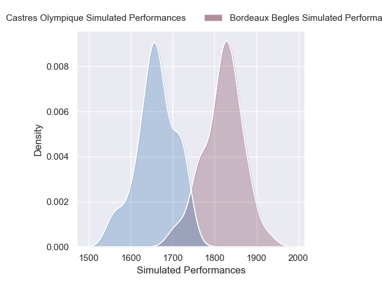
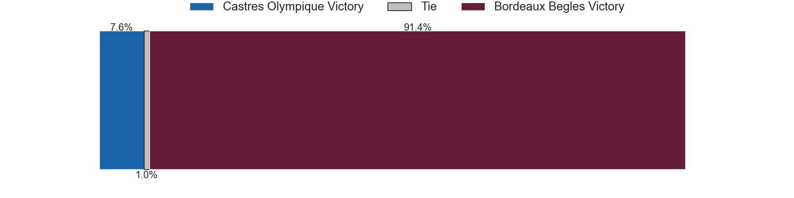
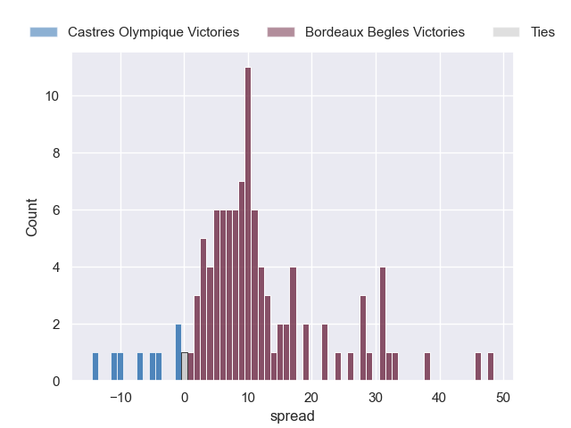

### Bordeaux Begles V Glasgow Warriors on 2025/05/02

Average Margin: Bordeaux Begles by 0.7

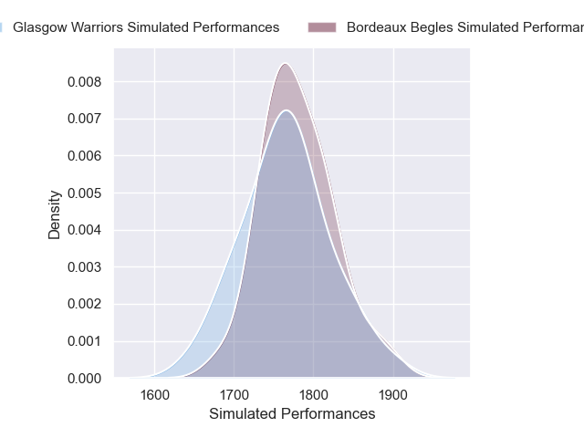

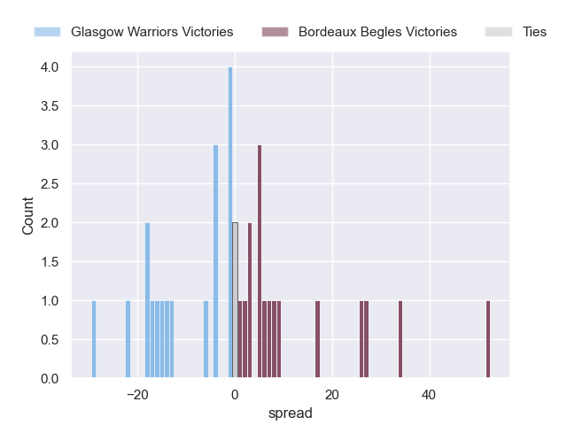

### Northampton Saints V Toulon on 2025/05/02

Average Margin: Toulon by 2.8

### Northampton Saints V Munster on 2025/05/02

Average Margin: Munster by 4.0

### Stade Toulousain V Castres Olympique on 2025/05/02

Average Margin: Stade Toulousain by 8.7

### Munster V Northampton Saints on 2025/05/02

Average Margin: Munster by 7.7

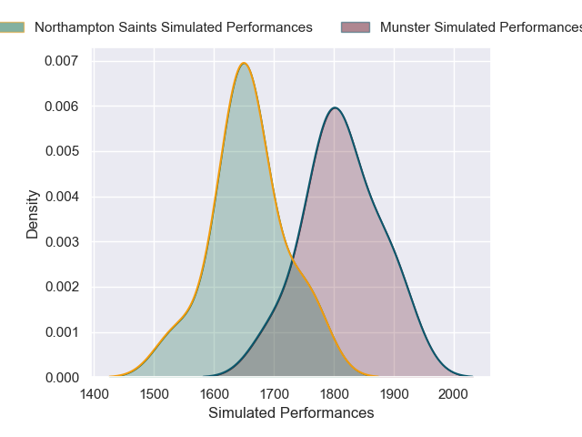

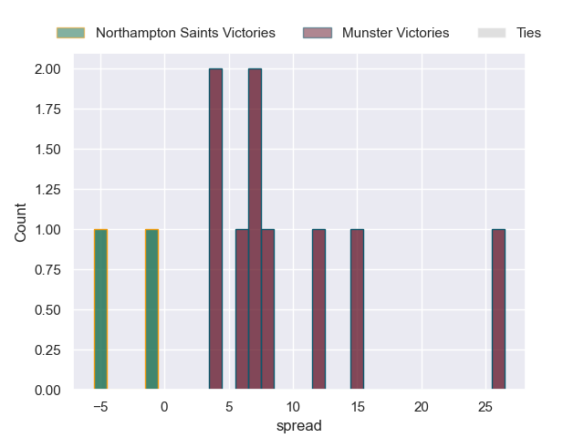

### Northampton Saints V Glasgow Warriors on 2025/05/02

Average Margin: Glasgow Warriors by 2.5

### Stade Toulousain V Glasgow Warriors on 2025/05/02

Average Margin: Stade Toulousain by 6.1

### Stade Toulousain V Northampton Saints on 2025/05/02

Average Margin: Stade Toulousain by 9.1

### Castres Olympique V Munster on 2025/05/02

Average Margin: Castres Olympique by 0.6

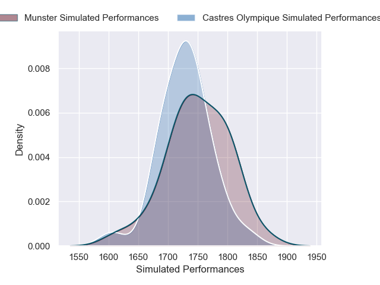

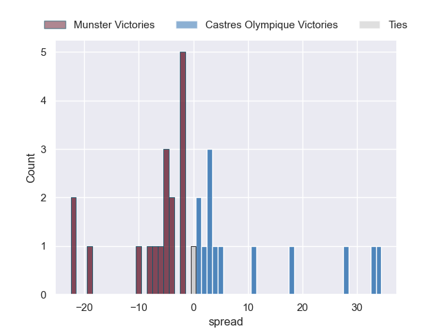

### Leinster V Toulon on 2025/05/02

Average Margin: Leinster by 9.3

### Stade Toulousain V Munster on 2025/05/02

Average Margin: Stade Toulousain by 6.6

### Stade Toulousain V Bordeaux Begles on 2025/05/02

Average Margin: Stade Toulousain by 7.7

### Bordeaux Begles V Northampton Saints on 2025/05/02

Average Margin: Bordeaux Begles by 8.3

### Bordeaux Begles V Stade Toulousain on 2025/05/02

Average Margin: Bordeaux Begles by 0.1

### Leinster V Northampton Saints on 2025/05/02

Average Margin: Leinster by 14.0

### Bordeaux Begles V Toulon on 2025/05/02

Average Margin: Bordeaux Begles by 4.5

## Finals

### Leinster V Castres Olympique on 2025/05/24

Average Margin: Leinster by 13.1

### Bordeaux Begles V Northampton Saints on 2025/05/24

Average Margin: Bordeaux Begles by 8.3

### Castres Olympique V Munster on 2025/05/24

Average Margin: Castres Olympique by 0.6

### Stade Toulousain V Northampton Saints on 2025/05/24

Average Margin: Stade Toulousain by 9.1

### Northampton Saints V Munster on 2025/05/24

Average Margin: Munster by 4.0

### Bordeaux Begles V Stade Toulousain on 2025/05/24

Average Margin: Bordeaux Begles by 0.1

### Northampton Saints V Toulon on 2025/05/24

Average Margin: Toulon by 2.8

### Northampton Saints V Glasgow Warriors on 2025/05/24

Average Margin: Glasgow Warriors by 2.5

### Stade Toulousain V Castres Olympique on 2025/05/24

Average Margin: Stade Toulousain by 8.7

### Stade Toulousain V Bordeaux Begles on 2025/05/24

Average Margin: Stade Toulousain by 7.7

### Leinster V Bordeaux Begles on 2025/05/24

Average Margin: Leinster by 6.1

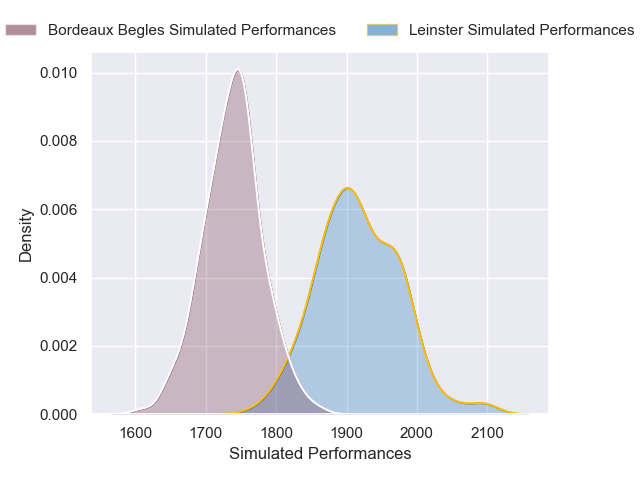

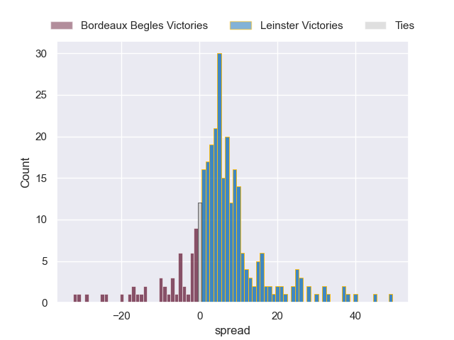

### Leinster V Northampton Saints on 2025/05/24

Average Margin: Leinster by 14.0

### Leinster V Munster on 2025/05/24

Average Margin: Leinster by 8.7

### Bordeaux Begles V Glasgow Warriors on 2025/05/24

Average Margin: Bordeaux Begles by 0.7

### Stade Toulousain V Glasgow Warriors on 2025/05/24

Average Margin: Stade Toulousain by 6.1

### Bordeaux Begles V Castres Olympique on 2025/05/24

Average Margin: Bordeaux Begles by 9.9

### Bordeaux Begles V Toulon on 2025/05/24

Average Margin: Bordeaux Begles by 4.5

### Stade Toulousain V Munster on 2025/05/24

Average Margin: Stade Toulousain by 6.6

### Leinster V Stade Toulousain on 2025/05/24

Average Margin: Leinster by 1.5

# Completed Match Review

| Match                                                |   Result |   Lineup Prediction |   Minutes Prediction |   Club Prediction |
|:-----------------------------------------------------|---------:|--------------------:|---------------------:|------------------:|
| Clermont Auvergne V Benetton Treviso on 2024/12/07   |       28 |                -4.8 |                 -3   |               6.9 |
| Stormers V Toulon on 2024/12/07                      |      -10 |                -4.7 |                  1.6 |               3.7 |
| Stade Toulousain V Ulster on 2024/12/08              |       40 |                21.6 |                 16   |              11.4 |
| Leinster V Clermont Auvergne on 2024/12/14           |        8 |                14   |                 31.1 |              14   |
| Benetton Treviso V Bath Rugby on 2024/12/15          |        1 |                -1.3 |                  1.8 |              -2.3 |
| Stade Francais Paris V Saracens on 2024/12/15        |      -11 |               -14.1 |                 -1.5 |               0.2 |
| Toulon V Glasgow Warriors on 2024/12/15              |        1 |                -1.7 |                 -3.7 |               1.7 |
| Glasgow Warriors V Racing 92 on 2025/01/10           |       10 |                25.5 |                 17.3 |              10.5 |
| Sharks V Stade Toulousain on 2025/01/11              |      -12 |               -19.5 |                -17.1 |              -4   |
| Castres Olympique V Bulls on 2025/01/11              |       39 |                 1.9 |                 -3.2 |              -1.3 |
| Bristol Rugby V Benetton Treviso on 2025/01/12       |        6 |                 6.8 |                  9.1 |               8.8 |
| Bulls V Stade Francais Paris on 2025/01/18           |       41 |                17.3 |                 11.9 |              10.5 |
| Clermont Auvergne V Bristol Rugby on 2025/01/18      |        7 |                -7.7 |                -10.2 |               3.4 |
| Benetton Treviso V La Rochelle on 2025/01/18         |        7 |                -9.7 |                -14.5 |              -1.1 |
| Harlequins V Glasgow Warriors on 2025/01/18          |       17 |               -26.9 |                -16.3 |              -0.3 |
| Racing 92 V Stormers on 2025/01/18                   |        9 |                -2.8 |                  0.8 |               3.5 |
| Leinster V Bath Rugby on 2025/01/18                  |       26 |                -0.8 |                  2.9 |              10.1 |
| Saracens V Castres Olympique on 2025/01/19           |       -8 |                17.6 |                 12.5 |              10.1 |
| Stade Toulousain V Leicester Tigers on 2025/01/19    |       68 |                24.5 |                 27.9 |              11.7 |
| Northampton Saints V Castres Olympique on 2025/04/12 |      -59 |                -2.2 |                  4.8 |               4.6 |
| Toulon V Stade Toulousain on 2025/04/13              |        5 |               -12.4 |                 -8.4 |               0.5 |

# Model Accuracies

| Model | Percent Correct Predictions | Spread Error |
| ------ | ------ | ------ |
| Club Level | 75.0% | 17.8 |
| Player Level: Lineup | 52.4% | 19.6 |
| Player Level: Minutes | 52.4% | 20.6 |

