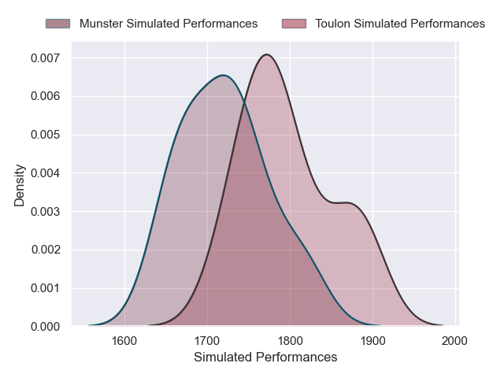
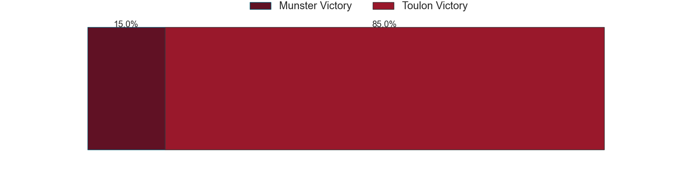
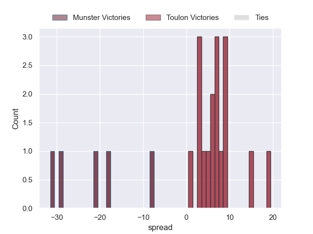
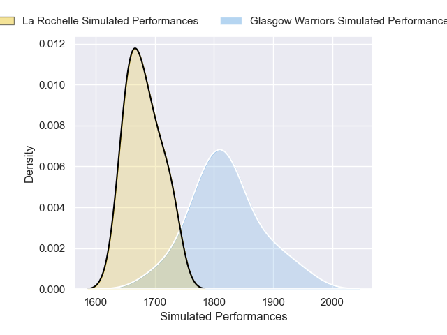
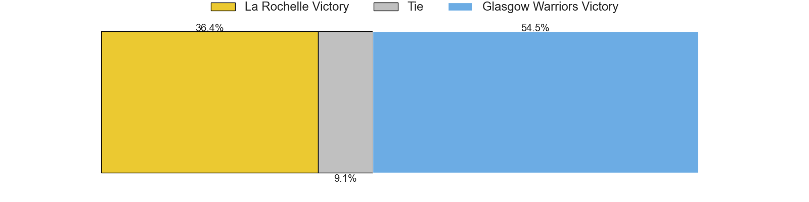
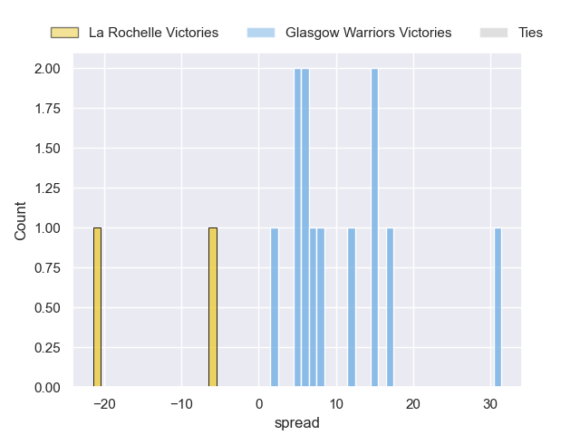

---  
title: "European Rugby Champions Cup 24/25 Status"  
date: 2025-03-07 6:00:00 -0500  
categories: model review projection  
layout: article  
aside:  
    toc: true  
---
# Current Team Rankings

# Pool Results

## Pool A

## Current Standings

| Club             |   Played |   Wins |   Point Differential |   Losing Bonus Points |   Try Bonus Points |
|:-----------------|---------:|-------:|---------------------:|----------------------:|-------------------:|
| Bordeaux Begles  |        4 |      4 |                  141 |                     0 |                  4 |
| Stade Toulousain |        4 |      4 |                  163 |                     0 |                  3 |
| Leicester Tigers |        4 |      2 |                  -15 |                     0 |                  3 |
| Ulster           |        4 |      1 |                  -61 |                     0 |                  1 |
| Sharks           |        4 |      1 |                  -87 |                     0 |                  1 |
| Exeter Chiefs    |        4 |      0 |                 -141 |                     0 |                  1 |

### Projected Total Table

| Club             |   Played |   Wins |   Point Differential |   Losing Bonus Points |   Try Bonus Points |   Competition Points | Pool   |
|:-----------------|---------:|-------:|---------------------:|----------------------:|-------------------:|---------------------:|:-------|
| Bordeaux Begles  |        4 |      4 |                  141 |                     0 |                  4 |                   20 | PoolA  |
| Stade Toulousain |        4 |      4 |                  163 |                     0 |                  3 |                   19 | PoolA  |
| Leicester Tigers |        4 |      2 |                  -15 |                     0 |                  3 |                   11 | PoolA  |
| Ulster           |        4 |      1 |                  -61 |                     0 |                  1 |                    5 | PoolA  |
| Sharks           |        4 |      1 |                  -87 |                     0 |                  1 |                    5 | PoolA  |
| Exeter Chiefs    |        4 |      0 |                 -141 |                     0 |                  1 |                    1 | PoolA  |

## Pool B

## Current Standings

| Club              |   Played |   Wins |   Point Differential |   Losing Bonus Points |   Try Bonus Points |
|:------------------|---------:|-------:|---------------------:|----------------------:|-------------------:|
| Leinster          |        4 |      4 |                   59 |                     0 |                  2 |
| La Rochelle       |        4 |      2 |                   23 |                     2 |                  1 |
| Benetton Treviso  |        4 |      2 |                  -26 |                     1 |                  2 |
| Clermont Auvergne |        4 |      2 |                    8 |                     0 |                  2 |
| Bath Rugby        |        4 |      1 |                  -12 |                     2 |                  1 |
| Bristol Rugby     |        4 |      1 |                  -52 |                     1 |                  2 |

### Projected Total Table

| Club              |   Played |   Wins |   Point Differential |   Losing Bonus Points |   Try Bonus Points |   Competition Points | Pool   |
|:------------------|---------:|-------:|---------------------:|----------------------:|-------------------:|---------------------:|:-------|
| Leinster          |        4 |      4 |                   59 |                     0 |                  2 |                   18 | PoolB  |
| La Rochelle       |        4 |      2 |                   23 |                     2 |                  1 |                   11 | PoolB  |
| Benetton Treviso  |        4 |      2 |                  -26 |                     1 |                  2 |                   11 | PoolB  |
| Clermont Auvergne |        4 |      2 |                    8 |                     0 |                  2 |                   10 | PoolB  |
| Bath Rugby        |        4 |      1 |                  -12 |                     2 |                  1 |                    7 | PoolB  |
| Bristol Rugby     |        4 |      1 |                  -52 |                     1 |                  2 |                    7 | PoolB  |

## Pool C

## Current Standings

| Club                 |   Played |   Wins |   Point Differential |   Losing Bonus Points |   Try Bonus Points |
|:---------------------|---------:|-------:|---------------------:|----------------------:|-------------------:|
| Northampton Saints   |        4 |      3 |                   31 |                     0 |                  4 |
| Castres Olympique    |        4 |      3 |                   19 |                     0 |                  2 |
| Munster              |        4 |      2 |                   27 |                     2 |                  2 |
| Saracens             |        4 |      2 |                   20 |                     1 |                  2 |
| Bulls                |        4 |      1 |                  -29 |                     0 |                  1 |
| Stade Francais Paris |        4 |      1 |                  -68 |                     0 |                  1 |

### Projected Total Table

| Club                 |   Played |   Wins |   Point Differential |   Losing Bonus Points |   Try Bonus Points |   Competition Points | Pool   |
|:---------------------|---------:|-------:|---------------------:|----------------------:|-------------------:|---------------------:|:-------|
| Northampton Saints   |        4 |      3 |                   31 |                     0 |                  4 |                   16 | PoolC  |
| Castres Olympique    |        4 |      3 |                   19 |                     0 |                  2 |                   14 | PoolC  |
| Munster              |        4 |      2 |                   27 |                     2 |                  2 |                   12 | PoolC  |
| Saracens             |        4 |      2 |                   20 |                     1 |                  2 |                   11 | PoolC  |
| Bulls                |        4 |      1 |                  -29 |                     0 |                  1 |                    5 | PoolC  |
| Stade Francais Paris |        4 |      1 |                  -68 |                     0 |                  1 |                    5 | PoolC  |

## Pool D

## Current Standings

| Club             |   Played |   Wins |   Point Differential |   Losing Bonus Points |   Try Bonus Points |
|:-----------------|---------:|-------:|---------------------:|----------------------:|-------------------:|
| Toulon           |        4 |      3 |                   -3 |                     0 |                  1 |
| Glasgow Warriors |        4 |      2 |                   11 |                     1 |                  3 |
| Sale Sharks      |        4 |      2 |                  -11 |                     0 |                  2 |
| Harlequins       |        4 |      2 |                   31 |                     0 |                  1 |
| Racing 92        |        4 |      2 |                  -12 |                     0 |                  1 |
| Stormers         |        4 |      1 |                  -16 |                     0 |                  1 |

### Projected Total Table

| Club             |   Played |   Wins |   Point Differential |   Losing Bonus Points |   Try Bonus Points |   Competition Points | Pool   |
|:-----------------|---------:|-------:|---------------------:|----------------------:|-------------------:|---------------------:|:-------|
| Toulon           |        4 |      3 |                   -3 |                     0 |                  1 |                   13 | PoolD  |
| Glasgow Warriors |        4 |      2 |                   11 |                     1 |                  3 |                   12 | PoolD  |
| Sale Sharks      |        4 |      2 |                  -11 |                     0 |                  2 |                   10 | PoolD  |
| Harlequins       |        4 |      2 |                   31 |                     0 |                  1 |                    9 | PoolD  |
| Racing 92        |        4 |      2 |                  -12 |                     0 |                  1 |                    9 | PoolD  |
| Stormers         |        4 |      1 |                  -16 |                     0 |                  1 |                    5 | PoolD  |

# Projected Playoff Results

|                    | Reach Round of Sixteen   | Reach Quarterfinals   | Reach Semifinals   | Reach Final   | Win Final   |
|:-------------------|:-------------------------|:----------------------|:-------------------|:--------------|:------------|
| Stade Toulousain   | 90.5 %                   | 92.1 %                | 82.6 %             | 64.2 %        | 41.2 %      |
| Leinster           | 92.7 %                   | 90.3 %                | 83.0 %             | 50.8 %        | 37.7 %      |
| Bordeaux Begles    | 86.0 %                   | 89.8 %                | 75.8 %             | 57.3 %        | 13.7 %      |
| Glasgow Warriors   | 43.0 %                   | 82.5 %                | 25.5 %             | 7.4 %         | 2.5 %       |
| Northampton Saints | 77.7 %                   | 80.2 %                | 57.9 %             | 8.3 %         | 1.9 %       |
| Toulon             | 40.9 %                   | 82.7 %                | 23.6 %             | 5.7 %         | 1.9 %       |
| Castres Olympique  | 42.1 %                   | 82.1 %                | 24.2 %             | 2.8 %         | 0.4 %       |
| Munster            | 76.3 %                   | 29.5 %                | 5.8 %              | 1.1 %         | 0.2 %       |
| Saracens           | 85.0 %                   | 17.3 %                | 2.3 %              | 0.5 %         | 0.2 %       |
| Leicester Tigers   | 84.6 %                   | 17.5 %                | 2.1 %              | 0.3 %         | 0.1 %       |
| Harlequins         | 91.8 %                   | 9.7 %                 | 1.5 %              | 0.2 %         | 0.1 %       |
| Sale Sharks        | 93.4 %                   | 7.9 %                 | 1.3 %              | 0.2 %         | 0.1 %       |
| La Rochelle        | 38.7 %                   | 70.5 %                | 9.2 %              | 0.7 %         | 0.0 %       |
| Clermont Auvergne  | 83.1 %                   | 19.8 %                | 2.9 %              | 0.3 %         | 0.0 %       |
| Benetton Treviso   | 83.8 %                   | 17.9 %                | 1.7 %              | 0.2 %         | 0.0 %       |
| Ulster             | 90.4 %                   | 10.2 %                | 0.6 %              | 0.0 %         | 0.0 %       |

# Knockout Match Predictions

## Sixteens

### Leinster V Harlequins on 2025/04/04

Average Margin: Leinster by 13.0

### Northampton Saints V Clermont Auvergne on 2025/04/04

Average Margin: Northampton Saints by 5.7

### Toulon V Saracens on 2025/04/04

Average Margin: Toulon by 6.5

### Stade Toulousain V Sale Sharks on 2025/04/04

Average Margin: Stade Toulousain by 13.5

### Castres Olympique V Benetton Treviso on 2025/04/04

Average Margin: Castres Olympique by 6.2

### Glasgow Warriors V Leicester Tigers on 2025/04/04

Average Margin: Glasgow Warriors by 7.1

### La Rochelle V Munster on 2025/04/04

Average Margin: La Rochelle by 3.1

### Bordeaux Begles V Ulster on 2025/04/04

Average Margin: Bordeaux Begles by 11.6

## Quarterfinals

### Toulon V Munster on 2025/04/11

Average Margin: Toulon by 7.3

### Leinster V Leicester Tigers on 2025/04/11

Average Margin: Leinster by 11.2

### Castres Olympique V La Rochelle on 2025/04/11

Average Margin: Castres Olympique by 1.1

### Northampton Saints V Saracens on 2025/04/11

Average Margin: Saracens by 0.1

### Castres Olympique V Munster on 2025/04/11

Average Margin: Castres Olympique by 0.1

### Glasgow Warriors V Toulon on 2025/04/11

Average Margin: Glasgow Warriors by 6.2

### Northampton Saints V Sale Sharks on 2025/04/11

Average Margin: Northampton Saints by 2.7

### Stade Toulousain V Harlequins on 2025/04/11

Average Margin: Stade Toulousain by 10.6

### Stade Toulousain V Munster on 2025/04/11

Average Margin: Stade Toulousain by 10.2

### Bordeaux Begles V Toulon on 2025/04/11

Average Margin: Bordeaux Begles by 6.0

### Bordeaux Begles V Munster on 2025/04/11

Average Margin: Bordeaux Begles by 6.0

### Stade Toulousain V Toulon on 2025/04/11

Average Margin: Stade Toulousain by 9.3

### Northampton Saints V La Rochelle on 2025/04/11

Average Margin: Northampton Saints by 5.6

### Toulon V Glasgow Warriors on 2025/04/11

Average Margin: Toulon by 4.4

### Leinster V Benetton Treviso on 2025/04/11

Average Margin: Leinster by 16.1

### Toulon V La Rochelle on 2025/04/11

Average Margin: Toulon by 16.2

### Leinster V Castres Olympique on 2025/04/11

Average Margin: Leinster by 14.7

### Leinster V Sale Sharks on 2025/04/11

Average Margin: Leinster by 14.1

### Glasgow Warriors V La Rochelle on 2025/04/11

Average Margin: Glasgow Warriors by 7.3

### Leinster V Saracens on 2025/04/11

Average Margin: Leinster by 11.6

### Leinster V Ulster on 2025/04/11

Average Margin: Leinster by 17.0

### Bordeaux Begles V La Rochelle on 2025/04/11

Average Margin: Bordeaux Begles by 7.5

### Stade Toulousain V Saracens on 2025/04/11

Average Margin: Stade Toulousain by 10.7

### Northampton Saints V Castres Olympique on 2025/04/11

Average Margin: Northampton Saints by 5.6

### Bordeaux Begles V Harlequins on 2025/04/11

Average Margin: Bordeaux Begles by 7.8

### Bordeaux Begles V Glasgow Warriors on 2025/04/11

Average Margin: Bordeaux Begles by 3.8

### Stade Toulousain V La Rochelle on 2025/04/11

Average Margin: Stade Toulousain by 10.7

### Leinster V Clermont Auvergne on 2025/04/11

Average Margin: Leinster by 15.4

### Stade Toulousain V Clermont Auvergne on 2025/04/11

Average Margin: Stade Toulousain by 13.5

### Leinster V La Rochelle on 2025/04/11

Average Margin: Leinster by 12.7

### Castres Olympique V Toulon on 2025/04/11

Average Margin: Castres Olympique by 0.4

### Stade Toulousain V Ulster on 2025/04/11

Average Margin: Stade Toulousain by 14.5

### Bordeaux Begles V Leicester Tigers on 2025/04/11

Average Margin: Bordeaux Begles by 9.5

### Leinster V Toulon on 2025/04/11

Average Margin: Leinster by 11.3

### Northampton Saints V Munster on 2025/04/11

Average Margin: Northampton Saints by 2.3

### Castres Olympique V Glasgow Warriors on 2025/04/11

Average Margin: Glasgow Warriors by 3.5

### Leinster V Glasgow Warriors on 2025/04/11

Average Margin: Leinster by 9.4

### Bordeaux Begles V Benetton Treviso on 2025/04/11

Average Margin: Bordeaux Begles by 12.9

### Bordeaux Begles V Clermont Auvergne on 2025/04/11

Average Margin: Bordeaux Begles by 10.2

### Leinster V Munster on 2025/04/11

Average Margin: Leinster by 14.7

### Northampton Saints V Toulon on 2025/04/11

Average Margin: Northampton Saints by 0.9

### Bordeaux Begles V Saracens on 2025/04/11

Average Margin: Bordeaux Begles by 8.6

### Bordeaux Begles V Sale Sharks on 2025/04/11

Average Margin: Bordeaux Begles by 8.3

### Stade Toulousain V Leicester Tigers on 2025/04/11

Average Margin: Stade Toulousain by 13.1

### Northampton Saints V Glasgow Warriors on 2025/04/11

Average Margin: Glasgow Warriors by 1.0

### Stade Toulousain V Benetton Treviso on 2025/04/11

Average Margin: Stade Toulousain by 14.6

### Stade Toulousain V Glasgow Warriors on 2025/04/11

Average Margin: Stade Toulousain by 7.2

## Semifinals

### Glasgow Warriors V Toulon on 2025/05/02

Average Margin: Glasgow Warriors by 6.2

### Northampton Saints V La Rochelle on 2025/05/02

Average Margin: Northampton Saints by 5.6

### Leinster V Munster on 2025/05/02

Average Margin: Leinster by 14.7

### Stade Toulousain V Benetton Treviso on 2025/05/02

Average Margin: Stade Toulousain by 14.6

### Castres Olympique V Glasgow Warriors on 2025/05/02

Average Margin: Glasgow Warriors by 3.5

### Bordeaux Begles V Harlequins on 2025/05/02

Average Margin: Bordeaux Begles by 7.8

### Bordeaux Begles V Clermont Auvergne on 2025/05/02

Average Margin: Bordeaux Begles by 10.2

### Bordeaux Begles V Benetton Treviso on 2025/05/02

Average Margin: Bordeaux Begles by 12.9

### Stade Toulousain V Northampton Saints on 2025/05/02

Average Margin: Stade Toulousain by 10.7

### Leinster V Northampton Saints on 2025/05/02

Average Margin: Leinster by 12.4

### Stade Toulousain V Castres Olympique on 2025/05/02

Average Margin: Stade Toulousain by 11.3

### Castres Olympique V Munster on 2025/05/02

Average Margin: Castres Olympique by 0.1

### Leinster V Clermont Auvergne on 2025/05/02

Average Margin: Leinster by 15.4

### Leinster V Benetton Treviso on 2025/05/02

Average Margin: Leinster by 16.1

### Stade Toulousain V Leinster on 2025/05/02

Average Margin: Stade Toulousain by 0.8

### Toulon V La Rochelle on 2025/05/02

Average Margin: Toulon by 16.2

### Bordeaux Begles V Toulon on 2025/05/02

Average Margin: Bordeaux Begles by 6.0

### Bordeaux Begles V Leinster on 2025/05/02

Average Margin: Leinster by 5.6

### Northampton Saints V Toulon on 2025/05/02

Average Margin: Northampton Saints by 0.9

### Leinster V Sale Sharks on 2025/05/02

Average Margin: Leinster by 14.1

### Bordeaux Begles V Sale Sharks on 2025/05/02

Average Margin: Bordeaux Begles by 8.3

### Bordeaux Begles V Northampton Saints on 2025/05/02

Average Margin: Bordeaux Begles by 8.9

### Bordeaux Begles V Saracens on 2025/05/02

Average Margin: Bordeaux Begles by 8.6

### Bordeaux Begles V Castres Olympique on 2025/05/02

Average Margin: Bordeaux Begles by 11.4

### Leinster V La Rochelle on 2025/05/02

Average Margin: Leinster by 12.7

### Castres Olympique V Toulon on 2025/05/02

Average Margin: Castres Olympique by 0.4

### Glasgow Warriors V La Rochelle on 2025/05/02

Average Margin: Glasgow Warriors by 7.3

### Leinster V Glasgow Warriors on 2025/05/02

Average Margin: Leinster by 9.4

### Toulon V Glasgow Warriors on 2025/05/02

Average Margin: Toulon by 4.4

### Stade Toulousain V Harlequins on 2025/05/02

Average Margin: Stade Toulousain by 10.6

### Stade Toulousain V Leicester Tigers on 2025/05/02

Average Margin: Stade Toulousain by 13.1

### Northampton Saints V Castres Olympique on 2025/05/02

Average Margin: Northampton Saints by 5.6

### Northampton Saints V Munster on 2025/05/02

Average Margin: Northampton Saints by 2.3

### Leinster V Ulster on 2025/05/02

Average Margin: Leinster by 17.0

### Leinster V Castres Olympique on 2025/05/02

Average Margin: Leinster by 14.7

### Stade Toulousain V Clermont Auvergne on 2025/05/02

Average Margin: Stade Toulousain by 13.5

### Leinster V Toulon on 2025/05/02

Average Margin: Leinster by 11.3

### Stade Toulousain V Toulon on 2025/05/02

Average Margin: Stade Toulousain by 9.3

### Bordeaux Begles V La Rochelle on 2025/05/02

Average Margin: Bordeaux Begles by 7.5

### Bordeaux Begles V Munster on 2025/05/02

Average Margin: Bordeaux Begles by 6.0

### Stade Toulousain V La Rochelle on 2025/05/02

Average Margin: Stade Toulousain by 10.7

### Stade Toulousain V Saracens on 2025/05/02

Average Margin: Stade Toulousain by 10.7

### Bordeaux Begles V Glasgow Warriors on 2025/05/02

Average Margin: Bordeaux Begles by 3.8

### Stade Toulousain V Glasgow Warriors on 2025/05/02

Average Margin: Stade Toulousain by 7.2

### Bordeaux Begles V Leicester Tigers on 2025/05/02

Average Margin: Bordeaux Begles by 9.5

### Stade Toulousain V Munster on 2025/05/02

Average Margin: Stade Toulousain by 10.2

### Northampton Saints V Glasgow Warriors on 2025/05/02

Average Margin: Glasgow Warriors by 1.0

## Finals

### Stade Toulousain V Toulon on 2025/05/24

Average Margin: Stade Toulousain by 9.3

### Stade Toulousain V Glasgow Warriors on 2025/05/24

Average Margin: Stade Toulousain by 7.2

### Bordeaux Begles V Saracens on 2025/05/24

Average Margin: Bordeaux Begles by 8.6

### Stade Toulousain V Bordeaux Begles on 2025/05/24

Average Margin: Stade Toulousain by 6.6

### Bordeaux Begles V Leinster on 2025/05/24

Average Margin: Leinster by 5.6

### Leinster V Saracens on 2025/05/24

Average Margin: Leinster by 11.6

### Leinster V Benetton Treviso on 2025/05/24

Average Margin: Leinster by 16.1

### Leinster V Glasgow Warriors on 2025/05/24

Average Margin: Leinster by 9.4

### Leinster V Northampton Saints on 2025/05/24

Average Margin: Leinster by 12.4

### Stade Toulousain V Northampton Saints on 2025/05/24

Average Margin: Stade Toulousain by 10.7

### Glasgow Warriors V La Rochelle on 2025/05/24

Average Margin: Glasgow Warriors by 7.3

### Northampton Saints V Munster on 2025/05/24

Average Margin: Northampton Saints by 2.3

### Stade Toulousain V Leinster on 2025/05/24

Average Margin: Stade Toulousain by 0.8

### Castres Olympique V Munster on 2025/05/24

Average Margin: Castres Olympique by 0.1

### Leinster V Castres Olympique on 2025/05/24

Average Margin: Leinster by 14.7

### Stade Toulousain V Leicester Tigers on 2025/05/24

Average Margin: Stade Toulousain by 13.1

### Leinster V Toulon on 2025/05/24

Average Margin: Leinster by 11.3

### Castres Olympique V Glasgow Warriors on 2025/05/24

Average Margin: Glasgow Warriors by 3.5

### Bordeaux Begles V Stade Toulousain on 2025/05/24

Average Margin: Stade Toulousain by 3.8

### Stade Toulousain V Munster on 2025/05/24

Average Margin: Stade Toulousain by 10.2

### Toulon V La Rochelle on 2025/05/24

Average Margin: Toulon by 16.2

### Bordeaux Begles V Glasgow Warriors on 2025/05/24

Average Margin: Bordeaux Begles by 3.8

### Stade Toulousain V Saracens on 2025/05/24

Average Margin: Stade Toulousain by 10.7

### Stade Toulousain V Castres Olympique on 2025/05/24

Average Margin: Stade Toulousain by 11.3

### Bordeaux Begles V Northampton Saints on 2025/05/24

Average Margin: Bordeaux Begles by 8.9

### Bordeaux Begles V Castres Olympique on 2025/05/24

Average Margin: Bordeaux Begles by 11.4

### Leinster V Leicester Tigers on 2025/05/24

Average Margin: Leinster by 11.2

### Bordeaux Begles V Toulon on 2025/05/24

Average Margin: Bordeaux Begles by 6.0

### Northampton Saints V Toulon on 2025/05/24

Average Margin: Northampton Saints by 0.9

### Bordeaux Begles V Munster on 2025/05/24

Average Margin: Bordeaux Begles by 6.0

### Glasgow Warriors V Toulon on 2025/05/24

Average Margin: Glasgow Warriors by 6.2

### Northampton Saints V Sale Sharks on 2025/05/24

Average Margin: Northampton Saints by 2.7

### Northampton Saints V Saracens on 2025/05/24

Average Margin: Saracens by 0.1

### Toulon V Glasgow Warriors on 2025/05/24

Average Margin: Toulon by 4.4

### Northampton Saints V La Rochelle on 2025/05/24

Average Margin: Northampton Saints by 5.6

### Leinster V La Rochelle on 2025/05/24

Average Margin: Leinster by 12.7

### Leinster V Munster on 2025/05/24

Average Margin: Leinster by 14.7

### Northampton Saints V Glasgow Warriors on 2025/05/24

Average Margin: Glasgow Warriors by 1.0

### Leinster V Clermont Auvergne on 2025/05/24

Average Margin: Leinster by 15.4

# Completed Match Review

| Match                                              |   Result |   Lineup Prediction |   Minutes Prediction |   Club Prediction |
|:---------------------------------------------------|---------:|--------------------:|---------------------:|------------------:|
| Clermont Auvergne V Benetton Treviso on 2024/12/07 |       28 |                -3.5 |                  0.4 |               6.8 |
| Stormers V Toulon on 2024/12/07                    |      -10 |                -2.5 |                 -5.6 |               3.7 |
| Saracens V Bulls on 2024/12/07                     |       22 |                -4.9 |                -26.1 |               1.6 |
| Racing 92 V Harlequins on 2024/12/07               |       11 |                 9.6 |                  3.7 |               3.2 |
| Leicester Tigers V Sharks on 2024/12/14            |       39 |                 6   |                  1   |               7.1 |
| Leinster V Clermont Auvergne on 2024/12/14         |        8 |                13.5 |                  8   |              14   |
| La Rochelle V Bristol Rugby on 2024/12/14          |       28 |                17.3 |                 19   |               3.7 |
| Benetton Treviso V Bath Rugby on 2024/12/15        |        1 |                -2.8 |                 -5.8 |              -2.2 |
| Stade Francais Paris V Saracens on 2024/12/15      |      -11 |                -9.3 |                 23.3 |               0.1 |
| Sharks V Stade Toulousain on 2025/01/11            |      -12 |               -18.5 |                -17.6 |              -4   |
| Castres Olympique V Bulls on 2025/01/11            |       39 |                 1.4 |                 -2   |              -1.3 |
| Toulon V Harlequins on 2025/01/12                  |       12 |                20.8 |                 24.2 |               6.9 |
| Bristol Rugby V Benetton Treviso on 2025/01/12     |        6 |                 5.5 |                  5.3 |               8.7 |
| Bulls V Stade Francais Paris on 2025/01/18         |       41 |                14.4 |                 12.2 |              10.6 |
| Clermont Auvergne V Bristol Rugby on 2025/01/18    |        7 |                -7.6 |                 -3.9 |               3.4 |
| Harlequins V Glasgow Warriors on 2025/01/18        |       17 |               -23.1 |                -13.6 |              -0.3 |
| Leinster V Bath Rugby on 2025/01/18                |       26 |                 6.4 |                 13.9 |              10.1 |
| Racing 92 V Stormers on 2025/01/18                 |        9 |                -4.3 |                  3.2 |               3.5 |
| Bordeaux Begles V Sharks on 2025/01/19             |       54 |                16.5 |                  9.8 |               9.7 |
| Saracens V Castres Olympique on 2025/01/19         |       -8 |                25.4 |                 14.6 |              10.1 |
| Stade Toulousain V Leicester Tigers on 2025/01/19  |       68 |                23.4 |                 14.9 |              11.7 |

# Model Accuracies

| Model | Percent Correct Predictions | Spread Error |
| ------ | ------ | ------ |
| Club Level | 77.1% | 17.6 |
| Player Level: Lineup | 66.7% | 19.3 |
| Player Level: Minutes | 66.7% | 21.1 |

