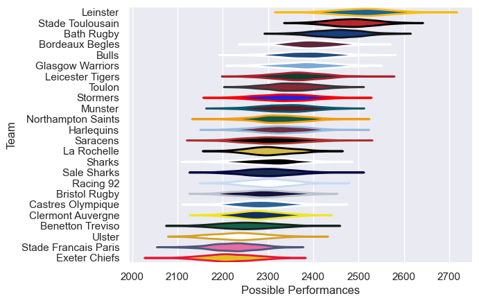

---  
title: "European Rugby Champions Cup 24/25 Status"  
date: 2025-05-15 6:00:00 -0500  
categories: model review projection  
layout: article  
aside:  
    toc: true  
---
# Current Team Rankings

# Standings

## Current Standings

| Club                 |   Played |   Wins |   Point Differential |   Losing Bonus Points |   Try Bonus Points |   Competition Points |
|:---------------------|---------:|-------:|---------------------:|----------------------:|-------------------:|---------------------:|
| Bordeaux Begles      |        4 |      4 |                  141 |                     0 |                  4 |                   20 |
| Stade Toulousain     |        4 |      4 |                  163 |                     0 |                  3 |                   19 |
| Leinster             |        4 |      4 |                   59 |                     0 |                  2 |                   18 |
| Northampton Saints   |        4 |      3 |                   31 |                     0 |                  4 |                   16 |
| Castres Olympique    |        4 |      3 |                   19 |                     0 |                  2 |                   14 |
| Toulon               |        4 |      3 |                   -3 |                     0 |                  1 |                   13 |
| Munster              |        4 |      2 |                   27 |                     2 |                  2 |                   12 |
| Glasgow Warriors     |        4 |      2 |                   11 |                     1 |                  3 |                   12 |
| La Rochelle          |        4 |      2 |                   23 |                     2 |                  1 |                   11 |
| Saracens             |        4 |      2 |                   20 |                     1 |                  2 |                   11 |
| Leicester Tigers     |        4 |      2 |                  -15 |                     0 |                  3 |                   11 |
| Benetton Treviso     |        4 |      2 |                  -26 |                     1 |                  2 |                   11 |
| Clermont Auvergne    |        4 |      2 |                    8 |                     0 |                  2 |                   10 |
| Sale Sharks          |        4 |      2 |                  -11 |                     0 |                  2 |                   10 |
| Harlequins           |        4 |      2 |                   31 |                     0 |                  1 |                    9 |
| Racing 92            |        4 |      2 |                  -12 |                     0 |                  1 |                    9 |
| Bath Rugby           |        4 |      1 |                  -12 |                     2 |                  1 |                    7 |
| Bristol Rugby        |        4 |      1 |                  -52 |                     1 |                  2 |                    7 |
| Stormers             |        4 |      1 |                  -16 |                     0 |                  1 |                    5 |
| Bulls                |        4 |      1 |                  -29 |                     0 |                  1 |                    5 |
| Ulster               |        4 |      1 |                  -61 |                     0 |                  1 |                    5 |
| Stade Francais Paris |        4 |      1 |                  -68 |                     0 |                  1 |                    5 |
| Sharks               |        4 |      1 |                  -87 |                     0 |                  1 |                    5 |
| Exeter Chiefs        |        4 |      0 |                 -141 |                     0 |                  1 |                    1 |

## Projected Playoff Results

|                    | Reach Round of 16   | Win Round of 16   | Reach Quarterfinal   | Win Quarterfinal   | Reach Semifinal   | Win Semifinal   | Reach Final   | Win Final   |
|:-------------------|:--------------------|:------------------|:---------------------|:-------------------|:------------------|:----------------|:--------------|:------------|
| Bordeaux Begles    | 100.0 %             | 100.0 %           | 100.0 %              | 100.0 %            | 100.0 %           | 100.0 %         | 100.0 %       | 76.9 %      |
| Northampton Saints | 100.0 %             | 100.0 %           | 100.0 %              | 100.0 %            | 100.0 %           | 100.0 %         | 100.0 %       | 23.1 %      |
| Leinster           | 100.0 %             | 100.0 %           | 100.0 %              | 100.0 %            | 100.0 %           | 0.0 %           | 0.0 %         | 0.0 %       |
| Stade Toulousain   | 100.0 %             | 100.0 %           | 100.0 %              | 100.0 %            | 100.0 %           | 0.0 %           | 0.0 %         | 0.0 %       |
| Toulon             | 100.0 %             | 100.0 %           | 100.0 %              | 0.0 %              | 0.0 %             | 0.0 %           | 0.0 %         | 0.0 %       |
| Glasgow Warriors   | 100.0 %             | 100.0 %           | 100.0 %              | 0.0 %              | 0.0 %             | 0.0 %           | 0.0 %         | 0.0 %       |
| Castres Olympique  | 100.0 %             | 100.0 %           | 100.0 %              | 0.0 %              | 0.0 %             | 0.0 %           | 0.0 %         | 0.0 %       |
| Munster            | 100.0 %             | 100.0 %           | 100.0 %              | 0.0 %              | 0.0 %             | 0.0 %           | 0.0 %         | 0.0 %       |
| La Rochelle        | 100.0 %             | 0.0 %             | 0.0 %                | 0.0 %              | 0.0 %             | 0.0 %           | 0.0 %         | 0.0 %       |
| Clermont Auvergne  | 100.0 %             | 0.0 %             | 0.0 %                | 0.0 %              | 0.0 %             | 0.0 %           | 0.0 %         | 0.0 %       |
| Saracens           | 100.0 %             | 0.0 %             | 0.0 %                | 0.0 %              | 0.0 %             | 0.0 %           | 0.0 %         | 0.0 %       |
| Harlequins         | 100.0 %             | 0.0 %             | 0.0 %                | 0.0 %              | 0.0 %             | 0.0 %           | 0.0 %         | 0.0 %       |
| Leicester Tigers   | 100.0 %             | 0.0 %             | 0.0 %                | 0.0 %              | 0.0 %             | 0.0 %           | 0.0 %         | 0.0 %       |
| Benetton Treviso   | 100.0 %             | 0.0 %             | 0.0 %                | 0.0 %              | 0.0 %             | 0.0 %           | 0.0 %         | 0.0 %       |
| Sale Sharks        | 100.0 %             | 0.0 %             | 0.0 %                | 0.0 %              | 0.0 %             | 0.0 %           | 0.0 %         | 0.0 %       |
| Ulster             | 100.0 %             | 0.0 %             | 0.0 %                | 0.0 %              | 0.0 %             | 0.0 %           | 0.0 %         | 0.0 %       |

# Completed Match Review

| Model | Percent Correct Predictions | Spread Error |
| ------ | ------ | ------ |
| Club Level | 79.4% | 18.0 |
| Player Level: Lineup | nan% | nan |
| Player Level: Minutes | nan% | nan |

# Future Predictions

## Final

### Bordeaux Begles V Northampton Saints on 2025-05-23

Average Margin: Bordeaux Begles by 4.0

