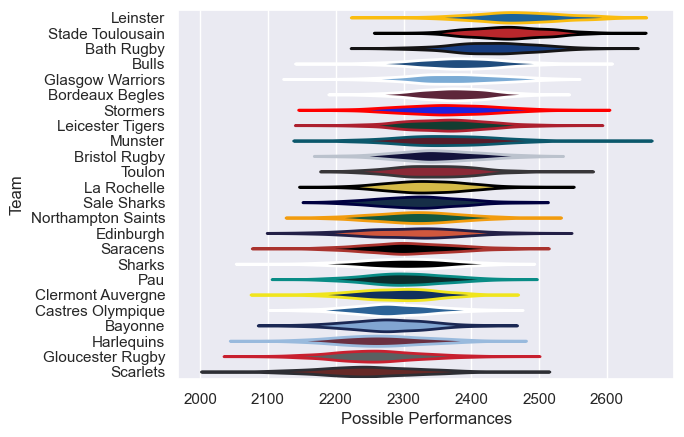

# Team Rankings

# Standings

## Current Standings

### Pool A

| Club              |   Played |   Wins |   Point Differential |   Losing Bonus Points |   Try Bonus Points |   Competition Points |
|:------------------|---------:|-------:|---------------------:|----------------------:|-------------------:|---------------------:|
| Glasgow Warriors  |        4 |      4 |                   49 |                     0 |                  4 |                   20 |
| Stade Toulousain  |        4 |      2 |                   94 |                     2 |                  2 |                   12 |
| Sale Sharks       |        4 |      2 |                  -38 |                     1 |                  2 |                   11 |
| Saracens          |        4 |      2 |                   13 |                     1 |                  1 |                   10 |
| Sharks            |        4 |      2 |                  -10 |                     0 |                  2 |                   10 |
| Clermont Auvergne |        4 |      0 |                 -108 |                     0 |                    |                    0 |

### Pool B

| Club              |   Played |   Wins |   Point Differential |   Losing Bonus Points |   Try Bonus Points |   Competition Points |
|:------------------|---------:|-------:|---------------------:|----------------------:|-------------------:|---------------------:|
| Bath Rugby        |        4 |      3 |                   91 |                     0 |                  4 |                   16 |
| Toulon            |        4 |      3 |                   17 |                     0 |                  2 |                   14 |
| Castres Olympique |        4 |      2 |                   -8 |                     0 |                  2 |                   10 |
| Edinburgh         |        4 |      2 |                  -71 |                     0 |                  1 |                    9 |
| Munster           |        4 |      1 |                   -2 |                     2 |                  2 |                    8 |
| Gloucester Rugby  |        4 |      1 |                  -27 |                     1 |                  1 |                    6 |

### Pool C

| Club             |   Played |   Wins |   Point Differential |   Losing Bonus Points |   Try Bonus Points |   Competition Points |
|:-----------------|---------:|-------:|---------------------:|----------------------:|-------------------:|---------------------:|
| Leinster         |        4 |      4 |                   35 |                     0 |                  2 |                   18 |
| Harlequins       |        4 |      3 |                   98 |                     0 |                  2 |                   14 |
| Stormers         |        4 |      3 |                   -8 |                     0 |                  2 |                   14 |
| Leicester Tigers |        4 |      1 |                    3 |                     0 |                  2 |                    6 |
| La Rochelle      |        4 |      1 |                  -13 |                     1 |                  1 |                    6 |
| Bayonne          |        4 |      0 |                 -115 |                     0 |                    |                    0 |

### Pool D

| Club               |   Played |   Wins |   Point Differential |   Losing Bonus Points |   Try Bonus Points |   Competition Points |
|:-------------------|---------:|-------:|---------------------:|----------------------:|-------------------:|---------------------:|
| Bordeaux Begles    |        4 |      4 |                   76 |                     0 |                  4 |                   20 |
| Northampton Saints |        4 |      3 |                   46 |                     0 |                  4 |                   16 |
| Bristol Rugby      |        4 |      3 |                   50 |                     0 |                  2 |                   14 |
| Bulls              |        4 |      1 |                  -68 |                     0 |                  3 |                    7 |
| Pau                |        4 |      1 |                  -50 |                     1 |                  1 |                    6 |
| Scarlets           |        4 |      0 |                  -54 |                     1 |                  2 |                    3 |

## Projected Remaining Table

### Pool A

| Club   | To Play   | Projected Wins   | Projected Differential   | Projected Losing Bonus Points   | Projected Try Bonus Points   | Projected Competition Points   |
|--------|-----------|------------------|--------------------------|---------------------------------|------------------------------|--------------------------------|

### Pool B

| Club   | To Play   | Projected Wins   | Projected Differential   | Projected Losing Bonus Points   | Projected Try Bonus Points   | Projected Competition Points   |
|--------|-----------|------------------|--------------------------|---------------------------------|------------------------------|--------------------------------|

### Pool C

| Club   | To Play   | Projected Wins   | Projected Differential   | Projected Losing Bonus Points   | Projected Try Bonus Points   | Projected Competition Points   |
|--------|-----------|------------------|--------------------------|---------------------------------|------------------------------|--------------------------------|

### Pool D

| Club   | To Play   | Projected Wins   | Projected Differential   | Projected Losing Bonus Points   | Projected Try Bonus Points   | Projected Competition Points   |
|--------|-----------|------------------|--------------------------|---------------------------------|------------------------------|--------------------------------|

## Projected Total Table

### Pool A

| Club              |   Played |   Wins |   Point Differential |   Losing Bonus Points |   Try Bonus Points |   Competition Points |
|:------------------|---------:|-------:|---------------------:|----------------------:|-------------------:|---------------------:|
| Glasgow Warriors  |        4 |      4 |                   49 |                     0 |                  4 |                   20 |
| Stade Toulousain  |        4 |      2 |                   94 |                     2 |                  2 |                   12 |
| Sale Sharks       |        4 |      2 |                  -38 |                     1 |                  2 |                   11 |
| Saracens          |        4 |      2 |                   13 |                     1 |                  1 |                   10 |
| Sharks            |        4 |      2 |                  -10 |                     0 |                  2 |                   10 |
| Clermont Auvergne |        4 |      0 |                 -108 |                     0 |                    |                    0 |

### Pool B

| Club              |   Played |   Wins |   Point Differential |   Losing Bonus Points |   Try Bonus Points |   Competition Points |
|:------------------|---------:|-------:|---------------------:|----------------------:|-------------------:|---------------------:|
| Bath Rugby        |        4 |      3 |                   91 |                     0 |                  4 |                   16 |
| Toulon            |        4 |      3 |                   17 |                     0 |                  2 |                   14 |
| Castres Olympique |        4 |      2 |                   -8 |                     0 |                  2 |                   10 |
| Edinburgh         |        4 |      2 |                  -71 |                     0 |                  1 |                    9 |
| Munster           |        4 |      1 |                   -2 |                     2 |                  2 |                    8 |
| Gloucester Rugby  |        4 |      1 |                  -27 |                     1 |                  1 |                    6 |

### Pool C

| Club             |   Played |   Wins |   Point Differential |   Losing Bonus Points |   Try Bonus Points |   Competition Points |
|:-----------------|---------:|-------:|---------------------:|----------------------:|-------------------:|---------------------:|
| Leinster         |        4 |      4 |                   35 |                     0 |                  2 |                   18 |
| Harlequins       |        4 |      3 |                   98 |                     0 |                  2 |                   14 |
| Stormers         |        4 |      3 |                   -8 |                     0 |                  2 |                   14 |
| Leicester Tigers |        4 |      1 |                    3 |                     0 |                  2 |                    6 |
| La Rochelle      |        4 |      1 |                  -13 |                     1 |                  1 |                    6 |
| Bayonne          |        4 |      0 |                 -115 |                     0 |                    |                    0 |

### Pool D

| Club               |   Played |   Wins |   Point Differential |   Losing Bonus Points |   Try Bonus Points |   Competition Points |
|:-------------------|---------:|-------:|---------------------:|----------------------:|-------------------:|---------------------:|
| Bordeaux Begles    |        4 |      4 |                   76 |                     0 |                  4 |                   20 |
| Northampton Saints |        4 |      3 |                   46 |                     0 |                  4 |                   16 |
| Bristol Rugby      |        4 |      3 |                   50 |                     0 |                  2 |                   14 |
| Bulls              |        4 |      1 |                  -68 |                     0 |                  3 |                    7 |
| Pau                |        4 |      1 |                  -50 |                     1 |                  1 |                    6 |
| Scarlets           |        4 |      0 |                  -54 |                     1 |                  2 |                    3 |

## Projected Playoff Results

|                    | Reach Round of 16   | Win Round of 16   | Reach Quarterfinal   | Win Quarterfinal   | Reach Semifinal   | Win Semifinal   | Reach Final   | Win Final   |
|:-------------------|:--------------------|:------------------|:---------------------|:-------------------|:------------------|:----------------|:--------------|:------------|
| Bordeaux Begles    | 100.0 %             | 69.4 %            | 69.4 %               | 44.4 %             | 44.4 %            | 28.3 %          | 28.3 %        | 18.4 %      |
| Stade Toulousain   | 100.0 %             | 74.2 %            | 74.2 %               | 32.2 %             | 32.2 %            | 22.3 %          | 22.3 %        | 15.7 %      |
| Glasgow Warriors   | 100.0 %             | 73.8 %            | 73.8 %               | 55.3 %             | 55.3 %            | 37.7 %          | 37.7 %        | 14.8 %      |
| Bath Rugby         | 100.0 %             | 66.0 %            | 66.0 %               | 44.1 %             | 44.1 %            | 16.7 %          | 16.7 %        | 11.9 %      |
| Leinster           | 100.0 %             | 73.1 %            | 73.1 %               | 52.5 %             | 52.5 %            | 21.7 %          | 21.7 %        | 6.9 %       |
| Northampton Saints | 100.0 %             | 72.9 %            | 72.9 %               | 26.0 %             | 26.0 %            | 9.7 %           | 9.7 %         | 6.1 %       |
| Leicester Tigers   | 100.0 %             | 30.6 %            | 30.6 %               | 14.2 %             | 14.2 %            | 8.3 %           | 8.3 %         | 5.0 %       |
| Saracens           | 100.0 %             | 34.0 %            | 34.0 %               | 22.0 %             | 22.0 %            | 7.6 %           | 7.6 %         | 4.6 %       |
| Bristol Rugby      | 100.0 %             | 25.8 %            | 25.8 %               | 9.2 %              | 9.2 %             | 5.0 %           | 5.0 %         | 3.3 %       |
| Bulls              | 100.0 %             | 26.2 %            | 26.2 %               | 16.2 %             | 16.2 %            | 8.9 %           | 8.9 %         | 3.0 %       |
| Stormers           | 100.0 %             | 38.1 %            | 38.1 %               | 11.6 %             | 11.6 %            | 7.4 %           | 7.4 %         | 2.8 %       |
| Toulon             | 100.0 %             | 61.9 %            | 61.9 %               | 16.9 %             | 16.9 %            | 9.5 %           | 9.5 %         | 2.5 %       |
| Castres Olympique  | 100.0 %             | 27.1 %            | 27.1 %               | 7.9 %              | 7.9 %             | 2.1 %           | 2.1 %         | 1.4 %       |
| Sale Sharks        | 100.0 %             | 50.8 %            | 50.8 %               | 17.4 %             | 17.4 %            | 5.7 %           | 5.7 %         | 1.3 %       |
| Edinburgh          | 100.0 %             | 26.9 %            | 26.9 %               | 15.0 %             | 15.0 %            | 4.7 %           | 4.7 %         | 1.2 %       |
| Harlequins         | 100.0 %             | 49.2 %            | 49.2 %               | 15.1 %             | 15.1 %            | 4.4 %           | 4.4 %         | 1.1 %       |

# Completed Match Review

| Model | Percent Correct Predictions | Spread Error |
| ------ | ------ | ------ |
| Club Level | 66.1% | 11.6 |
| Player Level: Lineup | nan% | nan |
| Player Level: Minutes | nan% | nan |

# Future Predictions

## Week 5

### Bath Rugby V Saracens on 2026-04-02

Average Margin: Bath Rugby by 4.0

### Leinster V Edinburgh on 2026-04-02

Average Margin: Leinster by 7.1

### Harlequins V Sale Sharks on 2026-04-02

Average Margin: Harlequins by 0.3

### Stade Toulousain V Bristol Rugby on 2026-04-02

Average Margin: Stade Toulousain by 6.9

### Northampton Saints V Castres Olympique on 2026-04-02

Average Margin: Northampton Saints by 6.1

### Glasgow Warriors V Bulls on 2026-04-02

Average Margin: Glasgow Warriors by 7.1

### Toulon V Stormers on 2026-04-02

Average Margin: Toulon by 3.1

### Bordeaux Begles V Leicester Tigers on 2026-04-02

Average Margin: Bordeaux Begles by 5.2

## Week 6

### Glasgow Warriors V Stormers on 2026-04-09

Average Margin: Glasgow Warriors by 6.4

### Glasgow Warriors V Toulon on 2026-04-09

Average Margin: Glasgow Warriors by 6.9

### Bulls V Toulon on 2026-04-09

Average Margin: Bulls by 4.1

### Bulls V Stormers on 2026-04-09

Average Margin: Bulls by 2.9

### Leicester Tigers V Bristol Rugby on 2026-04-09

Average Margin: Leicester Tigers by 2.4

### Bordeaux Begles V Stade Toulousain on 2026-04-09

Average Margin: Bordeaux Begles by 3.0

### Bordeaux Begles V Bristol Rugby on 2026-04-09

Average Margin: Bordeaux Begles by 4.0

### Leicester Tigers V Stade Toulousain on 2026-04-09

Average Margin: Stade Toulousain by 0.8

### Saracens V Northampton Saints on 2026-04-09

Average Margin: Saracens by 2.9

### Bath Rugby V Castres Olympique on 2026-04-09

Average Margin: Bath Rugby by 6.0

### Bath Rugby V Northampton Saints on 2026-04-09

Average Margin: Bath Rugby by 3.5

### Saracens V Castres Olympique on 2026-04-09

Average Margin: Saracens by 5.6

### Edinburgh V Harlequins on 2026-04-09

Average Margin: Edinburgh by 1.5

### Leinster V Harlequins on 2026-04-09

Average Margin: Leinster by 7.3

### Leinster V Sale Sharks on 2026-04-09

Average Margin: Leinster by 5.7

### Edinburgh V Sale Sharks on 2026-04-09

Average Margin: Edinburgh by 1.5

## Week 7

### Leicester Tigers V Saracens on 2026-04-30

Average Margin: Leicester Tigers by 2.2

### Bulls V Harlequins on 2026-04-30

Average Margin: Bulls by 8.3

### Bulls V Sale Sharks on 2026-04-30

Average Margin: Bulls by 0.1

### Stormers V Leinster on 2026-04-30

Average Margin: Stormers by 0.9

### Toulon V Harlequins on 2026-04-30

Average Margin: Toulon by 4.5

### Glasgow Warriors V Sale Sharks on 2026-04-30

Average Margin: Glasgow Warriors by 4.8

### Bulls V Leinster on 2026-04-30

Average Margin: Bulls by 1.4

### Stormers V Harlequins on 2026-04-30

Average Margin: Stormers by 3.8

### Toulon V Leinster on 2026-04-30

Average Margin: Toulon by 1.0

### Bulls V Edinburgh on 2026-04-30

Average Margin: Bulls by 3.8

### Stormers V Sale Sharks on 2026-04-30

Average Margin: Stormers by 6.8

### Toulon V Sale Sharks on 2026-04-30

Average Margin: Toulon by 5.0

### Glasgow Warriors V Harlequins on 2026-04-30

Average Margin: Glasgow Warriors by 7.8

### Glasgow Warriors V Leinster on 2026-04-30

Average Margin: Glasgow Warriors by 2.8

### Glasgow Warriors V Edinburgh on 2026-04-30

Average Margin: Glasgow Warriors by 7.1

### Stade Toulousain V Castres Olympique on 2026-04-30

Average Margin: Stade Toulousain by 7.4

### Bordeaux Begles V Castres Olympique on 2026-04-30

Average Margin: Bordeaux Begles by 6.1

### Bristol Rugby V Saracens on 2026-04-30

Average Margin: Saracens by 0.3

### Stade Toulousain V Saracens on 2026-04-30

Average Margin: Stade Toulousain by 5.3

### Bristol Rugby V Northampton Saints on 2026-04-30

Average Margin: Bristol Rugby by 0.7

### Leicester Tigers V Bath Rugby on 2026-04-30

Average Margin: Bath Rugby by 0.3

### Leicester Tigers V Northampton Saints on 2026-04-30

Average Margin: Leicester Tigers by 1.5

### Stade Toulousain V Northampton Saints on 2026-04-30

Average Margin: Stade Toulousain by 2.5

### Leicester Tigers V Castres Olympique on 2026-04-30

Average Margin: Leicester Tigers by 5.6

### Bordeaux Begles V Saracens on 2026-04-30

Average Margin: Bordeaux Begles by 4.4

### Bristol Rugby V Bath Rugby on 2026-04-30

Average Margin: Bristol Rugby by 0.4

### Bordeaux Begles V Northampton Saints on 2026-04-30

Average Margin: Bordeaux Begles by 3.6

### Bristol Rugby V Castres Olympique on 2026-04-30

Average Margin: Bristol Rugby by 0.9

### Bordeaux Begles V Bath Rugby on 2026-04-30

Average Margin: Bordeaux Begles by 2.3

### Stade Toulousain V Bath Rugby on 2026-04-30

Average Margin: Stade Toulousain by 5.3

### Toulon V Edinburgh on 2026-04-30

Average Margin: Edinburgh by 0.8

### Stormers V Edinburgh on 2026-04-30

Average Margin: Stormers by 3.7

## Final

### Leicester Tigers V Glasgow Warriors on 2026-05-21

Average Margin: Glasgow Warriors by 0.6

### Castres Olympique V Sale Sharks on 2026-05-21

Average Margin: Castres Olympique by 4.8

### Bristol Rugby V Bulls on 2026-05-21

Average Margin: Bristol Rugby by 7.8

### Bordeaux Begles V Toulon on 2026-05-21

Average Margin: Bordeaux Begles by 8.4

### Stade Toulousain V Sale Sharks on 2026-05-21

Average Margin: Stade Toulousain by 14.4

### Leicester Tigers V Stormers on 2026-05-21

Average Margin: Leicester Tigers by 11.4

### Northampton Saints V Toulon on 2026-05-21

Average Margin: Northampton Saints by 1.4

### Bristol Rugby V Edinburgh on 2026-05-21

Average Margin: Bristol Rugby by 2.0

### Bristol Rugby V Harlequins on 2026-05-21

Average Margin: Harlequins by 3.7

### Saracens V Harlequins on 2026-05-21

Average Margin: Saracens by 3.0

### Bath Rugby V Edinburgh on 2026-05-21

Average Margin: Bath Rugby by 5.8

### Saracens V Leinster on 2026-05-21

Average Margin: Leinster by 1.6

### Bristol Rugby V Toulon on 2026-05-21

Average Margin: Bristol Rugby by 8.8

### Northampton Saints V Bulls on 2026-05-21

Average Margin: Bulls by 0.0

### Castres Olympique V Leinster on 2026-05-21

Average Margin: Castres Olympique by 10.8

### Castres Olympique V Glasgow Warriors on 2026-05-21

Average Margin: Glasgow Warriors by 3.7

### Leicester Tigers V Edinburgh on 2026-05-21

Average Margin: Edinburgh by 0.5

### Leicester Tigers V Bulls on 2026-05-21

Average Margin: Leicester Tigers by 4.8

### Bath Rugby V Sale Sharks on 2026-05-21

Average Margin: Bath Rugby by 6.6

### Stade Toulousain V Edinburgh on 2026-05-21

Average Margin: Stade Toulousain by 9.1

### Saracens V Sale Sharks on 2026-05-21

Average Margin: Saracens by 0.8

### Northampton Saints V Edinburgh on 2026-05-21

Average Margin: Northampton Saints by 8.6

### Castres Olympique V Toulon on 2026-05-21

Average Margin: Castres Olympique by 9.0

### Saracens V Stormers on 2026-05-21

Average Margin: Saracens by 9.7

### Castres Olympique V Edinburgh on 2026-05-21

Average Margin: Castres Olympique by 11.5

### Bristol Rugby V Glasgow Warriors on 2026-05-21

Average Margin: Bristol Rugby by 3.9

### Saracens V Edinburgh on 2026-05-21

Average Margin: Saracens by 8.0

### Bristol Rugby V Stormers on 2026-05-21

Average Margin: Bristol Rugby by 6.5

### Castres Olympique V Harlequins on 2026-05-21

Average Margin: Harlequins by 6.5

### Stade Toulousain V Harlequins on 2026-05-21

Average Margin: Stade Toulousain by 11.7

### Northampton Saints V Leinster on 2026-05-21

Average Margin: Northampton Saints by 2.7

### Stade Toulousain V Leinster on 2026-05-21

Average Margin: Stade Toulousain by 3.4

### Bristol Rugby V Leinster on 2026-05-21

Average Margin: Leinster by 1.8

### Stade Toulousain V Glasgow Warriors on 2026-05-21

Average Margin: Stade Toulousain by 5.0

### Bordeaux Begles V Harlequins on 2026-05-21

Average Margin: Bordeaux Begles by 2.6

### Bristol Rugby V Sale Sharks on 2026-05-21

Average Margin: Bristol Rugby by 6.8

### Bordeaux Begles V Glasgow Warriors on 2026-05-21

Average Margin: Bordeaux Begles by 2.2

### Bordeaux Begles V Stormers on 2026-05-21

Average Margin: Bordeaux Begles by 0.2

### Bath Rugby V Bulls on 2026-05-21

Average Margin: Bath Rugby by 3.1

### Bordeaux Begles V Leinster on 2026-05-21

Average Margin: Bordeaux Begles by 4.3

### Bordeaux Begles V Sale Sharks on 2026-05-21

Average Margin: Bordeaux Begles by 5.6

### Northampton Saints V Harlequins on 2026-05-21

Average Margin: Northampton Saints by 9.5

### Stade Toulousain V Toulon on 2026-05-21

Average Margin: Stade Toulousain by 7.4

### Bath Rugby V Stormers on 2026-05-21

Average Margin: Bath Rugby by 6.2

### Leicester Tigers V Leinster on 2026-05-21

Average Margin: Leicester Tigers by 0.5

### Northampton Saints V Glasgow Warriors on 2026-05-21

Average Margin: Northampton Saints by 2.9

### Bath Rugby V Toulon on 2026-05-21

Average Margin: Bath Rugby by 2.1

### Bath Rugby V Glasgow Warriors on 2026-05-21

Average Margin: Bath Rugby by 3.8

### Stade Toulousain V Bulls on 2026-05-21

Average Margin: Stade Toulousain by 9.3

### Stade Toulousain V Stormers on 2026-05-21

Average Margin: Stade Toulousain by 6.4

### Saracens V Glasgow Warriors on 2026-05-21

Average Margin: Saracens by 0.9

### Northampton Saints V Stormers on 2026-05-21

Average Margin: Northampton Saints by 5.0

### Bordeaux Begles V Bulls on 2026-05-21

Average Margin: Bordeaux Begles by 4.4

### Bath Rugby V Harlequins on 2026-05-21

Average Margin: Bath Rugby by 7.8

### Bordeaux Begles V Edinburgh on 2026-05-21

Average Margin: Bordeaux Begles by 6.6

### Bath Rugby V Leinster on 2026-05-21

Average Margin: Bath Rugby by 7.0

### Leicester Tigers V Toulon on 2026-05-21

Average Margin: Leicester Tigers by 8.0

### Northampton Saints V Sale Sharks on 2026-05-21

Average Margin: Northampton Saints by 6.2

### Leicester Tigers V Harlequins on 2026-05-21

Average Margin: Leicester Tigers by 10.0

### Leicester Tigers V Sale Sharks on 2026-05-21

Average Margin: Sale Sharks by 0.8

### Saracens V Toulon on 2026-05-21

Average Margin: Saracens by 13.6

### Saracens V Bulls on 2026-05-21

Average Margin: Saracens by 3.6

### Castres Olympique V Stormers on 2026-05-21

Average Margin: Castres Olympique by 4.0

### Castres Olympique V Bulls on 2026-05-21

Average Margin: Castres Olympique by 14.0

