# Team Rankings

# Standings

## Current Standings

### Pool A

| Club              |   Played |   Wins |   Point Differential |   Losing Bonus Points |   Try Bonus Points |   Competition Points |
|:------------------|---------:|-------:|---------------------:|----------------------:|-------------------:|---------------------:|
| Glasgow Warriors  |        3 |      3 |                   24 |                     0 |                  3 |                   15 |
| Sale Sharks       |        3 |      2 |                   32 |                     1 |                  2 |                   11 |
| Saracens          |        3 |      2 |                   38 |                     1 |                  1 |                   10 |
| Stade Toulousain  |        3 |      1 |                   24 |                     2 |                  1 |                    7 |
| Sharks            |        3 |      1 |                  -48 |                     0 |                  1 |                    5 |
| Clermont Auvergne |        3 |      0 |                  -70 |                     0 |                    |                    0 |

### Pool B

| Club              |   Played |   Wins |   Point Differential |   Losing Bonus Points |   Try Bonus Points |   Competition Points |
|:------------------|---------:|-------:|---------------------:|----------------------:|-------------------:|---------------------:|
| Bath Rugby        |        3 |      2 |                   38 |                     0 |                  3 |                   11 |
| Toulon            |        3 |      2 |                    0 |                     0 |                  1 |                    9 |
| Edinburgh         |        3 |      2 |                  -18 |                     0 |                  1 |                    9 |
| Munster           |        3 |      1 |                    0 |                     1 |                  1 |                    6 |
| Gloucester Rugby  |        3 |      1 |                  -10 |                     1 |                  1 |                    6 |
| Castres Olympique |        3 |      1 |                  -10 |                     0 |                  1 |                    5 |

### Pool C

| Club             |   Played |   Wins |   Point Differential |   Losing Bonus Points |   Try Bonus Points |   Competition Points |
|:-----------------|---------:|-------:|---------------------:|----------------------:|-------------------:|---------------------:|
| Leinster         |        3 |      3 |                   26 |                     0 |                  2 |                   14 |
| Harlequins       |        3 |      2 |                   88 |                     0 |                  2 |                   10 |
| Stormers         |        3 |      2 |                  -21 |                     0 |                  1 |                    9 |
| La Rochelle      |        3 |      1 |                   -3 |                     1 |                  1 |                    6 |
| Leicester Tigers |        3 |      1 |                   16 |                     0 |                  1 |                    5 |
| Bayonne          |        3 |      0 |                 -106 |                     0 |                    |                    0 |

### Pool D

| Club               |   Played |   Wins |   Point Differential |   Losing Bonus Points |   Try Bonus Points |   Competition Points |
|:-------------------|---------:|-------:|---------------------:|----------------------:|-------------------:|---------------------:|
| Bordeaux Begles    |        3 |      3 |                   64 |                     0 |                  3 |                   15 |
| Bristol Rugby      |        3 |      3 |                   62 |                     0 |                  2 |                   14 |
| Northampton Saints |        3 |      2 |                   31 |                     0 |                  3 |                   11 |
| Pau                |        3 |      1 |                  -48 |                     0 |                  1 |                    5 |
| Scarlets           |        3 |      0 |                  -39 |                     1 |                  1 |                    2 |
| Bulls              |        3 |      0 |                  -70 |                     0 |                  2 |                    2 |

## Projected Remaining Table

### Pool A

| Club              |   To Play |   Projected Wins |   Projected Differential |   Projected Losing Bonus Points | Projected Try Bonus Points   |   Projected Competition Points |
|:------------------|----------:|-----------------:|-------------------------:|--------------------------------:|:-----------------------------|-------------------------------:|
| Stade Toulousain  |         1 |            0.747 |                    7.347 |                           0.118 |                              |                          3.158 |
| Glasgow Warriors  |         1 |            0.711 |                    5.246 |                           0.144 |                              |                          3.084 |
| Sharks            |         1 |            0.596 |                    2.046 |                           0.209 |                              |                          2.719 |
| Clermont Auvergne |         1 |            0.341 |                   -2.046 |                           0.346 |                              |                          1.836 |
| Saracens          |         1 |            0.241 |                   -5.246 |                           0.282 |                              |                          1.342 |
| Sale Sharks       |         1 |            0.227 |                   -7.347 |                           0.194 |                              |                          1.154 |

### Pool B

| Club              |   To Play |   Projected Wins |   Projected Differential |   Projected Losing Bonus Points | Projected Try Bonus Points   |   Projected Competition Points |
|:------------------|----------:|-----------------:|-------------------------:|--------------------------------:|:-----------------------------|-------------------------------:|
| Bath Rugby        |         1 |            0.754 |                    7.28  |                           0.105 |                              |                          3.195 |
| Munster           |         1 |            0.681 |                    4.223 |                           0.139 |                              |                          2.969 |
| Gloucester Rugby  |         1 |            0.506 |                    1.038 |                           0.292 |                              |                          2.462 |
| Toulon            |         1 |            0.421 |                   -1.038 |                           0.317 |                              |                          2.147 |
| Castres Olympique |         1 |            0.266 |                   -4.223 |                           0.289 |                              |                          1.459 |
| Edinburgh         |         1 |            0.209 |                   -7.28  |                           0.187 |                              |                          1.097 |

### Pool C

| Club             |   To Play |   Projected Wins |   Projected Differential |   Projected Losing Bonus Points | Projected Try Bonus Points   |   Projected Competition Points |
|:-----------------|----------:|-----------------:|-------------------------:|--------------------------------:|:-----------------------------|-------------------------------:|
| La Rochelle      |         1 |            0.742 |                    6.791 |                           0.115 |                              |                          3.153 |
| Stormers         |         1 |            0.706 |                    4.398 |                           0.153 |                              |                          3.053 |
| Leinster         |         1 |            0.608 |                    1.921 |                           0.193 |                              |                          2.739 |
| Bayonne          |         1 |            0.335 |                   -1.921 |                           0.362 |                              |                          1.816 |
| Leicester Tigers |         1 |            0.256 |                   -4.398 |                           0.321 |                              |                          1.421 |
| Harlequins       |         1 |            0.223 |                   -6.791 |                           0.211 |                              |                          1.173 |

### Pool D

| Club               |   To Play |   Projected Wins |   Projected Differential |   Projected Losing Bonus Points | Projected Try Bonus Points   |   Projected Competition Points |
|:-------------------|----------:|-----------------:|-------------------------:|--------------------------------:|:-----------------------------|-------------------------------:|
| Northampton Saints |         1 |            0.757 |                    7.341 |                           0.113 |                              |                          3.203 |
| Pau                |         1 |            0.71  |                    4.371 |                           0.137 |                              |                          3.077 |
| Bristol Rugby      |         1 |            0.587 |                    1.849 |                           0.256 |                              |                          2.698 |
| Bordeaux Begles    |         1 |            0.366 |                   -1.849 |                           0.37  |                              |                          1.928 |
| Bulls              |         1 |            0.24  |                   -4.371 |                           0.332 |                              |                          1.392 |
| Scarlets           |         1 |            0.212 |                   -7.341 |                           0.195 |                              |                          1.105 |

## Projected Total Table

### Pool A

| Club              |   Played |   Wins |   Point Differential |   Losing Bonus Points |   Try Bonus Points |   Competition Points |
|:------------------|---------:|-------:|---------------------:|----------------------:|-------------------:|---------------------:|
| Glasgow Warriors  |        4 |  3.711 |               29.246 |                 0.144 |                  3 |               18.084 |
| Sale Sharks       |        4 |  2.227 |               24.653 |                 1.194 |                  2 |               12.154 |
| Saracens          |        4 |  2.241 |               32.754 |                 1.282 |                  1 |               11.342 |
| Stade Toulousain  |        4 |  1.747 |               31.347 |                 2.118 |                  1 |               10.158 |
| Sharks            |        4 |  1.596 |              -45.954 |                 0.209 |                  1 |                7.719 |
| Clermont Auvergne |        4 |  0.341 |              -72.046 |                 0.346 |                    |                1.836 |

### Pool B

| Club              |   Played |   Wins |   Point Differential |   Losing Bonus Points |   Try Bonus Points |   Competition Points |
|:------------------|---------:|-------:|---------------------:|----------------------:|-------------------:|---------------------:|
| Bath Rugby        |        4 |  2.754 |               45.28  |                 0.105 |                  3 |               14.195 |
| Toulon            |        4 |  2.421 |               -1.038 |                 0.317 |                  1 |               11.147 |
| Edinburgh         |        4 |  2.209 |              -25.28  |                 0.187 |                  1 |               10.097 |
| Munster           |        4 |  1.681 |                4.223 |                 1.139 |                  1 |                8.969 |
| Gloucester Rugby  |        4 |  1.506 |               -8.962 |                 1.292 |                  1 |                8.462 |
| Castres Olympique |        4 |  1.266 |              -14.223 |                 0.289 |                  1 |                6.459 |

### Pool C

| Club             |   Played |   Wins |   Point Differential |   Losing Bonus Points |   Try Bonus Points |   Competition Points |
|:-----------------|---------:|-------:|---------------------:|----------------------:|-------------------:|---------------------:|
| Leinster         |        4 |  3.608 |               27.921 |                 0.193 |                  2 |               16.739 |
| Stormers         |        4 |  2.706 |              -16.602 |                 0.153 |                  1 |               12.053 |
| Harlequins       |        4 |  2.223 |               81.209 |                 0.211 |                  2 |               11.173 |
| La Rochelle      |        4 |  1.742 |                3.791 |                 1.115 |                  1 |                9.153 |
| Leicester Tigers |        4 |  1.256 |               11.602 |                 0.321 |                  1 |                6.421 |
| Bayonne          |        4 |  0.335 |             -107.921 |                 0.362 |                    |                1.816 |

### Pool D

| Club               |   Played |   Wins |   Point Differential |   Losing Bonus Points |   Try Bonus Points |   Competition Points |
|:-------------------|---------:|-------:|---------------------:|----------------------:|-------------------:|---------------------:|
| Bordeaux Begles    |        4 |  3.366 |               62.151 |                 0.37  |                  3 |               16.928 |
| Bristol Rugby      |        4 |  3.587 |               63.849 |                 0.256 |                  2 |               16.698 |
| Northampton Saints |        4 |  2.757 |               38.341 |                 0.113 |                  3 |               14.203 |
| Pau                |        4 |  1.71  |              -43.629 |                 0.137 |                  1 |                8.077 |
| Bulls              |        4 |  0.24  |              -74.371 |                 0.332 |                  2 |                3.392 |
| Scarlets           |        4 |  0.212 |              -46.341 |                 1.195 |                  1 |                3.105 |

## Projected Playoff Results

|                    | Reach Round of 16   | Win Round of 16   | Reach Quarterfinal   | Win Quarterfinal   | Reach Semifinal   | Win Semifinal   | Reach Final   | Win Final   |
|:-------------------|:--------------------|:------------------|:---------------------|:-------------------|:------------------|:----------------|:--------------|:------------|
| Glasgow Warriors   | 100.0 %             | 71.4 %            | 71.4 %               | 46.7 %             | 46.7 %            | 28.8 %          | 28.8 %        | 15.5 %      |
| Bath Rugby         | 100.0 %             | 67.6 %            | 67.6 %               | 47.0 %             | 47.0 %            | 23.2 %          | 23.2 %        | 14.2 %      |
| Leinster           | 100.0 %             | 73.5 %            | 73.5 %               | 49.9 %             | 49.9 %            | 25.5 %          | 25.5 %        | 13.2 %      |
| Bordeaux Begles    | 100.0 %             | 73.0 %            | 73.0 %               | 36.0 %             | 36.0 %            | 18.2 %          | 18.2 %        | 10.9 %      |
| Stade Toulousain   | 86.4 %              | 51.7 %            | 51.7 %               | 25.7 %             | 25.7 %            | 16.9 %          | 16.9 %        | 10.3 %      |
| Bristol Rugby      | 100.0 %             | 67.0 %            | 67.0 %               | 33.5 %             | 33.5 %            | 17.8 %          | 17.8 %        | 5.9 %       |
| Northampton Saints | 100.0 %             | 41.7 %            | 41.7 %               | 12.7 %             | 12.7 %            | 6.5 %           | 6.5 %         | 4.1 %       |
| Pau                | 86.7 %              | 22.4 %            | 22.4 %               | 14.8 %             | 14.8 %            | 7.7 %           | 7.7 %         | 4.0 %       |
| Stormers           | 92.8 %              | 50.6 %            | 50.6 %               | 19.1 %             | 19.1 %            | 10.0 %          | 10.0 %        | 3.8 %       |
| Sale Sharks        | 100.0 %             | 44.6 %            | 44.6 %               | 18.7 %             | 18.7 %            | 7.3 %           | 7.3 %         | 3.7 %       |
| Toulon             | 89.9 %              | 46.1 %            | 46.1 %               | 19.2 %             | 19.2 %            | 8.1 %           | 8.1 %         | 3.2 %       |
| La Rochelle        | 87.3 %              | 26.2 %            | 26.2 %               | 15.8 %             | 15.8 %            | 6.4 %           | 6.4 %         | 2.4 %       |
| Saracens           | 100.0 %             | 39.7 %            | 39.7 %               | 16.7 %             | 16.7 %            | 6.0 %           | 6.0 %         | 2.3 %       |
| Munster            | 70.0 %              | 28.3 %            | 28.3 %               | 9.3 %              | 9.3 %             | 4.5 %           | 4.5 %         | 2.3 %       |
| Edinburgh          | 69.9 %              | 25.8 %            | 25.8 %               | 11.4 %             | 11.4 %            | 3.7 %           | 3.7 %         | 1.2 %       |
| Harlequins         | 100.0 %             | 36.8 %            | 36.8 %               | 10.4 %             | 10.4 %            | 4.1 %           | 4.1 %         | 1.1 %       |
| Gloucester Rugby   | 47.0 %              | 15.5 %            | 15.5 %               | 4.6 %              | 4.6 %             | 2.1 %           | 2.1 %         | 0.8 %       |
| Leicester Tigers   | 19.9 %              | 5.8 %             | 5.8 %                | 2.7 %              | 2.7 %             | 1.0 %           | 1.0 %         | 0.6 %       |
| Bulls              | 7.7 %               | 1.7 %             | 1.7 %                | 1.1 %              | 1.1 %             | 0.7 %           | 0.7 %         | 0.3 %       |
| Sharks             | 13.6 %              | 3.8 %             | 3.8 %                | 1.5 %              | 1.5 %             | 0.5 %           | 0.5 %         | 0.2 %       |
| Castres Olympique  | 23.2 %              | 5.9 %             | 5.9 %                | 2.6 %              | 2.6 %             | 0.8 %           | 0.8 %         | 0.0 %       |
| Scarlets           | 5.6 %               | 0.9 %             | 0.9 %                | 0.6 %              | 0.6 %             | 0.2 %           | 0.2 %         | 0.0 %       |

# Completed Match Review

| Model | Percent Correct Predictions | Spread Error |
| ------ | ------ | ------ |
| Club Level | 63.6% | 7.9 |
| Player Level: Lineup | nan% | nan |
| Player Level: Minutes | nan% | nan |

# Future Predictions

## Week 4

### Pau V Bulls on 2026/01/16

Average Margin: Pau by 4.4

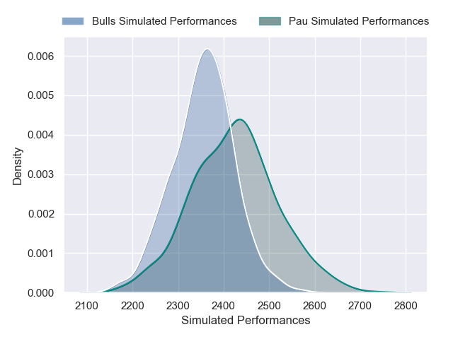

### Bath Rugby V Edinburgh on 2026/01/16

Average Margin: Bath Rugby by 7.3

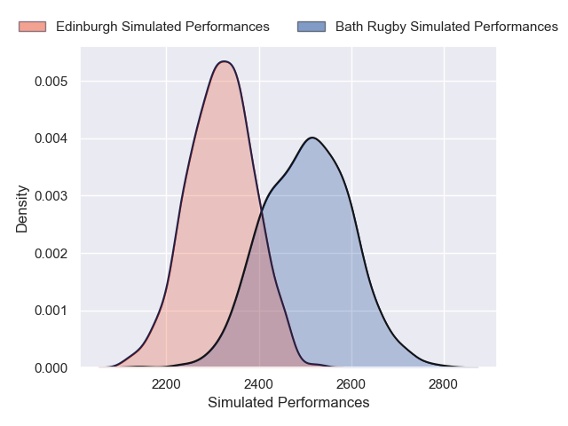

### Sharks V Clermont Auvergne on 2026/01/17

Average Margin: Sharks by 2.0

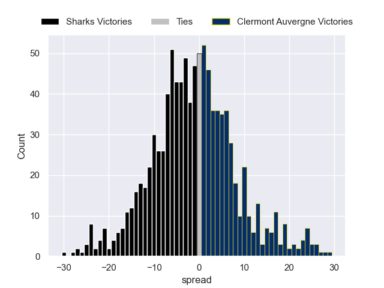

### Bayonne V Leinster on 2026/01/17

Average Margin: Leinster by 1.9

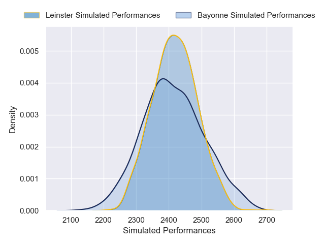

### Stormers V Leicester Tigers on 2026/01/17

Average Margin: Stormers by 4.4

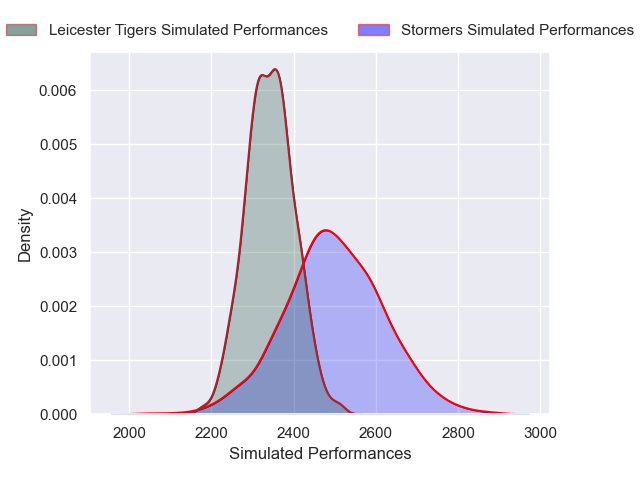
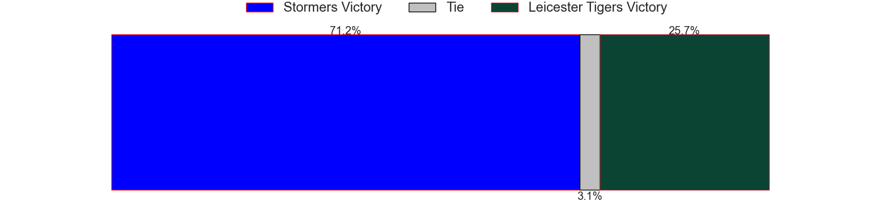
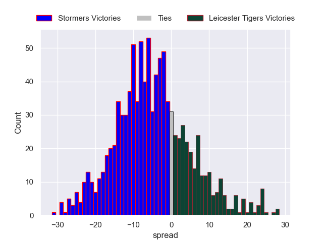

### Stade Toulousain V Sale Sharks on 2026/01/17

Average Margin: Stade Toulousain by 7.3

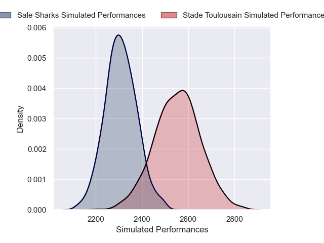

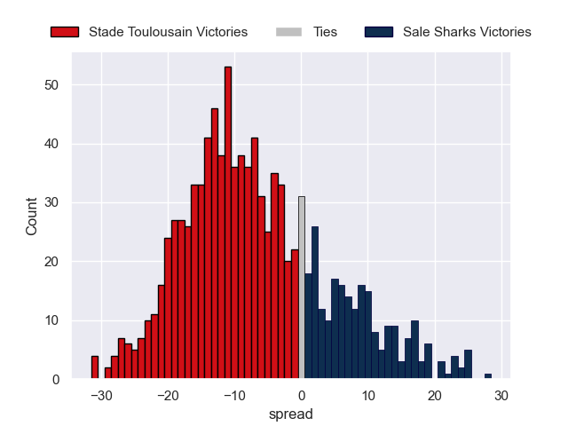

### Munster V Castres Olympique on 2026/01/17

Average Margin: Munster by 4.2

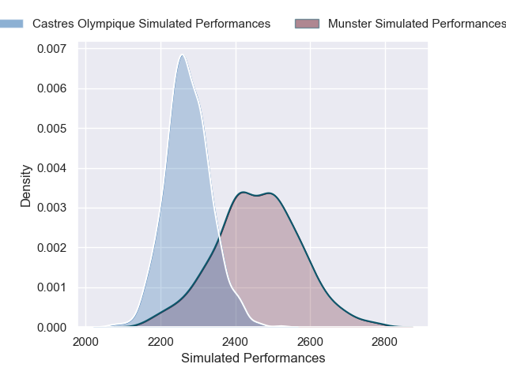

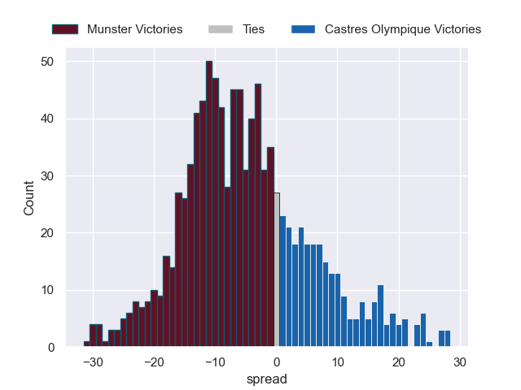

### Gloucester Rugby V Toulon on 2026/01/17

Average Margin: Gloucester Rugby by 1.0

### Bristol Rugby V Bordeaux Begles on 2026/01/18

Average Margin: Bristol Rugby by 1.8

### La Rochelle V Harlequins on 2026/01/18

Average Margin: La Rochelle by 6.8

### Northampton Saints V Scarlets on 2026/01/18

Average Margin: Northampton Saints by 7.3

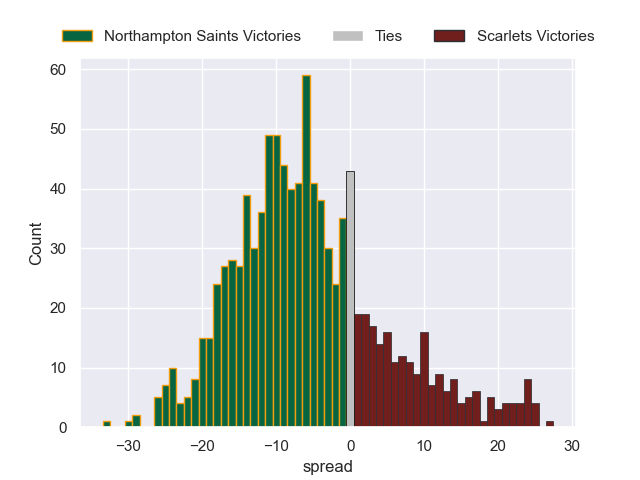

### Glasgow Warriors V Saracens on 2026/01/18

Average Margin: Glasgow Warriors by 5.2

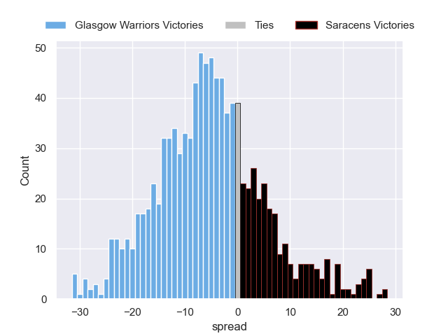

## Week 5

### Bristol Rugby V Pau on 2026-04-02

Average Margin: Bristol Rugby by 4.4

### Sale Sharks V Toulon on 2026-04-02

Average Margin: Sale Sharks by 8.0

### Bath Rugby V Munster on 2026-04-02

Average Margin: Bath Rugby by 1.0

### Sale Sharks V La Rochelle on 2026-04-02

Average Margin: Sale Sharks by 3.0

### Edinburgh V Toulon on 2026-04-02

Average Margin: Toulon by 4.0

### Leinster V Sale Sharks on 2026-04-02

Average Margin: Leinster by 3.6

### Edinburgh V Sale Sharks on 2026-04-02

Average Margin: Edinburgh by 0.7

### Edinburgh V La Rochelle on 2026-04-02

Average Margin: Edinburgh by 0.2

### Edinburgh V Gloucester Rugby on 2026-04-02

Average Margin: Edinburgh by 6.2

### Harlequins V Sale Sharks on 2026-04-02

Average Margin: Sale Sharks by 4.4

### Sale Sharks V Castres Olympique on 2026-04-02

Average Margin: Castres Olympique by 2.0

### Glasgow Warriors V Sale Sharks on 2026-04-02

Average Margin: Glasgow Warriors by 5.2

### Edinburgh V Munster on 2026-04-02

Average Margin: Munster by 1.7

### Toulon V Munster on 2026-04-02

Average Margin: Toulon by 2.5

### Toulon V Stade Toulousain on 2026-04-02

Average Margin: Toulon by 4.9

### Toulon V La Rochelle on 2026-04-02

Average Margin: Toulon by 1.3

### Edinburgh V Castres Olympique on 2026-04-02

Average Margin: Edinburgh by 9.0

### Toulon V Leicester Tigers on 2026-04-02

Average Margin: Toulon by 10.0

### Sale Sharks V Leicester Tigers on 2026-04-02

Average Margin: Sale Sharks by 5.0

### Harlequins V Toulon on 2026-04-02

Average Margin: Harlequins by 4.0

### Harlequins V Stormers on 2026-04-02

Average Margin: Stormers by 0.0

### Harlequins V Edinburgh on 2026-04-02

Average Margin: Harlequins by 2.2

### Harlequins V Pau on 2026-04-02

Average Margin: Harlequins by 4.0

### Harlequins V Gloucester Rugby on 2026-04-02

Average Margin: Harlequins by 1.0

### Harlequins V Castres Olympique on 2026-04-02

Average Margin: Harlequins by 1.0

### Gloucester Rugby V Bordeaux Begles on 2026-04-02

Average Margin: Gloucester Rugby by 2.8

### Stormers V Harlequins on 2026-04-02

Average Margin: Harlequins by 4.0

### Edinburgh V Saracens on 2026-04-02

Average Margin: Saracens by 2.5

### Munster V Sale Sharks on 2026-04-02

Average Margin: Sale Sharks by 5.0

### Stade Toulousain V Bath Rugby on 2026-04-02

Average Margin: Stade Toulousain by 7.8

### Sale Sharks V Harlequins on 2026-04-02

Average Margin: Sale Sharks by 9.0

### Munster V Stade Toulousain on 2026-04-02

Average Margin: Stade Toulousain by 7.2

### Sale Sharks V Saracens on 2026-04-02

Average Margin: Sale Sharks by 8.0

### Bath Rugby V Bordeaux Begles on 2026-04-02

Average Margin: Bordeaux Begles by 19.0

### Gloucester Rugby V Stade Toulousain on 2026-04-02

Average Margin: Stade Toulousain by 8.0

### Leinster V Saracens on 2026-04-02

Average Margin: Saracens by 2.1

### Bath Rugby V Leicester Tigers on 2026-04-02

Average Margin: Bath Rugby by 4.0

### Harlequins V Munster on 2026-04-02

Average Margin: Munster by 2.0

### Bordeaux Begles V La Rochelle on 2026-04-02

Average Margin: Bordeaux Begles by 3.8

### Sale Sharks V Pau on 2026-04-02

Average Margin: Pau by 2.5

### Sale Sharks V Stormers on 2026-04-02

Average Margin: Stormers by 3.0

### Harlequins V Leicester Tigers on 2026-04-02

Average Margin: Leicester Tigers by 0.0

### Bath Rugby V Sharks on 2026-04-02

Average Margin: Bath Rugby by 6.0

### Sale Sharks V Edinburgh on 2026-04-02

Average Margin: Sale Sharks by 6.0

### Bordeaux Begles V Castres Olympique on 2026-04-02

Average Margin: Bordeaux Begles by 11.0

### Bordeaux Begles V Stormers on 2026-04-02

Average Margin: Stormers by 0.0

### Northampton Saints V Munster on 2026-04-02

Average Margin: Northampton Saints by 0.1

### Toulon V Bristol Rugby on 2026-04-02

Average Margin: Toulon by 2.6

### Sale Sharks V Gloucester Rugby on 2026-04-02

Average Margin: Sale Sharks by 8.7

### Northampton Saints V Gloucester Rugby on 2026-04-02

Average Margin: Northampton Saints by 1.5

### Saracens V Stade Toulousain on 2026-04-02

Average Margin: Saracens by 0.6

### Toulon V Edinburgh on 2026-04-02

Average Margin: Toulon by 8.0

### Edinburgh V Harlequins on 2026-04-02

Average Margin: Edinburgh by 2.0

### Harlequins V La Rochelle on 2026-04-02

Average Margin: La Rochelle by 4.0

### Stormers V Toulon on 2026-04-02

Average Margin: Toulon by 8.0

### Glasgow Warriors V Northampton Saints on 2026-04-02

Average Margin: Glasgow Warriors by 24.0

### Saracens V Toulon on 2026-04-02

Average Margin: Toulon by 0.7

### Saracens V Munster on 2026-04-02

Average Margin: Saracens by 4.7

### Glasgow Warriors V Harlequins on 2026-04-02

Average Margin: Glasgow Warriors by 10.0

### Stormers V Stade Toulousain on 2026-04-02

Average Margin: Stormers by 6.1

### Saracens V Leicester Tigers on 2026-04-02

Average Margin: Leicester Tigers by 11.0

### Leinster V Northampton Saints on 2026-04-02

Average Margin: Leinster by 29.0

### Stade Toulousain V Gloucester Rugby on 2026-04-02

Average Margin: Stade Toulousain by 13.0

### Stormers V Edinburgh on 2026-04-02

Average Margin: Stormers by 1.0

### Stade Toulousain V Munster on 2026-04-02

Average Margin: Munster by 7.0

### Bordeaux Begles V Scarlets on 2026-04-02

Average Margin: Bordeaux Begles by 11.5

### Bordeaux Begles V Bulls on 2026-04-02

Average Margin: Bordeaux Begles by 7.1

### Glasgow Warriors V Bulls on 2026-04-02

Average Margin: Glasgow Warriors by 7.1

### Glasgow Warriors V Scarlets on 2026-04-02

Average Margin: Glasgow Warriors by 9.6

### Bristol Rugby V Scarlets on 2026-04-02

Average Margin: Bristol Rugby by 5.1

### Sale Sharks V Bath Rugby on 2026-04-02

Average Margin: Sale Sharks by 2.0

### Stade Toulousain V La Rochelle on 2026-04-02

Average Margin: Stade Toulousain by 7.8

### Saracens V Bath Rugby on 2026-04-02

Average Margin: Saracens by 1.0

### Bristol Rugby V Northampton Saints on 2026-04-02

Average Margin: Bristol Rugby by 9.0

### Bordeaux Begles V Harlequins on 2026-04-02

Average Margin: Bordeaux Begles by 2.3

### Sale Sharks V Munster on 2026-04-02

Average Margin: Sale Sharks by 4.5

### Northampton Saints V Toulon on 2026-04-02

Average Margin: Northampton Saints by 2.8

### Bordeaux Begles V Bath Rugby on 2026-04-02

Average Margin: Bordeaux Begles by 6.0

### Bristol Rugby V Harlequins on 2026-04-02

Average Margin: Bristol Rugby by 10.8

### Bordeaux Begles V Saracens on 2026-04-02

Average Margin: Bordeaux Begles by 6.1

### Northampton Saints V Stormers on 2026-04-02

Average Margin: Northampton Saints by 0.9

### Northampton Saints V Sale Sharks on 2026-04-02

Average Margin: Sale Sharks by 5.0

### Northampton Saints V Harlequins on 2026-04-02

Average Margin: Northampton Saints by 1.3

### Bristol Rugby V Bath Rugby on 2026-04-02

Average Margin: Bristol Rugby by 4.0

### Saracens V Gloucester Rugby on 2026-04-02

Average Margin: Saracens by 12.0

### Bristol Rugby V Saracens on 2026-04-02

Average Margin: Bristol Rugby by 1.2

### Bristol Rugby V Sale Sharks on 2026-04-02

Average Margin: Bristol Rugby by 6.0

### Bordeaux Begles V Sale Sharks on 2026-04-02

Average Margin: Bordeaux Begles by 10.0

### Saracens V Edinburgh on 2026-04-02

Average Margin: Edinburgh by 1.0

### Northampton Saints V Edinburgh on 2026-04-02

Average Margin: Edinburgh by 0.0

### Northampton Saints V Leicester Tigers on 2026-04-02

Average Margin: Northampton Saints by 1.0

### Northampton Saints V Saracens on 2026-04-02

Average Margin: Northampton Saints by 7.0

### Bordeaux Begles V Northampton Saints on 2026-04-02

Average Margin: Bordeaux Begles by 12.0

### Saracens V La Rochelle on 2026-04-02

Average Margin: Saracens by 10.0

### Northampton Saints V La Rochelle on 2026-04-02

Average Margin: Northampton Saints by 5.0

### Northampton Saints V Castres Olympique on 2026-04-02

Average Margin: Northampton Saints by 6.9

### Bristol Rugby V Bulls on 2026-04-02

Average Margin: Bristol Rugby by 8.0

### Edinburgh V Stormers on 2026-04-02

Average Margin: Edinburgh by 11.0

### Harlequins V Bristol Rugby on 2026-04-02

Average Margin: Harlequins by 1.5

### Leinster V La Rochelle on 2026-04-02

Average Margin: Leinster by 4.8

### Leinster V Gloucester Rugby on 2026-04-02

Average Margin: Leinster by 7.1

### Leinster V Leicester Tigers on 2026-04-02

Average Margin: Leinster by 6.7

### Leinster V Stade Toulousain on 2026-04-02

Average Margin: Leinster by 3.7

### Bristol Rugby V La Rochelle on 2026-04-02

Average Margin: Bristol Rugby by 2.2

### Bath Rugby V Edinburgh on 2026-04-02

Average Margin: Bath Rugby by 6.0

### Leinster V Munster on 2026-04-02

Average Margin: Leinster by 8.3

### Bath Rugby V Pau on 2026-04-02

Average Margin: Bath Rugby by 9.2

### Bath Rugby V La Rochelle on 2026-04-02

Average Margin: Bath Rugby by 6.0

### Leinster V Toulon on 2026-04-02

Average Margin: Leinster by 3.5

### Bath Rugby V Castres Olympique on 2026-04-02

Average Margin: Castres Olympique by 8.5

### Bordeaux Begles V Stade Toulousain on 2026-04-02

Average Margin: Bordeaux Begles by 6.0

### Leinster V Stormers on 2026-04-02

Average Margin: Leinster by 15.8

### Bath Rugby V Toulon on 2026-04-02

Average Margin: Bath Rugby by 12.5

### Leinster V Sharks on 2026-04-02

Average Margin: Leinster by 2.9

### Bath Rugby V Stormers on 2026-04-02

Average Margin: Bath Rugby by 14.5

### Bordeaux Begles V Munster on 2026-04-02

Average Margin: Bordeaux Begles by 9.5

### Glasgow Warriors V Munster on 2026-04-02

Average Margin: Glasgow Warriors by 3.6

### Bordeaux Begles V Gloucester Rugby on 2026-04-02

Average Margin: Bordeaux Begles by 4.0

### Bath Rugby V Stade Toulousain on 2026-04-02

Average Margin: Bath Rugby by 7.0

### Bordeaux Begles V Sharks on 2026-04-02

Average Margin: Bordeaux Begles by 5.0

### Bristol Rugby V Toulon on 2026-04-02

Average Margin: Bristol Rugby by 3.1

### Bristol Rugby V Munster on 2026-04-02

Average Margin: Bristol Rugby by 5.6

### Glasgow Warriors V Gloucester Rugby on 2026-04-02

Average Margin: Glasgow Warriors by 9.2

### Bristol Rugby V Leicester Tigers on 2026-04-02

Average Margin: Bristol Rugby by 3.7

### Glasgow Warriors V Pau on 2026-04-02

Average Margin: Glasgow Warriors by 5.6

### Bristol Rugby V Edinburgh on 2026-04-02

Average Margin: Bristol Rugby by 3.7

### Bristol Rugby V Stade Toulousain on 2026-04-02

Average Margin: Stade Toulousain by 0.6

### Bordeaux Begles V Edinburgh on 2026-04-02

Average Margin: Bordeaux Begles by 17.2

### Glasgow Warriors V Edinburgh on 2026-04-02

Average Margin: Glasgow Warriors by 6.2

### Leinster V Pau on 2026-04-02

Average Margin: Leinster by 6.5

### Bristol Rugby V Sharks on 2026-04-02

Average Margin: Bristol Rugby by 6.1

### Leinster V Castres Olympique on 2026-04-02

Average Margin: Leinster by 8.9

### Glasgow Warriors V La Rochelle on 2026-04-02

Average Margin: Glasgow Warriors by 3.5

### Glasgow Warriors V Toulon on 2026-04-02

Average Margin: Glasgow Warriors by 5.7

### Bordeaux Begles V Pau on 2026-04-02

Average Margin: Bordeaux Begles by 14.0

### Bristol Rugby V Castres Olympique on 2026-04-02

Average Margin: Bristol Rugby by 5.9

### Leinster V Edinburgh on 2026-04-02

Average Margin: Leinster by 7.0

### Glasgow Warriors V Stade Toulousain on 2026-04-02

Average Margin: Stade Toulousain by 3.1

### Glasgow Warriors V Stormers on 2026-04-02

Average Margin: Glasgow Warriors by 4.5

### Bristol Rugby V Stormers on 2026-04-02

Average Margin: Bristol Rugby by 4.0

### Bristol Rugby V Gloucester Rugby on 2026-04-02

Average Margin: Bristol Rugby by 6.4

### Glasgow Warriors V Sharks on 2026-04-02

Average Margin: Glasgow Warriors by 2.4

### Glasgow Warriors V Castres Olympique on 2026-04-02

Average Margin: Glasgow Warriors by 6.5

### Glasgow Warriors V Leicester Tigers on 2026-04-02

Average Margin: Glasgow Warriors by 4.2

### Bordeaux Begles V Toulon on 2026-04-02

Average Margin: Toulon by 8.0

### Harlequins V Bordeaux Begles on 2026-04-02

Average Margin: Bordeaux Begles by 3.0

### Bath Rugby V Gloucester Rugby on 2026-04-02

Average Margin: Bath Rugby by 16.0

### Bordeaux Begles V Leicester Tigers on 2026-04-02

Average Margin: Leicester Tigers by 4.0

### Stade Toulousain V Bordeaux Begles on 2026-04-02

Average Margin: Stade Toulousain by 10.5

### Gloucester Rugby V Sale Sharks on 2026-04-02

Average Margin: Sale Sharks by 2.5

### Edinburgh V Bordeaux Begles on 2026-04-02

Average Margin: Bordeaux Begles by 2.0

### Gloucester Rugby V Stormers on 2026-04-02

Average Margin: Gloucester Rugby by 5.5

### Bath Rugby V Saracens on 2026-04-02

Average Margin: Saracens by 1.3

### Stormers V Bordeaux Begles on 2026-04-02

Average Margin: Stormers by 8.2

### Stormers V Sale Sharks on 2026-04-02

Average Margin: Stormers by 11.0

### Edinburgh V Bristol Rugby on 2026-04-02

Average Margin: Bristol Rugby by 3.6

### Harlequins V Bath Rugby on 2026-04-02

Average Margin: Bath Rugby by 7.2

### Stade Toulousain V Bristol Rugby on 2026-04-02

Average Margin: Stade Toulousain by 6.5

### Munster V Bordeaux Begles on 2026-04-02

Average Margin: Munster by 2.7

### Stade Toulousain V Sale Sharks on 2026-04-02

Average Margin: Stade Toulousain by 12.2

### Edinburgh V Stade Toulousain on 2026-04-02

Average Margin: Edinburgh by 3.0

### Stade Toulousain V Saracens on 2026-04-02

Average Margin: Stade Toulousain by 1.8

### Toulon V Bordeaux Begles on 2026-04-02

Average Margin: Toulon by 4.2

### Munster V Saracens on 2026-04-02

Average Margin: Munster by 1.4

### Toulon V Saracens on 2026-04-02

Average Margin: Toulon by 9.8

### Harlequins V Stade Toulousain on 2026-04-02

Average Margin: Stade Toulousain by 3.7

### Sale Sharks V Bordeaux Begles on 2026-04-02

Average Margin: Sale Sharks by 7.0

### Stormers V Saracens on 2026-04-02

Average Margin: Stormers by 9.5

### Sale Sharks V Bristol Rugby on 2026-04-02

Average Margin: Sale Sharks by 10.0

### Saracens V Northampton Saints on 2026-04-02

Average Margin: Saracens by 2.4

### Stormers V Bath Rugby on 2026-04-02

Average Margin: Stormers by 7.7

### Edinburgh V Bath Rugby on 2026-04-02

Average Margin: Bath Rugby by 12.0

### Bath Rugby V Northampton Saints on 2026-04-02

Average Margin: Bath Rugby by 1.8

### Munster V Stormers on 2026-04-02

Average Margin: Munster by 6.0

### Stade Toulousain V Northampton Saints on 2026-04-02

Average Margin: Stade Toulousain by 6.6

### Toulon V Northampton Saints on 2026-04-02

Average Margin: Toulon by 4.2

### Munster V Harlequins on 2026-04-02

Average Margin: Munster by 8.8

### Stormers V Northampton Saints on 2026-04-02

Average Margin: Stormers by 3.4

### Sale Sharks V Northampton Saints on 2026-04-02

Average Margin: Sale Sharks by 0.7

### Edinburgh V Northampton Saints on 2026-04-02

Average Margin: Edinburgh by 3.0

### Gloucester Rugby V Northampton Saints on 2026-04-02

Average Margin: Gloucester Rugby by 0.7

### Harlequins V Northampton Saints on 2026-04-02

Average Margin: Harlequins by 0.3

### Toulon V Sale Sharks on 2026-04-02

Average Margin: Toulon by 2.8

### Stade Toulousain V Stormers on 2026-04-02

Average Margin: Stade Toulousain by 3.4

### Munster V Northampton Saints on 2026-04-02

Average Margin: Munster by 1.1

### Harlequins V Saracens on 2026-04-02

Average Margin: Harlequins by 3.8

### Gloucester Rugby V Bristol Rugby on 2026-04-02

Average Margin: Bristol Rugby by 1.6

### Bath Rugby V Sale Sharks on 2026-04-02

Average Margin: Bath Rugby by 8.0

### Toulon V Harlequins on 2026-04-02

Average Margin: Toulon by 7.8

### Munster V Bristol Rugby on 2026-04-02

Average Margin: Munster by 1.0

### Stormers V Bristol Rugby on 2026-04-02

Average Margin: Stormers by 6.3

### Bath Rugby V Bristol Rugby on 2026-04-02

Average Margin: Bath Rugby by 3.9

### Toulon V Stormers on 2026-04-02

Average Margin: Toulon by 6.3

### Sale Sharks V Sharks on 2026-04-02

Average Margin: Sharks by 0.0

### Toulon V Bath Rugby on 2026-04-02

Average Margin: Toulon by 2.5

## Week 6

### Bristol Rugby V Harlequins on 2026-04-09

Average Margin: Bristol Rugby by 6.8

### Sale Sharks V Leicester Tigers on 2026-04-09

Average Margin: Sale Sharks by 5.0

### Glasgow Warriors V Munster on 2026-04-09

Average Margin: Munster by 1.5

### Edinburgh V Bath Rugby on 2026-04-09

Average Margin: Bath Rugby by 0.8

### Leinster V Castres Olympique on 2026-04-09

Average Margin: Leinster by 14.6

### Munster V La Rochelle on 2026-04-09

Average Margin: La Rochelle by 1.5

### Sale Sharks V Toulon on 2026-04-09

Average Margin: Sale Sharks by 2.0

### Sale Sharks V Northampton Saints on 2026-04-09

Average Margin: Sale Sharks by 3.2

### Stade Toulousain V Bristol Rugby on 2026-04-09

Average Margin: Stade Toulousain by 3.2

### La Rochelle V Gloucester Rugby on 2026-04-09

Average Margin: La Rochelle by 12.5

### Bath Rugby V La Rochelle on 2026-04-09

Average Margin: Bath Rugby by 7.2

### Stade Toulousain V Munster on 2026-04-09

Average Margin: Munster by 3.5

### Sale Sharks V Edinburgh on 2026-04-09

Average Margin: Sale Sharks by 2.2

### Stormers V Bristol Rugby on 2026-04-09

Average Margin: Stormers by 10.0

### Stade Toulousain V Gloucester Rugby on 2026-04-09

Average Margin: Stade Toulousain by 9.6

### Glasgow Warriors V Leicester Tigers on 2026-04-09

Average Margin: Glasgow Warriors by 8.5

### Glasgow Warriors V Gloucester Rugby on 2026-04-09

Average Margin: Glasgow Warriors by 15.2

### Sale Sharks V Harlequins on 2026-04-09

Average Margin: Sale Sharks by 1.5

### Saracens V Edinburgh on 2026-04-09

Average Margin: Saracens by 8.0

### Stormers V Bordeaux Begles on 2026-04-09

Average Margin: Stormers by 3.5

### Harlequins V Bordeaux Begles on 2026-04-09

Average Margin: Harlequins by 3.2

### Saracens V Castres Olympique on 2026-04-09

Average Margin: Castres Olympique by 15.0

### Stade Toulousain V Castres Olympique on 2026-04-09

Average Margin: Castres Olympique by 6.0

### Gloucester Rugby V Toulon on 2026-04-09

Average Margin: Gloucester Rugby by 2.0

### Leicester Tigers V Bristol Rugby on 2026-04-09

Average Margin: Leicester Tigers by 16.0

### Saracens V Stormers on 2026-04-09

Average Margin: Saracens by 4.5

### Saracens V Gloucester Rugby on 2026-04-09

Average Margin: Saracens by 6.1

### Saracens V Harlequins on 2026-04-09

Average Margin: Harlequins by 2.0

### Saracens V Northampton Saints on 2026-04-09

Average Margin: Northampton Saints by 1.1

### Toulon V La Rochelle on 2026-04-09

Average Margin: Toulon by 7.0

### Sale Sharks V Munster on 2026-04-09

Average Margin: Sale Sharks by 4.8

### Bath Rugby V Castres Olympique on 2026-04-09

Average Margin: Bath Rugby by 7.5

### Bath Rugby V Munster on 2026-04-09

Average Margin: Bath Rugby by 5.5

### Bath Rugby V Sale Sharks on 2026-04-09

Average Margin: Bath Rugby by 4.8

### La Rochelle V Northampton Saints on 2026-04-09

Average Margin: La Rochelle by 5.0

### Edinburgh V Munster on 2026-04-09

Average Margin: Edinburgh by 3.0

### Saracens V Munster on 2026-04-09

Average Margin: Saracens by 1.8

### Glasgow Warriors V Bordeaux Begles on 2026-04-09

Average Margin: Bordeaux Begles by 0.7

### Edinburgh V Northampton Saints on 2026-04-09

Average Margin: Edinburgh by 1.6

### Leicester Tigers V Bordeaux Begles on 2026-04-09

Average Margin: Leicester Tigers by 3.3

### Stade Toulousain V Bordeaux Begles on 2026-04-09

Average Margin: Stade Toulousain by 8.0

### Saracens V Toulon on 2026-04-09

Average Margin: Saracens by 5.4

### Edinburgh V La Rochelle on 2026-04-09

Average Margin: Edinburgh by 6.0

### Harlequins V Bristol Rugby on 2026-04-09

Average Margin: Harlequins by 5.0

### Edinburgh V Gloucester Rugby on 2026-04-09

Average Margin: Edinburgh by 10.9

### Saracens V Bordeaux Begles on 2026-04-09

Average Margin: Saracens by 1.4

### Leinster V Gloucester Rugby on 2026-04-09

Average Margin: Leinster by 4.1

### Sale Sharks V Castres Olympique on 2026-04-09

Average Margin: Sale Sharks by 7.8

### Munster V Bordeaux Begles on 2026-04-09

Average Margin: Bordeaux Begles by 10.0

### Toulon V Bristol Rugby on 2026-04-09

Average Margin: Toulon by 4.2

### Toulon V Leicester Tigers on 2026-04-09

Average Margin: Leicester Tigers by 0.0

### Saracens V Sale Sharks on 2026-04-09

Average Margin: Saracens by 2.5

### Glasgow Warriors V Bristol Rugby on 2026-04-09

Average Margin: Glasgow Warriors by 0.4

### Bath Rugby V Leicester Tigers on 2026-04-09

Average Margin: Bath Rugby by 15.5

### Munster V Bristol Rugby on 2026-04-09

Average Margin: Munster by 10.0

### Leinster V La Rochelle on 2026-04-09

Average Margin: La Rochelle by 1.0

### Sale Sharks V Bordeaux Begles on 2026-04-09

Average Margin: Sale Sharks by 2.9

### Gloucester Rugby V Bordeaux Begles on 2026-04-09

Average Margin: Bordeaux Begles by 2.0

### Harlequins V Northampton Saints on 2026-04-09

Average Margin: Northampton Saints by 0.0

### Bulls V Munster on 2026-04-09

Average Margin: Bulls by 4.0

### Bulls V Toulon on 2026-04-09

Average Margin: Bulls by 3.0

### Munster V Toulon on 2026-04-09

Average Margin: Munster by 21.0

### Scarlets V Northampton Saints on 2026-04-09

Average Margin: Scarlets by 9.0

### Leicester Tigers V Edinburgh on 2026-04-09

Average Margin: Edinburgh by 5.0

### Bulls V Saracens on 2026-04-09

Average Margin: Saracens by 2.0

### Scarlets V Saracens on 2026-04-09

Average Margin: Scarlets by 1.0

### Bulls V Stade Toulousain on 2026-04-09

Average Margin: Stade Toulousain by 3.5

### Bulls V Edinburgh on 2026-04-09

Average Margin: Bulls by 2.0

### Bath Rugby V Leinster on 2026-04-09

Average Margin: Bath Rugby by 4.0

### Leicester Tigers V Leinster on 2026-04-09

Average Margin: Leinster by 5.0

### Glasgow Warriors V La Rochelle on 2026-04-09

Average Margin: La Rochelle by 4.2

### Stormers V Stade Toulousain on 2026-04-09

Average Margin: Stormers by 2.0

### Pau V Glasgow Warriors on 2026-04-09

Average Margin: Pau by 1.0

### Stormers V Glasgow Warriors on 2026-04-09

Average Margin: Stormers by 3.6

### Edinburgh V Leicester Tigers on 2026-04-09

Average Margin: Leicester Tigers by 1.3

### Leicester Tigers V La Rochelle on 2026-04-09

Average Margin: Leicester Tigers by 1.5

### Munster V Bath Rugby on 2026-04-09

Average Margin: Bath Rugby by 11.0

### Stormers V Munster on 2026-04-09

Average Margin: Stormers by 12.7

### Munster V Saracens on 2026-04-09

Average Margin: Munster by 6.3

### Gloucester Rugby V La Rochelle on 2026-04-09

Average Margin: La Rochelle by 3.0

### Stade Toulousain V Sale Sharks on 2026-04-09

Average Margin: Stade Toulousain by 15.5

### Sharks V Glasgow Warriors on 2026-04-09

Average Margin: Sharks by 21.0

### Stormers V Toulon on 2026-04-09

Average Margin: Stormers by 10.0

### Harlequins V Sale Sharks on 2026-04-09

Average Margin: Sale Sharks by 9.0

### Scarlets V Munster on 2026-04-09

Average Margin: Munster by 1.0

### Stade Toulousain V Toulon on 2026-04-09

Average Margin: Stade Toulousain by 11.5

### Sharks V Munster on 2026-04-09

Average Margin: Munster by 7.0

### Bristol Rugby V Gloucester Rugby on 2026-04-09

Average Margin: Bristol Rugby by 7.9

### Harlequins V Munster on 2026-04-09

Average Margin: Munster by 6.0

### Leicester Tigers V Northampton Saints on 2026-04-09

Average Margin: Leicester Tigers by 6.0

### Glasgow Warriors V Castres Olympique on 2026-04-09

Average Margin: Castres Olympique by 9.5

### Stade Toulousain V Bath Rugby on 2026-04-09

Average Margin: Bath Rugby by 1.0

### Bordeaux Begles V Gloucester Rugby on 2026-04-09

Average Margin: Bordeaux Begles by 5.9

### Leicester Tigers V Munster on 2026-04-09

Average Margin: Leicester Tigers by 6.0

### Bordeaux Begles V Munster on 2026-04-09

Average Margin: Bordeaux Begles by 2.4

### Bordeaux Begles V Bristol Rugby on 2026-04-09

Average Margin: Bordeaux Begles by 5.0

### Pau V Gloucester Rugby on 2026-04-09

Average Margin: Pau by 9.2

### Pau V Bristol Rugby on 2026-04-09

Average Margin: Pau by 0.4

### Pau V Munster on 2026-04-09

Average Margin: Pau by 3.1

### Bulls V Northampton Saints on 2026-04-09

Average Margin: Bulls by 8.0

### Bordeaux Begles V Bath Rugby on 2026-04-09

Average Margin: Bordeaux Begles by 1.8

### Scarlets V Stormers on 2026-04-09

Average Margin: Scarlets by 17.0

### Bristol Rugby V Munster on 2026-04-09

Average Margin: Bristol Rugby by 4.2

### Bordeaux Begles V Saracens on 2026-04-09

Average Margin: Bordeaux Begles by 8.1

### La Rochelle V Munster on 2026-04-09

Average Margin: La Rochelle by 10.0

### Scarlets V Stade Toulousain on 2026-04-09

Average Margin: Scarlets by 3.5

### Bulls V Harlequins on 2026-04-09

Average Margin: Harlequins by 8.5

### Stormers V Gloucester Rugby on 2026-04-09

Average Margin: Stormers by 8.0

### Bordeaux Begles V Edinburgh on 2026-04-09

Average Margin: Bordeaux Begles by 12.0

### Sharks V Bath Rugby on 2026-04-09

Average Margin: Bath Rugby by 4.5

### Scarlets V Harlequins on 2026-04-09

Average Margin: Scarlets by 2.3

### Munster V Harlequins on 2026-04-09

Average Margin: Harlequins by 1.0

### Bulls V Bordeaux Begles on 2026-04-09

Average Margin: Bulls by 5.0

### Pau V Bordeaux Begles on 2026-04-09

Average Margin: Bordeaux Begles by 5.0

### Bath Rugby V Gloucester Rugby on 2026-04-09

Average Margin: Bath Rugby by 8.0

### Edinburgh V Bristol Rugby on 2026-04-09

Average Margin: Edinburgh by 1.7

### La Rochelle V Bordeaux Begles on 2026-04-09

Average Margin: La Rochelle by 4.0

### Castres Olympique V Stade Toulousain on 2026-04-09

Average Margin: Stade Toulousain by 0.0

### Glasgow Warriors V Leinster on 2026-04-09

Average Margin: Glasgow Warriors by 4.2

### Castres Olympique V Sale Sharks on 2026-04-09

Average Margin: Castres Olympique by 1.5

### Castres Olympique V Toulon on 2026-04-09

Average Margin: Castres Olympique by 6.0

### Leinster V Toulon on 2026-04-09

Average Margin: Leinster by 5.8

### Glasgow Warriors V Stormers on 2026-04-09

Average Margin: Glasgow Warriors by 0.6

### Toulon V Sale Sharks on 2026-04-09

Average Margin: Sale Sharks by 0.2

### Toulon V Stade Toulousain on 2026-04-09

Average Margin: Toulon by 1.8

### Glasgow Warriors V Edinburgh on 2026-04-09

Average Margin: Glasgow Warriors by 5.5

### La Rochelle V Sale Sharks on 2026-04-09

Average Margin: Sale Sharks by 3.0

### Pau V Sale Sharks on 2026-04-09

Average Margin: Pau by 2.8

### Leinster V Sale Sharks on 2026-04-09

Average Margin: Sale Sharks by 3.8

### Gloucester Rugby V Sale Sharks on 2026-04-09

Average Margin: Sale Sharks by 3.2

### Edinburgh V Sale Sharks on 2026-04-09

Average Margin: Edinburgh by 4.1

### Glasgow Warriors V Northampton Saints on 2026-04-09

Average Margin: Glasgow Warriors by 3.2

### Pau V Edinburgh on 2026-04-09

Average Margin: Pau by 6.7

### Sharks V Stormers on 2026-04-09

Average Margin: Sharks by 0.8

### La Rochelle V Stormers on 2026-04-09

Average Margin: La Rochelle by 1.2

### La Rochelle V Stade Toulousain on 2026-04-09

Average Margin: Stade Toulousain by 0.2

### Pau V Bath Rugby on 2026-04-09

Average Margin: Pau by 13.5

### Bath Rugby V Toulon on 2026-04-09

Average Margin: Bath Rugby by 0.8

### Edinburgh V Toulon on 2026-04-09

Average Margin: Toulon by 5.0

### Pau V Saracens on 2026-04-09

Average Margin: Pau by 0.6

### Castres Olympique V Harlequins on 2026-04-09

Average Margin: Castres Olympique by 1.7

### Edinburgh V Harlequins on 2026-04-09

Average Margin: Edinburgh by 6.8

### Sharks V Toulon on 2026-04-09

Average Margin: Toulon by 5.2

### Gloucester Rugby V Stade Toulousain on 2026-04-09

Average Margin: Stade Toulousain by 0.0

### Leinster V Saracens on 2026-04-09

Average Margin: Leinster by 4.2

### Glasgow Warriors V Harlequins on 2026-04-09

Average Margin: Glasgow Warriors by 8.2

### Pau V Stade Toulousain on 2026-04-09

Average Margin: Stade Toulousain by 1.8

### Bristol Rugby V Edinburgh on 2026-04-09

Average Margin: Bristol Rugby by 3.2

### Pau V Harlequins on 2026-04-09

Average Margin: Harlequins by 0.8

### Bristol Rugby V Stade Toulousain on 2026-04-09

Average Margin: Stade Toulousain by 0.3

### Stade Toulousain V Northampton Saints on 2026-04-09

Average Margin: Northampton Saints by 0.0

### Bordeaux Begles V Stade Toulousain on 2026-04-09

Average Margin: Stade Toulousain by 6.3

### Glasgow Warriors V Saracens on 2026-04-09

Average Margin: Glasgow Warriors by 2.0

### Leinster V Stormers on 2026-04-09

Average Margin: Leinster by 3.8

### Bristol Rugby V Stormers on 2026-04-09

Average Margin: Bristol Rugby by 4.7

### Glasgow Warriors V Stade Toulousain on 2026-04-09

Average Margin: Glasgow Warriors by 3.1

### Leinster V Stade Toulousain on 2026-04-09

Average Margin: Leinster by 3.6

### Glasgow Warriors V Sale Sharks on 2026-04-09

Average Margin: Glasgow Warriors by 7.1

### Leinster V Harlequins on 2026-04-09

Average Margin: Leinster by 9.5

### Bristol Rugby V Bath Rugby on 2026-04-09

Average Margin: Bath Rugby by 0.1

### Glasgow Warriors V Bath Rugby on 2026-04-09

Average Margin: Glasgow Warriors by 6.8

### Bordeaux Begles V Toulon on 2026-04-09

Average Margin: Bordeaux Begles by 5.0

### Pau V Toulon on 2026-04-09

Average Margin: Toulon by 4.7

### Bristol Rugby V Sale Sharks on 2026-04-09

Average Margin: Bristol Rugby by 2.6

### Bristol Rugby V Saracens on 2026-04-09

Average Margin: Bristol Rugby by 1.2

### Edinburgh V Stormers on 2026-04-09

Average Margin: Edinburgh by 2.9

### Edinburgh V Stade Toulousain on 2026-04-09

Average Margin: Stade Toulousain by 0.9

### Stade Toulousain V Stormers on 2026-04-09

Average Margin: Stade Toulousain by 6.8

### Pau V Stormers on 2026-04-09

Average Margin: Pau by 2.8

### Glasgow Warriors V Toulon on 2026-04-09

Average Margin: Glasgow Warriors by 5.7

### Stormers V Sale Sharks on 2026-04-09

Average Margin: Stormers by 4.6

### Bristol Rugby V Toulon on 2026-04-09

Average Margin: Bristol Rugby by 3.3

### Castres Olympique V Edinburgh on 2026-04-09

Average Margin: Castres Olympique by 12.0

### Toulon V Saracens on 2026-04-09

Average Margin: Toulon by 5.7

### Bristol Rugby V Northampton Saints on 2026-04-09

Average Margin: Bristol Rugby by 10.4

### Gloucester Rugby V Saracens on 2026-04-09

Average Margin: Gloucester Rugby by 6.5

### Munster V Stormers on 2026-04-09

Average Margin: Munster by 18.0

### Leinster V Northampton Saints on 2026-04-09

Average Margin: Leinster by 8.8

### Leicester Tigers V Stade Toulousain on 2026-04-09

Average Margin: Stade Toulousain by 0.7

### Stormers V Saracens on 2026-04-09

Average Margin: Stormers by 14.0

### Stade Toulousain V Saracens on 2026-04-09

Average Margin: Stade Toulousain by 16.0

### Sharks V Northampton Saints on 2026-04-09

Average Margin: Northampton Saints by 1.5

### Bordeaux Begles V Sale Sharks on 2026-04-09

Average Margin: Sale Sharks by 13.0

### Leicester Tigers V Toulon on 2026-04-09

Average Margin: Leicester Tigers by 5.0

### Pau V Northampton Saints on 2026-04-09

Average Margin: Pau by 14.0

### La Rochelle V Toulon on 2026-04-09

Average Margin: Toulon by 10.0

### Bath Rugby V Saracens on 2026-04-09

Average Margin: Bath Rugby by 5.0

### La Rochelle V Edinburgh on 2026-04-09

Average Margin: La Rochelle by 9.0

### Stormers V Harlequins on 2026-04-09

Average Margin: Stormers by 1.0

### La Rochelle V Saracens on 2026-04-09

Average Margin: La Rochelle by 3.0

### Toulon V Northampton Saints on 2026-04-09

Average Margin: Northampton Saints by 13.0

### Castres Olympique V Saracens on 2026-04-09

Average Margin: Castres Olympique by 7.0

### Edinburgh V Bordeaux Begles on 2026-04-09

Average Margin: Edinburgh by 1.4

### Leinster V Bordeaux Begles on 2026-04-09

Average Margin: Leinster by 4.1

### Toulon V Bordeaux Begles on 2026-04-09

Average Margin: Toulon by 3.9

### Saracens V Bristol Rugby on 2026-04-09

Average Margin: Saracens by 1.9

### Bath Rugby V Bordeaux Begles on 2026-04-09

Average Margin: Bath Rugby by 3.3

### Leinster V Munster on 2026-04-09

Average Margin: Leinster by 4.5

### Bath Rugby V Bristol Rugby on 2026-04-09

Average Margin: Bath Rugby by 5.2

### Sale Sharks V Bristol Rugby on 2026-04-09

Average Margin: Sale Sharks by 2.9

### Castres Olympique V Bath Rugby on 2026-04-09

Average Margin: Castres Olympique by 1.7

### Edinburgh V Saracens on 2026-04-09

Average Margin: Edinburgh by 8.0

### Munster V Northampton Saints on 2026-04-09

Average Margin: Munster by 1.5

### Gloucester Rugby V Northampton Saints on 2026-04-09

Average Margin: Northampton Saints by 3.0

### Bath Rugby V Northampton Saints on 2026-04-09

Average Margin: Northampton Saints by 11.0

### Bordeaux Begles V Northampton Saints on 2026-04-09

Average Margin: Bordeaux Begles by 13.0

### Sharks V Saracens on 2026-04-09

Average Margin: Saracens by 3.5

### Bath Rugby V Stade Toulousain on 2026-04-09

Average Margin: Bath Rugby by 2.3

### Bath Rugby V Stormers on 2026-04-09

Average Margin: Stormers by 2.2

### Bordeaux Begles V Harlequins on 2026-04-09

Average Margin: Bordeaux Begles by 7.5

### Castres Olympique V Stormers on 2026-04-09

Average Margin: Castres Olympique by 7.0

### Toulon V Harlequins on 2026-04-09

Average Margin: Toulon by 11.5

### Gloucester Rugby V Stormers on 2026-04-09

Average Margin: Gloucester Rugby by 1.3

### La Rochelle V Bristol Rugby on 2026-04-09

Average Margin: La Rochelle by 15.0

### Leicester Tigers V Saracens on 2026-04-09

Average Margin: Leicester Tigers by 7.0

### Stade Toulousain V Harlequins on 2026-04-09

Average Margin: Harlequins by 1.0

### Castres Olympique V La Rochelle on 2026-04-09

Average Margin: La Rochelle by 17.0

### Leicester Tigers V Bath Rugby on 2026-04-09

Average Margin: Bath Rugby by 3.0

### Bath Rugby V Harlequins on 2026-04-09

Average Margin: Bath Rugby by 13.0

### Toulon V Stormers on 2026-04-09

Average Margin: Stormers by 1.8

### Sharks V Harlequins on 2026-04-09

Average Margin: Sharks by 11.0

### Leinster V Bath Rugby on 2026-04-09

Average Margin: Leinster by 3.0

### La Rochelle V Harlequins on 2026-04-09

Average Margin: La Rochelle by 12.3

### Gloucester Rugby V Bath Rugby on 2026-04-09

Average Margin: Bath Rugby by 10.0

### Leinster V Bristol Rugby on 2026-04-09

Average Margin: Leinster by 9.3

### Bordeaux Begles V Stormers on 2026-04-09

Average Margin: Bordeaux Begles by 2.7

### Leicester Tigers V Sale Sharks on 2026-04-09

Average Margin: Leicester Tigers by 0.5

### Gloucester Rugby V Harlequins on 2026-04-09

Average Margin: Gloucester Rugby by 14.0

### Leicester Tigers V Stormers on 2026-04-09

Average Margin: Leicester Tigers by 12.0

### Munster V Sale Sharks on 2026-04-09

Average Margin: Sale Sharks by 5.5

### Leinster V Edinburgh on 2026-04-09

Average Margin: Leinster by 10.0

### Leicester Tigers V Harlequins on 2026-04-09

Average Margin: Leicester Tigers by 18.0

## Week 7

### Bath Rugby V Bordeaux Begles on 2026-04-30

Average Margin: Bath Rugby by 3.7

### Edinburgh V Toulon on 2026-04-30

Average Margin: Edinburgh by 5.5

### Gloucester Rugby V Leinster on 2026-04-30

Average Margin: Gloucester Rugby by 10.0

### Northampton Saints V Stormers on 2026-04-30

Average Margin: Stormers by 4.0

### Sharks V La Rochelle on 2026-04-30

Average Margin: La Rochelle by 1.0

### Sharks V Bath Rugby on 2026-04-30

Average Margin: Bath Rugby by 9.5

### Gloucester Rugby V Edinburgh on 2026-04-30

Average Margin: Gloucester Rugby by 8.0

### Munster V Gloucester Rugby on 2026-04-30

Average Margin: Gloucester Rugby by 13.0

### Scarlets V Bordeaux Begles on 2026-04-30

Average Margin: Bordeaux Begles by 1.0

### Saracens V Leinster on 2026-04-30

Average Margin: Saracens by 4.0

### Pau V Glasgow Warriors on 2026-04-30

Average Margin: Glasgow Warriors by 0.0

### Bulls V Edinburgh on 2026-04-30

Average Margin: Bulls by 16.0

### Toulon V Castres Olympique on 2026-04-30

Average Margin: Castres Olympique by 6.0

### Sale Sharks V Leinster on 2026-04-30

Average Margin: Sale Sharks by 1.0

### La Rochelle V Toulon on 2026-04-30

Average Margin: Toulon by 10.0

### Bristol Rugby V Castres Olympique on 2026-04-30

Average Margin: Castres Olympique by 0.5

### Leicester Tigers V Bristol Rugby on 2026-04-30

Average Margin: Leicester Tigers by 2.0

### Stade Toulousain V Harlequins on 2026-04-30

Average Margin: Stade Toulousain by 3.0

### Leinster V Saracens on 2026-04-30

Average Margin: Leinster by 7.7

### Saracens V La Rochelle on 2026-04-30

Average Margin: Saracens by 1.8

### Bordeaux Begles V Bath Rugby on 2026-04-30

Average Margin: Bordeaux Begles by 5.0

### Bulls V Bordeaux Begles on 2026-04-30

Average Margin: Bordeaux Begles by 19.0

### Gloucester Rugby V Saracens on 2026-04-30

Average Margin: Gloucester Rugby by 11.0

### Bulls V Bristol Rugby on 2026-04-30

Average Margin: Bulls by 12.0

### Munster V Sale Sharks on 2026-04-30

Average Margin: Munster by 2.5

### Harlequins V Bordeaux Begles on 2026-04-30

Average Margin: Bordeaux Begles by 3.8

### Glasgow Warriors V Stormers on 2026-04-30

Average Margin: Glasgow Warriors by 6.0

### Harlequins V Leinster on 2026-04-30

Average Margin: Leinster by 11.0

### Stormers V Munster on 2026-04-30

Average Margin: Munster by 8.3

### Munster V Saracens on 2026-04-30

Average Margin: Munster by 5.0

### Harlequins V Sale Sharks on 2026-04-30

Average Margin: Sale Sharks by 3.0

### Bristol Rugby V Edinburgh on 2026-04-30

Average Margin: Bristol Rugby by 9.0

### Bulls V Bath Rugby on 2026-04-30

Average Margin: Bulls by 3.2

### Pau V La Rochelle on 2026-04-30

Average Margin: Pau by 6.0

### Toulon V Leinster on 2026-04-30

Average Margin: Toulon by 1.6

### Scarlets V Edinburgh on 2026-04-30

Average Margin: Edinburgh by 18.0

### Bristol Rugby V Harlequins on 2026-04-30

Average Margin: Bristol Rugby by 4.0

### Glasgow Warriors V Castres Olympique on 2026-04-30

Average Margin: Glasgow Warriors by 17.5

### La Rochelle V Saracens on 2026-04-30

Average Margin: La Rochelle by 7.7

### Bristol Rugby V Gloucester Rugby on 2026-04-30

Average Margin: Gloucester Rugby by 7.5

### Harlequins V Saracens on 2026-04-30

Average Margin: Saracens by 10.0

### Northampton Saints V Leicester Tigers on 2026-04-30

Average Margin: Northampton Saints by 12.0

### Bristol Rugby V Stormers on 2026-04-30

Average Margin: Bristol Rugby by 2.2

### Edinburgh V Saracens on 2026-04-30

Average Margin: Edinburgh by 2.0

### Scarlets V Toulon on 2026-04-30

Average Margin: Scarlets by 3.0

### Toulon V Sale Sharks on 2026-04-30

Average Margin: Toulon by 6.6

### Stade Toulousain V Stormers on 2026-04-30

Average Margin: Stade Toulousain by 4.9

### Edinburgh V Bath Rugby on 2026-04-30

Average Margin: Edinburgh by 0.2

### Stormers V Gloucester Rugby on 2026-04-30

Average Margin: Stormers by 12.5

### Leinster V La Rochelle on 2026-04-30

Average Margin: Leinster by 4.8

### Castres Olympique V Glasgow Warriors on 2026-04-30

Average Margin: Glasgow Warriors by 3.3

### Stormers V Harlequins on 2026-04-30

Average Margin: Stormers by 10.0

### Bordeaux Begles V Pau on 2026-04-30

Average Margin: Bordeaux Begles by 4.0

### Castres Olympique V Toulon on 2026-04-30

Average Margin: Castres Olympique by 3.0

### Toulon V La Rochelle on 2026-04-30

Average Margin: Toulon by 1.5

### Harlequins V Toulon on 2026-04-30

Average Margin: Toulon by 2.7

### Bath Rugby V La Rochelle on 2026-04-30

Average Margin: Bath Rugby by 3.0

### Sale Sharks V Toulon on 2026-04-30

Average Margin: Sale Sharks by 1.4

### Sharks V Stormers on 2026-04-30

Average Margin: Stormers by 5.5

### Leinster V Munster on 2026-04-30

Average Margin: Leinster by 7.2

### Sale Sharks V Bordeaux Begles on 2026-04-30

Average Margin: Sale Sharks by 13.5

### Sale Sharks V Harlequins on 2026-04-30

Average Margin: Harlequins by 4.0

### Leicester Tigers V Saracens on 2026-04-30

Average Margin: Leicester Tigers by 4.0

### Castres Olympique V La Rochelle on 2026-04-30

Average Margin: Castres Olympique by 7.5

### Sharks V Sale Sharks on 2026-04-30

Average Margin: Sharks by 5.5

### Edinburgh V Sale Sharks on 2026-04-30

Average Margin: Sale Sharks by 1.0

### Stade Toulousain V Northampton Saints on 2026-04-30

Average Margin: Stade Toulousain by 4.0

### Pau V Harlequins on 2026-04-30

Average Margin: Pau by 5.0

### Bristol Rugby V Leicester Tigers on 2026-04-30

Average Margin: Bristol Rugby by 2.5

### La Rochelle V Sharks on 2026-04-30

Average Margin: La Rochelle by 4.0

### Toulon V Munster on 2026-04-30

Average Margin: Toulon by 9.0

### Bordeaux Begles V Stormers on 2026-04-30

Average Margin: Bordeaux Begles by 14.2

### Glasgow Warriors V Gloucester Rugby on 2026-04-30

Average Margin: Glasgow Warriors by 2.4

### Gloucester Rugby V Harlequins on 2026-04-30

Average Margin: Harlequins by 9.5

### Stormers V La Rochelle on 2026-04-30

Average Margin: La Rochelle by 3.2

### Toulon V Edinburgh on 2026-04-30

Average Margin: Toulon by 6.1

### Stormers V Castres Olympique on 2026-04-30

Average Margin: Stormers by 9.0

### Glasgow Warriors V Harlequins on 2026-04-30

Average Margin: Glasgow Warriors by 9.9

### Stormers V Glasgow Warriors on 2026-04-30

Average Margin: Stormers by 4.3

### Castres Olympique V Leinster on 2026-04-30

Average Margin: Castres Olympique by 1.5

### Stade Toulousain V Glasgow Warriors on 2026-04-30

Average Margin: Stade Toulousain by 9.1

### Leinster V Pau on 2026-04-30

Average Margin: Leinster by 3.3

### Toulon V Saracens on 2026-04-30

Average Margin: Toulon by 1.5

### Sale Sharks V La Rochelle on 2026-04-30

Average Margin: Sale Sharks by 1.3

### Edinburgh V Leinster on 2026-04-30

Average Margin: Edinburgh by 0.1

### Sale Sharks V Munster on 2026-04-30

Average Margin: Munster by 5.0

### Pau V Stormers on 2026-04-30

Average Margin: Pau by 4.5

### Edinburgh V Stade Toulousain on 2026-04-30

Average Margin: Edinburgh by 3.0

### Toulon V Glasgow Warriors on 2026-04-30

Average Margin: Toulon by 3.7

### Bristol Rugby V Sharks on 2026-04-30

Average Margin: Sharks by 3.5

### Saracens V Stormers on 2026-04-30

Average Margin: Saracens by 5.6

### Edinburgh V La Rochelle on 2026-04-30

Average Margin: La Rochelle by 4.3

### Bristol Rugby V Saracens on 2026-04-30

Average Margin: Bristol Rugby by 8.2

### Bristol Rugby V Stade Toulousain on 2026-04-30

Average Margin: Bristol Rugby by 7.2

### Leinster V Sale Sharks on 2026-04-30

Average Margin: Leinster by 5.6

### Bath Rugby V Harlequins on 2026-04-30

Average Margin: Bath Rugby by 5.2

### Glasgow Warriors V Pau on 2026-04-30

Average Margin: Pau by 0.0

### Harlequins V Leicester Tigers on 2026-04-30

Average Margin: Leicester Tigers by 2.0

### Bath Rugby V Saracens on 2026-04-30

Average Margin: Saracens by 11.0

### Pau V Stade Toulousain on 2026-04-30

Average Margin: Pau by 0.7

### Pau V Sale Sharks on 2026-04-30

Average Margin: Pau by 3.6

### Pau V Bath Rugby on 2026-04-30

Average Margin: Bath Rugby by 1.4

### Northampton Saints V Bordeaux Begles on 2026-04-30

Average Margin: Northampton Saints by 5.2

### Munster V Leinster on 2026-04-30

Average Margin: Leinster by 0.1

### Bordeaux Begles V Toulon on 2026-04-30

Average Margin: Bordeaux Begles by 7.6

### Stade Toulousain V Leinster on 2026-04-30

Average Margin: Stade Toulousain by 3.2

### Sale Sharks V Bath Rugby on 2026-04-30

Average Margin: Bath Rugby by 2.6

### Pau V Bordeaux Begles on 2026-04-30

Average Margin: Bordeaux Begles by 0.2

### Pau V Bristol Rugby on 2026-04-30

Average Margin: Pau by 2.0

### Sharks V Leinster on 2026-04-30

Average Margin: Sharks by 21.0

### Northampton Saints V Stade Toulousain on 2026-04-30

Average Margin: Northampton Saints by 5.4

### Bordeaux Begles V Edinburgh on 2026-04-30

Average Margin: Bordeaux Begles by 7.9

### Bristol Rugby V Bath Rugby on 2026-04-30

Average Margin: Bristol Rugby by 3.4

### Bordeaux Begles V La Rochelle on 2026-04-30

Average Margin: Bordeaux Begles by 4.2

### Northampton Saints V Saracens on 2026-04-30

Average Margin: Saracens by 1.7

### Stade Toulousain V Bath Rugby on 2026-04-30

Average Margin: Stade Toulousain by 4.5

### Pau V Leinster on 2026-04-30

Average Margin: Pau by 1.5

### Bordeaux Begles V Castres Olympique on 2026-04-30

Average Margin: Bordeaux Begles by 7.0

### Bristol Rugby V Munster on 2026-04-30

Average Margin: Bristol Rugby by 5.7

### Glasgow Warriors V Toulon on 2026-04-30

Average Margin: Glasgow Warriors by 7.8

### Glasgow Warriors V Saracens on 2026-04-30

Average Margin: Glasgow Warriors by 6.5

### Munster V Bath Rugby on 2026-04-30

Average Margin: Munster by 2.3

### Northampton Saints V Munster on 2026-04-30

Average Margin: Northampton Saints by 6.5

### Bristol Rugby V La Rochelle on 2026-04-30

Average Margin: La Rochelle by 9.5

### Glasgow Warriors V Leinster on 2026-04-30

Average Margin: Glasgow Warriors by 1.2

### Stade Toulousain V Toulon on 2026-04-30

Average Margin: Stade Toulousain by 0.2

### Northampton Saints V Bristol Rugby on 2026-04-30

Average Margin: Northampton Saints by 0.3

### Glasgow Warriors V Bordeaux Begles on 2026-04-30

Average Margin: Glasgow Warriors by 5.4

### Munster V Bordeaux Begles on 2026-04-30

Average Margin: Munster by 5.2

### Glasgow Warriors V Munster on 2026-04-30

Average Margin: Glasgow Warriors by 8.3

### Bordeaux Begles V Bristol Rugby on 2026-04-30

Average Margin: Bordeaux Begles by 6.2

### Gloucester Rugby V La Rochelle on 2026-04-30

Average Margin: Gloucester Rugby by 2.0

### Bristol Rugby V Toulon on 2026-04-30

Average Margin: Bristol Rugby by 8.0

### Toulon V Bath Rugby on 2026-04-30

Average Margin: Toulon by 6.0

### Leicester Tigers V Bordeaux Begles on 2026-04-30

Average Margin: Leicester Tigers by 4.5

### Stade Toulousain V Edinburgh on 2026-04-30

Average Margin: Edinburgh by 4.0

### Stade Toulousain V Sale Sharks on 2026-04-30

Average Margin: Stade Toulousain by 1.4

### Bordeaux Begles V Leinster on 2026-04-30

Average Margin: Bordeaux Begles by 3.1

### Glasgow Warriors V Sale Sharks on 2026-04-30

Average Margin: Glasgow Warriors by 6.0

### Pau V Castres Olympique on 2026-04-30

Average Margin: Pau by 4.0

### Glasgow Warriors V Bath Rugby on 2026-04-30

Average Margin: Glasgow Warriors by 0.4

### Stade Toulousain V Munster on 2026-04-30

Average Margin: Stade Toulousain by 7.5

### Harlequins V Bath Rugby on 2026-04-30

Average Margin: Harlequins by 5.2

### Leicester Tigers V Sale Sharks on 2026-04-30

Average Margin: Sale Sharks by 1.0

### Bordeaux Begles V Sale Sharks on 2026-04-30

Average Margin: Bordeaux Begles by 3.6

### Bristol Rugby V Glasgow Warriors on 2026-04-30

Average Margin: Bristol Rugby by 3.3

### Northampton Saints V Glasgow Warriors on 2026-04-30

Average Margin: Northampton Saints by 5.5

### Glasgow Warriors V Leicester Tigers on 2026-04-30

Average Margin: Glasgow Warriors by 2.5

### Saracens V Toulon on 2026-04-30

Average Margin: Toulon by 7.0

### Northampton Saints V Toulon on 2026-04-30

Average Margin: Northampton Saints by 6.0

### Stade Toulousain V Bordeaux Begles on 2026-04-30

Average Margin: Stade Toulousain by 4.0

### Bulls V Munster on 2026-04-30

Average Margin: Bulls by 0.5

### Munster V Toulon on 2026-04-30

Average Margin: Munster by 9.5

### Northampton Saints V Sale Sharks on 2026-04-30

Average Margin: Sale Sharks by 0.3

### Harlequins V Glasgow Warriors on 2026-04-30

Average Margin: Harlequins by 0.3

### Sale Sharks V Stormers on 2026-04-30

Average Margin: Sale Sharks by 2.5

### Glasgow Warriors V La Rochelle on 2026-04-30

Average Margin: Glasgow Warriors by 10.2

### Pau V Gloucester Rugby on 2026-04-30

Average Margin: Pau by 8.0

### Pau V Munster on 2026-04-30

Average Margin: Munster by 6.3

### Stormers V Bordeaux Begles on 2026-04-30

Average Margin: Bordeaux Begles by 1.1

### Bristol Rugby V Leinster on 2026-04-30

Average Margin: Bristol Rugby by 1.8

### Harlequins V Edinburgh on 2026-04-30

Average Margin: Edinburgh by 2.7

### Leinster V Bath Rugby on 2026-04-30

Average Margin: Leinster by 7.5

### Pau V Northampton Saints on 2026-04-30

Average Margin: Pau by 6.0

### Northampton Saints V La Rochelle on 2026-04-30

Average Margin: La Rochelle by 2.3

### Stade Toulousain V Saracens on 2026-04-30

Average Margin: Stade Toulousain by 9.9

### Edinburgh V Northampton Saints on 2026-04-30

Average Margin: Edinburgh by 11.0

### Harlequins V La Rochelle on 2026-04-30

Average Margin: La Rochelle by 0.0

### La Rochelle V Bath Rugby on 2026-04-30

Average Margin: Bath Rugby by 1.2

### Stormers V Saracens on 2026-04-30

Average Margin: Stormers by 6.0

### Pau V Toulon on 2026-04-30

Average Margin: Pau by 1.5

### Bulls V Glasgow Warriors on 2026-04-30

Average Margin: Glasgow Warriors by 2.0

### Stormers V Toulon on 2026-04-30

Average Margin: Stormers by 9.0

### Stormers V Bath Rugby on 2026-04-30

Average Margin: Stormers by 2.6

### Stormers V Edinburgh on 2026-04-30

Average Margin: Stormers by 10.0

### Leicester Tigers V Bath Rugby on 2026-04-30

Average Margin: Bath Rugby by 4.0

### Pau V Saracens on 2026-04-30

Average Margin: Pau by 1.8

### Stade Toulousain V Bristol Rugby on 2026-04-30

Average Margin: Stade Toulousain by 7.2

### Northampton Saints V Leinster on 2026-04-30

Average Margin: Northampton Saints by 1.0

### Bordeaux Begles V Saracens on 2026-04-30

Average Margin: Bordeaux Begles by 4.4

### La Rochelle V Sale Sharks on 2026-04-30

Average Margin: La Rochelle by 8.7

### Bath Rugby V Gloucester Rugby on 2026-04-30

Average Margin: Bath Rugby by 9.5

### Glasgow Warriors V Edinburgh on 2026-04-30

Average Margin: Glasgow Warriors by 6.8

### Northampton Saints V Bath Rugby on 2026-04-30

Average Margin: Bath Rugby by 2.1

### Glasgow Warriors V Stade Toulousain on 2026-04-30

Average Margin: Glasgow Warriors by 0.2

### La Rochelle V Munster on 2026-04-30

Average Margin: La Rochelle by 6.3

### Scarlets V Bath Rugby on 2026-04-30

Average Margin: Bath Rugby by 1.5

### Gloucester Rugby V Bordeaux Begles on 2026-04-30

Average Margin: Gloucester Rugby by 1.0

### Stormers V Leinster on 2026-04-30

Average Margin: Stormers by 0.4

### Bristol Rugby V Sale Sharks on 2026-04-30

Average Margin: Bristol Rugby by 4.1

### Bath Rugby V Edinburgh on 2026-04-30

Average Margin: Bath Rugby by 9.3

### Stade Toulousain V La Rochelle on 2026-04-30

Average Margin: Stade Toulousain by 22.5

### Stormers V Stade Toulousain on 2026-04-30

Average Margin: Stade Toulousain by 0.0

### Pau V Edinburgh on 2026-04-30

Average Margin: Pau by 10.4

### Saracens V Sale Sharks on 2026-04-30

Average Margin: Sale Sharks by 0.6

### La Rochelle V Leinster on 2026-04-30

Average Margin: La Rochelle by 0.3

### Leicester Tigers V Leinster on 2026-04-30

Average Margin: Leinster by 0.0

## Final

### Bath Rugby V Bristol Rugby on 2026-05-21

Average Margin: Bath Rugby by 5.4

### Pau V Gloucester Rugby on 2026-05-21

Average Margin: Pau by 2.0

### La Rochelle V Stormers on 2026-05-21

Average Margin: La Rochelle by 7.7

### La Rochelle V Harlequins on 2026-05-21

Average Margin: La Rochelle by 11.3

### La Rochelle V Bristol Rugby on 2026-05-21

Average Margin: Bristol Rugby by 1.7

### Bath Rugby V Edinburgh on 2026-05-21

Average Margin: Bath Rugby by 9.5

### Bordeaux Begles V Leicester Tigers on 2026-05-21

Average Margin: Bordeaux Begles by 6.0

### Sale Sharks V Toulon on 2026-05-21

Average Margin: Sale Sharks by 6.5

### Saracens V Toulon on 2026-05-21

Average Margin: Toulon by 3.5

### Stormers V Sharks on 2026-05-21

Average Margin: Sharks by 25.0

### Bristol Rugby V Harlequins on 2026-05-21

Average Margin: Bristol Rugby by 6.3

### Gloucester Rugby V Saracens on 2026-05-21

Average Margin: Gloucester Rugby by 2.0

### Northampton Saints V Munster on 2026-05-21

Average Margin: Northampton Saints by 8.0

### Harlequins V Stade Toulousain on 2026-05-21

Average Margin: Stade Toulousain by 2.0

### Sale Sharks V Saracens on 2026-05-21

Average Margin: Sale Sharks by 3.8

### Sale Sharks V La Rochelle on 2026-05-21

Average Margin: Sale Sharks by 4.4

### Pau V Saracens on 2026-05-21

Average Margin: Pau by 3.5

### Glasgow Warriors V Castres Olympique on 2026-05-21

Average Margin: Glasgow Warriors by 11.3

### Leinster V Harlequins on 2026-05-21

Average Margin: Leinster by 12.3

### Stade Toulousain V La Rochelle on 2026-05-21

Average Margin: Stade Toulousain by 8.2

### Stormers V Leinster on 2026-05-21

Average Margin: Leinster by 7.4

### Bordeaux Begles V Saracens on 2026-05-21

Average Margin: Bordeaux Begles by 6.2

### Glasgow Warriors V Leicester Tigers on 2026-05-21

Average Margin: Leicester Tigers by 3.7

### Gloucester Rugby V Harlequins on 2026-05-21

Average Margin: Gloucester Rugby by 12.0

### Sale Sharks V Edinburgh on 2026-05-21

Average Margin: Sale Sharks by 4.0

### Pau V Bath Rugby on 2026-05-21

Average Margin: Pau by 3.7

### Munster V Glasgow Warriors on 2026-05-21

Average Margin: Munster by 2.4

### Toulon V Stormers on 2026-05-21

Average Margin: Toulon by 3.5

### Bristol Rugby V Sale Sharks on 2026-05-21

Average Margin: Bristol Rugby by 1.0

### Bath Rugby V Northampton Saints on 2026-05-21

Average Margin: Bath Rugby by 5.8

### Bath Rugby V Sale Sharks on 2026-05-21

Average Margin: Bath Rugby by 6.2

### Northampton Saints V Bristol Rugby on 2026-05-21

Average Margin: Northampton Saints by 5.3

### Bordeaux Begles V Toulon on 2026-05-21

Average Margin: Bordeaux Begles by 4.9

### Edinburgh V Stade Toulousain on 2026-05-21

Average Margin: Edinburgh by 0.5

### Bulls V Bristol Rugby on 2026-05-21

Average Margin: Bulls by 5.0

### Sale Sharks V Harlequins on 2026-05-21

Average Margin: Harlequins by 3.0

### Sale Sharks V Pau on 2026-05-21

Average Margin: Sale Sharks by 7.0

### Bath Rugby V Leicester Tigers on 2026-05-21

Average Margin: Bath Rugby by 7.0

### Munster V Bath Rugby on 2026-05-21

Average Margin: Munster by 3.3

### Northampton Saints V Edinburgh on 2026-05-21

Average Margin: Edinburgh by 2.5

### Edinburgh V Glasgow Warriors on 2026-05-21

Average Margin: Glasgow Warriors by 6.7

### Scarlets V Bristol Rugby on 2026-05-21

Average Margin: Bristol Rugby by 8.0

### Harlequins V Edinburgh on 2026-05-21

Average Margin: Harlequins by 11.0

### Gloucester Rugby V Stormers on 2026-05-21

Average Margin: Stormers by 5.0

### Munster V Stormers on 2026-05-21

Average Margin: Munster by 9.3

### Leicester Tigers V Leinster on 2026-05-21

Average Margin: Leicester Tigers by 7.0

### Munster V Pau on 2026-05-21

Average Margin: Pau by 0.0

### Bulls V Saracens on 2026-05-21

Average Margin: Saracens by 2.0

### Castres Olympique V Stade Toulousain on 2026-05-21

Average Margin: Stade Toulousain by 9.5

### Bordeaux Begles V Gloucester Rugby on 2026-05-21

Average Margin: Bordeaux Begles by 14.0

### Bulls V Bath Rugby on 2026-05-21

Average Margin: Bath Rugby by 4.0

### Toulon V Edinburgh on 2026-05-21

Average Margin: Edinburgh by 3.0

### Gloucester Rugby V Stade Toulousain on 2026-05-21

Average Margin: Stade Toulousain by 9.0

### Northampton Saints V La Rochelle on 2026-05-21

Average Margin: Northampton Saints by 2.0

### Leinster V Sharks on 2026-05-21

Average Margin: Sharks by 3.0

### Bulls V Glasgow Warriors on 2026-05-21

Average Margin: Bulls by 16.0

### Stade Toulousain V Munster on 2026-05-21

Average Margin: Stade Toulousain by 16.4

### Toulon V La Rochelle on 2026-05-21

Average Margin: Toulon by 1.2

### Northampton Saints V Sharks on 2026-05-21

Average Margin: Northampton Saints by 10.0

### Saracens V La Rochelle on 2026-05-21

Average Margin: La Rochelle by 2.3

### Gloucester Rugby V Glasgow Warriors on 2026-05-21

Average Margin: Glasgow Warriors by 4.6

### Stormers V Sale Sharks on 2026-05-21

Average Margin: Sale Sharks by 3.5

### Scarlets V Leinster on 2026-05-21

Average Margin: Leinster by 0.0

### Bulls V Stade Toulousain on 2026-05-21

Average Margin: Stade Toulousain by 2.0

### Bath Rugby V Gloucester Rugby on 2026-05-21

Average Margin: Bath Rugby by 10.3

### Bulls V Stormers on 2026-05-21

Average Margin: Bulls by 3.5

### Sale Sharks V Gloucester Rugby on 2026-05-21

Average Margin: Sale Sharks by 4.0

### Munster V Edinburgh on 2026-05-21

Average Margin: Edinburgh by 0.0

### Northampton Saints V Pau on 2026-05-21

Average Margin: Northampton Saints by 16.0

### Toulon V Harlequins on 2026-05-21

Average Margin: Toulon by 12.0

### Edinburgh V Stormers on 2026-05-21

Average Margin: Stormers by 6.0

### Pau V Edinburgh on 2026-05-21

Average Margin: Edinburgh by 2.5

### Pau V Toulon on 2026-05-21

Average Margin: Pau by 7.0

### Northampton Saints V Saracens on 2026-05-21

Average Margin: Northampton Saints by 3.0

### Toulon V Glasgow Warriors on 2026-05-21

Average Margin: Glasgow Warriors by 1.0

### Harlequins V Stormers on 2026-05-21

Average Margin: Harlequins by 2.7

### Bordeaux Begles V Bath Rugby on 2026-05-21

Average Margin: Bordeaux Begles by 1.3

### Sale Sharks V Stade Toulousain on 2026-05-21

Average Margin: Sale Sharks by 0.3

### Bordeaux Begles V Glasgow Warriors on 2026-05-21

Average Margin: Bordeaux Begles by 0.5

### Northampton Saints V Stormers on 2026-05-21

Average Margin: Northampton Saints by 0.4

### Bath Rugby V La Rochelle on 2026-05-21

Average Margin: Bath Rugby by 8.9

### Stade Toulousain V Saracens on 2026-05-21

Average Margin: Stade Toulousain by 5.4

### Sharks V Bristol Rugby on 2026-05-21

Average Margin: Bristol Rugby by 15.0

### Stade Toulousain V Bristol Rugby on 2026-05-21

Average Margin: Stade Toulousain by 9.4

### Glasgow Warriors V Leinster on 2026-05-21

Average Margin: Glasgow Warriors by 1.1

### Bath Rugby V Toulon on 2026-05-21

Average Margin: Bath Rugby by 3.8

### Northampton Saints V Glasgow Warriors on 2026-05-21

Average Margin: Northampton Saints by 5.5

### Munster V Bristol Rugby on 2026-05-21

Average Margin: Bristol Rugby by 2.5

### Bordeaux Begles V Harlequins on 2026-05-21

Average Margin: Bordeaux Begles by 10.5

### Pau V Leinster on 2026-05-21

Average Margin: Leinster by 0.0

### Bordeaux Begles V Stormers on 2026-05-21

Average Margin: Stormers by 1.0

### Pau V Stade Toulousain on 2026-05-21

Average Margin: Pau by 1.6

### Bordeaux Begles V Stade Toulousain on 2026-05-21

Average Margin: Bordeaux Begles by 0.8

### Leinster V Bath Rugby on 2026-05-21

Average Margin: Leinster by 3.3

### Stade Toulousain V Leinster on 2026-05-21

Average Margin: Stade Toulousain by 5.8

### Northampton Saints V Leinster on 2026-05-21

Average Margin: Leinster by 0.4

### Glasgow Warriors V Stade Toulousain on 2026-05-21

Average Margin: Glasgow Warriors by 0.8

### Bordeaux Begles V Northampton Saints on 2026-05-21

Average Margin: Bordeaux Begles by 0.5

### Bath Rugby V Glasgow Warriors on 2026-05-21

Average Margin: Bath Rugby by 5.9

### Bordeaux Begles V Leinster on 2026-05-21

Average Margin: Bordeaux Begles by 2.3

### Gloucester Rugby V Bristol Rugby on 2026-05-21

Average Margin: Gloucester Rugby by 7.7

### Toulon V Leinster on 2026-05-21

Average Margin: Toulon by 1.8

### Leicester Tigers V Bristol Rugby on 2026-05-21

Average Margin: Leicester Tigers by 1.3

### Bath Rugby V Saracens on 2026-05-21

Average Margin: Bath Rugby by 5.0

### Glasgow Warriors V Bristol Rugby on 2026-05-21

Average Margin: Glasgow Warriors by 4.4

### Edinburgh V Leinster on 2026-05-21

Average Margin: Edinburgh by 1.0

### Sale Sharks V Bordeaux Begles on 2026-05-21

Average Margin: Sale Sharks by 3.0

### Leinster V Sale Sharks on 2026-05-21

Average Margin: Leinster by 9.2

### Northampton Saints V Stade Toulousain on 2026-05-21

Average Margin: Northampton Saints by 9.0

### Saracens V Leinster on 2026-05-21

Average Margin: Leinster by 2.5

### Pau V Bristol Rugby on 2026-05-21

Average Margin: Pau by 2.8

### Glasgow Warriors V Harlequins on 2026-05-21

Average Margin: Glasgow Warriors by 6.6

### Gloucester Rugby V Leinster on 2026-05-21

Average Margin: Gloucester Rugby by 5.5

### Saracens V Glasgow Warriors on 2026-05-21

Average Margin: Saracens by 4.0

### Bordeaux Begles V Sharks on 2026-05-21

Average Margin: Bordeaux Begles by 23.0

### Bath Rugby V Stormers on 2026-05-21

Average Margin: Bath Rugby by 1.4

### Northampton Saints V Toulon on 2026-05-21

Average Margin: Northampton Saints by 4.3

### Munster V Leinster on 2026-05-21

Average Margin: Munster by 3.3

### Munster V Bordeaux Begles on 2026-05-21

Average Margin: Munster by 10.0

### Sale Sharks V Glasgow Warriors on 2026-05-21

Average Margin: Glasgow Warriors by 0.1

### Bristol Rugby V Stormers on 2026-05-21

Average Margin: Stormers by 11.4

### Pau V La Rochelle on 2026-05-21

Average Margin: Pau by 0.8

### Northampton Saints V Harlequins on 2026-05-21

Average Margin: Northampton Saints by 14.0

### Bath Rugby V Harlequins on 2026-05-21

Average Margin: Bath Rugby by 2.3

### Edinburgh V La Rochelle on 2026-05-21

Average Margin: La Rochelle by 0.7

### Munster V Sale Sharks on 2026-05-21

Average Margin: Sale Sharks by 1.0

### Glasgow Warriors V Stormers on 2026-05-21

Average Margin: Glasgow Warriors by 4.7

### Bordeaux Begles V Edinburgh on 2026-05-21

Average Margin: Bordeaux Begles by 2.2

### La Rochelle V Leinster on 2026-05-21

Average Margin: La Rochelle by 0.7

### Stade Toulousain V Toulon on 2026-05-21

Average Margin: Stade Toulousain by 10.8

### Bordeaux Begles V Pau on 2026-05-21

Average Margin: Bordeaux Begles by 8.2

### Bristol Rugby V Bordeaux Begles on 2026-05-21

Average Margin: Bristol Rugby by 2.2

### Bordeaux Begles V La Rochelle on 2026-05-21

Average Margin: Bordeaux Begles by 6.4

### Pau V Glasgow Warriors on 2026-05-21

Average Margin: Glasgow Warriors by 3.2

### Glasgow Warriors V La Rochelle on 2026-05-21

Average Margin: Glasgow Warriors by 4.1

### Saracens V Stormers on 2026-05-21

Average Margin: Saracens by 6.0

### Stade Toulousain V Stormers on 2026-05-21

Average Margin: Stade Toulousain by 1.5

### Bristol Rugby V Edinburgh on 2026-05-21

Average Margin: Bristol Rugby by 8.1

### Toulon V Munster on 2026-05-21

Average Margin: Munster by 6.8

### Toulon V Bristol Rugby on 2026-05-21

Average Margin: Toulon by 5.0

### Bristol Rugby V Saracens on 2026-05-21

Average Margin: Bristol Rugby by 3.4

### Bristol Rugby V Leinster on 2026-05-21

Average Margin: Leinster by 2.9

### Northampton Saints V Sale Sharks on 2026-05-21

Average Margin: Northampton Saints by 5.0

### Bath Rugby V Stade Toulousain on 2026-05-21

Average Margin: Bath Rugby by 0.9

### Pau V Stormers on 2026-05-21

Average Margin: Pau by 7.3

### Bath Rugby V Castres Olympique on 2026-05-21

Average Margin: Bath Rugby by 10.5

### Castres Olympique V Leinster on 2026-05-21

Average Margin: Leinster by 2.0

