# Team Rankings

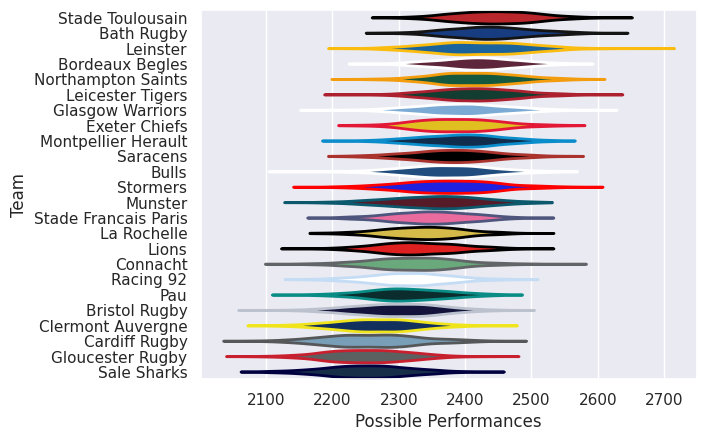
# Standings

## Projected Remaining Table

| Club                 |   To Play |   Projected Wins |   Projected Differential |   Projected Losing Bonus Points | Projected Try Bonus Points   |   Projected Competition Points |
|:---------------------|----------:|-----------------:|-------------------------:|--------------------------------:|:-----------------------------|-------------------------------:|
| Northampton Saints   |         1 |            0.952 |                   12.548 |                           0.029 |                              |                          3.869 |
| Stormers             |         1 |            0.89  |                    9.427 |                           0.074 |                              |                          3.682 |
| Stade Toulousain     |         1 |            0.881 |                    8.63  |                           0.085 |                              |                          3.659 |
| La Rochelle          |         1 |            0.88  |                    7.768 |                           0.086 |                              |                          3.654 |
| Bulls                |         1 |            0.781 |                    5.976 |                           0.143 |                              |                          3.349 |
| Bath Rugby           |         1 |            0.766 |                    5.545 |                           0.165 |                              |                          3.317 |
| Connacht             |         1 |            0.725 |                    4.844 |                           0.182 |                              |                          3.176 |
| Munster              |         1 |            0.65  |                    3.876 |                           0.233 |                              |                          2.953 |
| Bordeaux Begles      |         1 |            0.591 |                    2.089 |                           0.283 |                              |                          2.757 |
| Glasgow Warriors     |         1 |            0.531 |                    1.008 |                           0.314 |                              |                          2.548 |
| Leinster             |         1 |            0.522 |                    0.842 |                           0.322 |                              |                          2.506 |
| Pau                  |         1 |            0.51  |                    0.591 |                           0.311 |                              |                          2.467 |
| Leicester Tigers     |         1 |            0.432 |                   -0.591 |                           0.346 |                              |                          2.19  |
| Clermont Auvergne    |         1 |            0.43  |                   -0.842 |                           0.36  |                              |                          2.176 |
| Sale Sharks          |         1 |            0.414 |                   -1.008 |                           0.365 |                              |                          2.131 |
| Gloucester Rugby     |         1 |            0.354 |                   -2.089 |                           0.381 |                              |                          1.907 |
| Racing 92            |         1 |            0.29  |                   -3.876 |                           0.321 |                              |                          1.601 |
| Saracens             |         1 |            0.228 |                   -4.844 |                           0.371 |                              |                          1.377 |
| Montpellier Herault  |         1 |            0.19  |                   -5.545 |                           0.377 |                              |                          1.225 |
| Stade Francais Paris |         1 |            0.178 |                   -5.976 |                           0.369 |                              |                          1.163 |
| Lions                |         1 |            0.096 |                   -7.768 |                           0.372 |                              |                          0.804 |
| Exeter Chiefs        |         1 |            0.094 |                   -8.63  |                           0.319 |                              |                          0.745 |
| Bristol Rugby        |         1 |            0.086 |                   -9.427 |                           0.28  |                              |                          0.672 |
| Cardiff Rugby        |         1 |            0.032 |                  -12.548 |                           0.181 |                              |                          0.341 |

## Projected Total Table

| Club                 |   Played |   Wins |   Point Differential |   Losing Bonus Points | Try Bonus Points   |   Competition Points |
|:---------------------|---------:|-------:|---------------------:|----------------------:|:-------------------|---------------------:|
| Northampton Saints   |        1 |  0.952 |               12.548 |                 0.029 |                    |                3.869 |
| Stormers             |        1 |  0.89  |                9.427 |                 0.074 |                    |                3.682 |
| Stade Toulousain     |        1 |  0.881 |                8.63  |                 0.085 |                    |                3.659 |
| La Rochelle          |        1 |  0.88  |                7.768 |                 0.086 |                    |                3.654 |
| Bulls                |        1 |  0.781 |                5.976 |                 0.143 |                    |                3.349 |
| Bath Rugby           |        1 |  0.766 |                5.545 |                 0.165 |                    |                3.317 |
| Connacht             |        1 |  0.725 |                4.844 |                 0.182 |                    |                3.176 |
| Munster              |        1 |  0.65  |                3.876 |                 0.233 |                    |                2.953 |
| Bordeaux Begles      |        1 |  0.591 |                2.089 |                 0.283 |                    |                2.757 |
| Glasgow Warriors     |        1 |  0.531 |                1.008 |                 0.314 |                    |                2.548 |
| Leinster             |        1 |  0.522 |                0.842 |                 0.322 |                    |                2.506 |
| Pau                  |        1 |  0.51  |                0.591 |                 0.311 |                    |                2.467 |
| Leicester Tigers     |        1 |  0.432 |               -0.591 |                 0.346 |                    |                2.19  |
| Clermont Auvergne    |        1 |  0.43  |               -0.842 |                 0.36  |                    |                2.176 |
| Sale Sharks          |        1 |  0.414 |               -1.008 |                 0.365 |                    |                2.131 |
| Gloucester Rugby     |        1 |  0.354 |               -2.089 |                 0.381 |                    |                1.907 |
| Racing 92            |        1 |  0.29  |               -3.876 |                 0.321 |                    |                1.601 |
| Saracens             |        1 |  0.228 |               -4.844 |                 0.371 |                    |                1.377 |
| Montpellier Herault  |        1 |  0.19  |               -5.545 |                 0.377 |                    |                1.225 |
| Stade Francais Paris |        1 |  0.178 |               -5.976 |                 0.369 |                    |                1.163 |
| Lions                |        1 |  0.096 |               -7.768 |                 0.372 |                    |                0.804 |
| Exeter Chiefs        |        1 |  0.094 |               -8.63  |                 0.319 |                    |                0.745 |
| Bristol Rugby        |        1 |  0.086 |               -9.427 |                 0.28  |                    |                0.672 |
| Cardiff Rugby        |        1 |  0.032 |              -12.548 |                 0.181 |                    |                0.341 |

# Future Predictions

## Week 1

### Gloucester Rugby V Bordeaux Begles on 2026/10/16

Average Margin: Bordeaux Begles by 2.1

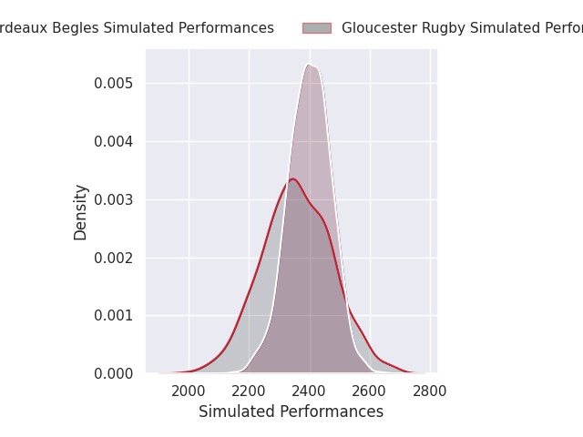

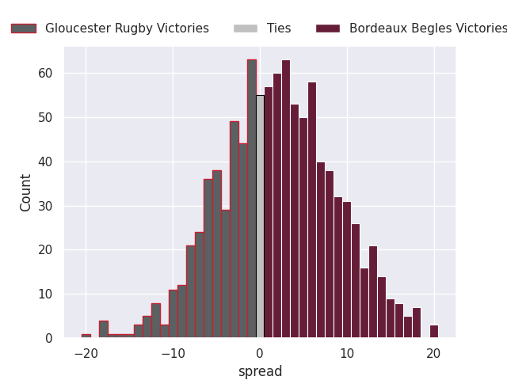

### Clermont Auvergne V Leinster on 2026/10/17

Average Margin: Leinster by 0.8

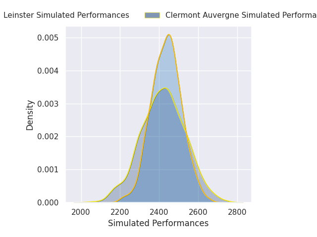

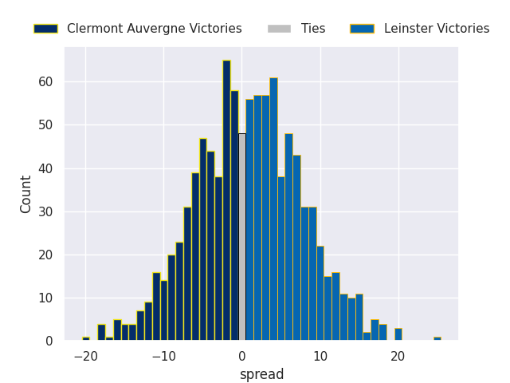

### Sale Sharks V Glasgow Warriors on 2026/10/17

Average Margin: Glasgow Warriors by 1.0

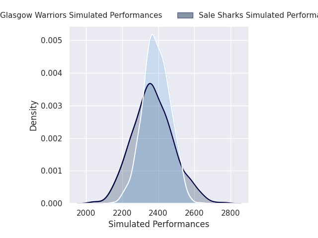

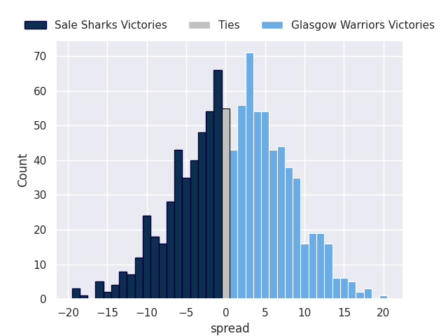

### Stormers V Bristol Rugby on 2026/10/17

Average Margin: Stormers by 9.4

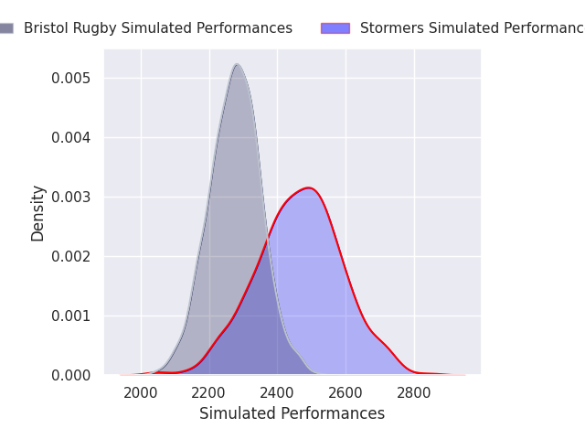
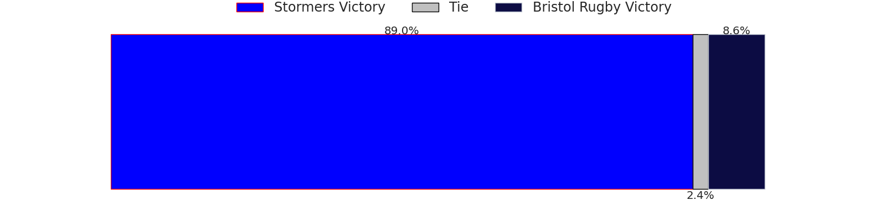
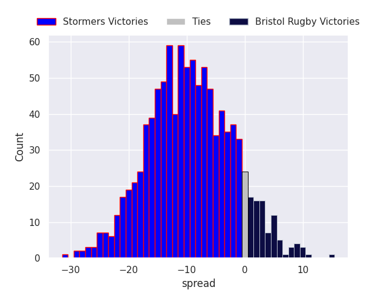

### Bath Rugby V Montpellier Herault on 2026/10/17

Average Margin: Bath Rugby by 5.5

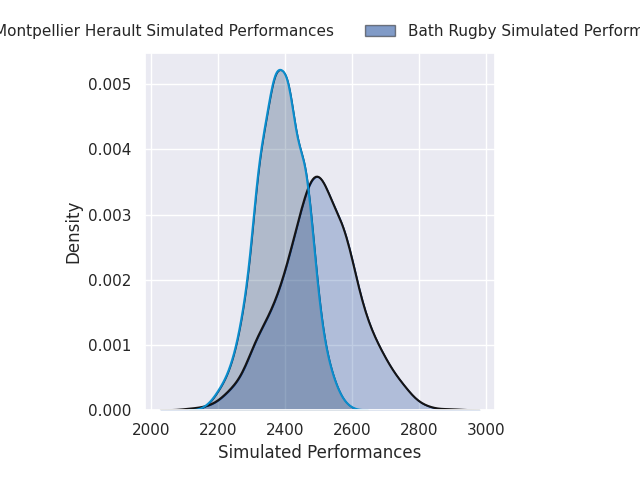
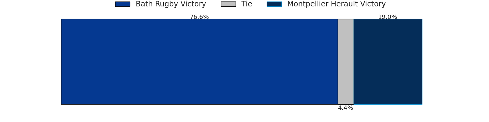
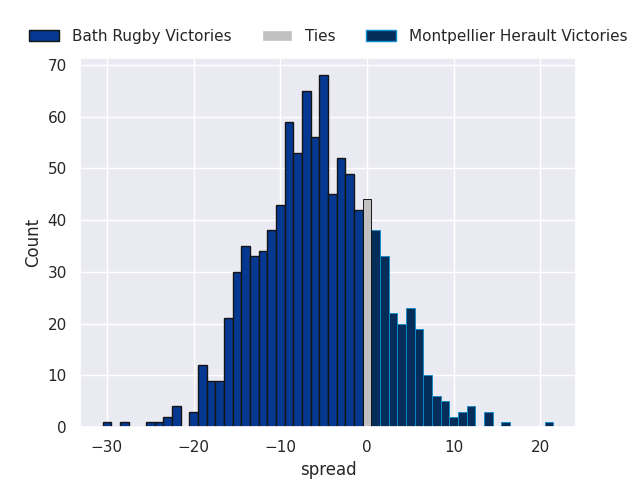

### La Rochelle V Lions on 2026/10/17

Average Margin: La Rochelle by 7.8

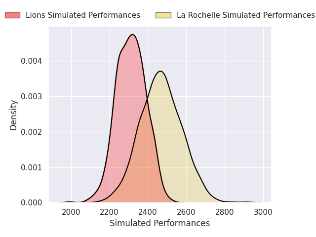
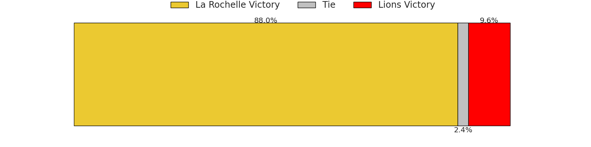
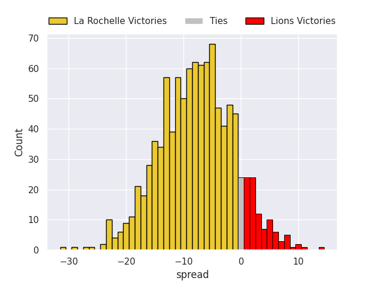

### Munster V Racing 92 on 2026/10/17

Average Margin: Munster by 3.9

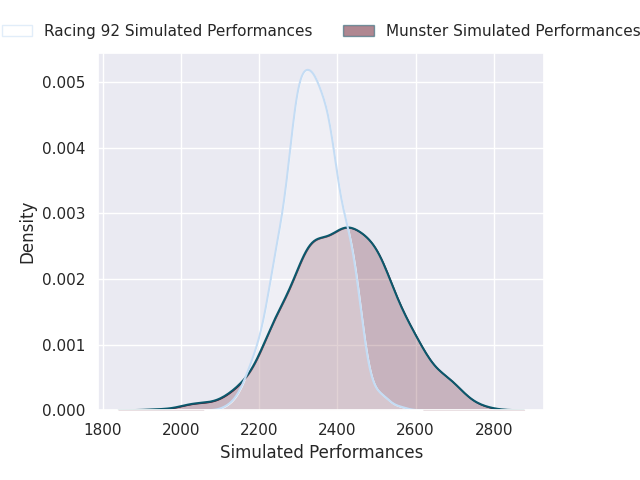

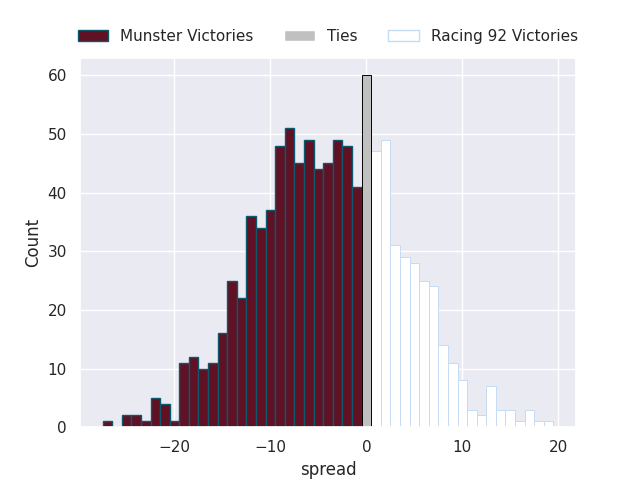

### Bulls V Stade Francais Paris on 2026/10/17

Average Margin: Bulls by 6.0

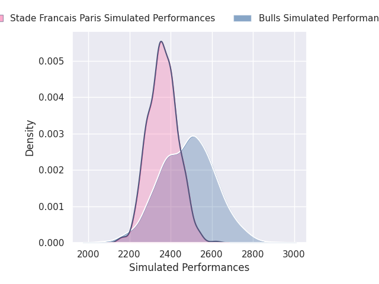

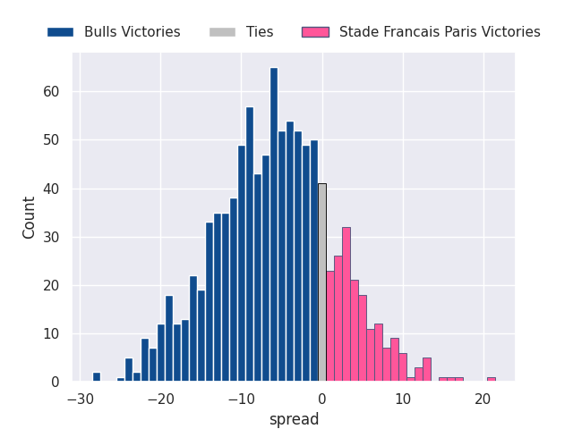

### Connacht V Saracens on 2026/10/17

Average Margin: Connacht by 4.8

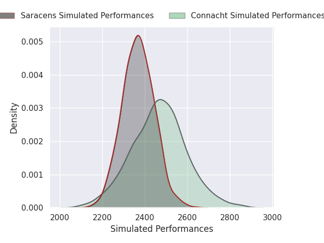

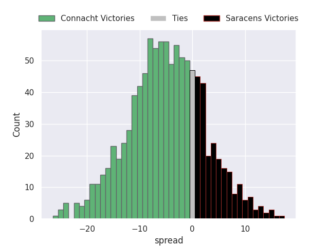

### Pau V Leicester Tigers on 2026/10/18

Average Margin: Pau by 0.6

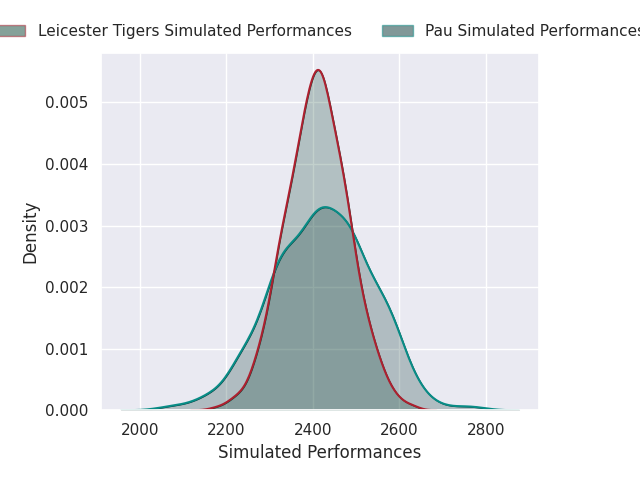

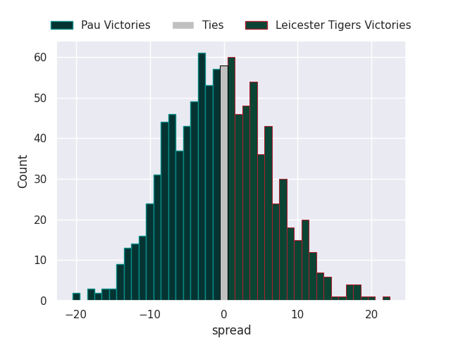

### Stade Toulousain V Exeter Chiefs on 2026/10/18

Average Margin: Stade Toulousain by 8.6

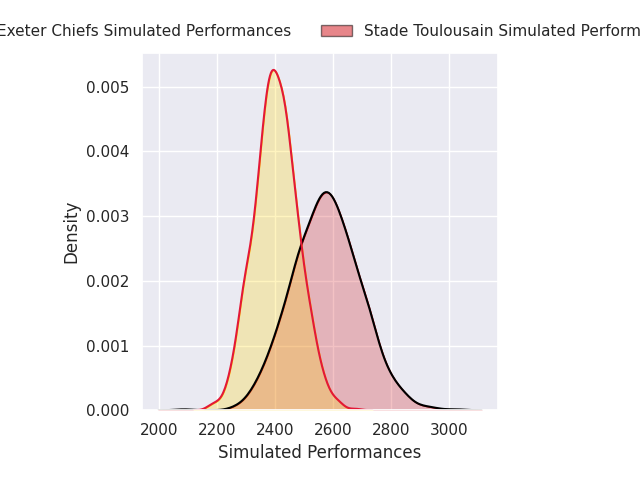
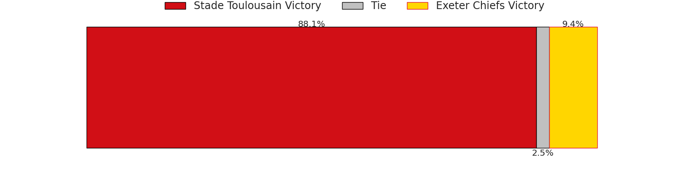
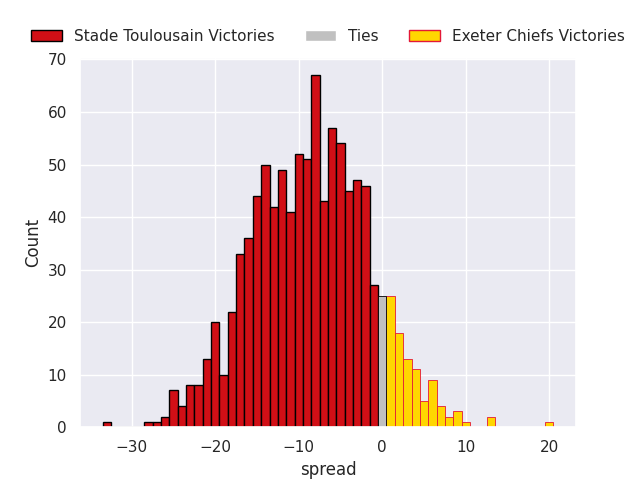

### Northampton Saints V Cardiff Rugby on 2026/10/18

Average Margin: Northampton Saints by 12.5

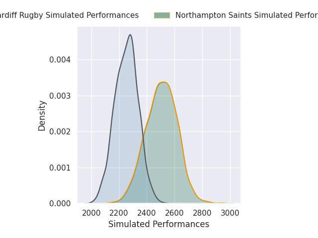
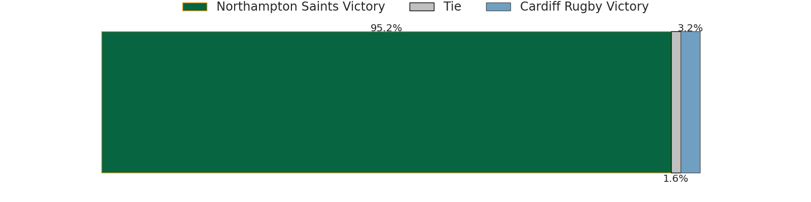
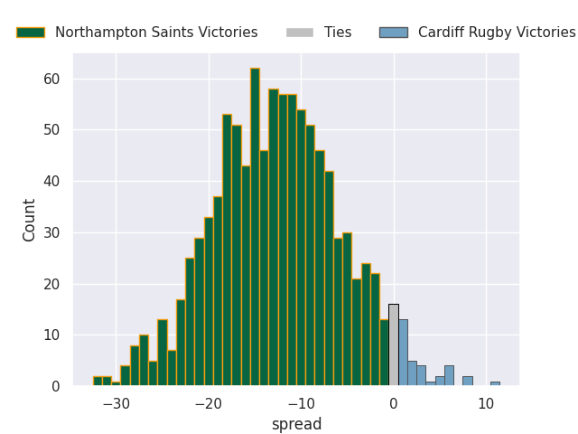

