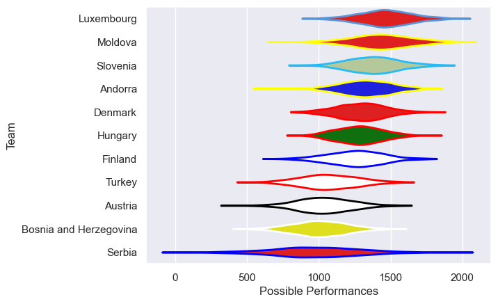
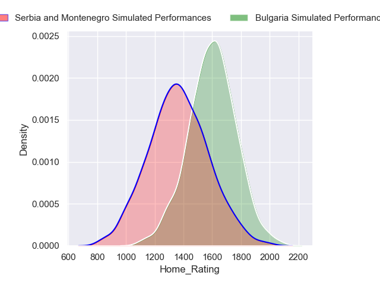
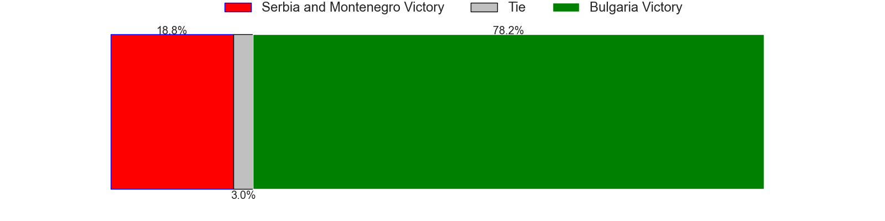
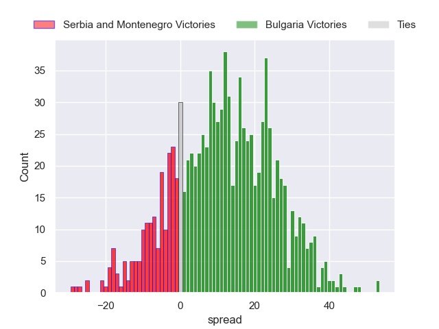

---  
title: "FIRA Championship D2 2024 Status"  
date: 2024-04-15 6:00:00 -0500  
categories: model review projection  
layout: article  
aside:  
    toc: true  
---
# Current Team Rankings

# Standings

## Current Standings

| Club                   |   Played |   Wins |   Point Differential |   Losing Bonus Points |   Try Bonus Points |   Competition Points |
|:-----------------------|---------:|-------:|---------------------:|----------------------:|-------------------:|---------------------:|
| Luxembourg             |        2 |      2 |                   62 |                     0 |                nan |                    8 |
| Moldova                |        2 |      2 |                   29 |                     0 |                nan |                    8 |
| Latvia                 |        1 |      1 |                   45 |                     0 |                nan |                    4 |
| Hungary                |        2 |      1 |                   12 |                     0 |                nan |                    4 |
| Slovenia               |        1 |      1 |                   12 |                     0 |                nan |                    4 |
| Malta                  |        1 |      1 |                    5 |                     0 |                nan |                    4 |
| Finland                |        1 |      1 |                    4 |                     0 |                nan |                    4 |
| Denmark                |        2 |      0 |                   -4 |                     1 |                nan |                    3 |
| Andorra                |        1 |      0 |                    0 |                     0 |                nan |                    2 |
| Turkey                 |        1 |      0 |                   -4 |                     1 |                nan |                    1 |
| Cyprus                 |        1 |      0 |                   -5 |                     1 |                nan |                    1 |
| Serbia                 |        1 |      0 |                  -25 |                     0 |                nan |                    0 |
| Austria                |        2 |      0 |                  -37 |                     0 |                nan |                    0 |
| Norway                 |        1 |      0 |                  -45 |                     0 |                nan |                    0 |
| Bosnia and Herzegovina |        1 |      0 |                  -49 |                     0 |                nan |                    0 |

## Projected Remaining Table

| Club                  |   Matches Remaining |   Wins |   Point Differential |   Losing Bonus Points |   Try Bonus Points |   Competition Points |
|:----------------------|--------------------:|-------:|---------------------:|----------------------:|-------------------:|---------------------:|
| Bulgaria              |                   1 |    0.8 |              11.7116 |                   0.1 |                0.4 |                  3.7 |
| Serbia and Montenegro |                   1 |    0.2 |             -11.7116 |                   0.2 |                0.2 |                  1.1 |

## Projected Total Table

| Club                   |   Total Matches |   Wins |   Point Differential |   Losing Bonus Points |   Try Bonus Points |   Competition Points |
|:-----------------------|----------------:|-------:|---------------------:|----------------------:|-------------------:|---------------------:|
| Luxembourg             |               2 |    2   |              62      |                   0   |                0   |                  8   |
| Moldova                |               2 |    2   |              29      |                   0   |                0   |                  8   |
| Latvia                 |               1 |    1   |              45      |                   0   |                0   |                  4   |
| Hungary                |               2 |    1   |              12      |                   0   |                0   |                  4   |
| Slovenia               |               1 |    1   |              12      |                   0   |                0   |                  4   |
| Malta                  |               1 |    1   |               5      |                   0   |                0   |                  4   |
| Finland                |               1 |    1   |               4      |                   0   |                0   |                  4   |
| Bulgaria               |               1 |    0.8 |              11.7116 |                   0.1 |                0.4 |                  3.7 |
| Denmark                |               2 |    0   |              -4      |                   1   |                0   |                  3   |
| Andorra                |               1 |    0   |               0      |                   0   |                0   |                  2   |
| Serbia and Montenegro  |               1 |    0.2 |             -11.7116 |                   0.2 |                0.2 |                  1.1 |
| Turkey                 |               1 |    0   |              -4      |                   1   |                0   |                  1   |
| Cyprus                 |               1 |    0   |              -5      |                   1   |                0   |                  1   |
| Serbia                 |               1 |    0   |             -25      |                   0   |                0   |                  0   |
| Austria                |               2 |    0   |             -37      |                   0   |                0   |                  0   |
| Norway                 |               1 |    0   |             -45      |                   0   |                0   |                  0   |
| Bosnia and Herzegovina |               1 |    0   |             -49      |                   0   |                0   |                  0   |

# Completed Match Review

| Model | Percent Correct Predictions | Spread Error |
| ------ | ------ | ------ |
| Club Level | 70.0% | 18.3 |
| Player Level: Lineup | nan% | nan |
| Player Level: Minutes | nan% | nan |

# Future Predictions

## Week 3

### Bulgaria V Serbia and Montenegro on 2024/04/19

Average Margin: Bulgaria by 11.7

Average Scoreline: 31-19

