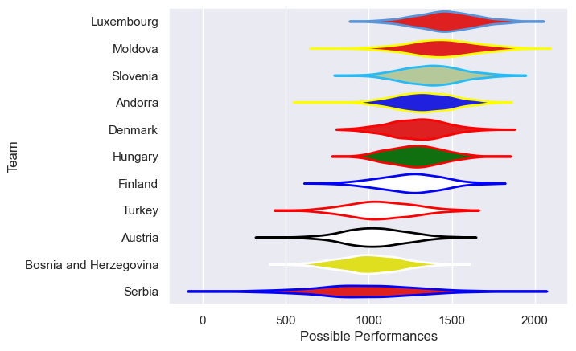
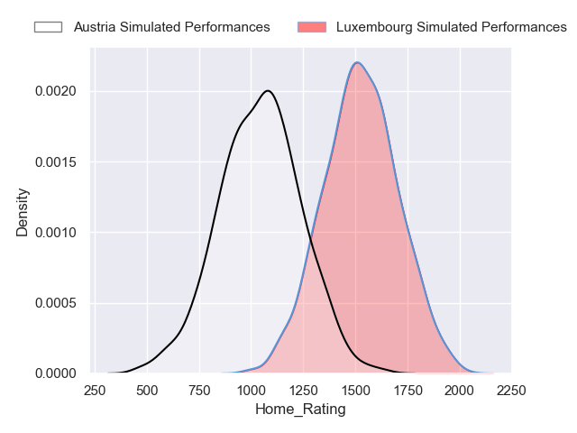
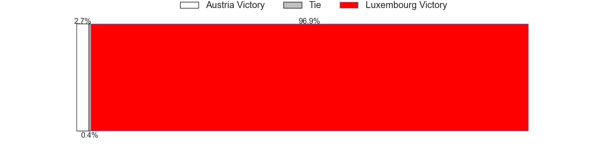
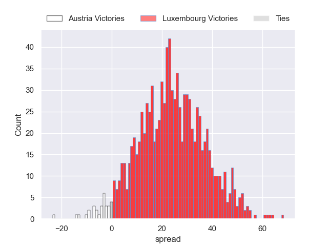

---  
title: "FIRA Championship D2 2024 Status"  
date: 2023-11-01 6:00:00 -0500  
categories: model review projection  
layout: article  
aside:  
    toc: true  
---
# Current Team Rankings

# Standings

## Current Standings

| Club                   |   Played |   Wins |   Point Differential |   Losing Bonus Points |   Try Bonus Points |   Competition Points |
|:-----------------------|---------:|-------:|---------------------:|----------------------:|-------------------:|---------------------:|
| Moldova                |        2 |      2 |                   29 |                     0 |                nan |                    8 |
| Luxembourg             |        1 |      1 |                   49 |                     0 |                nan |                    4 |
| Hungary                |        2 |      1 |                   12 |                     0 |                nan |                    4 |
| Slovenia               |        1 |      1 |                   12 |                     0 |                nan |                    4 |
| Finland                |        1 |      1 |                    4 |                     0 |                nan |                    4 |
| Denmark                |        2 |      0 |                   -4 |                     1 |                nan |                    3 |
| Andorra                |        1 |      0 |                    0 |                     0 |                nan |                    2 |
| Turkey                 |        1 |      0 |                   -4 |                     1 |                nan |                    1 |
| Austria                |        1 |      0 |                  -24 |                     0 |                nan |                    0 |
| Serbia                 |        1 |      0 |                  -25 |                     0 |                nan |                    0 |
| Bosnia and Herzegovina |        1 |      0 |                  -49 |                     0 |                nan |                    0 |

## Projected Remaining Table

| Club       |   Matches Remaining |   Wins |   Point Differential |   Losing Bonus Points |   Try Bonus Points |   Competition Points |
|:-----------|--------------------:|-------:|---------------------:|----------------------:|-------------------:|---------------------:|
| Luxembourg |                   1 |      1 |                 23.7 |                   0   |                  1 |                  4.9 |
| Austria    |                   1 |      0 |                -23.7 |                   0.1 |                  0 |                  0.2 |

## Projected Total Table

| Club                   |   Total Matches |   Wins |   Point Differential |   Losing Bonus Points |   Try Bonus Points |   Competition Points |
|:-----------------------|----------------:|-------:|---------------------:|----------------------:|-------------------:|---------------------:|
| Luxembourg             |               2 |      2 |                 72.7 |                   0   |                  1 |                  8.9 |
| Moldova                |               2 |      2 |                 29   |                   0   |                  0 |                  8   |
| Hungary                |               2 |      1 |                 12   |                   0   |                  0 |                  4   |
| Slovenia               |               1 |      1 |                 12   |                   0   |                  0 |                  4   |
| Finland                |               1 |      1 |                  4   |                   0   |                  0 |                  4   |
| Denmark                |               2 |      0 |                 -4   |                   1   |                  0 |                  3   |
| Andorra                |               1 |      0 |                  0   |                   0   |                  0 |                  2   |
| Turkey                 |               1 |      0 |                 -4   |                   1   |                  0 |                  1   |
| Austria                |               2 |      0 |                -47.7 |                   0.1 |                  0 |                  0.2 |
| Serbia                 |               1 |      0 |                -25   |                   0   |                  0 |                  0   |
| Bosnia and Herzegovina |               1 |      0 |                -49   |                   0   |                  0 |                  0   |

# Completed Match Review

| Model | Percent Correct Predictions | Spread Error |
| ------ | ------ | ------ |
| Club Level | 42.9% | 20.1 |
| Player Level: Lineup | nan% | nan |
| Player Level: Minutes | nan% | nan |

# Future Predictions

## Week 3

### Luxembourg V Austria on 2023/11/03

Average Margin: Luxembourg by 24.2

