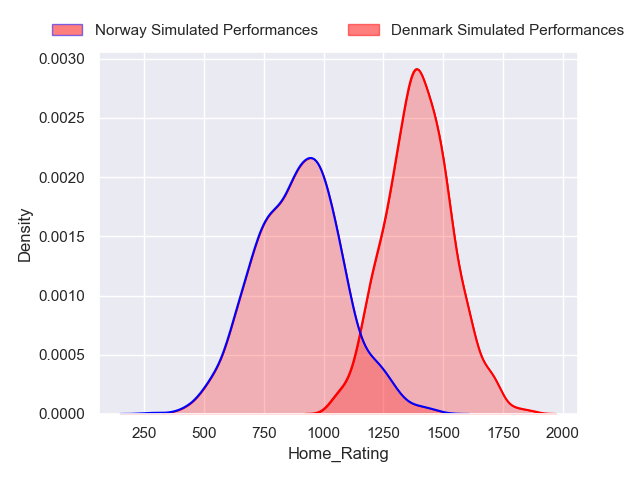
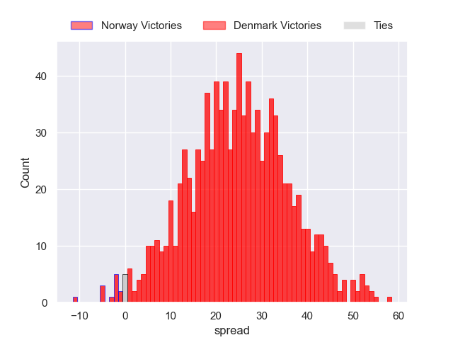
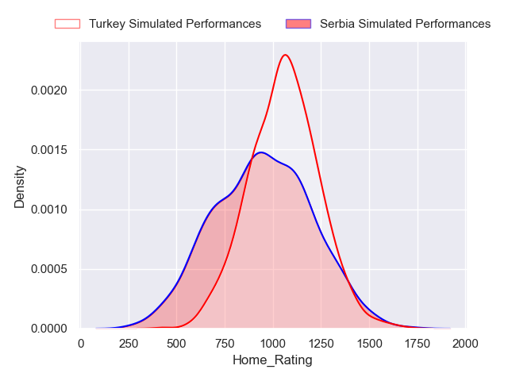
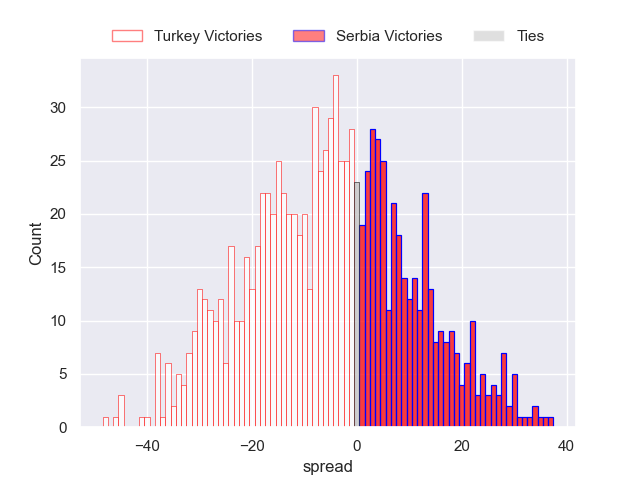
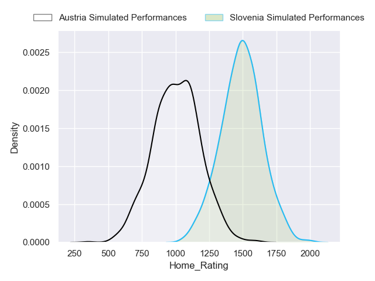
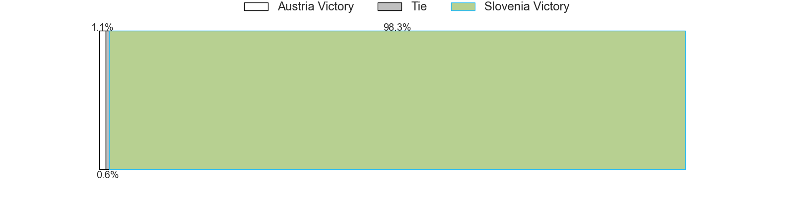
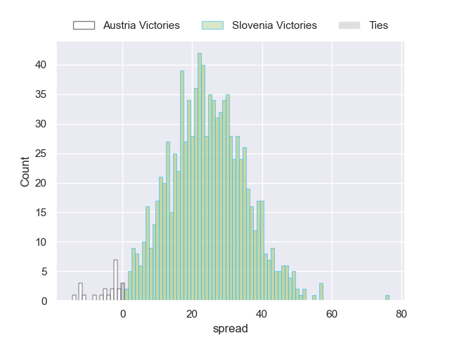

---  
title: "FT 2024 Status"  
date: 2024-04-08 6:00:00 -0500  
categories: model review projection  
layout: article  
aside:  
    toc: true  
---
# Current Team Rankings

# Standings

## Projected Total Table

| Club     |   Total Matches |   Wins |   Point Differential |   Losing Bonus Points |   Try Bonus Points |   Competition Points |
|:---------|----------------:|-------:|---------------------:|----------------------:|-------------------:|---------------------:|
| Denmark  |               1 |    1   |             24.4571  |                   0   |                0.8 |                  4.8 |
| Slovenia |               1 |    0.9 |             16.0774  |                   0.1 |                0.7 |                  4.5 |
| Turkey   |               1 |    0.6 |              5.35887 |                   0.1 |                0.4 |                  3   |
| Serbia   |               1 |    0.4 |             -5.35887 |                   0.2 |                0.2 |                  1.8 |
| Austria  |               1 |    0.1 |            -16.0774  |                   0.1 |                0.2 |                  0.6 |
| Norway   |               1 |    0   |            -24.4571  |                   0   |                0.2 |                  0.3 |

# Future Predictions

## Week 1

### Denmark V Norway on 2024/04/13

Average Margin: Denmark by 24.5

Average Scoreline: 57-32

### Serbia V Turkey on 2024/04/13

Average Margin: Turkey by 5.4

Average Scoreline: 29-24

### Slovenia V Austria on 2024/04/13

Average Margin: Slovenia by 16.1

Average Scoreline: 42-26

