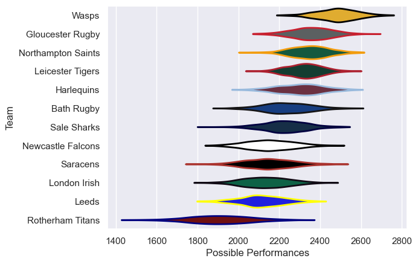

---  
title: "Gallagher Premiership 03/04 Status"  
date: 2025-07-28 6:00:00 -0500  
categories: model review projection  
layout: article  
aside:  
    toc: true  
---
# Current Team Rankings

# Standings

## Current Standings

| Club               |   Played |   Wins |   Point Differential |   Losing Bonus Points |   Try Bonus Points |   Competition Points |
|:-------------------|---------:|-------:|---------------------:|----------------------:|-------------------:|---------------------:|
| Bath Rugby         |       23 |     18 |                  193 |                     4 |                    |                   76 |
| Wasps              |       24 |     18 |                  210 |                     3 |                    |                   75 |
| Northampton Saints |       23 |     15 |                  121 |                     2 |                    |                   64 |
| Gloucester Rugby   |       23 |     15 |                   88 |                     3 |                    |                   63 |
| Leicester Tigers   |       24 |     13 |                  145 |                     2 |                  1 |                   61 |
| Harlequins         |       23 |     10 |                   36 |                     6 |                    |                   50 |
| Sale Sharks        |       24 |      9 |                    8 |                     6 |                    |                   48 |
| London Irish       |       22 |     10 |                  -27 |                     6 |                    |                   48 |
| Newcastle Falcons  |       22 |      7 |                  -28 |                     9 |                    |                   41 |
| Saracens           |       22 |      8 |                 -146 |                     3 |                    |                   37 |
| Leeds              |       22 |      7 |                 -139 |                     3 |                    |                   33 |
| Rotherham Titans   |       22 |      0 |                 -461 |                     3 |                    |                    3 |

# Completed Match Review

| Model | Percent Correct Predictions | Spread Error |
| ------ | ------ | ------ |
| Club Level | 66.4% | 11.7 |
| Player Level: Lineup | nan% | nan |
| Player Level: Minutes | nan% | nan |

